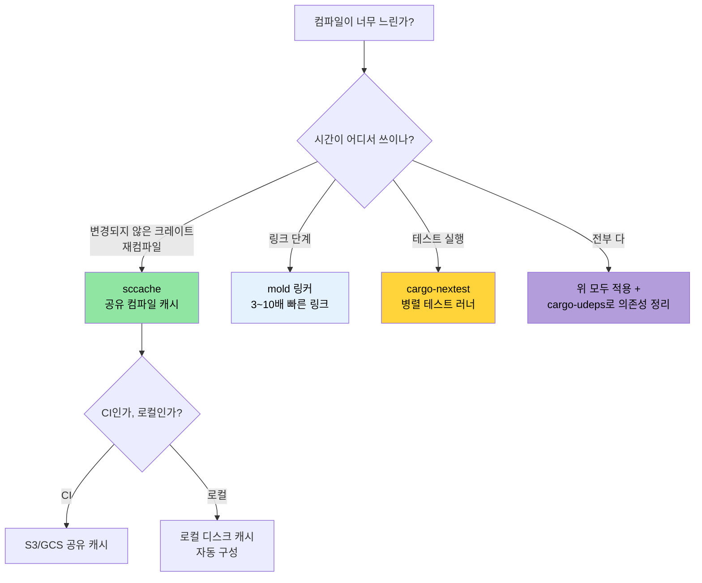

<a id="compile-time-and-developer-tools"></a>
# 컴파일 시간과 개발자 도구 🟡

> **이 장에서 배우는 것:**
> - 로컬 및 CI 빌드를 위한 `sccache` 컴파일 캐시
> - `mold`를 사용한 더 빠른 링크 단계 (기본 링커보다 3~10배 빠름)
> - 더 빠르고 더 많은 정보를 주는 테스트 러너 `cargo-nextest`
> - 내부를 들여다보는 개발자 도구: `cargo-expand`, `cargo-geiger`, `cargo-watch`
> - 워크스페이스 린트, MSRV 정책, 그리고 CI 검증 항목으로서의 문서화
>
> **교차 참고:** [릴리스 프로파일](ch07-release-profiles-and-binary-size.md) — LTO와 바이너리 크기 최적화 · [CI/CD 파이프라인](ch11-putting-it-all-together-a-production-cic.md) — 이 도구들을 파이프라인에 통합하는 방법 · [의존성 관리](ch06-dependency-management-and-supply-chain-s.md) — 의존성이 적을수록 컴파일도 빨라진다

<a id="compile-time-optimization-sccache-mold-cargo-nextest"></a>
### 컴파일 시간 최적화: `sccache`, `mold`, `cargo-nextest`

긴 컴파일 시간은 Rust 개발자가 가장 자주 겪는 고통입니다. 이 도구들을 함께 쓰면 반복 개발 시간을 50~80%까지 줄일 수 있습니다.

**`sccache` — 공유 컴파일 캐시:**

```bash
# 설치
cargo install sccache

# Rust 컴파일러 래퍼로 설정
export RUSTC_WRAPPER=sccache

# 또는 .cargo/config.toml에 영구 설정:
# [build]
# rustc-wrapper = "sccache"

# 첫 빌드: 일반 속도 (캐시를 채움)
cargo build --release  # 3분

# clean 후 재빌드: 변경되지 않은 크레이트는 캐시 적중
cargo clean && cargo build --release  # 45초

# 캐시 통계 확인
sccache --show-stats
# Compile requests        1,234
# Cache hits               987 (80%)
# Cache misses             247
```

`sccache`는 공유 캐시(S3, GCS, Azure Blob)도 지원하므로 팀 전체와 CI에서 캐시를 함께 사용할 수 있습니다.

**`mold` — 더 빠른 링커:**

링크 단계는 종종 가장 느린 구간입니다. `mold`는 `lld`보다 3~5배, 기본 GNU `ld`보다 10~20배 빠를 수 있습니다.

```bash
# 설치
sudo apt install mold  # Ubuntu 22.04+
# 참고: mold는 ELF 타깃(Linux)용이다. macOS는 ELF가 아니라 Mach-O를 사용한다.
# macOS 링커(ld64)는 이미 꽤 빠르며, 더 빠른 것이 필요하다면:
# brew install sold     # sold = Mach-O용 mold (실험적, 성숙도 낮음)
# 실전에서는 macOS 링크 시간이 병목인 경우가 드물다.

# 링크에 mold 사용
# .cargo/config.toml
[target.x86_64-unknown-linux-gnu]
rustflags = ["-C", "link-arg=-fuse-ld=mold"]

# 실제로 mold가 쓰이는지 확인
cargo build -v 2>&1 | grep mold
```

**`cargo-nextest` — 더 빠른 테스트 러너:**

```bash
# 설치
cargo install cargo-nextest

# 테스트 실행 (기본 병렬 실행, 테스트별 타임아웃, 재시도 지원)
cargo nextest run

# cargo test 대비 주요 장점:
# - 각 테스트가 별도 프로세스에서 실행됨 → 격리가 더 좋음
# - 똑똑한 스케줄링을 통한 병렬 실행
# - 테스트별 타임아웃 지원 (CI가 멈춰 있는 문제 감소)
# - CI용 JUnit XML 출력
# - 실패한 테스트 재시도 가능

# 설정 예시
cargo nextest run --retries 2 --fail-fast

# 테스트 바이너리 아카이브 (CI에서 한 번 빌드하고 여러 머신에서 테스트할 때 유용)
cargo nextest archive --archive-file tests.tar.zst
cargo nextest run --archive-file tests.tar.zst
```

```toml
# .config/nextest.toml
[profile.default]
retries = 0
slow-timeout = { period = "60s", terminate-after = 3 }
fail-fast = true

[profile.ci]
retries = 2
fail-fast = false
junit = { path = "test-results.xml" }
```

**개발용 통합 설정:**

```toml
# .cargo/config.toml — 개발자의 내부 반복 루프 최적화
[build]
rustc-wrapper = "sccache"       # 컴파일 산출물 캐시

[target.x86_64-unknown-linux-gnu]
rustflags = ["-C", "link-arg=-fuse-ld=mold"]  # 더 빠른 링크

# 개발 프로파일: 내 코드는 최적화하지 않고 의존성만 최적화
# (Cargo.toml에 둔다)
# [profile.dev.package."*"]
# opt-level = 2
```

<a id="cargo-expand-and-cargo-geiger-visibility-tools"></a>
### `cargo-expand`와 `cargo-geiger` — 내부를 들여다보는 도구

**`cargo-expand`** — 매크로가 실제로 무엇을 생성하는지 확인:

```bash
cargo install cargo-expand

# 특정 모듈에서 모든 매크로 확장 보기
cargo expand --lib accel_diag::vendor

# 특정 derive 확장 보기
# 예: #[derive(Debug, Serialize, Deserialize)]
# cargo expand는 생성된 impl 블록을 보여준다
cargo expand --lib --tests
```

이 도구는 `#[derive]` 매크로 출력, `macro_rules!` 확장, 그리고 `serde`가 타입에 대해 실제로 어떤 코드를 생성하는지 이해할 때 매우 유용합니다.

**`cargo-geiger`** — 의존성 트리 전반의 `unsafe` 사용량 집계:**

```bash
cargo install cargo-geiger

cargo geiger
# 출력:
# Metric output format: x/y
#   x = 빌드에서 실제로 사용된 unsafe 코드 수
#   y = 크레이트에서 발견된 전체 unsafe 코드 수
#
# Functions  Expressions  Impls  Traits  Methods
# 0/0        0/0          0/0    0/0     0/0      ✅ my_crate
# 0/5        0/23         0/2    0/0     0/3      ✅ serde
# 3/3        14/14        0/0    0/0     2/2      ❗ libc
# 15/15      142/142      4/4    0/0     12/12    ☢️ ring
#
# 기호 의미:
# ✅ = unsafe 사용 없음
# ❗ = 일부 unsafe 사용
# ☢️ = unsafe 사용량이 많음
```

프로젝트가 zero-unsafe 정책을 갖고 있다면, `cargo geiger`는 내가 실제로 호출하는 경로에 `unsafe`가 새로 유입되는지 점검하는 출발점이 됩니다.

<a id="workspace-lints-workspacelints"></a>
### 워크스페이스 린트 — `[workspace.lints]`

Rust 1.74부터는 `Cargo.toml`에서 Clippy와 컴파일러 린트를 중앙 설정할 수 있습니다. 이제 각 크레이트 맨 위에 `#![deny(...)]`를 반복해서 적지 않아도 됩니다.

```toml
# 루트 Cargo.toml — 모든 크레이트에 대한 린트 설정
[workspace.lints.clippy]
unwrap_used = "warn"         # 가능하면 ? 또는 expect("reason") 사용
dbg_macro = "deny"           # 커밋된 코드에 dbg!() 금지
todo = "warn"                # 미완성 구현 추적
large_enum_variant = "warn"  # 실수로 enum 크기가 커지는 것 방지

[workspace.lints.rust]
unsafe_code = "deny"         # zero-unsafe 정책 강제
missing_docs = "warn"        # 문서화를 장려
```

```toml
# 각 크레이트의 Cargo.toml — 워크스페이스 린트 사용 선언
[lints]
workspace = true
```

이 방식은 여기저기 흩어진 `#![deny(clippy::unwrap_used)]` 속성을 대체하고, 워크스페이스 전체에 일관된 정책을 적용하게 해줍니다.

**Clippy 경고 자동 수정:**

```bash
# Clippy가 기계적으로 적용 가능한 제안을 자동 수정하게 함
cargo clippy --fix --workspace --all-targets --allow-dirty

# 동작이 달라질 수 있는 제안까지 함께 적용 (반드시 검토!)
cargo clippy --fix --workspace --all-targets --allow-dirty -- -W clippy::pedantic
```

> **팁:** 커밋 전에 `cargo clippy --fix`를 돌리세요. 사용하지 않는 import, 불필요한 clone, 타입 단순화처럼 손으로 고치기 번거로운 사소한 문제를 잘 처리해 줍니다.

<a id="msrv-policy-and-rust-version"></a>
### MSRV 정책과 `rust-version`

MSRV(Minimum Supported Rust Version, 최소 지원 Rust 버전)는 내 크레이트가 더 오래된 툴체인에서도 컴파일되도록 보장합니다. Rust 버전이 고정된 환경에 배포할 때 특히 중요합니다.

```toml
# Cargo.toml
[package]
name = "diag_tool"
version = "0.1.0"
rust-version = "1.75"    # 필요한 최소 Rust 버전
```

```bash
# MSRV 준수 여부 확인
cargo +1.75.0 check --workspace

# 자동으로 MSRV 탐색
cargo install cargo-msrv
cargo msrv find
# 출력: Minimum Supported Rust Version is 1.75.0

# CI에서 검증
cargo msrv verify
```

**CI에서의 MSRV:**

```yaml
jobs:
  msrv:
    name: Check MSRV
    runs-on: ubuntu-latest
    steps:
      - uses: actions/checkout@v4
      - uses: dtolnay/rust-toolchain@master
        with:
          toolchain: "1.75.0"    # Cargo.toml의 rust-version과 맞춘다
      - run: cargo check --workspace
```

**MSRV 전략:**
- **바이너리 애플리케이션**(대형 프로젝트 같은 경우): 최신 stable을 써도 된다. 별도 MSRV가 꼭 필요하지는 않다.
- **라이브러리 크레이트**(crates.io에 배포하는 경우): 사용하는 모든 기능을 지원하는 가장 오래된 Rust 버전으로 MSRV를 잡는다. 흔히 현재 기준 `N-2`를 쓴다.
- **엔터프라이즈 배포**: 운영 환경에 설치된 가장 오래된 Rust 버전에 맞춰 MSRV를 정한다.

<a id="application-production-binary-profile"></a>
### 실전 적용: 프로덕션 바이너리 프로파일

이 프로젝트는 이미 훌륭한 [릴리스 프로파일](ch07-release-profiles-and-binary-size.md)을 갖추고 있습니다.

```toml
# 현재 워크스페이스 Cargo.toml
[profile.release]
lto = true           # ✅ 크레이트 전반 최적화
codegen-units = 1    # ✅ 최적화 기회 극대화
panic = "abort"      # ✅ 언와인딩 오버헤드 제거
strip = true         # ✅ 배포용 심볼 제거

[profile.dev]
opt-level = 0        # ✅ 빠른 컴파일
debug = true         # ✅ 전체 디버그 정보
```

**추가로 권장하는 설정:**

```toml
# 개발 모드에서 의존성 최적화 (테스트 실행이 더 빨라짐)
[profile.dev.package."*"]
opt-level = 2

# 테스트 프로파일: 느린 테스트의 타임아웃을 줄이기 위한 약간의 최적화
[profile.test]
opt-level = 1

# 릴리스에서도 오버플로 검사를 유지 (안전성)
[profile.release]
lto = true
codegen-units = 1
panic = "abort"
strip = true
overflow-checks = true    # ← 추가 권장: 정수 오버플로 감지
debug = "line-tables-only" # ← 추가 권장: 전체 DWARF 없이도 백트레이스 확보
```

**권장 개발자 도구 설정:**

```toml
# .cargo/config.toml (제안)
[build]
rustc-wrapper = "sccache"  # 첫 빌드 이후 캐시 적중률 80%+

[target.x86_64-unknown-linux-gnu]
rustflags = ["-C", "link-arg=-fuse-ld=mold"]  # 링크 3~5배 가속
```

**프로젝트에서 기대할 수 있는 효과:**

| 지표 | 현재 | 추가 적용 후 |
|------|------|--------------|
| 릴리스 바이너리 | 약 10 MB (stripped, LTO) | 동일 |
| 개발 빌드 시간 | 약 45초 | 약 25초 (`sccache` + `mold`) |
| 재빌드 (파일 1개 변경) | 약 15초 | 약 5초 (`sccache` + `mold`) |
| 테스트 실행 | `cargo test` | `cargo nextest` — 약 2배 빠름 |
| 의존성 취약점 스캔 | 없음 | CI에서 `cargo audit` |
| 라이선스 준수 | 수동 | `cargo deny` 자동화 |
| 미사용 의존성 탐지 | 수동 | CI에서 `cargo udeps` |

<a id="cargo-watch-auto-rebuild-on-file-changes"></a>
### `cargo-watch` — 파일 변경 시 자동 재빌드

[`cargo-watch`](https://github.com/watchexec/cargo-watch)는 소스 파일이 바뀔 때마다 명령을 다시 실행해 줍니다. 빠른 피드백 루프에 특히 중요합니다.

```bash
# 설치
cargo install cargo-watch

# 저장할 때마다 다시 체크 (즉각적인 피드백)
cargo watch -x check

# 변경 시 clippy + 테스트 실행
cargo watch -x 'clippy --workspace --all-targets' -x 'test --workspace --lib'

# 특정 크레이트만 감시 (큰 워크스페이스에서 더 빠름)
cargo watch -w accel_diag/src -x 'test -p accel_diag'

# 실행 사이에 화면 지우기
cargo watch -c -x check
```

> **팁:** 위의 `mold` + `sccache`와 함께 쓰면 증분 변경에 대해 1초 미만의 재체크 시간을 얻을 수도 있습니다.

<a id="cargo-doc-and-workspace-documentation"></a>
### `cargo doc`와 워크스페이스 문서화

큰 워크스페이스에서는 생성된 문서가 탐색성과 발견 가능성의 핵심입니다. `cargo doc`는 rustdoc을 사용해 doc-comment와 타입 시그니처로부터 HTML 문서를 만들어 냅니다.

```bash
# 워크스페이스 전체 크레이트의 문서 생성 (브라우저 열기)
cargo doc --workspace --no-deps --open

# private 아이템까지 포함 (개발 중에 유용)
cargo doc --workspace --no-deps --document-private-items

# HTML 생성 없이 doc 링크만 확인 (빠른 CI 체크)
cargo doc --workspace --no-deps 2>&1 | grep -E 'warning|error'
```

**Intra-doc 링크** — URL 없이 크레이트 간 타입을 연결:

```rust
/// [`GpuConfig`] 설정을 사용해 GPU 진단을 실행한다.
///
/// 구현은 [`crate::accel_diag::run_diagnostics`]를 참고하라.
/// 반환값은 [`DerReport`](crate::core_lib::DerReport) 형식으로
/// 직렬화할 수 있는 [`DiagResult`]다.
pub fn run_accel_diag(config: &GpuConfig) -> DiagResult {
    // ...
}
```

**문서에서 플랫폼별 API를 표시하기:**

```rust
// Cargo.toml: [package.metadata.docs.rs]
// all-features = true
// rustdoc-args = ["--cfg", "docsrs"]

/// Windows 전용: Win32 API로 배터리 상태를 읽는다.
///
/// `cfg(windows)` 빌드에서만 사용 가능하다.
#[cfg(windows)]
#[doc(cfg(windows))]  // 문서에 "Windows에서만 사용 가능" 배지를 표시
pub fn get_battery_status() -> Option<u8> {
    // ...
}
```

**CI 문서 검증:**

```yaml
# CI 워크플로에 추가
- name: Check documentation
  run: RUSTDOCFLAGS="-D warnings" cargo doc --workspace --no-deps
  # 깨진 intra-doc 링크를 에러로 처리
```

> **이 프로젝트에선** 크레이트 수가 많기 때문에 `cargo doc --workspace`가 신규 팀원이 API 표면을 파악하는 가장 좋은 방법입니다. CI에 `RUSTDOCFLAGS="-D warnings"`를 추가해 병합 전에 깨진 문서 링크를 잡으세요.

<a id="compile-time-decision-tree"></a>
### 컴파일 시간 최적화 의사결정 트리



<a id="exercises"></a>
### 🏋️ 연습문제

<a id="exercise-1-set-up-sccache-mold"></a>
#### 🟢 연습문제 1: `sccache` + `mold` 설정하기

`sccache`와 `mold`를 설치하고 `.cargo/config.toml`에 설정한 뒤, clean 재빌드에서 컴파일 시간이 얼마나 개선되는지 측정해 보세요.

<details>
<summary>해답</summary>

```bash
# 설치
cargo install sccache
sudo apt install mold  # Ubuntu 22.04+

# .cargo/config.toml 설정:
cat > .cargo/config.toml << 'EOF'
[build]
rustc-wrapper = "sccache"

[target.x86_64-unknown-linux-gnu]
linker = "clang"
rustflags = ["-C", "link-arg=-fuse-ld=mold"]
EOF

# 첫 빌드 (캐시 채우기)
time cargo build --release  # 예: 180초

# clean 후 재빌드 (캐시 적중)
cargo clean
time cargo build --release  # 예: 45초

sccache --show-stats
# 캐시 적중률이 60~80% 이상이면 좋다
```
</details>

<a id="exercise-2-switch-to-cargo-nextest"></a>
#### 🟡 연습문제 2: `cargo-nextest`로 전환하기

`cargo-nextest`를 설치하고 테스트 스위트를 실행해 보세요. `cargo test`와 실제 걸린 시간을 비교했을 때 얼마나 빨라졌나요?

<details>
<summary>해답</summary>

```bash
cargo install cargo-nextest

# 기본 테스트 러너
time cargo test --workspace 2>&1 | tail -5

# nextest (테스트 바이너리 단위 병렬 실행)
time cargo nextest run --workspace 2>&1 | tail -5

# 대형 워크스페이스에서는 보통 2~5배 빨라진다
# nextest가 추가로 제공하는 것:
# - 테스트별 소요 시간
# - 흔들리는 테스트 재시도
# - CI용 JUnit XML 출력
cargo nextest run --workspace --retries 2
```
</details>

<a id="key-takeaways"></a>
### 핵심 정리

- S3/GCS 백엔드를 붙인 `sccache`는 팀과 CI 전체에서 컴파일 캐시를 공유하게 해준다
- `mold`는 가장 빠른 ELF 링커 중 하나이며, 링크 시간이 초 단위에서 밀리초 단위로 줄어들 수 있다
- `cargo-nextest`는 테스트를 바이너리 단위로 병렬 실행하며 출력과 재시도 지원도 더 낫다
- `cargo-geiger`는 `unsafe` 사용량을 세어 준다. 새 의존성을 받아들이기 전에 한 번 돌려보는 습관이 좋다
- `[workspace.lints]`는 다중 크레이트 워크스페이스의 Clippy 및 rustc 린트 설정을 중앙집중화한다

---
