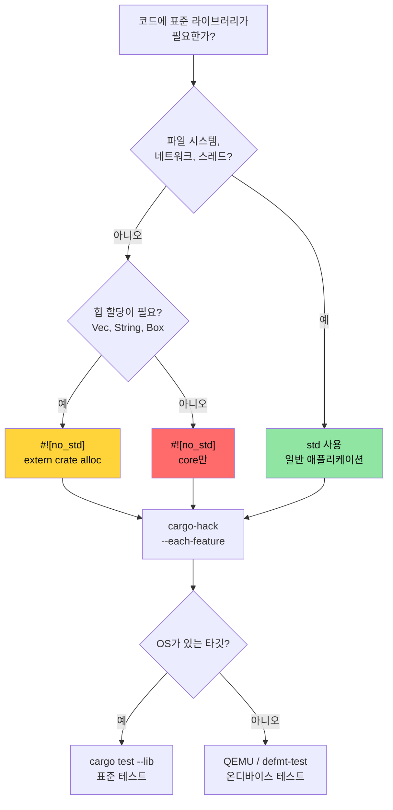

<a id="no-std-and-feature-verification"></a>
# `no_std`와 feature 검증 🔴

> **이 장에서 배우는 것:**
> - `cargo-hack`으로 feature 조합을 체계적으로 검증
> - Rust의 세 층: `core` vs `alloc` vs `std`, 각각 언제 쓸지
> - 커스텀 panic handler와 할당기로 `no_std` 크레이트 빌드
> - 호스트와 QEMU로 `no_std` 코드 테스트
>
> **교차 참고:** [Windows와 조건부 컴파일](ch10-windows-and-conditional-compilation.md) — 이 주제의 플랫폼 절반 · [크로스 컴파일](ch02-cross-compilation-one-source-many-target.md) — ARM·임베디드 타깃으로 크로스 컴파일 · [Miri와 Sanitizer](ch05-miri-valgrind-and-sanitizers-verifying-u.md) — `no_std` 환경의 `unsafe` 검증 · [빌드 스크립트](ch01-build-scripts-buildrs-in-depth.md) — `build.rs`가 내보내는 `cfg` 플래그

Rust는 8비트 MCU부터 클라우드 서버까지 어디서나 동작합니다. 이 장에서는 `#![no_std]`로 표준 라이브러리를 빼는 기초와, feature 조합이 실제로 컴파일되는지 검증하는 방법을 다룹니다.

<a id="verifying-feature-combinations-with-cargo-hack"></a>
### `cargo-hack`으로 feature 조합 검증

[`cargo-hack`](https://github.com/taiki-e/cargo-hack)은 모든 feature 조합을 체계적으로 테스트합니다 — `#[cfg(...)]` 코드가 있는 크레이트에 필수입니다:

```bash
# 설치
cargo install cargo-hack

# 각 feature가 단독으로 컴파일되는지 확인
cargo hack check --each-feature --workspace

# 전부 조합(지수적!) — feature가 8개 미만일 때만 실용적
cargo hack check --feature-powerset --workspace

# 실용적 절충: 각 feature 단독 + 전 feature + 기본 feature 없음
cargo hack check --each-feature --workspace --no-dev-deps
cargo check --workspace --all-features
cargo check --workspace --no-default-features
```

**이 프로젝트에서 중요한 이유:**

플랫폼 feature(`linux`, `windows`, `direct-ipmi`, `direct-accel-api`)를 추가하면 `cargo-hack`이 깨지는 조합을 잡아냅니다:

```toml
# 예: 플랫폼 코드를 게이트하는 feature
[features]
default = ["linux"]
linux = []                          # Linux 전용 하드웨어 접근
windows = ["dep:windows-sys"]       # Windows 전용 API
direct-ipmi = []                    # unsafe IPMI ioctl (ch05)
direct-accel-api = []                    # unsafe accel-mgmt FFI (ch05)
```

```bash
# 모든 feature가 단독·함께 컴파일되는지 검증
cargo hack check --each-feature -p diag_tool
# 잡히는 예: "feature 'windows'는 'direct-ipmi' 없이 컴파일 안 됨"
# 잡히는 예: "#[cfg(feature = \"linux\")] 오타 — 'lnux'임"
```

**CI 연동:**

```yaml
# CI 파이프라인에 추가(빠름 — 컴파일 검사만)
- name: Feature matrix check
  run: cargo hack check --each-feature --workspace --no-dev-deps
```

> **경험칙**: feature가 2개 이상인 크레이트는 CI에서 `cargo hack check --each-feature`를 돌리세요. `--feature-powerset`은 feature가 8개 미만인 핵심 라이브러리에만 — 조합 수가 $2^n$입니다.

<a id="no-std-when-and-why"></a>
### `no_std` — 언제, 왜

`#![no_std]`는 컴파일러에 "표준 라이브러리에 링크하지 마라"고 말합니다. 크레이트는 `core`만 쓰거나(선택적으로 `alloc`). 왜 이렇게 할까요?

| 시나리오 | `no_std`인 이유 |
|----------|----------------|
| 임베디드 펌웨어(ARM Cortex-M, RISC-V) | OS 없음, 힙 없음, 파일 시스템 없음 |
| UEFI 진단 도구 | 부팅 전 환경, OS API 없음 |
| 커널 모듈 | 커널 공간에서는 userspace `std` 사용 불가 |
| WebAssembly(WASM) | 바이너리 최소화, OS 의존 제거 |
| 부트로더 | OS가 존재하기 전에 실행 |
| C 인터페이스 공유 라이브러리 | 호출 측에 Rust 런타임 없이 |

**하드웨어 진단**에서는 다음을 만들 때 `no_std`가 관련됩니다:
- OS 로드 전 UEFI 기반 사전 부팅 진단 도구
- BMC 펌웨어 진단(자원이 제한된 ARM SoC)
- 커널 수준 PCIe 진단(커널 모듈 또는 eBPF 프로브)

<a id="core-vs-alloc-vs-std-the-three-layers"></a>
### `core` vs `alloc` vs `std` — 세 층

```text
┌─────────────────────────────────────────────────────────────┐
│ std                                                         │
│  core + alloc의 모든 것에 더해:                             │
│  • 파일 I/O (std::fs, std::io)                              │
│  • 네트워킹 (std::net)                                      │
│  • 스레드 (std::thread)                                     │
│  • 시간 (std::time)                                         │
│  • 환경 (std::env)                                          │
│  • 프로세스 (std::process)                                  │
│  • OS별 (std::os::unix, std::os::windows)                   │
├─────────────────────────────────────────────────────────────┤
│ alloc          (#![no_std] + extern crate alloc,           │
│                 전역 할당기가 있을 때 사용 가능)             │
│  • String, Vec, Box, Rc, Arc                                │
│  • BTreeMap, BTreeSet                                       │
│  • format!() 매크로                                         │
│  • 힙이 필요한 컬렉션과 스마트 포인터                        │
├─────────────────────────────────────────────────────────────┤
│ core           (#![no_std]에서도 항상 사용 가능)           │
│  • 기본 타입 (u8, bool, char 등)                            │
│  • Option, Result                                           │
│  • Iterator, slice, array, str (슬라이스, String 아님)      │
│  • 트레잇: Clone, Copy, Debug, Display, From, Into            │
│  • 원자 (core::sync::atomic)                                │
│  • Cell, RefCell (core::cell) — Pin (core::pin)             │
│  • core::fmt (할당 없이 포맷)                               │
│  • core::mem, core::ptr (저수준 메모리 연산)                 │
│  • 수학: core::num, 기본 산술                               │
└─────────────────────────────────────────────────────────────┘
```

**`std` 없이 잃는 것:**
- `HashMap` 없음(해셔 필요 — `alloc`의 `BTreeMap` 또는 `hashbrown`)
- `println!()` 없음(stdout 필요 — 버퍼에 `core::fmt::Write`)
- `std::error::Error` 없음(Rust 1.81부터 `core`에 안정화되었으나 생태계는 아직 이행 중)
- 파일 I/O, 네트워킹, 스레드 없음(플랫폼 HAL이 제공하지 않는 한)
- `Mutex` 없음(`spin::Mutex` 또는 플랫폼별 락)

<a id="building-a-no-std-crate"></a>
### `no_std` 크레이트 빌드

```rust
// src/lib.rs — no_std 라이브러리 크레이트
#![no_std]

// 선택적으로 힙 할당 사용
extern crate alloc;
use alloc::string::String;
use alloc::vec::Vec;
use core::fmt;

/// 열 센서 온도 읽기.
/// 베어메탈부터 Linux까지 어떤 환경에서도 동작하는 구조체.
#[derive(Clone, Copy, Debug)]
pub struct Temperature {
    /// 원시 센서 값(일반적인 I2C 센서는 LSB당 0.0625°C)
    raw: u16,
}

impl Temperature {
    pub const fn from_raw(raw: u16) -> Self {
        Self { raw }
    }

    /// 섭씨로 변환(고정소수점, FPU 불필요)
    pub const fn millidegrees_c(&self) -> i32 {
        (self.raw as i32) * 625 / 10 // 0.0625°C 해상도
    }

    pub fn degrees_c(&self) -> f32 {
        self.raw as f32 * 0.0625
    }
}

impl fmt::Display for Temperature {
    fn fmt(&self, f: &mut fmt::Formatter<'_>) -> fmt::Result {
        let md = self.millidegrees_c();
        // -0.999°C ~ -0.001°C 사이에서 md / 1000 == 0이지만 음수인 경우 부호 처리
        if md < 0 && md > -1000 {
            write!(f, "-0.{:03}°C", (-md) % 1000)
        } else {
            write!(f, "{}.{:03}°C", md / 1000, (md % 1000).abs())
        }
    }
}

/// 공백으로 구분된 온도 값 파싱.
/// alloc 사용 — 전역 할당기 필요.
pub fn parse_temperatures(input: &str) -> Vec<Temperature> {
    input
        .split_whitespace()
        .filter_map(|s| s.parse::<u16>().ok())
        .map(Temperature::from_raw)
        .collect()
}

/// 할당 없이 포맷 — 버퍼에 직접 씀.
/// `core`만 있는 환경(alloc 없음, 힙 없음)에서 동작.
pub fn format_temp_into(temp: &Temperature, buf: &mut [u8]) -> usize {
    use core::fmt::Write;
    struct SliceWriter<'a> {
        buf: &'a mut [u8],
        pos: usize,
    }
    impl<'a> Write for SliceWriter<'a> {
        fn write_str(&mut self, s: &str) -> fmt::Result {
            let bytes = s.as_bytes();
            let remaining = self.buf.len() - self.pos;
            if bytes.len() > remaining {
                // 버퍼 가득 — 조용히 자르지 말고 오류
                // 호출자는 반환된 pos로 부분 쓰기를 확인할 수 있음
                return Err(fmt::Error);
            }
            self.buf[self.pos..self.pos + bytes.len()].copy_from_slice(bytes);
            self.pos += bytes.len();
            Ok(())
        }
    }
    let mut w = SliceWriter { buf, pos: 0 };
    let _ = write!(w, "{}", temp);
    w.pos
}
```

```toml
# no_std 크레이트용 Cargo.toml
[package]
name = "thermal-sensor"
version = "0.1.0"
edition = "2021"

[features]
default = ["alloc"]
alloc = []    # Vec, String 등 활성화
std = []      # 전체 std (alloc 포함)

[dependencies]
# no_std 호환 크레이트 사용
serde = { version = "1.0", default-features = false, features = ["derive"] }
# ↑ default-features = false로 std 의존 제거!
```

> **흔한 크레이트 패턴**: serde, log, rand, embedded-hal 등 인기 크레이트는 `default-features = false`로 `no_std`를 지원합니다. `no_std` 맥락에서 쓰기 전에 의존성이 `std`를 요구하는지 항상 확인하세요. 일부 크레이트(예: `regex`)는 최소 `alloc`이 필요하며 `core`만 환경에서는 동작하지 않습니다.

<a id="custom-panic-handlers-and-allocators"></a>
### 커스텀 panic handler와 할당기

`#![no_std]` 바이너리(라이브러리 아님)에서는 panic handler를 제공해야 하고, 선택적으로 전역 할당기를 제공합니다:

```rust
// src/main.rs — no_std 바이너리(예: UEFI 진단)
#![no_std]
#![no_main]

extern crate alloc;

use core::panic::PanicInfo;

// 필수: 패닉 시 동작(스택 언와인딩 없음)
#[panic_handler]
fn panic(info: &PanicInfo) -> ! {
    // 임베디드: LED 깜빡임, UART 쓰기, 무한 대기
    // UEFI: 콘솔에 쓰고 정지
    // 최소: 무한 루프
    loop {
        core::hint::spin_loop();
    }
}

// alloc 사용 시 필수: 전역 할당기
use alloc::alloc::{GlobalAlloc, Layout};

struct BumpAllocator {
    // 임베디드/UEFI용 단순 bump 할당기
    // 실제로는 `linked_list_allocator`나 `embedded-alloc` 같은 크레이트 사용
}

// 경고: 동작하지 않는 플레이스홀더! alloc()을 호출하면 null을 반환해
// 즉시 UB(전역 할당기 계약은 0이 아닌 크기 할당에 대해 null이 아닌 포인터를 요구).
// 실제 코드에서는 검증된 할당기 크레이트를 사용하세요:
//   - embedded-alloc (임베디드 타깃)
//   - linked_list_allocator (UEFI / OS 커널)
//   - talc (범용 no_std)
unsafe impl GlobalAlloc for BumpAllocator {
    unsafe fn alloc(&self, _layout: Layout) -> *mut u8 {
        // 플레이스홀더 — 크래시 남! 실제 할당 로직으로 교체하세요.
        core::ptr::null_mut()
    }
    unsafe fn dealloc(&self, _ptr: *mut u8, _layout: Layout) {
        // bump 할당기에서는 no-op
    }
}

#[global_allocator]
static ALLOCATOR: BumpAllocator = BumpAllocator {};

// 진입점(플랫폼별, fn main 아님)
// UEFI: #[entry] 또는 efi_main
// 임베디드: #[cortex_m_rt::entry]
```

<a id="testing-no-std-code"></a>
### `no_std` 코드 테스트

테스트는 `std`가 있는 호스트에서 실행됩니다. 요령은: 라이브러리는 `no_std`지만 테스트 하네스는 `std`를 쓴다는 것입니다:

```rust
// 크레이트: src/lib.rs에 #![no_std]
// 테스트는 자동으로 std 아래에서 실행:

#[cfg(test)]
mod tests {
    use super::*;
    // 여기서는 std 사용 가능 — println!, assert!, Vec 모두 가능

    #[test]
    fn test_temperature_conversion() {
        let temp = Temperature::from_raw(800); // 50.0°C
        assert_eq!(temp.millidegrees_c(), 50000);
        assert!((temp.degrees_c() - 50.0).abs() < 0.01);
    }

    #[test]
    fn test_format_into_buffer() {
        let temp = Temperature::from_raw(800);
        let mut buf = [0u8; 32];
        let len = format_temp_into(&temp, &mut buf);
        let s = core::str::from_utf8(&buf[..len]).unwrap();
        assert_eq!(s, "50.000°C");
    }
}
```

**실제 타깃에서 테스트**(`std`가 전혀 없을 때):

```bash
# 온디바이스 테스트에는 임베디드 ARM용 defmt-test
# UEFI 타깃에는 uefi-test-runner
# 하드웨어 없이 아키텍처 테스트에는 QEMU

# 호스트에서 no_std 라이브러리 테스트(항상 동작):
cargo test --lib

# no_std 타깃에 대해 컴파일만 검증:
cargo check --target thumbv7em-none-eabihf  # ARM Cortex-M
cargo check --target riscv32imac-unknown-none-elf  # RISC-V
```

<a id="no-std-decision-tree"></a>
### `no_std` 의사결정 트리



### 🏋️ 연습문제

#### 🟡 연습 1: feature 조합 검증

`cargo-hack`을 설치하고 feature가 여러 개인 프로젝트에서 `cargo hack check --each-feature --workspace`를 실행하세요. 깨지는 조합이 있나요?

<details>
<summary>해답</summary>

```bash
cargo install cargo-hack

# 각 feature를 단독으로 검사
cargo hack check --each-feature --workspace --no-dev-deps

# feature 조합이 실패하면:
# error[E0433]: failed to resolve: use of undeclared crate or module `std`
# → feature 게이트에 #[cfg] 가드가 빠졌다는 뜻

# 전 feature + 기본 없음 + 각각 단독 확인:
cargo hack check --each-feature --workspace
cargo check --workspace --all-features
cargo check --workspace --no-default-features
```
</details>

#### 🔴 연습 2: `no_std` 라이브러리 만들기

`#![no_std]`로 컴파일되는 라이브러리 크레이트를 만드세요. 스택 할당 링 버퍼를 구현하고 `thumbv7em-none-eabihf`(ARM Cortex-M)용으로 컴파일되는지 확인하세요.

<details>
<summary>해답</summary>

```rust
// lib.rs
#![no_std]

pub struct RingBuffer<const N: usize> {
    data: [u8; N],
    head: usize,
    len: usize,
}

impl<const N: usize> RingBuffer<N> {
    pub const fn new() -> Self {
        Self { data: [0; N], head: 0, len: 0 }
    }

    pub fn push(&mut self, byte: u8) -> bool {
        if self.len == N { return false; }
        let idx = (self.head + self.len) % N;
        self.data[idx] = byte;
        self.len += 1;
        true
    }

    pub fn pop(&mut self) -> Option<u8> {
        if self.len == 0 { return None; }
        let byte = self.data[self.head];
        self.head = (self.head + 1) % N;
        self.len -= 1;
        Some(byte)
    }
}

#[cfg(test)]
mod tests {
    use super::*;

    #[test]
    fn push_pop() {
        let mut rb = RingBuffer::<4>::new();
        assert!(rb.push(1));
        assert!(rb.push(2));
        assert_eq!(rb.pop(), Some(1));
        assert_eq!(rb.pop(), Some(2));
        assert_eq!(rb.pop(), None);
    }
}
```

```bash
rustup target add thumbv7em-none-eabihf
cargo check --target thumbv7em-none-eabihf
# ✅ 베어메탈 ARM용으로 컴파일됨
```
</details>

### 핵심 정리

- `cargo-hack --each-feature`는 조건부 컴파일이 있는 크레이트에 필수 — CI에서 실행하세요
- `core` → `alloc` → `std`는 층을 이룹니다: 아래로 갈수록 런타임 지원이 덜 필요합니다
- 베어메탈 `no_std` 바이너리에는 커스텀 panic handler와 할당기가 필요합니다
- `no_std` 라이브러리는 `cargo test --lib`로 호스트에서 테스트 — 하드웨어 불필요
- `--feature-powerset`은 feature가 8개 미만인 핵심 라이브러리에만 — 조합 수는 $2^n$입니다

---
