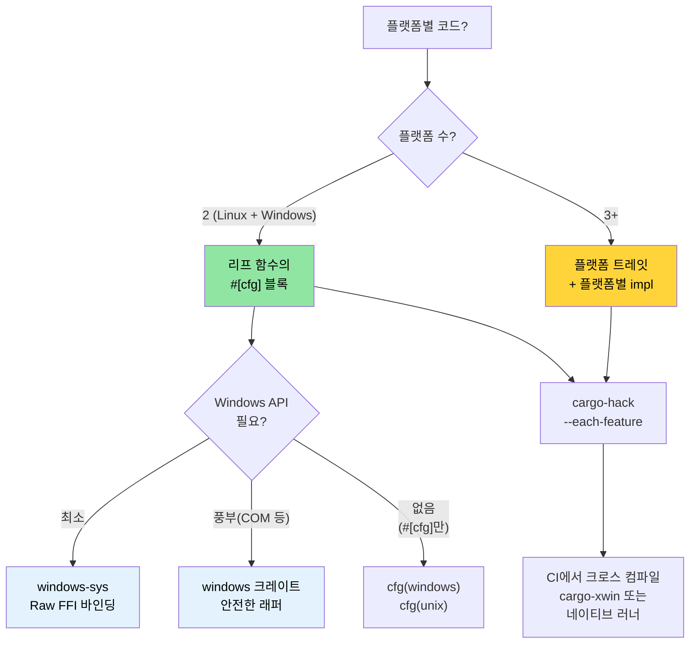

<a id="windows-and-conditional-compilation"></a>
# Windows와 조건부 컴파일 🟡

> **이 장에서 배우는 것:**
> - Windows 지원 패턴: `windows-sys`/`windows` 크레이트, `cargo-xwin`
> - `#[cfg]`로 하는 조건부 컴파일 — 전처리기가 아니라 컴파일러가 검사
> - 플랫폼 추상화 아키텍처: `#[cfg]` 블록으로 충분할 때 vs 트레잇이 필요할 때
> - Linux에서 Windows용 크로스 컴파일
>
> **교차 참고:** [`no_std`와 Features](ch09-no-std-and-feature-verification.md) — `cargo-hack`과 feature 검증 · [크로스 컴파일](ch02-cross-compilation-one-source-many-target.md) — 일반 크로스 빌드 설정 · [빌드 스크립트](ch01-build-scripts-buildrs-in-depth.md) — `build.rs`가 내보내는 `cfg` 플래그

<a id="windows-support-platform-abstractions"></a>
### Windows 지원 — 플랫폼 추상화

Rust의 `#[cfg()]` 속성과 Cargo feature로 단일 코드베이스에서 Linux와 Windows를 깔끔하게 타깃할 수 있습니다. 프로젝트는 이미 `platform::run_command`에서 이 패턴을 보여 줍니다:

```rust
// 프로젝트의 실제 패턴 — 플랫폼별 셸 호출
pub fn exec_cmd(cmd: &str, timeout_secs: Option<u64>) -> Result<CommandResult, CommandError> {
    #[cfg(windows)]
    let mut child = Command::new("cmd")
        .args(["/C", cmd])
        .stdout(Stdio::piped())
        .stderr(Stdio::piped())
        .spawn()?;

    #[cfg(not(windows))]
    let mut child = Command::new("sh")
        .args(["-c", cmd])
        .stdout(Stdio::piped())
        .stderr(Stdio::piped())
        .spawn()?;

    // ... 나머지는 플랫폼 독립 ...
}
```

**사용 가능한 `cfg` 술어:**

```rust
// 운영체제
#[cfg(target_os = "linux")]         // Linux만
#[cfg(target_os = "windows")]       // Windows
#[cfg(target_os = "macos")]         // macOS
#[cfg(unix)]                        // Linux, macOS, BSD 등
#[cfg(windows)]                     // Windows(약칭)

// 아키텍처
#[cfg(target_arch = "x86_64")]      // x86 64비트
#[cfg(target_arch = "aarch64")]     // ARM 64비트
#[cfg(target_arch = "x86")]         // x86 32비트

// 포인터 너비(아키텍처 대신 쓸 수 있는 이식 가능한 대안)
#[cfg(target_pointer_width = "64")] // 임의 64비트 플랫폼
#[cfg(target_pointer_width = "32")] // 임의 32비트 플랫폼

// 환경 / C 라이브러리
#[cfg(target_env = "gnu")]          // glibc
#[cfg(target_env = "musl")]         // musl libc
#[cfg(target_env = "msvc")]         // Windows의 MSVC

// 엔디안
#[cfg(target_endian = "little")]
#[cfg(target_endian = "big")]

// any(), all(), not() 조합
#[cfg(all(target_os = "linux", target_arch = "x86_64"))]
#[cfg(any(target_os = "linux", target_os = "macos"))]
#[cfg(not(windows))]
```

<a id="the-windows-sys-and-windows-crates"></a>
### `windows-sys`와 `windows` 크레이트

Windows API를 직접 호출할 때:

```toml
# Cargo.toml — raw FFI에는 windows-sys(가볍고 추상화 없음)
[target.'cfg(windows)'.dependencies]
windows-sys = { version = "0.59", features = [
    "Win32_Foundation",
    "Win32_System_Services",
    "Win32_System_Registry",
    "Win32_System_Power",
] }
# 참고: windows-sys는 semver 비호환 릴리스를 씀(0.48 → 0.52 → 0.59).
# 단일 마이너 버전에 고정 — 릴리스마다 API 바인딩이 바뀌거나 사라질 수 있음.
# 새 프로젝트 전에 https://github.com/microsoft/windows-rs 에서 최신 버전 확인.

# 또는 안전한 래퍼에는 windows 크레이트( heavier, 더 인체공학적)
# windows = { version = "0.59", features = [...] }
```

```rust
// src/platform/windows.rs
#[cfg(windows)]
mod win {
    use windows_sys::Win32::System::Power::{
        GetSystemPowerStatus, SYSTEM_POWER_STATUS,
    };

    pub fn get_battery_status() -> Option<u8> {
        let mut status = SYSTEM_POWER_STATUS::default();
        // SAFETY: GetSystemPowerStatus가 제공한 버퍼에 씀.
        // 버퍼 크기와 정렬이 올바름.
        let ok = unsafe { GetSystemPowerStatus(&mut status) };
        if ok != 0 {
            Some(status.BatteryLifePercent)
        } else {
            None
        }
    }
}
```

**`windows-sys` vs `windows` 크레이트:**

| 측면 | `windows-sys` | `windows` |
|------|----------------|-----------|
| API 스타일 | Raw FFI(`unsafe` 호출) | 안전한 Rust 래퍼 |
| 바이너리 크기 | 최소(extern 선언만) | 더 큼(래퍼 코드) |
| 컴파일 시간 | 빠름 | 느림 |
| 인체공학 | C 스타일, 수동 안전 | Rust다운 사용감 |
| 에러 처리 | Raw `BOOL` / `HRESULT` | `Result<T, windows::core::Error>` |
| 쓸 때 | 성능 중요, 얇은 래퍼 | 앱 코드, 사용 편의 |

<a id="cross-compiling-for-windows-from-linux"></a>
### Linux에서 Windows용 크로스 컴파일

```bash
# 옵션 1: MinGW(GNU ABI)
rustup target add x86_64-pc-windows-gnu
sudo apt install gcc-mingw-w64-x86-64
cargo build --target x86_64-pc-windows-gnu
# .exe 생성 — Windows에서 실행, msvcrt에 링크

# 옵션 2: xwin으로 MSVC ABI(완전한 MSVC 호환)
cargo install cargo-xwin
cargo xwin build --target x86_64-pc-windows-msvc
# Microsoft CRT와 SDK 헤더/라이브러리를 자동 다운로드

# 옵션 3: Zig 기반 크로스 컴파일
cargo zigbuild --target x86_64-pc-windows-gnu
```

**Windows에서 GNU vs MSVC ABI:**

| 측면 | `x86_64-pc-windows-gnu` | `x86_64-pc-windows-msvc` |
|------|-------------------------|---------------------------|
| 링커 | MinGW `ld` | MSVC `link.exe` 또는 `lld-link` |
| C 런타임 | `msvcrt.dll`(범용) | `ucrtbase.dll`(모던) |
| C++ 상호운용 | GCC ABI | MSVC ABI |
| Linux에서 크로스 | 쉬움(MinGW) | 가능(`cargo-xwin`) |
| Windows API 지원 | 전체 | 전체 |
| 디버그 정보 형식 | DWARF | PDB |
| 권장 | 단순 도구, CI 빌드 | 완전한 Windows 통합 |

<a id="conditional-compilation-patterns"></a>
### 조건부 컴파일 패턴

**패턴 1: 플랫폼 모듈 선택**

```rust
// src/platform/mod.rs — OS마다 다른 모듈 컴파일
#[cfg(target_os = "linux")]
mod linux;
#[cfg(target_os = "linux")]
pub use linux::*;

#[cfg(target_os = "windows")]
mod windows;
#[cfg(target_os = "windows")]
pub use windows::*;

// 두 모듈 모두 동일한 공개 API 구현:
// pub fn get_cpu_temperature() -> Result<f64, PlatformError>
// pub fn list_pci_devices() -> Result<Vec<PciDevice>, PlatformError>
```

**패턴 2: feature로 게이트한 플랫폼 지원**

```toml
# Cargo.toml
[features]
default = ["linux"]
linux = []              # Linux 전용 하드웨어 접근
windows = ["dep:windows-sys"]  # Windows 전용 API

[target.'cfg(windows)'.dependencies]
windows-sys = { version = "0.59", features = [...], optional = true }
```

```rust
// feature 없이 Windows 빌드하려 하면 컴파일 오류:
#[cfg(all(target_os = "windows", not(feature = "windows")))]
compile_error!("Enable the 'windows' feature to build for Windows");
```

**패턴 3: 트레잇 기반 플랫폼 추상화**

```rust
/// 하드웨어 접근용 플랫폼 독립 인터페이스.
pub trait HardwareAccess {
    type Error: std::error::Error;

    fn read_cpu_temperature(&self) -> Result<f64, Self::Error>;
    fn read_gpu_temperature(&self, gpu_index: u32) -> Result<f64, Self::Error>;
    fn list_pci_devices(&self) -> Result<Vec<PciDevice>, Self::Error>;
    fn send_ipmi_command(&self, cmd: &IpmiCmd) -> Result<IpmiResponse, Self::Error>;
}

#[cfg(target_os = "linux")]
pub struct LinuxHardware;

#[cfg(target_os = "linux")]
impl HardwareAccess for LinuxHardware {
    type Error = LinuxHwError;

    fn read_cpu_temperature(&self) -> Result<f64, Self::Error> {
        // /sys/class/thermal/thermal_zone0/temp 에서 읽기
        let raw = std::fs::read_to_string("/sys/class/thermal/thermal_zone0/temp")?;
        Ok(raw.trim().parse::<f64>()? / 1000.0)
    }
    // ...
}

#[cfg(target_os = "windows")]
pub struct WindowsHardware;

#[cfg(target_os = "windows")]
impl HardwareAccess for WindowsHardware {
    type Error = WindowsHwError;

    fn read_cpu_temperature(&self) -> Result<f64, Self::Error> {
        // WMI(Win32_TemperatureProbe) 또는 Open Hardware Monitor로 읽기
        todo!("WMI temperature query")
    }
    // ...
}

/// 플랫폼에 맞는 구현체 생성
pub fn create_hardware() -> impl HardwareAccess {
    #[cfg(target_os = "linux")]
    { LinuxHardware }
    #[cfg(target_os = "windows")]
    { WindowsHardware }
}
```

<a id="platform-abstraction-architecture"></a>
### 플랫폼 추상화 아키텍처

여러 플랫폼을 타깃하는 프로젝트는 코드를 세 층으로 나눕니다:

```text
┌──────────────────────────────────────────────────┐
│ 애플리케이션 로직(플랫폼 독립)                     │
│  diag_tool, accel_diag, network_diag, event_log 등  │
│  플랫폼 추상화 트레잇만 사용                         │
├──────────────────────────────────────────────────┤
│ 플랫폼 추상화 층(트레잇 정의)                      │
│  trait HardwareAccess { ... }                     │
│  trait CommandRunner { ... }                      │
│  trait FileSystem { ... }                         │
├──────────────────────────────────────────────────┤
│ 플랫폼 구현(cfg로 게이트)                         │
│  ┌──────────────┐  ┌──────────────┐              │
│  │ Linux 구현   │  │ Windows 구현 │              │
│  │ /sys, /proc  │  │ WMI, Registry│              │
│  │ ipmitool     │  │ ipmiutil     │              │
│  │ lspci        │  │ devcon       │              │
│  └──────────────┘  └──────────────┘              │
└──────────────────────────────────────────────────┘
```

**추상화 테스트**: 단위 테스트에서 플랫폼 트레잇을 모의(mock)하세요:

```rust
#[cfg(test)]
mod tests {
    use super::*;

    struct MockHardware {
        cpu_temp: f64,
        gpu_temps: Vec<f64>,
    }

    impl HardwareAccess for MockHardware {
        type Error = std::io::Error;

        fn read_cpu_temperature(&self) -> Result<f64, Self::Error> {
            Ok(self.cpu_temp)
        }

        fn read_gpu_temperature(&self, index: u32) -> Result<f64, Self::Error> {
            self.gpu_temps.get(index as usize)
                .copied()
                .ok_or_else(|| std::io::Error::new(
                    std::io::ErrorKind::NotFound,
                    format!("GPU {index} not found")
                ))
        }

        fn list_pci_devices(&self) -> Result<Vec<PciDevice>, Self::Error> {
            Ok(vec![]) // 모의는 빈 목록
        }

        fn send_ipmi_command(&self, _cmd: &IpmiCmd) -> Result<IpmiResponse, Self::Error> {
            Ok(IpmiResponse::default())
        }
    }

    #[test]
    fn test_thermal_check_with_mock() {
        let hw = MockHardware {
            cpu_temp: 75.0,
            gpu_temps: vec![82.0, 84.0],
        };
        let result = run_thermal_diagnostic(&hw);
        assert!(result.is_ok());
    }
}
```

<a id="application-linux-first-windows-ready"></a>
### 적용: Linux 우선, Windows 대비

프로젝트는 이미 부분적으로 Windows 대비가 되어 있습니다. 모든 feature 조합은 [`cargo-hack`](ch09-no-std-and-feature-verification.md)으로 검증하고, Linux에서 Windows를 [크로스 컴파일](ch02-cross-compilation-one-source-many-target.md)해 테스트하세요:

**이미 완료된 것:**
- `platform::run_command`가 셸 선택에 `#[cfg(windows)]` 사용
- 테스트가 `#[cfg(windows)]` / `#[cfg(not(windows))]`로 플랫폼에 맞는 명령 사용

**Windows 지원을 위한 권장 진화 경로:**

```text
1단계: 플랫폼 추상화 트레잇 추출(현재 → 약 2주)
  ├─ core_lib에 HardwareAccess 트레잇 정의
  ├─ 기존 Linux 코드를 LinuxHardware impl 뒤로 감쌈
  └─ 모든 진단 모듈이 Linux 세부가 아니라 트레잇에 의존

2단계: Windows 스텁 추가(약 2주)
  ├─ TODO 스텁으로 WindowsHardware 구현
  ├─ CI에서 x86_64-pc-windows-msvc 빌드(컴파일 검사만)
  └─ 모든 플랫폼에서 MockHardware로 테스트 통과

3단계: Windows 구현(지속)
  ├─ IPMI는 ipmiutil.exe 또는 OpenIPMI Windows 드라이버
  ├─ GPU는 accel-mgmt(accel-api.dll) — Linux와 동일 API
  ├─ PCIe는 Windows Setup API(SetupDiEnumDeviceInfo)
  └─ NIC는 WMI(Win32_NetworkAdapter)
```

**크로스 플랫폼 CI 추가:**

```yaml
# CI 매트릭스에 추가
- target: x86_64-pc-windows-msvc
  os: windows-latest
  name: windows-x86_64
```

전체 Windows 구현 전에도 코드베이스가 Windows에서 컴파일되게 해 `cfg` 실수를 일찍 잡습니다.

> **핵심**: 추상화가 첫날부터 완벽할 필요는 없습니다. `exec_cmd`처럼 리프 함수에 `#[cfg]` 블록으로 시작하고, 플랫폼 구현이 둘 이상 생기면 트레잇으로 리팩터하세요. 때 이른 추상화는 `#[cfg]` 블록보다 나쁩니다.

<a id="conditional-compilation-decision-tree"></a>
### 조건부 컴파일 의사결정 트리



### 🏋️ 연습문제

#### 🟢 연습 1: 플랫폼 조건부 모듈

`#[cfg(unix)]`와 `#[cfg(windows)]`로 `get_hostname()` 구현을 나눈 모듈을 만드세요. `cargo check`와 `cargo check --target x86_64-pc-windows-msvc` 둘 다 컴파일되는지 확인하세요.

<details>
<summary>해답</summary>

```rust
// src/hostname.rs
#[cfg(unix)]
pub fn get_hostname() -> String {
    use std::fs;
    fs::read_to_string("/etc/hostname")
        .unwrap_or_else(|_| "unknown".to_string())
        .trim()
        .to_string()
}

#[cfg(windows)]
pub fn get_hostname() -> String {
    use std::env;
    env::var("COMPUTERNAME").unwrap_or_else(|_| "unknown".to_string())
}

#[cfg(test)]
mod tests {
    use super::*;

    #[test]
    fn hostname_is_not_empty() {
        let name = get_hostname();
        assert!(!name.is_empty());
    }
}
```

```bash
# Linux 컴파일 확인
cargo check

# Windows 컴파일 확인(크로스)
rustup target add x86_64-pc-windows-msvc
cargo check --target x86_64-pc-windows-msvc
```
</details>

#### 🟡 연습 2: cargo-xwin으로 Windows 크로스 컴파일

`cargo-xwin`을 설치하고 Linux에서 `x86_64-pc-windows-msvc`용 단순 바이너리를 빌드하세요. 출력이 `.exe`인지 확인하세요.

<details>
<summary>해답</summary>

```bash
cargo install cargo-xwin
rustup target add x86_64-pc-windows-msvc

cargo xwin build --release --target x86_64-pc-windows-msvc
# Windows SDK 헤더/라이브러리를 자동 다운로드

file target/x86_64-pc-windows-msvc/release/my-binary.exe
# 출력: PE32+ executable (console) x86-64, for MS Windows

# Wine으로도 테스트 가능:
wine target/x86_64-pc-windows-msvc/release/my-binary.exe
```
</details>

### 핵심 정리

- 리프 함수부터 `#[cfg]` 블록으로 시작하고, 플랫폼이 셋 이상 갈라질 때만 트레잇으로 리팩터하세요
- `windows-sys`는 raw FFI용, `windows` 크레이트는 안전하고 익숙한 래퍼용
- `cargo-xwin`은 Linux에서 Windows MSVC ABI로 크로스 컴파일 — Windows 머신 없이 가능
- Linux만 배포해도 CI에서 `x86_64-pc-windows-msvc`를 확인하세요
- 선택적 플랫폼 지원에는 `#[cfg]`와 Cargo feature를 함께 쓰세요(예: `feature = "windows"`)

---
