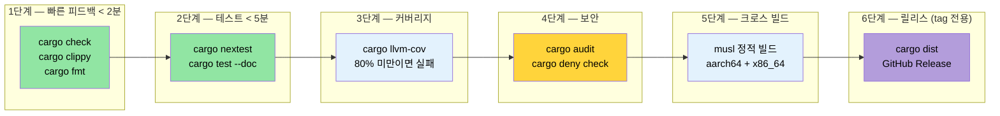

<a id="putting-it-all-together--a-production-cicd-pipeline"></a>
# 모두 합치기 — 프로덕션 CI/CD 파이프라인 🟡

> **이 장에서 배우는 것:**
> - 다단계 GitHub Actions CI 워크플로를 구성하는 방법 (check → test → coverage → security → cross → release)
> - `rust-cache`와 `save-if` 튜닝을 활용한 캐시 전략
> - nightly 스케줄에서 Miri와 sanitizer를 실행하는 방법
> - `Makefile.toml`과 pre-commit hook으로 작업을 자동화하는 방법
> - `cargo-dist`로 릴리스를 자동화하는 방법
>
> **상호 참조:** [빌드 스크립트](ch01-build-scripts-buildrs-in-depth.md) · [크로스 컴파일](ch02-cross-compilation-one-source-many-target.md) · [벤치마킹](ch03-benchmarking-measuring-what-matters.md) · [커버리지](ch04-code-coverage-seeing-what-tests-miss.md) · [Miri/Sanitizer](ch05-miri-valgrind-and-sanitizers-verifying-u.md) · [의존성 관리](ch06-dependency-management-and-supply-chain-s.md) · [릴리스 프로파일](ch07-release-profiles-and-binary-size.md) · [컴파일 시간 도구](ch08-compile-time-and-developer-tools.md) · [`no_std`](ch09-no-std-and-feature-verification.md) · [Windows](ch10-windows-and-conditional-compilation.md)

개별 도구도 유용합니다. 하지만 이들을 모든 push마다 자동으로 조율해 실행하는 파이프라인은 팀의 작업 방식을 바꿔 놓습니다. 이 장에서는 1~10장에서 다룬 도구를 하나의 일관된 CI/CD 워크플로로 엮어 봅니다.

<a id="the-complete-github-actions-workflow"></a>
### 전체 GitHub Actions 워크플로

모든 검증 단계를 병렬로 실행하는 단일 워크플로 파일입니다:

```yaml
# .github/workflows/ci.yml
name: CI

on:
  push:
    branches: [main]
  pull_request:
    branches: [main]

env:
  CARGO_TERM_COLOR: always
  CARGO_ENCODED_RUSTFLAGS: "-Dwarnings"  # 경고를 오류로 취급 (최상위 크레이트만)
  # 참고: RUSTFLAGS와 달리 CARGO_ENCODED_RUSTFLAGS는 build script
  # 나 proc-macro에는 적용되지 않으므로, 서드파티 경고 때문에
  # 거짓 실패가 나는 상황을 피할 수 있습니다.
  # build script에도 강제하고 싶다면 대신 RUSTFLAGS="-Dwarnings" 를 사용하세요.

jobs:
  # ─── 1단계: 빠른 피드백 (< 2분) ───
  check:
    name: Check + Clippy + Format
    runs-on: ubuntu-latest
    steps:
      - uses: actions/checkout@v4
      - uses: dtolnay/rust-toolchain@stable
        with:
          components: clippy, rustfmt

      - uses: Swatinem/rust-cache@v2  # 의존성 캐시

      - name: Check compilation
        run: cargo check --workspace --all-targets --all-features

      - name: Clippy lints
        run: cargo clippy --workspace --all-targets --all-features -- -D warnings

      - name: Formatting
        run: cargo fmt --all -- --check

  # ─── 2단계: 테스트 (< 5분) ───
  test:
    name: Test (${{ matrix.os }})
    needs: check
    strategy:
      matrix:
        os: [ubuntu-latest, windows-latest]
    runs-on: ${{ matrix.os }}
    steps:
      - uses: actions/checkout@v4
      - uses: dtolnay/rust-toolchain@stable
      - uses: Swatinem/rust-cache@v2

      - name: Run tests
        run: cargo test --workspace

      - name: Run doc tests
        run: cargo test --workspace --doc

  # ─── 3단계: 크로스 컴파일 (< 10분) ───
  cross:
    name: Cross (${{ matrix.target }})
    needs: check
    strategy:
      matrix:
        include:
          - target: x86_64-unknown-linux-musl
            os: ubuntu-latest
          - target: aarch64-unknown-linux-gnu
            os: ubuntu-latest
            use_cross: true
    runs-on: ${{ matrix.os }}
    steps:
      - uses: actions/checkout@v4
      - uses: dtolnay/rust-toolchain@stable
        with:
          targets: ${{ matrix.target }}

      - name: Install musl-tools
        if: contains(matrix.target, 'musl')
        run: sudo apt-get install -y musl-tools

      - name: Install cross
        if: matrix.use_cross
        uses: taiki-e/install-action@cross

      - name: Build (native)
        if: "!matrix.use_cross"
        run: cargo build --release --target ${{ matrix.target }}

      - name: Build (cross)
        if: matrix.use_cross
        run: cross build --release --target ${{ matrix.target }}

      - name: Upload artifact
        uses: actions/upload-artifact@v4
        with:
          name: binary-${{ matrix.target }}
          path: target/${{ matrix.target }}/release/diag_tool

  # ─── 4단계: 커버리지 (< 10분) ───
  coverage:
    name: Code Coverage
    needs: check
    runs-on: ubuntu-latest
    steps:
      - uses: actions/checkout@v4
      - uses: dtolnay/rust-toolchain@stable
        with:
          components: llvm-tools-preview
      - uses: taiki-e/install-action@cargo-llvm-cov

      - name: Generate coverage
        run: cargo llvm-cov --workspace --lcov --output-path lcov.info

      - name: Enforce minimum coverage
        run: cargo llvm-cov --workspace --fail-under-lines 75

      - name: Upload to Codecov
        uses: codecov/codecov-action@v4
        with:
          files: lcov.info
          token: ${{ secrets.CODECOV_TOKEN }}

  # ─── 5단계: 안전성 검증 (< 15분) ───
  miri:
    name: Miri
    needs: check
    runs-on: ubuntu-latest
    steps:
      - uses: actions/checkout@v4
      - uses: dtolnay/rust-toolchain@nightly
        with:
          components: miri

      - name: Run Miri
        run: cargo miri test --workspace
        env:
          MIRIFLAGS: "-Zmiri-backtrace=full"

  # ─── 6단계: 벤치마크 (PR 전용, < 10분) ───
  bench:
    name: Benchmarks
    if: github.event_name == 'pull_request'
    needs: check
    runs-on: ubuntu-latest
    steps:
      - uses: actions/checkout@v4
      - uses: dtolnay/rust-toolchain@stable

      - name: Run benchmarks
        run: cargo bench -- --output-format bencher | tee bench.txt

      - name: Compare with baseline
        uses: benchmark-action/github-action-benchmark@v1
        with:
          tool: 'cargo'
          output-file-path: bench.txt
          github-token: ${{ secrets.GITHUB_TOKEN }}
          alert-threshold: '115%'
          comment-on-alert: true
```

**파이프라인 실행 흐름:**

```text
                    ┌─────────┐
                    │  check  │  ← clippy + fmt + cargo check (2분)
                    └────┬────┘
           ┌─────────┬──┴──┬──────────┬──────────┐
           ▼         ▼     ▼          ▼          ▼
       ┌──────┐  ┌──────┐ ┌────────┐ ┌──────┐ ┌──────┐
       │ test │  │cross │ │coverage│ │ miri │ │bench │
       │ (2×) │  │ (2×) │ │        │ │      │ │(PR)  │
       └──────┘  └──────┘ └────────┘ └──────┘ └──────┘
         3분      8분       8분       12분      5분

총 경과 시간: 약 14분 (check 게이트 이후 병렬 실행)
```

<a id="ci-caching-strategies"></a>
### CI 캐시 전략

[`Swatinem/rust-cache@v2`](https://github.com/Swatinem/rust-cache)는 표준적인 Rust CI 캐시 액션입니다. 이 액션은 실행 사이에 `~/.cargo`와 `target/`을 캐시하지만, 큰 워크스페이스에서는 약간의 튜닝이 필요합니다:

```yaml
# 기본 설정 (위에서 사용한 방식)
- uses: Swatinem/rust-cache@v2

# 큰 워크스페이스에 맞춰 튜닝한 설정
- uses: Swatinem/rust-cache@v2
  with:
    # 잡별로 캐시 분리 - 테스트 산출물이 빌드 캐시를 불리는 것을 방지
    prefix-key: "v1-rust"
    key: ${{ matrix.os }}-${{ matrix.target || 'default' }}
    # main 브랜치에서만 캐시 저장 (PR은 읽기만 하고 쓰지는 않음)
    save-if: ${{ github.ref == 'refs/heads/main' }}
    # Cargo registry + git checkout + target 디렉터리 캐시
    cache-targets: true
    cache-all-crates: true
```

**캐시 무효화 시 흔한 함정:**

| 문제 | 해결 |
|---------|-----|
| 캐시가 끝없이 커짐 (>5 GB) | `prefix-key: "v2-rust"`로 바꿔 새 캐시를 강제로 만들기 |
| 서로 다른 feature 조합이 캐시를 오염시킴 | `key: ${{ hashFiles('**/Cargo.lock') }}` 사용 |
| PR 캐시가 `main` 캐시를 덮어씀 | `save-if: ${{ github.ref == 'refs/heads/main' }}` 설정 |
| 크로스 컴파일 타깃이 캐시를 과도하게 키움 | 타깃 triple별로 별도 `key` 사용 |

**잡 사이에서 캐시 공유하기:**

`check` 잡이 캐시를 저장하고, 뒤따르는 잡 (`test`, `cross`, `coverage`)이 이를 읽습니다. `save-if`를 `main`에서만 켜 두면 PR 실행은 캐시된 의존성의 이점은 얻되 오래된 캐시를 다시 써 넣지는 않습니다.

> **대형 워크스페이스에서 측정한 효과:** 콜드 빌드는 약 4분 → 캐시된 빌드는 약 45초. 캐시 액션만으로도 파이프라인 1회당(모든 병렬 잡을 합쳐) 약 25분의 CI 시간을 절약할 수 있습니다.

<a id="makefiletoml-with-cargo-make"></a>
### `cargo-make`를 이용한 `Makefile.toml`

[`cargo-make`](https://sagiegurari.github.io/cargo-make/)는 플랫폼 간에 동작하는 휴대성 좋은 태스크 러너를 제공합니다 (`make`/`Makefile`과 달리):

```bash
# 설치
cargo install cargo-make
```

```toml
# Makefile.toml - 워크스페이스 루트에 배치

[config]
default_to_workspace = false

# ─── 개발자 워크플로 ───

[tasks.dev]
description = "Full local verification (same checks as CI)"
dependencies = ["check", "test", "clippy", "fmt-check"]

[tasks.check]
command = "cargo"
args = ["check", "--workspace", "--all-targets"]

[tasks.test]
command = "cargo"
args = ["test", "--workspace"]

[tasks.clippy]
command = "cargo"
args = ["clippy", "--workspace", "--all-targets", "--", "-D", "warnings"]

[tasks.fmt]
command = "cargo"
args = ["fmt", "--all"]

[tasks.fmt-check]
command = "cargo"
args = ["fmt", "--all", "--", "--check"]

# ─── 커버리지 ───

[tasks.coverage]
description = "Generate HTML coverage report"
install_crate = "cargo-llvm-cov"
command = "cargo"
args = ["llvm-cov", "--workspace", "--html", "--open"]

[tasks.coverage-ci]
description = "Generate LCOV for CI upload"
install_crate = "cargo-llvm-cov"
command = "cargo"
args = ["llvm-cov", "--workspace", "--lcov", "--output-path", "lcov.info"]

# ─── 벤치마크 ───

[tasks.bench]
description = "Run all benchmarks"
command = "cargo"
args = ["bench"]

# ─── 크로스 컴파일 ───

[tasks.build-musl]
description = "Build static binary (musl)"
command = "cargo"
args = ["build", "--release", "--target", "x86_64-unknown-linux-musl"]

[tasks.build-arm]
description = "Build for aarch64 (requires cross)"
command = "cross"
args = ["build", "--release", "--target", "aarch64-unknown-linux-gnu"]

[tasks.build-all]
description = "Build for all deployment targets"
dependencies = ["build-musl", "build-arm"]

# ─── 안전성 검증 ───

[tasks.miri]
description = "Run Miri on all tests"
toolchain = "nightly"
command = "cargo"
args = ["miri", "test", "--workspace"]

[tasks.audit]
description = "Check for known vulnerabilities"
install_crate = "cargo-audit"
command = "cargo"
args = ["audit"]

# ─── 릴리스 ───

[tasks.release-dry]
description = "Preview what cargo-release would do"
install_crate = "cargo-release"
command = "cargo"
args = ["release", "--workspace", "--dry-run"]
```

**사용법:**

```bash
# 로컬에서 CI 파이프라인과 같은 검증 실행
cargo make dev

# 커버리지 생성 및 확인
cargo make coverage

# 모든 타깃으로 빌드
cargo make build-all

# 안전성 검사 실행
cargo make miri

# 알려진 취약점 확인
cargo make audit
```

<a id="pre-commit-hooks-custom-scripts-and-cargo-husky"></a>
### Pre-Commit Hook: 사용자 정의 스크립트와 `cargo-husky`

문제가 CI에 도달하기 *전에* 잡으세요. 권장 접근은 직접 작성한 git hook입니다. 단순하고, 동작이 투명하며, 외부 의존성이 없습니다:

```bash
#!/bin/sh
# .githooks/pre-commit

set -e

echo "=== Pre-commit checks ==="

# 빠른 검사부터 실행
echo "→ cargo fmt --check"
cargo fmt --all -- --check

echo "→ cargo check"
cargo check --workspace --all-targets

echo "→ cargo clippy"
cargo clippy --workspace --all-targets -- -D warnings

echo "→ cargo test (lib only, fast)"
cargo test --workspace --lib

echo "=== All checks passed ==="
```

```bash
# hook 설치
git config core.hooksPath .githooks
chmod +x .githooks/pre-commit
```

**대안: `cargo-husky`** (build script를 통해 hook 자동 설치):

> ⚠️ **참고:** `cargo-husky`는 2022년 이후 업데이트가 없습니다. 아직 동작은 하지만 사실상 유지보수되지 않는 상태입니다. 새 프로젝트라면 위의 커스텀 hook 방식을 우선 고려하세요.

```bash
cargo install cargo-husky
```

```toml
# Cargo.toml - 루트 크레이트의 dev-dependencies에 추가
[dev-dependencies]
cargo-husky = { version = "1", default-features = false, features = [
    "precommit-hook",
    "run-cargo-check",
    "run-cargo-clippy",
    "run-cargo-fmt",
    "run-cargo-test",
] }
```

<a id="release-workflow-cargo-release-and-cargo-dist"></a>
### 릴리스 워크플로: `cargo-release`와 `cargo-dist`

**`cargo-release`** - 버전 증가, 태그 생성, 게시를 자동화합니다:

```bash
# 설치
cargo install cargo-release
```

```toml
# release.toml - 워크스페이스 루트에 배치
[workspace]
consolidate-commits = true
pre-release-commit-message = "chore: release {{version}}"
tag-message = "v{{version}}"
tag-name = "v{{version}}"

# 내부 크레이트는 게시하지 않음
[[package]]
name = "core_lib"
release = false

[[package]]
name = "diag_framework"
release = false

# 메인 바이너리만 게시
[[package]]
name = "diag_tool"
release = true
```

```bash
# 릴리스 미리보기
cargo release patch --dry-run

# 릴리스 실행 (버전 증가, 커밋, 태그, 필요시 publish)
cargo release patch --execute
# 0.1.0 → 0.1.1

cargo release minor --execute
# 0.1.1 → 0.2.0
```

**`cargo-dist`** - GitHub Releases에서 내려받을 수 있는 릴리스 바이너리를 생성합니다:

```bash
# 설치
cargo install cargo-dist

# 초기화 (CI 워크플로 + 메타데이터 생성)
cargo dist init

# 무엇이 빌드될지 미리보기
cargo dist plan

# 릴리스 생성 (보통 tag push 시 CI가 수행)
cargo dist build
```

```toml
# `cargo dist init` 이 추가하는 Cargo.toml 항목
[workspace.metadata.dist]
cargo-dist-version = "0.28.0"
ci = "github"
targets = [
    "x86_64-unknown-linux-gnu",
    "x86_64-unknown-linux-musl",
    "aarch64-unknown-linux-gnu",
    "x86_64-pc-windows-msvc",
]
install-path = "CARGO_HOME"
```

이렇게 하면 tag push 시 다음을 수행하는 GitHub Actions 워크플로가 생성됩니다:
1. 모든 대상 플랫폼용 바이너리 빌드
2. 다운로드 가능한 `.tar.gz` / `.zip` 아카이브가 포함된 GitHub Release 생성
3. shell/PowerShell 설치 스크립트 생성
4. crates.io에 게시 (설정한 경우)

<a id="try-it-yourself--capstone-exercise"></a>
### 직접 해보기 — 캡스톤 연습문제

이 연습문제는 모든 장을 하나로 묶습니다. 새 Rust 워크스페이스를 대상으로 완전한 엔지니어링 파이프라인을 구축해 보세요:

1. **새 워크스페이스 만들기**: 라이브러리 크레이트(`core_lib`)와 바이너리 크레이트(`cli`) 두 개를 만드세요. `SOURCE_DATE_EPOCH`를 사용해 git hash와 빌드 타임스탬프를 심는 `build.rs`를 추가하세요 (1장).

2. **크로스 컴파일 설정하기**: `x86_64-unknown-linux-musl`과 `aarch64-unknown-linux-gnu`를 대상으로 설정하세요. 두 타깃이 모두 `cargo zigbuild` 또는 `cross`로 빌드되는지 검증하세요 (2장).

3. **벤치마크 추가하기**: `core_lib`의 함수 하나에 대해 Criterion 또는 Divan 기반 벤치마크를 추가하세요. 로컬에서 실행하고 baseline을 기록하세요 (3장).

4. **코드 커버리지 측정하기**: `cargo llvm-cov`로 커버리지를 측정하세요. 최소 임계값을 80%로 설정하고 통과하는지 확인하세요 (4장).

5. **`cargo +nightly careful test`와 `cargo miri test` 실행하기**: `unsafe` 코드가 있다면 그것을 실제로 타는 테스트도 하나 추가하세요 (5장).

6. **`cargo-deny` 구성하기**: `openssl`을 금지하고 MIT/Apache-2.0 라이선스만 허용하는 `deny.toml`을 작성하세요 (6장).

7. **릴리스 프로파일 최적화하기**: `lto = "thin"`, `strip = true`, `codegen-units = 1`을 설정하세요. `cargo bloat`로 전후 바이너리 크기를 측정하세요 (7장).

8. **`cargo hack --each-feature` 검증 추가하기**: optional dependency용 feature flag를 하나 만들고, 그 feature만 켰을 때도 단독으로 컴파일되는지 확인하세요 (9장).

9. **GitHub Actions 워크플로 작성하기**: 이 장의 예시처럼 6개 단계를 모두 포함한 워크플로를 작성하세요. `Swatinem/rust-cache@v2`에 `save-if` 튜닝도 추가하세요.

**성공 기준**: GitHub에 push → 모든 CI 단계가 초록불 → `cargo dist plan`이 릴리스 타깃을 보여줌. 이 시점이면 프로덕션급 Rust 파이프라인을 갖춘 것입니다.

<a id="ci-pipeline-architecture"></a>
### CI 파이프라인 아키텍처



<a id="key-takeaways"></a>
### 핵심 정리

- CI는 빠른 검사부터 앞에 두고, 비용이 큰 잡은 게이트 뒤의 병렬 단계로 배치하세요
- `Swatinem/rust-cache@v2`에 `save-if: ${{ github.ref == 'refs/heads/main' }}`를 적용하면 PR 캐시가 서로 덮어쓰며 흔들리는 문제를 막을 수 있습니다
- Miri와 무거운 sanitizer는 모든 push마다 돌리지 말고 nightly `schedule:` 트리거에서 실행하세요
- `Makefile.toml` (`cargo make`)은 여러 도구를 묶은 워크플로를 로컬 개발용 단일 명령으로 압축해 줍니다
- `cargo-dist`는 크로스 플랫폼 릴리스 빌드를 자동화합니다. 더 이상 플랫폼 매트릭스 YAML을 손으로 쓰지 마세요

---
