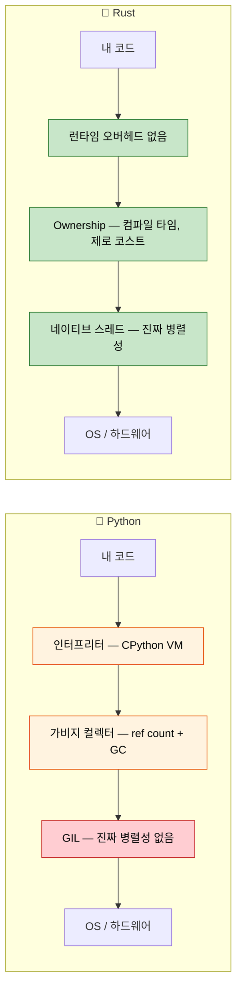

<a id="speaker-intro-and-general-approach"></a>
## 발표자 소개와 진행 방식

- 발표자 소개
    - Microsoft SCHIE(Silicon and Cloud Hardware Infrastructure Engineering) 팀의 Principal Firmware Architect
    - 보안, 시스템 프로그래밍(펌웨어, 운영체제, 하이퍼바이저), CPU 및 플랫폼 아키텍처, C++ 시스템 분야에서 오랜 경험을 쌓음
    - 2017년(AWS EC2)부터 Rust를 사용하기 시작했고, 그때부터 지금까지 이 언어를 깊이 좋아하게 됨
- 이 과정은 가능한 한 상호작용적으로 진행하는 것을 목표로 합니다
    - 가정: Python과 그 생태계에 익숙합니다
    - 예제는 Python 개념을 Rust 대응 개념에 의도적으로 매핑합니다
    - **언제든지 편하게 질문하세요**

---

<a id="the-case-for-rust-for-python-developers"></a>
## Python 개발자에게 Rust가 필요한 이유

> **이 장에서 배울 내용:** Python 개발자들이 왜 Rust를 선택하는지, 실제 현장의 성능 개선 사례(Dropbox, Discord, Pydantic), 언제 Python에 머무르고 언제 Rust를 선택하는 것이 적절한지, 그리고 두 언어의 핵심 철학이 어떻게 다른지 살펴봅니다.
>
> **난이도:** 🟢 입문

### 성능: 몇 분이 몇 밀리초로

Python은 CPU 바운드 작업에서 느린 언어로 잘 알려져 있습니다. Rust는 고수준 언어의 사용성을 유지하면서도 C 수준의 성능을 제공합니다.

```python
# Python — 1,000만 번 반복에 약 45초
import time

def fibonacci(n: int) -> int:
    if n <= 1:
        return n
    a, b = 0, 1
    for _ in range(2, n + 1):
        a, b = b, a + b
    return b

start = time.perf_counter()
results = [fibonacci(i) for i in range(10_000_000)]
elapsed = time.perf_counter() - start
print(f"Elapsed: {elapsed:.2f}s")  # 일반적인 하드웨어에서 약 45초
```

```rust
// Rust — 같은 1,000만 번 반복을 약 0.3초에 수행
use std::time::Instant;

fn fibonacci(n: u64) -> u64 {
    if n <= 1 {
        return n;
    }
    let (mut a, mut b) = (0u64, 1u64);
    for _ in 2..=n {
        let temp = b;
        b = a.wrapping_add(b);
        a = temp;
    }
    b
}

fn main() {
    let start = Instant::now();
    let results: Vec<u64> = (0..10_000_000).map(fibonacci).collect();
    println!("Elapsed: {:.2?}", start.elapsed());  // 약 0.3초
}
```

> **왜 이런 차이가 날까요?** Python은 모든 `+` 연산을 딕셔너리 조회를 통해 디스패치하고, 힙 객체에서 정수를 꺼내며, 매 연산마다 타입을 검사합니다. Rust는 `fibonacci`를 x86의 `add`/`mov` 몇 개 수준으로 직접 컴파일합니다. 즉, C 컴파일러가 만들어낼 코드와 사실상 같은 수준입니다.

### 가비지 컬렉터 없이도 메모리 안전성 확보

Python의 참조 카운팅 GC에는 잘 알려진 문제가 있습니다. 순환 참조, 예측하기 어려운 `__del__` 호출 시점, 메모리 단편화가 대표적입니다. Rust는 이런 문제를 컴파일 타임에 제거합니다.

```python
# Python — CPython의 참조 카운터만으로는 해제할 수 없는 순환 참조
class Node:
    def __init__(self, value):
        self.value = value
        self.parent = None
        self.children = []

    def add_child(self, child):
        self.children.append(child)
        child.parent = self  # 순환 참조!

# 두 노드가 서로를 참조하므로 참조 카운트가 0이 되지 않습니다.
# CPython의 cycle detector가 *언젠가는* 정리하겠지만,
# 그 시점을 제어할 수 없고 GC pause 비용도 추가됩니다.
root = Node("root")
child = Node("child")
root.add_child(child)
```

```rust
// Rust — ownership이 설계 차원에서 순환 참조를 막음
struct Node {
    value: String,
    children: Vec<Node>,  // 자식 노드를 소유하므로 순환이 생길 수 없음
}

impl Node {
    fn new(value: &str) -> Self {
        Node {
            value: value.to_string(),
            children: Vec::new(),
        }
    }

    fn add_child(&mut self, child: Node) {
        self.children.push(child);  // 여기서 소유권이 이동
    }
}

fn main() {
    let mut root = Node::new("root");
    let child = Node::new("child");
    root.add_child(child);
    // root가 drop되면 모든 자식도 함께 drop됩니다.
    // 결정적이고, 추가 오버헤드가 없으며, GC가 필요 없습니다.
}
```

> **핵심 포인트**: Rust에서는 자식이 부모를 다시 가리키는 참조를 기본적으로 들고 있지 않습니다. 그래프처럼 교차 참조가 정말 필요하다면 `Rc<RefCell<T>>`나 인덱스 같은 명시적인 메커니즘을 사용합니다. 즉, 복잡성이 숨겨지지 않고 의도를 드러낸 채 코드에 나타납니다.

***

<a id="common-python-pain-points-that-rust-addresses"></a>
## Rust가 해결하는 Python의 대표적인 문제들

### 1. 런타임 타입 오류

운영 환경의 Python 코드에서 가장 흔한 버그 중 하나는 함수에 잘못된 타입을 넘기는 것입니다. 타입 힌트는 도움이 되지만, 강제되지는 않습니다.

```python
# Python — 타입 힌트는 규칙이 아니라 제안에 가깝습니다
def process_user(user_id: int, name: str) -> dict:
    return {"id": user_id, "name": name.upper()}

# 호출 시점에서는 모두 "동작"해 보이지만 런타임에 실패합니다
process_user("not-a-number", 42)        # .upper()에서 TypeError
process_user(None, "Alice")             # user_id를 int로 쓰는 순간 문제 발생
process_user(1, "Alice", extra="oops")  # 여분 kwargs를 넣어도 Python은 여기서 막지 않음

# mypy를 써도 타입을 우회할 수 있습니다
data = json.loads('{"id": "oops"}')     # 항상 Any를 반환
process_user(data["id"], data["name"])  # mypy도 여기서는 못 잡음
```

```rust
// Rust — 프로그램을 실행하기 전에 컴파일러가 모두 잡아냄
fn process_user(user_id: i64, name: &str) -> User {
    User {
        id: user_id,
        name: name.to_uppercase(),
    }
}

// process_user("not-a-number", 42);     // ❌ 컴파일 오류: i64가 필요한데 &str을 받음
// process_user(None, "Alice");           // ❌ 컴파일 오류: i64가 필요한데 Option을 받음
// 여분 인자는 언제나 컴파일 오류입니다.

// JSON 역직렬화도 타입 안전하게 처리됩니다
#[derive(Deserialize)]
struct UserInput {
    id: i64,      // JSON에서 반드시 숫자여야 함
    name: String, // JSON에서 반드시 문자열이어야 함
}
let input: UserInput = serde_json::from_str(json_str)?; // 타입이 안 맞으면 Err 반환
process_user(input.id, &input.name); // ✅ 올바른 타입이 보장됨
```

### 2. None: 10억 달러짜리 실수의 Python판

`None`은 값이 올 수 있는 거의 모든 자리에 스며들 수 있습니다. Python에는 `AttributeError: 'NoneType' object has no attribute ...`를 컴파일 타임에 막아줄 방법이 없습니다.

```python
# Python — None은 어디에서나 끼어들 수 있습니다
def find_user(user_id: int) -> dict | None:
    users = {1: {"name": "Alice"}, 2: {"name": "Bob"}}
    return users.get(user_id)

user = find_user(999)         # None 반환
print(user["name"])           # 💥 TypeError: 'NoneType' object is not subscriptable

# Optional 힌트를 붙여도 검사 자체를 강제하지는 않습니다
from typing import Optional
def get_name(user_id: int) -> Optional[str]:
    return None

name: Optional[str] = get_name(1)
print(name.upper())          # 💥 AttributeError — mypy는 경고하지만 런타임은 신경 쓰지 않음
```

```rust
// Rust — 명시적으로 처리하지 않으면 None을 사용할 수 없음
fn find_user(user_id: i64) -> Option<User> {
    let users = HashMap::from([
        (1, User { name: "Alice".into() }),
        (2, User { name: "Bob".into() }),
    ]);
    users.get(&user_id).cloned()
}

let user = find_user(999);  // Option<User>의 None 변형을 반환
// println!("{}", user.name);  // ❌ 컴파일 오류: Option<User>에는 `name` 필드가 없음

// None 경우를 반드시 처리해야 합니다
match find_user(999) {
    Some(user) => println!("{}", user.name),
    None => println!("User not found"),
}

// 또는 combinator를 사용할 수도 있습니다
let name = find_user(999)
    .map(|u| u.name)
    .unwrap_or_else(|| "Unknown".to_string());
```

### 3. GIL: Python 동시성의 천장

Python의 Global Interpreter Lock 때문에 스레드는 Python 코드를 진짜 병렬로 실행하지 못합니다. `threading`은 I/O 바운드 작업에서만 주로 유용하고, CPU 바운드 작업은 `multiprocessing`(직렬화 오버헤드 포함)이나 C 확장에 의존해야 합니다.

```python
# Python — GIL 때문에 스레드가 CPU 작업을 빠르게 해주지 못합니다
import threading
import time

def cpu_work(n):
    total = 0
    for i in range(n):
        total += i * i
    return total

start = time.perf_counter()
threads = [threading.Thread(target=cpu_work, args=(10_000_000,)) for _ in range(4)]
for t in threads:
    t.start()
for t in threads:
    t.join()
elapsed = time.perf_counter() - start
print(f"4 threads: {elapsed:.2f}s")  # 1개 스레드와 거의 비슷함! GIL이 병렬화를 막습니다.

# multiprocessing은 "되긴" 하지만 프로세스 사이에 데이터를 직렬화합니다
from multiprocessing import Pool
with Pool(4) as p:
    results = p.map(cpu_work, [10_000_000] * 4)  # 약 4배 빨라지지만 pickle 오버헤드 존재
```

```rust
// Rust — 진짜 병렬성, GIL 없음, 직렬화 오버헤드도 없음
use std::thread;

fn cpu_work(n: u64) -> u64 {
    (0..n).map(|i| i * i).sum()
}

fn main() {
    let start = std::time::Instant::now();
    let handles: Vec<_> = (0..4)
        .map(|_| thread::spawn(|| cpu_work(10_000_000)))
        .collect();

    let results: Vec<u64> = handles.into_iter()
        .map(|h| h.join().unwrap())
        .collect();

    println!("4 threads: {:.2?}", start.elapsed());  // 단일 스레드보다 약 4배 빠름
}
```

> **Rayon을 쓰면**(Rust의 병렬 iterator 라이브러리) 병렬화는 더 단순해집니다.
> ```rust
> use rayon::prelude::*;
> let results: Vec<u64> = inputs.par_iter().map(|&n| cpu_work(n)).collect();
> ```

### 4. 배포와 배포 환경의 고통

Python 배포는 악명이 높을 정도로 까다롭습니다. `venv`, 시스템 Python 충돌, `pip install` 실패, C 확장 wheel, Python 런타임 전체를 포함한 Docker 이미지까지 고려해야 합니다.

```python
# Python 배포 체크리스트
# 1. Python 버전은 무엇인가? 3.9? 3.10? 3.11? 3.12?
# 2. 가상환경은 무엇을 쓰는가? venv, conda, poetry, pipenv?
# 3. C 확장이 있는가? 컴파일러가 필요한가? manylinux wheel은 있는가?
# 4. 시스템 의존성은? libssl, libffi 등
# 5. Docker: 전체 python:3.12 이미지는 1.0 GB
# 6. import가 많은 앱의 시작 시간은 200~500ms

# Docker 이미지: 약 1 GB
# FROM python:3.12-slim
# COPY requirements.txt .
# RUN pip install -r requirements.txt
# COPY . .
# CMD ["python", "app.py"]
```

```rust
// Rust 배포: 단일 정적 바이너리, 런타임 불필요
// cargo build --release → 바이너리 하나, 약 5~20 MB
// 어디든 복사해서 실행 가능 — Python도, venv도, 별도 의존성도 필요 없음

// Docker 이미지: 약 5 MB (scratch 또는 distroless)
// FROM scratch
// COPY target/release/my_app /my_app
// CMD ["/my_app"]

// 시작 시간: 1ms 미만
// 크로스 컴파일: cargo build --target x86_64-unknown-linux-musl
```

***

<a id="when-to-choose-rust-over-python"></a>
## 언제 Python 대신 Rust를 선택할 것인가

### Rust를 선택해야 하는 경우
- **성능이 중요할 때**: 데이터 파이프라인, 실시간 처리, 연산량이 큰 서비스
- **정확성이 중요할 때**: 금융 시스템, 안전이 중요한 코드, 프로토콜 구현
- **배포를 단순하게 만들고 싶을 때**: 단일 바이너리, 런타임 의존성 없음
- **저수준 제어가 필요할 때**: 하드웨어 제어, OS 통합, 임베디드 시스템
- **진짜 동시성이 필요할 때**: GIL 우회 없이 CPU 바운드 병렬 처리
- **메모리 효율이 중요할 때**: 메모리 집약적 서비스의 클라우드 비용 절감
- **장기 실행 서비스일 때**: GC pause 없이 예측 가능한 지연 시간이 중요함

### Python에 머무르는 편이 좋은 경우
- **빠른 프로토타이핑이 필요할 때**: 탐색적 데이터 분석, 스크립트, 일회성 도구
- **ML/AI 워크플로가 중심일 때**: PyTorch, TensorFlow, scikit-learn 생태계 활용
- **글루 코드가 필요할 때**: API 연결, 데이터 변환 스크립트
- **팀의 전문성이 더 중요할 때**: Rust 학습 비용이 이득보다 클 경우
- **시장 출시 속도가 더 중요할 때**: 실행 속도보다 개발 속도가 우선일 경우
- **상호작용형 작업이 중심일 때**: Jupyter notebook, REPL 중심 개발
- **스크립팅이 주 목적일 때**: 자동화, 시스템 관리 작업, 빠른 유틸리티

### 둘을 함께 고려할 수 있는 경우 (PyO3 하이브리드 접근)
- **계산량이 큰 코드는 Rust로 작성**: PyO3/maturin으로 Python에서 호출
- **비즈니스 로직과 오케스트레이션은 Python에 유지**: 익숙하고 생산적임
- **점진적 마이그레이션**: 병목 구간을 찾아 Rust 확장으로 교체
- **두 세계의 장점 결합**: Python 생태계 + Rust 성능

***

<a id="real-world-impact-why-companies-choose-rust"></a>
## 실제 사례: 기업들이 Rust를 선택하는 이유

### Dropbox: 스토리지 인프라
- **이전(Python)**: sync 엔진에서 CPU 사용량이 높고 메모리 오버헤드가 큼
- **이후(Rust)**: 성능 10배 향상, 메모리 사용량 50% 감소
- **결과**: 인프라 비용 수백만 달러 절감

### Discord: 음성/영상 백엔드
- **이전(Python → Go)**: GC pause 때문에 오디오 드롭 발생
- **이후(Rust)**: 일관된 저지연 성능 확보
- **결과**: 사용자 경험 개선, 서버 비용 절감

### Cloudflare: 엣지 워커
- **Rust를 선택한 이유**: WebAssembly 컴파일, 엣지 환경에서의 예측 가능한 성능
- **결과**: 마이크로초 단위 cold start로 워커 실행

### Pydantic V2
- **이전**: 순수 Python 검증이라 큰 payload에서 느림
- **이후**: Rust 코어(PyO3 경유)로 검증 속도 **5–50배 향상**
- **결과**: 같은 Python API를 유지하면서 실행 속도는 크게 개선

### 이것이 Python 개발자에게 중요한 이유
1. **상호보완적인 역량**: Rust와 Python은 서로 다른 문제를 잘 푼다
2. **PyO3라는 다리**: Python에서 호출할 수 있는 Rust 확장을 만들 수 있다
3. **성능 이해도 향상**: Python이 왜 느린지, 병목을 어떻게 줄일지 배울 수 있다
4. **커리어 확장**: 시스템 프로그래밍 역량의 가치가 점점 커지고 있다
5. **클라우드 비용 절감**: 코드가 10배 빨라지면 인프라 비용도 크게 내려간다

***

<a id="language-philosophy-comparison"></a>
## 언어 철학 비교

### Python의 철학
- **가독성이 중요하다**: 깔끔한 문법, "명백한 한 가지 방법"
- **배터리 포함**: 풍부한 표준 라이브러리, 빠른 프로토타이핑
- **덕 타이핑**: "오리처럼 걷고 오리처럼 꽥꽥거리면..."
- **개발자 생산성 우선**: 실행 속도보다 작성 속도를 최적화
- **모든 것이 동적**: 런타임 클래스 수정, monkey-patching, metaclass

### Rust의 철학
- **희생 없는 성능**: zero-cost abstraction, 런타임 오버헤드 없음
- **정확성 우선**: 컴파일되면 버그의 큰 범주 자체가 불가능해짐
- **암묵적보다 명시적**: 숨겨진 동작 없음, 암묵적 변환 없음
- **Ownership**: 메모리, 파일, 소켓 같은 자원에는 정확히 한 명의 소유자가 있음
- **두려움 없는 동시성**: 타입 시스템이 컴파일 타임에 data race를 막음



***

<a id="quick-reference-rust-vs-python"></a>
## 빠른 비교: Rust vs Python

| **개념** | **Python** | **Rust** | **핵심 차이** |
|-------------|-----------|----------|-------------------|
| 타이핑 | 동적 (`duck typing`) | 정적 (컴파일 타임) | 런타임 전에 오류를 잡음 |
| 메모리 | 가비지 컬렉션(ref counting + cycle GC) | ownership 시스템 | zero-cost, 결정적 정리 |
| None/null | 어디에나 올 수 있는 `None` | `Option<T>` | 컴파일 타임 None 안전성 |
| 에러 처리 | `raise`/`try`/`except` | `Result<T, E>` | 명시적이며 숨겨진 제어 흐름이 없음 |
| 가변성 | 기본적으로 모두 가변 | 기본은 불변 | 변경은 명시적으로 허용 |
| 속도 | 인터프리터 방식(약 10–100배 느림) | 컴파일 방식(C/C++ 수준) | 자릿수가 다른 성능 차이 |
| 동시성 | GIL이 스레드를 제한 | GIL 없음, `Send`/`Sync` trait | 기본적으로 진짜 병렬성 |
| 의존성 관리 | `pip install` / `poetry add` | `cargo add` | 내장된 의존성 관리 |
| 빌드 시스템 | setuptools/poetry/hatch | Cargo | 하나로 통합된 도구 |
| 패키징 설정 | `pyproject.toml` | `Cargo.toml` | 비슷한 선언형 설정 |
| REPL | 대화형 `python` | REPL 없음(`cargo run`/테스트 활용) | 먼저 컴파일하는 워크플로 |
| 타입 힌트 | 선택 사항, 강제되지 않음 | 필수, 컴파일러가 강제 | 타입은 장식이 아니다 |

---

<a id="exercises"></a>
## 연습문제

<details>
<summary><strong>🏋️ 연습문제: 사고방식 점검</strong> (펼쳐서 보기)</summary>

**도전 과제**: 각 Python 코드 조각을 보고 Rust에서는 무엇이 달라져야 하는지 예측해보세요. 코드를 작성할 필요는 없고, 어떤 제약이 필요한지만 설명하면 됩니다.

1. `x = [1, 2, 3]; y = x; x.append(4)` — Rust에서는 어떻게 될까요?
2. `data = None; print(data.upper())` — Rust는 이것을 어떻게 막을까요?
3. `import threading; shared = []; threading.Thread(target=shared.append, args=(1,)).start()` — Rust는 무엇을 요구할까요?

<details>
<summary>🔑 해답</summary>

1. **소유권 이동**: `let y = x;`는 `x`를 이동시킵니다. 따라서 `x.push(4)`는 컴파일 오류입니다. `let y = x.clone();`처럼 복제하거나 `let y = &x;`처럼 빌려야 합니다.
2. **null 없음**: `data`는 `Option<String>`가 아닌 이상 `None`이 될 수 없습니다. `match`, `.unwrap()`, `if let` 같은 방식으로 반드시 처리해야 하므로 예상치 못한 `NoneType` 오류가 없습니다.
3. **Send + Sync**: 컴파일러는 `shared`를 `Arc<Mutex<Vec<i32>>>` 같은 형태로 감싸라고 요구합니다. 락을 빼먹으면 race condition이 아니라 컴파일 오류가 납니다.

**핵심 정리**: Rust는 런타임 실패를 컴파일 타임 오류로 끌어올립니다. 처음에 느껴지는 "마찰"은 사실 컴파일러가 진짜 버그를 잡아주는 과정입니다.

</details>
</details>

***
