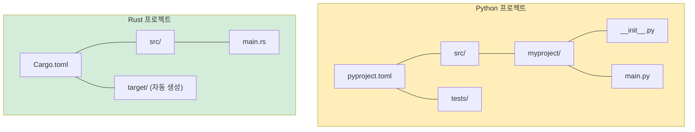

<a id="installation-and-setup"></a>
## 설치와 설정

> **이 장에서 배울 내용:** Rust와 툴체인을 설치하는 방법, Cargo 빌드 시스템과 `pip`/Poetry의 차이, IDE 설정, 첫 `Hello, world!` 프로그램, 그리고 Python 개념과 대응시켜 이해할 수 있는 핵심 Rust 키워드를 다룹니다.
>
> **난이도:** 🟢 입문

### Rust 설치하기
```bash
# rustup으로 Rust 설치 (Linux/macOS/WSL)
curl --proto '=https' --tlsv1.2 -sSf https://sh.rustup.rs | sh

# 설치 확인
rustc --version     # Rust 컴파일러
cargo --version     # 빌드 도구 + 패키지 관리자 (pip + setuptools를 합친 느낌)

# Rust 업데이트
rustup update
```

### Rust 도구 vs Python 도구

| 용도 | Python | Rust |
|---------|--------|------|
| 언어 런타임 | `python` (인터프리터) | `rustc` (컴파일러, 직접 호출하는 경우는 드묾) |
| 패키지 관리자 | `pip` / `poetry` / `uv` | `cargo` (내장) |
| 프로젝트 설정 | `pyproject.toml` | `Cargo.toml` |
| 잠금 파일 | `poetry.lock` / `requirements.txt` | `Cargo.lock` |
| 가상환경 | `venv` / `conda` | 필요 없음 (의존성은 프로젝트별로 관리) |
| 포매터 | `black` / `ruff format` | `rustfmt` (내장: `cargo fmt`) |
| 린터 | `ruff` / `flake8` / `pylint` | `clippy` (내장: `cargo clippy`) |
| 타입 검사기 | `mypy` / `pyright` | 컴파일러에 내장됨 (항상 실행) |
| 테스트 실행기 | `pytest` | `cargo test` (내장) |
| 문서 생성 | `sphinx` / `mkdocs` | `cargo doc` (내장) |
| REPL | `python` / `ipython` | 없음 (`cargo test` 또는 Rust Playground 활용) |

### IDE 설정

**VS Code** (추천):
```text
설치할 확장:
- rust-analyzer        ← 필수: IDE 기능, 타입 힌트, 자동완성
- Even Better TOML     ← Cargo.toml 문법 강조
- CodeLLDB             ← 디버거 지원

# Python 대응 개념:
# rust-analyzer ≈ Pylance (하지만 항상 100% 타입 커버리지)
# cargo clippy  ≈ ruff (스타일뿐 아니라 정확성까지 검사)
```

***

<a id="your-first-rust-program"></a>
## 첫 Rust 프로그램

### Python의 Hello World
```python
# hello.py — 바로 실행하면 됩니다
print("Hello, World!")

# 실행:
# python hello.py
```

### Rust의 Hello World
```rust
// src/main.rs — 먼저 컴파일해야 합니다
fn main() {
    println!("Hello, World!");   // println!은 매크로입니다 (!가 중요)
}

// 빌드하고 실행:
// cargo run
```

### Python 개발자가 먼저 알아둘 차이

```text
Python:                              Rust:
─────────                            ─────
- main()이 필요 없다                - fn main()이 진입점이다
- 들여쓰기가 블록을 만든다          - 중괄호 {}가 블록을 만든다
- print()는 함수다                  - println!()는 매크로다 (!가 중요)
- 세미콜론이 없다                   - 세미콜론이 문장을 끝낸다
- 타입 선언이 없다                  - 타입은 추론되지만 항상 존재한다
- 인터프리트 방식(바로 실행)        - 컴파일 후 실행 (`cargo build`, 그다음 실행)
- 오류가 런타임에 난다              - 대부분의 오류를 컴파일 타임에 잡는다
```

### 첫 프로젝트 만들기
```bash
# Python                              # Rust
mkdir myproject                        cargo new myproject
cd myproject                           cd myproject
python -m venv .venv                   # 가상환경이 필요 없음
source .venv/bin/activate              # 활성화도 필요 없음
# 파일을 직접 만들어야 함             # src/main.rs가 이미 생성됨

# Python 프로젝트 구조:                Rust 프로젝트 구조:
# myproject/                           myproject/
# ├── pyproject.toml                   ├── Cargo.toml        (pyproject.toml과 비슷함)
# ├── src/                             ├── src/
# │   └── myproject/                   │   └── main.rs       (진입점)
# │       ├── __init__.py              └── (__init__.py 불필요)
# │       └── main.py
# └── tests/
#     └── test_main.py
```



> **핵심 차이**: Rust 프로젝트는 더 단순합니다. `__init__.py`도, 가상환경도, `setup.py`와 `setup.cfg`, `pyproject.toml` 사이의 혼란도 없습니다. 사실상 `Cargo.toml`과 `src/`면 충분합니다.

***

<a id="cargo-vs-pippoetry"></a>
## Cargo와 pip/Poetry 비교

### 프로젝트 설정

```toml
# Python — pyproject.toml
[project]
name = "myproject"
version = "0.1.0"
requires-python = ">=3.10"
dependencies = [
    "requests>=2.28",
    "pydantic>=2.0",
]

[project.optional-dependencies]
dev = ["pytest", "ruff", "mypy"]
```

```toml
# Rust — Cargo.toml
[package]
name = "myproject"
version = "0.1.0"
edition = "2021"          # Rust edition (Python 버전과 비슷한 개념)

[dependencies]
reqwest = "0.12"          # HTTP 클라이언트 (requests와 비슷함)
serde = { version = "1.0", features = ["derive"] }  # 직렬화/역직렬화 (pydantic와 비슷한 역할)

[dev-dependencies]
# 테스트 의존성 — `cargo test`일 때만 컴파일됨
# (`cargo test`가 내장되어 있어 별도 테스트 설정이 거의 필요 없음)
```

### 자주 쓰는 Cargo 명령
```bash
# Python 쪽 대응                # Rust
pip install requests               cargo add reqwest
pip install -r requirements.txt    cargo build           # 의존성을 자동 설치
pip install -e .                   cargo build           # 항상 "editable"에 가까움
python -m pytest                   cargo test
python -m mypy .                   # 컴파일러에 내장되어 항상 실행됨
ruff check .                       cargo clippy
ruff format .                      cargo fmt
python main.py                     cargo run
python -c "..."                    # 대응 없음 — cargo run 또는 테스트 활용

# Rust 전용:
cargo new myproject                # 새 프로젝트 생성
cargo build --release              # 최적화 빌드 (debug보다 10~100배 빠를 수 있음)
cargo doc --open                   # API 문서 생성 후 브라우저 열기
cargo update                       # 의존성 업데이트 (pip install --upgrade와 비슷함)
```

***

<a id="essential-rust-keywords-for-python-developers"></a>
## Python 개발자가 알아두면 좋은 핵심 Rust 키워드

### 변수와 가변성 관련 키워드

```rust
// let — 변수 선언 (Python 대입과 비슷하지만 기본은 불변)
let name = "Alice";          // Python: name = "Alice" (하지만 Python은 기본적으로 가변)
// name = "Bob";             // ❌ 컴파일 오류! 기본이 불변

// mut — 가변성 명시
let mut count = 0;           // Python: count = 0 (Python에서는 항상 가변)
count += 1;                  // ✅ `mut` 덕분에 허용됨

// const — 컴파일 타임 상수 (Python의 대문자 관례와 달리 실제로 강제됨)
const MAX_SIZE: usize = 1024;   // Python: MAX_SIZE = 1024 (관례일 뿐)

// static — 전역 변수 (가급적 신중히 사용; Python은 모듈 전역을 자주 사용)
static VERSION: &str = "1.0";
```

### 소유권과 대여 관련 키워드

```rust
// 아래 개념들은 Python에 직접 대응되는 것이 없습니다 — Rust 고유 개념입니다

// & — borrow (읽기 전용 참조)
fn print_name(name: &str) { }    // Python: def print_name(name: str) — Python은 항상 참조 전달처럼 동작

// &mut — 가변 borrow
fn append(list: &mut Vec<i32>) { }  // Python: def append(lst: list) — Python에서는 기본적으로 가변

// move — 소유권 이전 (Rust에서는 암묵적으로 일어날 수 있지만 Python에는 없음)
let s1 = String::from("hello");
let s2 = s1;    // s1이 s2로 MOVE됨 — s1은 더 이상 유효하지 않음
// println!("{}", s1);  // ❌ 컴파일 오류: 값이 이동됨
```

### 타입 정의 관련 키워드

```rust
// struct — Python의 dataclass나 NamedTuple과 비슷함
struct Point {               // @dataclass
    x: f64,                  // class Point:
    y: f64,                  //     x: float
}                            //     y: float

// enum — Python enum보다 훨씬 강력함 (데이터를 담을 수 있음)
enum Shape {                 // Python에 직접 대응되는 개념은 없음
    Circle(f64),             // 각 variant가 서로 다른 데이터를 담을 수 있음
    Rectangle(f64, f64),
}

// impl — 타입에 메서드를 붙임 (클래스 내부에 메서드 정의하는 것과 비슷함)
impl Point {                 // class Point:
    fn distance(&self) -> f64 {  //     def distance(self) -> float:
        (self.x.powi(2) + self.y.powi(2)).sqrt()
    }
}

// trait — Python의 ABC나 Protocol (PEP 544)과 비슷함
trait Drawable {             // class Drawable(Protocol):
    fn draw(&self);          //     def draw(self) -> None: ...
}

// type — 타입 별칭 (Python의 TypeAlias와 비슷함)
type UserId = i64;           // UserId = int  (또는 TypeAlias)
```

### 제어 흐름 관련 키워드

```rust
// match — 누락 없는 패턴 매칭 (Python 3.10+ match와 비슷하지만 강제됨)
match value {
    1 => println!("one"),
    2 | 3 => println!("two or three"),
    _ => println!("other"),          // _ = 와일드카드 (Python의 case _:와 비슷함)
}

// if let — 구조 분해 + 조건 검사 (Python식으로 보면: if (m := regex.match(s)):)
if let Some(x) = optional_value {
    println!("{}", x);
}

// loop — 무한 루프 (while True:와 비슷함)
loop {
    break;  // 빠져나오려면 반드시 break 필요
}

// for — 반복 (Python의 for와 비슷하지만 .iter()를 더 자주 씀)
for item in collection.iter() {      // for item in collection:
    println!("{}", item);
}

// while let — 구조 분해를 곁들인 반복문
while let Some(item) = stack.pop() {
    process(item);
}
```

### 가시성 관련 키워드

```rust
// pub — 공개 (Python은 진짜 private이 없고 _ 관례를 사용)
pub fn greet() { }           // def greet():  — Python에서는 사실상 모두 "공개"

// pub(crate) — 크레이트 내부에서만 공개
pub(crate) fn internal() { } // def _internal():  — 단일 언더스코어 관례와 비슷함

// (키워드 없음) — 모듈 내부 비공개
fn private_helper() { }      // def __private():  — double underscore name mangling 비슷한 느낌

// Python에서 "private"는 사회적 약속에 가깝습니다.
// Rust에서는 컴파일러가 실제로 강제합니다.
```

---

<a id="exercises"></a>
## 연습문제

<details>
<summary><strong>🏋️ 연습문제: 첫 Rust 프로그램</strong> (펼쳐서 보기)</summary>

**도전 과제**: 새 Rust 프로젝트를 만들고 다음을 수행하는 프로그램을 작성해보세요.
1. 자신의 이름을 담은 변수 `name`을 선언한다 (타입은 `&str`)
2. 0에서 시작하는 가변 변수 `count`를 선언한다
3. `1..=5` 범위의 `for` 루프로 `count`를 증가시키면서 `"Hello, {name}! (count: {count})"`를 출력한다
4. 루프가 끝난 뒤 `match` 표현식으로 `count`가 짝수인지 홀수인지 출력한다

<details>
<summary>🔑 해답</summary>

```bash
cargo new hello_rust && cd hello_rust
```

```rust
// src/main.rs
fn main() {
    let name = "Pythonista";
    let mut count = 0u32;

    for _ in 1..=5 {
        count += 1;
        println!("Hello, {name}! (count: {count})");
    }

    let parity = match count % 2 {
        0 => "even",
        _ => "odd",
    };
    println!("Final count {count} is {parity}");
}
```

**핵심 정리**:
- `let`은 기본이 불변이므로 `count`를 바꾸려면 `mut`가 필요합니다
- `1..=5`는 끝값을 포함하는 범위입니다 (Python의 `range(1, 6)`)
- `match`는 값을 반환하는 표현식입니다
- `self`도, `if __name__ == "__main__"`도 없습니다. 그냥 `fn main()`이면 됩니다

</details>
</details>

***
