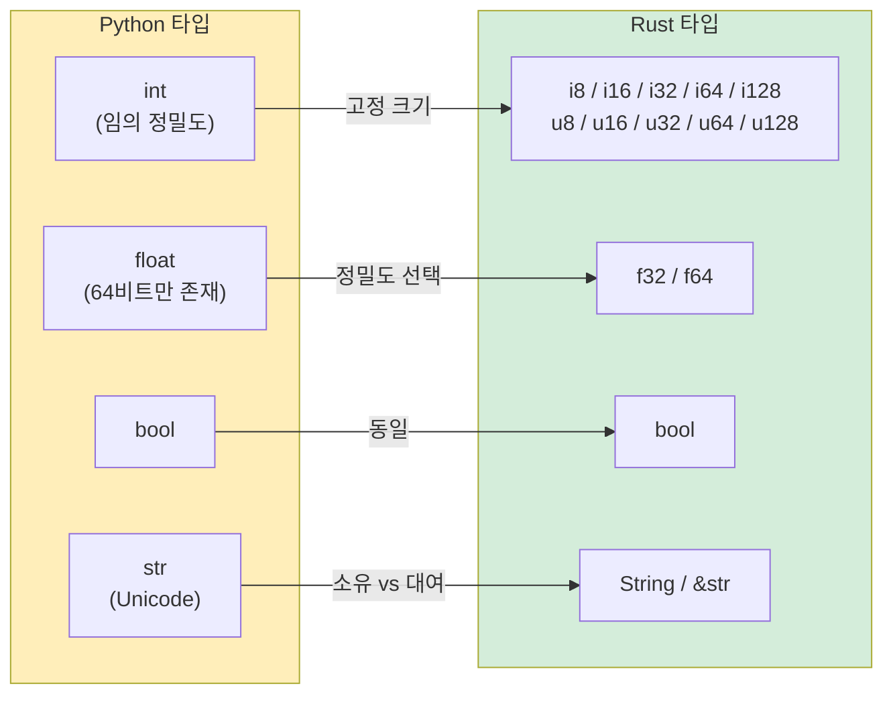

<a id="variables-and-mutability"></a>
## 변수와 가변성

> **이 장에서 배울 내용:** 기본이 불변인 변수, 명시적인 `mut`, Python의 arbitrary-precision `int`와 대비되는 기본 숫자 타입, `String`과 `&str`(초반에 가장 헷갈리기 쉬운 개념), 문자열 포매팅, 그리고 Rust에서 필수인 타입 애너테이션을 다룹니다.
>
> **난이도:** 🟢 입문

### Python 변수 선언
```python
# Python — 모든 것이 가변이고 동적 타이핑입니다
count = 0          # 가변, 타입은 int로 추론
count = 5          # ✅ 동작
count = "hello"    # ✅ 동작 — 타입도 바뀔 수 있음! (동적 타이핑)

# "상수"도 사실은 관례일 뿐입니다
MAX_SIZE = 1024    # 나중에 MAX_SIZE = 999를 해도 막을 방법이 없음
```

### Rust 변수 선언
```rust
// Rust — 기본은 불변이고 정적 타이핑입니다
let count = 0;           // 불변, 타입은 i32로 추론
// count = 5;            // ❌ 컴파일 오류: 불변 변수에 두 번 대입할 수 없음
// count = "hello";      // ❌ 컴파일 오류: 정수를 기대했는데 &str을 받음

let mut count = 0;       // 명시적으로 가변
count = 5;               // ✅ 동작
// count = "hello";      // ❌ 그래도 타입 자체는 바꿀 수 없음

const MAX_SIZE: usize = 1024; // 진짜 상수 — 컴파일러가 강제
```

### Python 개발자가 바꿔야 할 핵심 사고방식
```rust
// Python: 변수는 객체를 가리키는 라벨에 가깝습니다
// Rust: 변수는 자신이 가진 값을 소유하는 이름 있는 저장 위치입니다

// 변수 shadowing — Rust에만 있는 매우 유용한 기능
let input = "42";              // &str
let input = input.parse::<i32>().unwrap();  // 이제 i32 — 같은 이름의 새 변수
let input = input * 2;         // 이제 84 — 또 다른 새 변수

// Python에서는 단순히 다시 할당하고 이전 타입을 잃어버립니다:
// input = "42"
// input = int(input)   // 같은 이름에 다른 타입을 다시 넣을 수 있음
// 하지만 Rust에서는 각 `let`이 실제로 새로운 바인딩을 만듭니다. 이전 것은 사라집니다.
```

### 실전 예제: Counter
```python
# Python 버전
class Counter:
    def __init__(self):
        self.value = 0
    
    def increment(self):
        self.value += 1
    
    def get_value(self):
        return self.value

c = Counter()
c.increment()
print(c.get_value())  # 1
```

```rust
// Rust 버전
struct Counter {
    value: i64,
}

impl Counter {
    fn new() -> Self {
        Counter { value: 0 }
    }

    fn increment(&mut self) {     // &mut self = 이 값을 수정하겠다
        self.value += 1;
    }

    fn get_value(&self) -> i64 {  // &self = 읽기만 하겠다
        self.value
    }
}

fn main() {
    let mut c = Counter::new();   // increment()를 호출하려면 `mut`가 필요
    c.increment();
    println!("{}", c.get_value()); // 1
}
```

> **핵심 차이**: Rust에서는 메서드 시그니처의 `&mut self`만 봐도 `increment`가 값을 바꾼다는 사실을 알 수 있고, 컴파일러도 그 사실을 이해합니다. Python에서는 어떤 메서드든 무엇이든 바꿀 수 있으므로 코드를 읽어봐야만 알 수 있습니다.

***

<a id="primitive-types-comparison"></a>
## 기본 타입 비교



### 숫자 타입

| Python | Rust | 비고 |
|--------|------|-------|
| `int` (임의 정밀도) | `i8`, `i16`, `i32`, `i64`, `i128`, `isize` | Rust 정수는 크기가 고정됨 |
| `int` (부호 없음: 별도 타입 없음) | `u8`, `u16`, `u32`, `u64`, `u128`, `usize` | 부호 없는 타입을 명시적으로 사용 |
| `float` (64비트 IEEE 754) | `f32`, `f64` | Python은 64비트 float만 제공 |
| `bool` | `bool` | 같은 개념 |
| `complex` | 내장 없음 (`num` crate 사용) | 시스템 코드에서는 드묾 |

```python
# Python — 정수 타입은 하나이고, 임의 정밀도를 가집니다
x = 42                     # int — 얼마든지 커질 수 있음
big = 2 ** 1000            # 여전히 동작 — 수천 자리도 가능
y = 3.14                   # float — 항상 64비트
```

```rust
// Rust — 크기를 명시하며, overflow는 컴파일/런타임 오류가 될 수 있습니다
let x: i32 = 42;           // 32비트 부호 있는 정수
let y: f64 = 3.14;         // 64비트 실수 (Python의 float에 대응)
let big: i128 = 2_i128.pow(100); // 최대 128비트 — 임의 정밀도는 아님
// 임의 정밀도가 필요하면 `num-bigint` crate를 사용합니다

// 가독성을 위한 밑줄 (Python의 1_000_000과 동일)
let million = 1_000_000;   // 문법도 동일합니다!

// 타입 접미사 문법:
let a = 42u8;              // u8
let b = 3.14f32;           // f32
```

### 크기 기반 정수 타입 (중요!)

```rust
// usize와 isize — 포인터 크기 정수이며, 인덱싱에 쓰입니다
let length: usize = vec![1, 2, 3].len();  // .len()은 usize를 반환
let index: usize = 0;                     // 배열 인덱스는 항상 usize

// Python에서는 len()도 int이고 인덱스도 int라 구분이 없습니다.
// Rust에서는 i32와 usize를 섞으려면 명시적 변환이 필요합니다:
let i: i32 = 5;
// let item = vec[i];    // ❌ 오류: usize를 기대했는데 i32를 받음
let item = vec[i as usize]; // ✅ 명시적 변환
```

### 타입 추론

```rust
// Rust는 타입을 추론하지만, 한번 정해지면 고정됩니다 — 동적이지 않습니다
let x = 42;          // 컴파일러가 i32로 추론 (기본 정수 타입)
let y = 3.14;        // 컴파일러가 f64로 추론 (기본 실수 타입)
let s = "hello";     // 컴파일러가 &str로 추론 (문자열 슬라이스)
let v = vec![1, 2];  // 컴파일러가 Vec<i32>로 추론

// 언제든 명시적으로 적을 수도 있습니다:
let x: i64 = 42;
let y: f32 = 3.14;

// Python과 달리, 추론이 끝난 뒤 타입은 절대 바뀌지 않습니다:
let x = 42;
// x = "hello";      // ❌ 오류: 정수를 기대했는데 &str을 받음
```

***

<a id="string-types-string-vs-str"></a>
## 문자열 타입: String vs &str

이 부분은 Python 개발자에게 가장 놀라운 차이 중 하나입니다. Python에는 문자열 타입이 하나지만, Rust에는 대표적으로 **두 가지**가 있습니다.

### Python의 문자열 처리
```python
# Python — 문자열 타입은 하나이고, 불변이며, 참조 카운팅됩니다
name = "Alice"          # str — 불변, 힙에 저장됨
greeting = f"Hello, {name}!"  # f-string 포매팅
chars = list(name)      # 문자 리스트로 변환
upper = name.upper()    # 새 문자열 반환 (불변이므로)
```

### Rust의 문자열 타입
```rust
// Rust에는 대표적으로 문자열 타입이 두 가지 있습니다

// 1. &str (string slice) — 빌린 문자열, 불변, 문자열 데이터에 대한 "뷰"에 가까움
let name: &str = "Alice";           // 바이너리에 들어 있는 문자열 데이터를 가리킴
                                     // Python의 str과 가장 비슷하지만, 핵심은 "참조"라는 점

// 2. String (owned string) — 힙에 할당되고, 가변적이며, 소유권을 가짐
let mut greeting = String::from("Hello, ");  // 소유하며 수정 가능
greeting.push_str(name);
greeting.push('!');
// greeting은 이제 "Hello, Alice!"
```

### 어떤 것을 언제 써야 할까?

```rust
// 이렇게 생각하면 편합니다:
// &str   = "다른 누군가가 소유한 문자열을 읽기만 한다"  (읽기 전용 뷰)
// String = "이 문자열을 내가 소유하고 수정할 수 있다"  (소유 데이터)

// 함수 매개변수는 &str를 우선 고려합니다 (두 타입 모두 받을 수 있음)
fn greet(name: &str) -> String {          // &str와 &String 모두 허용
    format!("Hello, {}!", name)           // format!은 새 String을 만듦
}

let s1 = "world";                         // &str 리터럴
let s2 = String::from("Rust");            // String

greet(s1);      // ✅ &str는 바로 전달 가능
greet(&s2);     // ✅ &String은 자동으로 &str로 변환됨 (Deref coercion)
```

### 실전 예제

```python
# Python 문자열 연산
name = "alice"
upper = name.upper()               # "ALICE"
contains = "lic" in name           # True
parts = "a,b,c".split(",")         # ["a", "b", "c"]
joined = "-".join(["a", "b", "c"]) # "a-b-c"
stripped = "  hello  ".strip()     # "hello"
replaced = name.replace("a", "A") # "Alice"
```

```rust
// Rust 대응 예제
let name = "alice";
let upper = name.to_uppercase();           // String — 새 할당 발생
let contains = name.contains("lic");       // bool
let parts: Vec<&str> = "a,b,c".split(',').collect();  // Vec<&str>
let joined = ["a", "b", "c"].join("-");    // String
let stripped = "  hello  ".trim();         // &str — 추가 할당 없음!
let replaced = name.replace("a", "A");     // String

// 핵심 포인트: 어떤 연산은 &str를 반환하고(할당 없음), 어떤 연산은 String을 반환합니다.
// .trim()은 원본의 슬라이스를 돌려주므로 효율적입니다.
// .to_uppercase()는 새 String을 만들어야 하므로 할당이 필요합니다.
```

### Python 개발자라면 이렇게 생각해보세요

```text
Python str     ≈ Rust &str     (대부분은 읽기만 한다)
Python str     ≈ Rust String   (소유하거나 수정해야 할 때)

경험칙:
- 함수 매개변수     → &str 사용 (가장 유연함)
- 구조체 필드       → String 사용 (구조체가 데이터를 소유)
- 반환값            → String 사용 (호출자가 소유해야 함)
- 문자열 리터럴     → 자동으로 &str
```

***

<a id="printing-and-string-formatting"></a>
## 출력과 문자열 포매팅

### 기본 출력
```python
# Python
print("Hello, World!")
print("Name:", name, "Age:", age)    # 공백으로 구분
print(f"Name: {name}, Age: {age}")   # f-string
```

```rust
// Rust
println!("Hello, World!");
println!("Name: {} Age: {}", name, age);    // 위치 기반 {}
println!("Name: {name}, Age: {age}");       // 인라인 변수 (Rust 1.58+, f-string 느낌)
```

### 포맷 지정자
```python
# Python 포매팅
print(f"{3.14159:.2f}")          # "3.14" — 소수 둘째 자리까지
print(f"{42:05d}")               # "00042" — 0으로 채우기
print(f"{255:#x}")               # "0xff" — 16진수
print(f"{42:>10}")               # "        42" — 오른쪽 정렬
print(f"{'left':<10}|")          # "left      |" — 왼쪽 정렬
```

```rust
// Rust 포매팅 (Python과 매우 비슷합니다!)
println!("{:.2}", 3.14159);         // "3.14" — 소수 둘째 자리까지
println!("{:05}", 42);              // "00042" — 0으로 채우기
println!("{:#x}", 255);             // "0xff" — 16진수
println!("{:>10}", 42);             // "        42" — 오른쪽 정렬
println!("{:<10}|", "left");        // "left      |" — 왼쪽 정렬
```

### 디버그 출력
```python
# Python — repr()와 pprint
print(repr([1, 2, 3]))             # "[1, 2, 3]"
from pprint import pprint
pprint({"key": [1, 2, 3]})         # 보기 좋게 출력
```

```rust
// Rust — {:?}와 {:#?}
println!("{:?}", vec![1, 2, 3]);       // "[1, 2, 3]" — Debug 형식
println!("{:#?}", vec![1, 2, 3]);      // 보기 좋게 정렬된 Debug 형식

// 사용자 정의 타입을 출력하려면 Debug를 derive합니다
#[derive(Debug)]
struct Point { x: f64, y: f64 }

let p = Point { x: 1.0, y: 2.0 };
println!("{:?}", p);                   // "Point { x: 1.0, y: 2.0 }"
println!("{p:?}");                     // 인라인 문법으로도 동일
```

### 빠른 비교표

| Python | Rust | 비고 |
|--------|------|-------|
| `print(x)` | `println!("{}", x)` 또는 `println!("{x}")` | Display 형식 |
| `print(repr(x))` | `println!("{:?}", x)` | Debug 형식 |
| `f"Hello {name}"` | `format!("Hello {name}")` | String 반환 |
| `print(x, end="")` | `print!("{x}")` | 개행 없음 (`print!` vs `println!`) |
| `print(x, file=sys.stderr)` | `eprintln!("{x}")` | stderr로 출력 |
| `sys.stdout.write(s)` | `print!("{s}")` | 개행 없음 |

***

<a id="type-annotations-optional-vs-required"></a>
## 타입 애너테이션: 선택 vs 필수

### Python 타입 힌트 (선택 사항, 강제되지 않음)
```python
# Python — 타입 힌트는 문서이자 힌트일 뿐, 강제 규칙은 아닙니다
def add(a: int, b: int) -> int:
    return a + b

add(1, 2)         # ✅
add("a", "b")     # ✅ Python은 신경 쓰지 않음 — "ab" 반환
add(1, "2")       # ✅ 런타임에 깨지기 전까지는 통과: TypeError

# Union 타입, Optional
def find(key: str) -> int | None:
    ...

# 제네릭 타입
def first(items: list[int]) -> int | None:
    return items[0] if items else None

# 타입 별칭
UserId = int
Mapping = dict[str, list[int]]
```

### Rust 타입 선언 (필수, 컴파일러가 강제)
```rust
// Rust — 타입은 언제나 강제됩니다. 예외가 없습니다.
fn add(a: i32, b: i32) -> i32 {
    a + b
}

add(1, 2);         // ✅
// add("a", "b");  // ❌ 컴파일 오류: i32를 기대했는데 &str을 받음

// Optional 값은 Option<T>를 사용
fn find(key: &str) -> Option<i32> {
    // Some(value) 또는 None을 반환
    Some(42)
}

// 제네릭 타입
fn first(items: &[i32]) -> Option<i32> {
    items.first().copied()
}

// 타입 별칭
type UserId = i64;
type Mapping = HashMap<String, Vec<i32>>;
```

> **핵심 포인트**: Python에서 타입 힌트는 IDE와 mypy에 도움이 되지만, 런타임 동작에는 영향을 주지 않습니다. Rust에서는 타입이 곧 프로그램의 일부입니다. 컴파일러는 타입을 이용해 메모리 안전성을 보장하고, data race를 막고, null pointer 오류를 제거합니다.
>
> 📌 **함께 보기**: [6장 — 열거형과 패턴 매칭](ch06-enums-and-pattern-matching.md)은 Rust 타입 시스템이 Python의 `Union` 타입과 `isinstance()` 검사를 어떻게 대체하는지 보여줍니다.

---

<a id="exercises"></a>
## 연습문제

<details>
<summary><strong>🏋️ 연습문제: 온도 변환기</strong> (펼쳐서 보기)</summary>

**도전 과제**: 함수 `celsius_to_fahrenheit(c: f64) -> f64`와 함수 `classify(temp_f: f64) -> &'static str`를 작성해보세요. `classify`는 임계값에 따라 `"cold"`, `"mild"`, `"hot"` 중 하나를 반환해야 합니다. 섭씨 0도, 20도, 35도에 대한 결과를 문자열 포매팅으로 출력하세요.

<details>
<summary>🔑 해답</summary>

```rust
fn celsius_to_fahrenheit(c: f64) -> f64 {
    c * 9.0 / 5.0 + 32.0
}

fn classify(temp_f: f64) -> &'static str {
    if temp_f < 50.0 { "cold" }
    else if temp_f < 77.0 { "mild" }
    else { "hot" }
}

fn main() {
    for c in [0.0, 20.0, 35.0] {
        let f = celsius_to_fahrenheit(c);
        println!("{c:.1}°C = {f:.1}°F — {}", classify(f));
    }
}
```

**핵심 정리**: Rust에서는 `f64`를 명시해야 하고(암묵적인 int→float 변환 없음), `for`는 배열을 직접 순회하며(`range()` 없음), `if/else` 블록도 값을 반환하는 표현식입니다.

</details>
</details>

***
