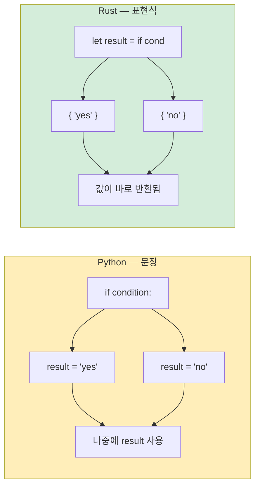

<a id="conditional-statements"></a>
## 조건문

> **이 장에서 배울 내용:** 괄호 없이(하지만 중괄호는 필요) 쓰는 `if`/`else`, Python의 반복 모델과 비교한 `loop`/`while`/`for`, 모든 것이 값을 돌려주는 표현식 블록, 그리고 반환 타입이 필수인 함수 시그니처를 다룹니다.
>
> **난이도:** 🟢 입문

### if/else

```python
# Python
if temperature > 100:
    print("Too hot!")
elif temperature < 0:
    print("Too cold!")
else:
    print("Just right")

# 삼항 표현식
status = "hot" if temperature > 100 else "ok"
```

```rust
// Rust — 중괄호는 필수, 콜론은 없고, `elif` 대신 `else if`
if temperature > 100 {
    println!("Too hot!");
} else if temperature < 0 {
    println!("Too cold!");
} else {
    println!("Just right");
}

// if는 표현식입니다 — 값을 반환합니다 (Python의 삼항식보다 더 강력함)
let status = if temperature > 100 { "hot" } else { "ok" };
```

### 중요한 차이점
```rust
// 1. 조건식은 반드시 bool이어야 합니다 — truthy/falsy 없음
let x = 42;
// if x { }          // ❌ 오류: bool이 필요한데 정수를 받음
if x != 0 { }        // ✅ 명시적 비교가 필요

// Python에서는 아래가 모두 truthy/falsy로 동작합니다:
// if []:      → False    (빈 리스트)
// if "":      → False    (빈 문자열)
// if 0:       → False    (0)
// if None:    → False

// Rust에서는 조건에 오직 bool만 올 수 있습니다:
let items: Vec<i32> = vec![];
// if items { }           // ❌ 오류
if !items.is_empty() { }  // ✅ 명시적 검사

let name = "";
// if name { }             // ❌ 오류
if !name.is_empty() { }    // ✅ 명시적 검사
```

***

<a id="loops-and-iteration"></a>
## 반복문과 순회

### for 반복문
```python
# Python
for i in range(5):
    print(i)

for item in ["a", "b", "c"]:
    print(item)

for i, item in enumerate(["a", "b", "c"]):
    print(f"{i}: {item}")

for key, value in {"x": 1, "y": 2}.items():
    print(f"{key} = {value}")
```

```rust
// Rust
for i in 0..5 {                           // range(5) → 0..5
    println!("{}", i);
}

for item in ["a", "b", "c"] {             // 직접 순회
    println!("{}", item);
}

for (i, item) in ["a", "b", "c"].iter().enumerate() {  // enumerate()
    println!("{}: {}", i, item);
}

// HashMap 순회
use std::collections::HashMap;
let map = HashMap::from([("x", 1), ("y", 2)]);
for (key, value) in &map {                // &로 map을 빌림
    println!("{} = {}", key, value);
}
```

### 범위(range) 문법
```rust
Python:              Rust:               비고:
range(5)             0..5                반열림 구간 (끝 제외)
range(1, 10)         1..10               반열림 구간
range(1, 11)         1..=10              닫힌 구간 (끝 포함)
range(0, 10, 2)      (0..10).step_by(2)  step은 메서드이지 문법이 아님
```

### while 반복문
```python
# Python
count = 0
while count < 5:
    print(count)
    count += 1

# 무한 루프
while True:
    data = get_input()
    if data == "quit":
        break
```

```rust
// Rust
let mut count = 0;
while count < 5 {
    println!("{}", count);
    count += 1;
}

// 무한 루프 — `while true`가 아니라 `loop`를 사용
loop {
    let data = get_input();
    if data == "quit" {
        break;
    }
}

// loop는 값을 반환할 수도 있습니다! (Rust만의 특징)
let result = loop {
    let input = get_input();
    if let Ok(num) = input.parse::<i32>() {
        break num;  // 값을 가진 `break` — 루프에서의 return처럼 생각할 수 있음
    }
    println!("Not a number, try again");
};
```

### 리스트 컴프리헨션 vs 이터레이터 체인
```python
# Python — list comprehension
squares = [x ** 2 for x in range(10)]
evens = [x for x in range(20) if x % 2 == 0]
pairs = [(x, y) for x in range(3) for y in range(3)]
```

```rust
// Rust — iterator 체인 (.map, .filter, .collect)
let squares: Vec<i32> = (0..10).map(|x| x * x).collect();
let evens: Vec<i32> = (0..20).filter(|x| x % 2 == 0).collect();
let pairs: Vec<(i32, i32)> = (0..3)
    .flat_map(|x| (0..3).map(move |y| (x, y)))
    .collect();

// 이것들은 LAZY합니다 — .collect()를 하기 전까지 실제 실행되지 않습니다
// Python comprehension은 eager하게 바로 실행됩니다
// 큰 데이터셋에서는 Rust iterator가 더 효율적일 수 있습니다
```

***

<a id="expression-blocks"></a>
## 표현식 블록

Rust에서는 거의 모든 것이 표현식입니다(혹은 표현식이 될 수 있습니다). `if`와 `for`가 문장(statement)인 Python과 비교하면 큰 사고방식 전환입니다.

```python
# Python — if는 문장입니다 (삼항식 제외)
if condition:
    result = "yes"
else:
    result = "no"

# 또는 삼항식 (표현식 하나만 가능)
result = "yes" if condition else "no"
```

```rust
// Rust — if는 표현식입니다 (값을 반환함)
let result = if condition { "yes" } else { "no" };

// 블록도 표현식입니다 — 마지막 줄(세미콜론 없음)이 반환값
let value = {
    let x = 5;
    let y = 10;
    x + y    // 세미콜론이 없으므로 이 블록의 값은 15
};

// match 역시 표현식입니다
let description = match temperature {
    t if t > 100 => "boiling",
    t if t > 50 => "hot",
    t if t > 20 => "warm",
    _ => "cold",
};
```

아래 다이어그램은 Python의 statement 중심 제어 흐름과 Rust의 expression 중심 제어 흐름이 어떻게 다른지 보여줍니다.



> **세미콜론 규칙**: Rust에서는 블록의 마지막 표현식 뒤에 **세미콜론이 없으면** 그 값이 블록의 반환값이 됩니다. 세미콜론을 붙이면 문장이 되어 `()`를 반환합니다. Python 개발자에게는 처음에 암묵적 `return`처럼 느껴질 수 있습니다.

***

<a id="functions-and-type-signatures"></a>
## 함수와 타입 시그니처

### Python 함수
```python
# Python — 타입은 선택 사항, 디스패치는 동적
def greet(name: str, greeting: str = "Hello") -> str:
    return f"{greeting}, {name}!"

# 기본 인자, *args, **kwargs
def flexible(*args, **kwargs):
    pass

# 일급 함수
def apply(f, x):
    return f(x)

result = apply(lambda x: x * 2, 5)  # 10
```

### Rust 함수
```rust
// Rust — 함수 시그니처의 타입은 필수, 기본 인자는 없음
fn greet(name: &str, greeting: &str) -> String {
    format!("{}, {}!", greeting, name)
}

// 기본 인자가 없으므로 builder pattern이나 Option을 사용
fn greet_with_default(name: &str, greeting: Option<&str>) -> String {
    let greeting = greeting.unwrap_or("Hello");
    format!("{}, {}!", greeting, name)
}

// *args/**kwargs도 없으므로 슬라이스나 구조체를 사용
fn sum_all(numbers: &[i32]) -> i32 {
    numbers.iter().sum()
}

// 일급 함수와 클로저
fn apply(f: fn(i32) -> i32, x: i32) -> i32 {
    f(x)
}

let result = apply(|x| x * 2, 5);  // 10
```

### 반환값
```python
# Python — return은 명시적, 아무것도 없으면 None
def divide(a, b):
    if b == 0:
        return None  # 또는 예외를 던질 수 있음
    return a / b
```

```rust
// Rust — 마지막 표현식이 반환값입니다 (세미콜론 없음)
fn divide(a: f64, b: f64) -> Option<f64> {
    if b == 0.0 {
        None              // 조기 반환 (원하면 `return None;`도 가능)
    } else {
        Some(a / b)       // 마지막 표현식 — 암묵적 반환
    }
}
```

### 여러 값 반환하기
```python
# Python — 튜플 반환
def min_max(numbers):
    return min(numbers), max(numbers)

lo, hi = min_max([3, 1, 4, 1, 5])
```

```rust
// Rust — 튜플 반환 (같은 개념입니다!)
fn min_max(numbers: &[i32]) -> (i32, i32) {
    let min = *numbers.iter().min().unwrap();
    let max = *numbers.iter().max().unwrap();
    (min, max)
}

let (lo, hi) = min_max(&[3, 1, 4, 1, 5]);
```

### 메서드: self vs &self vs &mut self
```rust
// Python에서는 `self`가 사실상 항상 객체에 대한 가변 참조처럼 쓰입니다.
// Rust에서는 직접 선택합니다:

impl MyStruct {
    fn new() -> Self { ... }                // self 없음 — "정적 메서드" / "classmethod" 느낌
    fn read_only(&self) { ... }             // &self — 불변 borrow (수정 불가)
    fn modify(&mut self) { ... }            // &mut self — 가변 borrow (수정 가능)
    fn consume(self) { ... }                // self — 소유권을 가져감 (객체가 이동됨)
}

// Python 대응:
// class MyStruct:
//     @classmethod
//     def new(cls): ...                    # 인스턴스가 필요 없음
//     def read_only(self): ...             # Python에서는 셋이 모두 같은 모양
//     def modify(self): ...                # Python의 self는 기본적으로 가변
//     def consume(self): ...               # Python은 self를 "소비"하지 않음
```

---

<a id="exercises"></a>
## 연습문제

<details>
<summary><strong>🏋️ 연습문제: 표현식으로 FizzBuzz 만들기</strong> (펼쳐서 보기)</summary>

**도전 과제**: Rust의 표현식 기반 `match`를 사용해 1..=30 범위의 FizzBuzz를 작성해보세요. 각 숫자는 `"Fizz"`, `"Buzz"`, `"FizzBuzz"`, 또는 숫자 자체를 출력해야 합니다. 표현식으로 `match (n % 3, n % 5)`를 사용하세요.

<details>
<summary>🔑 해답</summary>

```rust
fn main() {
    for n in 1..=30 {
        let result = match (n % 3, n % 5) {
            (0, 0) => String::from("FizzBuzz"),
            (0, _) => String::from("Fizz"),
            (_, 0) => String::from("Buzz"),
            _ => n.to_string(),
        };
        println!("{result}");
    }
}
```

**핵심 정리**: `match`는 값을 반환하는 표현식이므로 `if/elif/else` 체인이 필요 없습니다. `_` 와일드카드는 Python의 `case _:` 기본 분기를 대신합니다.

</details>
</details>

***