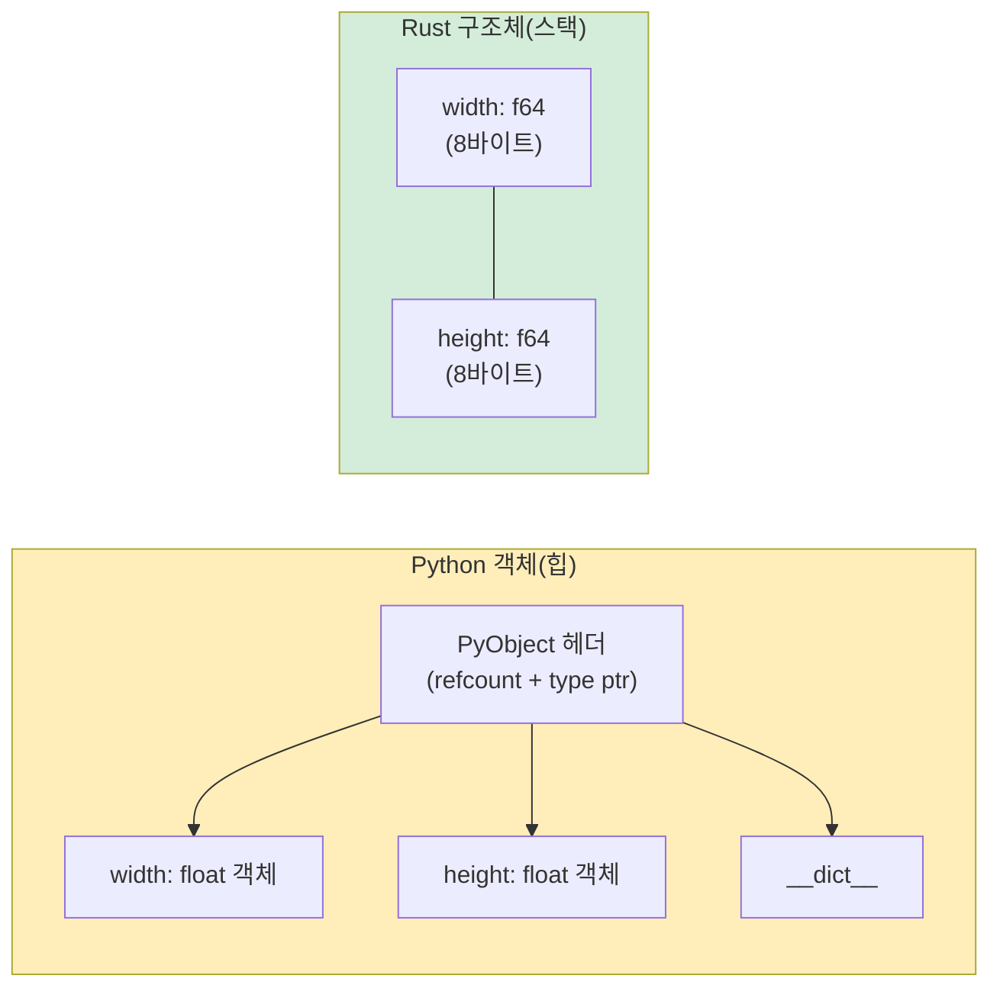

<a id="tuples-and-destructuring"></a>
## 튜플과 구조 분해

> **이 장에서 배우는 것:** Rust 튜플과 Python 튜플의 차이, 배열과 슬라이스, 구조체(Rust에서 클래스를 대신하는 도구), `Vec<T>`와 `list`, `HashMap<K, V>`와 `dict`, 그리고 도메인 모델링을 위한 newtype 패턴을 배웁니다.
>
> **난이도:** 🟢 입문

### Python 튜플
```python
# Python - 튜플은 변경 불가능한 시퀀스다
point = (3.0, 4.0)
x, y = point                    # 언패킹
print(f"x={x}, y={y}")

# 튜플에는 서로 다른 타입을 담을 수 있다
record = ("Alice", 30, True)
name, age, active = record

# 더 명확한 표현을 위한 NamedTuple
from typing import NamedTuple

class Point(NamedTuple):
    x: float
    y: float

p = Point(3.0, 4.0)
print(p.x)                      # 이름으로 접근
```

### Rust 튜플
```rust
// Rust - 튜플은 고정 크기이며 타입이 정해져 있고, 서로 다른 타입을 담을 수 있다
let point: (f64, f64) = (3.0, 4.0);
let (x, y) = point;              // 구조 분해 (Python의 언패킹과 같은 개념)
println!("x={x}, y={y}");

// 서로 다른 타입
let record: (&str, i32, bool) = ("Alice", 30, true);
let (name, age, active) = record;

// 인덱스로 접근 (Python과 달리 .0 .1 .2 문법 사용)
let first = record.0;            // "Alice"
let second = record.1;           // 30

// Python: record[0]
// Rust:   record.0      (점 인덱스이며 대괄호 인덱스가 아니다)
```

### 튜플과 구조체는 언제 사용할까
```rust
// 튜플: 간단한 묶음, 함수 반환값, 임시 값
fn min_max(data: &[i32]) -> (i32, i32) {
    (*data.iter().min().unwrap(), *data.iter().max().unwrap())
}
let (lo, hi) = min_max(&[3, 1, 4, 1, 5]);

// 구조체: 이름 있는 필드, 분명한 의도, 메서드
struct Point { x: f64, y: f64 }

// 경험칙:
// - 같은 타입 필드가 2-3개면 튜플로도 충분하다
// - 이름 있는 필드가 필요하면 구조체를 쓴다
// - 메서드가 필요하면 구조체를 쓴다
// (Python의 tuple vs namedtuple vs dataclass와 비슷한 기준)
```

***

<a id="arrays-and-slices"></a>
## 배열과 슬라이스

### Python 리스트 vs Rust 배열
```python
# Python - 리스트는 동적이고, 이질적인 값을 담을 수 있다
numbers = [1, 2, 3, 4, 5]       # 길이를 늘리거나 줄일 수 있고, 서로 다른 타입도 담을 수 있다
numbers.append(6)
mixed = [1, "two", 3.0]         # 서로 다른 타입 허용
```

```rust
// Rust에는 고정 크기와 동적 크기를 다루는 두 가지 개념이 있다

// 1. 배열(Array) - 고정 크기, 스택 할당 (Python에 정확히 대응하는 타입은 없음)
let numbers: [i32; 5] = [1, 2, 3, 4, 5]; // 길이도 타입의 일부다!
// numbers.push(6);  // ❌ 배열은 길이를 늘릴 수 없다

// 모든 요소를 같은 값으로 초기화
let zeros = [0; 10];            // [0, 0, 0, 0, 0, 0, 0, 0, 0, 0]

// 2. 슬라이스(Slice) - 배열이나 Vec를 바라보는 뷰 (Python 슬라이싱과 비슷하지만 대여된다)
let slice: &[i32] = &numbers[1..4]; // [2, 3, 4] - 복사본이 아니라 참조

// Python: numbers[1:4] 는 새로운 리스트(복사본)를 만든다
// Rust:   &numbers[1..4] 는 뷰를 만든다 (복사 없음, 할당 없음)
```

### 실전 비교
```python
# Python 슬라이싱 - 복사본을 만든다
data = [10, 20, 30, 40, 50]
first_three = data[:3]          # 새 리스트: [10, 20, 30]
last_two = data[-2:]            # 새 리스트: [40, 50]
reversed_data = data[::-1]      # 새 리스트: [50, 40, 30, 20, 10]
```

```rust
// Rust 슬라이싱 - 뷰(참조)를 만든다
let data = [10, 20, 30, 40, 50];
let first_three = &data[..3];         // &[i32], 뷰: [10, 20, 30]
let last_two = &data[3..];            // &[i32], 뷰: [40, 50]

// 음수 인덱스는 없으므로 .len()을 사용한다
let last_two = &data[data.len()-2..]; // &[i32], 뷰: [40, 50]

// 뒤집기는 이터레이터로 처리한다
let reversed: Vec<i32> = data.iter().rev().copied().collect();
```

***

<a id="structs-vs-classes"></a>
## 구조체 vs 클래스

### Python 클래스
```python
# Python - __init__, 메서드, 프로퍼티를 가진 클래스
from dataclasses import dataclass

@dataclass
class Rectangle:
    width: float
    height: float

    def area(self) -> float:
        return self.width * self.height

    def perimeter(self) -> float:
        return 2.0 * (self.width + self.height)

    def scale(self, factor: float) -> "Rectangle":
        return Rectangle(self.width * factor, self.height * factor)

    def __str__(self) -> str:
        return f"Rectangle({self.width} x {self.height})"

r = Rectangle(10.0, 5.0)
print(r.area())         # 50.0
print(r)                # Rectangle(10.0 x 5.0)
```

### Rust 구조체
```rust
// Rust - struct + impl 블록 (상속은 없다!)
#[derive(Debug, Clone)]
struct Rectangle {
    width: f64,
    height: f64,
}

impl Rectangle {
    // "생성자" - 연관 함수(self 없음)
    fn new(width: f64, height: f64) -> Self {
        Rectangle { width, height }   // 이름이 같을 때 쓰는 필드 축약 문법
    }

    fn area(&self) -> f64 {
        self.width * self.height
    }

    fn perimeter(&self) -> f64 {
        2.0 * (self.width + self.height)
    }

    fn scale(&self, factor: f64) -> Rectangle {
        Rectangle::new(self.width * factor, self.height * factor)
    }
}

// Display 트레잇 = Python의 __str__
impl std::fmt::Display for Rectangle {
    fn fmt(&self, f: &mut std::fmt::Formatter<'_>) -> std::fmt::Result {
        write!(f, "Rectangle({} x {})", self.width, self.height)
    }
}

fn main() {
    let r = Rectangle::new(10.0, 5.0);
    println!("{}", r.area());    // 50.0
    println!("{}", r);           // Rectangle(10 x 5)
}
```



> **메모리 관점:** Python의 `Rectangle` 객체는 56바이트 헤더와 별도로 힙에 할당된 float 객체들을 가집니다. Rust의 `Rectangle`은 스택에서 정확히 16바이트이며, 간접 참조도 없고 GC 부담도 없습니다.
>
> 📌 **함께 보기:** [10장 - 트레잇과 제네릭](ch10-traits-and-generics.md)에서는 `Display`, `Debug`, 연산자 오버로딩 같은 트레잇을 구조체에 구현하는 방법을 다룹니다.

### 대응표: Python 매직 메서드 -> Rust 트레잇

| Python | Rust | 용도 |
|--------|------|------|
| `__str__` | `impl Display` | 사람이 읽기 좋은 문자열 |
| `__repr__` | `#[derive(Debug)]` | 디버그 표현 |
| `__eq__` | `#[derive(PartialEq)]` | 동등성 비교 |
| `__hash__` | `#[derive(Hash)]` | 해시 가능 (`dict` 키 / `HashSet`) |
| `__lt__`, `__le__`, etc. | `#[derive(PartialOrd, Ord)]` | 정렬 순서 |
| `__add__` | `impl Add` | `+` 연산자 |
| `__iter__` | `impl Iterator` | 반복 |
| `__len__` | `.len()` 메서드 | 길이 |
| `__enter__`/`__exit__` | `impl Drop` | 정리 작업 (Rust에서는 자동) |
| `__init__` | `fn new()` (관례) | 생성자 |
| `__getitem__` | `impl Index` | `[]` 인덱싱 |
| `__contains__` | `.contains()` 메서드 | `in` 연산자 |

### 상속 대신 조합
```python
# Python - 상속
class Animal:
    def __init__(self, name: str):
        self.name = name
    def speak(self) -> str:
        raise NotImplementedError

class Dog(Animal):
    def speak(self) -> str:
        return f"{self.name} says Woof!"

class Cat(Animal):
    def speak(self) -> str:
        return f"{self.name} says Meow!"
```

```rust
// Rust - 트레잇 + 조합 (상속 없음)
trait Animal {
    fn name(&self) -> &str;
    fn speak(&self) -> String;
}

struct Dog { name: String }
struct Cat { name: String }

impl Animal for Dog {
    fn name(&self) -> &str { &self.name }
    fn speak(&self) -> String {
        format!("{} says Woof!", self.name)
    }
}

impl Animal for Cat {
    fn name(&self) -> &str { &self.name }
    fn speak(&self) -> String {
        format!("{} says Meow!", self.name)
    }
}

// 다형성이 필요하면 trait object를 사용한다 (Python의 duck typing과 비슷)
fn animal_roll_call(animals: &[&dyn Animal]) {
    for a in animals {
        println!("{}", a.speak());
    }
}
```

> **생각의 틀:** Python은 "행동을 상속한다"에 가깝고, Rust는 "계약을 구현한다"에 가깝습니다.
> 결과는 비슷해 보일 수 있지만, Rust는 다이아몬드 상속 문제와 취약한 기반 클래스 문제를 피합니다.

***

<a id="vec-vs-list"></a>
## Vec와 list

`Vec<T>`는 Rust의 가변 길이 힙 할당 배열로, Python의 `list`에 가장 가까운 타입입니다.

### 벡터 만들기
```python
# Python
numbers = [1, 2, 3]
empty = []
repeated = [0] * 10
from_range = list(range(1, 6))
```

```rust
// Rust
let numbers = vec![1, 2, 3];            // vec! 매크로 (리스트 리터럴과 비슷)
let empty: Vec<i32> = Vec::new();        // 빈 vec (타입 표기가 필요함)
let repeated = vec![0; 10];              // [0, 0, 0, 0, 0, 0, 0, 0, 0, 0]
let from_range: Vec<i32> = (1..6).collect(); // [1, 2, 3, 4, 5]
```

### 자주 쓰는 연산
```python
# Python list 연산
nums = [1, 2, 3]
nums.append(4)                   # [1, 2, 3, 4]
nums.extend([5, 6])              # [1, 2, 3, 4, 5, 6]
nums.insert(0, 0)                # [0, 1, 2, 3, 4, 5, 6]
last = nums.pop()                # 6, nums = [0, 1, 2, 3, 4, 5]
length = len(nums)               # 6
nums.sort()                      # 제자리 정렬
sorted_copy = sorted(nums)       # 새로 정렬된 리스트
nums.reverse()                   # 제자리 뒤집기
contains = 3 in nums             # True
index = nums.index(3)            # 첫 번째 3의 인덱스
```

```rust
// Rust Vec 연산
let mut nums = vec![1, 2, 3];
nums.push(4);                          // [1, 2, 3, 4]
nums.extend([5, 6]);                   // [1, 2, 3, 4, 5, 6]
nums.insert(0, 0);                     // [0, 1, 2, 3, 4, 5, 6]
let last = nums.pop();                 // Some(6), nums = [0, 1, 2, 3, 4, 5]
let length = nums.len();               // 6
nums.sort();                           // 제자리 정렬
let mut sorted_copy = nums.clone();
sorted_copy.sort();                    // 복사본 정렬
nums.reverse();                        // 제자리 뒤집기
let contains = nums.contains(&3);      // true
let index = nums.iter().position(|&x| x == 3); // Some(index) 또는 None
```

### 빠른 비교

| Python | Rust | 메모 |
|--------|------|------|
| `lst.append(x)` | `vec.push(x)` | |
| `lst.extend(other)` | `vec.extend(other)` | |
| `lst.pop()` | `vec.pop()` | `Option<T>`를 반환 |
| `lst.insert(i, x)` | `vec.insert(i, x)` | |
| `lst.remove(x)` | `vec.retain(\|v\| v != &x)` | |
| `del lst[i]` | `vec.remove(i)` | 제거한 원소를 반환 |
| `len(lst)` | `vec.len()` | |
| `x in lst` | `vec.contains(&x)` | |
| `lst.sort()` | `vec.sort()` | |
| `sorted(lst)` | clone 후 sort, 또는 iterator 사용 | |
| `lst[i]` | `vec[i]` | 범위를 벗어나면 panic |
| `lst.get(i, default)` | `vec.get(i)` | `Option<&T>`를 반환 |
| `lst[1:3]` | `&vec[1..3]` | 슬라이스를 반환 (복사 없음) |

***

<a id="hashmap-vs-dict"></a>
## HashMap과 dict

`HashMap<K, V>`는 Rust의 해시 맵으로, Python의 `dict`에 해당합니다.

### HashMap 만들기
```python
# Python
scores = {"Alice": 100, "Bob": 85}
empty = {}
from_pairs = dict([("x", 1), ("y", 2)])
comprehension = {k: v for k, v in zip(keys, values)}
```

```rust
// Rust
use std::collections::HashMap;

let scores = HashMap::from([("Alice", 100), ("Bob", 85)]);
let empty: HashMap<String, i32> = HashMap::new();
let from_pairs: HashMap<&str, i32> = [("x", 1), ("y", 2)].into_iter().collect();
let comprehension: HashMap<_, _> = keys.iter().zip(values.iter()).collect();
```

### 자주 쓰는 연산
```python
# Python dict 연산
d = {"a": 1, "b": 2}
d["c"] = 3                       # 삽입
val = d["a"]                     # 1 (없으면 KeyError)
val = d.get("z", 0)              # 0 (없으면 기본값)
del d["b"]                       # 삭제
exists = "a" in d                # True
keys = list(d.keys())            # ["a", "c"]
values = list(d.values())        # [1, 3]
items = list(d.items())          # [("a", 1), ("c", 3)]
length = len(d)                  # 2

# setdefault / defaultdict
from collections import defaultdict
word_count = defaultdict(int)
for word in words:
    word_count[word] += 1
```

```rust
// Rust HashMap 연산
use std::collections::HashMap;

let mut d = HashMap::new();
d.insert("a", 1);
d.insert("b", 2);
d.insert("c", 3);                       // 삽입 또는 덮어쓰기

let val = d["a"];                        // 1 (없으면 panic)
let val = d.get("z").copied().unwrap_or(0); // 0 (안전한 접근)
d.remove("b");                          // 삭제
let exists = d.contains_key("a");       // true
let keys: Vec<_> = d.keys().collect();
let values: Vec<_> = d.values().collect();
let length = d.len();

// entry API = Python의 setdefault / defaultdict 패턴
let mut word_count: HashMap<&str, i32> = HashMap::new();
for word in words {
    *word_count.entry(word).or_insert(0) += 1;
}
```

### 빠른 비교

| Python | Rust | 메모 |
|--------|------|------|
| `d[key] = val` | `d.insert(key, val)` | `Option<V>`(이전 값)를 반환 |
| `d[key]` | `d[&key]` | 없으면 panic |
| `d.get(key)` | `d.get(&key)` | `Option<&V>`를 반환 |
| `d.get(key, default)` | `d.get(&key).unwrap_or(&default)` | |
| `key in d` | `d.contains_key(&key)` | |
| `del d[key]` | `d.remove(&key)` | `Option<V>`를 반환 |
| `d.keys()` | `d.keys()` | Iterator |
| `d.values()` | `d.values()` | Iterator |
| `d.items()` | `d.iter()` | `(&K, &V)` Iterator |
| `len(d)` | `d.len()` | |
| `d.update(other)` | `d.extend(other)` | |
| `defaultdict(int)` | `.entry().or_insert(0)` | Entry API |
| `d.setdefault(k, v)` | `d.entry(k).or_insert(v)` | Entry API |

***

### 다른 컬렉션

| Python | Rust | 메모 |
|--------|------|------|
| `set()` | `HashSet<T>` | `use std::collections::HashSet;` |
| `collections.deque` | `VecDeque<T>` | `use std::collections::VecDeque;` |
| `heapq` | `BinaryHeap<T>` | 기본은 최대 힙 |
| `collections.OrderedDict` | `IndexMap` (crate) | `HashMap`은 순서를 보존하지 않음 |
| `sortedcontainers.SortedList` | `BTreeSet<T>` / `BTreeMap<K, V>` | 트리 기반, 정렬 유지 |

---

<a id="exercises"></a>
## 연습문제

<details>
<summary><strong>🏋️ 연습문제: 단어 빈도 세기</strong> (클릭하여 펼치기)</summary>

**도전 과제:** `&str` 문장을 받아 단어 빈도를 세는 `HashMap<String, usize>`를 반환하는 함수를 작성해 보세요(대소문자 구분 없음). Python에서는 `Counter(s.lower().split())`로 쓸 수 있는 작업입니다. 이를 Rust로 옮겨 보세요.

<details>
<summary>🔑 해답</summary>

```rust
use std::collections::HashMap;

fn word_frequencies(text: &str) -> HashMap<String, usize> {
    let mut counts = HashMap::new();
    for word in text.split_whitespace() {
        let key = word.to_lowercase();
        *counts.entry(key).or_insert(0) += 1;
    }
    counts
}

fn main() {
    let text = "the quick brown fox jumps over the lazy fox";
    let freq = word_frequencies(text);
    for (word, count) in &freq {
        println!("{word}: {count}");
    }
}
```

**핵심 포인트:** `HashMap::entry().or_insert()`는 Rust에서 Python의 `defaultdict`나 `Counter`에 해당하는 패턴입니다. `or_insert`가 `&mut usize`를 반환하므로 `*` 역참조가 필요합니다.

</details>
</details>

***