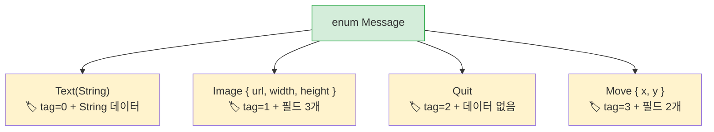

<a id="algebraic-data-types-vs-union-types"></a>
## 대수적 데이터 타입 vs 유니온 타입

> **이 장에서 배우는 것:** 데이터를 담는 Rust enum과 Python의 `Union` 타입의 차이, 완전한 `match`와 `match/case`, `None`을 컴파일 타임에 대체하는 `Option<T>`, 그리고 guard 패턴을 배웁니다.
>
> **난이도:** 🟡 중급

Python 3.10에는 `match` 문과 타입 유니온이 도입되었습니다. 하지만 Rust의 enum은 그보다 더 나아갑니다.
각 variant는 서로 다른 데이터를 담을 수 있고, 컴파일러는 모든 경우를 처리했는지 직접 확인해 줍니다.

### Python 유니온 타입과 match
```python
# Python 3.10+ - 구조적 패턴 매칭
from typing import Union
from dataclasses import dataclass

@dataclass
class Circle:
    radius: float

@dataclass
class Rectangle:
    width: float
    height: float

@dataclass
class Triangle:
    base: float
    height: float

Shape = Union[Circle, Rectangle, Triangle]  # 타입 별칭

def area(shape: Shape) -> float:
    match shape:
        case Circle(radius=r):
            return 3.14159 * r * r
        case Rectangle(width=w, height=h):
            return w * h
        case Triangle(base=b, height=h):
            return 0.5 * b * h
        # case를 빠뜨려도 컴파일러가 경고해주지 않는다!
        # 새 도형을 추가했다면? 코드 전체를 뒤져 모든 match 블록을 찾아야 한다.
```

### Rust 열거형 - 데이터를 담는 variant
```rust
// Rust - enum variant는 데이터를 담을 수 있고, 컴파일러가 완전한 매칭을 강제한다
enum Shape {
    Circle(f64),                // Circle은 반지름을 담는다
    Rectangle(f64, f64),        // Rectangle은 너비와 높이를 담는다
    Triangle { base: f64, height: f64 }, // 이름 있는 필드도 가능하다
}

fn area(shape: &Shape) -> f64 {
    match shape {
        Shape::Circle(r) => std::f64::consts::PI * r * r,
        Shape::Rectangle(w, h) => w * h,
        Shape::Triangle { base, height } => 0.5 * base * height,
        // ❌ Shape::Pentagon을 추가하고 여기서 처리하지 않으면
        //    컴파일러가 빌드를 거부한다. 직접 검색할 필요가 없다.
    }
}
```

> **핵심 아이디어:** Rust의 `match`는 **완전해야 합니다**. 즉, 컴파일러가 모든 variant를 처리했는지 검증합니다. enum에 새 variant를 추가하면 어떤 `match` 블록을 수정해야 하는지도 정확히 알려 줍니다. Python의 `match`에는 이런 보장이 없습니다.

### enum 하나로 Python의 여러 패턴을 대체한다

```python
# Python - Rust enum이 대신하는 여러 패턴

# 1. 문자열 상수
STATUS_PENDING = "pending"
STATUS_ACTIVE = "active"
STATUS_CLOSED = "closed"

# 2. Python Enum (데이터 없음)
from enum import Enum
class Status(Enum):
    PENDING = "pending"
    ACTIVE = "active"
    CLOSED = "closed"

# 3. 태그드 유니온 (class + type 필드)
class Message:
    def __init__(self, kind, **data):
        self.kind = kind
        self.data = data
# Message(kind="text", content="hello")
# Message(kind="image", url="...", width=100)
```

```rust
// Rust - enum 하나로 위 세 가지를 모두 표현할 수 있고, 그 이상도 가능하다

// 1. 단순 enum (Python Enum과 비슷)
enum Status {
    Pending,
    Active,
    Closed,
}

// 2. 데이터를 담는 enum (태그드 유니온 - 타입 안전!)
enum Message {
    Text(String),
    Image { url: String, width: u32, height: u32 },
    Quit,                    // 데이터 없음
    Move { x: i32, y: i32 },
}
```



> **메모리 관점:** Rust enum은 "태그드 유니온"입니다. 컴파일러는 구분 태그(discriminant)와 가장 큰 variant를 저장하기에 충분한 공간을 함께 배치합니다. Python의 대응 개념(`Union[str, dict, None]`)에는 이런 식의 컴팩트한 표현이 없습니다.
>
> 📌 **함께 보기:** [9장 - 에러 처리](ch09-error-handling.md)에서는 enum을 적극적으로 활용합니다. `Result<T, E>`와 `Option<T>`도 결국 `match`와 함께 쓰는 enum입니다.

```rust
fn process(msg: &Message) {
    match msg {
        Message::Text(content) => println!("Text: {content}"),
        Message::Image { url, width, height } => {
            println!("Image: {url} ({width}x{height})")
        }
        Message::Quit => println!("Quitting"),
        Message::Move { x, y } => println!("Moving to ({x}, {y})"),
    }
}
```

***

<a id="exhaustive-pattern-matching"></a>
## 완전한 패턴 매칭

### Python의 match - 완전하지 않음
```python
# Python - 와일드카드 case는 선택 사항이고, 컴파일러 도움도 없다
def describe(value):
    match value:
        case 0:
            return "zero"
        case 1:
            return "one"
        # 기본 case를 빼먹으면 Python은 조용히 None을 반환한다.
        # 경고도 없고, 오류도 없다.

describe(42)  # None 반환 - 조용히 숨어 있는 버그
```

### Rust의 match - 컴파일러가 강제함
```rust
// Rust - 가능한 모든 경우를 반드시 처리해야 한다
fn describe(value: i32) -> &'static str {
    match value {
        0 => "zero",
        1 => "one",
        // ❌ 컴파일 오류: non-exhaustive patterns: `i32::MIN..=-1_i32`
        //    그리고 `2_i32..=i32::MAX`가 처리되지 않았다
        _ => "other",   // _ = 나머지 모든 경우 (열린 범위 타입에는 필요)
    }
}

// enum은 _가 필요 없다 - 컴파일러가 모든 variant를 알고 있기 때문이다
enum Color { Red, Green, Blue }

fn color_hex(c: Color) -> &'static str {
    match c {
        Color::Red => "#ff0000",
        Color::Green => "#00ff00",
        Color::Blue => "#0000ff",
        // _가 필요 없다 - 모든 variant를 다 처리했다
        // 나중에 Color::Yellow를 추가하면 여기서 컴파일 오류가 난다
    }
}
```

### 패턴 매칭 기능
```rust
// 여러 값을 한 번에 매칭 (Python의 case 1 | 2 | 3: 와 비슷)
match value {
    1 | 2 | 3 => println!("small"),
    4..=9 => println!("medium"),    // 범위 패턴
    _ => println!("large"),
}

// 가드(guard) (Python의 case x if x > 0: 와 비슷)
match temperature {
    t if t > 100 => println!("boiling"),
    t if t < 0 => println!("freezing"),
    t => println!("normal: {t}°"),
}

// 중첩 구조 분해
let point = (3, (4, 5));
match point {
    (0, _) => println!("on y-axis"),
    (_, (0, _)) => println!("y=0"),
    (x, (y, z)) => println!("x={x}, y={y}, z={z}"),
}
```

***

<a id="option-for-none-safety"></a>
## None 안전성을 위한 Option

`Option<T>`는 Python 개발자에게 가장 중요한 Rust enum입니다. `None`을 타입 안전한 방식으로 대체합니다.

### Python의 None

```python
# Python - None은 어디에나 나타날 수 있는 값이다
def find_user(user_id: int) -> dict | None:
    users = {1: {"name": "Alice"}}
    return users.get(user_id)

user = find_user(999)
# user는 None이지만, 이를 확인하도록 강제하는 장치는 없다!
print(user["name"])  # 💥 런타임에 TypeError
```

### Rust의 Option

```rust
// Rust - Option<T>는 None 경우를 반드시 처리하게 만든다
fn find_user(user_id: i64) -> Option<User> {
    let users = HashMap::from([(1, User { name: "Alice".into() })]);
    users.get(&user_id).cloned()
}

let user = find_user(999);
// user는 Option<User> - None을 처리하지 않고는 사용할 수 없다

// 방법 1: match
match find_user(999) {
    Some(user) => println!("Found: {}", user.name),
    None => println!("Not found"),
}

// 방법 2: if let (Python의 if (x := expr) is not None 와 비슷)
if let Some(user) = find_user(1) {
    println!("Found: {}", user.name);
}

// 방법 3: unwrap_or
let name = find_user(999)
    .map(|u| u.name)
    .unwrap_or_else(|| "Unknown".to_string());

// 방법 4: ? 연산자 (Option을 반환하는 함수 안에서)
fn get_user_name(id: i64) -> Option<String> {
    let user = find_user(id)?;     // 찾지 못하면 즉시 None 반환
    Some(user.name)
}
```

### Option 메서드와 Python 대응표

| 패턴 | Python | Rust |
|------|--------|------|
| 값 존재 확인 | `if x is not None:` | `if let Some(x) = opt {` |
| 기본값 | `x or default` | `opt.unwrap_or(default)` |
| 기본값 생성 함수 | `x or compute()` | `opt.unwrap_or_else(\|\| compute())` |
| 값이 있을 때만 변환 | `f(x) if x else None` | `opt.map(f)` |
| 연쇄 조회 | `x and x.attr and x.attr.method()` | `opt.and_then(\|x\| x.method())` |
| None이면 크래시 | 막을 방법이 없음 | `opt.unwrap()` (panic) 또는 `opt.expect("msg")` |
| 값이 없으면 에러로 전환 | `x if x else raise` | `opt.ok_or(Error)?` |

---

<a id="exercises"></a>
## 연습문제

<details>
<summary><strong>🏋️ 연습문제: 도형 넓이 계산기</strong> (클릭하여 펼치기)</summary>

**도전 과제:** `Circle(f64)`(반지름), `Rectangle(f64, f64)`(너비, 높이), `Triangle(f64, f64)`(밑변, 높이) variant를 가진 `Shape` enum을 정의해 보세요. 그리고 `match`를 사용해 `fn area(&self) -> f64` 메서드를 구현하세요. 각 도형을 하나씩 만든 뒤 넓이를 출력해 보세요.

<details>
<summary>🔑 해답</summary>

```rust
use std::f64::consts::PI;

enum Shape {
    Circle(f64),
    Rectangle(f64, f64),
    Triangle(f64, f64),
}

impl Shape {
    fn area(&self) -> f64 {
        match self {
            Shape::Circle(r) => PI * r * r,
            Shape::Rectangle(w, h) => w * h,
            Shape::Triangle(b, h) => 0.5 * b * h,
        }
    }
}

fn main() {
    let shapes = [
        Shape::Circle(5.0),
        Shape::Rectangle(4.0, 6.0),
        Shape::Triangle(3.0, 8.0),
    ];
    for shape in &shapes {
        println!("Area: {:.2}", shape.area());
    }
}
```

**핵심 포인트:** Rust enum은 Python의 `Union[Circle, Rectangle, Triangle]` + `isinstance()` 검사 조합을 대체합니다. 컴파일러가 모든 variant를 처리하도록 강제하기 때문에, `area()`를 수정하지 않은 채 새 도형을 추가하면 곧바로 컴파일 오류가 납니다.

</details>
</details>

***