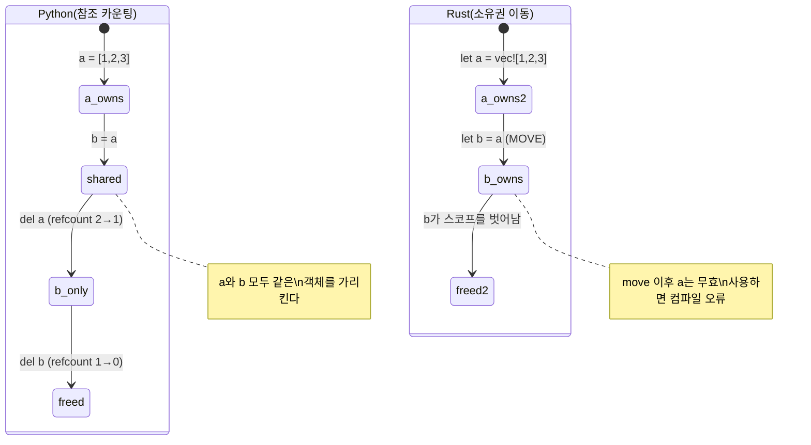
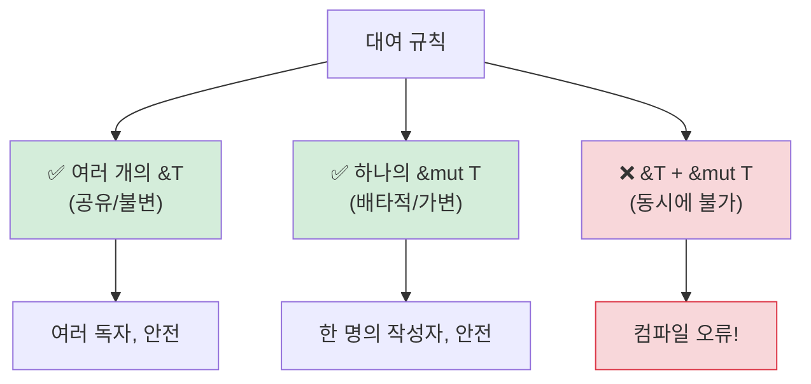

<a id="understanding-ownership"></a>
## 소유권 이해하기

> **이 장에서 배우는 것:** Rust에 소유권이 필요한 이유(GC가 없음), Python의 참조 카운팅과 대비되는 이동 의미론, 대여(`&`, `&mut`), 라이프타임의 기초, 그리고 스마트 포인터(`Box`, `Rc`, `Arc`)를 배웁니다.
>
> **난이도:** 🟡 중급

이 장은 Python 개발자에게 가장 어려운 개념입니다. Python에서는 데이터를 누가 "소유"하는지 거의 생각하지 않습니다. 가비지 컬렉터가 알아서 처리하기 때문입니다. Rust에서는 모든 값이 정확히 하나의 소유자를 가지며, 컴파일러가 이를 컴파일 시점에 추적합니다.

### Python: 어디서나 공유 참조
```python
# Python - 모든 것이 참조이며, gc가 정리해 준다
a = [1, 2, 3]
b = a              # b와 a는 같은 리스트를 가리킨다
b.append(4)
print(a)            # [1, 2, 3, 4] - 놀랍게도 a도 바뀌었다

# 이 리스트를 누가 소유하는가? a와 b 둘 다 참조하고 있다.
# 참조가 하나도 남지 않으면 가비지 컬렉터가 해제한다.
# 평소에는 이런 점을 거의 의식하지 않는다.
```

### Rust: 단일 소유권
```rust
// Rust - 모든 값에는 정확히 하나의 owner가 있다
let a = vec![1, 2, 3];
let b = a;           // 소유권이 a에서 b로 MOVE 된다
// println!("{:?}", a); // ❌ 컴파일 오류: move 이후 값을 사용함

// a는 더 이상 쓸 수 없다. b만이 유일한 소유자다.
println!("{:?}", b); // ✅ [1, 2, 3]

// b가 스코프를 벗어나면 Vec는 즉시 해제된다. 결정적이며 GC가 없다.
```

### 소유권의 세 가지 규칙
```rust
1. 각 값은 정확히 하나의 owner 변수를 가진다.
2. owner가 스코프를 벗어나면 값은 drop되어(해제되어) 사라진다.
3. 소유권은 이전(move)될 수는 있지만 복제되지는 않는다(Clone을 쓰지 않는 한).
```

### 이동 의미론 - Python 개발자가 가장 크게 놀라는 지점
```python
# Python - 대입은 데이터를 복사하지 않고 참조만 복사한다
def process(data):
    data.append(42)
    # 원본 리스트가 수정된다!

my_list = [1, 2, 3]
process(my_list)
print(my_list)       # [1, 2, 3, 42] - process가 원본을 바꿨다!
```

```rust
// Rust - 함수에 넘기면(non-Copy 타입의 경우) 소유권이 MOVE 된다
fn process(mut data: Vec<i32>) -> Vec<i32> {
    data.push(42);
    data  // 소유권을 돌려주려면 반환해야 한다
}

let my_vec = vec![1, 2, 3];
let my_vec = process(my_vec);  // 소유권이 들어갔다가 다시 나온다
println!("{:?}", my_vec);      // [1, 2, 3, 42]

// 더 나은 방법 - move 대신 borrow
fn process_borrowed(data: &mut Vec<i32>) {
    data.push(42);
}

let mut my_vec = vec![1, 2, 3];
process_borrowed(&mut my_vec);  // 잠시 빌려준다
println!("{:?}", my_vec);       // [1, 2, 3, 42] - 여전히 내 소유다
```

### 그림으로 보는 소유권

```text
Python:                              Rust:

  a ──────┐                           a ──→ [1, 2, 3]
           ├──→ [1, 2, 3]
  b ──────┘                           이후: let b = a;

  (a와 b가 하나의 객체를 공유)         a  (무효, move됨)
  (refcount = 2)                      b ──→ [1, 2, 3]
                                      (데이터는 b만 소유)

  del a → refcount = 1                drop(b) → 데이터 해제
  del b → refcount = 0 → 해제         (결정적, GC 없음)
```



***

<a id="move-semantics-vs-reference-counting"></a>
## 이동 의미론 vs 참조 카운팅

### Copy와 Move
```rust
// 단순 타입(정수, 실수, bool, char)은 MOVE가 아니라 COPY 된다
let x = 42;
let y = x;    // x가 y로 복사된다 (둘 다 유효)
println!("{x} {y}");  // ✅ 42 42

// 힙에 할당되는 타입(String, Vec, HashMap)은 MOVE 된다
let s1 = String::from("hello");
let s2 = s1;  // s1이 s2로 MOVE 된다
// println!("{s1}");  // ❌ 오류: move 이후 값을 사용함

// 힙 데이터를 명시적으로 복사하려면 .clone()을 쓴다
let s1 = String::from("hello");
let s2 = s1.clone();  // 깊은 복사
println!("{s1} {s2}");  // ✅ hello hello (둘 다 유효)
```

### Python 개발자의 사고방식
```text
Python:                    Rust:
---------                  -----
int, float, bool           Copy 타입(i32, f64, bool, char)
-> 대입 시 복사됨          -> 대입 시 복사됨 (비슷한 동작)
                           (참고: Python은 작은 정수를 캐시하지만 Rust의 copy는 언제나 예측 가능하다)

list, dict, str            Move 타입(Vec, HashMap, String)
-> 참조를 공유함           -> 소유권이 이전됨 (행동이 다르다!)
-> gc가 정리함             -> owner가 데이터를 해제함
-> list(x) 또는            -> x.clone()으로 복제
   copy.deepcopy(x)
```

### Python의 공유 모델이 버그를 만드는 경우

```python
# Python - 의도치 않은 aliasing
def remove_duplicates(items):
    seen = set()
    result = []
    for item in items:
        if item not in seen:
            seen.add(item)
            result.append(item)
    return result

original = [1, 2, 2, 3, 3, 3]
alias = original          # 복사본이 아니라 alias
unique = remove_duplicates(alias)
# original이 그대로인 것은 우연히 mutate하지 않았기 때문이다
# remove_duplicates가 입력을 수정했다면 original도 함께 영향을 받는다
```

```rust
use std::collections::HashSet;

// Rust - 소유권과 borrow가 의도치 않은 aliasing을 막아 준다
fn remove_duplicates(items: &[i32]) -> Vec<i32> {
    let mut seen = HashSet::new();
    items.iter()
        .filter(|&&item| seen.insert(item))
        .copied()
        .collect()
}

let original = vec![1, 2, 2, 3, 3, 3];
let unique = remove_duplicates(&original); // borrow만 하므로 수정할 수 없다
// original은 바뀌지 않음이 보장된다 - 컴파일러가 &를 통해 mutation을 막아 준다
```

***

<a id="borrowing-and-lifetimes"></a>
## 대여와 라이프타임

### 대여는 책을 빌려주는 것과 같다
```rust
소유권을 실물 책이라고 생각해 보자:

Python:  모두가 복사본을 하나씩 가진다 (공유 참조 + GC)
Rust:    한 사람이 책을 소유한다. 다른 사람은 다음만 할 수 있다:
         - &book     = 보기만 한다 (불변 borrow, 여러 개 가능)
         - &mut book = 내용을 적는다 (가변 borrow, 단 하나만 가능)
         - book      = 아예 넘겨준다 (move)
```

### 대여 규칙



```rust
// 규칙 1: 불변 borrow는 여러 개 가능하지만, 가변 borrow는 하나만 가능하다 (둘 다 동시에 불가)

let mut data = vec![1, 2, 3];

// 여러 개의 불변 borrow - 괜찮다
let a = &data;
let b = &data;
println!("{:?} {:?}", a, b);  // ✅

// 가변 borrow - 반드시 배타적이어야 한다
let c = &mut data;
c.push(4);
// println!("{:?}", a);  // ❌ 오류: 가변 borrow가 살아 있는 동안 불변 borrow를 사용할 수 없다

// 이런 규칙 덕분에 컴파일 타임에 데이터 레이스를 막는다
// Python에는 대응 개념이 없어서, dict를 순회 중에 수정하면 런타임에 터질 수 있다.
```

### 라이프타임 간단히 보기
```rust
// 라이프타임은 "이 참조가 얼마나 오래 살아 있는가?"에 답한다
// 대부분은 컴파일러가 추론하므로 직접 적을 일이 많지 않다

// 단순한 경우 - 컴파일러가 자동으로 처리한다
fn first_word(s: &str) -> &str {
    s.split_whitespace().next().unwrap_or("")
}
// 컴파일러는 반환된 &str이 입력 &str만큼 살아야 함을 안다

// 명시적인 라이프타임이 필요한 경우 (드물다)
fn longest<'a>(a: &'a str, b: &'a str) -> &'a str {
    if a.len() > b.len() { a } else { b }
}
// 'a는 "반환값은 두 입력이 모두 유효한 동안만 유효하다"는 뜻이다
```

> **Python 개발자에게:** 처음부터 라이프타임을 걱정할 필요는 없습니다. 컴파일러가 필요할 때 알려 주고, 대부분의 경우(거의 95%)는 자동으로 추론합니다. 라이프타임 표기는 컴파일러가 관계를 혼자 알아내기 어려울 때 주는 힌트라고 생각하면 됩니다.

***

<a id="smart-pointers"></a>
## 스마트 포인터

단일 소유권만으로는 너무 제한적인 경우를 위해 Rust는 스마트 포인터를 제공합니다.
이들은 Python의 참조 모델과 더 비슷하지만, 명시적으로 선택해야만 사용할 수 있습니다.

```rust
// Box<T> - 단일 owner를 가진 힙 할당 (Python의 일반적인 할당과 비슷)
let boxed = Box::new(42);  // 힙에 할당된 i32

// Rc<T> - 참조 카운팅 (Python의 refcount와 비슷)
use std::rc::Rc;
let shared = Rc::new(vec![1, 2, 3]);
let clone1 = Rc::clone(&shared);  // refcount 증가
let clone2 = Rc::clone(&shared);  // refcount 증가
// 세 값 모두 같은 Vec를 가리킨다. 모두 drop되면 Vec가 해제된다.
// Python의 참조 카운팅과 비슷하지만 Rc는 cycle을 자동 처리하지 않는다
// cycle은 Weak<T>로 끊어야 한다 (Python의 GC는 cycle도 처리한다)

// Arc<T> - 원자적 참조 카운팅 (멀티스레드용 Rc)
use std::sync::Arc;
let thread_safe = Arc::new(vec![1, 2, 3]);
// 스레드 간 공유가 필요하면 Arc를 사용한다 (Rc는 단일 스레드 전용)

// RefCell<T> - 런타임 borrow 검사 (Python의 "일단 바꾸고 보자" 모델과 비슷)
use std::cell::RefCell;
let cell = RefCell::new(42);
*cell.borrow_mut() = 99;  // 런타임 가변 borrow (중복 borrow면 panic)
```

### 언제 무엇을 쓸까

| 스마트 포인터 | Python 비유 | 사용 사례 |
|---------------|-------------|-----------|
| `Box<T>` | 일반 할당 | 큰 데이터, 재귀 타입, trait object |
| `Rc<T>` | Python 기본 refcount | 공유 소유권, 단일 스레드 |
| `Arc<T>` | 스레드 안전 refcount | 공유 소유권, 멀티스레드 |
| `RefCell<T>` | Python의 "그냥 변경" | 내부 가변성 (escape hatch) |
| `Rc<RefCell<T>>` | Python의 일반 객체 모델 | 공유 + 가변 (그래프 구조 등) |

> **핵심 아이디어:** `Rc<RefCell<T>>`를 사용하면 Python과 비슷한 의미론(공유되고, 변경 가능한 데이터)을 얻을 수 있지만, 반드시 명시적으로 선택해야 합니다. Rust의 기본 모델(소유하고, move되는 값)은 더 빠르고 참조 카운팅 오버헤드를 피할 수 있습니다. cycle이 있는 그래프 구조에서는 `Weak<T>`로 참조 루프를 끊어야 합니다. Python과 달리 Rust의 `Rc`에는 cycle collector가 없습니다.

> 📌 **함께 보기:** [13장 - 동시성](ch13-concurrency.md)에서는 멀티스레드 공유 상태를 위한 `Arc<Mutex<T>>`를 다룹니다.

---

<a id="exercises"></a>
## 연습문제

<details>
<summary><strong>🏋️ 연습문제: Borrow Checker 오류 찾기</strong> (클릭하여 펼치기)</summary>

**도전 과제:** 아래 코드에는 borrow checker 오류가 3개 있습니다. 각각을 찾아서 `.clone()`을 쓰지 않고 고쳐 보세요.

```rust
fn main() {
    let mut names = vec!["Alice".to_string(), "Bob".to_string()];
    let first = &names[0];
    names.push("Charlie".to_string());
    println!("First: {first}");

    let greeting = make_greeting(names[0]);
    println!("{greeting}");
}

fn make_greeting(name: String) -> String {
    format!("Hello, {name}!")
}
```

<details>
<summary>🔑 해답</summary>

```rust
fn main() {
    let mut names = vec!["Alice".to_string(), "Bob".to_string()];
    let first = &names[0];
    println!("First: {first}"); // mutate하기 전에 borrow를 먼저 사용한다
    names.push("Charlie".to_string()); // 이제 안전하다 - 살아 있는 불변 borrow가 없다

    let greeting = make_greeting(&names[0]); // 소유권이 아니라 참조를 넘긴다
    println!("{greeting}");
}

fn make_greeting(name: &str) -> String { // String이 아니라 &str을 받는다
    format!("Hello, {name}!")
}
```

**수정된 오류들:**
1. **불변 borrow + mutation**: `first`가 `names`를 borrow한 상태에서 `push`가 이를 수정합니다. 해결: `push` 전에 `first`를 사용합니다.
2. **Vec에서 move 시도**: `names[0]`는 `Vec`에서 `String`을 move하려고 합니다(허용되지 않음). 해결: `&names[0]`로 borrow합니다.
3. **함수가 소유권을 가져감**: `make_greeting(String)`은 값을 소비합니다. 해결: 대신 `&str`을 받도록 바꿉니다.

</details>
</details>

***