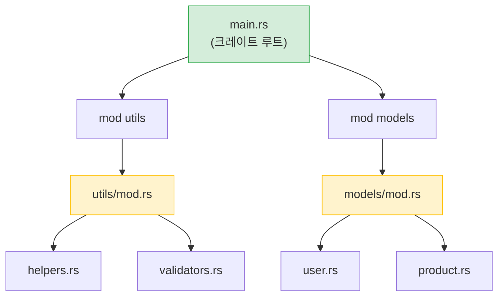

<a id="rust-modules-vs-python-packages"></a>
## Rust 모듈 vs Python 패키지

> **이 장에서 배우는 것:** `import`와 대비되는 `mod`/`use`, Python의 관례 기반 private과 대비되는 Rust의 가시성(`pub`), `Cargo.toml`과 `pyproject.toml`, crates.io와 PyPI, 그리고 워크스페이스와 모노레포의 차이를 배웁니다.
>
> **난이도:** 🟢 입문

### Python 모듈 시스템
```python
# Python - 파일은 모듈이고, __init__.py가 있는 디렉터리는 패키지다

# myproject/
# ├── __init__.py          # 패키지로 만든다
# ├── main.py
# ├── utils/
# │   ├── __init__.py      # utils를 하위 패키지로 만든다
# │   ├── helpers.py
# │   └── validators.py
# └── models/
#     ├── __init__.py
#     ├── user.py
#     └── product.py

# 가져오기:
from myproject.utils.helpers import format_name
from myproject.models.user import User
import myproject.utils.validators as validators
```

### Rust 모듈 시스템
```rust
// Rust - mod 선언이 모듈 트리를 만들고, 파일이 실제 내용을 제공한다

// src/
// ├── main.rs             # 크레이트 루트 - 모듈을 선언한다
// ├── utils/
// │   ├── mod.rs          # 모듈 선언 (__init__.py와 비슷)
// │   ├── helpers.rs
// │   └── validators.rs
// └── models/
//     ├── mod.rs
//     ├── user.rs
//     └── product.rs

// src/main.rs 안에서:
mod utils;       // Rust에게 src/utils/mod.rs를 찾으라고 알린다
mod models;      // Rust에게 src/models/mod.rs를 찾으라고 알린다

use utils::helpers::format_name;
use models::user::User;

// src/utils/mod.rs 안에서:
pub mod helpers;      // helpers.rs를 선언하고 다시 노출한다
pub mod validators;   // validators.rs를 선언하고 다시 노출한다
```



> **Python에 비유하면:** `mod.rs`는 `__init__.py`처럼 "이 모듈이 무엇을 내보내는지"를 선언하는 파일이라고 생각하면 됩니다. 크레이트 루트(`main.rs` / `lib.rs`)는 최상위 패키지의 `__init__.py`에 대응합니다.

### 핵심 차이점

| 개념 | Python | Rust |
|------|--------|------|
| 모듈 = 파일 | ✅ 자동 | `mod`로 선언해야 함 |
| 패키지 = 디렉터리 | `__init__.py` | `mod.rs` |
| 기본 공개 여부 | ✅ 전부 공개 | ❌ 기본은 private |
| 공개 방법 | `_prefix` 관례 | `pub` 키워드 |
| import 문법 | `from x import y` | `use x::y;` |
| 와일드카드 import | `from x import *` | `use x::*;` (권장하지 않음) |
| 상대 import | `from . import sibling` | `use super::sibling;` |
| 재노출(re-export) | `__all__` 또는 명시적 import | `pub use inner::Thing;` |

### 가시성 - 기본은 private
```python
# Python - "다들 알아서 한다"는 철학
class User:
    def __init__(self):
        self.name = "Alice"       # Public (관례상)
        self._age = 30            # "Private" (밑줄 하나라는 관례)
        self.__secret = "shhh"    # name mangling됨 (완전한 private은 아님)

# _age나 __secret에 접근하는 것을 막아 주는 장치는 없다
print(user._age)                 # 잘 동작한다
print(user._User__secret)        # 이것도 된다 (name mangling)
```

```rust
// Rust - private는 컴파일러가 강제한다
pub struct User {
    pub name: String,      // 공개 - 누구나 접근 가능
    age: i32,              // 비공개 - 이 모듈 안에서만 접근 가능
}

impl User {
    pub fn new(name: &str, age: i32) -> Self {
        User { name: name.to_string(), age }
    }

    pub fn age(&self) -> i32 {   // 공개 getter
        self.age
    }

    fn validate(&self) -> bool { // 비공개 메서드
        self.age > 0
    }
}

// 모듈 밖에서:
let user = User::new("Alice", 30);
println!("{}", user.name);        // ✅ 공개 필드
// println!("{}", user.age);      // ❌ 컴파일 오류: field is private
println!("{}", user.age());       // ✅ 공개 메서드(getter)
```

***

<a id="crates-vs-pypi-packages"></a>
## 크레이트 vs PyPI 패키지

### Python 패키지 (PyPI)
```bash
# Python
pip install requests            # PyPI에서 설치
pip install "requests>=2.28"    # 버전 제약
pip freeze > requirements.txt   # 버전 고정
pip install -r requirements.txt # 환경 재현
```

### Rust 크레이트 (crates.io)
```bash
# Rust
cargo add reqwest               # crates.io에서 설치 (Cargo.toml에 추가)
cargo add reqwest@0.12          # 버전 제약
# Cargo.lock은 자동 생성된다 - 수동 단계가 없다
cargo build                     # 의존성을 내려받고 컴파일한다
```

### Cargo.toml vs pyproject.toml
```toml
# Rust - Cargo.toml
[package]
name = "my-project"
version = "0.1.0"
edition = "2021"

[dependencies]
serde = { version = "1.0", features = ["derive"] }  # feature 플래그 사용
reqwest = { version = "0.12", features = ["json"] }
tokio = { version = "1", features = ["full"] }
log = "0.4"

[dev-dependencies]
mockall = "0.13"
```

<a id="essential-crates-for-python-developers"></a>
### Python 개발자에게 유용한 필수 크레이트

| Python 라이브러리 | Rust 크레이트 | 용도 |
|-------------------|---------------|------|
| `requests` | `reqwest` | HTTP 클라이언트 |
| `json` (표준 라이브러리) | `serde_json` | JSON 파싱 |
| `pydantic` | `serde` | 직렬화/검증 |
| `pathlib` | `std::path` (표준 라이브러리) | 경로 처리 |
| `os` / `shutil` | `std::fs` (표준 라이브러리) | 파일 작업 |
| `re` | `regex` | 정규 표현식 |
| `logging` | `tracing` / `log` | 로깅 |
| `click` / `argparse` | `clap` | CLI 인자 파싱 |
| `asyncio` | `tokio` | async 런타임 |
| `datetime` | `chrono` | 날짜와 시간 |
| `pytest` | 기본 테스트 + `rstest` | 테스트 |
| `dataclasses` | `#[derive(...)]` | 데이터 구조 정의 |
| `typing.Protocol` | Traits | 구조적 타이핑 |
| `subprocess` | `std::process` (표준 라이브러리) | 외부 명령 실행 |
| `sqlite3` | `rusqlite` | SQLite |
| `sqlalchemy` | `diesel` / `sqlx` | ORM / SQL 툴킷 |
| `fastapi` | `axum` / `actix-web` | 웹 프레임워크 |

***

<a id="workspaces-vs-monorepos"></a>
## 워크스페이스 vs 모노레포

### Python 모노레포 (전형적인 형태)
```text
# Python 모노레포 (접근 방식이 다양하고 표준은 없음)
myproject/
├── pyproject.toml           # 루트 프로젝트
├── packages/
│   ├── core/
│   │   ├── pyproject.toml   # 각 패키지가 자체 설정을 가진다
│   │   └── src/core/...
│   ├── api/
│   │   ├── pyproject.toml
│   │   └── src/api/...
│   └── cli/
│       ├── pyproject.toml
│       └── src/cli/...
# 도구: poetry workspaces, pip -e ., uv workspaces 등 - 표준이 없다
```

### Rust 워크스페이스
```toml
# Rust - 루트의 Cargo.toml
[workspace]
members = [
    "core",
    "api",
    "cli",
]

# 워크스페이스 전체에서 공유하는 의존성
[workspace.dependencies]
serde = { version = "1.0", features = ["derive"] }
tokio = { version = "1", features = ["full"] }
```

```text
# Rust 워크스페이스 구조 - 표준화되어 있고 Cargo에 내장되어 있다
myproject/
├── Cargo.toml               # 워크스페이스 루트
├── Cargo.lock               # 모든 크레이트가 공유하는 하나의 lock 파일
├── core/
│   ├── Cargo.toml           # [dependencies] serde.workspace = true
│   └── src/lib.rs
├── api/
│   ├── Cargo.toml
│   └── src/lib.rs
└── cli/
    ├── Cargo.toml
    └── src/main.rs
```

```bash
# 워크스페이스 명령
cargo build                  # 전체 빌드
cargo test                   # 전체 테스트
cargo build -p core          # core 크레이트만 빌드
cargo test -p api            # api 크레이트만 테스트
cargo clippy --all           # 전체 lint
```

> **핵심 아이디어:** Rust 워크스페이스는 Cargo에 내장된 일급 기능입니다. Python 모노레포는 보통 poetry, uv, pants 같은 서드파티 도구에 의존하며 지원 수준도 제각각입니다. Rust 워크스페이스에서는 모든 크레이트가 하나의 `Cargo.lock`을 공유하므로 프로젝트 전체에서 일관된 의존성 버전을 유지할 수 있습니다.

---

<a id="exercises"></a>
## 연습문제

<details>
<summary><strong>🏋️ 연습문제: 모듈 가시성</strong> (클릭하여 펼치기)</summary>

**도전 과제:** 아래 모듈 구조를 보고 어떤 줄이 컴파일되고 어떤 줄이 컴파일되지 않는지 예측해 보세요.

```rust
mod kitchen {
    fn secret_recipe() -> &'static str { "42 spices" }
    pub fn menu() -> &'static str { "Today's special" }

    pub mod staff {
        pub fn cook() -> String {
            format!("Cooking with {}", super::secret_recipe())
        }
    }
}

fn main() {
    println!("{}", kitchen::menu());             // Line A
    println!("{}", kitchen::secret_recipe());     // Line B
    println!("{}", kitchen::staff::cook());       // Line C
}
```

<details>
<summary>🔑 해답</summary>

- **Line A**: ✅ 컴파일됨 - `menu()`는 `pub`
- **Line B**: ❌ 컴파일 오류 - `secret_recipe()`는 `kitchen` 안에서만 보이는 private 함수
- **Line C**: ✅ 컴파일됨 - `staff::cook()`는 `pub`이고, `cook()`는 `super::`를 통해 `secret_recipe()`에 접근할 수 있다 (자식 모듈은 부모의 private 항목에 접근 가능)

**핵심 포인트:** Rust에서는 자식 모듈이 부모의 private 항목을 볼 수 있습니다. Python의 `_private` 관례와 비슷해 보이지만, Rust에서는 실제로 컴파일러가 강제합니다. 외부에서는 접근할 수 없다는 점이 Python과 다릅니다.

</details>
</details>

***