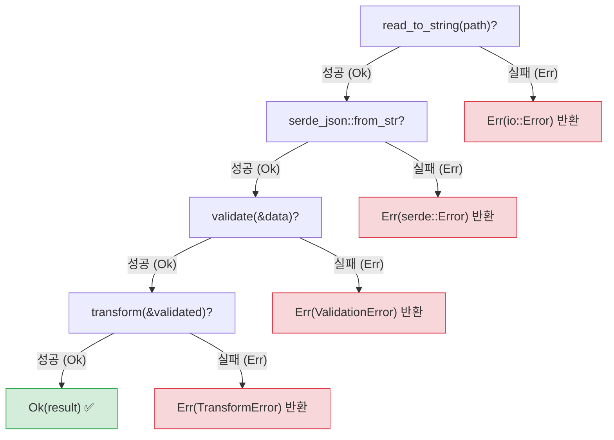
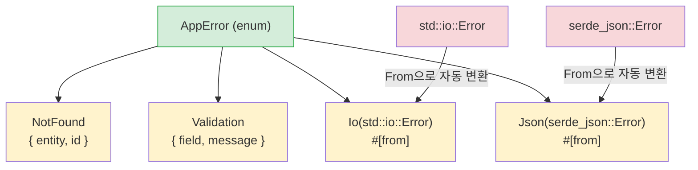

<a id="exceptions-vs-result"></a>
## 예외 vs Result

> **이 장에서 배울 것:** `Result<T, E>`와 `try`/`except`의 차이, 간결하게 에러를 전파하는 `?` 연산자,
> `thiserror`로 커스텀 에러 타입을 만드는 법, 애플리케이션용 `anyhow`, 그리고 명시적 에러가 숨은 버그를 막는 이유.
>
> **난이도:** 🟡 중급

이 부분은 Python 개발자에게 가장 큰 사고방식 전환 중 하나입니다. Python은 에러 처리에
예외를 사용합니다. 예외는 어디서든 발생할 수 있고, 어디서든 잡을 수 있으며, 아무 데서도
잡히지 않을 수도 있습니다. Rust는 `Result<T, E>`를 사용합니다. 즉 에러는 반드시
명시적으로 처리해야 하는 값입니다.

### Python 예외 처리
```python
# Python — 예외는 어디서든 발생할 수 있음
import json

def load_config(path: str) -> dict:
    try:
        with open(path) as f:
            data = json.load(f)     # JSONDecodeError가 발생할 수 있음
            if "version" not in data:
                raise ValueError("Missing version field")
            return data
    except FileNotFoundError:
        print(f"Config file not found: {path}")
        return {}
    except json.JSONDecodeError as e:
        print(f"Invalid JSON: {e}")
        return {}
    # 이 함수가 또 어떤 예외를 던질 수 있을까?
    # IOError? PermissionError? UnicodeDecodeError?
    # 함수 시그니처만 봐서는 알 수 없다!
```

### Rust의 Result 기반 에러 처리
```rust
// Rust — 에러는 반환 값이며, 함수 시그니처에 드러남
use std::fs;
use serde_json::Value;

fn load_config(path: &str) -> Result<Value, ConfigError> {
    let contents = fs::read_to_string(path)    // Result를 반환
        .map_err(|e| ConfigError::FileError(e.to_string()))?;

    let data: Value = serde_json::from_str(&contents)  // Result를 반환
        .map_err(|e| ConfigError::ParseError(e.to_string()))?;

    if data.get("version").is_none() {
        return Err(ConfigError::MissingField("version".to_string()));
    }

    Ok(data)
}

#[derive(Debug)]
enum ConfigError {
    FileError(String),
    ParseError(String),
    MissingField(String),
}
```

### 핵심 차이

```text
Python:                                 Rust:
─────────                               ─────
- 에러는 예외다 (던져짐)                - 에러는 값이다 (반환됨)
- 제어 흐름이 숨겨진다 (스택 언와인딩) - 제어 흐름이 명시적이다 (? 연산자)
- 시그니처로 에러를 알 수 없다         - 반환 타입에 에러가 반드시 드러난다
- 잡히지 않은 예외는 런타임에 크래시    - 처리되지 않은 Result는 컴파일 경고
- try/except는 선택 사항               - Result 처리는 필수
- 광범위한 except는 무엇이든 잡는다    - match 가지는 빠짐없이 작성한다
```

### Result의 두 가지 변형
```rust
// Result<T, E>에는 정확히 두 가지 변형만 있다:
enum Result<T, E> {
    Ok(T),    // 성공 — 값이 들어 있다 (Python의 return 값과 비슷)
    Err(E),   // 실패 — 에러가 들어 있다 (Python의 raise된 예외와 비슷)
}

// Result 사용하기:
fn divide(a: f64, b: f64) -> Result<f64, String> {
    if b == 0.0 {
        Err("Division by zero".to_string())  // 예: raise ValueError("...")
    } else {
        Ok(a / b)                             // 예: return a / b
    }
}

// Result 처리하기 — try/except와 비슷하지만 더 명시적
match divide(10.0, 0.0) {
    Ok(result) => println!("Result: {result}"),
    Err(msg) => println!("Error: {msg}"),
}
```

***

<a id="the--operator"></a>
## `?` 연산자

`?` 연산자는 예외를 호출 스택 위로 전파하는 Python 방식과 가장 비슷한 Rust 기능이지만,
그 전파가 코드에 분명히 드러난다는 점이 다릅니다.

### Python — 암묵적 전파
```python
# Python — 예외는 호출 스택 위로 조용히 전파된다
def read_username() -> str:
    with open("config.txt") as f:      # FileNotFoundError가 전파됨
        return f.readline().strip()    # IOError가 전파됨

def greet():
    name = read_username()             # 여기서 예외가 나면 greet()도 그대로 예외 발생
    print(f"Hello, {name}!")           # 에러가 나면 이 줄은 실행되지 않음

# 에러 전파가 보이지 않는다 — 어떤 예외가 밖으로 나갈 수 있는지 알려면
# 구현을 직접 읽어봐야 한다.
```

### Rust — `?`로 명시적 전파
```rust
// Rust — ?는 에러를 전파하지만, 코드와 시그니처에 모두 드러난다
use std::fs;
use std::io;

fn read_username() -> Result<String, io::Error> {
    let contents = fs::read_to_string("config.txt")?;  // ? = Err면 전파
    Ok(contents.lines().next().unwrap_or("").to_string())
}

fn greet() -> Result<(), io::Error> {
    let name = read_username()?;       // ? = Err면 즉시 Err 반환
    println!("Hello, {name}!");        // Ok일 때만 여기 도달
    Ok(())
}

// ?의 의미: "이 값이 Err면, 지금 이 함수에서 즉시 반환하라."
// Python의 예외 전파와 비슷하지만:
// 1. 눈에 보인다 (?가 보인다)
// 2. 반환 타입에 드러난다 (Result<..., io::Error>)
// 3. 컴파일러가 어딘가에서 반드시 처리되도록 강제한다
```

### `?`로 연쇄 처리하기
```python
# Python — 실패할 수 있는 연산이 여러 개 이어짐
def process_file(path: str) -> dict:
    with open(path) as f:                    # 실패할 수 있음
        text = f.read()                       # 실패할 수 있음
    data = json.loads(text)                   # 실패할 수 있음
    validate(data)                            # 실패할 수 있음
    return transform(data)                    # 실패할 수 있음
    # 어느 줄이든 예외를 던질 수 있고, 예외 타입도 제각각이다!
```

```rust
// Rust — 같은 흐름이지만, 실패 지점이 명시적이다
fn process_file(path: &str) -> Result<Data, AppError> {
    let text = fs::read_to_string(path)?;     // ?가 io::Error를 전파
    let data: Value = serde_json::from_str(&text)?;  // ?가 serde 에러를 전파
    let validated = validate(&data)?;          // ?가 검증 에러를 전파
    let result = transform(&validated)?;       // ?가 변환 에러를 전파
    Ok(result)
}
// 모든 ?는 조기 반환 지점이며, 그 위치가 코드에 전부 드러난다!
```



> 각 `?`는 하나의 탈출 지점입니다. Python의 `try`/`except`와 달리, 문서를 읽지 않아도 어느 줄이 실패할 수 있는지 코드에서 바로 보입니다.
>
> 📌 **함께 보기**: [15장 — 마이그레이션 패턴](ch15-migration-patterns.md)에서는 실제 코드베이스에서 Python의 `try`/`except` 패턴을 Rust로 옮기는 방법을 다룹니다.

***

<a id="custom-error-types-with-thiserror"></a>
## `thiserror`로 커스텀 에러 타입 만들기



> `#[from]` 속성은 `impl From<io::Error> for AppError`를 자동 생성하므로, `?`를 사용할 때 라이브러리 에러를 애플리케이션 에러로 자동 변환해 줍니다.

### Python 커스텀 예외
```python
# Python — 커스텀 예외 클래스
class AppError(Exception):
    pass

class NotFoundError(AppError):
    def __init__(self, entity: str, id: int):
        self.entity = entity
        self.id = id
        super().__init__(f"{entity} with id {id} not found")

class ValidationError(AppError):
    def __init__(self, field: str, message: str):
        self.field = field
        super().__init__(f"Validation error on {field}: {message}")

# 사용 예:
def find_user(user_id: int) -> dict:
    if user_id not in users:
        raise NotFoundError("User", user_id)
    return users[user_id]
```

### Rust + `thiserror` 커스텀 에러
```rust
// Rust — thiserror를 사용한 에러 enum (가장 널리 쓰이는 방식)
// Cargo.toml: thiserror = "2"

use thiserror::Error;

#[derive(Debug, Error)]
enum AppError {
    #[error("{entity} with id {id} not found")]
    NotFound { entity: String, id: i64 },

    #[error("Validation error on {field}: {message}")]
    Validation { field: String, message: String },

    #[error("IO error: {0}")]
    Io(#[from] std::io::Error),        // io::Error에서 자동 변환

    #[error("JSON error: {0}")]
    Json(#[from] serde_json::Error),   // serde 에러에서 자동 변환
}

// 사용 예:
fn find_user(user_id: i64) -> Result<User, AppError> {
    users.get(&user_id)
        .cloned()
        .ok_or(AppError::NotFound {
            entity: "User".to_string(),
            id: user_id,
        })
}

// #[from] 덕분에 ?가 io::Error를 AppError::Io로 자동 변환한다
fn load_users(path: &str) -> Result<Vec<User>, AppError> {
    let data = fs::read_to_string(path)?;  // io::Error → AppError::Io 자동 변환
    let users: Vec<User> = serde_json::from_str(&data)?;  // → AppError::Json
    Ok(users)
}
```

### 에러 처리 빠른 비교

| Python | Rust | 비고 |
|--------|------|------|
| `raise ValueError("msg")` | `return Err(AppError::Validation {...})` | 명시적 반환 |
| `try: ... except:` | `match result { Ok(v) => ..., Err(e) => ... }` | 빠짐없음 |
| `except ValueError as e:` | `Err(AppError::Validation { .. }) =>` | 패턴 매칭 |
| `raise ... from e` | `#[from]` 속성 또는 `.map_err()` | 에러 체이닝 |
| `finally:` | `Drop` 트레잇 (자동) | 결정적 정리 |
| `with open(...):` | 스코프 기반 drop (자동) | RAII 패턴 |
| 예외가 조용히 전파됨 | `?`가 눈에 보이게 전파함 | 반환 타입에 항상 드러남 |
| `isinstance(e, ValueError)` | `matches!(e, AppError::Validation {..})` | 타입 검사 |

---

<a id="exercises"></a>
## 연습문제

<details>
<summary><strong>🏋️ 연습문제: 설정 값 파싱하기</strong> (펼쳐서 보기)</summary>

**도전 과제**: 다음 요구사항을 만족하는 함수 `parse_port(s: &str) -> Result<u16, String>`를 작성하세요.
1. 빈 문자열은 `"empty input"` 에러로 거부한다.
2. 문자열을 `u16`으로 파싱하고, 파싱 에러는 `"invalid number: {original_error}"`로 매핑한다.
3. 1024 미만 포트는 `"port {n} is privileged"`로 거부한다.

그런 다음 `""`, `"hello"`, `"80"`, `"8080"`에 대해 함수를 호출하고 결과를 출력하세요.

<details>
<summary>🔑 해답</summary>

```rust
fn parse_port(s: &str) -> Result<u16, String> {
    if s.is_empty() {
        return Err("empty input".to_string());
    }
    let port: u16 = s.parse().map_err(|e| format!("invalid number: {e}"))?;
    if port < 1024 {
        return Err(format!("port {port} is privileged"));
    }
    Ok(port)
}

fn main() {
    for input in ["", "hello", "80", "8080"] {
        match parse_port(input) {
            Ok(port) => println!("✅ {input} → {port}"),
            Err(e) => println!("❌ {input:?} → {e}"),
        }
    }
}
```

**핵심 포인트**: `.map_err()`와 함께 쓰는 `?`는 Rust에서 `try/except ValueError as e: raise ConfigError(...) from e`를 대체하는 방식입니다. 모든 에러 경로가 반환 타입에 명확히 드러납니다.

</details>
</details>

***


