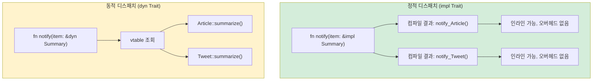

<a id="traits-vs-duck-typing"></a>
## 트레잇 vs 덕 타이핑

> **이 장에서 배울 것:** 트레잇이 명시적 계약으로 동작하는 방식(파이썬의 덕 타이핑과 비교), `Protocol` (PEP 544)과 트레잇의 관계,
> `where` 절을 사용한 제네릭 타입 제약, trait object (`dyn Trait`)와 정적 디스패치의 차이, 그리고 자주 쓰는 표준 트레잇들.
>
> **난이도:** 🟡 중급

이 장에서 Rust의 타입 시스템은 Python 개발자에게 특히 빛을 발합니다. Python의
"덕 타이핑"은 "오리처럼 걷고 오리처럼 꽥꽥거리면 오리다"라고 말합니다.
Rust의 트레잇은 "내가 필요한 오리의 행동을 컴파일 타임에 정확히 말하겠다"라고 말합니다.

### Python의 덕 타이핑
```python
# Python — 덕 타이핑: 필요한 메서드만 있으면 동작한다
def total_area(shapes):
    """Works with anything that has an .area() method."""
    return sum(shape.area() for shape in shapes)

class Circle:
    def __init__(self, radius): self.radius = radius
    def area(self): return 3.14159 * self.radius ** 2

class Rectangle:
    def __init__(self, w, h): self.w, self.h = w, h
    def area(self): return self.w * self.h

# 런타임에서는 잘 동작한다 — 상속도 필요 없다!
shapes = [Circle(5), Rectangle(3, 4)]
print(total_area(shapes))  # 90.54

# 하지만 .area()가 없는 값이 들어오면?
class Dog:
    def bark(self): return "Woof!"

total_area([Dog()])  # 💥 AttributeError: 'Dog' has no attribute 'area'
# 에러는 정의 시점이 아니라 런타임에 발생한다
```

### Rust 트레잇 — 명시적 덕 타이핑
```rust
// Rust — 트레잇은 "오리" 계약을 명시적으로 만든다
trait HasArea {
    fn area(&self) -> f64;      // 이 트레잇을 구현한 타입은 모두 .area()를 가진다
}

struct Circle { radius: f64 }
struct Rectangle { width: f64, height: f64 }

impl HasArea for Circle {
    fn area(&self) -> f64 {
        std::f64::consts::PI * self.radius * self.radius
    }
}

impl HasArea for Rectangle {
    fn area(&self) -> f64 {
        self.width * self.height
    }
}

// 트레잇 제약이 명시적이다 — 컴파일러가 컴파일 타임에 검사한다
fn total_area(shapes: &[&dyn HasArea]) -> f64 {
    shapes.iter().map(|s| s.area()).sum()
}

// 사용 예:
let shapes: Vec<&dyn HasArea> = vec![&Circle { radius: 5.0 }, &Rectangle { width: 3.0, height: 4.0 }];
println!("{}", total_area(&shapes));  // 90.54

// struct Dog;
// total_area(&[&Dog {}]);  // ❌ 컴파일 에러: Dog는 HasArea를 구현하지 않음
```

> **핵심 포인트**: Python의 덕 타이핑은 에러를 런타임까지 미룹니다. Rust의 트레잇은 같은 유연성을 유지하면서도 에러를 컴파일 타임에 잡아냅니다.

***

<a id="protocols-pep-544-vs-traits"></a>
## Protocol(PEP 544) vs 트레잇

Python 3.8에는 구조적 서브타이핑을 위한 `Protocol`(PEP 544)이 도입되었습니다.
이 개념은 Python 쪽에서 Rust 트레잇과 가장 가까운 대응물입니다.

### Python의 Protocol
```python
# Python — Protocol (구조적 타이핑, Rust 트레잇과 비슷)
from typing import Protocol, runtime_checkable

@runtime_checkable
class Printable(Protocol):
    def to_string(self) -> str: ...

class User:
    def __init__(self, name: str):
        self.name = name
    def to_string(self) -> str:
        return f"User({self.name})"

class Product:
    def __init__(self, name: str, price: float):
        self.name = name
        self.price = price
    def to_string(self) -> str:
        return f"Product({self.name}, ${self.price:.2f})"

def print_all(items: list[Printable]) -> None:
    for item in items:
        print(item.to_string())

# User와 Product 모두 to_string()을 가지므로 동작한다
print_all([User("Alice"), Product("Widget", 9.99)])

# 하지만: 이것은 mypy가 검사할 뿐, Python 런타임이 강제하지는 않는다
# print_all([42])  # mypy는 경고하지만, Python은 실행하다가 크래시한다
```

### Rust 트레잇 (거의 대응되지만, 강제됨!)
```rust
// Rust — 트레잇은 컴파일 타임에 강제된다
trait Printable {
    fn to_string(&self) -> String;
}

struct User { name: String }
struct Product { name: String, price: f64 }

impl Printable for User {
    fn to_string(&self) -> String {
        format!("User({})", self.name)
    }
}

impl Printable for Product {
    fn to_string(&self) -> String {
        format!("Product({}, ${:.2})", self.name, self.price)
    }
}

fn print_all(items: &[&dyn Printable]) {
    for item in items {
        println!("{}", item.to_string());
    }
}

// print_all(&[&42i32]);  // ❌ 컴파일 에러: i32는 Printable을 구현하지 않음
```

### 비교 표

| 항목 | Python Protocol | Rust Trait |
|------|-----------------|------------|
| 구조적 타이핑 | ✅ (암묵적) | ❌ (`impl`을 명시) |
| 검사 시점 | 런타임(또는 mypy) | 컴파일 타임(항상) |
| 기본 구현 | ❌ | ✅ |
| 외부 타입에 추가 가능 | ❌ | ✅ (제한 범위 내) |
| 여러 프로토콜/트레잇 조합 | ✅ | ✅ (여러 트레잇) |
| 연관 타입 | ❌ | ✅ |
| 제네릭 제약 | ✅ (`TypeVar` 사용) | ✅ (트레잇 바운드) |

***

<a id="generic-constraints"></a>
## 제네릭 제약

### Python 제네릭
```python
# Python — 제네릭 함수에 TypeVar 사용
from typing import TypeVar, Sequence

T = TypeVar('T')

def first(items: Sequence[T]) -> T | None:
    return items[0] if items else None

# 바운드가 있는 TypeVar
from typing import SupportsFloat
T = TypeVar('T', bound=SupportsFloat)

def average(items: Sequence[T]) -> float:
    return sum(float(x) for x in items) / len(items)
```

### 트레잇 바운드가 있는 Rust 제네릭
```rust
// Rust — 트레잇 바운드와 함께 쓰는 제네릭
fn first<T>(items: &[T]) -> Option<&T> {
    items.first()
}

// 트레잇 바운드 사용 — "T는 이 트레잇들을 구현해야 한다"
fn average<T>(items: &[T]) -> f64
where
    T: Into<f64> + Copy,   // T는 f64로 변환 가능해야 하고 복사 가능해야 함
{
    let sum: f64 = items.iter().map(|&x| x.into()).sum();
    sum / items.len() as f64
}

// 여러 바운드 — "T는 Display, Debug, Clone을 모두 구현해야 한다"
fn log_and_clone<T: std::fmt::Display + std::fmt::Debug + Clone>(item: &T) -> T {
    println!("Display: {}", item);
    println!("Debug: {:?}", item);
    item.clone()
}

// impl Trait 축약 문법 (단순한 경우에 유용)
fn print_it(item: &impl std::fmt::Display) {
    println!("{}", item);
}
```

### 제네릭 빠른 비교

| Python | Rust | 비고 |
|--------|------|------|
| `TypeVar('T')` | `<T>` | 제약 없는 제네릭 |
| `TypeVar('T', bound=X)` | `<T: X>` | 바운드가 있는 제네릭 |
| `Union[int, str]` | `enum` 또는 trait object | Rust에는 union type이 없다 |
| `Sequence[T]` | `&[T]` (slice) | 빌린 시퀀스 |
| `Callable[[A], R]` | `Fn(A) -> R` | 함수 트레잇 |
| `Optional[T]` | `Option<T>` | 언어에 기본 내장 |

***

<a id="common-standard-library-traits"></a>
## 자주 쓰는 표준 라이브러리 트레잇

이들은 Python의 "던더 메서드"에 해당하는 Rust 버전입니다. 즉, 타입이 흔한 상황에서
어떻게 동작하는지를 정의합니다.

### Display와 Debug (출력)
```rust
use std::fmt;

// Debug — __repr__와 비슷함 (derive 가능)
#[derive(Debug)]
struct Point { x: f64, y: f64 }
// 이제 이렇게 쓸 수 있다: println!("{:?}", point);

// Display — __str__와 비슷함 (직접 구현해야 함)
impl fmt::Display for Point {
    fn fmt(&self, f: &mut fmt::Formatter<'_>) -> fmt::Result {
        write!(f, "({}, {})", self.x, self.y)
    }
}
// 이제 이렇게 쓸 수 있다: println!("{}", point);
```

### 비교 트레잇
```rust
// PartialEq — __eq__와 비슷
// Eq — 완전한 동등성 (f64는 NaN != NaN 이므로 PartialEq지만 Eq는 아님)
// PartialOrd — __lt__, __le__ 등과 비슷
// Ord — 완전한 순서

#[derive(Debug, PartialEq, Eq, PartialOrd, Ord, Hash, Clone)]
struct Student {
    name: String,
    grade: i32,
}

// 이제 Student는 비교, 정렬, HashMap 키 사용, clone이 가능하다
let mut students = vec![
    Student { name: "Charlie".into(), grade: 85 },
    Student { name: "Alice".into(), grade: 92 },
];
students.sort();  // Ord 사용 — 이름 다음 grade 순으로 정렬 (구조체 필드 순서)
```

### Iterator 트레잇
```rust
// Iterator 구현하기 — Python의 __iter__/__next__와 비슷
struct Countdown { value: i32 }

impl Iterator for Countdown {
    type Item = i32;       // 이 이터레이터가 산출하는 값의 타입

    fn next(&mut self) -> Option<Self::Item> {
        if self.value > 0 {
            self.value -= 1;
            Some(self.value + 1)
        } else {
            None             // 순회 종료
        }
    }
}

// 사용 예:
for n in (Countdown { value: 5 }) {
    println!("{n}");  // 5, 4, 3, 2, 1
}
```

### 대표적인 트레잇 한눈에 보기

| Rust Trait | Python 대응 개념 | 용도 |
|-----------|-------------------|------|
| `Display` | `__str__` | 사람이 읽기 좋은 문자열 |
| `Debug` | `__repr__` | 디버그용 문자열 (derive 가능) |
| `Clone` | `copy.deepcopy` | 깊은 복사 |
| `Copy` | (int/float 자동 복사) | 단순 타입의 암묵적 복사 |
| `PartialEq` / `Eq` | `__eq__` | 동등성 비교 |
| `PartialOrd` / `Ord` | `__lt__` 등 | 순서 비교 |
| `Hash` | `__hash__` | 해시 가능 (`dict` 키 용도) |
| `Default` | 기본 `__init__` | 기본값 |
| `From` / `Into` | `__init__` 오버로드 | 타입 변환 |
| `Iterator` | `__iter__` / `__next__` | 반복 |
| `Drop` | `__del__` / `__exit__` | 정리(cleanup) |
| `Add`, `Sub`, `Mul` | `__add__`, `__sub__`, `__mul__` | 연산자 오버로딩 |
| `Index` | `__getitem__` | `[]` 인덱싱 |
| `Deref` | (대응 없음) | 스마트 포인터 역참조 |
| `Send` / `Sync` | (대응 없음) | 스레드 안전성 표시 |



> **Python에서 대응되는 개념**: Python은 *항상* 동적 디스패치(`getattr`를 런타임에 수행)만 사용합니다. Rust는 기본이 정적 디스패치(모노모피제이션, 즉 컴파일러가 구체 타입마다 특화 코드를 생성)입니다. 런타임 다형성이 꼭 필요할 때만 `dyn Trait`를 사용하세요.
>
> 📌 **함께 보기**: [11장 — From/Into 트레잇](ch11-from-and-into-traits.md)에서는 변환 트레잇(`From`, `Into`, `TryFrom`)을 더 깊게 다룹니다.

### 연관 타입

Rust 트레잇은 *연관 타입*을 정의할 수 있습니다. 각 구현체가 채워 넣는 타입 자리표시자라고 보면 됩니다. Python에는 이에 정확히 대응되는 개념이 없습니다.

```rust
// Iterator는 'Item'이라는 연관 타입을 정의한다
trait Iterator {
    type Item;
    fn next(&mut self) -> Option<Self::Item>;
}

struct Countdown { remaining: u32 }

impl Iterator for Countdown {
    type Item = u32;  // 이 이터레이터는 u32 값을 산출한다
    fn next(&mut self) -> Option<u32> {
        if self.remaining > 0 {
            self.remaining -= 1;
            Some(self.remaining)
        } else {
            None
        }
    }
}
```

Python의 `__iter__` / `__next__`는 `Any`를 반환합니다. 즉 "이 이터레이터는 `int`를 산출한다"를 언어 차원에서 선언하고 강제할 수 없습니다(`Iterator[int]` 같은 타입 힌트는 참고용일 뿐입니다).

### 연산자 오버로딩: `__add__` → `impl Add`

Python은 매직 메서드(`__add__`, `__mul__`)를 사용합니다. Rust는 트레잇 구현을 사용합니다. 아이디어는 비슷하지만, Rust는 컴파일 타임에 타입 검사를 수행합니다.

```python
# Python
class Vec2:
    def __init__(self, x, y):
        self.x, self.y = x, y
    def __add__(self, other):
        return Vec2(self.x + other.x, self.y + other.y)  # 'other' 타입은 검사하지 않음
```

```rust
use std::ops::Add;

#[derive(Debug, Clone, Copy)]
struct Vec2 { x: f64, y: f64 }

impl Add for Vec2 {
    type Output = Vec2;  // 연관 타입: +의 결과는 무엇인가?
    fn add(self, rhs: Vec2) -> Vec2 {
        Vec2 { x: self.x + rhs.x, y: self.y + rhs.y }
    }
}

let a = Vec2 { x: 1.0, y: 2.0 };
let b = Vec2 { x: 3.0, y: 4.0 };
let c = a + b;  // 타입 안전: Vec2 + Vec2만 허용
```

핵심 차이: Python의 `__add__`는 런타임에 사실상 어떤 `other`든 받을 수 있습니다(직접 타입을 검사하거나, 아니면 `TypeError`를 맞게 됩니다). Rust의 `Add` 트레잇은 피연산자 타입을 컴파일 타임에 강제합니다. 따라서 `impl Add<i32> for Vec2`를 직접 작성하지 않는 한 `Vec2 + i32`는 컴파일 에러입니다.

---

<a id="exercises"></a>
## 연습문제

<details>
<summary><strong>🏋️ 연습문제: 제네릭 Summary 트레잇</strong> (펼쳐서 보기)</summary>

**도전 과제**: `fn summarize(&self) -> String` 메서드를 가진 트레잇 `Summary`를 정의하세요. 그리고 이를 두 개의 구조체 `Article { title: String, body: String }`와 `Tweet { username: String, content: String }`에 구현하세요. 마지막으로 요약을 출력하는 함수 `fn notify(item: &impl Summary)`를 작성하세요.

<details>
<summary>🔑 해답</summary>

```rust
trait Summary {
    fn summarize(&self) -> String;
}

struct Article { title: String, body: String }
struct Tweet { username: String, content: String }

impl Summary for Article {
    fn summarize(&self) -> String {
        format!("{} — {}...", self.title, &self.body[..20.min(self.body.len())])
    }
}

impl Summary for Tweet {
    fn summarize(&self) -> String {
        format!("@{}: {}", self.username, self.content)
    }
}

fn notify(item: &impl Summary) {
    println!("📢 {}", item.summarize());
}

fn main() {
    let article = Article {
        title: "Rust is great".into(),
        body: "Here is why Rust beats Python for systems...".into(),
    };
    let tweet = Tweet {
        username: "rustacean".into(),
        content: "Just shipped my first crate!".into(),
    };
    notify(&article);
    notify(&tweet);
}
```

**핵심 포인트**: `&impl Summary`는 `summarize` 메서드를 가진 Python `Protocol`에 대응하는 Rust 문법입니다. 하지만 Rust는 이를 컴파일 타임에 검사합니다. 따라서 `Summary`를 구현하지 않은 타입을 넘기면 런타임 `AttributeError`가 아니라 컴파일 에러가 발생합니다.

</details>
</details>

***


