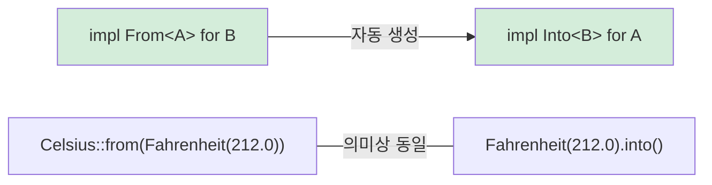

<a id="type-conversions-in-rust"></a>
## Rust의 타입 변환

> **이 장에서 배울 것:** 비용 없는 타입 변환을 위한 `From`과 `Into` 트레잇, 실패할 수 있는 변환을 위한 `TryFrom`,
> `impl From<A> for B`가 어떻게 `Into`를 자동으로 제공하는지, 그리고 문자열 변환 패턴.
>
> **난이도:** 🟡 중급

Python은 생성자 호출(`int("42")`, `str(42)`, `float("3.14")`)로 타입 변환을 처리합니다.
Rust는 타입 안전한 변환을 위해 `From`과 `Into` 트레잇을 사용합니다.

### Python의 타입 변환
```python
# Python — 변환에는 보통 명시적 생성자를 사용한다
x = int("42")           # str → int (ValueError가 날 수 있음)
s = str(42)             # int → str
f = float("3.14")       # str → float
lst = list((1, 2, 3))   # tuple → list

# __init__ 또는 클래스 메서드를 통한 커스텀 변환
class Celsius:
    def __init__(self, temp: float):
        self.temp = temp

    @classmethod
    def from_fahrenheit(cls, f: float) -> "Celsius":
        return cls((f - 32.0) * 5.0 / 9.0)

c = Celsius.from_fahrenheit(212.0)  # 100.0°C
```

<a id="rust-frominto"></a>
### Rust From/Into
```rust
// Rust — From 트레잇이 변환을 정의한다
// From<T>를 구현하면 Into<U>는 자동으로 따라온다!

struct Celsius(f64);
struct Fahrenheit(f64);

impl From<Fahrenheit> for Celsius {
    fn from(f: Fahrenheit) -> Self {
        Celsius((f.0 - 32.0) * 5.0 / 9.0)
    }
}

// 이제 둘 다 가능하다:
let c1 = Celsius::from(Fahrenheit(212.0));    // 명시적 From
let c2: Celsius = Fahrenheit(212.0).into();   // Into (자동 생성)

// 문자열 변환:
let s: String = String::from("hello");         // &str → String
let s: String = "hello".to_string();           // 같은 의미
let s: String = "hello".into();                // 이것도 가능 (From 구현됨)

let num: i64 = 42i32.into();                   // i32 → i64 (정보 손실이 없어서 From 존재)
// let small: i32 = 42i64.into();              // ❌ i64 → i32는 데이터 손실 가능 — From 없음

// 실패할 수 있는 변환은 TryFrom 사용:
let n: Result<i32, _> = "42".parse();          // str → i32 (실패 가능)
let n: i32 = "42".parse().unwrap();            // 숫자가 아니면 panic
let n: i32 = "42".parse()?;                    // ?로 에러 전파
```

### From/Into 관계



> **실전 규칙**: 직접 `Into`를 구현하지 말고 항상 `From`을 구현하세요. `From<A> for B`를 구현하면 `Into<B> for A`는 공짜로 얻습니다.

***

### From/Into를 언제 써야 할까

```rust
// 내 타입에 From<T>를 구현해 두면 API를 더 쓰기 편하게 설계할 수 있다

#[derive(Debug)]
struct UserId(i64);

impl From<i64> for UserId {
    fn from(id: i64) -> Self {
        UserId(id)
    }
}

// 이제 함수는 UserId로 변환 가능한 어떤 값이든 받을 수 있다:
fn find_user(id: impl Into<UserId>) -> Option<String> {
    let user_id = id.into();
    // ... 조회 로직
    Some(format!("User #{:?}", user_id))
}

find_user(42i64);              // ✅ i64가 UserId로 자동 변환됨
find_user(UserId(42));         // ✅ UserId는 그대로 사용됨
```

***

## TryFrom — 실패할 수 있는 변환

모든 변환이 항상 성공하는 것은 아닙니다. Python은 예외를 던지고, Rust는 `Result`를 반환하는 `TryFrom`을 사용합니다.

```python
# Python — 실패할 수 있는 변환은 예외를 발생시킨다
try:
    port = int("not_a_number")   # ValueError
except ValueError as e:
    print(f"Invalid: {e}")

# __init__ 안에서 직접 검증하기
class Port:
    def __init__(self, value: int):
        if not (1 <= value <= 65535):
            raise ValueError(f"Invalid port: {value}")
        self.value = value

try:
    p = Port(99999)  # 런타임에 ValueError
except ValueError:
    pass
```

```rust
use std::num::ParseIntError;

// 내장 타입에 대한 TryFrom
let n: Result<i32, ParseIntError> = "42".try_into();   // Ok(42)
let n: Result<i32, ParseIntError> = "bad".try_into();  // Err(...)

// 검증이 필요한 커스텀 TryFrom
#[derive(Debug)]
struct Port(u16);

#[derive(Debug)]
enum PortError {
    OutOfRange(u16),
    Zero,
}

impl TryFrom<u16> for Port {
    type Error = PortError;

    fn try_from(value: u16) -> Result<Self, Self::Error> {
        match value {
            0 => Err(PortError::Zero),
            1..=65535 => Ok(Port(value)),
            // 참고: u16의 최댓값은 65535이므로 이 match가 모든 경우를 덮는다
        }
    }
}

impl std::fmt::Display for PortError {
    fn fmt(&self, f: &mut std::fmt::Formatter<'_>) -> std::fmt::Result {
        match self {
            PortError::Zero => write!(f, "port cannot be zero"),
            PortError::OutOfRange(v) => write!(f, "port {v} out of range"),
        }
    }
}

// 사용 예:
let p: Result<Port, _> = 8080u16.try_into();   // Ok(Port(8080))
let p: Result<Port, _> = 0u16.try_into();       // Err(PortError::Zero)
```

> **Python → Rust 사고방식 대응**: `TryFrom`은 "검증도 하고 실패할 수도 있는 `__init__`"에 해당합니다. 다만 예외를 던지는 대신 `Result`를 반환하므로, 호출자는 실패 경우를 **반드시** 처리해야 합니다.

***

<a id="string-conversions"></a>
## 문자열 변환 패턴

문자열은 Python 개발자가 Rust로 넘어올 때 가장 자주 헷갈리는 변환 지점입니다.

```rust
// String → &str (빌림, 비용 없음)
let s = String::from("hello");
let r: &str = &s;              // 자동 Deref 강제 변환
let r: &str = s.as_str();     // 명시적 방법

// &str → String (할당 발생, 메모리 비용 있음)
let r: &str = "hello";
let s1 = String::from(r);     // From 트레잇
let s2 = r.to_string();       // ToString 트레잇 (Display 경유)
let s3: String = r.into();    // Into 트레잇

// Number → String
let s = 42.to_string();       // "42" — Python의 str(42)와 비슷
let s = format!("{:.2}", 3.14); // "3.14" — Python의 f"{3.14:.2f}"와 비슷

// String → Number
let n: i32 = "42".parse().unwrap();       // Python의 int("42")와 비슷
let f: f64 = "3.14".parse().unwrap();     // Python의 float("3.14")와 비슷

// 커스텀 타입 → String (Display 구현)
use std::fmt;

struct Point { x: f64, y: f64 }

impl fmt::Display for Point {
    fn fmt(&self, f: &mut fmt::Formatter<'_>) -> fmt::Result {
        write!(f, "({}, {})", self.x, self.y)
    }
}

let p = Point { x: 1.0, y: 2.0 };
println!("{p}");                // (1, 2) — Python의 __str__와 비슷
let s = p.to_string();         // 이것도 가능! Display가 있으면 ToString이 자동 제공된다.
```

### 변환 빠른 비교

| Python | Rust | 비고 |
|--------|------|------|
| `str(x)` | `x.to_string()` | `Display` 구현 필요 |
| `int("42")` | `"42".parse::<i32>()` | `Result` 반환 |
| `float("3.14")` | `"3.14".parse::<f64>()` | `Result` 반환 |
| `list(iter)` | `iter.collect::<Vec<_>>()` | 타입 주석 필요 |
| `dict(pairs)` | `pairs.collect::<HashMap<_,_>>()` | 타입 주석 필요 |
| `bool(x)` | 직접 대응 없음 | 명시적 검사 사용 |
| `MyClass(x)` | `MyClass::from(x)` | `From<T>` 구현 |
| `MyClass(x)` (검증 포함) | `MyClass::try_from(x)?` | `TryFrom<T>` 구현 |

***

## 변환 체이닝과 에러 처리

실전 코드에서는 여러 변환이 연달아 이어지는 경우가 많습니다. 두 방식을 비교해 보겠습니다.

```python
# Python — try/except와 함께 쓰는 변환 체인
def parse_config(raw: str) -> tuple[str, int]:
    try:
        host, port_str = raw.split(":")
        port = int(port_str)
        if not (1 <= port <= 65535):
            raise ValueError(f"Bad port: {port}")
        return (host, port)
    except (ValueError, AttributeError) as e:
        raise ConfigError(f"Invalid config: {e}") from e
```

```rust
fn parse_config(raw: &str) -> Result<(String, u16), String> {
    let (host, port_str) = raw
        .split_once(':')
        .ok_or_else(|| "missing ':' separator".to_string())?;

    let port: u16 = port_str
        .parse()
        .map_err(|e| format!("invalid port: {e}"))?;

    if port == 0 {
        return Err("port cannot be zero".to_string());
    }

    Ok((host.to_string(), port))
}

fn main() {
    match parse_config("localhost:8080") {
        Ok((host, port)) => println!("Connecting to {host}:{port}"),
        Err(e) => eprintln!("Config error: {e}"),
    }
}
```

> **핵심 포인트**: 각 `?`는 눈에 보이는 탈출 지점입니다. Python에서는 `try` 블록 안의 어느 줄이 예외를 던질지 한눈에 알기 어렵지만, Rust에서는 `?`가 붙은 줄만 실패 경로를 만듭니다.
>
> 📌 **함께 보기**: [9장 — 에러 처리](ch09-error-handling.md)에서는 `Result`, `?`, 그리고 `thiserror`를 사용한 커스텀 에러 타입을 더 깊게 다룹니다.

---

<a id="exercises"></a>
## 연습문제

<details>
<summary><strong>🏋️ 연습문제: 온도 변환 라이브러리</strong> (펼쳐서 보기)</summary>

**도전 과제**: 작은 온도 변환 라이브러리를 만들어 보세요.
1. `Celsius(f64)`, `Fahrenheit(f64)`, `Kelvin(f64)` 구조체를 정의한다.
2. `From<Celsius> for Fahrenheit`와 `From<Celsius> for Kelvin`을 구현한다.
3. 절대영도보다 낮은 값(-273.15°C = 0K)을 거부하는 `TryFrom<f64> for Kelvin`을 구현한다.
4. 세 타입 모두에 `Display`를 구현한다(예: `"100.00°C"`).

<details>
<summary>🔑 해답</summary>

```rust
use std::fmt;

struct Celsius(f64);
struct Fahrenheit(f64);
struct Kelvin(f64);

impl From<Celsius> for Fahrenheit {
    fn from(c: Celsius) -> Self {
        Fahrenheit(c.0 * 9.0 / 5.0 + 32.0)
    }
}

impl From<Celsius> for Kelvin {
    fn from(c: Celsius) -> Self {
        Kelvin(c.0 + 273.15)
    }
}

#[derive(Debug)]
struct BelowAbsoluteZero;

impl fmt::Display for BelowAbsoluteZero {
    fn fmt(&self, f: &mut fmt::Formatter<'_>) -> fmt::Result {
        write!(f, "temperature below absolute zero")
    }
}

impl TryFrom<f64> for Kelvin {
    type Error = BelowAbsoluteZero;

    fn try_from(value: f64) -> Result<Self, Self::Error> {
        if value < 0.0 {
            Err(BelowAbsoluteZero)
        } else {
            Ok(Kelvin(value))
        }
    }
}

impl fmt::Display for Celsius    { fn fmt(&self, f: &mut fmt::Formatter<'_>) -> fmt::Result { write!(f, "{:.2}°C", self.0) } }
impl fmt::Display for Fahrenheit { fn fmt(&self, f: &mut fmt::Formatter<'_>) -> fmt::Result { write!(f, "{:.2}°F", self.0) } }
impl fmt::Display for Kelvin     { fn fmt(&self, f: &mut fmt::Formatter<'_>) -> fmt::Result { write!(f, "{:.2}K",  self.0) } }

fn main() {
    let boiling = Celsius(100.0);
    let f: Fahrenheit = Celsius(100.0).into();
    let k: Kelvin = Celsius(100.0).into();
    println!("{boiling} = {f} = {k}");

    match Kelvin::try_from(-10.0) {
        Ok(k) => println!("{k}"),
        Err(e) => println!("Error: {e}"),
    }
}
```

**핵심 포인트**: `From`은 항상 성공하는 변환을 처리합니다(Celsius→Fahrenheit는 언제나 가능). `TryFrom`은 실패할 수 있는 변환을 처리합니다(음수 Kelvin은 불가능). Python은 이 둘을 `__init__` 안에서 섞어 쓰기 쉽지만, Rust는 타입 시스템에서 그 차이를 명확히 드러냅니다.

</details>
</details>

***


