<a id="no-gil-true-parallelism"></a>
## GIL이 없다: 진짜 병렬성

> **이 장에서 배울 내용:** GIL이 Python 동시성에 어떤 제약을 주는지, Rust의 `Send`/`Sync` 트레잇이 컴파일 시점 스레드 안전성을 어떻게 보장하는지,
> `Arc<Mutex<T>>`와 Python의 `threading.Lock`를 어떻게 비교할 수 있는지, 채널과 `queue.Queue`의 차이, 그리고 `async`/`await` 모델이 어떻게 다른지 살펴봅니다.
>
> **난이도:** 🔴 고급

GIL(Global Interpreter Lock)은 CPU 바운드 작업에서 Python이 안고 있는 가장 큰 제약입니다.
Rust에는 GIL이 없으므로 스레드가 실제로 병렬 실행되며, 타입 시스템이 데이터 레이스를 컴파일 시점에 막아줍니다.

```mermaid
gantt
    title CPU 바운드 작업: Python GIL vs Rust 스레드
    dateFormat X
    axisFormat %s
    section Python (GIL)
        스레드 1 :a1, 0, 4
        스레드 2 :a2, 4, 8
        스레드 3 :a3, 8, 12
        스레드 4 :a4, 12, 16
    section Rust (GIL 없음)
        스레드 1 :b1, 0, 4
        스레드 2 :b2, 0, 4
        스레드 3 :b3, 0, 4
        스레드 4 :b4, 0, 4
```



> **핵심 통찰**: Python 스레드는 CPU 작업에서 순차적으로 실행됩니다(GIL이 이를 직렬화합니다). Rust 스레드는 실제 병렬로 실행되므로, 스레드 4개면 대략 4배 가까운 속도 향상을 기대할 수 있습니다.
>
> 📌 **선수 지식**: `Arc`, `Mutex`, move 클로저는 모두 소유권 개념 위에 서 있습니다. 이 장에 들어가기 전에 [7장 - 소유권과 대여](ch07-ownership-and-borrowing.md)를 충분히 익혀두세요.

### Python의 GIL 문제
```python
# Python — threads don't help for CPU-bound work
import threading
import time

counter = 0

def increment(n):
    global counter
    for _ in range(n):
        counter += 1  # NOT thread-safe! But GIL "protects" simple operations

threads = [threading.Thread(target=increment, args=(1_000_000,)) for _ in range(4)]
start = time.perf_counter()
for t in threads:
    t.start()
for t in threads:
    t.join()
elapsed = time.perf_counter() - start

print(f"Counter: {counter}")    # Might not be 4,000,000!
print(f"Time: {elapsed:.2f}s")  # About the SAME as single-threaded (GIL)

# For true parallelism, Python requires multiprocessing:
from multiprocessing import Pool
with Pool(4) as pool:
    results = pool.map(cpu_work, data)  # Separate processes, pickle overhead
```

### Rust — 진짜 병렬성과 컴파일 시점 안전성
```rust
use std::sync::atomic::{AtomicI64, Ordering};
use std::sync::Arc;
use std::thread;

fn main() {
    let counter = Arc::new(AtomicI64::new(0));

    let handles: Vec<_> = (0..4).map(|_| {
        let counter = Arc::clone(&counter);
        thread::spawn(move || {
            for _ in 0..1_000_000 {
                counter.fetch_add(1, Ordering::Relaxed);
            }
        })
    }).collect();

    for h in handles {
        h.join().unwrap();
    }

    println!("Counter: {}", counter.load(Ordering::Relaxed)); // Always 4,000,000
    // Runs on ALL cores — true parallelism, no GIL
}
```

***

<a id="thread-safety-type-system-guarantees"></a>
## 스레드 안전성: 타입 시스템이 보장한다

### Python — 런타임에서 드러나는 문제
```python
# Python — data races caught at runtime (or not at all)
import threading

shared_list = []

def append_items(items):
    for item in items:
        shared_list.append(item)  # "Thread-safe" due to GIL for append
        # But complex operations are NOT safe:
        # if item not in shared_list:
        #     shared_list.append(item)  # RACE CONDITION!

# Using Lock for safety:
lock = threading.Lock()
def safe_append(items):
    for item in items:
        with lock:
            if item not in shared_list:
                shared_list.append(item)
# Forgetting the lock? No compiler warning. Bug discovered in production.
```

### Rust — 컴파일 시점 오류
```rust
use std::sync::{Arc, Mutex};
use std::thread;

fn main() {
    // Trying to share a Vec across threads without protection:
    // let shared = vec![];
    // thread::spawn(move || shared.push(1));
    // ❌ Compile error: Vec is not Send/Sync without protection

    // With Mutex (Rust's equivalent of threading.Lock):
    let shared = Arc::new(Mutex::new(Vec::new()));

    let handles: Vec<_> = (0..4).map(|i| {
        let shared = Arc::clone(&shared);
        thread::spawn(move || {
            let mut data = shared.lock().unwrap(); // Lock is REQUIRED to access
            data.push(i);
            // Lock is automatically released when `data` goes out of scope
            // No "forgetting to unlock" — RAII guarantees it
        })
    }).collect();

    for h in handles {
        h.join().unwrap();
    }

    println!("{:?}", shared.lock().unwrap()); // [0, 1, 2, 3] (order may vary)
}
```

### `Send`와 `Sync` 트레잇
```rust
// Rust uses two marker traits to enforce thread safety:

// Send — "this type can be transferred to another thread"
// Most types are Send. Rc<T> is NOT (use Arc<T> for threads).

// Sync — "this type can be referenced from multiple threads"
// Most types are Sync. Cell<T>/RefCell<T> are NOT (use Mutex<T>).

// The compiler checks these automatically:
// thread::spawn(move || { ... })
//   ↑ The closure's captures must be Send
//   ↑ Shared references must be Sync
//   ↑ If they're not → compile error

// Python has no equivalent. Thread safety bugs are discovered at runtime.
// Rust catches them at compile time. This is "fearless concurrency."
```

### 동시성 프리미티브 비교

| Python | Rust | 용도 |
|--------|------|------|
| `threading.Lock()` | `Mutex<T>` | 상호 배제 |
| `threading.RLock()` | `Mutex<T>` (재진입 아님) | 재진입 락에 가까운 용도 |
| `threading.RWLock` (해당 없음) | `RwLock<T>` | 여러 읽기 또는 하나의 쓰기 |
| `threading.Event()` | `Condvar` | 조건 변수 |
| `queue.Queue()` | `mpsc::channel()` | 스레드 안전 채널 |
| `multiprocessing.Pool` | `rayon::ThreadPool` | 스레드 풀 |
| `concurrent.futures` | `rayon` / `tokio::spawn` | 태스크 기반 병렬성 |
| `threading.local()` | `thread_local!` | 스레드 로컬 저장소 |
| 해당 없음 | `Atomic*` 타입 | 락 없는 카운터와 플래그 |

### `Mutex` 포이즈닝

어떤 스레드가 `Mutex`를 잡은 상태에서 **panic**을 일으키면 그 락은 *poisoned* 상태가 됩니다. Python에는 정확히 대응되는 개념이 없습니다. Python에서 `threading.Lock()`을 잡은 스레드가 비정상 종료되면, 락은 그냥 막힌 상태로 남습니다.

```rust
use std::sync::{Arc, Mutex};
use std::thread;

let data = Arc::new(Mutex::new(vec![1, 2, 3]));
let data2 = Arc::clone(&data);

let _ = thread::spawn(move || {
    let mut guard = data2.lock().unwrap();
    guard.push(4);
    panic!("oops!");  // Lock is now poisoned
}).join();

// Subsequent lock attempts return Err(PoisonError)
match data.lock() {
    Ok(guard) => println!("Data: {guard:?}"),
    Err(poisoned) => {
        println!("Lock was poisoned! Recovering...");
        let guard = poisoned.into_inner();
        println!("Recovered: {guard:?}");  // [1, 2, 3, 4]
    }
}
```

### 원자적 순서화(`Ordering`) 짧은 메모

원자 연산의 `Ordering` 매개변수는 메모리 가시성 보장을 얼마나 강하게 줄지 결정합니다.

| Ordering | 사용하는 시점 |
|----------|---------------|
| `Relaxed` | 연산 순서가 중요하지 않은 단순 카운터 |
| `Acquire`/`Release` | 생산자-소비자 패턴: 쓰는 쪽은 `Release`, 읽는 쪽은 `Acquire` |
| `SeqCst` | 애매하면 이것부터: 가장 엄격하고 가장 직관적인 순서 |

Python의 `threading` 모듈은 GIL 뒤에 이런 세부 사항을 숨깁니다. Rust에서는 직접 선택해야 하므로, 특별한 근거가 없으면 먼저 `SeqCst`로 시작하고 프로파일링이 필요성을 보여줄 때 더 약한 순서화를 고려하세요.

***

<a id="asyncawait-comparison"></a>
## `async`/`await` 비교

Python과 Rust 모두 `async`/`await` 문법을 제공하지만, 내부 동작 방식은 꽤 다릅니다.

### Python `async`/`await`
```python
# Python — asyncio for concurrent I/O
import asyncio
import aiohttp

async def fetch_url(session, url):
    async with session.get(url) as resp:
        return await resp.text()

async def main():
    urls = ["https://example.com", "https://httpbin.org/get"]

    async with aiohttp.ClientSession() as session:
        tasks = [fetch_url(session, url) for url in urls]
        results = await asyncio.gather(*tasks)

    for url, result in zip(urls, results):
        print(f"{url}: {len(result)} bytes")

asyncio.run(main())

# Python async is single-threaded (still GIL)!
# It only helps with I/O-bound work (waiting for network/disk).
# CPU-bound work in async still blocks the event loop.
```

### Rust `async`/`await`
```rust
// Rust — tokio for concurrent I/O (and CPU parallelism!)
use reqwest;
use tokio;

async fn fetch_url(url: &str) -> Result<String, reqwest::Error> {
    reqwest::get(url).await?.text().await
}

#[tokio::main]
async fn main() -> Result<(), Box<dyn std::error::Error>> {
    let urls = vec!["https://example.com", "https://httpbin.org/get"];

    let tasks: Vec<_> = urls.iter()
        .map(|url| tokio::spawn(fetch_url(url)))  // No GIL limitation
        .collect();                                 // Can use all CPU cores

    let results = futures::future::join_all(tasks).await;

    for (url, result) in urls.iter().zip(results) {
        match result {
            Ok(Ok(body)) => println!("{url}: {} bytes", body.len()),
            Ok(Err(e)) => println!("{url}: error {e}"),
            Err(e) => println!("{url}: task failed {e}"),
        }
    }

    Ok(())
}
```

### 핵심 차이

| 항목 | Python `asyncio` | Rust `tokio` |
|------|------------------|--------------|
| GIL | 여전히 적용됨 | GIL 없음 |
| CPU 병렬성 | ❌ 단일 스레드 | ✅ 멀티스레드 |
| 런타임 | 내장(`asyncio`) | 외부 크레이트(`tokio`) |
| 생태계 | `aiohttp`, `asyncpg` 등 | `reqwest`, `sqlx` 등 |
| 성능 | I/O에는 충분히 좋음 | I/O와 CPU 모두 뛰어남 |
| 에러 처리 | 예외 | `Result<T, E>` |
| 취소 | `task.cancel()` | future를 drop |
| 컬러 문제 | 동기/비동기 경계가 있음 | 같은 문제가 존재 |

### Rayon으로 간단하게 병렬화하기
```python
# Python — multiprocessing for CPU parallelism
from multiprocessing import Pool

def process_item(item):
    return heavy_computation(item)

with Pool(8) as pool:
    results = pool.map(process_item, items)
```

```rust
// Rust — rayon for effortless CPU parallelism (one line change!)
use rayon::prelude::*;

// Sequential:
let results: Vec<_> = items.iter().map(|item| heavy_computation(item)).collect();

// Parallel (change .iter() to .par_iter() — that's it!):
let results: Vec<_> = items.par_iter().map(|item| heavy_computation(item)).collect();

// No pickle, no process overhead, no serialization.
// Rayon automatically distributes work across cores.
```

---

## 💼 사례 연구: 병렬 이미지 처리 파이프라인

한 데이터 과학 팀이 매일 밤 위성 이미지 50,000장을 처리합니다. 이 팀의 Python 파이프라인은 `multiprocessing.Pool`을 사용합니다.

```python
# Python — multiprocessing for CPU-bound image work
import multiprocessing
from PIL import Image
import numpy as np

def process_image(path: str) -> dict:
    img = np.array(Image.open(path))
    # CPU-intensive: histogram equalization, edge detection, classification
    histogram = np.histogram(img, bins=256)[0]
    edges = detect_edges(img)       # ~200ms per image
    label = classify(edges)          # ~100ms per image
    return {"path": path, "label": label, "edge_count": len(edges)}

# Problem: each subprocess copies the full Python interpreter
# Memory: 50MB per worker × 16 workers = 800MB overhead
# Startup: 2-3 seconds to fork and pickle arguments
with multiprocessing.Pool(16) as pool:
    results = pool.map(process_image, image_paths)  # ~4.5 hours for 50k images
```

**문제점**: 프로세스를 포크하면서 800MB의 메모리 오버헤드가 생기고, 인자/결과를 `pickle`로 직렬화해야 하며, GIL 때문에 스레드를 쓸 수도 없습니다. 에러 처리도 불투명해서 워커 안에서 던져진 예외를 추적하기가 어렵습니다.

```rust
use rayon::prelude::*;
use image::GenericImageView;

struct ImageResult {
    path: String,
    label: String,
    edge_count: usize,
}

fn process_image(path: &str) -> Result<ImageResult, image::ImageError> {
    let img = image::open(path)?;
    let histogram = compute_histogram(&img);       // ~50ms (no numpy overhead)
    let edges = detect_edges(&img);                // ~40ms (SIMD-optimized)
    let label = classify(&edges);                  // ~20ms
    Ok(ImageResult {
        path: path.to_string(),
        label,
        edge_count: edges.len(),
    })
}

fn main() -> Result<(), Box<dyn std::error::Error>> {
    let paths: Vec<String> = load_image_paths()?;

    // Rayon automatically uses all CPU cores — no forking, no pickle, no GIL
    let results: Vec<ImageResult> = paths
        .par_iter()                                // Parallel iterator
        .filter_map(|p| process_image(p).ok())     // Skip errors gracefully
        .collect();                                // Collect in parallel

    println!("Processed {} images", results.len());
    Ok(())
}
// 50k images in ~35 minutes (vs 4.5 hours in Python)
// Memory: ~50MB total (shared threads, no forking)
```

**결과**:
| 지표 | Python (`multiprocessing`) | Rust (`rayon`) |
|------|---------------------------|----------------|
| 시간(5만 장 이미지) | 약 4.5시간 | 약 35분 |
| 메모리 오버헤드 | 800MB(워커 16개) | 약 50MB(공유) |
| 에러 처리 | 불투명한 `pickle` 오류 | 모든 단계에서 `Result<T, E>` |
| 시작 비용 | 2-3초(fork + pickle) | 없음(스레드) |

> **핵심 교훈**: CPU 바운드 병렬 작업에서는 Rust의 스레드와 `rayon`이 Python의 `multiprocessing`을 대체합니다. 직렬화 오버헤드는 없고, 메모리를 공유할 수 있으며, 안전성은 컴파일 시점에 보장됩니다.

---

## 연습문제

<details>
<summary><strong>🏋️ 연습문제: 스레드 안전 카운터</strong> (펼쳐서 보기)</summary>

**도전 과제**: Python에서는 공유 카운터를 보호하기 위해 `threading.Lock`를 사용했을 것입니다. 이를 Rust로 옮겨보세요. 스레드 10개를 만들고, 각 스레드가 공유 카운터를 1000번씩 증가시킵니다. 마지막 값을 출력하세요(정답은 10000). `Arc<Mutex<u64>>`를 사용하세요.

<details>
<summary>🔑 해답</summary>

```rust
use std::sync::{Arc, Mutex};
use std::thread;

fn main() {
    let counter = Arc::new(Mutex::new(0u64));
    let mut handles = vec![];

    for _ in 0..10 {
        let counter = Arc::clone(&counter);
        handles.push(thread::spawn(move || {
            for _ in 0..1000 {
                let mut num = counter.lock().unwrap();
                *num += 1;
            }
        }));
    }

    for handle in handles {
        handle.join().unwrap();
    }

    println!("Final count: {}", *counter.lock().unwrap());
}
```

**핵심 정리**: `Arc<Mutex<T>>`는 Python의 `lock = threading.Lock()` + 공유 변수 조합에 해당합니다. 차이는 Rust에서는 `Arc`나 `Mutex`를 빼먹으면 아예 컴파일이 되지 않는다는 점입니다. Python은 경쟁 상태가 있는 프로그램도 그냥 실행해버리고, 조용히 잘못된 답을 내놓을 수 있습니다.

</details>
</details>

***
