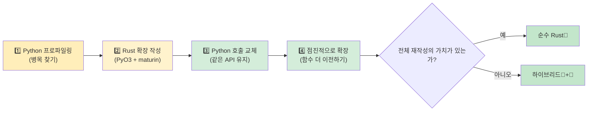

<a id="common-python-patterns-in-rust"></a>
## Rust에서 보는 흔한 Python 패턴

> **이 장에서 배울 내용:** `dict`를 `struct`로, 클래스를 `struct + impl`로, 리스트 컴프리헨션을 이터레이터 체인으로,
> 데코레이터를 트레잇/고차 함수/매크로로, 컨텍스트 매니저를 `Drop`/RAII로 옮기는 방법을 다룹니다. 여기에 Python 개발자에게 유용한 핵심 크레이트와 점진적 도입 전략도 함께 정리합니다.
>
> **난이도:** 🟡 중급

### 딕셔너리 → `struct`
```python
# Python — dict as data container (very common)
user = {
    "name": "Alice",
    "age": 30,
    "email": "alice@example.com",
    "active": True,
}
print(user["name"])
```

```rust
// Rust — struct with named fields
#[derive(Debug, Clone, serde::Serialize, serde::Deserialize)]
struct User {
    name: String,
    age: i32,
    email: String,
    active: bool,
}

let user = User {
    name: "Alice".into(),
    age: 30,
    email: "alice@example.com".into(),
    active: true,
};
println!("{}", user.name);
```

### 컨텍스트 매니저 → RAII(`Drop`)
```python
# Python — context manager for resource cleanup
class FileManager:
    def __init__(self, path):
        self.file = open(path, 'w')

    def __enter__(self):
        return self.file

    def __exit__(self, *args):
        self.file.close()

with FileManager("output.txt") as f:
    f.write("hello")
# File automatically closed when exiting `with`
```

```rust
// Rust — RAII: Drop trait runs when value goes out of scope
use std::fs::File;
use std::io::Write;

fn write_file() -> std::io::Result<()> {
    let mut file = File::create("output.txt")?;
    file.write_all(b"hello")?;
    Ok(())
    // File automatically closed when `file` goes out of scope
    // No `with` needed — RAII handles it!
}
```

### 데코레이터 → 고차 함수 또는 매크로
```python
# Python — decorator for timing
import functools, time

def timed(func):
    @functools.wraps(func)
    def wrapper(*args, **kwargs):
        start = time.perf_counter()
        result = func(*args, **kwargs)
        elapsed = time.perf_counter() - start
        print(f"{func.__name__} took {elapsed:.4f}s")
        return result
    return wrapper

@timed
def slow_function():
    time.sleep(1)
```

```rust
// Rust — no decorators, use wrapper functions or macros
use std::time::Instant;

fn timed<F, R>(name: &str, f: F) -> R
where
    F: FnOnce() -> R,
{
    let start = Instant::now();
    let result = f();
    println!("{} took {:.4?}", name, start.elapsed());
    result
}

// Usage:
let result = timed("slow_function", || {
    std::thread::sleep(std::time::Duration::from_secs(1));
    42
});
```

### 이터레이터 파이프라인(데이터 처리)
```python
# Python — chain of transformations
import csv
from collections import Counter

def analyze_sales(filename):
    with open(filename) as f:
        reader = csv.DictReader(f)
        sales = [
            row for row in reader
            if float(row["amount"]) > 100
        ]
    by_region = Counter(sale["region"] for sale in sales)
    top_regions = by_region.most_common(5)
    return top_regions
```

```rust
// Rust — iterator chains with strong types
use std::collections::HashMap;

#[derive(Debug, serde::Deserialize)]
struct Sale {
    region: String,
    amount: f64,
}

fn analyze_sales(filename: &str) -> Vec<(String, usize)> {
    let data = std::fs::read_to_string(filename).unwrap();
    let mut reader = csv::Reader::from_reader(data.as_bytes());

    let mut by_region: HashMap<String, usize> = HashMap::new();
    for sale in reader.deserialize::<Sale>().flatten() {
        if sale.amount > 100.0 {
            *by_region.entry(sale.region).or_insert(0) += 1;
        }
    }

    let mut top: Vec<_> = by_region.into_iter().collect();
    top.sort_by(|a, b| b.1.cmp(&a.1));
    top.truncate(5);
    top
}
```

### 전역 설정 / 싱글턴
```python
# Python — module-level singleton (common pattern)
# config.py
import json

class Config:
    _instance = None

    def __new__(cls):
        if cls._instance is None:
            cls._instance = super().__new__(cls)
            with open("config.json") as f:
                cls._instance.data = json.load(f)
        return cls._instance

config = Config()  # Module-level singleton
```

```rust
// Rust — OnceLock for lazy static initialization (Rust 1.70+)
use std::sync::OnceLock;
use serde_json::Value;

static CONFIG: OnceLock<Value> = OnceLock::new();

fn get_config() -> &'static Value {
    CONFIG.get_or_init(|| {
        let data = std::fs::read_to_string("config.json")
            .expect("Failed to read config");
        serde_json::from_str(&data)
            .expect("Failed to parse config")
    })
}

// Usage anywhere:
let db_host = get_config()["database"]["host"].as_str().unwrap();
```

***

<a id="essential-crates-for-python-developers"></a>
## Python 개발자를 위한 필수 크레이트

### 데이터 처리와 직렬화

| 작업 | Python | Rust 크레이트 | 메모 |
|------|--------|---------------|------|
| JSON | `json` | `serde_json` | 타입 안전 직렬화 |
| CSV | `csv`, `pandas` | `csv` | 스트리밍, 낮은 메모리 사용량 |
| YAML | `pyyaml` | `serde_yaml` | 설정 파일 |
| TOML | `tomllib` | `toml` | 설정 파일 |
| 데이터 검증 | `pydantic` | `serde` + custom | 컴파일 시점 검증에 가깝게 설계 가능 |
| 날짜/시간 | `datetime` | `chrono` | 전체 타임존 지원 |
| 정규식 | `re` | `regex` | 매우 빠름 |
| UUID | `uuid` | `uuid` | 같은 개념 |

### 웹과 네트워크

| 작업 | Python | Rust 크레이트 | 메모 |
|------|--------|---------------|------|
| HTTP 클라이언트 | `requests` | `reqwest` | 비동기 우선 |
| 웹 프레임워크 | `FastAPI`/`Flask` | `axum` / `actix-web` | 매우 빠름 |
| WebSocket | `websockets` | `tokio-tungstenite` | 비동기 |
| gRPC | `grpcio` | `tonic` | 완전 지원 |
| 데이터베이스(SQL) | `sqlalchemy` | `sqlx` / `diesel` | 컴파일 시점 SQL 검사 |
| Redis | `redis-py` | `redis` | 비동기 지원 |

### CLI와 시스템

| 작업 | Python | Rust 크레이트 | 메모 |
|------|--------|---------------|------|
| CLI 인자 | `argparse`/`click` | `clap` | derive 매크로 제공 |
| 컬러 출력 | `colorama` | `colored` | 터미널 색상 |
| 진행 표시줄 | `tqdm` | `indicatif` | 비슷한 UX |
| 파일 감시 | `watchdog` | `notify` | 크로스 플랫폼 |
| 로깅 | `logging` | `tracing` | 구조화 로그, async 친화적 |
| 환경 변수 | `os.environ` | `std::env` + `dotenvy` | `.env` 지원 |
| 서브프로세스 | `subprocess` | `std::process::Command` | 표준 라이브러리 내장 |
| 임시 파일 | `tempfile` | `tempfile` | 이름도 동일 |

### 테스트

| 작업 | Python | Rust 크레이트 | 메모 |
|------|--------|---------------|------|
| 테스트 프레임워크 | `pytest` | 내장 + `rstest` | `cargo test` |
| 목 객체 | `unittest.mock` | `mockall` | 트레잇 기반 |
| 프로퍼티 테스트 | `hypothesis` | `proptest` | 비슷한 API |
| 스냅샷 테스트 | `syrupy` | `insta` | 스냅샷 승인 방식 |
| 벤치마킹 | `pytest-benchmark` | `criterion` | 통계 기반 |
| 코드 커버리지 | `coverage.py` | `cargo-tarpaulin` | LLVM 기반 |

***

<a id="incremental-adoption-strategy"></a>
## 점진적 도입 전략



> 📌 **함께 보기**: [14장 - Unsafe Rust와 FFI](ch14-unsafe-rust-and-ffi.md)에서는 PyO3 바인딩에 필요한 더 낮은 수준의 FFI 세부 사항을 다룹니다.

### 1단계: 병목 찾기

```python
# Profile your Python code first
import cProfile
cProfile.run('main()')  # Find the CPU-intensive functions

# Or use py-spy for sampling profiler:
# py-spy top --pid <python-pid>
# py-spy record -o profile.svg -- python main.py
```

### 2단계: 병목 구간을 위한 Rust 확장 작성

```bash
# Create a Rust extension with maturin
cd my_python_project
maturin init --bindings pyo3

# Write the hot function in Rust (see PyO3 section above)
# Build and install:
maturin develop --release
```

### 3단계: Python 호출을 Rust 호출로 교체

```python
# Before:
result = python_hot_function(data)  # Slow

# After:
import my_rust_extension
result = my_rust_extension.hot_function(data)  # Fast!

# Same API, same tests, 10-100x faster
```

### 4단계: 점진적으로 넓혀가기

```rust
1-2주차: CPU 바운드 함수 하나를 Rust로 교체
3-4주차: 데이터 파싱/검증 계층 교체
2개월차: 핵심 데이터 파이프라인 교체
3개월차+: 효과가 충분하면 전체 Rust 재작성 검토

핵심 원칙: 오케스트레이션은 Python에 맡기고, 계산은 Rust에 맡긴다.
```

---

## 💼 사례 연구: PyO3로 데이터 파이프라인 가속하기

한 핀테크 스타트업이 하루 2GB 규모의 거래 CSV 파일을 처리하는 Python 데이터 파이프라인을 운영하고 있습니다. 가장 큰 병목은 검증 + 변환 단계입니다.

```python
# Python — the slow part (~12 minutes for 2GB)
import csv
from decimal import Decimal
from datetime import datetime

def validate_and_transform(filepath: str) -> list[dict]:
    results = []
    with open(filepath) as f:
        reader = csv.DictReader(f)
        for row in reader:
            # Parse and validate each field
            amount = Decimal(row["amount"])
            if amount < 0:
                raise ValueError(f"Negative amount: {amount}")
            date = datetime.strptime(row["date"], "%Y-%m-%d")
            category = categorize(row["merchant"])  # String matching, ~50 rules

            results.append({
                "amount_cents": int(amount * 100),
                "date": date.isoformat(),
                "category": category,
                "merchant": row["merchant"].strip().lower(),
            })
    return results
# ~12 minutes for 15M rows. Tried pandas — got to ~8 minutes but 6GB RAM.
```

**1단계**: 먼저 프로파일링해 병목을 확인합니다(CSV 파싱 + `Decimal` 변환 + 문자열 매칭이 전체 시간의 95%).

**2단계**: Rust 확장을 작성합니다.

```rust
// src/lib.rs — PyO3 extension
use pyo3::prelude::*;
use pyo3::types::PyList;
use std::fs::File;
use std::io::BufReader;

#[derive(Debug)]
struct Transaction {
    amount_cents: i64,
    date: String,
    category: String,
    merchant: String,
}

fn categorize(merchant: &str) -> &'static str {
    // Aho-Corasick or simple rules — compiled once, blazing fast
    if merchant.contains("amazon") { "shopping" }
    else if merchant.contains("uber") || merchant.contains("lyft") { "transport" }
    else if merchant.contains("starbucks") { "food" }
    else { "other" }
}

#[pyfunction]
fn process_transactions(path: &str) -> PyResult<Vec<(i64, String, String, String)>> {
    let file = File::open(path).map_err(|e| pyo3::exceptions::PyIOError::new_err(e.to_string()))?;
    let mut reader = csv::Reader::from_reader(BufReader::new(file));

    let mut results = Vec::with_capacity(15_000_000); // Pre-allocate

    for record in reader.records() {
        let record = record.map_err(|e| pyo3::exceptions::PyValueError::new_err(e.to_string()))?;
        let amount_str = &record[0];
        let amount_cents = parse_amount_cents(amount_str)?;  // Custom parser, no Decimal
        let date = &record[1];  // Already in ISO format, just validate
        let merchant = record[2].trim().to_lowercase();
        let category = categorize(&merchant).to_string();

        results.push((amount_cents, date.to_string(), category, merchant));
    }
    Ok(results)
}

#[pymodule]
fn fast_pipeline(_py: Python, m: &PyModule) -> PyResult<()> {
    m.add_function(wrap_pyfunction!(process_transactions, m)?)?;
    Ok(())
}
```

**3단계**: Python 코드 한 줄을 교체합니다.

```python
# Before:
results = validate_and_transform("transactions.csv")  # 12 minutes

# After:
import fast_pipeline
results = fast_pipeline.process_transactions("transactions.csv")  # 45 seconds

# Same Python orchestration, same tests, same deployment
# Just one function replaced
```

**결과**:
| 지표 | Python (`csv` + `Decimal`) | Rust (PyO3 + `csv` crate) |
|------|----------------------------|----------------------------|
| 시간(2GB / 1,500만 행) | 12분 | 45초 |
| 최대 메모리 | 6GB(`pandas`) / 2GB(`csv`) | 200MB |
| Python 쪽 수정 라인 수 | — | 1줄(`import` + 호출) |
| 새로 작성한 Rust 코드 | — | 약 60줄 |
| 테스트 통과 | 47/47 | 47/47(변경 없음) |

> **핵심 교훈**: 애플리케이션 전체를 다시 쓸 필요는 없습니다. 전체 시간의 95%를 잡아먹는 5% 코드만 찾아 PyO3로 Rust로 옮기고, 나머지는 Python에 남겨두세요. 이 팀은 "서버를 더 늘려야 하나?"에서 "서버 한 대면 충분하다"로 바뀌었습니다.

---

## 연습문제

<details>
<summary><strong>🏋️ 연습문제: 마이그레이션 의사결정 매트릭스</strong> (펼쳐서 보기)</summary>

**도전 과제**: 다음 구성 요소를 가진 Python 웹 애플리케이션이 있습니다. 각 항목에 대해 **Python 유지**, **Rust로 재작성**, **PyO3 브리지** 중 하나를 선택하고 이유를 설명해보세요.

1. Flask 라우트 핸들러(요청 파싱, JSON 응답)
2. 이미지 썸네일 생성(CPU 바운드, 하루 1만 장 처리)
3. 데이터베이스 ORM 쿼리(SQLAlchemy)
4. 2GB 금융 CSV 파일 파서(매일 밤 실행)
5. 관리자 대시보드(Jinja2 템플릿)

<details>
<summary>🔑 해답</summary>

| 구성 요소 | 결정 | 이유 |
|---|---|---|
| Flask 라우트 핸들러 | 🐍 Python 유지 | I/O 바운드이고 프레임워크 의존성이 크며, Rust로 옮겨도 이득이 작음 |
| 이미지 썸네일 생성 | 🦀 PyO3 브리지 | CPU 바운드 병목이며, Python API는 유지하고 내부만 Rust로 바꾸기 좋음 |
| 데이터베이스 ORM 쿼리 | 🐍 Python 유지 | SQLAlchemy는 성숙했고, 쿼리는 대부분 I/O 바운드 |
| CSV 파서(2GB) | 🦀 PyO3 브리지 또는 전체 Rust | CPU + 메모리 병목이라 Rust의 zero-copy 파싱이 강력함 |
| 관리자 대시보드 | 🐍 Python 유지 | UI/템플릿 코드이며 성능 이슈가 핵심이 아님 |

**핵심 정리**: 마이그레이션의 최적 지점은 경계가 분명한 CPU 바운드 고성능 코드입니다. glue code나 I/O 바운드 핸들러까지 억지로 Rust로 옮길 필요는 없습니다. 얻는 이득보다 비용이 커질 가능성이 큽니다.

</details>
</details>

***
