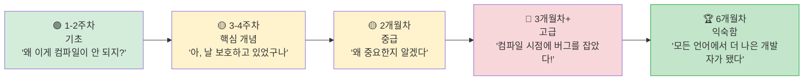

<a id="idiomatic-rust-for-python-developers"></a>
## Python 개발자를 위한 Rust다운 습관

> **이 장에서 배울 내용:** 꼭 몸에 익혀야 할 상위 10가지 습관, 흔한 함정과 해결책, 구조화된 3개월 학습 경로,
> 그리고 Python→Rust 전환에 바로 참고할 수 있는 "로제타 스톤" 표와 추천 학습 자료를 정리합니다.
>
> **난이도:** 🟡 중급



### 길러야 할 10가지 습관

1. **`if isinstance()` 대신 enum에 `match`를 쓰자**
   ```python
   # Python                              # Rust
   if isinstance(shape, Circle): ...     match shape { Shape::Circle(r) => ... }
   ```

2. **컴파일러를 길잡이로 삼자**. 에러 메시지를 천천히 읽으세요. Rust 컴파일러는 어떤 언어보다도 뛰어난 편이며, 무엇이 틀렸는지뿐 아니라 어떻게 고쳐야 하는지도 알려줍니다.

3. **함수 인자에는 `String`보다 `&str`를 우선하자**. 더 일반적인 타입을 받는 편이 좋습니다. `&str`는 `String`과 문자열 리터럴 모두를 받을 수 있습니다.

4. **인덱스 루프보다 이터레이터를 쓰자**. 이터레이터 체인은 `for i in 0..vec.len()`보다 훨씬 Rust답고, 종종 더 빠르기도 합니다.

5. **`Option`과 `Result`를 적극적으로 받아들이자**. 모든 곳에서 `.unwrap()` 하지 마세요. `?`, `map`, `and_then`, `unwrap_or_else`를 활용하세요.

6. **트레잇 derive를 아끼지 말자**. `#[derive(Debug, Clone, PartialEq)]`는 대부분의 구조체에 붙여도 좋습니다. 비용은 거의 없고 테스트와 디버깅이 쉬워집니다.

7. **`cargo clippy`를 습관처럼 돌리자**. 스타일과 정확성 문제를 수백 가지 잡아줍니다. Rust판 `ruff`처럼 생각해도 좋습니다.

8. **borrow checker와 싸우지 말자**. 계속 싸우고 있다면 데이터 구조를 잘못 잡았을 가능성이 큽니다. 소유권이 더 분명해지도록 리팩터링하세요.

9. **상태 머신에는 enum을 쓰자**. 문자열 플래그나 불리언 조합 대신 enum을 사용하세요. 그러면 컴파일러가 모든 상태를 처리했는지 확인해줍니다.

10. **처음에는 `clone()`하고, 나중에 최적화하자**. 학습 단계에서는 소유권 복잡도를 줄이기 위해 `.clone()`을 써도 됩니다. 다만 프로파일링이 필요성을 보여줄 때만 최적화하세요.

### Python 개발자가 자주 하는 실수

| 실수 | 왜 문제인가 | 해결책 |
|------|-------------|--------|
| 어디서나 `.unwrap()` 사용 | 런타임에 panic 발생 | `?` 또는 `match` 사용 |
| `&str` 대신 `String` 사용 | 불필요한 할당 | 함수 인자에는 `&str` 사용 |
| `for i in 0..vec.len()` | Rust답지 않음 | `for item in &vec` |
| `clippy` 경고 무시 | 쉬운 개선 포인트를 놓침 | `cargo clippy` |
| `.clone()` 남발 | 성능 오버헤드 | 소유권 구조를 리팩터링 |
| 너무 큰 `main()` 함수 | 테스트하기 어려움 | `lib.rs`로 로직 추출 |
| `#[derive()]` 미사용 | 바퀴 재발명 | 흔한 트레잇은 derive |
| 에러에서 바로 panic | 복구 불가능 | `Result<T, E>` 반환 |

***

## 성능 비교

### 벤치마크: 흔한 연산
```text
연산                   Python 3.12    Rust (release)    속도 향상
─────────────────────  ────────────   ──────────────    ─────────
Fibonacci(40)          ~25s           ~0.3s             ~80x
1천만 정수 정렬        ~5.2s          ~0.6s             ~9x
100MB JSON 파싱        ~8.5s          ~0.4s             ~21x
정규식 100만 매치      ~3.1s          ~0.3s             ~10x
HTTP 서버(req/s)       ~5,000         ~150,000          ~30x
1GB 파일 SHA-256       ~12s           ~1.2s             ~10x
CSV 100만 행 파싱      ~4.5s          ~0.2s             ~22x
문자열 이어 붙이기     ~2.1s          ~0.05s            ~42x
```

> **참고**: NumPy 같은 C 확장을 쓰는 Python은 수치 계산 영역에서 격차를 크게 줄일 수 있습니다. 여기 비교는 순수 Python과 순수 Rust를 기준으로 합니다.

### 메모리 사용량
```text
Python:                                 Rust:
─────────                               ─────
- 객체 헤더: 객체당 28바이트            - 객체 헤더 없음
- int: 28바이트(0이어도)               - i32: 4바이트, i64: 8바이트
- str "hello": 54바이트                - &str "hello": 16바이트(ptr + len)
- 정수 1000개 list: 약 36KB            - Vec<i32>: 약 4KB
  (8KB 포인터 + 28KB int 객체)
- 항목 100개 dict: 약 5.5KB            - 항목 100개 HashMap: 약 2.4KB

일반적인 애플리케이션 기준 총량:
- Python: 50-200MB 기본 사용량          - Rust: 1-5MB 기본 사용량
```

***

<a id="common-pitfalls-and-solutions"></a>
## 흔한 함정과 해결책

### 함정 1: "borrow checker가 허락하지 않아요"
```rust
// Problem: trying to iterate and modify
let mut items = vec![1, 2, 3, 4, 5];
// for item in &items {
//     if *item > 3 { items.push(*item * 2); }  // ❌ Can't borrow mut while borrowed
// }

// Solution 1: collect changes, apply after
let additions: Vec<i32> = items.iter()
    .filter(|&&x| x > 3)
    .map(|&x| x * 2)
    .collect();
items.extend(additions);

// Solution 2: use retain/extend
items.retain(|&x| x <= 3);
```

### 함정 2: "문자열 타입이 너무 많아요"
```rust
// When in doubt:
// - &str for function parameters
// - String for struct fields and return values
// - &str literals ("hello") work everywhere &str is expected

fn process(input: &str) -> String {    // Accept &str, return String
    format!("Processed: {}", input)
}
```

### 함정 3: "Python의 단순함이 그리워요"
```rust
// Python one-liner:
// result = [x**2 for x in data if x > 0]

// Rust equivalent:
let result: Vec<i32> = data.iter()
    .filter(|&&x| x > 0)
    .map(|&x| x * x)
    .collect();

// It's more verbose, but:
// - Type-safe at compile time
// - 10-100x faster
// - No runtime type errors possible
// - Explicit about memory allocation (.collect())
```

### 함정 4: "REPL은 어디 있죠?"
```rust
// Rust has no REPL. Instead:
// 1. Use `cargo test` as your REPL — write small tests to try things
// 2. Use Rust Playground (play.rust-lang.org) for quick experiments
// 3. Use `dbg!()` macro for quick debug output
// 4. Use `cargo watch -x test` for auto-running tests on save

#[test]
fn playground() {
    // Use this as your "REPL" — run with `cargo test playground`
    let result = "hello world"
        .split_whitespace()
        .map(|w| w.to_uppercase())
        .collect::<Vec<_>>();
    dbg!(&result);  // Prints: [src/main.rs:5] &result = ["HELLO", "WORLD"]
}
```

***

<a id="learning-path-and-resources"></a>
## 학습 경로와 자료

### 1-2주차: 기초
- [ ] Rust 설치, `rust-analyzer`가 있는 VS Code 설정
- [ ] 이 가이드의 1-4장 완료(타입, 제어 흐름)
- [ ] 작은 Python 스크립트 5개를 Rust로 옮겨보기
- [ ] `cargo build`, `cargo test`, `cargo clippy`에 익숙해지기

### 3-4주차: 핵심 개념
- [ ] 5-8장 완료(`struct`, enum, 소유권, 모듈)
- [ ] Python 데이터 처리 스크립트 하나를 Rust로 다시 작성
- [ ] `Option<T>`와 `Result<T, E>`를 자연스럽게 쓸 때까지 연습
- [ ] 컴파일러 에러 메시지를 꼼꼼히 읽기, 그 자체가 학습 자료임

### 2개월차: 중급
- [ ] 9-12장 완료(에러 처리, 트레잇, 이터레이터)
- [ ] `clap`과 `serde`로 CLI 도구 하나 만들기
- [ ] Python 프로젝트 병목 지점 하나를 PyO3 확장으로 작성
- [ ] 이터레이터 체인이 컴프리헨션처럼 익숙해질 때까지 연습

### 3개월차: 고급
- [ ] 13-16장 완료(동시성, `unsafe`, 테스트)
- [ ] `axum`과 `tokio`로 웹 서비스 하나 만들기
- [ ] 오픈소스 Rust 프로젝트에 기여해보기
- [ ] 더 깊은 이해를 위해 *Programming Rust* (O'Reilly) 읽기

### 추천 자료
- **The Rust Book**: https://doc.rust-lang.org/book/ (공식 문서, 매우 훌륭함)
- **Rust by Example**: https://doc.rust-lang.org/rust-by-example/ (예제로 배우기)
- **Rustlings**: https://github.com/rust-lang/rustlings (연습 문제 모음)
- **Rust Playground**: https://play.rust-lang.org/ (온라인 컴파일러)
- **This Week in Rust**: https://this-week-in-rust.org/ (뉴스레터)
- **PyO3 Guide**: https://pyo3.rs/ (Python ↔ Rust 브리지)
- **Comprehensive Rust** (Google): https://google.github.io/comprehensive-rust/

<a id="rosetta-stone-python-to-rust"></a>
### Python → Rust 로제타 스톤

| Python | Rust | 장 |
|--------|------|----|
| `list` | `Vec<T>` | 5 |
| `dict` | `HashMap<K,V>` | 5 |
| `set` | `HashSet<T>` | 5 |
| `tuple` | `(T1, T2, ...)` | 5 |
| `class` | `struct` + `impl` | 5 |
| `@dataclass` | `#[derive(...)]` | 5, 12a |
| `Enum` | `enum` | 6 |
| `None` | `Option<T>` | 6 |
| `raise`/`try`/`except` | `Result<T,E>` + `?` | 9 |
| `Protocol` (PEP 544) | `trait` | 10 |
| `TypeVar` | 제네릭 `<T>` | 10 |
| `__dunder__` methods | 트레잇(`Display`, `Add` 등) | 10 |
| `lambda` | `\|args\| body` | 12 |
| generator `yield` | `impl Iterator` | 12 |
| list comprehension | `.map().filter().collect()` | 12 |
| `@decorator` | 고차 함수 또는 매크로 | 12a, 15 |
| `asyncio` | `tokio` | 13 |
| `threading` | `std::thread` | 13 |
| `multiprocessing` | `rayon` | 13 |
| `unittest.mock` | `mockall` | 14a |
| `pytest` | `cargo test` + `rstest` | 14a |
| `pip install` | `cargo add` | 8 |
| `requirements.txt` | `Cargo.lock` | 8 |
| `pyproject.toml` | `Cargo.toml` | 8 |
| `with` (context mgr) | 스코프 기반 `Drop` | 15 |
| `json.dumps/loads` | `serde_json` | 15 |

***

## Python 개발자에게 전하는 마지막 이야기

```rust
Python에서 그리울 것:
- REPL과 대화형 탐색
- 빠른 프로토타이핑 속도
- 풍부한 ML/AI 생태계(PyTorch 등)
- "일단 돌려보면 된다"는 동적 타이핑의 유연함
- pip install 후 바로 쓰는 경험

Rust에서 얻게 될 것:
- "컴파일되면 믿을 수 있다"는 자신감
- 10-100배 성능 향상
- 런타임 타입 오류의 대폭 감소
- None/null 크래시의 감소
- 진짜 병렬성(GIL 없음)
- 단일 바이너리 배포
- 예측 가능한 메모리 사용량
- 어떤 언어보다도 뛰어난 컴파일러 에러 메시지

학습 여정:
1주차:    "왜 컴파일러가 나를 미워하지?"
2주차:    "아, 사실은 버그를 막아주고 있었구나"
1개월차:  "왜 중요한지 알겠다"
2개월차:  "이거 프로덕션 사고 날 버그를 컴파일 때 잡았네"
3개월차:  "이제 타입 없는 코드로 돌아가기 싫다"
6개월차:  "Rust 덕분에 어떤 언어를 써도 더 나은 개발자가 됐다"
```

---

## 연습문제

<details>
<summary><strong>🏋️ 연습문제: 코드 리뷰 체크리스트</strong> (펼쳐서 보기)</summary>

**도전 과제**: 아래 Rust 코드는 Python 개발자가 작성한 것이라고 가정합니다. Rust답게 개선할 수 있는 지점 5가지를 찾아보세요.

```rust
fn get_name(names: Vec<String>, index: i32) -> String {
    if index >= 0 && (index as usize) < names.len() {
        return names[index as usize].clone();
    } else {
        return String::from("");
    }
}

fn main() {
    let mut result = String::from("");
    let names = vec!["Alice".to_string(), "Bob".to_string()];
    result = get_name(names.clone(), 0);
    println!("{}", result);
}
```

<details>
<summary>🔑 해답</summary>

개선할 점은 다섯 가지입니다.

```rust
// 1. Take &[String] not Vec<String> (don't take ownership of the whole vec)
// 2. Use usize for index (not i32 — indices are always non-negative)
// 3. Return Option<&str> instead of empty string (use the type system!)
// 4. Use .get() instead of bounds-checking manually
// 5. Don't clone() in main — pass a reference

fn get_name(names: &[String], index: usize) -> Option<&str> {
    names.get(index).map(|s| s.as_str())
}

fn main() {
    let names = vec!["Alice".to_string(), "Bob".to_string()];
    match get_name(&names, 0) {
        Some(name) => println!("{name}"),
        None => println!("Not found"),
    }
}
```

**핵심 정리**: Rust에서 손해를 보는 Python 습관은 모든 것을 `clone()`하는 것, `""` 같은 센티널 값을 쓰는 것, 빌려오면 충분한데 소유권을 가져오는 것, 그리고 인덱스에 부호 있는 정수를 쓰는 것입니다. 타입 시스템이 표현할 수 있는 의미를 최대한 타입에 실어 보내세요.

</details>
</details>

***

*Python 개발자를 위한 Rust 학습 가이드 끝*
