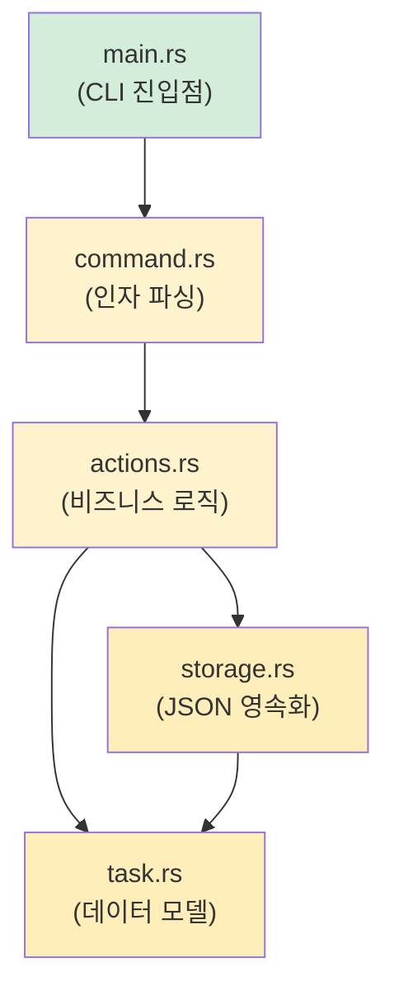

## 캡스톤 프로젝트: CLI 작업 관리자 만들기

> **이 장에서 배울 내용:** Python 개발자라면 보통 `argparse` + `json` + `pathlib`로 만들 법한 완전한 Rust CLI 애플리케이션을 직접 구현하면서, 지금까지 배운 내용을 한 프로젝트에 엮어봅니다.
>
> **난이도:** 🔴 고급

이 캡스톤 프로젝트는 주요 장의 개념을 거의 모두 다시 사용하게 만듭니다.
- **3장**: 타입과 변수(`struct`, enum)
- **5장**: 컬렉션(`Vec`, `HashMap`)
- **6장**: enum과 패턴 매칭(작업 상태, 명령)
- **7장**: 소유권과 대여(참조 전달)
- **9장**: 에러 처리(`Result`, `?`, 커스텀 에러)
- **10장**: 트레잇(`Display`, `FromStr`)
- **11장**: 타입 변환(`From`, `TryFrom`)
- **12장**: 이터레이터와 클로저(필터링, 매핑)
- **8장**: 모듈(구조화된 프로젝트 구성)

***

<a id="the-project-rustdo"></a>
## 프로젝트: `rustdo`

JSON 파일에 작업 목록을 저장하는 명령줄 작업 관리자입니다. Python의 `todo.txt`류 도구를 떠올리면 됩니다.

### Python에서라면 이렇게 쓴다

```python
#!/usr/bin/env python3
"""A simple CLI task manager — the Python version."""
import json
import sys
from pathlib import Path
from datetime import datetime
from enum import Enum

TASK_FILE = Path.home() / ".rustdo.json"

class Priority(Enum):
    LOW = "low"
    MEDIUM = "medium"
    HIGH = "high"

class Task:
    def __init__(self, id: int, title: str, priority: Priority, done: bool = False):
        self.id = id
        self.title = title
        self.priority = priority
        self.done = done
        self.created = datetime.now().isoformat()

def load_tasks() -> list[Task]:
    if not TASK_FILE.exists():
        return []
    data = json.loads(TASK_FILE.read_text())
    return [Task(**t) for t in data]

def save_tasks(tasks: list[Task]):
    TASK_FILE.write_text(json.dumps([t.__dict__ for t in tasks], indent=2))

# Commands: add, list, done, remove, stats
# ... (you know how this goes in Python)
```

### Rust 구현

아래 단계를 순서대로 따라가며 구현해보세요. 각 단계는 앞에서 배운 특정 개념과 직접 연결됩니다.

***

<a id="step-1-define-the-data-model-ch-3-6-10-11"></a>
## 1단계: 데이터 모델 정의하기 (3장, 6장, 10장, 11장)

```rust
// src/task.rs
use std::fmt;
use std::str::FromStr;
use serde::{Deserialize, Serialize};
use chrono::Local;

/// Task priority — maps to Python's Priority(Enum)
#[derive(Debug, Clone, Copy, PartialEq, Eq, Serialize, Deserialize)]
#[serde(rename_all = "lowercase")]
pub enum Priority {
    Low,
    Medium,
    High,
}

// Display trait (Python's __str__)
impl fmt::Display for Priority {
    fn fmt(&self, f: &mut fmt::Formatter<'_>) -> fmt::Result {
        match self {
            Priority::Low => write!(f, "low"),
            Priority::Medium => write!(f, "medium"),
            Priority::High => write!(f, "high"),
        }
    }
}

// FromStr trait (parsing "high" → Priority::High)
impl FromStr for Priority {
    type Err = String;

    fn from_str(s: &str) -> Result<Self, Self::Err> {
        match s.to_lowercase().as_str() {
            "low" | "l" => Ok(Priority::Low),
            "medium" | "med" | "m" => Ok(Priority::Medium),
            "high" | "h" => Ok(Priority::High),
            other => Err(format!("unknown priority: '{other}' (use low/medium/high)")),
        }
    }
}

/// A single task — maps to Python's Task class
#[derive(Debug, Clone, Serialize, Deserialize)]
pub struct Task {
    pub id: u32,
    pub title: String,
    pub priority: Priority,
    pub done: bool,
    pub created: String,
}

impl Task {
    pub fn new(id: u32, title: String, priority: Priority) -> Self {
        Self {
            id,
            title,
            priority,
            done: false,
            created: Local::now().format("%Y-%m-%dT%H:%M:%S").to_string(),
        }
    }
}

impl fmt::Display for Task {
    fn fmt(&self, f: &mut fmt::Formatter<'_>) -> fmt::Result {
        let status = if self.done { "✅" } else { "⬜" };
        let priority_icon = match self.priority {
            Priority::Low => "🟢",
            Priority::Medium => "🟡",
            Priority::High => "🔴",
        };
        write!(f, "{} {} [{}] {} ({})", status, self.id, priority_icon, self.title, self.created)
    }
}
```

> **Python과 비교하면**: Python에서는 `@dataclass`와 `Enum`을 썼겠지만, Rust에서는 `struct` + `enum` + `derive` 매크로 조합으로 직렬화, 표시, 파싱을 매우 깔끔하게 얻을 수 있습니다.

***

## 2단계: 저장소 계층 (9장, 7장)

```rust
// src/storage.rs
use std::fs;
use std::path::PathBuf;
use crate::task::Task;

/// Get the path to the task file (~/.rustdo.json)
fn task_file_path() -> PathBuf {
    let home = dirs::home_dir().expect("Could not determine home directory");
    home.join(".rustdo.json")
}

/// Load tasks from disk — returns empty Vec if file doesn't exist
pub fn load_tasks() -> Result<Vec<Task>, Box<dyn std::error::Error>> {
    let path = task_file_path();
    if !path.exists() {
        return Ok(Vec::new());
    }
    let content = fs::read_to_string(&path)?;  // ? propagates io::Error
    let tasks: Vec<Task> = serde_json::from_str(&content)?;  // ? propagates serde error
    Ok(tasks)
}

/// Save tasks to disk
pub fn save_tasks(tasks: &[Task]) -> Result<(), Box<dyn std::error::Error>> {
    let path = task_file_path();
    let json = serde_json::to_string_pretty(tasks)?;
    fs::write(&path, json)?;
    Ok(())
}
```

> **Python과 비교하면**: Python은 `Path.read_text()` + `json.loads()`를 썼을 것입니다. Rust에서는 `fs::read_to_string()` + `serde_json::from_str()`를 사용합니다. 핵심은 `?`입니다. 모든 에러가 명시적으로 드러나고 전파됩니다.

***

## 3단계: 명령 enum 만들기 (6장)

```rust
// src/command.rs
use crate::task::Priority;

/// All possible commands — one enum variant per action
pub enum Command {
    Add { title: String, priority: Priority },
    List { show_done: bool },
    Done { id: u32 },
    Remove { id: u32 },
    Stats,
    Help,
}

impl Command {
    /// Parse command-line arguments into a Command
    /// (In production, you'd use `clap` — this is educational)
    pub fn parse(args: &[String]) -> Result<Self, String> {
        match args.first().map(|s| s.as_str()) {
            Some("add") => {
                let title = args.get(1)
                    .ok_or("usage: rustdo add <title> [priority]")?
                    .clone();
                let priority = args.get(2)
                    .map(|p| p.parse::<Priority>())
                    .transpose()
                    .map_err(|e| e.to_string())?
                    .unwrap_or(Priority::Medium);
                Ok(Command::Add { title, priority })
            }
            Some("list") => {
                let show_done = args.get(1).map(|s| s == "--all").unwrap_or(false);
                Ok(Command::List { show_done })
            }
            Some("done") => {
                let id: u32 = args.get(1)
                    .ok_or("usage: rustdo done <id>")?
                    .parse()
                    .map_err(|_| "id must be a number")?;
                Ok(Command::Done { id })
            }
            Some("remove") => {
                let id: u32 = args.get(1)
                    .ok_or("usage: rustdo remove <id>")?
                    .parse()
                    .map_err(|_| "id must be a number")?;
                Ok(Command::Remove { id })
            }
            Some("stats") => Ok(Command::Stats),
            _ => Ok(Command::Help),
        }
    }
}
```

> **Python과 비교하면**: Python은 보통 `argparse`나 `click`를 씁니다. 여기서는 직접 만든 파서를 통해, enum과 `match`가 Python의 `if/elif` 체인을 어떻게 대체하는지 보여줍니다. 실제 프로젝트에서는 `clap`를 쓰는 편이 낫습니다.

***

## 4단계: 비즈니스 로직 작성하기 (5장, 12장, 7장)

```rust
// src/actions.rs
use crate::task::{Task, Priority};
use crate::storage;

pub fn add_task(title: String, priority: Priority) -> Result<(), Box<dyn std::error::Error>> {
    let mut tasks = storage::load_tasks()?;
    let next_id = tasks.iter().map(|t| t.id).max().unwrap_or(0) + 1;
    let task = Task::new(next_id, title.clone(), priority);
    println!("Added: {task}");
    tasks.push(task);
    storage::save_tasks(&tasks)?;
    Ok(())
}

pub fn list_tasks(show_done: bool) -> Result<(), Box<dyn std::error::Error>> {
    let tasks = storage::load_tasks()?;
    let filtered: Vec<&Task> = tasks.iter()
        .filter(|t| show_done || !t.done)   // Iterator + closure (Ch. 12)
        .collect();

    if filtered.is_empty() {
        println!("No tasks! 🎉");
        return Ok(());
    }

    for task in &filtered {
        println!("  {task}");   // Uses Display trait (Ch. 10)
    }
    println!("\n{} task(s) shown", filtered.len());
    Ok(())
}

pub fn complete_task(id: u32) -> Result<(), Box<dyn std::error::Error>> {
    let mut tasks = storage::load_tasks()?;
    let task = tasks.iter_mut()
        .find(|t| t.id == id)                // Iterator::find (Ch. 12)
        .ok_or(format!("No task with id {id}"))?;
    task.done = true;
    println!("Completed: {task}");
    storage::save_tasks(&tasks)?;
    Ok(())
}

pub fn remove_task(id: u32) -> Result<(), Box<dyn std::error::Error>> {
    let mut tasks = storage::load_tasks()?;
    let len_before = tasks.len();
    tasks.retain(|t| t.id != id);            // Vec::retain (Ch. 5)
    if tasks.len() == len_before {
        return Err(format!("No task with id {id}").into());
    }
    println!("Removed task {id}");
    storage::save_tasks(&tasks)?;
    Ok(())
}

pub fn show_stats() -> Result<(), Box<dyn std::error::Error>> {
    let tasks = storage::load_tasks()?;
    let total = tasks.len();
    let done = tasks.iter().filter(|t| t.done).count();
    let pending = total - done;

    // Group by priority using iterators (Ch. 12)
    let high = tasks.iter().filter(|t| !t.done && t.priority == Priority::High).count();
    let medium = tasks.iter().filter(|t| !t.done && t.priority == Priority::Medium).count();
    let low = tasks.iter().filter(|t| !t.done && t.priority == Priority::Low).count();

    println!("📊 Task Statistics");
    println!("   Total:   {total}");
    println!("   Done:    {done} ✅");
    println!("   Pending: {pending}");
    println!("   🔴 High:   {high}");
    println!("   🟡 Medium: {medium}");
    println!("   🟢 Low:    {low}");
    Ok(())
}
```

> **여기서 쓰인 핵심 Rust 패턴**: `iter().map().max()`, `iter().filter().collect()`, `iter_mut().find()`, `retain()`, `iter().filter().count()`입니다. Python의 리스트 컴프리헨션, `next(x for x in ...)`, `Counter`가 이 패턴들로 자연스럽게 바뀝니다.

***

## 5단계: 모든 것을 연결하기 (8장)

```rust
// src/main.rs
mod task;
mod storage;
mod command;
mod actions;

use command::Command;

fn main() {
    let args: Vec<String> = std::env::args().skip(1).collect();
    let command = match Command::parse(&args) {
        Ok(cmd) => cmd,
        Err(e) => {
            eprintln!("Error: {e}");
            std::process::exit(1);
        }
    };

    let result = match command {
        Command::Add { title, priority } => actions::add_task(title, priority),
        Command::List { show_done } => actions::list_tasks(show_done),
        Command::Done { id } => actions::complete_task(id),
        Command::Remove { id } => actions::remove_task(id),
        Command::Stats => actions::show_stats(),
        Command::Help => {
            print_help();
            Ok(())
        }
    };

    if let Err(e) = result {
        eprintln!("Error: {e}");
        std::process::exit(1);
    }
}

fn print_help() {
    println!("rustdo — a task manager for Pythonistas learning Rust\n");
    println!("USAGE:");
    println!("  rustdo add <title> [low|medium|high]   Add a task");
    println!("  rustdo list [--all]                    List pending tasks");
    println!("  rustdo done <id>                       Mark task complete");
    println!("  rustdo remove <id>                     Remove a task");
    println!("  rustdo stats                           Show statistics");
}
```



***

## 6단계: `Cargo.toml` 의존성

```toml
[package]
name = "rustdo"
version = "0.1.0"
edition = "2021"

[dependencies]
serde = { version = "1", features = ["derive"] }
serde_json = "1"
chrono = "0.4"
dirs = "5"
```

> **Python과 비교하면**: 이것이 `pyproject.toml`의 `[project.dependencies]`에 해당합니다. `cargo add serde serde_json chrono dirs`는 감각적으로 `pip install`과 비슷합니다.

***

<a id="step-7-tests-ch-14"></a>
## 7단계: 테스트 (14장)

```rust
// src/task.rs — add at the bottom
#[cfg(test)]
mod tests {
    use super::*;

    #[test]
    fn parse_priority() {
        assert_eq!("high".parse::<Priority>().unwrap(), Priority::High);
        assert_eq!("H".parse::<Priority>().unwrap(), Priority::High);
        assert_eq!("med".parse::<Priority>().unwrap(), Priority::Medium);
        assert!("invalid".parse::<Priority>().is_err());
    }

    #[test]
    fn task_display() {
        let task = Task::new(1, "Write Rust".to_string(), Priority::High);
        let display = format!("{task}");
        assert!(display.contains("Write Rust"));
        assert!(display.contains("🔴"));
        assert!(display.contains("⬜")); // Not done yet
    }

    #[test]
    fn task_serialization_roundtrip() {
        let task = Task::new(1, "Test".to_string(), Priority::Low);
        let json = serde_json::to_string(&task).unwrap();
        let recovered: Task = serde_json::from_str(&json).unwrap();
        assert_eq!(recovered.title, "Test");
        assert_eq!(recovered.priority, Priority::Low);
    }
}
```

> **Python과 비교하면**: 이것은 `pytest` 테스트에 해당합니다. `pytest` 대신 `cargo test`로 실행하고, 테스트 발견 마법에 기대지 않고 `#[test]`로 테스트 함수를 명시적으로 표시합니다.

***

## 확장 과제

기본 버전이 동작하면 아래 개선을 시도해보세요.

1. **인자 파싱에 `clap` 도입하기**. 손수 만든 파서를 `clap`의 derive 매크로로 교체할 수 있습니다.
   ```rust
   #[derive(Parser)]
   enum Command {
       Add { title: String, #[arg(default_value = "medium")] priority: Priority },
       List { #[arg(long)] all: bool },
       Done { id: u32 },
       Remove { id: u32 },
       Stats,
   }
   ```

2. **컬러 출력 추가하기**. Python의 `colorama`처럼 `colored` 크레이트를 써서 터미널 출력을 꾸밀 수 있습니다.

3. **마감일 추가하기**. `Option<NaiveDate>` 필드를 넣고 기한이 지난 작업을 필터링해보세요.

4. **태그/카테고리 추가하기**. `Vec<String>`로 태그를 저장하고 `.iter().any()`로 필터링해보세요.

5. **라이브러리 + 바이너리로 분리하기**. `lib.rs` + `main.rs` 구조로 쪼개 로직을 재사용 가능하게 만드세요(8장의 모듈 패턴).

***

## 무엇을 연습했는가

| 장 | 개념 | 이 프로젝트에서 나온 위치 |
|----|------|----------------------------|
| 3장 | 타입과 변수 | `Task` 구조체 필드, `u32`, `String`, `bool` |
| 5장 | 컬렉션 | `Vec<Task>`, `retain()`, `push()` |
| 6장 | enum + `match` | `Priority`, `Command`, exhaustive matching |
| 7장 | 소유권 + 대여 | `&[Task]` vs `Vec<Task>`, 완료 처리용 `&mut` |
| 8장 | 모듈 | `mod task; mod storage; mod command; mod actions;` |
| 9장 | 에러 처리 | `Result<T, E>`, `?` 연산자, `.ok_or()` |
| 10장 | 트레잇 | `Display`, `FromStr`, `Serialize`, `Deserialize` |
| 11장 | From/Into | `Priority`의 `FromStr`, 에러 변환용 `.into()` |
| 12장 | 이터레이터 | `filter`, `map`, `find`, `count`, `collect` |
| 14장 | 테스트 | `#[test]`, `#[cfg(test)]`, assertion 매크로 |

> 🎓 **축하합니다!** 이 프로젝트를 완성했다면, 이 책에서 다룬 거의 모든 핵심 Rust 개념을 실제로 사용해본 셈입니다. 이제 당신은 "Rust를 배우는 Python 개발자"가 아니라, "Python도 아는 Rust 개발자"에 더 가깝습니다.

***
# 17. 캡스톤 프로젝트: CLI 작업 관리자
