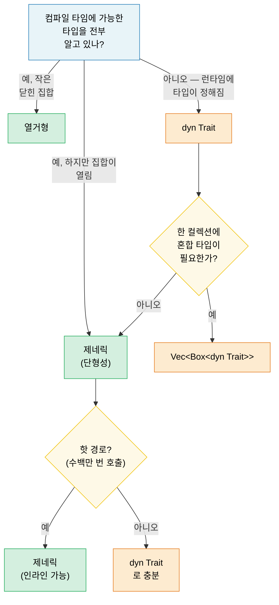

# 1. 제네릭 — 전체 그림 🟢

> **이 장에서 배울 내용:**
> - 단형성화가 제로 코스트 제네릭을 주는 방식과, 코드 팽창을 일으키는 경우
> - 선택 기준: 제네릭 vs 열거형 vs 트레잇 객체
> - 컴파일 타임 배열 크기와 `const fn` 컴파일 타임 평가를 위한 const 제네릭
> - 콜드 경로에서 정적 디스패치를 동적 디스패치로 바꿀 때

<a id="monomorphization-and-zero-cost"></a>
## 단형성화와 제로 코스트

Rust의 제네릭은 **단형성(monomorphize)**됩니다 — 컴파일러가 제네릭 함수마다 사용된 구체 타입별로 전문화된 사본을 생성합니다. Java/C#처럼 런타임에 지워지는 것과 반대입니다.

```rust
fn max_of<T: PartialOrd>(a: T, b: T) -> T {
    if a >= b { a } else { b }
}

fn main() {
    max_of(3_i32, 5_i32);     // 컴파일러가 max_of_i32 생성
    max_of(2.0_f64, 7.0_f64); // 컴파일러가 max_of_f64 생성
    max_of("a", "z");         // 컴파일러가 max_of_str 생성
}
```

**컴파일러가 실제로 만드는 것**(개념적으로):

```rust
// 서로 다른 함수 세 개 — 런타임 디스패치 없음, vtable 없음:
fn max_of_i32(a: i32, b: i32) -> i32 { if a >= b { a } else { b } }
fn max_of_f64(a: f64, b: f64) -> f64 { if a >= b { a } else { b } }
fn max_of_str<'a>(a: &'a str, b: &'a str) -> &'a str { if a >= b { a } else { b } }
```

> **`max_of_str`에는 왜 `<'a>`가 필요하고 `max_of_i32`에는 없나?** `i32`와 `f64`는
> `Copy` 타입이라 함수가 소유 값을 반환합니다. 하지만 `&str`은 참조이므로
> 컴파일러는 반환 참조의 라이프타임을 알아야 합니다. `<'a>` 주석은
> “반환되는 `&str`이 두 입력만큼은 오래 산다”는 뜻입니다.

**장점**: 런타임 비용 제로 — 손으로 쓴 전문화 코드와 동일합니다. 옵티마이저가 각 사본을 인라인·벡터화·전문화할 수 있습니다.

**C++와 비교**: Rust 제네릭은 C++ 템플릿과 비슷하지만 **한 가지 결정적 차이**가 있습니다 — **바운드 검사는 인스턴스화가 아니라 정의 시점**에 일어납니다. C++에서는 특정 타입으로 쓸 때까지 템플릿이 컴파일되지 않아 라이브러리 깊숙이 난해한 에러가 납니다. Rust에서는 `T: PartialOrd`가 함수 정의 시 검사되므로 일찍 잡히고 메시지도 명확합니다.

```rust
// Rust: 정의 지점에서 에러 — "T가 Display를 구현하지 않음"
fn broken<T>(val: T) {
    println!("{val}"); // ❌ Error: T doesn't implement Display
}

// 수정: 바운드 추가
fn fixed<T: std::fmt::Display>(val: T) {
    println!("{val}"); // ✅
}
```

<a id="when-generics-hurt-code-bloat"></a>
### 제네릭이 아플 때: 코드 팽창

단형성화에는 비용이 있습니다 — 바이너리 크기입니다. 고유 인스턴스마다 함수 본문이 복제됩니다:

```rust
// 이런 단순한 함수가...
fn serialize<T: serde::Serialize>(value: &T) -> Vec<u8> {
    serde_json::to_vec(value).unwrap()
}

// ...50가지 타입에 쓰이면 → 바이너리에 사본 50개.
```

**완화 전략**:

```rust
// 1. 비제네릭 핵심 추출("outline" 패턴)
fn serialize<T: serde::Serialize>(value: &T) -> Result<Vec<u8>, serde_json::Error> {
    // 제네릭 부분: 직렬화 호출만
    let json_value = serde_json::to_value(value)?;
    // 비제네릭 부분: 별도 함수로 분리
    serialize_value(json_value)
}

fn serialize_value(value: serde_json::Value) -> Result<Vec<u8>, serde_json::Error> {
    // 이 함수는 바이너리에 딱 한 번만 존재
    serde_json::to_vec(&value)
}

// 2. 인라인이 중요하지 않을 때 트레잇 객체(동적 디스패치) 사용
fn log_item(item: &dyn std::fmt::Display) {
    // 사본 하나 — vtable로 디스패치
    println!("[LOG] {item}");
}
```

> **경험 법칙**: 인라인이 중요한 핫 경로에는 제네릭을 쓰고,
> vtable 호출이 사소한 콜드 경로(에러 처리, 로깅, 설정)에는
> `dyn Trait`를 쓰세요.

<a id="generics-vs-enums-vs-trait-objects-decision-guide"></a>
### 제네릭 vs 열거형 vs 트레잇 객체 — 선택 가이드

Rust에서 “다른 타입, 같은 인터페이스”를 다루는 세 가지 방법:

| 접근 | 디스패치 | 알려지는 시점 | 확장 가능? | 오버헤드 |
|----------|----------|----------|-------------|----------|
| **제네릭** (`impl Trait` / `<T: Trait>`) | 정적(단형성) | 컴파일 타임 | ✅ (열린 집합) | 제로 — 인라인 |
| **열거형** | match 분기 | 컴파일 타임 | ❌ (닫힌 집합) | 제로 — vtable 없음 |
| **트레잇 객체** (`dyn Trait`) | 동적(vtable) | 런타임 | ✅ (열린 집합) | vtable 포인터 + 간접 호출 |

```rust
// --- 제네릭: 열린 집합, 제로 코스트, 컴파일 타임 ---
fn process<H: Handler>(handler: H, request: Request) -> Response {
    handler.handle(request) // 단형성 — H마다 사본 하나
}

// --- 열거형: 닫힌 집합, 제로 코스트, 전수 매칭 ---
enum Shape {
    Circle(f64),
    Rect(f64, f64),
    Triangle(f64, f64, f64),
}

impl Shape {
    fn area(&self) -> f64 {
        match self {
            Shape::Circle(r) => std::f64::consts::PI * r * r,
            Shape::Rect(w, h) => w * h,
            Shape::Triangle(a, b, c) => {
                let s = (a + b + c) / 2.0;
                (s * (s - a) * (s - b) * (s - c)).sqrt()
            }
        }
    }
}
// 변형을 추가하면 모든 match 팔을 갱신해야 함 — 컴파일러가
// 전수성을 강제합니다. "모든 변형을 내가 통제한다"에 적합합니다.

// --- 트레잇 객체: 열린 집합, 런타임 비용, 확장 가능 ---
fn log_all(items: &[Box<dyn std::fmt::Display>]) {
    for item in items {
        println!("{item}"); // vtable 디스패치
    }
}
```

**의사결정 플로차트**:



<a id="const-generics"></a>
### Const 제네릭

Rust 1.51부터 타입과 함수를 타입뿐 아니라 *상수 값*으로도 매개변수화할 수 있습니다:

```rust
// 크기로 매개변수화된 배열 래퍼
struct Matrix<const ROWS: usize, const COLS: usize> {
    data: [[f64; COLS]; ROWS],
}

impl<const ROWS: usize, const COLS: usize> Matrix<ROWS, COLS> {
    fn new() -> Self {
        Matrix { data: [[0.0; COLS]; ROWS] }
    }

    fn transpose(&self) -> Matrix<COLS, ROWS> {
        let mut result = Matrix::<COLS, ROWS>::new();
        for r in 0..ROWS {
            for c in 0..COLS {
                result.data[c][r] = self.data[r][c];
            }
        }
        result
    }
}

// 컴파일러가 차원 일치를 강제:
fn multiply<const M: usize, const N: usize, const P: usize>(
    a: &Matrix<M, N>,
    b: &Matrix<N, P>, // N이 맞아야 함!
) -> Matrix<M, P> {
    let mut result = Matrix::<M, P>::new();
    for i in 0..M {
        for j in 0..P {
            for k in 0..N {
                result.data[i][j] += a.data[i][k] * b.data[k][j];
            }
        }
    }
    result
}

// 사용:
let a = Matrix::<2, 3>::new(); // 2×3
let b = Matrix::<3, 4>::new(); // 3×4
let c = multiply(&a, &b);      // 2×4 ✅

// let d = Matrix::<5, 5>::new();
// multiply(&a, &d); // ❌ 컴파일 에러: Matrix<3, _> 기대, Matrix<5, 5> 받음
```

> **C++ 비교**: C++의 `template<int N>`과 비슷하지만 Rust const 제네릭은
> 이른 타입 검사를 하고 SFINAE 복잡도에 시달리지 않습니다.

<a id="const-functions-const-fn"></a>
### Const 함수(const fn)

`const fn`은 함수를 컴파일 타임에 평가 가능하다고 표시합니다 — C++ `constexpr`에 해당합니다. 결과는 `const`·`static` 맥락에 쓸 수 있습니다:

```rust
// 기본 const fn — const 맥락에서 쓰이면 컴파일 타임에 평가
const fn celsius_to_fahrenheit(c: f64) -> f64 {
    c * 9.0 / 5.0 + 32.0
}

const BOILING_F: f64 = celsius_to_fahrenheit(100.0); // 컴파일 타임 계산
const FREEZING_F: f64 = celsius_to_fahrenheit(0.0);  // 32.0

// Const 생성자 — lazy_static 없이 static 생성!
struct BitMask(u32);

impl BitMask {
    const fn new(bit: u32) -> Self {
        BitMask(1 << bit)
    }

    const fn or(self, other: BitMask) -> Self {
        BitMask(self.0 | other.0)
    }

    const fn contains(&self, bit: u32) -> bool {
        self.0 & (1 << bit) != 0
    }
}

// 정적 룩업 테이블 — 런타임 비용 없음, 지연 초기화 없음
const GPIO_INPUT:  BitMask = BitMask::new(0);
const GPIO_OUTPUT: BitMask = BitMask::new(1);
const GPIO_IRQ:    BitMask = BitMask::new(2);
const GPIO_IO:     BitMask = GPIO_INPUT.or(GPIO_OUTPUT);

// 레지스터 맵을 const 배열로:
const SENSOR_THRESHOLDS: [u16; 4] = {
    let mut table = [0u16; 4];
    table[0] = 50;   // 경고
    table[1] = 70;   // 높음
    table[2] = 85;   // 위험
    table[3] = 100;  // 종료
    table
};
// 테이블 전체가 바이너리에 — 힙 없음, 런타임 초기화 없음.
```

**`const fn`에서 할 수 있는 것**(Rust 1.79+ 기준):
- 산술, 비트 연산, 비교
- `if`/`else`, `match`, `loop`, `while` (제어 흐름)
- 지역 변수 생성·수정 (`let mut`)
- 다른 `const fn` 호출
- 참조 (`&`, `&mut` — const 맥락 안에서)
- `panic!()` (컴파일 타임에 도달하면 컴파일 에러)

**아직 할 수 없는 것**:
- 힙 할당 (`Box`, `Vec`, `String`)
- 트레잇 메서드 호출(고유 메서드만)
- 일부 맥락의 부동소수(기본 연산은 안정화됨)
- I/O나 부수 효과

```rust
// panic이 있는 const fn — 컴파일 타임 에러가 됨:
const fn checked_div(a: u32, b: u32) -> u32 {
    if b == 0 {
        panic!("division by zero"); // b가 const 시간에 0이면 컴파일 에러
    }
    a / b
}

const RESULT: u32 = checked_div(100, 4);  // ✅ 25
// const BAD: u32 = checked_div(100, 0);  // ❌ 컴파일 에러: "division by zero"
```

> **C++ 비교**: `const fn`은 Rust의 `constexpr`입니다. 핵심 차이:
> Rust 버전은 옵트인이고 컴파일러가 const 호환 연산만 쓰였는지 엄격히 검증합니다.
> C++에서는 `constexpr` 함수가 조용히 런타임 평가로 떨어질 수 있지만 — Rust에서는 `const` 맥락이
> *반드시* 컴파일 타임 평가이거나 하드 에러입니다.

> **실무 조언**: 생성자와 단순 유틸은 가능하면 `const fn`으로 — 비용 없이 호출부가 const 맥락에서 쓸 수 있습니다. 하드웨어 진단 코드에서는 레지스터 정의, 비트마스크, 임계값 테이블에 이상적입니다.

> **핵심 정리 — 제네릭**
> - 단형성화는 제로 코스트 추상화를 주지만 코드 팽창을 일으킬 수 있음 — 콜드 경로에는 `dyn Trait`
> - Const 제네릭(`[T; N]`)은 C++ 템플릿 트릭 대신 컴파일 타임에 검사되는 배열 크기
> - `const fn`은 컴파일 타임에 계산 가능한 값에 대해 `lazy_static!`를 없앰

> **더 보기:** 트레잇 바운드, 연관 타입, 트레잇 객체는 [2장 — 트레잇 심화](ch02-traits-in-depth.md). 제로 크기 제네릭 마커는 [4장 — PhantomData](ch04-phantomdata-types-that-carry-no-data.md).

---

<a id="exercise-generic-cache-with-eviction"></a>
### 연습: 제거 정책이 있는 제네릭 캐시 ★★ (~30분)

설정 가능한 최대 용량으로 키-값을 저장하는 제네릭 `Cache<K, V>`를 만드세요. 가득 차면 가장 오래된 항목이 제거됩니다(FIFO). 요구사항:

- `fn new(capacity: usize) -> Self`
- `fn insert(&mut self, key: K, value: V)` — 용량이 차면 가장 오래된 항목 제거
- `fn get(&self, key: &K) -> Option<&V>`
- `fn len(&self) -> usize`
- `K: Eq + Hash + Clone` 제약

<details>
<summary>🔑 해답</summary>

```rust
use std::collections::{HashMap, VecDeque};
use std::hash::Hash;

struct Cache<K, V> {
    map: HashMap<K, V>,
    order: VecDeque<K>,
    capacity: usize,
}

impl<K: Eq + Hash + Clone, V> Cache<K, V> {
    fn new(capacity: usize) -> Self {
        Cache {
            map: HashMap::with_capacity(capacity),
            order: VecDeque::with_capacity(capacity),
            capacity,
        }
    }

    fn insert(&mut self, key: K, value: V) {
        if self.map.contains_key(&key) {
            self.map.insert(key, value);
            return;
        }
        if self.map.len() >= self.capacity {
            if let Some(oldest) = self.order.pop_front() {
                self.map.remove(&oldest);
            }
        }
        self.order.push_back(key.clone());
        self.map.insert(key, value);
    }

    fn get(&self, key: &K) -> Option<&V> {
        self.map.get(key)
    }

    fn len(&self) -> usize {
        self.map.len()
    }
}

fn main() {
    let mut cache = Cache::new(3);
    cache.insert("a", 1);
    cache.insert("b", 2);
    cache.insert("c", 3);
    assert_eq!(cache.len(), 3);

    cache.insert("d", 4); // "a" 제거
    assert_eq!(cache.get(&"a"), None);
    assert_eq!(cache.get(&"d"), Some(&4));
    println!("Cache works! len = {}", cache.len());
}
```

</details>

***
