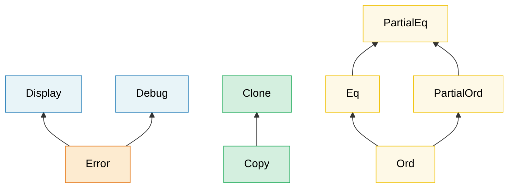

# 2. 트레잇 심화 🟡

> **이 장에서 배울 내용:**
> - 연관 타입 vs 제네릭 매개변수 — 각각 언제 쓰는지
> - GAT, blanket 구현, 마커 트레잇, 트레잇 객체 안전 규칙
> - vtable과 fat pointer의 내부 동작
> - 확장 트레잇, 열거형 디스패치, 타입이 지정된 커맨드 패턴

<a id="associated-types-vs-generic-parameters"></a>
## 연관 타입 vs 제네릭 매개변수

둘 다 트레잇이 여러 타입과 함께 동작하게 하지만, 목적이 다릅니다:

```rust
// --- ASSOCIATED TYPE: One implementation per type ---
trait Iterator {
    type Item; // Each iterator produces exactly ONE kind of item

    fn next(&mut self) -> Option<Self::Item>;
}

// A custom iterator that always yields i32 — there's no choice
struct Counter { max: i32, current: i32 }

impl Iterator for Counter {
    type Item = i32; // Exactly one Item type per implementation
    fn next(&mut self) -> Option<i32> {
        if self.current < self.max {
            self.current += 1;
            Some(self.current)
        } else {
            None
        }
    }
}

// --- GENERIC PARAMETER: Multiple implementations per type ---
trait Convert<T> {
    fn convert(&self) -> T;
}

// A single type can implement Convert for MANY target types:
impl Convert<f64> for i32 {
    fn convert(&self) -> f64 { *self as f64 }
}
impl Convert<String> for i32 {
    fn convert(&self) -> String { self.to_string() }
}
```

**어느 쪽을 쓸지**:

| 용도 | 언제 |
|-----|------|
| **연관 타입** | 구현 타입마다 자연스러운 출력/결과가 정확히 **하나**일 때. `Iterator::Item`, `Deref::Target`, `Add::Output` |
| **제네릭 매개변수** | 한 타입이 트레잇을 **여러** 대상 타입에 대해 의미 있게 구현할 수 있을 때. `From<T>`, `AsRef<T>`, `PartialEq<Rhs>` |

**직관**: “이 이터레이터의 `Item`은 무엇인가?”가 자연스러우면 연관 타입. “`f64`로 변환할 수 있나? `String`으로? `bool`로?”가 자연스러우면 제네릭 매개변수입니다.

```rust
// Real-world example: std::ops::Add
trait Add<Rhs = Self> {
    type Output; // Associated type — addition has ONE result type
    fn add(self, rhs: Rhs) -> Self::Output;
}

// Rhs is a generic parameter — you can add different types to Meters:
struct Meters(f64);
struct Centimeters(f64);

impl Add<Meters> for Meters {
    type Output = Meters;
    fn add(self, rhs: Meters) -> Meters { Meters(self.0 + rhs.0) }
}
impl Add<Centimeters> for Meters {
    type Output = Meters;
    fn add(self, rhs: Centimeters) -> Meters { Meters(self.0 + rhs.0 / 100.0) }
}
```

<a id="generic-associated-types-gats"></a>
### 제네릭 연관 타입(GAT)

Rust 1.65부터 연관 타입에도 자체 제네릭 매개변수를 둘 수 있습니다.
이를 통해 **대여(lending) 이터레이터** — 반환 참조가 컬렉션이 아니라
이터레이터 자체에 묶인 이터레이터 — 를 표현할 수 있습니다:

```rust
// Without GATs — impossible to express a lending iterator:
// trait LendingIterator {
//     type Item<'a>;  // ← This was rejected before 1.65
// }

// With GATs (Rust 1.65+):
// Note: This is a custom trait, distinct from std::iter::Iterator.
// In real code, name it `LendingIterator` to avoid confusion with the
// standard `Iterator` trait.
trait LendingIterator {
    type Item<'a> where Self: 'a;

    fn next(&mut self) -> Option<Self::Item<'_>>;
}

// Example: an iterator that yields overlapping windows
struct WindowIter<'data> {
    data: &'data [u8],
    pos: usize,
    window_size: usize,
}

impl<'data> LendingIterator for WindowIter<'data> {
    type Item<'a> = &'a [u8] where Self: 'a;

    fn next(&mut self) -> Option<&[u8]> {
        if self.pos + self.window_size <= self.data.len() {
            let window = &self.data[self.pos..self.pos + self.window_size];
            self.pos += 1;
            Some(window)
        } else {
            None
        }
    }
}
```

> **GAT이 필요한 경우**: 대여 이터레이터, 스트리밍 파서, 연관 타입의 라이프타임이 `&self` 빌림에 의존하는 트레잇.
> 대부분의 코드에서는 단순 연관 타입으로 충분합니다.

<a id="supertraits-and-trait-hierarchies"></a>
### 슈퍼트레잇과 트레잇 계층

트레잇은 다른 트레잇을 전제 조건으로 요구해 계층을 만들 수 있습니다:



> 화살표는 서브트레잇 → 슈퍼트레잇 방향입니다: `Error`를 구현하려면 `Display` + `Debug`가 필요합니다.

구현자가 다른 트레잇도 함께 구현하도록 요구할 수 있습니다:

```rust
use std::fmt;

// Display is a supertrait of Error
trait Error: fmt::Display + fmt::Debug {
    fn source(&self) -> Option<&(dyn Error + 'static)> { None }
}
// Any type implementing Error MUST also implement Display and Debug

// Build your own hierarchies:
trait Identifiable {
    fn id(&self) -> u64;
}

trait Timestamped {
    fn created_at(&self) -> chrono::DateTime<chrono::Utc>;
}

// Entity requires both:
trait Entity: Identifiable + Timestamped {
    fn is_active(&self) -> bool;
}

// Implementing Entity forces you to implement all three:
struct User { id: u64, name: String, created: chrono::DateTime<chrono::Utc> }

impl Identifiable for User {
    fn id(&self) -> u64 { self.id }
}
impl Timestamped for User {
    fn created_at(&self) -> chrono::DateTime<chrono::Utc> { self.created }
}
impl Entity for User {
    fn is_active(&self) -> bool { true }
}
```

<a id="blanket-implementations"></a>
### Blanket 구현

어떤 바운드를 만족하는 **모든** 타입에 대해 트레잇을 구현합니다:

```rust
// std does this: any type that implements Display automatically gets ToString
impl<T: fmt::Display> ToString for T {
    fn to_string(&self) -> String {
        format!("{self}")
    }
}
// Now i32, &str, your custom types — anything with Display — gets to_string() for free.

// Your own blanket impl:
trait Loggable {
    fn log(&self);
}

// Every Debug type is automatically Loggable:
impl<T: std::fmt::Debug> Loggable for T {
    fn log(&self) {
        eprintln!("[LOG] {self:?}");
    }
}

// Now ANY Debug type has .log():
// 42.log();              // [LOG] 42
// "hello".log();         // [LOG] "hello"
// vec![1, 2, 3].log();   // [LOG] [1, 2, 3]
```

> **주의**: Blanket 구현은 강력하지만 되돌리기 어렵습니다 — blanket으로 이미 덮인 타입에
> 더 구체적인 구현을 추가할 수 없습니다(고아 규칙 + 일관성). 신중히 설계하세요.

<a id="marker-traits"></a>
### 마커 트레잇

메서드가 없는 트레잇 — 타입이 어떤 성질을 갖는다고 표시합니다:

```rust
// Standard library marker traits:
// Send    — safe to transfer between threads
// Sync    — safe to share (&T) between threads
// Unpin   — safe to move after pinning
// Sized   — has a known size at compile time
// Copy    — can be duplicated with memcpy

// Your own marker trait:
/// Marker: this sensor has been factory-calibrated
trait Calibrated {}

struct RawSensor { reading: f64 }
struct CalibratedSensor { reading: f64 }

impl Calibrated for CalibratedSensor {}

// Only calibrated sensors can be used in production:
fn record_measurement<S: Calibrated>(sensor: &S) {
    // ...
}
// record_measurement(&RawSensor { reading: 0.0 }); // ❌ Compile error
// record_measurement(&CalibratedSensor { reading: 0.0 }); // ✅
```

이것은 3장의 **타입 상태 패턴**과 직결됩니다.

<a id="trait-object-safety-rules"></a>
### 트레잇 객체 안전 규칙

모든 트레잇이 `dyn Trait`로 쓸 수 있는 것은 아닙니다. 트레잇이 **객체 안전(object-safe)**하려면 다음을 만족해야 합니다:

1. **No `Self: Sized` bound** on the trait itself
2. **No generic type parameters** on methods
3. **No use of `Self` in return position** (except via indirection like `Box<Self>`)
4. **No associated functions** (methods must have `&self`, `&mut self`, or `self`)

```rust
// ✅ Object-safe — can be used as dyn Drawable
trait Drawable {
    fn draw(&self);
    fn bounding_box(&self) -> (f64, f64, f64, f64);
}

let shapes: Vec<Box<dyn Drawable>> = vec![/* ... */]; // ✅ Works

// ❌ NOT object-safe — uses Self in return position
trait Clonable {
    fn clone_self(&self) -> Self;
    //                       ^^^^ Can't know the concrete size at runtime
}
// let items: Vec<Box<dyn Clonable>> = ...; // ❌ Compile error

// ❌ NOT object-safe — generic method
trait Converter {
    fn convert<T>(&self) -> T;
    //        ^^^ The vtable can't contain infinite monomorphizations
}

// ❌ NOT object-safe — associated function (no self)
trait Factory {
    fn create() -> Self;
    // No &self — how would you call this through a trait object?
}
```

**우회 방법**:

```rust
// Add `where Self: Sized` to exclude a method from the vtable:
trait MyTrait {
    fn regular_method(&self); // Included in vtable

    fn generic_method<T>(&self) -> T
    where
        Self: Sized; // Excluded from vtable — can't be called via dyn MyTrait
}

// Now dyn MyTrait is valid, but generic_method can only be called
// when the concrete type is known.
```

> **경험 법칙**: `dyn Trait`를 쓸 계획이면 메서드를 단순하게 —
> 제네릭 없음, 반환 타입에 `Self` 없음, `Sized` 바운드 없음. 의심하면
> `let _: Box<dyn YourTrait>;`를 시도해 컴파일러가 알려주게 하세요.

<a id="trait-objects-under-the-hood-vtables-and-fat-pointers"></a>
### 트레잇 객체의 내부 — vtable과 fat pointer

`&dyn Trait`(또는 `Box<dyn Trait>`)은 **fat pointer** — 머신 워드 두 개입니다:

```text
┌──────────────────────────────────────────────────┐
│  &dyn Drawable (on 64-bit: 16 bytes total)       │
├──────────────┬───────────────────────────────────┤
│  data_ptr    │  vtable_ptr                       │
│  (8 bytes)   │  (8 bytes)                        │
│  ↓           │  ↓                                │
│  ┌─────────┐ │  ┌──────────────────────────────┐ │
│  │ Circle  │ │  │ vtable for <Circle as        │ │
│  │ {       │ │  │           Drawable>           │ │
│  │  r: 5.0 │ │  │                              │ │
│  │ }       │ │  │  drop_in_place: 0x7f...a0    │ │
│  └─────────┘ │  │  size:           8            │ │
│              │  │  align:          8            │ │
│              │  │  draw:          0x7f...b4     │ │
│              │  │  bounding_box:  0x7f...c8     │ │
│              │  └──────────────────────────────┘ │
└──────────────┴───────────────────────────────────┘
```

**vtable 호출의 동작**(예: `shape.draw()`):

1. fat pointer에서 `vtable_ptr` 로드(두 번째 워드)
2. vtable을 인덱싱해 `draw` 함수 포인터 찾기
3. 호출하며 `data_ptr`을 `self` 인자로 전달

비용은 C++ 가상 디스패치와 비슷합니다(호출당 포인터 간접 참조 한 번). 다만 Rust는
vtable 포인터를 객체 안이 아니라 fat pointer에 넣습니다 — 따라서 스택의 `Circle`만으로는
vtable 포인터가 전혀 없습니다.

```rust
trait Drawable {
    fn draw(&self);
    fn area(&self) -> f64;
}

struct Circle { radius: f64 }

impl Drawable for Circle {
    fn draw(&self) { println!("Drawing circle r={}", self.radius); }
    fn area(&self) -> f64 { std::f64::consts::PI * self.radius * self.radius }
}

struct Square { side: f64 }

impl Drawable for Square {
    fn draw(&self) { println!("Drawing square s={}", self.side); }
    fn area(&self) -> f64 { self.side * self.side }
}

fn main() {
    let shapes: Vec<Box<dyn Drawable>> = vec![
        Box::new(Circle { radius: 5.0 }),
        Box::new(Square { side: 3.0 }),
    ];

    // Each element is a fat pointer: (data_ptr, vtable_ptr)
    // The vtable for Circle and Square are DIFFERENT
    for shape in &shapes {
        shape.draw();  // vtable dispatch → Circle::draw or Square::draw
        println!("  area = {:.2}", shape.area());
    }

    // Size comparison:
    println!("size_of::<&Circle>()        = {}", std::mem::size_of::<&Circle>());
    // → 8 bytes (one pointer — the compiler knows the type)
    println!("size_of::<&dyn Drawable>()  = {}", std::mem::size_of::<&dyn Drawable>());
    // → 16 bytes (data_ptr + vtable_ptr)
}
```

**성능 비용 모델**:

| 측면 | 정적 디스패치 (`impl Trait` / 제네릭) | 동적 디스패치 (`dyn Trait`) |
|--------|------------------------------------------|-------------------------------|
| 호출 오버헤드 | 제로 — LLVM이 인라인 | 호출당 포인터 간접 참조 한 번 |
| 인라인 | ✅ 컴파일러가 인라인 가능 | ❌ 불투명한 함수 포인터 |
| 바이너리 크기 | 큼(타입마다 사본) | 작음(공유 함수) |
| 포인터 크기 | thin(1워드) | fat(2워드) |
| 이질 컬렉션 | ❌ | ✅ `Vec<Box<dyn Trait>>` |

> **vtable 비용이 중요한 경우**: 트레잇 메서드를 수백만 번 부르는 타이트 루프에서는
> 간접 참조와 인라인 불가가 2–10배 느려질 수 있습니다. 콜드 경로, 설정, 플러그인 아키텍처에서는
> `dyn Trait`의 유연성이 작은 비용을 감수할 만합니다.

<a id="higher-ranked-trait-bounds-hrtbs"></a>
### 상위 순위 트레잇 바운드(HRTB)

특정 라이프타임이 아니라 *임의의* 라이프타임에 대한 참조를 다루는 함수가 필요할 때 `for<'a>` 구문이 등장합니다:

```rust
// Problem: this function needs a closure that can process
// references with ANY lifetime, not just one specific lifetime.

// ❌ This is too restrictive — 'a is fixed by the caller:
// fn apply<'a, F: Fn(&'a str) -> &'a str>(f: F, data: &'a str) -> &'a str

// ✅ HRTB: F must work for ALL possible lifetimes:
fn apply<F>(f: F, data: &str) -> &str
where
    F: for<'a> Fn(&'a str) -> &'a str,
{
    f(data)
}

fn main() {
    let result = apply(|s| s.trim(), "  hello  ");
    println!("{result}"); // "hello"
}
```

**HRTB를 마주치는 경우**:
- `Fn(&T) -> &U` 계열 트레잇 — 대부분 컴파일러가 `for<'a>`를 자동 추론
- 서로 다른 빌림에 걸쳐 동작해야 하는 커스텀 트레잇 구현
- `serde` 역직렬화: `for<'de> Deserialize<'de>`

```rust,ignore
// serde's DeserializeOwned is defined as:
// trait DeserializeOwned: for<'de> Deserialize<'de> {}
// Meaning: "can be deserialized from data with ANY lifetime"
// (i.e., the result doesn't borrow from the input)

use serde::de::DeserializeOwned;

fn parse_json<T: DeserializeOwned>(input: &str) -> T {
    serde_json::from_str(input).unwrap()
}
```

> **실무 조언**: 직접 `for<'a>`를 쓸 일은 드뭅니다. 대부분 클로저 매개변수의 트레잇 바운드에 나타나며
> 컴파일러가 암시적으로 처리합니다. 다만 에러 메시지에서 (`expected a `for<'a> Fn(&'a ...)` bound` 등)
> 알아보면 컴파일러가 요구하는 것을 이해하는 데 도움이 됩니다.

<a id="impl-trait-argument-position-vs-return-position"></a>
### `impl Trait` — 인자 위치 vs 반환 위치

`impl Trait`는 **의미가 다른** 두 위치에 나타납니다:

```rust
// --- Argument-Position impl Trait (APIT) ---
// "Caller chooses the type" — syntactic sugar for a generic parameter
fn print_all(items: impl Iterator<Item = i32>) {
    for item in items { println!("{item}"); }
}
// Equivalent to:
fn print_all_verbose<I: Iterator<Item = i32>>(items: I) {
    for item in items { println!("{item}"); }
}
// Caller decides: print_all(vec![1,2,3].into_iter())
//                 print_all(0..10)

// --- Return-Position impl Trait (RPIT) ---
// "Callee chooses the type" — the function picks one concrete type
fn evens(limit: i32) -> impl Iterator<Item = i32> {
    (0..limit).filter(|x| x % 2 == 0)
    // The concrete type is Filter<Range<i32>, Closure>
    // but the caller only sees "some Iterator<Item = i32>"
}
```

**핵심 차이**:

| | APIT (`fn foo(x: impl T)`) | RPIT (`fn foo() -> impl T`) |
|---|---|---|
| 타입을 고르는 주체 | 호출자 | 피호출자(함수 본문) |
| 단형성? | 예 — 타입마다 사본 하나 | 예 — 구체 타입 하나 |
| 터보피시? | 아니오 (`foo::<X>()` 불가) | 해당 없음 |
| 동등 표현 | `fn foo<X: T>(x: X)` | 존재 타입(existential type) |

#### 트레잇 정의의 RPIT(RPITIT)

Rust 1.75부터 트레잇 정의에 `-> impl Trait`를 직접 쓸 수 있습니다:

```rust
trait Container {
    fn items(&self) -> impl Iterator<Item = &str>;
    //                 ^^^^ Each implementor returns its own concrete type
}

struct CsvRow {
    fields: Vec<String>,
}

impl Container for CsvRow {
    fn items(&self) -> impl Iterator<Item = &str> {
        self.fields.iter().map(String::as_str)
    }
}

struct FixedFields;

impl Container for FixedFields {
    fn items(&self) -> impl Iterator<Item = &str> {
        ["host", "port", "timeout"].into_iter()
    }
}
```

> **Rust 1.75 이전**에는 트레잇에서 이를 이루려면 `Box<dyn Iterator>`나 연관 타입이 필요했습니다.
> RPITIT은 할당을 없앱니다.

#### `impl Trait` vs `dyn Trait` — 선택 가이드

```text
컴파일 타임에 구체 타입을 아는가?
├── 예 → impl Trait 또는 제네릭(제로 코스트, 인라인 가능)
└── 아니오 → 이질 컬렉션이 필요한가?
     ├── 예 → dyn Trait (Box<dyn T>, &dyn T)
     └── 아니오 → API 경계에서 동일한 트레잇 객체가 필요한가?
          ├── 예 → dyn Trait
          └── 아니오 → 제네릭 / impl Trait
```

| 특징 | `impl Trait` | `dyn Trait` |
|---------|-------------|------------|
| 디스패치 | 정적(단형성) | 동적(vtable) |
| 성능 | 최선 — 인라인 가능 | 호출당 간접 참조 한 번 |
| 이질 컬렉션 | ❌ | ✅ |
| 타입당 바이너리 | 사본 각각 | 공유 코드 |
| 트레잇이 객체 안전해야 하나? | 아니오 | 예 |
| 트레잇 정의에서 동작 | ✅ (Rust 1.75+) | 항상 |

***

<a id="type-erasure-with-any-and-typeid"></a>
## `Any`와 `TypeId`로 타입 지우기

*알 수 없는* 타입의 값을 저장했다가 나중에 다운캐스트해야 할 때가 있습니다 — C의 `void*`나 C#의 `object`에 익숙한 패턴입니다. Rust는 `std::any::Any`로 이를 제공합니다:

```rust
use std::any::Any;

// Store heterogeneous values:
fn log_value(value: &dyn Any) {
    if let Some(s) = value.downcast_ref::<String>() {
        println!("String: {s}");
    } else if let Some(n) = value.downcast_ref::<i32>() {
        println!("i32: {n}");
    } else {
        // TypeId lets you inspect the type at runtime:
        println!("Unknown type: {:?}", value.type_id());
    }
}

// Useful for plugin systems, event buses, or ECS-style architectures:
struct AnyMap(std::collections::HashMap<std::any::TypeId, Box<dyn Any + Send>>);

impl AnyMap {
    fn new() -> Self { AnyMap(std::collections::HashMap::new()) }

    fn insert<T: Any + Send + 'static>(&mut self, value: T) {
        self.0.insert(std::any::TypeId::of::<T>(), Box::new(value));
    }

    fn get<T: Any + Send + 'static>(&self) -> Option<&T> {
        self.0.get(&std::any::TypeId::of::<T>())?
            .downcast_ref()
    }
}

fn main() {
    let mut map = AnyMap::new();
    map.insert(42_i32);
    map.insert(String::from("hello"));

    assert_eq!(map.get::<i32>(), Some(&42));
    assert_eq!(map.get::<String>().map(|s| s.as_str()), Some("hello"));
    assert_eq!(map.get::<f64>(), None); // Never inserted
}
```

> **`Any`를 쓸 때**: 플러그인/확장 시스템, 타입 인덱스 맵(`typemap`),
> 에러 다운캐스트(`anyhow::Error::downcast_ref`). 컴파일 타임에 타입 집합을 알면
> 제네릭이나 트레잇 객체를 선호하세요 — `Any`는 컴파일 타임 안전을 유연성과 바꾸는 최후 수단입니다.

***

<a id="extension-traits-adding-methods-to-types-you-dont-own"></a>
## 확장 트레잇 — 내가 소유하지 않은 타입에 메서드 추가

Rust의 고아 규칙은 외부 트레잇을 외부 타입에 구현하는 것을 막습니다.
확장 트레잇은 일반적인 우회: 크레이트에 **새 트레잇**을 정의하고, 바운드를 만족하는
임의 타입에 대해 blanket으로 메서드를 구현합니다. 호출자가 트레잇을 임포트하면
기존 타입에 새 메서드가 붙습니다.

이 패턴은 Rust 생태계에 널리 퍼져 있습니다: `itertools::Itertools`, `futures::StreamExt`,
`tokio::io::AsyncReadExt`, `tower::ServiceExt`.

### 문제

```rust
// We want to add a .mean() method to all iterators that yield f64.
// But Iterator is defined in std and f64 is a primitive — orphan rule prevents:
//
// impl<I: Iterator<Item = f64>> I {   // ❌ Cannot add inherent methods to a foreign type
//     fn mean(self) -> f64 { ... }
// }
```

### 해결: 확장 트레잇

```rust
/// Extension methods for iterators over numeric values.
pub trait IteratorExt: Iterator {
    /// Computes the arithmetic mean. Returns `None` for empty iterators.
    fn mean(self) -> Option<f64>
    where
        Self: Sized,
        Self::Item: Into<f64>;
}

// Blanket implementation — automatically applies to ALL iterators
impl<I: Iterator> IteratorExt for I {
    fn mean(self) -> Option<f64>
    where
        Self: Sized,
        Self::Item: Into<f64>,
    {
        let mut sum: f64 = 0.0;
        let mut count: u64 = 0;
        for item in self {
            sum += item.into();
            count += 1;
        }
        if count == 0 { None } else { Some(sum / count as f64) }
    }
}

// Usage — just import the trait:
use crate::IteratorExt;  // One import and the method appears on all iterators

fn analyze_temperatures(readings: &[f64]) -> Option<f64> {
    readings.iter().copied().mean()  // .mean() is now available!
}

fn analyze_sensor_data(data: &[i32]) -> Option<f64> {
    data.iter().copied().mean()  // Works on i32 too (i32: Into<f64>)
}
```

### 실전 예: 진단 결과 확장

```rust
use std::collections::HashMap;

struct DiagResult {
    component: String,
    passed: bool,
    message: String,
}

/// Extension trait for Vec<DiagResult> — adds domain-specific analysis methods.
pub trait DiagResultsExt {
    fn passed_count(&self) -> usize;
    fn failed_count(&self) -> usize;
    fn overall_pass(&self) -> bool;
    fn failures_by_component(&self) -> HashMap<String, Vec<&DiagResult>>;
}

impl DiagResultsExt for Vec<DiagResult> {
    fn passed_count(&self) -> usize {
        self.iter().filter(|r| r.passed).count()
    }

    fn failed_count(&self) -> usize {
        self.iter().filter(|r| !r.passed).count()
    }

    fn overall_pass(&self) -> bool {
        self.iter().all(|r| r.passed)
    }

    fn failures_by_component(&self) -> HashMap<String, Vec<&DiagResult>> {
        let mut map = HashMap::new();
        for r in self.iter().filter(|r| !r.passed) {
            map.entry(r.component.clone()).or_default().push(r);
        }
        map
    }
}

// Now any Vec<DiagResult> has these methods:
fn report(results: Vec<DiagResult>) {
    if !results.overall_pass() {
        let failures = results.failures_by_component();
        for (component, fails) in &failures {
            eprintln!("{component}: {} failures", fails.len());
        }
    }
}
```

### 이름 짓기 규칙

Rust 생태계는 `Ext` 접미사를 일관되게 씁니다:

| 크레이트 | 확장 트레잇 | 확장 대상 |
|-------|----------------|---------|
| `itertools` | `Itertools` | `Iterator` |
| `futures` | `StreamExt`, `FutureExt` | `Stream`, `Future` |
| `tokio` | `AsyncReadExt`, `AsyncWriteExt` | `AsyncRead`, `AsyncWrite` |
| `tower` | `ServiceExt` | `Service` |
| `bytes` | `BufMut` (partial) | `&mut [u8]` |
| Your crate | `DiagResultsExt` | `Vec<DiagResult>` |

### 언제 쓸지

| 상황 | 확장 트레잇? |
|-----------|:---:|
| 외부 타입에 편의 메서드 추가 | ✅ |
| 제네릭 컬렉션에 도메인 로직 묶기 | ✅ |
| 메서드가 비공개 필드에 접근해야 함 | ❌ (래퍼/뉴타입 사용) |
| 메서드가 논리적으로 내가 쓰는 새 타입에 붙어야 함 | ❌ (고유 메서드로 추가) |
| 임포트 없이 메서드를 쓰고 싶음 | ❌ (고유 메서드만 가능) |

***

<a id="enum-dispatch-static-polymorphism-without-dyn"></a>
## 열거형 디스패치 — `dyn` 없는 정적 다형성

트레잇을 구현하는 타입이 **닫힌 집합**이면 `dyn Trait` 대신
구체 타입을 담는 열거형으로 바꿀 수 있습니다. 호출자에게 동일한 인터페이스를 유지하면서
vtable 간접 참조와 힙 할당을 없앱니다.

### `dyn Trait`의 문제

```rust
trait Sensor {
    fn read(&self) -> f64;
    fn name(&self) -> &str;
}

struct Gps { lat: f64, lon: f64 }
struct Thermometer { temp_c: f64 }
struct Accelerometer { g_force: f64 }

impl Sensor for Gps {
    fn read(&self) -> f64 { self.lat }
    fn name(&self) -> &str { "GPS" }
}
impl Sensor for Thermometer {
    fn read(&self) -> f64 { self.temp_c }
    fn name(&self) -> &str { "Thermometer" }
}
impl Sensor for Accelerometer {
    fn read(&self) -> f64 { self.g_force }
    fn name(&self) -> &str { "Accelerometer" }
}

// dyn으로 이질 컬렉션 — 동작하지만 비용이 있음:
fn read_all_dyn(sensors: &[Box<dyn Sensor>]) -> Vec<f64> {
    sensors.iter().map(|s| s.read()).collect()
    // Each .read() goes through a vtable indirection
    // Each Box allocates on the heap
}
```

### 열거형 디스패치 해결책

```rust
// Replace the trait object with an enum:
enum AnySensor {
    Gps(Gps),
    Thermometer(Thermometer),
    Accelerometer(Accelerometer),
}

impl AnySensor {
    fn read(&self) -> f64 {
        match self {
            AnySensor::Gps(s) => s.read(),
            AnySensor::Thermometer(s) => s.read(),
            AnySensor::Accelerometer(s) => s.read(),
        }
    }

    fn name(&self) -> &str {
        match self {
            AnySensor::Gps(s) => s.name(),
            AnySensor::Thermometer(s) => s.name(),
            AnySensor::Accelerometer(s) => s.name(),
        }
    }
}

// Now: no heap allocation, no vtable, stored inline
fn read_all(sensors: &[AnySensor]) -> Vec<f64> {
    sensors.iter().map(|s| s.read()).collect()
    // Each .read() is a match branch — compiler can inline everything
}

fn main() {
    let sensors = vec![
        AnySensor::Gps(Gps { lat: 47.6, lon: -122.3 }),
        AnySensor::Thermometer(Thermometer { temp_c: 72.5 }),
        AnySensor::Accelerometer(Accelerometer { g_force: 1.02 }),
    ];

    for sensor in &sensors {
        println!("{}: {:.2}", sensor.name(), sensor.read());
    }
}
```

### 열거형에 원래 트레잇 구현

상호 운용을 위해 열거형 자체에 원래 트레잇을 구현할 수 있습니다:

```rust
impl Sensor for AnySensor {
    fn read(&self) -> f64 {
        match self {
            AnySensor::Gps(s) => s.read(),
            AnySensor::Thermometer(s) => s.read(),
            AnySensor::Accelerometer(s) => s.read(),
        }
    }

    fn name(&self) -> &str {
        match self {
            AnySensor::Gps(s) => s.name(),
            AnySensor::Thermometer(s) => s.name(),
            AnySensor::Accelerometer(s) => s.name(),
        }
    }
}

// Now AnySensor works anywhere a Sensor is expected via generics:
fn report<S: Sensor>(s: &S) {
    println!("{}: {:.2}", s.name(), s.read());
}
```

### 매크로로 보일러플레이트 줄이기

match 위임이 반복됩니다. 매크로로 없앱니다:

```rust
macro_rules! dispatch_sensor {
    ($self:expr, $method:ident $(, $arg:expr)*) => {
        match $self {
            AnySensor::Gps(s) => s.$method($($arg),*),
            AnySensor::Thermometer(s) => s.$method($($arg),*),
            AnySensor::Accelerometer(s) => s.$method($($arg),*),
        }
    };
}

impl Sensor for AnySensor {
    fn read(&self) -> f64     { dispatch_sensor!(self, read) }
    fn name(&self) -> &str    { dispatch_sensor!(self, name) }
}
```

큰 프로젝트에서는 `enum_dispatch` 크레이트가 이를 자동화합니다:

```rust
use enum_dispatch::enum_dispatch;

#[enum_dispatch]
trait Sensor {
    fn read(&self) -> f64;
    fn name(&self) -> &str;
}

#[enum_dispatch(Sensor)]
enum AnySensor {
    Gps,
    Thermometer,
    Accelerometer,
}
// All delegation code is generated automatically.
```

### `dyn Trait` vs 열거형 디스패치 — 선택 가이드

```text
타입 집합이 닫혀 있나(컴파일 타임에 알려지나)?
├── 예 → 열거형 디스패치 선호(더 빠름, 힙 할당 없음)
│         ├── 변형 적음(~20 미만)?     → 수동 열거형
│         └── 변형 많거나 늘어남? → enum_dispatch 크레이트
└── 아니오 → dyn Trait 필수(플러그인, 사용자 제공 타입)
```

| 속성 | `dyn Trait` | 열거형 디스패치 |
|----------|:-----------:|:-------------:|
| 디스패치 비용 | Vtable 간접 참조(~2ns) | 분기 예측(~0.3ns) |
| 힙 할당 | 보통(Box) | 없음(인라인) |
| 캐시 친화 | 아니오(포인터 추적) | 예(연속) |
| 새 타입에 열림 | ✅ (누구나 impl) | ❌ (닫힌 집합) |
| 코드 크기 | 공유 | 변형마다 사본 |
| 트레잇 객체 안전 필요 | 예 | 아니오 |
| 변형 추가 | 코드 변경 없음 | 열거형 + match 갱신 |

### 열거형 디스패치를 쓸 때

| 시나리오 | 권장 |
|----------|---------------|
| 진단 테스트 타입(CPU, GPU, NIC, Memory, …) | ✅ 열거형 디스패치 — 닫힌 집합, 컴파일 타임에 알려짐 |
| 버스 프로토콜(SPI, I2C, UART, …) | ✅ 열거형 디스패치 또는 Config 트레잇 |
| 플러그인(런타임에 .so 로드) | ❌ `dyn Trait` |
| 변형 2–3개 | ✅ 수동 열거형 디스패치 |
| 변형 10개 이상·메서드 많음 | ✅ `enum_dispatch` 크레이트 |
| 성능이 중요한 내부 루프 | ✅ 열거형 디스패치(vtable 제거) |

***

<a id="capability-mixins-associated-types-as-zero-cost-composition"></a>
## 역량 믹스인 — 연관 타입으로 제로 코스트 조합

Ruby 개발자는 **믹스인**으로 동작을 조합합니다 — `include SomeModule`이 클래스에 메서드를 주입합니다.
Rust에서는 **연관 타입 + 기본 메서드 + blanket 구현**이 있는 트레잇이 비슷한 결과를 내지만:

* 모두 **컴파일 타임**에 해결됩니다 — method_missing 같은 깜짝 동작 없음
* 각 연관 타입이 기본 메서드가 만들어내는 결과를 바꾸는 **노브**입니다
* 컴파일러가 조합마다 **단형성**합니다 — vtable 오버헤드 제로

### 문제: 횡단 버스 의존성

하드웨어 진단 루틴은 공통 연산(IPMI 센서 읽기, GPIO 레일 토글, SPI로 온도 샘플)을 공유하지만
진단마다 필요한 조합이 다릅니다. Rust에는 상속 계층이 없습니다. 모든 버스 핸들을
함수 인자로 넘기면 시그니처가 지저분해집니다. 버스 **역량을 à la carte로 믹스인**할 방법이 필요합니다.

### 1단계 — “재료(Ingredient)” 트레잇 정의

각 재료는 연관 타입으로 하드웨어 역량 하나를 제공합니다:

```rust
use std::io;

// ── Bus abstractions (traits the hardware team provides) ──────────
pub trait SpiBus {
    fn spi_transfer(&self, tx: &[u8], rx: &mut [u8]) -> io::Result<()>;
}

pub trait I2cBus {
    fn i2c_read(&self, addr: u8, reg: u8, buf: &mut [u8]) -> io::Result<()>;
    fn i2c_write(&self, addr: u8, reg: u8, data: &[u8]) -> io::Result<()>;
}

pub trait GpioPin {
    fn set_high(&self) -> io::Result<()>;
    fn set_low(&self) -> io::Result<()>;
    fn read_level(&self) -> io::Result<bool>;
}

pub trait IpmiBmc {
    fn raw_command(&self, net_fn: u8, cmd: u8, data: &[u8]) -> io::Result<Vec<u8>>;
    fn read_sensor(&self, sensor_id: u8) -> io::Result<f64>;
}

// ── Ingredient traits — one per bus, carries an associated type ───
pub trait HasSpi {
    type Spi: SpiBus;
    fn spi(&self) -> &Self::Spi;
}

pub trait HasI2c {
    type I2c: I2cBus;
    fn i2c(&self) -> &Self::I2c;
}

pub trait HasGpio {
    type Gpio: GpioPin;
    fn gpio(&self) -> &Self::Gpio;
}

pub trait HasIpmi {
    type Ipmi: IpmiBmc;
    fn ipmi(&self) -> &Self::Ipmi;
}
```

각 재료는 작고 제네릭하며 단독으로 테스트하기 좋습니다.

### 2단계 — “믹스인” 트레잇 정의

믹스인 트레잇은 필요한 재료를 슈퍼트레잇으로 선언한 뒤, 모든 메서드를 **기본 구현**으로 제공합니다 — 구현자는 공짜로 얻습니다:

```rust
/// Mixin: fan diagnostics — needs I2C (tachometer) + GPIO (PWM enable)
pub trait FanDiagMixin: HasI2c + HasGpio {
    /// Read fan RPM from the tachometer IC over I2C.
    fn read_fan_rpm(&self, fan_id: u8) -> io::Result<u32> {
        let mut buf = [0u8; 2];
        self.i2c().i2c_read(0x48 + fan_id, 0x00, &mut buf)?;
        Ok(u16::from_be_bytes(buf) as u32 * 60) // tach counts → RPM
    }

    /// Enable or disable the fan PWM output via GPIO.
    fn set_fan_pwm(&self, enable: bool) -> io::Result<()> {
        if enable { self.gpio().set_high() }
        else      { self.gpio().set_low() }
    }

    /// Full fan health check — read RPM + verify within threshold.
    fn check_fan_health(&self, fan_id: u8, min_rpm: u32) -> io::Result<bool> {
        let rpm = self.read_fan_rpm(fan_id)?;
        Ok(rpm >= min_rpm)
    }
}

/// Mixin: temperature monitoring — needs SPI (thermocouple ADC) + IPMI (BMC sensors)
pub trait TempMonitorMixin: HasSpi + HasIpmi {
    /// Read a thermocouple via the SPI ADC (e.g. MAX31855).
    fn read_thermocouple(&self) -> io::Result<f64> {
        let mut rx = [0u8; 4];
        self.spi().spi_transfer(&[0x00; 4], &mut rx)?;
        let raw = i32::from_be_bytes(rx) >> 18; // 14-bit signed
        Ok(raw as f64 * 0.25)
    }

    /// Read a BMC-managed temperature sensor via IPMI.
    fn read_bmc_temp(&self, sensor_id: u8) -> io::Result<f64> {
        self.ipmi().read_sensor(sensor_id)
    }

    /// Cross-validate: thermocouple vs BMC must agree within delta.
    fn validate_temps(&self, sensor_id: u8, max_delta: f64) -> io::Result<bool> {
        let tc = self.read_thermocouple()?;
        let bmc = self.read_bmc_temp(sensor_id)?;
        Ok((tc - bmc).abs() <= max_delta)
    }
}

/// Mixin: power sequencing — needs GPIO (rail enable) + IPMI (event logging)
pub trait PowerSeqMixin: HasGpio + HasIpmi {
    /// Assert the power-good GPIO and verify via IPMI sensor.
    fn enable_power_rail(&self, sensor_id: u8) -> io::Result<bool> {
        self.gpio().set_high()?;
        std::thread::sleep(std::time::Duration::from_millis(50));
        let voltage = self.ipmi().read_sensor(sensor_id)?;
        Ok(voltage > 0.8) // above 80% nominal = good
    }

    /// De-assert power and log shutdown via IPMI OEM command.
    fn disable_power_rail(&self) -> io::Result<()> {
        self.gpio().set_low()?;
        // Log OEM "power rail disabled" event to BMC
        self.ipmi().raw_command(0x2E, 0x01, &[0x00, 0x01])?;
        Ok(())
    }
}
```

### 3단계 — Blanket 구현으로 진짜 “믹스인”

마법의 한 줄 — 재료만 제공하면 메서드를 얻습니다:

```rust
impl<T: HasI2c + HasGpio>  FanDiagMixin    for T {}
impl<T: HasSpi  + HasIpmi>  TempMonitorMixin for T {}
impl<T: HasGpio + HasIpmi>  PowerSeqMixin   for T {}
```

올바른 재료 트레잇을 구현한 구조체는 **자동으로** 모든 믹스인 메서드를 갖습니다 — 보일러플레이트 없음, 전달 없음, 상속 없음.

### 4단계 — 프로덕션 연결

```rust
// ── Concrete bus implementations (Linux platform) ────────────────
struct LinuxSpi  { dev: String }
struct LinuxI2c  { dev: String }
struct SysfsGpio { pin: u32 }
struct IpmiTool  { timeout_secs: u32 }

impl SpiBus for LinuxSpi {
    fn spi_transfer(&self, _tx: &[u8], _rx: &mut [u8]) -> io::Result<()> {
        // spidev ioctl — omitted for brevity
        Ok(())
    }
}
impl I2cBus for LinuxI2c {
    fn i2c_read(&self, _addr: u8, _reg: u8, _buf: &mut [u8]) -> io::Result<()> {
        // i2c-dev ioctl — omitted for brevity
        Ok(())
    }
    fn i2c_write(&self, _addr: u8, _reg: u8, _data: &[u8]) -> io::Result<()> { Ok(()) }
}
impl GpioPin for SysfsGpio {
    fn set_high(&self) -> io::Result<()>  { /* /sys/class/gpio */ Ok(()) }
    fn set_low(&self) -> io::Result<()>   { Ok(()) }
    fn read_level(&self) -> io::Result<bool> { Ok(true) }
}
impl IpmiBmc for IpmiTool {
    fn raw_command(&self, _nf: u8, _cmd: u8, _data: &[u8]) -> io::Result<Vec<u8>> {
        // shells out to ipmitool — omitted for brevity
        Ok(vec![])
    }
    fn read_sensor(&self, _id: u8) -> io::Result<f64> { Ok(25.0) }
}

// ── Production platform — all four buses ─────────────────────────
struct DiagPlatform {
    spi:  LinuxSpi,
    i2c:  LinuxI2c,
    gpio: SysfsGpio,
    ipmi: IpmiTool,
}

impl HasSpi  for DiagPlatform { type Spi  = LinuxSpi;  fn spi(&self)  -> &LinuxSpi  { &self.spi  } }
impl HasI2c  for DiagPlatform { type I2c  = LinuxI2c;  fn i2c(&self)  -> &LinuxI2c  { &self.i2c  } }
impl HasGpio for DiagPlatform { type Gpio = SysfsGpio; fn gpio(&self) -> &SysfsGpio { &self.gpio } }
impl HasIpmi for DiagPlatform { type Ipmi = IpmiTool;  fn ipmi(&self) -> &IpmiTool  { &self.ipmi } }

// DiagPlatform now has ALL mixin methods:
fn production_diagnostics(platform: &DiagPlatform) -> io::Result<()> {
    let rpm = platform.read_fan_rpm(0)?;       // from FanDiagMixin
    let tc  = platform.read_thermocouple()?;   // from TempMonitorMixin
    let ok  = platform.enable_power_rail(42)?;  // from PowerSeqMixin
    println!("Fan: {rpm} RPM, Temp: {tc}°C, Power: {ok}");
    Ok(())
}
```

### 5단계 — 목으로 테스트(하드웨어 불필요)

```rust
#[cfg(test)]
mod tests {
    use super::*;
    use std::cell::Cell;

    struct MockSpi  { temp: Cell<f64> }
    struct MockI2c  { rpm: Cell<u32> }
    struct MockGpio { level: Cell<bool> }
    struct MockIpmi { sensor_val: Cell<f64> }

    impl SpiBus for MockSpi {
        fn spi_transfer(&self, _tx: &[u8], rx: &mut [u8]) -> io::Result<()> {
            // Encode mock temp as MAX31855 format
            let raw = ((self.temp.get() / 0.25) as i32) << 18;
            rx.copy_from_slice(&raw.to_be_bytes());
            Ok(())
        }
    }
    impl I2cBus for MockI2c {
        fn i2c_read(&self, _addr: u8, _reg: u8, buf: &mut [u8]) -> io::Result<()> {
            let tach = (self.rpm.get() / 60) as u16;
            buf.copy_from_slice(&tach.to_be_bytes());
            Ok(())
        }
        fn i2c_write(&self, _: u8, _: u8, _: &[u8]) -> io::Result<()> { Ok(()) }
    }
    impl GpioPin for MockGpio {
        fn set_high(&self)  -> io::Result<()>   { self.level.set(true);  Ok(()) }
        fn set_low(&self)   -> io::Result<()>   { self.level.set(false); Ok(()) }
        fn read_level(&self) -> io::Result<bool> { Ok(self.level.get()) }
    }
    impl IpmiBmc for MockIpmi {
        fn raw_command(&self, _: u8, _: u8, _: &[u8]) -> io::Result<Vec<u8>> { Ok(vec![]) }
        fn read_sensor(&self, _: u8) -> io::Result<f64> { Ok(self.sensor_val.get()) }
    }

    // ── Partial platform: only fan-related buses ─────────────────
    struct FanTestRig {
        i2c:  MockI2c,
        gpio: MockGpio,
    }
    impl HasI2c  for FanTestRig { type I2c  = MockI2c;  fn i2c(&self)  -> &MockI2c  { &self.i2c  } }
    impl HasGpio for FanTestRig { type Gpio = MockGpio; fn gpio(&self) -> &MockGpio { &self.gpio } }
    // FanTestRig gets FanDiagMixin but NOT TempMonitorMixin or PowerSeqMixin

    #[test]
    fn fan_health_check_passes_above_threshold() {
        let rig = FanTestRig {
            i2c:  MockI2c  { rpm: Cell::new(6000) },
            gpio: MockGpio { level: Cell::new(false) },
        };
        assert!(rig.check_fan_health(0, 4000).unwrap());
    }

    #[test]
    fn fan_health_check_fails_below_threshold() {
        let rig = FanTestRig {
            i2c:  MockI2c  { rpm: Cell::new(2000) },
            gpio: MockGpio { level: Cell::new(false) },
        };
        assert!(!rig.check_fan_health(0, 4000).unwrap());
    }
}
```

`FanTestRig`는 `HasI2c + HasGpio`만 구현합니다 — `FanDiagMixin`은 자동으로 오지만
`HasSpi`가 없어 컴파일러는 `rig.read_thermocouple()`을 **거부**합니다.
컴파일 타임에 강제되는 믹스인 범위입니다.

### 조건부 메서드 — Ruby가 못 하는 것

개별 기본 메서드에 `where` 바운드를 붙입니다. 연관 타입이 추가 바운드를 만족할 때만 메서드가 **존재**합니다:

```rust
/// Marker trait for DMA-capable SPI controllers
pub trait DmaCapable: SpiBus {
    fn dma_transfer(&self, tx: &[u8], rx: &mut [u8]) -> io::Result<()>;
}

/// Marker trait for interrupt-capable GPIO pins
pub trait InterruptCapable: GpioPin {
    fn wait_for_edge(&self, timeout_ms: u32) -> io::Result<bool>;
}

pub trait AdvancedDiagMixin: HasSpi + HasGpio {
    // Always available
    fn basic_probe(&self) -> io::Result<bool> {
        let mut rx = [0u8; 1];
        self.spi().spi_transfer(&[0xFF], &mut rx)?;
        Ok(rx[0] != 0x00)
    }

    // Only exists when the SPI controller supports DMA
    fn bulk_sensor_read(&self, buf: &mut [u8]) -> io::Result<()>
    where
        Self::Spi: DmaCapable,
    {
        self.spi().dma_transfer(&vec![0x00; buf.len()], buf)
    }

    // Only exists when the GPIO pin supports interrupts
    fn wait_for_fault_signal(&self, timeout_ms: u32) -> io::Result<bool>
    where
        Self::Gpio: InterruptCapable,
    {
        self.gpio().wait_for_edge(timeout_ms)
    }
}

impl<T: HasSpi + HasGpio> AdvancedDiagMixin for T {}
```

플랫폼 SPI가 DMA를 지원하지 않으면 `bulk_sensor_read()` 호출은 **컴파일 에러**이지
런타임 크래시가 아닙니다. Ruby의 `respond_to?`와 가장 가깝지만 — 배포 시점이 아니라 컴파일 시점입니다.

### 조합성: 믹스인 쌓기

여러 믹스인이 같은 재료를 공유할 수 있습니다 — 다이아몬드 문제 없음:

```text
┌─────────────┐    ┌───────────┐    ┌──────────────┐
│ FanDiagMixin│    │TempMonitor│    │ PowerSeqMixin│
│  (I2C+GPIO) │    │ (SPI+IPMI)│    │  (GPIO+IPMI) │
└──────┬──────┘    └─────┬─────┘    └──────┬───────┘
       │                 │                 │
       │   ┌─────────────┴─────────────┐   │
       └──►│      DiagPlatform         │◄──┘
           │ HasSpi+HasI2c+HasGpio     │
           │        +HasIpmi           │
           └───────────────────────────┘
```

`DiagPlatform`은 `HasGpio`를 **한 번만** 구현하고 `FanDiagMixin`과 `PowerSeqMixin`이
같은 `self.gpio()`를 씁니다. Ruby라면 두 모듈이 모두 `self.gpio_pin`을 부르는 식인데 —
핀 번호 기대가 다르면 런타임에 충돌을 발견합니다. Rust에서는 타입 수준에서 모호함을 없앨 수 있습니다.

### 비교: Ruby 믹스인 vs Rust 역량 믹스인

| 차원 | Ruby 믹스인 | Rust 역량 믹스인 |
|-----------|-------------|------------------------|
| 디스패치 | 런타임(메서드 테이블 조회) | 컴파일 타임(단형성) |
| 안전한 조합 | MRO 선형화가 충돌 숨김 | 컴파일러가 모호함 거부 |
| 조건부 메서드 | 런타임 `respond_to?` | 컴파일 타임 `where` 바운드 |
| 오버헤드 | 메서드 디스패치 + GC | 제로 코스트(인라인) |
| 테스트 가능성 | 메타프로그래밍으로 스텁/목 | 목 타입에 대한 제네릭 |
| 새 버스 추가 | 런타임 `include` | 재료 트레잇 추가, 재컴파일 |
| 런타임 유연성 | `extend`, `prepend`, 열린 클래스 | 없음(완전 정적) |

### 역량 믹스인을 쓸 때

| 시나리오 | 믹스인? |
|----------|:-----------:|
| 여러 진단이 버스 읽기 로직을 공유 | ✅ |
| 테스트 하네스가 다른 버스 부분 집합 필요 | ✅ (부분 재료 구조체) |
| 특정 버스 역량(DMA, IRQ)에서만 유효한 메서드 | ✅ (조건부 `where` 바운드) |
| 런타임 모듈 로딩(플러그인) 필요 | ❌ (`dyn Trait` 또는 열거형 디스패치) |
| 버스 하나짜리 단일 구조체 — 공유 불필요 | ❌ (단순하게 유지) |
| 크레이트 간 재료로 일관성 문제 | ⚠️ (뉴타입 래퍼) |

> **핵심 정리 — 역량 믹스인**
>
> 1. **재료 트레잇** = 연관 타입 + 접근자 메서드(예: `HasSpi`)
> 2. **믹스인 트레잇** = 재료에 대한 슈퍼트레잇 바운드 + 기본 메서드 본문
> 3. **Blanket 구현** = `impl<T: HasX + HasY> Mixin for T {}` — 메서드 자동 주입
> 4. **조건부 메서드** = 개별 기본값에 `where Self::Spi: DmaCapable`
> 5. **부분 플랫폼** = 필요한 재료만 impl하는 테스트용 구조체
> 6. **런타임 비용 없음** — 플랫폼 타입마다 전문화된 코드 생성

***

<a id="typed-commands-gadt-style-return-type-safety"></a>
## 타입이 지정된 커맨드 — GADT 스타일 반환 타입 안전성

Haskell에서 **일반화 대수 자료형(GADT)**은 자료형의 각 생성자가 타입 매개변수를 정제하게 해
`Expr Int`와 `Expr Bool`을 타입 검사기가 강제합니다. Rust에는 GADT 문법이 직접 없지만
**연관 타입이 있는 트레잇**으로 같은 보장을 얻을 수 있습니다: 커맨드 타입이 응답 타입을 **결정**하고
섞으면 컴파일 에러입니다.

하드웨어 진단(IPMI 커맨드, 레지스터 읽기, 센서 쿼리)처럼 서로 다른 물리량을 반환해
절대 혼동되면 안 될 때 특히 강력합니다.

### 문제: 타입 없는 `Vec<u8>` 늪

대부분의 C/C++ IPMI 스택 — 그리고 순진한 Rust 포트 — 는 어디서나 raw 바이트를 씁니다:

```rust
use std::io;

struct BmcConnectionUntyped { timeout_secs: u32 }

impl BmcConnectionUntyped {
    fn raw_command(&self, net_fn: u8, cmd: u8, data: &[u8]) -> io::Result<Vec<u8>> {
        // ... shells out to ipmitool ...
        Ok(vec![0x00, 0x19, 0x00]) // stub
    }
}

fn diagnose_thermal_untyped(bmc: &BmcConnectionUntyped) -> io::Result<()> {
    // Read CPU temperature — sensor ID 0x20
    let raw = bmc.raw_command(0x04, 0x2D, &[0x20])?;
    let cpu_temp = raw[0] as f64;  // 🤞 hope byte 0 is the reading

    // Read fan speed — sensor ID 0x30
    let raw = bmc.raw_command(0x04, 0x2D, &[0x30])?;
    let fan_rpm = raw[0] as u32;  // 🐛 BUG: fan speed is 2 bytes LE

    // Read inlet voltage — sensor ID 0x40
    let raw = bmc.raw_command(0x04, 0x2D, &[0x40])?;
    let voltage = raw[0] as f64;  // 🐛 BUG: need to divide by 1000

    // 🐛 Comparing °C to RPM — compiles, but nonsensical
    if cpu_temp > fan_rpm as f64 {
        println!("uh oh");
    }

    // 🐛 Passing Volts as temperature — compiles fine
    log_temp_untyped(voltage);
    log_volts_untyped(cpu_temp);

    Ok(())
}

fn log_temp_untyped(t: f64)  { println!("Temp: {t}°C"); }
fn log_volts_untyped(v: f64) { println!("Voltage: {v}V"); }
```

**모든 읽기 값이 `f64`** — 컴파일러는 어느 것이 온도이고 RPM이고 전압인지 모릅니다.
서로 다른 버그 네 가지가 경고 없이 컴파일됩니다:

| # | 버그 | 결과 | 발견 시점 |
|---|-----|-------------|------------|
| 1 | 팬 RPM을 1바이트로 파싱 | 6400 대신 25 RPM 읽음 | 프로덕션, 새벽 3시 팬 장애 폭주 |
| 2 | 전압을 1000으로 나누지 않음 | 12.0V 대신 12000V | 임계값 검사가 모든 PSU 오탐 |
| 3 | °C와 RPM 비교 | 무의미한 불리언 | 아마 영원히 |
| 4 | 전압을 `log_temp_untyped()`에 전달 | 로그의 조용한 데이터 손상 | 6개월 뒤 이력 조회 |

### 해결책: 연관 타입으로 타입이 지정된 커맨드

#### 1단계 — 도메인 뉴타입

```rust
#[derive(Debug, Clone, Copy, PartialEq, PartialOrd)]
struct Celsius(f64);

#[derive(Debug, Clone, Copy, PartialEq, PartialOrd)]
struct Rpm(u32);

#[derive(Debug, Clone, Copy, PartialEq, PartialOrd)]
struct Volts(f64);

#[derive(Debug, Clone, Copy, PartialEq, PartialOrd)]
struct Watts(f64);
```

#### 2단계 — 커맨드 트레잇(GADT에 해당)

The associated type `Response` is the key — it binds each command to its return type:

```rust
trait IpmiCmd {
    /// The GADT "index" — determines what execute() returns.
    type Response;

    fn net_fn(&self) -> u8;
    fn cmd_byte(&self) -> u8;
    fn payload(&self) -> Vec<u8>;

    /// Parsing is encapsulated HERE — each command knows its own byte layout.
    fn parse_response(&self, raw: &[u8]) -> io::Result<Self::Response>;
}
```

#### 3단계 — 커맨드마다 struct 하나, 파싱은 한 곳에

```rust
struct ReadTemp { sensor_id: u8 }
impl IpmiCmd for ReadTemp {
    type Response = Celsius;  // ← "this command returns a temperature"
    fn net_fn(&self) -> u8 { 0x04 }
    fn cmd_byte(&self) -> u8 { 0x2D }
    fn payload(&self) -> Vec<u8> { vec![self.sensor_id] }
    fn parse_response(&self, raw: &[u8]) -> io::Result<Celsius> {
        // Signed byte per IPMI SDR — written once, tested once
        Ok(Celsius(raw[0] as i8 as f64))
    }
}

struct ReadFanSpeed { fan_id: u8 }
impl IpmiCmd for ReadFanSpeed {
    type Response = Rpm;     // ← "this command returns RPM"
    fn net_fn(&self) -> u8 { 0x04 }
    fn cmd_byte(&self) -> u8 { 0x2D }
    fn payload(&self) -> Vec<u8> { vec![self.fan_id] }
    fn parse_response(&self, raw: &[u8]) -> io::Result<Rpm> {
        // 2-byte LE — the correct layout, encoded once
        Ok(Rpm(u16::from_le_bytes([raw[0], raw[1]]) as u32))
    }
}

struct ReadVoltage { rail: u8 }
impl IpmiCmd for ReadVoltage {
    type Response = Volts;   // ← "this command returns voltage"
    fn net_fn(&self) -> u8 { 0x04 }
    fn cmd_byte(&self) -> u8 { 0x2D }
    fn payload(&self) -> Vec<u8> { vec![self.rail] }
    fn parse_response(&self, raw: &[u8]) -> io::Result<Volts> {
        // Millivolts → Volts, always correct
        Ok(Volts(u16::from_le_bytes([raw[0], raw[1]]) as f64 / 1000.0))
    }
}

struct ReadFru { fru_id: u8 }
impl IpmiCmd for ReadFru {
    type Response = String;
    fn net_fn(&self) -> u8 { 0x0A }
    fn cmd_byte(&self) -> u8 { 0x11 }
    fn payload(&self) -> Vec<u8> { vec![self.fru_id, 0x00, 0x00, 0xFF] }
    fn parse_response(&self, raw: &[u8]) -> io::Result<String> {
        Ok(String::from_utf8_lossy(raw).to_string())
    }
}
```

#### 4단계 — 실행기(`dyn` 없음, 단형성)

```rust
struct BmcConnection { timeout_secs: u32 }

impl BmcConnection {
    /// Generic over any command — compiler generates one version per command type.
    fn execute<C: IpmiCmd>(&self, cmd: &C) -> io::Result<C::Response> {
        let raw = self.raw_send(cmd.net_fn(), cmd.cmd_byte(), &cmd.payload())?;
        cmd.parse_response(&raw)
    }

    fn raw_send(&self, _nf: u8, _cmd: u8, _data: &[u8]) -> io::Result<Vec<u8>> {
        Ok(vec![0x19, 0x00]) // stub — real impl calls ipmitool
    }
}
```

#### 5단계 — 호출 코드: 네 가지 버그가 모두 컴파일 에러로

```rust
fn diagnose_thermal(bmc: &BmcConnection) -> io::Result<()> {
    let cpu_temp: Celsius = bmc.execute(&ReadTemp { sensor_id: 0x20 })?;
    let fan_rpm:  Rpm     = bmc.execute(&ReadFanSpeed { fan_id: 0x30 })?;
    let voltage:  Volts   = bmc.execute(&ReadVoltage { rail: 0x40 })?;

    // Bug #1 — IMPOSSIBLE: parsing lives in ReadFanSpeed::parse_response
    // Bug #2 — IMPOSSIBLE: scaling lives in ReadVoltage::parse_response

    // Bug #3 — COMPILE ERROR:
    // if cpu_temp > fan_rpm { }
    //    ^^^^^^^^   ^^^^^^^
    //    Celsius    Rpm      → "mismatched types" ❌

    // Bug #4 — COMPILE ERROR:
    // log_temperature(voltage);
    //                 ^^^^^^^  Volts, expected Celsius ❌

    // Only correct comparisons compile:
    if cpu_temp > Celsius(85.0) {
        println!("CPU overheating: {:?}", cpu_temp);
    }
    if fan_rpm < Rpm(4000) {
        println!("Fan too slow: {:?}", fan_rpm);
    }

    Ok(())
}

fn log_temperature(t: Celsius) { println!("Temp: {:?}", t); }
fn log_voltage(v: Volts)       { println!("Voltage: {:?}", v); }
```

### 진단 스크립트용 매크로 DSL

많은 커맨드를 순서대로 돌리는 큰 진단 루틴에는 매크로가 간결한 선언적 문법을 주면서
타입 안전성을 유지합니다:

```rust
/// Execute a series of typed IPMI commands, returning a tuple of results.
/// Each element of the tuple has the command's own Response type.
macro_rules! diag_script {
    ($bmc:expr; $($cmd:expr),+ $(,)?) => {{
        ( $( $bmc.execute(&$cmd)?, )+ )
    }};
}

fn full_pre_flight(bmc: &BmcConnection) -> io::Result<()> {
    // Expands to: (Celsius, Rpm, Volts, String) — every type tracked
    let (temp, rpm, volts, board_pn) = diag_script!(bmc;
        ReadTemp     { sensor_id: 0x20 },
        ReadFanSpeed { fan_id:    0x30 },
        ReadVoltage  { rail:      0x40 },
        ReadFru      { fru_id:    0x00 },
    );

    println!("Board: {:?}", board_pn);
    println!("CPU: {:?}, Fan: {:?}, 12V: {:?}", temp, rpm, volts);

    // Type-safe threshold checks:
    assert!(temp  < Celsius(95.0), "CPU too hot");
    assert!(rpm   > Rpm(3000),     "Fan too slow");
    assert!(volts > Volts(11.4),   "12V rail sagging");

    Ok(())
}
```

매크로는 문법 설탕에 불과합니다 — 튜플 타입 `(Celsius, Rpm, Volts, String)`은
컴파일러가 완전히 추론합니다. 커맨드 두 개를 바꾸면 분해 대입이 컴파일 타임에 깨지고
런타임에는 깨지지 않습니다.

### 이질 커맨드 목록에 대한 열거형 디스패치

JSON에서 불러온 설정 가능한 스크립트처럼 섞인 커맨드의 `Vec`이 필요하면
열거형 디스패치로 `dyn` 없이 유지합니다:

```rust
enum AnyReading {
    Temp(Celsius),
    Rpm(Rpm),
    Volt(Volts),
    Text(String),
}

enum AnyCmd {
    Temp(ReadTemp),
    Fan(ReadFanSpeed),
    Voltage(ReadVoltage),
    Fru(ReadFru),
}

impl AnyCmd {
    fn execute(&self, bmc: &BmcConnection) -> io::Result<AnyReading> {
        match self {
            AnyCmd::Temp(c)    => Ok(AnyReading::Temp(bmc.execute(c)?)),
            AnyCmd::Fan(c)     => Ok(AnyReading::Rpm(bmc.execute(c)?)),
            AnyCmd::Voltage(c) => Ok(AnyReading::Volt(bmc.execute(c)?)),
            AnyCmd::Fru(c)     => Ok(AnyReading::Text(bmc.execute(c)?)),
        }
    }
}

/// Dynamic diagnostic script — commands loaded at runtime
fn run_script(bmc: &BmcConnection, script: &[AnyCmd]) -> io::Result<Vec<AnyReading>> {
    script.iter().map(|cmd| cmd.execute(bmc)).collect()
}
```

요소별 타입 추적은 잃습니다(모두 `AnyReading`)만 런타임 유연성을 얻고 —
파싱은 여전히 각 `IpmiCmd` 구현에 캡슐화됩니다.

### 타입이 지정된 커맨드 테스트

```rust
#[cfg(test)]
mod tests {
    use super::*;

    struct StubBmc {
        responses: std::collections::HashMap<u8, Vec<u8>>,
    }

    impl StubBmc {
        fn execute<C: IpmiCmd>(&self, cmd: &C) -> io::Result<C::Response> {
            let key = cmd.payload()[0]; // sensor ID as key
            let raw = self.responses.get(&key)
                .ok_or_else(|| io::Error::new(io::ErrorKind::NotFound, "no stub"))?;
            cmd.parse_response(raw)
        }
    }

    #[test]
    fn read_temp_parses_signed_byte() {
        let bmc = StubBmc {
            responses: [( 0x20, vec![0xE7] )].into() // -25 as i8 = 0xE7
        };
        let temp = bmc.execute(&ReadTemp { sensor_id: 0x20 }).unwrap();
        assert_eq!(temp, Celsius(-25.0));
    }

    #[test]
    fn read_fan_parses_two_byte_le() {
        let bmc = StubBmc {
            responses: [( 0x30, vec![0x00, 0x19] )].into() // 0x1900 = 6400
        };
        let rpm = bmc.execute(&ReadFanSpeed { fan_id: 0x30 }).unwrap();
        assert_eq!(rpm, Rpm(6400));
    }

    #[test]
    fn read_voltage_scales_millivolts() {
        let bmc = StubBmc {
            responses: [( 0x40, vec![0xE8, 0x2E] )].into() // 0x2EE8 = 12008 mV
        };
        let v = bmc.execute(&ReadVoltage { rail: 0x40 }).unwrap();
        assert!((v.0 - 12.008).abs() < 0.001);
    }
}
```

각 커맨드의 파싱을 독립적으로 테스트합니다. 새 IPMI 규격에서 `ReadFanSpeed`가
2바이트 LE에서 4바이트 BE로 바뀌면 **`parse_response` 한 곳**만 고치면 되고
테스트가 회귀를 잡습니다.

### Haskell GADT와의 대응

```text
Haskell GADT                         Rust 대응
────────────────                     ───────────────────────
data Cmd a where                     trait IpmiCmd {
  ReadTemp :: SensorId -> Cmd Temp       type Response;
  ReadFan  :: FanId    -> Cmd Rpm        ...
                                     }

eval :: Cmd a -> IO a                fn execute<C: IpmiCmd>(&self, cmd: &C)
                                         -> io::Result<C::Response>

case 분기에서 타입 정제                단형성: 컴파일러가 생성
                                     execute::<ReadTemp>() → Celsius 반환
                                     execute::<ReadFanSpeed>() → Rpm 반환
```

둘 다 **커맨드가 반환 타입을 결정**한다는 보장을 합니다. Rust는 타입 수준 case 분석 대신
제네릭 단형성으로 달성합니다 — 같은 안전성, 런타임 비용 제로.

### 전후 요약

| 차원 | 타입 없음(`Vec<u8>`) | 타입이 지정된 커맨드 |
|-----------|:---:|:---:|
| 센서당 줄 수 | ~3(호출부마다 중복) | ~15(한 번 작성·테스트) |
| 파싱 오류 가능성 | 모든 호출부 | `parse_response` 구현 한 곳 |
| 단위 혼동 버그 | 무제한 | 제로(컴파일 에러) |
| 새 센서 추가 | N개 파일 만지며 파싱 복붙 | struct 1개 + impl 1개 |
| 런타임 비용 | — | 동일(단형성) |
| IDE 자동완성 | 어디서나 `f64` | `Celsius`, `Rpm`, `Volts` — 자기 문서화 |
| 코드 리뷰 부담 | 모든 raw 바이트 파싱 검증 | 센서당 `parse_response` 하나 검증 |
| 매크로 DSL | 해당 없음 | `diag_script!(bmc; ReadTemp{..}, ReadFan{..})` → `(Celsius, Rpm)` |
| 동적 스크립트 | 수동 디스패치 | `AnyCmd` 열거형 — 여전히 `dyn` 없음 |

### 타입이 지정된 커맨드를 쓸 때

| 시나리오 | 권장 |
|----------|:--------------:|
| 물리 단위가 다른 IPMI 센서 읽기 | ✅ 타입이 지정된 커맨드 |
| 폭이 다른 필드의 레지스터 맵 | ✅ 타입이 지정된 커맨드 |
| 네트워크 프로토콜 메시지(요청 → 응답) | ✅ 타입이 지정된 커맨드 |
| 반환 형식이 하나인 단일 커맨드 타입 | ❌ 과함 — 그냥 그 타입을 반환 |
| 프로토타입·미지의 장치 탐색 | ❌ 먼저 raw 바이트, 나중에 타입 |
| 컴파일 타임에 커맨드를 모르는 플러그인 | ⚠️ `AnyCmd` 열거형 디스패치 |

> **핵심 정리 — 트레잇**
> - 연관 타입 = 타입당 구현 하나; 제네릭 매개변수 = 타입당 여러 구현
> - GAT은 대여 이터레이터와 트레잇 속 async 패턴을 엽니다
> - 닫힌 집합은 열거형 디스패치(빠름); 열린 집합은 `dyn Trait`(유연)
> - 컴파일 타임 타입을 모를 때의 탈출구는 `Any` + `TypeId`

> **더 보기:** 단형성화와 코드 팽창은 [1장 — 제네릭](ch01-generics-the-full-picture.md). Config 트레잇 패턴과 함께 쓰는 트레잇은 [3장 — 뉴타입·타입 상태](ch03-the-newtype-and-type-state-patterns.md).

---

<a id="exercise-repository-with-associated-types"></a>
### 연습: 연관 타입이 있는 Repository ★★★ (~40분)

연관 타입 `Error`, `Id`, `Item`을 가진 `Repository` 트레잇을 설계하세요. 메모리 내 저장소에 구현하고 컴파일 타임 타입 안전성을 보여주세요.

<details>
<summary>🔑 해답</summary>

```rust
use std::collections::HashMap;

trait Repository {
    type Item;
    type Id;
    type Error;

    fn get(&self, id: &Self::Id) -> Result<Option<&Self::Item>, Self::Error>;
    fn insert(&mut self, item: Self::Item) -> Result<Self::Id, Self::Error>;
    fn delete(&mut self, id: &Self::Id) -> Result<bool, Self::Error>;
}

#[derive(Debug, Clone)]
struct User {
    name: String,
    email: String,
}

struct InMemoryUserRepo {
    data: HashMap<u64, User>,
    next_id: u64,
}

impl InMemoryUserRepo {
    fn new() -> Self {
        InMemoryUserRepo { data: HashMap::new(), next_id: 1 }
    }
}

impl Repository for InMemoryUserRepo {
    type Item = User;
    type Id = u64;
    type Error = std::convert::Infallible;

    fn get(&self, id: &u64) -> Result<Option<&User>, Self::Error> {
        Ok(self.data.get(id))
    }

    fn insert(&mut self, item: User) -> Result<u64, Self::Error> {
        let id = self.next_id;
        self.next_id += 1;
        self.data.insert(id, item);
        Ok(id)
    }

    fn delete(&mut self, id: &u64) -> Result<bool, Self::Error> {
        Ok(self.data.remove(id).is_some())
    }
}

fn create_and_fetch<R: Repository>(repo: &mut R, item: R::Item) -> Result<(), R::Error>
where
    R::Item: std::fmt::Debug,
    R::Id: std::fmt::Debug,
{
    let id = repo.insert(item)?;
    println!("Inserted with id: {id:?}");
    let retrieved = repo.get(&id)?;
    println!("Retrieved: {retrieved:?}");
    Ok(())
}

fn main() {
    let mut repo = InMemoryUserRepo::new();
    create_and_fetch(&mut repo, User {
        name: "Alice".into(),
        email: "alice@example.com".into(),
    }).unwrap();
}
```

</details>

***

