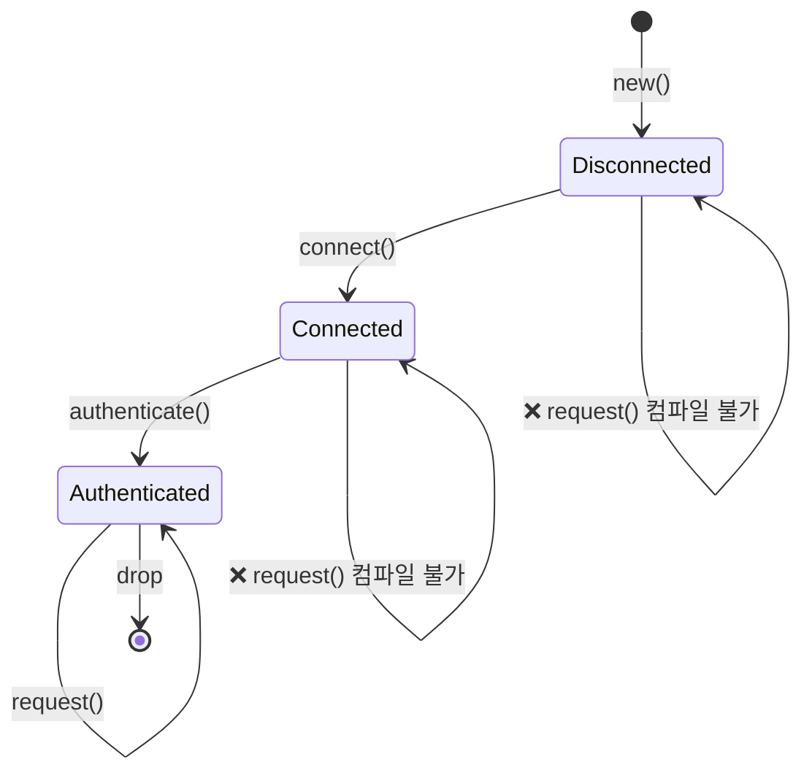
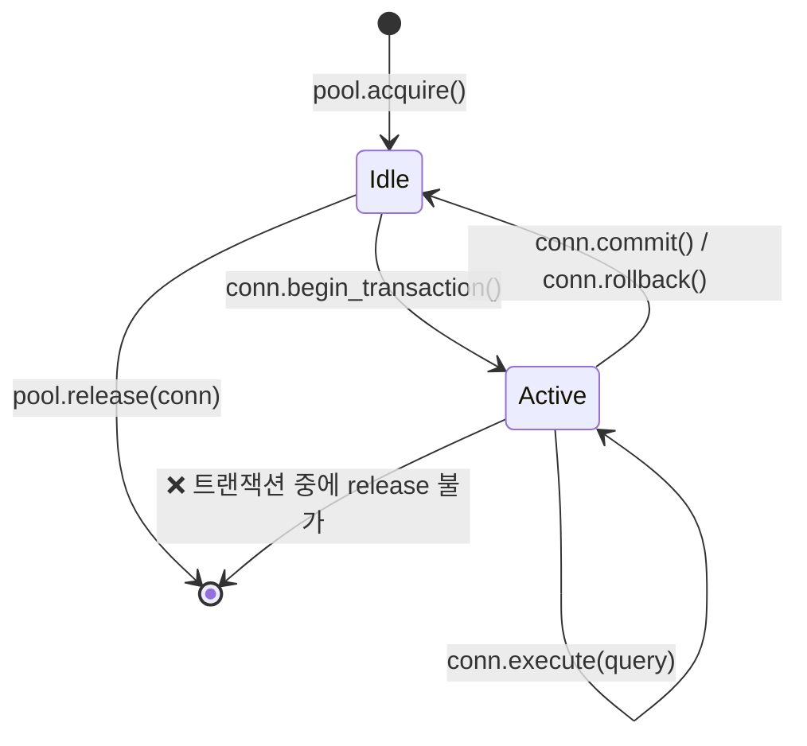
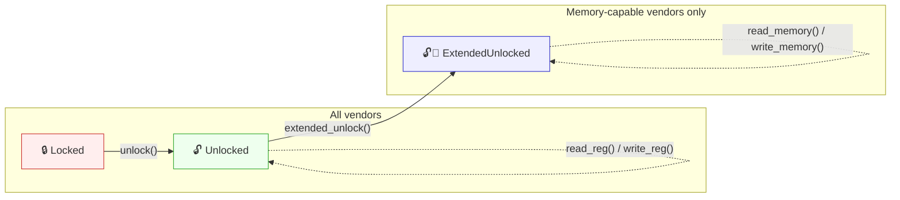
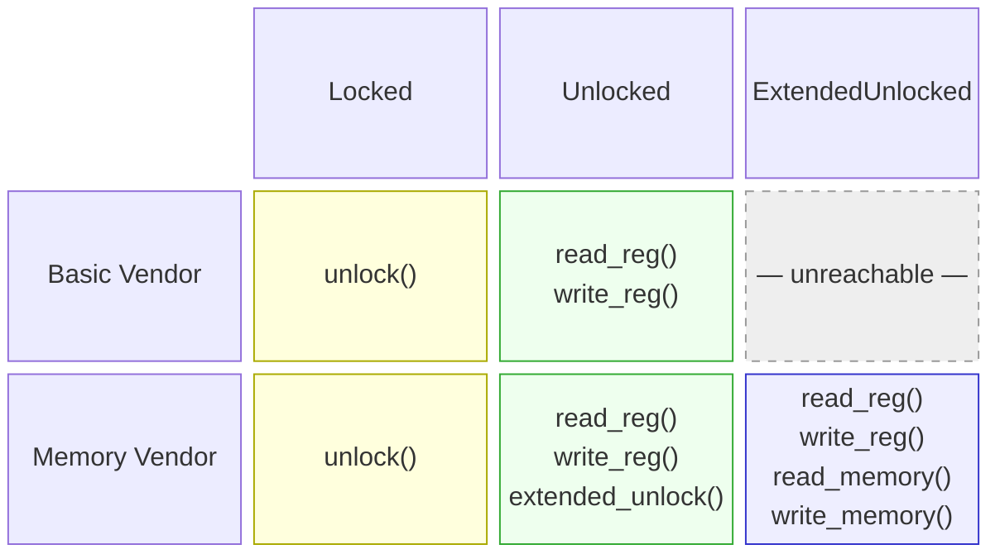

# 3. 뉴타입과 타입 상태 패턴 🟡

> **이 장에서 배울 내용:**
> - 컴파일 타임 타입 안전을 주는 제로 코스트 뉴타입 패턴
> - 타입 상태 패턴: 불가능한 상태 전이를 타입으로 표현하지 않게 하기
> - 컴파일 타임에 순서를 강제하는 타입 상태 빌더 패턴
> - 제네릭 매개변수 폭발을 다스리는 Config 트레잇 패턴

<a id="newtype-zero-cost-type-safety"></a>
## 뉴타입: 제로 코스트 타입 안전

뉴타입 패턴은 기존 타입을 한 필드 튜플 구조체로 감싸 런타임 오버헤드 없이 별개의 타입을 만듭니다:

```rust
// Without newtypes — easy to mix up:
fn create_user(name: String, email: String, age: u32, employee_id: u32) { }
// create_user(name, email, age, id);  — but what if we swap age and id?
// create_user(name, email, id, age);  — COMPILES FINE, BUG

// With newtypes — the compiler catches mistakes:
struct UserName(String);
struct Email(String);
struct Age(u32);
struct EmployeeId(u32);

fn create_user(name: UserName, email: Email, age: Age, id: EmployeeId) { }
// create_user(name, email, EmployeeId(42), Age(30));
// ❌ Compile error: expected Age, got EmployeeId
```

<a id="impl-deref-for-newtypes-power-and-pitfalls"></a>
### 뉴타입에 대한 `impl Deref` — 장점과 함정

뉴타입에 `Deref`를 구현하면 내부 타입 참조로 자동 강제 변환되어
내부 타입의 메서드를 거의 “공짜”로 쓸 수 있습니다:

```rust
use std::ops::Deref;

struct Email(String);

impl Email {
    fn new(raw: &str) -> Result<Self, &'static str> {
        if raw.contains('@') {
            Ok(Email(raw.to_string()))
        } else {
            Err("invalid email: missing @")
        }
    }
}

impl Deref for Email {
    type Target = str;
    fn deref(&self) -> &str { &self.0 }
}

// Now Email auto-derefs to &str:
let email = Email::new("user@example.com").unwrap();
println!("Length: {}", email.len()); // Uses str::len via Deref
```

편하지만 래퍼의 추상 경계에 **구멍을 뚫는** 셈입니다 — 대상 타입의 *모든* 메서드가
호출 가능해집니다.

#### `Deref`가 **적절한** 경우

| 시나리오 | 예 | 괜찮은 이유 |
|----------|---------|---------------|
| 스마트 포인터 래퍼 | `Box<T>`, `Arc<T>`, `MutexGuard<T>` | 래퍼의 목적 자체가 `T`처럼 동작하는 것 |
| 투명한 “얇은” 래퍼 | `String` → `str`, `PathBuf` → `Path`, `Vec<T>` → `[T]` | 래퍼가 대상의 상위집합 |
| 뉴타입이 정말 내부와 같을 때 | 전체 문자열 연산을 항상 원하는 `struct Hostname(String)` | API를 제한해도 이득이 없음 |

#### `Deref`가 안티패턴인 경우

| 시나리오 | 문제 |
|----------|---------|
| **불변식이 있는 도메인 타입** | `Email`이 `&str`로 디레프되면 `.split_at()`, `.trim()` 등을 호출할 수 있음 — “@ 포함” 불변식을 지키지 않음. 잘린 `&str`을 저장해 재구성하면 불변식이 깨짐. |
| **API를 제한하고 싶을 때** | `Deref<Target = str>`인 `Password(String)`은 `.as_bytes()`, `.chars()`, `Debug` 출력까지 새어 나옴 — 숨기려던 것. |
| **가짜 상속** | `ManagerWidget`이 `Widget`으로 자동 디레프되게 하면 OOP 상속을 흉내 냄. Rust API 가이드라인(C-DEREF)에서 명시적으로 비권장. |

> **경험 법칙**: 뉴타입이 타입 안전을 *추가*하거나 API를 *제한*하려는 것이면 `Deref`를 구현하지 마세요.
> 스마트 포인터처럼 내부 전체 표면을 유지하며 *능력을 추가*하려는 것이면 `Deref`가 맞습니다.

#### `DerefMut` — 위험이 두 배

`DerefMut`까지 구현하면 호출자가 생성자의 검증을 건너뛰고 내부 값을 *직접* 바꿀 수 있습니다:

```rust
use std::ops::{Deref, DerefMut};

struct PortNumber(u16);

impl Deref for PortNumber {
    type Target = u16;
    fn deref(&self) -> &u16 { &self.0 }
}

impl DerefMut for PortNumber {
    fn deref_mut(&mut self) -> &mut u16 { &mut self.0 }
}

let mut port = PortNumber(443);
*port = 0; // Bypasses any validation — now an invalid port
```

내부 타입에 지킬 불변식이 없을 때만 `DerefMut`을 구현하세요.

#### 대신 명시적 위임 선호

내부 타입 메서드 중 *일부만* 노출하려면 명시적으로 위임합니다:

```rust
struct Email(String);

impl Email {
    fn new(raw: &str) -> Result<Self, &'static str> {
        if raw.contains('@') { Ok(Email(raw.to_string())) }
        else { Err("missing @") }
    }

    // Expose only what makes sense:
    pub fn as_str(&self) -> &str { &self.0 }
    pub fn len(&self) -> usize { self.0.len() }
    pub fn domain(&self) -> &str {
        self.0.split('@').nth(1).unwrap_or("")
    }
    // .split_at(), .trim(), .replace() — NOT exposed
}
```

#### Clippy와 생태계

- **`clippy::wrong_self_convention`**: `Deref` 강제 변환이 메서드 해석을 이상하게 만들면
  발동할 수 있음(예: `is_empty()`가 의도한 그림자가 아니라 내부 타입 버전으로 해석).
- **Rust API 가이드라인**(C-DEREF): *“`Deref`는 스마트 포인터만 구현해야 한다.”* 강한 기본값으로 두고
  명확한 이유가 있을 때만 벗어나세요.
- 트레잇 호환(`Email`을 `&str`을 기대하는 함수에 넘기기 등)이 필요하면 `AsRef<str>`·`Borrow<str>`를
  고려하세요 — 자동 강제 변환 없이 명시적입니다.

#### 결정 행렬

```text
내부 타입의 모든 메서드를 호출 가능하게 할 것인가?
  ├─ 예 → 타입이 불변식을 강제하거나 API를 제한하는가?
  │    ├─ 아니오  → impl Deref ✅  (스마트 포인터 / 투명 래퍼)
  │    └─ 예 → impl Deref 하지 않음 ❌ (불변식 새어 나옴)
  └─ 아니오 → impl Deref 하지 않음 ❌  (AsRef / 명시적 위임)
```

<a id="type-state-compile-time-protocol-enforcement"></a>
### 타입 상태: 컴파일 타임 프로토콜 강제

타입 상태 패턴은 연산이 올바른 순서로만 일어나도록 타입 시스템을 씁니다. 잘못된 상태는 **표현 자체가 불가능**해집니다.



> 각 전이는 `self`를 *소비*하고 새 타입을 반환합니다 — 컴파일러가 올바른 순서를 강제합니다.

```rust
// Problem: A network connection that must be:
// 1. Created
// 2. Connected
// 3. Authenticated
// 4. Then used for requests
// Calling request() before authenticate() should be a COMPILE error.

// --- Type-state markers (zero-sized types) ---
struct Disconnected;
struct Connected;
struct Authenticated;

// --- Connection parameterized by state ---
struct Connection<State> {
    address: String,
    _state: std::marker::PhantomData<State>,
}

// Only Disconnected connections can connect:
impl Connection<Disconnected> {
    fn new(address: &str) -> Self {
        Connection {
            address: address.to_string(),
            _state: std::marker::PhantomData,
        }
    }

    fn connect(self) -> Connection<Connected> {
        println!("Connecting to {}...", self.address);
        Connection {
            address: self.address,
            _state: std::marker::PhantomData,
        }
    }
}

// Only Connected connections can authenticate:
impl Connection<Connected> {
    fn authenticate(self, _token: &str) -> Connection<Authenticated> {
        println!("Authenticating...");
        Connection {
            address: self.address,
            _state: std::marker::PhantomData,
        }
    }
}

// Only Authenticated connections can make requests:
impl Connection<Authenticated> {
    fn request(&self, path: &str) -> String {
        format!("GET {} from {}", path, self.address)
    }
}

fn main() {
    let conn = Connection::new("api.example.com");
    // conn.request("/data"); // ❌ Compile error: no method `request` on Connection<Disconnected>

    let conn = conn.connect();
    // conn.request("/data"); // ❌ Compile error: no method `request` on Connection<Connected>

    let conn = conn.authenticate("secret-token");
    let response = conn.request("/data"); // ✅ Only works after authentication
    println!("{response}");
}
```

> **핵심**: 각 상태 전이는 `self`를 *소비*하고 새 타입을 반환합니다.
> 전이 후에는 이전 상태를 쓸 수 없습니다 — 컴파일러가 강제합니다.
> 런타임 비용 제로 — `PhantomData`는 제로 크기, 상태는 컴파일 타임에 지워집니다.

**C++/C#와 비교**: C++나 C#에서는 런타임 검사(`if (!authenticated) throw ...`)로 강제합니다.
Rust 타입 상태 패턴은 이를 컴파일 타임으로 옮깁니다 — 잘못된 상태는 타입 시스템에 말 그대로 표현할 수 없습니다.

<a id="builder-pattern-with-type-states"></a>
### 타입 상태를 쓰는 빌더 패턴

실용 예 — 필수 필드 순서를 강제하는 빌더:

```rust
use std::marker::PhantomData;

// Marker types for required fields
struct NeedsName;
struct NeedsPort;
struct Ready;

struct ServerConfig<State> {
    name: Option<String>,
    port: Option<u16>,
    max_connections: usize, // Optional, has default
    _state: PhantomData<State>,
}

impl ServerConfig<NeedsName> {
    fn new() -> Self {
        ServerConfig {
            name: None,
            port: None,
            max_connections: 100,
            _state: PhantomData,
        }
    }

    fn name(self, name: &str) -> ServerConfig<NeedsPort> {
        ServerConfig {
            name: Some(name.to_string()),
            port: self.port,
            max_connections: self.max_connections,
            _state: PhantomData,
        }
    }
}

impl ServerConfig<NeedsPort> {
    fn port(self, port: u16) -> ServerConfig<Ready> {
        ServerConfig {
            name: self.name,
            port: Some(port),
            max_connections: self.max_connections,
            _state: PhantomData,
        }
    }
}

impl ServerConfig<Ready> {
    fn max_connections(mut self, n: usize) -> Self {
        self.max_connections = n;
        self
    }

    fn build(self) -> Server {
        Server {
            name: self.name.unwrap(),
            port: self.port.unwrap(),
            max_connections: self.max_connections,
        }
    }
}

struct Server {
    name: String,
    port: u16,
    max_connections: usize,
}

fn main() {
    // Must provide name, then port, then can build:
    let server = ServerConfig::new()
        .name("my-server")
        .port(8080)
        .max_connections(500)
        .build();

    // ServerConfig::new().port(8080); // ❌ Compile error: no method `port` on NeedsName
    // ServerConfig::new().name("x").build(); // ❌ Compile error: no method `build` on NeedsPort
}
```

***

<a id="case-study-type-safe-connection-pool"></a>
## 사례 연구: 타입 안전 연결 풀

실제 시스템은 연결이 명확한 상태를 거쳐 움직이는 연결 풀이 필요합니다. 프로덕션 풀에서 타입 상태 패턴이
올바름을 어떻게 강제하는지:



```rust
use std::marker::PhantomData;

// States
struct Idle;
struct InTransaction;

struct PooledConnection<State> {
    id: u32,
    _state: PhantomData<State>,
}

struct Pool {
    next_id: u32,
}

impl Pool {
    fn new() -> Self { Pool { next_id: 0 } }

    fn acquire(&mut self) -> PooledConnection<Idle> {
        self.next_id += 1;
        println!("[pool] Acquired connection #{}", self.next_id);
        PooledConnection { id: self.next_id, _state: PhantomData }
    }

    // Only idle connections can be released — prevents mid-transaction leaks
    fn release(&self, conn: PooledConnection<Idle>) {
        println!("[pool] Released connection #{}", conn.id);
    }
}

impl PooledConnection<Idle> {
    fn begin_transaction(self) -> PooledConnection<InTransaction> {
        println!("[conn #{}] BEGIN", self.id);
        PooledConnection { id: self.id, _state: PhantomData }
    }
}

impl PooledConnection<InTransaction> {
    fn execute(&self, query: &str) {
        println!("[conn #{}] EXEC: {}", self.id, query);
    }

    fn commit(self) -> PooledConnection<Idle> {
        println!("[conn #{}] COMMIT", self.id);
        PooledConnection { id: self.id, _state: PhantomData }
    }

    fn rollback(self) -> PooledConnection<Idle> {
        println!("[conn #{}] ROLLBACK", self.id);
        PooledConnection { id: self.id, _state: PhantomData }
    }
}

fn main() {
    let mut pool = Pool::new();

    let conn = pool.acquire();
    let conn = conn.begin_transaction();
    conn.execute("INSERT INTO users VALUES ('Alice')");
    conn.execute("INSERT INTO orders VALUES (1, 42)");
    let conn = conn.commit(); // Back to Idle
    pool.release(conn);       // ✅ Only works on Idle connections

    // pool.release(conn_active); // ❌ Compile error: can't release InTransaction
}
```

**프로덕션에서 왜 중요한가**: 트랜잭션 중에 새어 나간 연결은 DB 락을 무한히 잡습니다.
타입 상태 패턴은 이를 불가능하게 만듭니다 — 커밋 또는 롤백 전까지 풀에 연결을 반납할 수 없습니다.

***

<a id="config-trait-pattern-taming-generic-parameter-explosion"></a>

## Config 트레잇 패턴 — 제네릭 매개변수 폭발 다루기

### 문제

구조체가 책임을 더 지며 트레잇으로 제약된 제네릭이 늘어날수록
타입 시그니처가 다루기 힘들어집니다:

```rust
trait SpiBus   { fn spi_transfer(&self, tx: &[u8], rx: &mut [u8]) -> Result<(), BusError>; }
trait ComPort  { fn com_send(&self, data: &[u8]) -> Result<usize, BusError>; }
trait I3cBus   { fn i3c_read(&self, addr: u8, buf: &mut [u8]) -> Result<(), BusError>; }
trait SmBus    { fn smbus_read_byte(&self, addr: u8, cmd: u8) -> Result<u8, BusError>; }
trait GpioBus  { fn gpio_set(&self, pin: u32, high: bool); }

// ❌ Every new bus trait adds another generic parameter
struct DiagController<S: SpiBus, C: ComPort, I: I3cBus, M: SmBus, G: GpioBus> {
    spi: S,
    com: C,
    i3c: I,
    smbus: M,
    gpio: G,
}
// impl blocks, function signatures, and callers all repeat the full list.
// Adding a 6th bus means editing every mention of DiagController<S, C, I, M, G>.
```

이를 **“제네릭 매개변수 폭발”**이라고 부릅니다. `impl` 블록, 함수 매개변수, 하위 소비자 전반에
중복되며, 모두 전체 매개변수 목록을 반복해야 합니다.

### 해결책: Config 트레잇

연관 타입을 하나의 트레잇에 묶습니다. 구조체는 구성요소가 몇 개든 **제네릭 매개변수는 하나**입니다:

```rust
#[derive(Debug)]
enum BusError {
    Timeout,
    NakReceived,
    HardwareFault(String),
}

// --- Bus traits (unchanged) ---
trait SpiBus {
    fn spi_transfer(&self, tx: &[u8], rx: &mut [u8]) -> Result<(), BusError>;
    fn spi_write(&self, data: &[u8]) -> Result<(), BusError>;
}

trait ComPort {
    fn com_send(&self, data: &[u8]) -> Result<usize, BusError>;
    fn com_recv(&self, buf: &mut [u8], timeout_ms: u32) -> Result<usize, BusError>;
}

trait I3cBus {
    fn i3c_read(&self, addr: u8, buf: &mut [u8]) -> Result<(), BusError>;
    fn i3c_write(&self, addr: u8, data: &[u8]) -> Result<(), BusError>;
}

// --- The Config trait: one associated type per component ---
trait BoardConfig {
    type Spi: SpiBus;
    type Com: ComPort;
    type I3c: I3cBus;
}

// --- DiagController has exactly ONE generic parameter ---
struct DiagController<Cfg: BoardConfig> {
    spi: Cfg::Spi,
    com: Cfg::Com,
    i3c: Cfg::I3c,
}
```

`DiagController<Cfg>`에 또 다른 제네릭 매개변수가 붙지는 않습니다.
네 번째 버스를 추가하면 `BoardConfig`에 연관 타입 하나, `DiagController`에 필드 하나만 더하면 되고
하위 시그니처는 바꿀 필요 없습니다.

### 컨트롤러 구현

```rust
impl<Cfg: BoardConfig> DiagController<Cfg> {
    fn new(spi: Cfg::Spi, com: Cfg::Com, i3c: Cfg::I3c) -> Self {
        DiagController { spi, com, i3c }
    }

    fn read_flash_id(&self) -> Result<u32, BusError> {
        let cmd = [0x9F]; // JEDEC Read ID
        let mut id = [0u8; 4];
        self.spi.spi_transfer(&cmd, &mut id)?;
        Ok(u32::from_be_bytes(id))
    }

    fn send_bmc_command(&self, cmd: &[u8]) -> Result<Vec<u8>, BusError> {
        self.com.com_send(cmd)?;
        let mut resp = vec![0u8; 256];
        let n = self.com.com_recv(&mut resp, 1000)?;
        resp.truncate(n);
        Ok(resp)
    }

    fn read_sensor_temp(&self, sensor_addr: u8) -> Result<i16, BusError> {
        let mut buf = [0u8; 2];
        self.i3c.i3c_read(sensor_addr, &mut buf)?;
        Ok(i16::from_be_bytes(buf))
    }

    fn run_full_diag(&self) -> Result<DiagReport, BusError> {
        let flash_id = self.read_flash_id()?;
        let bmc_resp = self.send_bmc_command(b"VERSION\n")?;
        let cpu_temp = self.read_sensor_temp(0x48)?;
        let gpu_temp = self.read_sensor_temp(0x49)?;

        Ok(DiagReport {
            flash_id,
            bmc_version: String::from_utf8_lossy(&bmc_resp).to_string(),
            cpu_temp_c: cpu_temp,
            gpu_temp_c: gpu_temp,
        })
    }
}

#[derive(Debug)]
struct DiagReport {
    flash_id: u32,
    bmc_version: String,
    cpu_temp_c: i16,
    gpu_temp_c: i16,
}
```

### 프로덕션 연결

`impl BoardConfig` 하나가 구체 하드웨어 드라이버를 고릅니다:

```rust
struct PlatformSpi  { dev: String, speed_hz: u32 }
struct UartCom      { dev: String, baud: u32 }
struct LinuxI3c     { dev: String }

impl SpiBus for PlatformSpi {
    fn spi_transfer(&self, tx: &[u8], rx: &mut [u8]) -> Result<(), BusError> {
        // ioctl(SPI_IOC_MESSAGE) in production
        rx[0..4].copy_from_slice(&[0xEF, 0x40, 0x18, 0x00]);
        Ok(())
    }
    fn spi_write(&self, _data: &[u8]) -> Result<(), BusError> { Ok(()) }
}

impl ComPort for UartCom {
    fn com_send(&self, _data: &[u8]) -> Result<usize, BusError> { Ok(0) }
    fn com_recv(&self, buf: &mut [u8], _timeout: u32) -> Result<usize, BusError> {
        let resp = b"BMC v2.4.1\n";
        buf[..resp.len()].copy_from_slice(resp);
        Ok(resp.len())
    }
}

impl I3cBus for LinuxI3c {
    fn i3c_read(&self, _addr: u8, buf: &mut [u8]) -> Result<(), BusError> {
        buf[0] = 0x00; buf[1] = 0x2D; // 45°C
        Ok(())
    }
    fn i3c_write(&self, _addr: u8, _data: &[u8]) -> Result<(), BusError> { Ok(()) }
}

// ✅ One struct, one impl — all concrete types resolved here
struct ProductionBoard;
impl BoardConfig for ProductionBoard {
    type Spi = PlatformSpi;
    type Com = UartCom;
    type I3c = LinuxI3c;
}

fn main() {
    let ctrl = DiagController::<ProductionBoard>::new(
        PlatformSpi { dev: "/dev/spidev0.0".into(), speed_hz: 10_000_000 },
        UartCom     { dev: "/dev/ttyS0".into(),     baud: 115200 },
        LinuxI3c    { dev: "/dev/i3c-0".into() },
    );
    let report = ctrl.run_full_diag().unwrap();
    println!("{report:#?}");
}
```

### 목으로 테스트 연결

다른 `BoardConfig`를 정의해 하드웨어 전체를 교체합니다:

```rust
struct MockSpi  { flash_id: [u8; 4] }
struct MockCom  { response: Vec<u8> }
struct MockI3c  { temps: std::collections::HashMap<u8, i16> }

impl SpiBus for MockSpi {
    fn spi_transfer(&self, _tx: &[u8], rx: &mut [u8]) -> Result<(), BusError> {
        rx[..4].copy_from_slice(&self.flash_id);
        Ok(())
    }
    fn spi_write(&self, _data: &[u8]) -> Result<(), BusError> { Ok(()) }
}

impl ComPort for MockCom {
    fn com_send(&self, _data: &[u8]) -> Result<usize, BusError> { Ok(0) }
    fn com_recv(&self, buf: &mut [u8], _timeout: u32) -> Result<usize, BusError> {
        let n = self.response.len().min(buf.len());
        buf[..n].copy_from_slice(&self.response[..n]);
        Ok(n)
    }
}

impl I3cBus for MockI3c {
    fn i3c_read(&self, addr: u8, buf: &mut [u8]) -> Result<(), BusError> {
        let temp = self.temps.get(&addr).copied().unwrap_or(0);
        buf[..2].copy_from_slice(&temp.to_be_bytes());
        Ok(())
    }
    fn i3c_write(&self, _addr: u8, _data: &[u8]) -> Result<(), BusError> { Ok(()) }
}

struct TestBoard;
impl BoardConfig for TestBoard {
    type Spi = MockSpi;
    type Com = MockCom;
    type I3c = MockI3c;
}

#[cfg(test)]
mod tests {
    use super::*;

    fn make_test_controller() -> DiagController<TestBoard> {
        let mut temps = std::collections::HashMap::new();
        temps.insert(0x48, 45i16);
        temps.insert(0x49, 72i16);

        DiagController::<TestBoard>::new(
            MockSpi  { flash_id: [0xEF, 0x40, 0x18, 0x00] },
            MockCom  { response: b"BMC v2.4.1\n".to_vec() },
            MockI3c  { temps },
        )
    }

    #[test]
    fn test_flash_id() {
        let ctrl = make_test_controller();
        assert_eq!(ctrl.read_flash_id().unwrap(), 0xEF401800);
    }

    #[test]
    fn test_sensor_temps() {
        let ctrl = make_test_controller();
        assert_eq!(ctrl.read_sensor_temp(0x48).unwrap(), 45);
        assert_eq!(ctrl.read_sensor_temp(0x49).unwrap(), 72);
    }

    #[test]
    fn test_full_diag() {
        let ctrl = make_test_controller();
        let report = ctrl.run_full_diag().unwrap();
        assert_eq!(report.flash_id, 0xEF401800);
        assert_eq!(report.cpu_temp_c, 45);
        assert_eq!(report.gpu_temp_c, 72);
        assert!(report.bmc_version.contains("2.4.1"));
    }
}
```

### 나중에 새 버스 추가

네 번째 버스가 필요하면 바뀌는 것은 둘뿐 — `BoardConfig`와 `DiagController`.
**하위 시그니처는 그대로.** 제네릭 매개변수 개수는 여전히 하나입니다:

```rust
trait SmBus {
    fn smbus_read_byte(&self, addr: u8, cmd: u8) -> Result<u8, BusError>;
}

// 1. Add one associated type:
trait BoardConfig {
    type Spi: SpiBus;
    type Com: ComPort;
    type I3c: I3cBus;
    type Smb: SmBus;     // ← new
}

// 2. Add one field:
struct DiagController<Cfg: BoardConfig> {
    spi: Cfg::Spi,
    com: Cfg::Com,
    i3c: Cfg::I3c,
    smb: Cfg::Smb,       // ← new
}

// 3. Provide the concrete type in each config impl:
impl BoardConfig for ProductionBoard {
    type Spi = PlatformSpi;
    type Com = UartCom;
    type I3c = LinuxI3c;
    type Smb = LinuxSmbus; // ← new
}
```

### 이 패턴을 쓸 때

| 상황 | Config 트레잇? | 대안 |
|-----------|:-:|---|
| 구조체에 트레잇 제약 제네릭 3개 이상 | ✅ 예 | — |
| 하드웨어/플랫폼 전체를 통째로 바꿔야 함 | ✅ 예 | — |
| 제네릭 1–2개뿐 | ❌ 과함 | 직접 제네릭 |
| 런타임 다형성 필요 | ❌ | `dyn Trait` 객체 |
| 끝이 없는 플러그인 시스템 | ❌ | Type-map / `Any` |
| 구성 요소 트레잇이 자연스러운 그룹(보드, 플랫폼) | ✅ 예 | — |

### 핵심 성질

- **제네릭 매개변수는 영원히 하나** — `DiagController<Cfg>`에 `<A, B, C, ...>`가 늘지 않음
- **완전 정적 디스패치** — vtable 없음, `dyn` 없음, 트레잇 객체용 힙 할당 없음
- **깔끔한 테스트 교체** — 목 구현으로 `TestBoard` 정의, 조건부 컴파일 제로
- **컴파일 타임 안전** — 연관 타입 누락 → 컴파일 에러, 런타임 크래시 아님
- **실전 검증** — Substrate/Polkadot 프레임이 단일 `Config` 트레잇으로
  20개 이상의 연관 타입을 관리하는 패턴

> **핵심 정리 — 뉴타입·타입 상태**
> - 뉴타입은 런타임 비용 없이 컴파일 타임 타입 안전을 준다
> - 타입 상태는 불가능한 전이를 런타임 버그가 아니라 컴파일 에러로 만든다
> - Config 트레잇은 큰 시스템에서 제네릭 매개변수 폭발을 다스린다

> **더 보기:** 타입 상태를 받치는 제로 크기 마커는 [4장 — PhantomData](ch04-phantomdata-types-that-carry-no-data.md). Config 트레잇에 쓰는 연관 타입은 [2장 — 트레잇 심화](ch02-traits-in-depth.md).

---

<a id="case-study-dual-axis-typestate-vendor-protocol-state"></a>
## 사례 연구: 이중 축 타입 상태 — 벤더 × 프로토콜 상태

위 패턴은 한 축씩 다룹니다: 타입 상태는 *프로토콜 순서*를, 트레잇 추상화는 *여러 벤더*를.
실제 시스템은 둘을 **동시에** 필요로 할 때가 많습니다: `Handle<Vendor, State>` 래퍼에서
메서드 사용 가능 여부가 꽂힌 *벤더*와 핸들의 *상태* **둘 다**에 의존할 때입니다.

이 절은 벤더 트레잇 바운드와 상태 마커 트레잇 **둘 다**로 `impl` 블록을 제한하는
**이중 축 조건부 `impl`** 패턴을 보여줍니다.

### 이차원 문제

디버그 프로브 인터페이스(JTAG/SWD)를 생각해 보세요. 여러 벤더가 프로브를 만들고,
모든 프로브는 레지스터에 접근하기 전에 잠금 해제가 필요합니다. 일부 벤더는
메모리 접근 포트를 설정하는 *확장 잠금 해제* 이후에만 직접 메모리 읽기를 지원합니다:



**역량 행렬** — (벤더, 상태) 조합마다 어떤 메서드가 있는지 — 는 이차원입니다:



과제: 이 행렬을 **전부 컴파일 타임**에, 정적 디스패치로 표현해 기본 프로브에
`extended_unlock()`을 호출하거나 확장 잠금 없이 `read_memory()`를 호출하면 컴파일 에러가 나게 하는 것.

### 해결책: 마커 트레잇이 있는 `Jtag<V, S>`

**1단계 — 상태 토큰과 역량 마커:**

```rust,ignore
use std::marker::PhantomData;

// Zero-sized state tokens — no runtime cost
struct Locked;
struct Unlocked;
struct ExtendedUnlocked;

// Marker traits express which capabilities each state has
trait HasRegAccess {}
impl HasRegAccess for Unlocked {}
impl HasRegAccess for ExtendedUnlocked {}

trait HasMemAccess {}
impl HasMemAccess for ExtendedUnlocked {}
```

> **왜 구체 상태만이 아니라 마커 트레잇인가?**
> `impl<V, S: HasRegAccess> Jtag<V, S>`를 쓰면 `read_reg()`는 레지스터 접근이 있는
> *임의의* 상태에서 동작합니다 — 지금은 `Unlocked`와 `ExtendedUnlocked`지만,
> 내일 `DebugHalted`를 추가하면 한 줄만 추가하면 됩니다:
> `impl HasRegAccess for DebugHalted {}`. 레지스터 함수는 자동으로 모두 동작 — 코드 변경 제로.

**2단계 — 벤더 트레잇(raw 연산):**

```rust,ignore
// Every probe vendor implements these
trait JtagVendor {
    fn raw_unlock(&mut self);
    fn raw_read_reg(&self, addr: u32) -> u32;
    fn raw_write_reg(&mut self, addr: u32, val: u32);
}

// Vendors with memory access also implement this super-trait
trait JtagMemoryVendor: JtagVendor {
    fn raw_extended_unlock(&mut self);
    fn raw_read_memory(&self, addr: u64, buf: &mut [u8]);
    fn raw_write_memory(&mut self, addr: u64, data: &[u8]);
}
```

**3단계 — 조건부 `impl` 블록이 있는 래퍼:**

```rust,ignore
struct Jtag<V, S = Locked> {
    vendor: V,
    _state: PhantomData<S>,
}

// Construction — always starts Locked
impl<V: JtagVendor> Jtag<V, Locked> {
    fn new(vendor: V) -> Self {
        Jtag { vendor, _state: PhantomData }
    }

    fn unlock(mut self) -> Jtag<V, Unlocked> {
        self.vendor.raw_unlock();
        Jtag { vendor: self.vendor, _state: PhantomData }
    }
}

// Register I/O — any vendor, any state with HasRegAccess
impl<V: JtagVendor, S: HasRegAccess> Jtag<V, S> {
    fn read_reg(&self, addr: u32) -> u32 {
        self.vendor.raw_read_reg(addr)
    }
    fn write_reg(&mut self, addr: u32, val: u32) {
        self.vendor.raw_write_reg(addr, val);
    }
}

// Extended unlock — only memory-capable vendors, only from Unlocked
impl<V: JtagMemoryVendor> Jtag<V, Unlocked> {
    fn extended_unlock(mut self) -> Jtag<V, ExtendedUnlocked> {
        self.vendor.raw_extended_unlock();
        Jtag { vendor: self.vendor, _state: PhantomData }
    }
}

// Memory I/O — only memory-capable vendors, only ExtendedUnlocked
impl<V: JtagMemoryVendor, S: HasMemAccess> Jtag<V, S> {
    fn read_memory(&self, addr: u64, buf: &mut [u8]) {
        self.vendor.raw_read_memory(addr, buf);
    }
    fn write_memory(&mut self, addr: u64, data: &[u8]) {
        self.vendor.raw_write_memory(addr, data);
    }
}
```

각 `impl` 블록이 역량 행렬의 한 칸(또는 행)을 인코딩합니다.
컴파일러가 행렬을 강제합니다 — 런타임 검사 없음.

### 벤더 구현

벤더 추가는 **한 구조체**에 raw 메서드만 구현하면 됩니다 — 상태별 구조체 중복 없음,
위임 보일러플레이트 없음:

```rust,ignore
// Vendor A: basic probe — register access only
struct BasicProbe { port: u16 }

impl JtagVendor for BasicProbe {
    fn raw_unlock(&mut self)                    { /* TAP reset sequence */ }
    fn raw_read_reg(&self, addr: u32) -> u32    { /* DR scan */  0 }
    fn raw_write_reg(&mut self, addr: u32, val: u32) { /* DR scan */ }
}
// BasicProbe does NOT impl JtagMemoryVendor.
// extended_unlock() will not compile on Jtag<BasicProbe, _>.

// Vendor B: full-featured probe — registers + memory
struct DapProbe { serial: String }

impl JtagVendor for DapProbe {
    fn raw_unlock(&mut self)                    { /* SWD switch, read DPIDR */ }
    fn raw_read_reg(&self, addr: u32) -> u32    { /* AP register read */ 0 }
    fn raw_write_reg(&mut self, addr: u32, val: u32) { /* AP register write */ }
}

impl JtagMemoryVendor for DapProbe {
    fn raw_extended_unlock(&mut self)           { /* select MEM-AP, power up */ }
    fn raw_read_memory(&self, addr: u64, buf: &mut [u8])  { /* MEM-AP read */ }
    fn raw_write_memory(&mut self, addr: u64, data: &[u8]) { /* MEM-AP write */ }
}
```

### 컴파일러가 막는 것

| 시도 | 에러 | 이유 |
|---------|-------|-----|
| `Jtag<_, Locked>::read_reg()` | no method `read_reg` | `Locked` doesn't impl `HasRegAccess` |
| `Jtag<BasicProbe, _>::extended_unlock()` | no method `extended_unlock` | `BasicProbe` doesn't impl `JtagMemoryVendor` |
| `Jtag<_, Unlocked>::read_memory()` | no method `read_memory` | `Unlocked` doesn't impl `HasMemAccess` |
| Calling `unlock()` twice | value used after move | `unlock()` consumes `self` |

네 가지 에러는 모두 **컴파일 타임**에 잡힙니다. 패닉 없음, `Option` 없음, 런타임 상태 열거형 없음.

### 제네릭 함수 작성

함수는 관심 있는 축만 묶습니다:

```rust,ignore
/// Works with ANY vendor, ANY state that grants register access.
fn read_idcode<V: JtagVendor, S: HasRegAccess>(jtag: &Jtag<V, S>) -> u32 {
    jtag.read_reg(0x00)
}

/// Only compiles for memory-capable vendors in ExtendedUnlocked state.
fn dump_firmware<V: JtagMemoryVendor, S: HasMemAccess>(jtag: &Jtag<V, S>) {
    let mut buf = [0u8; 256];
    jtag.read_memory(0x0800_0000, &mut buf);
}
```

`read_idcode`는 `Unlocked`인지 `ExtendedUnlocked`인지 신경 쓰지 않습니다 —
`HasRegAccess`만 필요합니다. 시그니처에 특정 상태를 박아 넣는 것보다 마커 트레잇이 이득인 지점입니다.

### 같은 패턴, 다른 도메인: 스토리지 백엔드

이중 축 기법은 하드웨어에만 쓰이지 않습니다. 일부 백엔드만 트랜잭션을 지원하는
스토리지 레이어에 같은 구조를 쓸 수 있습니다:

```rust,ignore
// States
struct Closed;
struct Open;
struct InTransaction;

trait HasReadWrite {}
impl HasReadWrite for Open {}
impl HasReadWrite for InTransaction {}

// Vendor traits
trait StorageBackend {
    fn raw_open(&mut self);
    fn raw_read(&self, key: &[u8]) -> Option<Vec<u8>>;
    fn raw_write(&mut self, key: &[u8], value: &[u8]);
}

trait TransactionalBackend: StorageBackend {
    fn raw_begin(&mut self);
    fn raw_commit(&mut self);
    fn raw_rollback(&mut self);
}

// Wrapper
struct Store<B, S = Closed> { backend: B, _s: PhantomData<S> }

impl<B: StorageBackend> Store<B, Closed> {
    fn open(mut self) -> Store<B, Open> { self.backend.raw_open(); /* ... */ todo!() }
}
impl<B: StorageBackend, S: HasReadWrite> Store<B, S> {
    fn read(&self, key: &[u8]) -> Option<Vec<u8>>  { self.backend.raw_read(key) }
    fn write(&mut self, key: &[u8], val: &[u8])    { self.backend.raw_write(key, val) }
}
impl<B: TransactionalBackend> Store<B, Open> {
    fn begin(mut self) -> Store<B, InTransaction>   { /* ... */ todo!() }
}
impl<B: TransactionalBackend> Store<B, InTransaction> {
    fn commit(mut self) -> Store<B, Open>           { /* ... */ todo!() }
    fn rollback(mut self) -> Store<B, Open>         { /* ... */ todo!() }
}
```

플랫 파일 백엔드는 `StorageBackend`만 구현 — `begin()`은 컴파일되지 않습니다.
DB 백엔드는 `TransactionalBackend`를 추가 — 전체 `Open → InTransaction → Open` 주기가 열립니다.

### 이 패턴을 꺼내 쓸 때

| 신호 | 이중 축이 맞는 이유 |
|--------|--------------------|
| “누가 제공하는가”와 “어떤 상태인가” 두 가지 독립 축 | `impl` 블록 행렬이 둘 다 직접 인코딩 |
| 일부 제공자가 다른 이들보다 엄격히 더 많은 역량 | 슈퍼트레잇(`MemoryVendor: Vendor`) + 조건부 `impl` |
| 상태·역량 오용이 안전/정확성 버그 | 컴파일 타임 예방 > 런타임 검사 |
| 정적 디스패치를 원함(vtable 없음) | `PhantomData` + 제네릭 = 제로 코스트 |

| 신호 | 더 단순한 것을 고려 |
|--------|---------------------------|
| 한 축만 변함(상태 XOR 벤더) | 단일 축 타입 상태 또는 단순 트레잇 객체 |
| 세 개 이상의 독립 축 | 위의 Config 트레잇 패턴이 축을 연관 타입으로 묶음 |
| 런타임 다형성이 허용 가능 | `enum` 상태 + `dyn` 디스패치가 더 단순 |

> **두 축이 세 개 이상으로 늘 때:**
> `Handle<V, S, D, T>` — 벤더, 상태, 디버그 레벨, 전송 — 처럼 쓰기 시작하면
> 제네릭 목록이 무언가를 말해줍니다. *벤더* 축을 연관 타입 Config 트레잇으로 접고
> ([Config 트레잇 패턴](#config-trait-pattern-taming-generic-parameter-explosion)),
> *상태* 축만 제네릭 매개변수로 남기세요: `Handle<Cfg, S>`. Config 트레잇이 `type Vendor`, `type Transport` 등을
> 한 매개변수에 묶고, 상태 축은 컴파일 타임 전이 보장을 유지합니다.
> 자연스러운 진화이지 전면 재작성이 아닙니다 — 벤더 관련 타입을 `Cfg`로 올리고 타입 상태 장치는 그대로 둡니다.

> **핵심:** 이중 축 패턴은 타입 상태와 트레잇 기반 추상화의 교집합입니다. 각 `impl` 블록은
> (벤더 × 상태) 행렬의 한 칸에 대응합니다. 컴파일러가 전체 행렬을 강제합니다 —
> 런타임 상태 검사 없음, 불가능한 상태 패닉 없음, 비용 없음.

---

<a id="exercise-type-safe-state-machine"></a>
### 연습: 타입 안전 상태 머신 ★★ (~30분)

타입 상태 패턴으로 신호등 상태 머신을 만드세요. `Red → Green → Yellow → Red`만 순환하고 다른 순서는 불가능해야 합니다.

<details>
<summary>🔑 해답</summary>

```rust
use std::marker::PhantomData;

struct Red;
struct Green;
struct Yellow;

struct TrafficLight<State> {
    _state: PhantomData<State>,
}

impl TrafficLight<Red> {
    fn new() -> Self {
        println!("🔴 Red — STOP");
        TrafficLight { _state: PhantomData }
    }

    fn go(self) -> TrafficLight<Green> {
        println!("🟢 Green — GO");
        TrafficLight { _state: PhantomData }
    }
}

impl TrafficLight<Green> {
    fn caution(self) -> TrafficLight<Yellow> {
        println!("🟡 Yellow — CAUTION");
        TrafficLight { _state: PhantomData }
    }
}

impl TrafficLight<Yellow> {
    fn stop(self) -> TrafficLight<Red> {
        println!("🔴 Red — STOP");
        TrafficLight { _state: PhantomData }
    }
}

fn main() {
    let light = TrafficLight::new(); // Red
    let light = light.go();          // Green
    let light = light.caution();     // Yellow
    let _light = light.stop();       // Red

    // light.caution(); // ❌ Compile error: no method `caution` on Red
    // TrafficLight::new().stop(); // ❌ Compile error: no method `stop` on Red
}
```

**핵심**: 잘못된 전이는 런타임 패닉이 아니라 컴파일 에러입니다.

</details>

***

