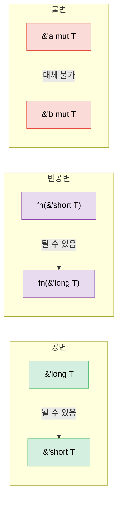

# 4. PhantomData — 데이터를 담지 않는 타입 🔴

> **이 장에서 배울 내용:**
> - `PhantomData<T>`가 존재하는 이유와 해결하는 세 가지 문제
> - 컴파일 타임 범위 강제를 위한 라이프타임 브랜딩
> - 차원 안전 연산을 위한 단위(unit-of-measure) 패턴
> - 분산(공변·반공변·불변)과 PhantomData가 이를 제어하는 방식

<a id="what-phantomdata-solves"></a>
## PhantomData가 해결하는 것

`PhantomData<T>`는 구조체가 `T`를 담지 않아도 논리적으로 `T`와 연관된다고 컴파일러에 알리는 제로 크기 타입입니다. 분산, drop 검사, auto 트레잇 추론에 영향을 주며 메모리는 쓰지 않습니다.

```rust
use std::marker::PhantomData;

// PhantomData 없이:
struct Slice<'a, T> {
    ptr: *const T,
    len: usize,
    // 문제: 컴파일러는 이 구조체가 'a에서 빌린다는 것,
    // 또는 drop 검사를 위해 T와 연관된다는 것을 모름
}

// PhantomData 있을 때:
struct Slice<'a, T> {
    ptr: *const T,
    len: usize,
    _marker: PhantomData<&'a T>,
    // 이제 컴파일러는 알 수 있음:
    // 1. 이 구조체는 'a 동안의 데이터를 빌림
    // 2. 'a에 대해 공변(라이프타임을 짧게 줄일 수 있음)
    // 3. Drop 검사 시 T를 고려
}
```

**PhantomData의 세 가지 역할**:

| 역할 | 예 | 하는 일 |
|-----|---------|-------------|
| **라이프타임 묶기** | `PhantomData<&'a T>` | 구조체가 `'a`를 빌린 것으로 취급 |
| **소유권 시뮬레이션** | `PhantomData<T>` | Drop 검사에서 구조체가 `T`를 소유한다고 가정 |
| **분산 제어** | `PhantomData<fn(T)>` | `T`에 대해 반공변으로 만듦 |

<a id="lifetime-branding"></a>
### 라이프타임 브랜딩

`PhantomData`로 서로 다른 “세션”이나 “컨텍스트”의 값이 섞이지 않게 할 수 있습니다:

```rust
use std::marker::PhantomData;

/// 특정 아레나의 라이프타임 안에서만 유효한 핸들
struct ArenaHandle<'arena> {
    index: usize,
    _brand: PhantomData<&'arena ()>,
}

struct Arena {
    data: Vec<String>,
}

impl Arena {
    fn new() -> Self {
        Arena { data: Vec::new() }
    }

    /// 문자열을 할당하고 브랜딩된 핸들 반환
    fn alloc<'a>(&'a mut self, value: String) -> ArenaHandle<'a> {
        let index = self.data.len();
        self.data.push(value);
        ArenaHandle { index, _brand: PhantomData }
    }

    /// 핸들로 조회 — 이 아레나에서 나온 핸들만 받음
    fn get<'a>(&'a self, handle: ArenaHandle<'a>) -> &'a str {
        &self.data[handle.index]
    }
}

fn main() {
    let mut arena1 = Arena::new();
    let handle1 = arena1.alloc("hello".to_string());

    // handle1을 다른 아레나에 쓸 수 없음 — 라이프타임이 맞지 않음
    // let mut arena2 = Arena::new();
    // arena2.get(handle1); // ❌ 라이프타임 불일치

    println!("{}", arena1.get(handle1)); // ✅
}
```

<a id="unit-of-measure-pattern"></a>
### 단위(unit-of-measure) 패턴

서로 호환되지 않는 단위가 컴파일 타임에 섞이지 않게 하며 런타임 비용은 제로입니다:

```rust
use std::marker::PhantomData;
use std::ops::{Add, Mul};

// 단위 마커 타입(제로 크기)
struct Meters;
struct Seconds;
struct MetersPerSecond;

#[derive(Debug, Clone, Copy)]
struct Quantity<Unit> {
    value: f64,
    _unit: PhantomData<Unit>,
}

impl<U> Quantity<U> {
    fn new(value: f64) -> Self {
        Quantity { value, _unit: PhantomData }
    }
}

// 같은 단위끼리만 더할 수 있음:
impl<U> Add for Quantity<U> {
    type Output = Quantity<U>;
    fn add(self, rhs: Self) -> Self::Output {
        Quantity::new(self.value + rhs.value)
    }
}

// Meters / Seconds = MetersPerSecond (커스텀 트레잇)
impl std::ops::Div<Quantity<Seconds>> for Quantity<Meters> {
    type Output = Quantity<MetersPerSecond>;
    fn div(self, rhs: Quantity<Seconds>) -> Quantity<MetersPerSecond> {
        Quantity::new(self.value / rhs.value)
    }
}

fn main() {
    let dist = Quantity::<Meters>::new(100.0);
    let time = Quantity::<Seconds>::new(9.58);
    let speed = dist / time; // Quantity<MetersPerSecond>
    println!("Speed: {:.2} m/s", speed.value); // 10.44 m/s

    // let nonsense = dist + time; // ❌ 컴파일 에러: Meters + Seconds 불가
}
```

> **순수 타입 시스템 마법** — `PhantomData<Meters>`는 제로 크기이므로
> `Quantity<Meters>`의 레이아웃은 `f64`와 같습니다. 런타임 래퍼 오버헤드 없이
> 컴파일 타임에 단위 안전성을 확보합니다.

<a id="phantomdata-and-drop-check"></a>
### PhantomData와 Drop 검사

구조체의 소멸자가 만료된 데이터에 접근할 수 있는지 검사할 때 컴파일러는 `PhantomData`를 사용합니다:

```rust
use std::marker::PhantomData;

// PhantomData<T> — 컴파일러는 T를 drop할 수 있음을 가정
// 즉 T가 구조체보다 오래 살아야 함
struct OwningSemantic<T> {
    ptr: *const T,
    _marker: PhantomData<T>,  // "논리적으로 T를 소유"
}

// PhantomData<*const T> — 컴파일러는 T를 소유하지 않음
// T가 우리보다 오래 살 필요 없음
struct NonOwningSemantic<T> {
    ptr: *const T,
    _marker: PhantomData<*const T>,  // "T를 가리키기만 함"
}
```

**실무 규칙**: raw 포인터를 감쌀 때 PhantomData를 신중히 고르세요:
- 데이터를 소유하는 컨테이너? → `PhantomData<T>`
- 뷰/참조 타입? → `PhantomData<&'a T>` 또는 `PhantomData<*const T>`

<a id="variance-why-phantomdatas-type-parameter-matters"></a>
### 분산 — PhantomData의 타입 매개변수가 중요한 이유

**분산**은 제네릭 타입을 하위·상위 타입으로 바꿀 수 있는지(Rust에서는 “하위 타입”이 더 긴 라이프타임)를 정합니다. 분산을 잘못 잡으면 좋은 코드가 거절되거나 나쁜 코드가 unsound하게 받아들여집니다.



#### 세 가지 분산

| 분산 | 의미 | “대체할 수 있나…” | Rust 예 |
|----------|---------|---------------------|--------------|
| **공변** | 하위 타입이 그대로 전달 | `'long`을 기대하는 곳에 `'short` ✅ | `&'a T`, `Vec<T>`, `Box<T>` |
| **반공변** | 하위 타입이 *반대로* 흐름 | `'long`을 기대하는 곳에 `'short` ✅ | `fn(T)` (매개변수 위치) |
| **불변** | 대체 불가 | 어느 방향도 ✅ | `&mut T`, `Cell<T>`, `UnsafeCell<T>` |

#### 왜 `&'a T`는 `'a`에 대해 공변인가

```rust
fn print_str(s: &str) {
    println!("{s}");
}

fn main() {
    let owned = String::from("hello");
    // owned는 함수 전체에 살음('long)
    // print_str는 &'_ str('short — 호출 동안만) 기대
    print_str(&owned); // ✅ 공변: 'long → 'short는 안전
    // 더 오래 산 참조는 더 짧게 쓰는 곳에 항상 쓸 수 있음.
}
```

#### 왜 `&mut T`는 `T`에 대해 불변인가

```rust
// &mut T가 T에 대해 공변이었다면 이런 코드가 컴파일될 수 있음:
fn evil(s: &mut &'static str) {
    // 더 짧게 산 &str을 &'static 자리에 쓸 수 있게 됨!
    let local = String::from("temporary");
    // *s = &local; // ← 댕글링 &'static str 생성
}

// 불변성이 이를 막음: 변경 시에는 &'static str ≠ &'a str
// 컴파일러가 대체 자체를 거부합니다.
```

#### PhantomData로 분산 제어

`PhantomData<X>`는 구조체에 **`X`와 같은 분산**을 줍니다:

```rust
use std::marker::PhantomData;

// 'a에 대해 공변 — Ref<'long>를 Ref<'short>처럼 쓸 수 있음
struct Ref<'a, T> {
    ptr: *const T,
    _marker: PhantomData<&'a T>,  // 'a에 공변, T에 공변
}

// T에 대해 불변 — T의 라이프타임을 부당하게 짧게 만드는 것 방지
struct MutRef<'a, T> {
    ptr: *mut T,
    _marker: PhantomData<&'a mut T>,  // 'a에 공변, T에 **불변**
}

// T에 대해 반공변 — 콜백 저장소에 유용
struct CallbackSlot<T> {
    _marker: PhantomData<fn(T)>,  // T에 반공변
}
```

**PhantomData 분산 치트 시트**:

| PhantomData 타입 | `T`에 대한 분산 | `'a`에 대한 분산 | 쓸 때 |
|------------------|--------------------|--------------------|-----------|
| `PhantomData<T>` | 공변 | — | 논리적으로 `T`를 소유 |
| `PhantomData<&'a T>` | 공변 | 공변 | `'a` 동안 `T`를 빌림 |
| `PhantomData<&'a mut T>` | **불변** | 공변 | `T`를 가변 빌림 |
| `PhantomData<*const T>` | 공변 | — | 소유하지 않는 `T` 포인터 |
| `PhantomData<*mut T>` | **불변** | — | 소유하지 않는 가변 포인터 |
| `PhantomData<fn(T)>` | **반공변** | — | `T`가 인자 위치에 있음 |
| `PhantomData<fn() -> T>` | 공변 | — | `T`가 반환 위치에 있음 |
| `PhantomData<fn(T) -> T>` | **불변** | — | `T`가 양쪽에 있어 상쇄 |

#### 실전 예: 왜 중요한가

```rust
use std::marker::PhantomData;

// 세션 라이프타임으로 값에 브랜드를 붙이는 토큰.
// 'a에 대해 **반드시** 공변이어야 함 — 그렇지 않으면
// 더 짧은 빌림이 필요한 함수에 넘길 때 인체공학이 깨짐.
struct SessionToken<'a> {
    id: u64,
    _brand: PhantomData<&'a ()>,  // ✅ 공변 — 호출자가 'a를 짧게 할 수 있음
    // _brand: PhantomData<fn(&'a ())>,  // ❌ 반공변 — 인체공학 파괴
    // _brand: PhantomData<&'a mut ()>;  // ❌ ()에 불변 — 지나치게 제한적
}

fn use_token(token: &SessionToken<'_>) {
    println!("Using token {}", token.id);
}

fn main() {
    let token = SessionToken { id: 42, _brand: PhantomData };
    use_token(&token); // ✅ SessionToken이 'a에 공변이므로 동작
}
```

> **결정 규칙**: `PhantomData<&'a T>`(공변)로 시작하세요. 추상화가 `T`에 대한
> 가변 접근을 넘겨줄 때만 `PhantomData<&'a mut T>`(불변)으로 바꿉니다.
> `PhantomData<fn(T)>`(반공변)는 거의 쓰지 마세요 — 콜백 저장 시나리오에서만 맞습니다.

> **핵심 정리 — PhantomData**
> - `PhantomData<T>`는 런타임 비용 없이 타입/라이프타임 정보를 실음
> - 라이프타임 브랜딩, 분산 제어, 단위 패턴에 사용
> - Drop 검사: `PhantomData<T>`는 논리적으로 `T`를 소유한다고 컴파일러에 알림

> **더 보기:** PhantomData를 쓰는 타입 상태 패턴은 [3장 — 뉴타입·타입 상태](ch03-the-newtype-and-type-state-patterns.md). raw 포인터와의 상호작용은 [11장 — Unsafe Rust](ch11-unsafe-rust-controlled-danger.md).

---

<a id="exercise-unit-of-measure-with-phantomdata"></a>
### 연습: PhantomData로 단위 연산 ★★ (~30분)

단위 패턴을 확장하세요:
- `Meters`, `Seconds`, `Kilograms`
- 같은 단위끼리 덧셈
- 곱셈: `Meters * Meters = SquareMeters`
- 나눗셈: `Meters / Seconds = MetersPerSecond`

<details>
<summary>🔑 해답</summary>

```rust
use std::marker::PhantomData;
use std::ops::{Add, Mul, Div};

#[derive(Clone, Copy)]
struct Meters;
#[derive(Clone, Copy)]
struct Seconds;
#[derive(Clone, Copy)]
struct Kilograms;
#[derive(Clone, Copy)]
struct SquareMeters;
#[derive(Clone, Copy)]
struct MetersPerSecond;

#[derive(Debug, Clone, Copy)]
struct Qty<U> {
    value: f64,
    _unit: PhantomData<U>,
}

impl<U> Qty<U> {
    fn new(v: f64) -> Self { Qty { value: v, _unit: PhantomData } }
}

impl<U> Add for Qty<U> {
    type Output = Qty<U>;
    fn add(self, rhs: Self) -> Self::Output { Qty::new(self.value + rhs.value) }
}

impl Mul<Qty<Meters>> for Qty<Meters> {
    type Output = Qty<SquareMeters>;
    fn mul(self, rhs: Qty<Meters>) -> Qty<SquareMeters> {
        Qty::new(self.value * rhs.value)
    }
}

impl Div<Qty<Seconds>> for Qty<Meters> {
    type Output = Qty<MetersPerSecond>;
    fn div(self, rhs: Qty<Seconds>) -> Qty<MetersPerSecond> {
        Qty::new(self.value / rhs.value)
    }
}

fn main() {
    let width = Qty::<Meters>::new(5.0);
    let height = Qty::<Meters>::new(3.0);
    let area = width * height; // Qty<SquareMeters>
    println!("Area: {:.1} m²", area.value);

    let dist = Qty::<Meters>::new(100.0);
    let time = Qty::<Seconds>::new(9.58);
    let speed = dist / time;
    println!("Speed: {:.2} m/s", speed.value);

    let sum = width + height; // 같은 단위 ✅
    println!("Sum: {:.1} m", sum.value);

    // let bad = width + time; // ❌ 컴파일 에러: Meters + Seconds 불가
}
```

</details>

***
