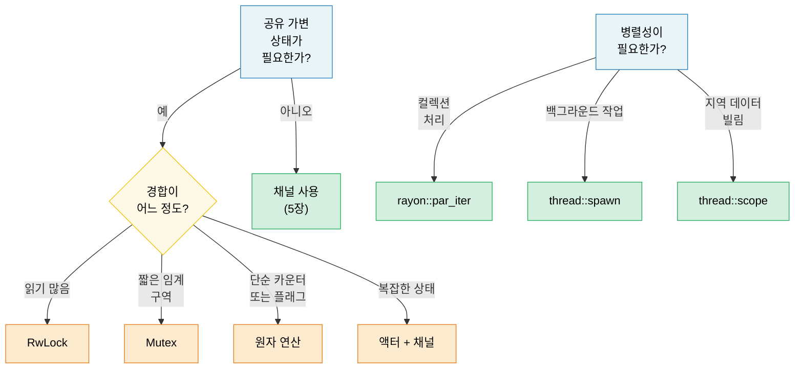

# 6. 동시성 vs 병렬성 vs 스레드 🟡

> **이 장에서 배울 내용:**
> - 동시성과 병렬성의 정확한 구분
> - OS 스레드, 스코프 스레드, 데이터 병렬성용 rayon
> - 공유 상태: Arc, Mutex, RwLock, 원자 연산, Condvar
> - OnceLock/LazyLock 지연 초기화와 락프리 패턴

<a id="terminology-concurrency-parallelism"></a>
## 용어: 동시성 ≠ 병렬성

두 용어는 자주 혼동됩니다. 구분은 다음과 같습니다:

| | 동시성 | 병렬성 |
|---|---|---|
| **정의** | 여러 작업이 진행될 수 있게 관리함 | 여러 작업을 동시에 실행함 |
| **하드웨어** | 코어 하나로도 충분 | 여러 코어 필요 |
| **비유** | 요리사 한 명, 요리 여러 개(번갈아 함) | 요리사 여러 명, 각자 요리 |
| **Rust 도구** | `async/await`, 채널, `select!` | `rayon`, `thread::spawn`, `par_iter()` |

```text
동시성(단일 코어):           병렬성(멀티 코어):
                                      
Task A: ██░░██░░██                   Task A: ██████████
Task B: ░░██░░██░░                   Task B: ██████████
─────────────────→ time              ─────────────────→ time
(한 코어에서 시간 분할)              (두 코어에서 동시)
```

<a id="stdthread-os-threads"></a>
### std::thread — OS 스레드

Rust 스레드는 OS 스레드와 1:1로 대응합니다. 각각 스택이 따로 있습니다(보통 2–8MB):

```rust
use std::thread;
use std::time::Duration;

fn main() {
    // 스레드 생성 — 클로저를 받음
    let handle = thread::spawn(|| {
        for i in 0..5 {
            println!("spawned thread: {i}");
            thread::sleep(Duration::from_millis(100));
        }
        42 // 반환값
    });

    // 메인 스레드에서 동시에 작업
    for i in 0..3 {
        println!("main thread: {i}");
        thread::sleep(Duration::from_millis(150));
    }

    // 스레드 종료 대기 및 반환값
    let result = handle.join().unwrap(); // 스레드가 패닉하면 unwrap도 패닉
    println!("Thread returned: {result}");
}
```

**Thread::spawn 타입 요구사항**:

```rust
// 클로저는:
// 1. Send — 다른 스레드로 옮길 수 있어야 함
// 2. 'static — 호출 스코프에서 빌릴 수 없음
// 3. FnOnce — 캡처한 변수의 소유권을 가짐

let data = vec![1, 2, 3];

// ❌ data를 빌림 — 'static 아님
// thread::spawn(|| println!("{data:?}"));

// ✅ 소유권을 스레드로 이동
thread::spawn(move || println!("{data:?}"));
// data는 여기서 더 이상 사용 불가
```

<a id="scoped-threads-stdthreadscope"></a>
### 스코프 스레드(std::thread::scope)

Rust 1.63부터 스코프 스레드가 `'static` 요구를 없앱니다 — 부모 스코프에서 빌릴 수 있습니다:

```rust
use std::thread;

fn main() {
    let mut data = vec![1, 2, 3, 4, 5];

    thread::scope(|s| {
        // 스레드 1: 공유 참조 빌림
        s.spawn(|| {
            let sum: i32 = data.iter().sum();
            println!("Sum: {sum}");
        });

        // 스레드 2: 공유 참조 빌림(읽기 여러 개 OK)
        s.spawn(|| {
            let max = data.iter().max().unwrap();
            println!("Max: {max}");
        });

        // ❌ 공유 빌림이 있는 동안 가변 빌림 불가:
        // s.spawn(|| data.push(6));
    });
    // 모든 스코프 스레드가 여기서 join — 스코프 반환 전에 보장

    // 이제 변경 안전 — 모든 스레드 종료 후
    data.push(6);
    println!("Updated: {data:?}");
}
```

> **중요**: 스코프 스레드 이전에는 모든 것을 스레드와 공유하려고 `Arc::clone()`을
> 남발했습니다. 이제 직접 빌릴 수 있고, 컴파일러가 데이터가 스코프를 벗어나기 전에
> 모든 스레드가 끝났음을 증명합니다.

<a id="rayon-data-parallelism"></a>
### rayon — 데이터 병렬성

`rayon`은 병렬 이터레이터로 작업을 스레드 풀에 자동 분배합니다:

```rust,ignore
// Cargo.toml: rayon = "1"
use rayon::prelude::*;

fn main() {
    let data: Vec<u64> = (0..1_000_000).collect();

    // 순차:
    let sum_seq: u64 = data.iter().map(|x| x * x).sum();

    // 병렬 — .iter()만 .par_iter()로 바꿈:
    let sum_par: u64 = data.par_iter().map(|x| x * x).sum();

    assert_eq!(sum_seq, sum_par);

    // 병렬 정렬:
    let mut numbers = vec![5, 2, 8, 1, 9, 3];
    numbers.par_sort();

    // map/filter/collect 병렬 처리:
    let results: Vec<_> = data
        .par_iter()
        .filter(|&&x| x % 2 == 0)
        .map(|&x| expensive_computation(x))
        .collect();
}

fn expensive_computation(x: u64) -> u64 {
    // CPU 무거운 작업 시뮬레이션
    (0..1000).fold(x, |acc, _| acc.wrapping_mul(7).wrapping_add(13))
}
```

**rayon vs 스레드**:

| 사용 | 언제 |
|-----|------|
| `rayon::par_iter()` | 컬렉션 병렬 처리(map, filter, reduce) |
| `thread::spawn` | 장기 백그라운드 작업, I/O 워커 |
| `thread::scope` | 지역 데이터를 빌리는 단기 병렬 작업 |
| `async` + `tokio` | I/O 바운드 동시성(네트워크, 파일) |

<a id="shared-state-arc-mutex-rwlock-atomics"></a>
### 공유 상태: Arc, Mutex, RwLock, 원자 연산

스레드가 가변 공유 상태가 필요할 때 Rust는 안전한 추상화를 제공합니다:

```rust
use std::sync::{Arc, Mutex, RwLock};
use std::sync::atomic::{AtomicU64, Ordering};
use std::thread;

// --- Arc<Mutex<T>>: 공유 + 배타적 접근 ---
fn mutex_example() {
    let counter = Arc::new(Mutex::new(0u64));
    let mut handles = vec![];

    for _ in 0..10 {
        let counter = Arc::clone(&counter);
        handles.push(thread::spawn(move || {
            for _ in 0..1000 {
                let mut guard = counter.lock().unwrap();
                *guard += 1;
            } // Guard drop → 락 해제
        }));
    }

    for h in handles { h.join().unwrap(); }
    println!("Counter: {}", counter.lock().unwrap()); // 10000
}

// --- Arc<RwLock<T>>: 읽기 여러 개 또는 쓰기 하나 ---
fn rwlock_example() {
    let config = Arc::new(RwLock::new(String::from("initial")));

    // 읽기 여러 개 — 서로 막지 않음
    let readers: Vec<_> = (0..5).map(|id| {
        let config = Arc::clone(&config);
        thread::spawn(move || {
            let guard = config.read().unwrap();
            println!("Reader {id}: {guard}");
        })
    }).collect();

    // 쓰기 — 모든 읽기가 끝날 때까지 대기
    {
        let mut guard = config.write().unwrap();
        *guard = "updated".to_string();
    }

    for r in readers { r.join().unwrap(); }
}

// --- 원자 연산: 단순 값은 락 없이 ---
fn atomic_example() {
    let counter = Arc::new(AtomicU64::new(0));
    let mut handles = vec![];

    for _ in 0..10 {
        let counter = Arc::clone(&counter);
        handles.push(thread::spawn(move || {
            for _ in 0..1000 {
                counter.fetch_add(1, Ordering::Relaxed);
                // 락 없음 — 하드웨어 원자 명령
            }
        }));
    }

    for h in handles { h.join().unwrap(); }
    println!("Atomic counter: {}", counter.load(Ordering::Relaxed)); // 10000
}
```

<a id="quick-comparison"></a>
### 빠른 비교

| 원시 타입 | 사용 사례 | 비용 | 경합 |
|-----------|----------|------|------------|
| `Mutex<T>` | 짧은 임계 구역 | 락 획득·해제 | 스레드가 줄 서서 대기 |
| `RwLock<T>` | 읽기 많고 쓰기 드묾 | 읽기-쓰기 락 | 읽기는 동시, 쓰기는 배타 |
| `AtomicU64` 등 | 카운터, 플래그 | 하드웨어 CAS | 락프리 — 대기 없음 |
| 채널 | 메시지 전달 | 큐 연산 | 생산자/소비자 분리 |

<a id="condition-variables-condvar"></a>
### 조건 변수(`Condvar`)

`Condvar`는 다른 스레드가 조건이 참이라고 시그널할 때까지 **대기**하게 하며, busy-loop 없이 동작합니다. 항상 `Mutex`와 짝을 이룹니다:

```rust
use std::sync::{Arc, Mutex, Condvar};
use std::thread;

let pair = Arc::new((Mutex::new(false), Condvar::new()));
let pair2 = Arc::clone(&pair);

// 스레드: ready == true가 될 때까지 대기
let handle = thread::spawn(move || {
    let (lock, cvar) = &*pair2;
    let mut ready = lock.lock().unwrap();
    while !*ready {
        ready = cvar.wait(ready).unwrap(); // 원자적으로 unlock + sleep
    }
    println!("Worker: condition met, proceeding");
});

// 메인: ready = true 설정 후 시그널
{
    let (lock, cvar) = &*pair;
    let mut ready = lock.lock().unwrap();
    *ready = true;
    cvar.notify_one(); // 대기 스레드 하나 깨움(여러 개면 notify_all)
}
handle.join().unwrap();
```

> **패턴**: `wait()`가 돌아온 뒤에도 조건을 `while`로 **다시 확인**하세요 —
> OS가 가짜 깨움(spurious wakeup)을 허용합니다.

<a id="lazy-initialization-oncelock-and-lazylock"></a>
### 지연 초기화: OnceLock과 LazyLock

Rust 1.80 이전에는 런타임 계산이 필요한 전역 static(설정 파싱, 정규식 컴파일 등)에
`lazy_static!` 매크로나 `once_cell` 크레이트가 필요했습니다. 표준 라이브러리에 이제 두 타입이 있습니다:

```rust
use std::sync::{OnceLock, LazyLock};
use std::collections::HashMap;

// OnceLock — `get_or_init`로 첫 사용 시 초기화.
// 인자에 따라 초기값이 달라질 때 유용.
static CONFIG: OnceLock<HashMap<String, String>> = OnceLock::new();

fn get_config() -> &'static HashMap<String, String> {
    CONFIG.get_or_init(|| {
        // 비용 큼: 설정 파일 읽기·파싱 — 정확히 한 번만 실행.
        let mut m = HashMap::new();
        m.insert("log_level".into(), "info".into());
        m
    })
}

// LazyLock — 첫 접근 시 초기화, 정의 위치에 클로저.
// lazy_static!과 동등하지만 매크로 없음.
static REGEX: LazyLock<regex::Regex> = LazyLock::new(|| {
    regex::Regex::new(r"^[a-zA-Z0-9_]+$").unwrap()
});

fn is_valid_identifier(s: &str) -> bool {
    REGEX.is_match(s) // 첫 호출에서 정규식 컴파일; 이후 재사용
}
```

| 타입 | 안정화 | 초기화 시점 | 쓸 때 |
|------|-----------|-------------|----------|
| `OnceLock<T>` | Rust 1.70 | 호출 지점(`get_or_init`) | 인자에 따라 초기화가 달라질 때 |
| `LazyLock<T>` | Rust 1.80 | 정의 지점(클로저) | 초기화가 자기 완결적일 때 |
| `lazy_static!` | — | 정의 지점(매크로) | 1.80 이전 코드베이스(이전하세요) |
| `const fn` + `static` | 항상 | 컴파일 타임 | 값이 컴파일 타임에 계산 가능할 때 |

> **이전 팁**: `lazy_static! { static ref X: T = expr; }`를
> `static X: LazyLock<T> = LazyLock::new(|| expr);`로 바꾸면 — 의미 동일, 매크로 없음,
> 외부 의존성 없음.

<a id="lock-free-patterns"></a>
### 락프리 패턴

고성능 코드에서는 락을 아예 피합니다:

```rust
use std::sync::atomic::{AtomicBool, AtomicUsize, Ordering};
use std::sync::Arc;

// 패턴 1: 스핀 락(교육용 — 실무에서는 std::sync::Mutex 선호)
// ⚠️ 경고: 이건 교육 예제만. 진짜 스핀락에는:
//   - RAII 가드(패닉 시에도 영원히 데드락 안 나게)
//   - 공정성(경합 시 기아 방지)
//   - 백오프(지수 백오프, OS에 yield)
// 프로덕션에서는 std::sync::Mutex 또는 parking_lot::Mutex 사용.
struct SpinLock {
    locked: AtomicBool,
}

impl SpinLock {
    fn new() -> Self { SpinLock { locked: AtomicBool::new(false) } }

    fn lock(&self) {
        while self.locked
            .compare_exchange_weak(false, true, Ordering::Acquire, Ordering::Relaxed)
            .is_err()
        {
            std::hint::spin_loop(); // CPU 힌트: 스핀 중
        }
    }

    fn unlock(&self) {
        self.locked.store(false, Ordering::Release);
    }
}

// 패턴 2: 락프리 SPSC(단일 생산자 단일 소비자)
// 프로덕션에서는 crossbeam::queue::ArrayQueue 등 사용
// 직접 구현은 학습용.

// 패턴 3: 대기 없는 읽기용 시퀀스 카운터
// ⚠️ 단일 머신 워드(u64, f64)에 최적; 더 넓은 T는 읽기에서 찢어질 수 있음.
struct SeqLock<T: Copy> {
    seq: AtomicUsize,
    data: std::cell::UnsafeCell<T>,
}

unsafe impl<T: Copy + Send> Sync for SeqLock<T> {}

impl<T: Copy> SeqLock<T> {
    fn new(val: T) -> Self {
        SeqLock {
            seq: AtomicUsize::new(0),
            data: std::cell::UnsafeCell::new(val),
        }
    }

    fn read(&self) -> T {
        loop {
            let s1 = self.seq.load(Ordering::Acquire);
            if s1 & 1 != 0 { continue; } // Writer 진행 중, 재시도

            // SAFETY: ptr::read_volatile로 컴파일러의 재순서/캐시 방지.
            // SeqLock 프로토콜(s1 == s2 재확인)으로 writer가 활성일 때 재시도.
            // C 커널 SeqLock과 같이 동시성 아래 데이터 읽기에 volatile/relaxed 의미가 필요.
            let value = unsafe { core::ptr::read_volatile(self.data.get() as *const T) };

            // Acquire 펜스: 시퀀스 카운터 재확인 전에 데이터 읽기가 정렬되도록.
            std::sync::atomic::fence(Ordering::Acquire);
            let s2 = self.seq.load(Ordering::Relaxed);

            if s1 == s2 { return value; } // Writer 개입 없음
            // else 재시도
        }
    }

    /// # Safety contract
    /// `write()`는 한 번에 한 스레드만 호출해야 함. 여러 writer가 필요하면
    /// 외부 `Mutex`로 `write()` 호출을 감쌀 것.
    fn write(&self, val: T) {
        // 홀수로 증가(쓰기 진행 중 신호).
        // AcqRel: Acquire 쪽은 이후 데이터 쓰기가 이 증가보다 앞으로 재배치되지 않게
        // (reader가 홀수를 본 뒤에도 부분 쓰기를 볼 수 없게). Release 쪽은
        // 단일 writer에는 기술적으로 불필요하지만 무해하고 일관됨.
        self.seq.fetch_add(1, Ordering::AcqRel);
        unsafe { *self.data.get() = val; }
        // 짝수로 증가(쓰기 완료).
        // Release: reader가 짝수 seq를 보기 전에 데이터 쓰기가 보이게.
        self.seq.fetch_add(1, Ordering::Release);
    }
}
```

> **⚠️ Rust 메모리 모델 주의**: `write()`의 `UnsafeCell` 비원자 쓰기와 `read()`의
> `ptr::read_volatile` 비원자 읽기는 Rust 추상 기계 관점에서는 기술적으로 데이터 레이스입니다 —
> SeqLock 프로토콜이 stale 데이터에서 항상 재시도하게 하더라도요. C 커널 SeqLock과 같이
> 현대 하드웨어에서는 단일 머신 워드 `T`(예: `u64`)에 대해 실무적으로 건전합니다.
> 더 넓은 타입은 데이터 필드에 `AtomicU64`를 쓰거나 `Mutex`로 감싸세요.
> [Rust unsafe 코드 가이드라인](https://rust-lang.github.io/unsafe-code-guidelines/)에서
> `UnsafeCell` 동시성에 대한 논의는 계속 발전 중입니다.

> **실무 조언**: 락프리 코드는 맞추기 어렵습니다. 프로파일링으로 락 경합이 병목이 아니면
> `Mutex`나 `RwLock`을 쓰세요. 락프리가 필요하면 검증된 크레이트(`crossbeam`, `arc-swap`, `dashmap`)를
> 직접 구현보다 우선하세요.

> **핵심 정리 — 동시성**
> - 스코프 스레드(`thread::scope`)는 `Arc` 없이 스택 데이터를 빌릴 수 있게 함
> - `rayon::par_iter()`는 이터레이터를 한 메서드로 병렬화
> - `lazy_static!` 대신 `OnceLock`/`LazyLock`; 원자 연산 전에는 `Mutex`
> - 락프리는 어렵다 — 검증된 크레이트를 선호

> **더 보기:** 메시지 전달 동시성은 [5장 — 채널](ch05-channels-and-message-passing.md). Arc/Rc 세부는 [8장 — 스마트 포인터](ch08-smart-pointers-and-interior-mutability.md).



---

<a id="exercise-parallel-map-with-scoped-threads"></a>
### 연습: 스코프 스레드로 병렬 map ★★ (~25분)

`parallel_map<T, R>(data: &[T], f: fn(&T) -> R, num_threads: usize) -> Vec<R>` 함수를 작성하세요.
`data`를 `num_threads`개 청크로 나누고 각각 스코프 스레드에서 처리합니다. `rayon`은 쓰지 말고 `std::thread::scope`를 쓰세요.

<details>
<summary>🔑 해답</summary>

```rust
fn parallel_map<T: Sync, R: Send>(data: &[T], f: fn(&T) -> R, num_threads: usize) -> Vec<R> {
    let chunk_size = (data.len() + num_threads - 1) / num_threads;
    let mut results = Vec::with_capacity(data.len());

    std::thread::scope(|s| {
        let mut handles = Vec::new();
        for chunk in data.chunks(chunk_size) {
            handles.push(s.spawn(move || {
                chunk.iter().map(f).collect::<Vec<_>>()
            }));
        }
        for h in handles {
            results.extend(h.join().unwrap());
        }
    });

    results
}

fn main() {
    let data: Vec<u64> = (1..=20).collect();
    let squares = parallel_map(&data, |x| x * x, 4);
    assert_eq!(squares, (1..=20).map(|x: u64| x * x).collect::<Vec<_>>());
    println!("Parallel squares: {squares:?}");
}
```

</details>

***
