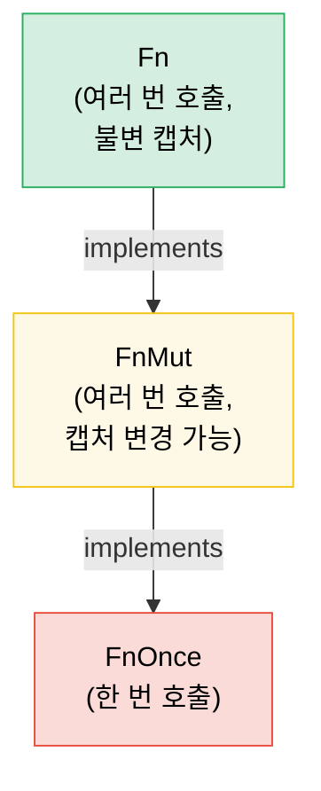

# 7. 클로저와 고차 함수 🟢

> **이 장에서 배울 내용:**
> - 세 가지 클로저 트레잇(`Fn`, `FnMut`, `FnOnce`)과 캡처 동작
> - 클로저를 인자로 넘기고 함수에서 반환하기
> - 함수형 스타일을 위한 컴비네이터 체인과 이터레이터 어댑터
> - 적절한 트레잇 바운드로 직접 고차 API 설계하기

<a id="fn-fnmut-fnonce-the-closure-traits"></a>
## Fn, FnMut, FnOnce — 클로저 트레잇

Rust의 모든 클로저는 변수를 어떻게 캡처하느냐에 따라 세 트레잇 중 하나 이상을 구현합니다.

```rust
// FnOnce — 캡처한 값을 소비 (한 번만 호출 가능)
let name = String::from("Alice");
let greet = move || {
    println!("Hello, {name}!"); // `name`의 소유권을 가져감
    drop(name); // name 소비
};
greet(); // ✅ 첫 호출
// greet(); // ❌ 다시 호출 불가 — `name`이 이미 소비됨

// FnMut — 캡처한 값을 가변으로 빌림 (여러 번 호출 가능)
let mut count = 0;
let mut increment = || {
    count += 1; // `count`를 가변으로 빌림
};
increment(); // count == 1
increment(); // count == 2

// Fn — 캡처한 값을 불변으로 빌림 (여러 번 호출, 동시 호출 가능)
let prefix = "Result";
let display = |x: i32| {
    println!("{prefix}: {x}"); // `prefix`를 불변으로 빌림
};
display(1);
display(2);
```

**계층**: `Fn` : `FnMut` : `FnOnce` — 각각 다음 트레잇의 서브트레잇입니다.

```text
FnOnce  ← 모든 클로저는 최소 한 번은 호출 가능
 ↑
FnMut   ← 반복 호출 가능 (상태 변경 가능)
 ↑
Fn      ← 반복 호출·동시 호출 가능 (캡처 변경 없음)
```

클로저가 `Fn`을 구현하면 `FnMut`과 `FnOnce`도 구현합니다.

<a id="closures-as-parameters-and-return-values"></a>
### 클로저를 인자·반환값으로

```rust
// --- 인자 ---

// 정적 디스패치 (단형화 — 가장 빠름)
fn apply_twice<F: Fn(i32) -> i32>(f: F, x: i32) -> i32 {
    f(f(x))
}

// impl Trait로도 동일하게 씀:
fn apply_twice_v2(f: impl Fn(i32) -> i32, x: i32) -> i32 {
    f(f(x))
}

// 동적 디스패치 (트레잇 객체 — 유연, 약간의 오버헤드)
fn apply_dyn(f: &dyn Fn(i32) -> i32, x: i32) -> i32 {
    f(x)
}

// --- 반환값 ---

// 익명 타입이므로 값으로 클로저를 반환하려면 박싱이 필요:
fn make_adder(n: i32) -> Box<dyn Fn(i32) -> i32> {
    Box::new(move |x| x + n)
}

// impl Trait (단순, 단형화되지만 동적이 될 수 없음)
fn make_adder_v2(n: i32) -> impl Fn(i32) -> i32 {
    move |x| x + n
}

fn main() {
    let double = |x: i32| x * 2;
    println!("{}", apply_twice(double, 3)); // 12

    let add5 = make_adder(5);
    println!("{}", add5(10)); // 15
}
```

<a id="combinator-chains-and-iterator-adapters"></a>
### 컴비네이터 체인과 이터레이터 어댑터

고차 함수는 이터레이터와 함께 빛을 발합니다 — Rust다운 관용구입니다.

```rust
// C 스타일 루프 (명령형):
let data = vec![1, 2, 3, 4, 5, 6, 7, 8, 9, 10];
let mut result = Vec::new();
for x in &data {
    if x % 2 == 0 {
        result.push(x * x);
    }
}

// 관용적 Rust (함수형 컴비네이터 체인):
let result: Vec<i32> = data.iter()
    .filter(|&&x| x % 2 == 0)
    .map(|&x| x * x)
    .collect();

// 성능은 동일 — 이터레이터는 지연 평가되고 LLVM이 최적화함
assert_eq!(result, vec![4, 16, 36, 64, 100]);
```

**자주 쓰는 컴비네이터 요약**:

| 컴비네이터 | 하는 일 | 예 |
|-----------|-------------|---------|
| `.map(f)` | 각 원소 변환 | `.map(|x| x * 2)` |
| `.filter(p)` | 조건이 참인 원소만 유지 | `.filter(|x| x > &5)` |
| `.filter_map(f)` | 맵 + 필터 한 번에 (`Option` 반환) | `.filter_map(|x| x.parse().ok())` |
| `.flat_map(f)` | 맵 후 중첩 이터레이터 평탄화 | `.flat_map(|s| s.chars())` |
| `.fold(init, f)` | 하나의 값으로 축약 (C#의 `Aggregate`에 해당) | `.fold(0, |acc, x| acc + x)` |
| `.any(p)` / `.all(p)` | 단락 불리언 검사 | `.any(|x| x > 100)` |
| `.enumerate()` | 인덱스 추가 | `.enumerate().map(|(i, x)| ...)` |
| `.zip(other)` | 다른 이터레이터와 짝짓기 | `.zip(labels.iter())` |
| `.take(n)` / `.skip(n)` | 앞 N개 / N개 건너뛰기 | `.take(10)` |
| `.chain(other)` | 두 이터레이터 이어 붙이기 | `.chain(extra.iter())` |
| `.peekable()` | 소비하지 않고 앞을 봄 | `.peek()` |
| `.collect()` | 컬렉션으로 모음 | `.collect::<Vec<_>>()` |

<a id="implementing-your-own-higher-order-apis"></a>
### 직접 고차 API 설계하기

호출부에서 클로저로 동작을 바꿀 수 있게 API를 설계합니다.

```rust
/// 재시도 전략을 클로저로 설정하는 연산
fn retry<T, E, F, S>(
    mut operation: F,
    mut should_retry: S,
    max_attempts: usize,
) -> Result<T, E>
where
    F: FnMut() -> Result<T, E>,
    S: FnMut(&E, usize) -> bool, // (에러, 시도 횟수) → 다시 시도?
{
    for attempt in 1..=max_attempts {
        match operation() {
            Ok(val) => return Ok(val),
            Err(e) if attempt < max_attempts && should_retry(&e, attempt) => {
                continue;
            }
            Err(e) => return Err(e),
        }
    }
    unreachable!()
}

// 사용 — 호출자가 재시도 로직을 제어:
```

```rust
# fn connect_to_database() -> Result<(), String> { Ok(()) }
# fn http_get(_url: &str) -> Result<String, String> { Ok(String::new()) }
# trait TransientError { fn is_transient(&self) -> bool; }
# impl TransientError for String { fn is_transient(&self) -> bool { true } }
# let url = "http://example.com";
let result = retry(
    || connect_to_database(),
    |err, attempt| {
        eprintln!("Attempt {attempt} failed: {err}");
        true // 항상 재시도
    },
    3,
);

// 사용 — 일시적 오류만 재시도:
let result = retry(
    || http_get(url),
    |err, _| err.is_transient(), // 일시적 오류만 재시도
    5,
);
```

<a id="the-with-pattern--bracketed-resource-access"></a>
### `with` 패턴 — 괄호로 묶인 리소스 접근

어떤 동안만 리소스를 특정 상태로 두었다가, 호출자 코드가 어떻게 빠져나가든(조기 반환, `?`, 패닉) **반드시** 원래대로 돌려놓아야 할 때가 있습니다. 리소스를 직접 노출하고 호출자가 준비·정리를 기억하길 바라기보다, **클로저로 빌려주는** 방식이 낫습니다.

```text
설정 → 클로저에 리소스 넘기며 호출 → 정리
```

호출자는 설정/정리를 직접 만지지 않습니다. 잊을 수도, 틀릴 수도 없고, 클로저 범위 밖으로 리소스를 들고 나갈 수도 없습니다.

<a id="example-gpio-pin-direction"></a>
#### 예: GPIO 핀 방향

GPIO 컨트롤러는 양방향 I/O가 가능한 핀을 다룹니다. 어떤 호출자는 입력, 어떤 호출자는 출력이 필요합니다. 원시 핀 접근을 주고 방향 설정을 호출자에게 맡기지 않고, 컨트롤러가 `with_pin_input`과 `with_pin_output`을 제공합니다.

```rust
/// GPIO 핀 방향 — 공개하지 않음, 호출자가 직접 바꾸지 않음
#[derive(Debug, Clone, Copy, PartialEq)]
enum Direction { In, Out }

/// 클로저에 빌려주는 GPIO 핀 핸들. 저장·복제 불가 —
/// 콜백이 실행되는 동안만 존재합니다.
pub struct GpioPin<'a> {
    pin_number: u8,
    _controller: &'a GpioController,
}

impl GpioPin<'_> {
    pub fn read(&self) -> bool {
        // 하드웨어 레지스터에서 핀 레벨 읽기
        println!("  reading pin {}", self.pin_number);
        true // 스텁
    }

    pub fn write(&self, high: bool) {
        // 하드웨어 레지스터로 핀 구동
        println!("  writing pin {} = {high}", self.pin_number);
    }
}

pub struct GpioController {
    current_direction: std::cell::Cell<Option<Direction>>,
}

impl GpioController {
    pub fn new() -> Self {
        GpioController {
            current_direction: std::cell::Cell::new(None),
        }
    }

    /// 핀을 입력으로 설정하고 클로저를 실행한 뒤 상태 복원.
    /// 호출자는 콜백 동안만 살아 있는 `GpioPin`을 받습니다.
    pub fn with_pin_input<R>(
        &self,
        pin: u8,
        mut f: impl FnMut(&GpioPin<'_>) -> R,
    ) -> R {
        let prev = self.current_direction.get();
        self.set_direction(pin, Direction::In);
        let handle = GpioPin { pin_number: pin, _controller: self };
        let result = f(&handle);
        // 이전 방향 복원(또는 그대로 — 정책 선택)
        if let Some(dir) = prev {
            self.set_direction(pin, dir);
        }
        result
    }

    /// 핀을 출력으로 설정하고 클로저를 실행한 뒤 상태 복원.
    pub fn with_pin_output<R>(
        &self,
        pin: u8,
        mut f: impl FnMut(&GpioPin<'_>) -> R,
    ) -> R {
        let prev = self.current_direction.get();
        self.set_direction(pin, Direction::Out);
        let handle = GpioPin { pin_number: pin, _controller: self };
        let result = f(&handle);
        if let Some(dir) = prev {
            self.set_direction(pin, dir);
        }
        result
    }

    fn set_direction(&self, pin: u8, dir: Direction) {
        println!("  [hw] pin {pin} → {dir:?}");
        self.current_direction.set(Some(dir));
    }
}

fn main() {
    let gpio = GpioController::new();

    // 호출자 1: 입력 필요 — 방향 관리 방식은 몰라도 됨
    let level = gpio.with_pin_input(4, |pin| {
        pin.read()
    });
    println!("Pin 4 level: {level}");

    // 호출자 2: 출력 필요 — 같은 API 형태, 다른 보장
    gpio.with_pin_output(4, |pin| {
        pin.write(true);
        // 추가 작업...
        pin.write(false);
    });

    // 클로저 밖에서 핀 핸들 사용 불가:
    // let escaped_pin = gpio.with_pin_input(4, |pin| pin);
    // ❌ ERROR: borrowed value does not live long enough
}
```

**`with` 패턴이 보장하는 것:**
- 호출자 코드가 돌기 **전에** 방향이 **항상** 설정됨
- 클로저가 조기 반환해도 **이후에** 방향이 **항상** 복원됨
- `GpioPin` 핸들은 클로저 밖으로 **나갈 수 없음** — 컨트롤러 참조에 묶인 수명으로 borrow checker가 강제
- 호출자는 `Direction`을 import하지 않고 `set_direction`도 부르지 않음 — API를 **잘못 쓸 수 없음**

<a id="where-this-pattern-appears"></a>
#### 이 패턴이 나오는 곳

`with` 패턴은 표준 라이브러리와 생태계 전반에 있습니다.

| API | 설정 | 콜백 | 정리 |
|-----|-------|----------|----------|
| `std::thread::scope` | 스코프 생성 | `\|s\| { s.spawn(...) }` | 모든 스레드 조인 |
| `Mutex::lock` | 락 획득 | `MutexGuard` 사용(RAII, 클로저는 아니지만 같은 아이디어) | 드롭 시 해제 |
| `tempfile::tempdir` | 임시 디렉터리 생성 | 경로 사용 | 드롭 시 삭제 |
| `std::io::BufWriter::new` | 쓰기 버퍼 | 쓰기 연산 | 드롭 시 플러시 |
| 위의 GPIO `with_pin_*` | 방향 설정 | 핀 핸들 사용 | 방향 복원 |

클로저 기반 변형이 특히 강할 때:
- **설정과 정리가 짝**이고 하나를 빠뜨리면 버그일 때
- **리소스가 연산보다 오래 살아 있으면 안 될 때** — borrow checker가 자연스럽게 강제
- **여러 구성이 있을 때** (`with_pin_input` vs `with_pin_output`) — 각 `with_*` 메서드가 다른 설정을 캡슐화하고 호출자에게 설정을 노출하지 않음

> **`with` vs RAII(Drop):** 둘 다 정리를 보장합니다. 호출자가 여러 문·함수 호출에 걸쳐 리소스를 잡고 있어야 하면 RAII/`Drop`을 쓰세요. 연산이 **괄호 하나**(설정 → 작업 블록 → 정리)이고 호출자가 괄호를 깨뜨리면 안 될 때는 `with`을 쓰세요.

> **API 설계에서 FnMut vs Fn**: 기본은 `FnMut` 바운드 — 호출자가 `Fn` 또는 `FnMut` 클로저를 넘길 수 있어 가장 유연합니다. 여러 스레드에서 동시에 호출해야 할 때만 `Fn`을 요구하고, 정확히 한 번만 호출할 때만 `FnOnce`을 요구하세요.

> **핵심 정리 — 클로저**
> - `Fn`은 불변 빌림, `FnMut`은 가변 빌림, `FnOnce`은 소비 — API에 필요한 **가장 약한** 바운드를 받으세요
> - 인자에는 `impl Fn`, 저장에는 `Box<dyn Fn>`, 반환에는 `impl Fn`(또는 동적이면 `Box<dyn Fn>`)
> - 컴비네이터 체인(`map`, `filter`, `and_then`)은 깔끔하게 조합되고 타이트한 루프로 인라인됩니다
> - `with` 패턴(클로저로 괄호 접근)은 설정/정리를 보장하고 리소스 이탈을 막습니다 — 호출자가 구성 수명주기를 다루면 안 될 때 쓰세요

> **함께 보기:** 트레잇 객체와 `Fn`/`FnMut`/`FnOnce` 관계는 [2장 — 트레잇 심화](ch02-traits-in-depth.md). 컴비네이터 vs 루프 선택은 [8장 — 함수형 vs 명령형](ch08-functional-vs-imperative-when-elegance-wins.md). 인자 API 설계는 [15장 — API 설계](ch15-crate-architecture-and-api-design.md).



> 모든 `Fn`은 `FnMut`이기도 하고, 모든 `FnMut`은 `FnOnce`이기도 합니다. 기본적으로 `FnMut`을 받으세요 — 호출자에게 가장 유연한 바운드입니다.

---

<a id="exercise-higher-order-combinator-pipeline"></a>
### 연습: 고차 컴비네이터 파이프라인 ★★ (~25분)

변환을 이어 붙이는 `Pipeline` 구조체를 만드세요. `.pipe(f)`로 변환을 추가하고 `.execute(input)`으로 전체 체인을 실행해야 합니다.

<details>
<summary>🔑 해답</summary>

```rust
struct Pipeline<T> {
    transforms: Vec<Box<dyn Fn(T) -> T>>,
}

impl<T: 'static> Pipeline<T> {
    fn new() -> Self {
        Pipeline { transforms: Vec::new() }
    }

    fn pipe(mut self, f: impl Fn(T) -> T + 'static) -> Self {
        self.transforms.push(Box::new(f));
        self
    }

    fn execute(self, input: T) -> T {
        self.transforms.into_iter().fold(input, |val, f| f(val))
    }
}

fn main() {
    let result = Pipeline::new()
        .pipe(|s: String| s.trim().to_string())
        .pipe(|s| s.to_uppercase())
        .pipe(|s| format!(">>> {s} <<<"))
        .execute("  hello world  ".to_string());

    println!("{result}"); // >>> HELLO WORLD <<<

    let result = Pipeline::new()
        .pipe(|x: i32| x * 2)
        .pipe(|x| x + 10)
        .pipe(|x| x * x)
        .execute(5);

    println!("{result}"); // (5*2 + 10)^2 = 400
}
```

</details>

***

