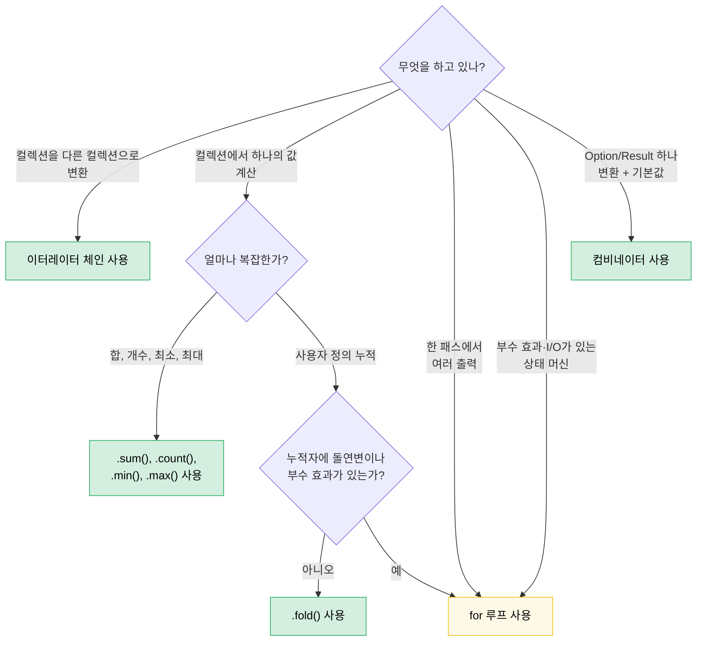

<a id="chapter-8-functional-vs-imperative-when-elegance-wins"></a>
# 8장 — 함수형 vs 명령형: 우아함이 이길 때(그리고 지지 않을 때)

> **난이도:** 🟡 중급 | **시간:** 2–3시간 | **선행:** [7장 — 클로저](ch07-closures-and-higher-order-functions.md)

Rust는 함수형과 명령형 스타일을 진짜로 동등하게 씁니다. Haskell(함수형이 기본)이나 C(명령형이 기본)와 달리, Rust는 선택할 수 있고 **무엇을 표현하느냐**에 따라 맞는 쪽이 달라집니다. 이 장에서는 잘 고르는 판단력을 기릅니다.

**핵심 원칙:** 함수형은 **데이터를 파이프라인으로 변환**할 때 빛납니다. 명령형은 **부수 효과로 상태 전이를 다룰 때** 빛납니다. 실제 코드는 둘 다 섞여 있고, **경계가 어디인지** 아는 것이 기술입니다.

---

<a id="81-the-combinator-you-didnt-know-you-wanted"></a>
## 8.1 몰랐던 컴비네이터

많은 Rust 개발자가 이렇게 씁니다.

```rust
let value = if let Some(x) = maybe_config() {
    x
} else {
    default_config()
};
process(value);
```

이렇게 쓸 수 있을 때입니다.

```rust
process(maybe_config().unwrap_or_else(default_config));
```

또 흔한 패턴:

```rust
let display_name = if let Some(name) = user.nickname() {
    name.to_uppercase()
} else {
    "ANONYMOUS".to_string()
};
```

다음과 같습니다.

```rust
let display_name = user.nickname()
    .map(|n| n.to_uppercase())
    .unwrap_or_else(|| "ANONYMOUS".to_string());
```

함수형 버전은 짧을 뿐 아니라 **무슨 일이 일어나는지**(변환 후 기본값)를 말해 주고, 제어 흐름을 따라가며 두 갈래가 같은 곳으로 모인다는 걸 눈으로 확인할 필요가 없습니다. `if let` 버전은 두 갈래를 읽어야 같은 결론에 도달합니다.

<a id="the-option-combinator-family"></a>
### Option 컴비네이터 계열

멘탈 모델: `Option<T>`는 원소가 하나이거나 비어 있는 컬렉션입니다. `Option`의 컴비네이터는 모두 컬렉션 연산과 대응됩니다.

| 이렇게 씀 | 대신 이렇게 | 전달하는 의미 |
|---|---|---|
| `opt.unwrap_or(default)` | `if let Some(x) = opt { x } else { default }` | "이 값 쓰거나 없으면 대체" |
| `opt.unwrap_or_else(\|\| expensive())` | `if let Some(x) = opt { x } else { expensive() }` | 동일, 기본값은 지연 |
| `opt.map(f)` | `match opt { Some(x) => Some(f(x)), None => None }` | "안쪽만 변환, 부재는 전파" |
| `opt.and_then(f)` | `match opt { Some(x) => f(x), None => None }` | "실패 가능한 연산 연결"(flatmap) |
| `opt.filter(\|x\| pred(x))` | `match opt { Some(x) if pred(&x) => Some(x), _ => None }` | "통과할 때만 유지" |
| `opt.zip(other)` | `if let (Some(a), Some(b)) = (opt, other) { Some((a,b)) } else { None }` | "둘 다 있을 때만" |
| `opt.or(fallback)` | `if opt.is_some() { opt } else { fallback }` | "먼저 있는 쪽" |
| `opt.or_else(\|\| try_another())` | `if opt.is_some() { opt } else { try_another() }` | "대안을 순서대로 시도" |
| `opt.map_or(default, f)` | `if let Some(x) = opt { f(x) } else { default }` | "변환 또는 기본" — 한 줄 |
| `opt.map_or_else(default_fn, f)` | `if let Some(x) = opt { f(x) } else { default_fn() }` | 동일, 양쪽이 클로저 |
| `opt?` | `match opt { Some(x) => x, None => return None }` | "부재를 위로 전파" |

<a id="the-result-combinator-family"></a>
### Result 컴비네이터 계열

`Result<T, E>`에도 같은 패턴이 적용됩니다.

| 이렇게 씀 | 대신 이렇게 | 전달하는 의미 |
|---|---|---|
| `res.map(f)` | `match res { Ok(x) => Ok(f(x)), Err(e) => Err(e) }` | 성공 경로 변환 |
| `res.map_err(f)` | `match res { Ok(x) => Ok(x), Err(e) => Err(f(e)) }` | 에러 변환 |
| `res.and_then(f)` | `match res { Ok(x) => f(x), Err(e) => Err(e) }` | 실패 가능한 연산 연결 |
| `res.unwrap_or_else(\|e\| default(e))` | `match res { Ok(x) => x, Err(e) => default(e) }` | 에러에서 복구 |
| `res.ok()` | `match res { Ok(x) => Some(x), Err(_) => None }` | "에러는 신경 안 씀" |
| `res?` | `match res { Ok(x) => x, Err(e) => return Err(e.into()) }` | 에러를 위로 전파 |

<a id="when-if-let-is-better"></a>
### `if let`이 더 나은 경우

컴비네이터가 지는 경우:

- **`Some` 가지에 문장이 여러 개 필요할 때.** 5줄짜리 `map` 클로저는 5줄짜리 `if let`보다 나쁩니다.
- **제어 흐름 자체가 요점일 때.** `if let Some(connection) = pool.try_get() { /* 사용 */ } else { /* 로그, 재시도, 알림 */ }` — 두 갈래가 진짜로 다른 경로이지, 변환·기본값 패턴이 아닙니다.
- **부수 효과가 지배할 때.** 두 갈래 모두 I/O를 하되 에러 처리가 다르면 컴비네이터 버전이 중요한 차이를 가립니다.

**경험칙:** `else` 가지가 `Some` 가지와 **같은 타입**을 내고 본문이 짧은 **식**이면 컴비네이터를 쓰세요. 가지가 근본적으로 다른 일을 하면 `if let`이나 `match`를 쓰세요.

---

<a id="82-bool-combinators-then-and-then-some"></a>
## 8.2 Bool 컴비네이터: `.then()`과 `.then_some()`

이 패턴도 흔합니다.

```rust
let label = if is_admin {
    Some("ADMIN")
} else {
    None
};
```

Rust 1.62+에서는:

```rust
let label = is_admin.then_some("ADMIN");
```

계산된 값이 필요하면:

```rust
let permissions = is_admin.then(|| compute_admin_permissions());
```

체인에서 특히 강합니다.

```rust
// 명령형
let mut tags = Vec::new();
if user.is_admin { tags.push("admin"); }
if user.is_verified { tags.push("verified"); }
if user.score > 100 { tags.push("power-user"); }

// 함수형
let tags: Vec<&str> = [
    user.is_admin.then_some("admin"),
    user.is_verified.then_some("verified"),
    (user.score > 100).then_some("power-user"),
]
.into_iter()
.flatten()
.collect();
```

함수형 버전은 "조건부 원소로 리스트를 만든다"는 패턴을 드러냅니다. 명령형은 각 `if`가 같은 일(push)하는지 일일이 읽어야 합니다.

---

<a id="83-iterator-chains-vs-loops-the-decision-framework"></a>
## 8.3 이터레이터 체인 vs 루프: 판단 틀

7장에서 기계를 봤다면, 이 절은 판단을 다룹니다.

<a id="when-iterators-win"></a>
### 이터레이터가 이기는 경우

**데이터 파이프라인** — 컬렉션을 여러 단계로 변환:

```rust
// 명령형: 8줄, 가변 변수 2개
let mut results = Vec::new();
for item in inventory {
    if item.category == Category::Server {
        if let Some(temp) = item.last_temperature() {
            if temp > 80.0 {
                results.push((item.id, temp));
            }
        }
    }
}

// 함수형: 6줄, 가변 변수 0, 파이프라인 하나
let results: Vec<_> = inventory.iter()
    .filter(|item| item.category == Category::Server)
    .filter_map(|item| item.last_temperature().map(|t| (item.id, t)))
    .filter(|(_, temp)| *temp > 80.0)
    .collect();
```

함수형이 이기는 이유:
- 각 `filter`가 독립적으로 읽힘
- `mut` 없음 — 데이터가 한 방향으로 흐름
- 파이프라인 단계를 추가·제거·순서 바꾸기에 구조를 뜯지 않아도 됨
- LLVM이 이터레이터 어댑터를 루프와 같은 기계어로 인라인

**집계** — 컬렉션에서 하나의 값 계산:

```rust
// 명령형
let mut total_power = 0.0;
let mut count = 0;
for server in fleet {
    total_power += server.power_draw();
    count += 1;
}
let avg = total_power / count as f64;

// 함수형
let (total_power, count) = fleet.iter()
    .map(|s| s.power_draw())
    .fold((0.0, 0usize), |(sum, n), p| (sum + p, n + 1));
let avg = total_power / count as f64;
```

합만 필요하면 더 단순합니다.

```rust
let total: f64 = fleet.iter().map(|s| s.power_draw()).sum();
```

<a id="when-loops-win"></a>
### 루프가 이기는 경우

**복잡한 상태로 조기 종료:**

```rust
// 이게 명확하고 직접적
let mut best_candidate = None;
for server in fleet {
    let score = evaluate(server);
    if score > threshold {
        if server.is_available() {
            best_candidate = Some(server);
            break; // 찾았으면 즉시 중단
        }
    }
}

// 함수형 버전도 억지는 아님
let best_candidate = fleet.iter()
    .filter(|s| evaluate(s) > threshold)
    .find(|s| s.is_available());
```

잠깐 — 함수형도 꽤 깔끔합니다. 진짜로 지는 경우를 봅시다.

**한 번에 여러 출력을 만드는 경우:**

```rust
// 명령형: 명확, 각 가지가 다른 일
let mut warnings = Vec::new();
let mut errors = Vec::new();
let mut stats = Stats::default();

for event in log_stream {
    match event.severity {
        Severity::Warn => {
            warnings.push(event.clone());
            stats.warn_count += 1;
        }
        Severity::Error => {
            errors.push(event.clone());
            stats.error_count += 1;
            if event.is_critical() {
                alert_oncall(&event);
            }
        }
        _ => stats.other_count += 1,
    }
}

// 함수형: 억지이고 읽기 싫음
let (warnings, errors, stats) = log_stream.iter().fold(
    (Vec::new(), Vec::new(), Stats::default()),
    |(mut w, mut e, mut s), event| {
        match event.severity {
            Severity::Warn => { w.push(event.clone()); s.warn_count += 1; }
            Severity::Error => {
                e.push(event.clone()); s.error_count += 1;
                if event.is_critical() { alert_oncall(event); }
            }
            _ => s.other_count += 1,
        }
        (w, e, s)
    },
);
```

`fold` 버전은 *더 길고*, *읽기 어렵고*, 어차피 돌연변이(`mut` 누적자)가 있습니다. 루프가 이기는 이유:
- 여러 출력을 동시에 쌓음
- 부수 효과(알림)가 로직에 섞임
- 가지 본문이 식이 아니라 문

**I/O가 있는 상태 머신:**

```rust
// 토큰을 읽는 파서 — 루프 자체가 알고리즘
let mut state = ParseState::Start;
loop {
    let token = lexer.next_token()?;
    state = match state {
        ParseState::Start => match token {
            Token::Keyword(k) => ParseState::GotKeyword(k),
            Token::Eof => break,
            _ => return Err(ParseError::UnexpectedToken(token)),
        },
        ParseState::GotKeyword(k) => match token {
            Token::Ident(name) => ParseState::GotName(k, name),
            _ => return Err(ParseError::ExpectedIdentifier),
        },
        // ...더 많은 상태
    };
}
```

더 깔끔한 함수형 대안이 없습니다. `match state`와 함께한 루프가 상태 머신의 자연스러운 표현입니다.

<a id="the-decision-flowchart"></a>
### 판단 플로차트



<a id="sidebar-scoped-mutability-imperative-inside-functional-outside"></a>
### 사이드바: 스코프된 가변성 — 안은 명령형, 밖은 함수형

Rust 블록은 식입니다. 돌연변이를 구성 단계에만 가두고 결과를 불변으로 묶을 수 있습니다.

```rust
use rand::random;

let samples = {
    let mut buf = Vec::with_capacity(10);
    while buf.len() < 10 {
        let reading: f64 = random();
        buf.push(reading);
        if random::<u8>() % 3 == 0 { break; } // 무작위로 일찍 종료
    }
    buf
};
// samples는 불변 — 1~10개 원소
```

안쪽 `buf`만 블록 안에서 가변입니다. 블록이 값을 내놓으면 바깥 `samples`는 불변이고, 이후 `samples.push(...)`는 컴파일러가 거절합니다.

**이터레이터 체인이 아닌 이유:** 이렇게 시도할 수 있습니다.

```rust
let samples: Vec<f64> = std::iter::from_fn(|| Some(random()))
    .take(10)
    .take_while(|_| random::<u8>() % 3 != 0)
    .collect();
```

하지만 `take_while`은 조건을 **실패한 원소를 제외**하므로, 명령형이 보장하는 "최소 하나" 대신 0~9개가 됩니다. `scan`이나 `chain`으로 우회할 수는 있지만 명령형이 더 분명합니다.

**스코프 가변성이 진짜로 이기는 경우:**

| 상황 | 이터레이터가 애매한 이유 |
|---|---|
| **정렬 후 고정** (`sort_unstable()` + `dedup()`) | 둘 다 `()` 반환 — 체인 가능한 출력 없음(itertools에 `.sorted().dedup()` 등이 있으면 사용) |
| **상태적 종료**(데이터와 무관한 조건으로 중단) | `take_while`이 경계 원소를 버림 |
| **여러 단계로 구조체 채우기**(서로 다른 출처에서 필드별) | 자연스러운 단일 파이프라인이 없음 |

**솔직한 기준:** 대부분의 컬렉션 구축에는 이터레이터 체인이나 [itertools](https://docs.rs/itertools)가 선호됩니다. 분기·조기 종료·원자리(in-place) 돌연변이가 단일 파이프라인에 안 맞을 때 스코프 가변성을 쓰세요. 이 패턴의 진짜 가치는 **돌연변이 스코프가 변수 수명보다 작을 수 있다**는 것을 가르치는 것 — C++, C#, Python에서 온 개발자에게도 놀라운 Rust 기본기입니다.

---

<a id="84-the--operator-where-functional-meets-imperative"></a>
## 8.4 `?` 연산자: 함수형과 명령형이 만나는 곳

`?`는 두 스타일을 가장 우아하게 합칩니다. 본질적으로 `.and_then()`과 조기 반환을 합친 것입니다.

```rust
// 이런 and_then 체인...
fn load_config() -> Result<Config, Error> {
    read_file("config.toml")
        .and_then(|contents| parse_toml(&contents))
        .and_then(|table| validate_config(table))
        .and_then(|valid| Config::from_validated(valid))
}

// ...은 이것과 동일
fn load_config() -> Result<Config, Error> {
    let contents = read_file("config.toml")?;
    let table = parse_toml(&contents)?;
    let valid = validate_config(table)?;
    Config::from_validated(valid)
}
```

둘 다 정신적으로는 함수형(에러를 자동 전파)이지만 `?` 버전은 중간에 이름을 붙일 수 있어 다음이 중요할 때 유리합니다.

- 나중에 `contents`를 다시 써야 할 때
- 단계마다 `.context("while parsing config")?`를 붙이고 싶을 때
- 디버깅할 때 중간 값을 보려 할 때

**안티패턴:** `?`로 쓸 수 있는데 긴 `.and_then()` 체인. 체인의 모든 클로저가 `|x| next_step(x)`이면 `?`를 재발명한 것입니다.

**`.and_then()`이 `?`보다 나은 경우:**

```rust
// 조기 반환 없이 Option 안에서 변환
let port: Option<u16> = config.get("port")
    .and_then(|v| v.parse::<u16>().ok())
    .filter(|&p| p > 0 && p < 65535);
```

여기서는 `?`를 쓸 수 없습니다 — 함수에서 반환할 `Option`을 **만드는** 중이지 전파하는 중이 아니기 때문입니다.

---

<a id="85-collection-building-collect-vs-push-loops"></a>
## 8.5 컬렉션 만들기: `collect()` vs push 루프

`collect()`는 생각보다 강력합니다.

<a id="collecting-into-a-result"></a>
### Result로 모으기

```rust
// 명령형: 리스트 파싱, 첫 에러에서 실패
let mut numbers = Vec::new();
for s in input_strings {
    let n: i64 = s.parse().map_err(|_| Error::BadInput(s.clone()))?;
    numbers.push(n);
}

// 함수형: Result<Vec<_>, _>로 모으기
let numbers: Vec<i64> = input_strings.iter()
    .map(|s| s.parse::<i64>().map_err(|_| Error::BadInput(s.clone())))
    .collect::<Result<_, _>>()?;
```

`collect::<Result<Vec<_>, _>>()` 트릭은 `Result`가 `FromIterator`를 구현하기 때문에 동작합니다. `?`가 있는 루프처럼 첫 `Err`에서 단락합니다.

<a id="collecting-into-a-hashmap"></a>
### HashMap으로 모으기

```rust
// 명령형
let mut index = HashMap::new();
for server in fleet {
    index.insert(server.id.clone(), server);
}

// 함수형
let index: HashMap<_, _> = fleet.into_iter()
    .map(|s| (s.id.clone(), s))
    .collect();
```

<a id="collecting-into-a-string"></a>
### String으로 모으기

```rust
// 명령형
let mut csv = String::new();
for (i, field) in fields.iter().enumerate() {
    if i > 0 { csv.push(','); }
    csv.push_str(field);
}

// 함수형
let csv = fields.join(",");

// 더 복잡한 포맷:
let csv: String = fields.iter()
    .map(|f| format!("\"{f}\""))
    .collect::<Vec<_>>()
    .join(",");
```

<a id="when-the-loop-version-wins"></a>
### 루프 버전이 이기는 경우

`collect()`는 새 컬렉션을 할당합니다. **원자리 수정**이면 루프가 더 분명하고 효율적일 수 있습니다.

```rust
// 원자리 갱신 — 더 나은 함수형 대안이 없음
for server in &mut fleet {
    if server.needs_refresh() {
        server.refresh_telemetry()?;
    }
}
```

함수형으로는 `.iter_mut().for_each(|s| { ... })`가 되는데, 이는 문법만 다른 루프입니다.

---

<a id="86-pattern-matching-as-function-dispatch"></a>
## 8.6 패턴 매칭을 함수 디스패치로

Rust의 `match`는 대부분 명령적으로 쓰지만 함수형 관점도 있습니다.

<a id="match-as-a-lookup-table"></a>
### 매치를 룩업 테이블로

```rust
// 명령형 사고: "각 경우를 검사"
fn status_message(code: StatusCode) -> &'static str {
    if code == StatusCode::OK { "Success" }
    else if code == StatusCode::NOT_FOUND { "Not found" }
    else if code == StatusCode::INTERNAL { "Server error" }
    else { "Unknown" }
}

// 함수형 사고: "정의역에서 치역으로 매핑"
fn status_message(code: StatusCode) -> &'static str {
    match code {
        StatusCode::OK => "Success",
        StatusCode::NOT_FOUND => "Not found",
        StatusCode::INTERNAL => "Server error",
        _ => "Unknown",
    }
}
```

`match` 버전은 스타일만 아니라 컴파일러가 **완전성**을 검사합니다. 새 변형을 추가하면 처리하지 않은 모든 `match`가 컴파일 에러가 됩니다. `if/else` 체인은 조용히 기본으로 떨어집니다.

<a id="match--destructuring-as-a-pipeline"></a>
### 매치 + 분해를 파이프라인으로

```rust
// 명령 파싱 — 각 팔이 추출·변환
fn execute(cmd: Command) -> Result<Response, Error> {
    match cmd {
        Command::Get { key } => db.get(&key).map(Response::Value),
        Command::Set { key, value } => db.set(key, value).map(|_| Response::Ok),
        Command::Delete { key } => db.delete(&key).map(|_| Response::Ok),
        Command::Batch(cmds) => cmds.into_iter()
            .map(execute)
            .collect::<Result<Vec<_>, _>>()
            .map(Response::Batch),
    }
}
```

각 팔은 같은 타입을 내는 식입니다. 열거형 변형을 인덱스로 한 함수 테이블처럼 패턴 매칭이 함수 디스패치입니다.

---

<a id="87-chaining-methods-on-custom-types"></a>
## 8.7 사용자 정의 타입에 메서드 체이닝

함수형 스타일은 표준 라이브러리에만 국한되지 않습니다. 빌더·플루언트 API는 위장한 함수형 프로그래밍입니다.

```rust
// 자기 타입 위의 컴비네이터 체인
let query = QueryBuilder::new("servers")
    .filter("status", Eq, "active")
    .filter("rack", In, &["A1", "A2", "B1"])
    .order_by("temperature", Desc)
    .limit(50)
    .build();
```

**핵심:** 타입이 `self`를 받고 `Self`(또는 변환된 타입)를 반환하는 메서드가 있으면 컴비네이터를 만든 것입니다. 같은 함수형/명령형 판단이 적용됩니다.

```rust
// 좋음: 각 단계가 단순 변환이라 체이닝이 자연스러움
let config = Config::default()
    .with_timeout(Duration::from_secs(30))
    .with_retries(3)
    .with_tls(true);

// 나쁨: 체이닝은 되지만 체인이 너무 많은 일을 함
let result = processor
    .load_data(path)?       // I/O
    .validate()             // 순수
    .transform(rule_set)    // 순수
    .save_to_disk(output)?  // I/O
    .notify_downstream()?;  // 부수 효과

// 나음: 순수 파이프라인과 I/O를 분리
let data = load_data(path)?;
let processed = data.validate().transform(rule_set);
save_to_disk(output, &processed)?;
notify_downstream()?;
```

체인이 순수 변환과 I/O를 섞으면 실패할 수 있는 호출, 부수 효과, 실제 데이터 변환이 어디인지 읽기 어렵습니다.

---

<a id="88-performance-theyre-the-same"></a>
## 8.8 성능: 같은 것

흔한 오해: "클로저와 할당이 많아서 함수형이 느리다."

Rust에서는 **이터레이터 체인이 손으로 쓴 루프와 같은 기계어로 컴파일**됩니다. LLVM이 클로저 호출을 인라인하고 이터레이터 어댑터 구조체를 없애고, 종종 어셈블리가 동일합니다. 이것이 *제로 비용 추상화*이며 말만이 아니라 **측정**됩니다.

```rust
// 릴리스 빌드에서 동일 어셈블리가 나오는 경우:

// 함수형
let sum: i64 = (0..1000).filter(|n| n % 2 == 0).map(|n| n * n).sum();

// 명령형
let mut sum: i64 = 0;
for n in 0..1000 {
    if n % 2 == 0 {
        sum += n * n;
    }
}
```

**예외 하나:** `.collect()`는 할당합니다. `.map().collect().iter().map().collect()`처럼 중간 컬렉션을 여러 번 쌓으면 루프가 피하는 할당 비용을 낼 수 있습니다. 해결: 중간 `collect`를 없애고 어댑터를 직접 이어 붙이거나, 중간 컬렉션이 다른 이유로 필요하면 루프를 쓰세요.

---

<a id="89-the-taste-test-a-catalog-of-transformations"></a>
## 8.9 맛보기: 변환 카탈로그

"6줄 썼는데 한 줄이 있다"는 흔한 패턴 참고표입니다.

| 명령형 패턴 | 함수형 대안 | 함수형을 선호할 때 |
|---|---|---|
| `if let Some(x) = opt { f(x) } else { default }` | `opt.map_or(default, f)` | 양쪽이 짧은 식일 때 |
| `if let Some(x) = opt { Some(g(x)) } else { None }` | `opt.map(g)` | 항상 — `map`이 하는 일 |
| `if condition { Some(x) } else { None }` | `condition.then_some(x)` | 항상 |
| `if condition { Some(compute()) } else { None }` | `condition.then(compute)` | 항상 |
| `match opt { Some(x) if pred(x) => Some(x), _ => None }` | `opt.filter(pred)` | 항상 |
| `for x in iter { if pred(x) { result.push(f(x)); } }` | `iter.filter(pred).map(f).collect()` | 파이프라인이 한 화면에 읽힐 때 |
| `if a.is_some() && b.is_some() { Some((a?, b?)) }` | `a.zip(b)` | 항상 — `.zip()`이 이것과 같음 |
| `match (a, b) { (Some(x), Some(y)) => x + y, _ => 0 }` | `a.zip(b).map(\|(x,y)\| x + y).unwrap_or(0)` | 케이스에 따라 — 복잡도에 따름 |
| `iter.map(f).collect::<Vec<_>>()[0]` | `iter.map(f).next().unwrap()` | 한 원소만 필요하면 Vec에 넣지 말 것 |
| `let mut v = vec; v.sort(); v` | `{ let mut v = vec; v.sort(); v }` | std에는 `.sorted()` 없음(itertools 사용) |

---

<a id="810-the-anti-patterns"></a>
## 8.10 안티패턴

<a id="over-functionalizing-the-5-deep-chain-nobody-can-read"></a>
### 과함수형: 아무도 못 읽는 5단 체인

```rust
// 우아함이 아니라 퍼즐입니다.
let result = data.iter()
    .filter_map(|x| x.metadata.as_ref())
    .flat_map(|m| m.tags.iter())
    .filter(|t| t.starts_with("env:"))
    .map(|t| t.strip_prefix("env:").unwrap())
    .filter(|env| allowed_envs.contains(env))
    .map(|env| env.to_uppercase())
    .collect::<HashSet<_>>()
    .into_iter()
    .sorted()
    .collect::<Vec<_>>();
```

어댑터가 ~4개를 넘으면 이름 붙은 중간 변수로 쪼개거나 헬퍼를 빼세요.

```rust
let env_tags = data.iter()
    .filter_map(|x| x.metadata.as_ref())
    .flat_map(|m| m.tags.iter());

let allowed: Vec<_> = env_tags
    .filter_map(|t| t.strip_prefix("env:"))
    .filter(|env| allowed_envs.contains(env))
    .map(|env| env.to_uppercase())
    .sorted()
    .collect();
```

<a id="under-functionalizing-the-c-style-loop-that-rust-has-a-word-for"></a>
### 부함수형: Rust에 단어가 있는 C 스타일 루프

```rust
// 이건 그냥 .any()
let mut found = false;
for item in &list {
    if item.is_expired() {
        found = true;
        break;
    }
}

// 이렇게 쓰세요
let found = list.iter().any(|item| item.is_expired());
```

```rust
// 이건 그냥 .find()
let mut target = None;
for server in &fleet {
    if server.id == target_id {
        target = Some(server);
        break;
    }
}

// 이렇게 쓰세요
let target = fleet.iter().find(|s| s.id == target_id);
```

```rust
// 이건 그냥 .all()
let mut all_healthy = true;
for server in &fleet {
    if !server.is_healthy() {
        all_healthy = false;
        break;
    }
}

// 이렇게 쓰세요
let all_healthy = fleet.iter().all(|s| s.is_healthy());
```

표준 라이브러리에 이유가 있습니다. 어휘를 익히면 패턴이 분명해집니다.

---

<a id="key-takeaways"></a>
## 핵심 정리

> - **Option과 Result는 원소 하나짜리 컬렉션입니다.** `.map()`, `.and_then()`, `.unwrap_or_else()`, `.filter()`, `.zip()` 등 컴비네이터가 대부분의 `if let`/`match` 상용구를 대체합니다.
> - **`bool::then_some()`을 쓰세요** — `if cond { Some(x) } else { None }`을 항상 대체합니다.
> - **데이터 파이프라인에는 이터레이터 체인이 유리합니다** — 가변 상태 없이 filter/map/collect. 루프와 같은 기계어로 컴파일됩니다.
> - **여러 출력·상태 머신에는 루프가 유리합니다** — 여러 컬렉션을 동시에 쌓거나, 가지에서 I/O를 하거나, 상태 전이를 관리할 때.
> - **`?` 연산자는 두 세계의 장점** — 함수형 에러 전파와 명령형 가독성.
> - **어댑터 ~4개에서 체인을 끊으세요** — 가독성을 위해 이름이 중간값을 쓰세요. 과함수형은 부함수형만큼 나쁩니다.
> - **표준 라이브러리 어휘를 익히세요** — `.any()`, `.all()`, `.find()`, `.position()`, `.sum()`, `.min_by_key()` — 각각이 여러 줄 루프를 한 번의 의도 드러내는 호출로 바꿉니다.

> **함께 보기:** 클로저 기계와 `Fn` 계층은 [7장](ch07-closures-and-higher-order-functions.md). 에러 컴비네이터는 [10장](ch10-error-handling-patterns.md). 플루언트 API는 [15장](ch15-crate-architecture-and-api-design.md).

---

<a id="exercise-refactoring-imperative-to-functional"></a>
### 연습: 명령형을 함수형으로 리팩터링 ★★ (~30분)

아래 함수를 명령형에서 함수형으로 리팩터링하세요. 그다음 **함수형이 더 나쁜 한 곳**을 짚고 이유를 설명하세요.

```rust
fn summarize_fleet(fleet: &[Server]) -> FleetSummary {
    let mut healthy = Vec::new();
    let mut degraded = Vec::new();
    let mut failed = Vec::new();
    let mut total_power = 0.0;
    let mut max_temp = f64::NEG_INFINITY;

    for server in fleet {
        match server.health_status() {
            Health::Healthy => healthy.push(server.id.clone()),
            Health::Degraded(reason) => degraded.push((server.id.clone(), reason)),
            Health::Failed(err) => failed.push((server.id.clone(), err)),
        }
        total_power += server.power_draw();
        if server.max_temperature() > max_temp {
            max_temp = server.max_temperature();
        }
    }

    FleetSummary {
        healthy,
        degraded,
        failed,
        avg_power: total_power / fleet.len() as f64,
        max_temp,
    }
}
```

<details>
<summary>🔑 해답</summary>

`total_power`와 `max_temp`는 함수형으로 깔끔히 씁니다.

```rust
fn summarize_fleet(fleet: &[Server]) -> FleetSummary {
    let avg_power: f64 = fleet.iter().map(|s| s.power_draw()).sum::<f64>()
        / fleet.len() as f64;

    let max_temp = fleet.iter()
        .map(|s| s.max_temperature())
        .fold(f64::NEG_INFINITY, f64::max);

    // 하지만 세 갈래 분할은 루프가 더 낫습니다.
    // 함수형이면 세 번의 순회 또는
    // 세 개의 mut Vec 누적자를 담은 어색한 fold가 필요합니다.
    let mut healthy = Vec::new();
    let mut degraded = Vec::new();
    let mut failed = Vec::new();

    for server in fleet {
        match server.health_status() {
            Health::Healthy => healthy.push(server.id.clone()),
            Health::Degraded(reason) => degraded.push((server.id.clone(), reason)),
            Health::Failed(err) => failed.push((server.id.clone(), err)),
        }
    }

    FleetSummary { healthy, degraded, failed, avg_power, max_temp }
}
```

**세 갈래 분할은 루프가 나은 이유:** 함수형으로 하면 `.filter().collect()`를 세 번 돌려 **순회가 3배**이거나, 튜플 안에 `mut Vec` 세 개를 가진 `.fold()`가 되는데, 이는 문법만 나쁜 루프입니다. 명령형 한 패스 루프가 더 분명하고 효율적이며 확장하기도 쉽습니다.

</details>

***

