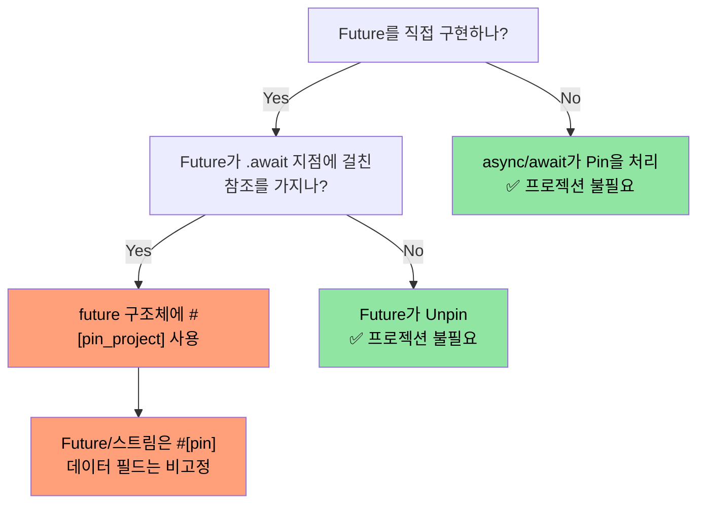
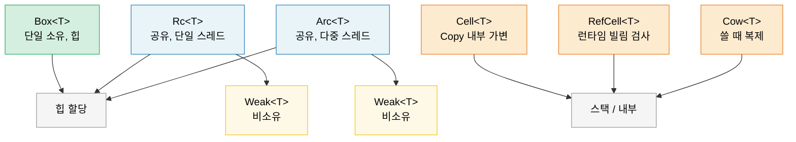

<a id="smart-pointers-and-interior-mutability"></a>
# 9. 스마트 포인터와 내부 가변성 🟡

> **이 장에서 배울 내용:**
> - 힙 할당·공유 소유권을 위한 Box, Rc, Arc
> - Rc/Arc 순환 참조를 끊기 위한 Weak 참조
> - 내부 가변성 패턴을 위한 Cell, RefCell, Cow
> - 자기 참조 타입을 위한 Pin과 수명 주기 제어를 위한 ManuallyDrop

<a id="box-rc-arc--heap-allocation-and-sharing"></a>
## Box, Rc, Arc — 힙 할당과 공유

```rust
// --- Box<T>: 단일 소유자, 힙 할당 ---
// 사용: 재귀 타입, 큰 값, 트레잇 객체
let boxed: Box<i32> = Box::new(42);
println!("{}", *boxed); // i32로 Deref

// 재귀 타입에는 Box 필요(그렇지 않으면 크기가 무한):
enum List<T> {
    Cons(T, Box<List<T>>),
    Nil,
}

// 트레잇 객체(동적 디스패치):
let writer: Box<dyn std::io::Write> = Box::new(std::io::stdout());

// --- Rc<T>: 다중 소유자, 단일 스레드 ---
// 사용: 한 스레드 안에서 공유 소유권(Send/Sync 없음)
use std::rc::Rc;

let a = Rc::new(vec![1, 2, 3]);
let b = Rc::clone(&a); // 참조 카운트 증가(깊은 복제 아님)
let c = Rc::clone(&a);
println!("Ref count: {}", Rc::strong_count(&a)); // 3

// 셋이 같은 Vec을 가리킴. 마지막 Rc가 드롭되면 Vec이 해제됨.

// --- Arc<T>: 다중 소유자, 스레드 안전 ---
// 사용: 스레드 간 공유 소유권
use std::sync::Arc;

let shared = Arc::new(String::from("shared data"));
let handles: Vec<_> = (0..5).map(|_| {
    let shared = Arc::clone(&shared);
    std::thread::spawn(move || println!("{shared}"))
}).collect();
for h in handles { h.join().unwrap(); }
```

<a id="weak-references--breaking-reference-cycles"></a>
### Weak 참조 — 순환 참조 끊기

`Rc`와 `Arc`는 참조 카운트를 쓰므로 순환(A → B → A)을 해제할 수 없습니다.
`Weak<T>`는 **강한 카운트를 올리지 않는** 비소유 핸들입니다.

```rust
use std::rc::{Rc, Weak};
use std::cell::RefCell;

struct Node {
    value: i32,
    parent: RefCell<Weak<Node>>,   // 부모를 살려 두지 않음
    children: RefCell<Vec<Rc<Node>>>,
}

let parent = Rc::new(Node {
    value: 0, parent: RefCell::new(Weak::new()), children: RefCell::new(vec![]),
});
let child = Rc::new(Node {
    value: 1, parent: RefCell::new(Rc::downgrade(&parent)), children: RefCell::new(vec![]),
});
parent.children.borrow_mut().push(Rc::clone(&child));

// 자식에서 부모 접근 — Option<Rc<Node>> 반환:
if let Some(p) = child.parent.borrow().upgrade() {
    println!("Child's parent value: {}", p.value); // 0
}
// `parent`가 드롭되면 strong_count → 0, 메모리 해제.
// 그 후 `child.parent.upgrade()`는 `None`.
```

**경험칙**: 소유권 방향에는 `Rc`/`Arc`, 역참조·캐시에는 `Weak`. 스레드 안전 코드에는 `Arc<T>`와 `sync::Weak<T>`.

<a id="cell-and-refcell--interior-mutability"></a>
### Cell과 RefCell — 내부 가변성

공유(`&`) 참조 뒤에서 데이터를 바꿔야 할 때가 있습니다. Rust는 **내부 가변성**을 런타임 빌림 검사로 제공합니다.

```rust
use std::cell::{Cell, RefCell};

// --- Cell<T>: Copy 기반 내부 가변성 ---
// Copy 타입에만(또는 swap으로 교체)
struct Counter {
    count: Cell<u32>,
}

impl Counter {
    fn new() -> Self { Counter { count: Cell::new(0) } }

    fn increment(&self) { // &self, &mut self 아님!
        self.count.set(self.count.get() + 1);
    }

    fn value(&self) -> u32 { self.count.get() }
}

// --- RefCell<T>: 런타임 빌림 검사 ---
// 빌림 규칙을 런타임에 위반하면 패닉
struct Cache {
    data: RefCell<Vec<String>>,
}

impl Cache {
    fn new() -> Self { Cache { data: RefCell::new(Vec::new()) } }

    fn add(&self, item: String) { // 밖에서는 불변처럼 보임
        self.data.borrow_mut().push(item); // 런타임 검사 &mut
    }

    fn get_all(&self) -> Vec<String> {
        self.data.borrow().clone() // 런타임 검사 &
    }

    fn bad_example(&self) {
        let _guard1 = self.data.borrow();
        // let _guard2 = self.data.borrow_mut();
        // ❌ 런타임 패닉 — &가 있는 동안 &mut 불가
    }
}
```

> **Cell vs RefCell**: `Cell`은 가져오기/설정하기로 복사·스왑하므로 패닉이 없지만 `Copy`에만 해당하거나 `swap()`/`replace()`로 처리합니다. `RefCell`은 모든 타입에 쓸 수 있으나 가변 이중 빌림에서 패닉합니다. 둘 다 `Sync`가 아님 — 멀티스레드는 `Mutex`/`RwLock`을 보세요.

<a id="cow--clone-on-write"></a>
### Cow — 필요할 때만 복제

`Cow`(Clone on Write)는 빌려 온 값 또는 소유한 값을 담습니다. **변경이 필요할 때만** 복제합니다.

```rust
use std::borrow::Cow;

// 수정이 없으면 할당을 피함:
fn normalize(input: &str) -> Cow<'_, str> {
    if input.contains('\t') {
        // 탭을 바꿀 때만 할당
        Cow::Owned(input.replace('\t', "    "))
    } else {
        // 할당 없음 — 참조만 반환
        Cow::Borrowed(input)
    }
}

fn main() {
    let clean = "no tabs here";
    let dirty = "tabs\there";

    let r1 = normalize(clean); // Cow::Borrowed — 할당 0
    let r2 = normalize(dirty); // Cow::Owned — 새 String 할당

    println!("{r1}");
    println!("{r2}");
}

// 소유권이 필요할 수도 있는 매개변수에도 유용:
fn process(data: Cow<'_, [u8]>) {
    // 복사 없이 읽을 수 있음
    println!("Length: {}", data.len());
    // 변경이 필요하면 Cow가 자동으로 복제:
    let mut owned = data.into_owned(); // Borrowed일 때만 복제
    owned.push(0xFF);
}
```

<a id="cow-u8-for-binary-data"></a>
#### 바이너리 데이터용 `Cow<'_, [u8]>`

`Cow`는 체크섬 삽입·패딩·이스케이프 등 변환이 필요할 수도 있는 바이트 API에 특히 유용합니다. 흔한 빠른 경로에서 `Vec<u8>` 할당을 피합니다.

```rust
use std::borrow::Cow;

/// 프레임을 최소 길이까지 패딩. 패딩이 없으면 빌림.
fn pad_frame(frame: &[u8], min_len: usize) -> Cow<'_, [u8]> {
    if frame.len() >= min_len {
        Cow::Borrowed(frame)  // 이미 충분히 김 — 할당 0
    } else {
        let mut padded = frame.to_vec();
        padded.resize(min_len, 0x00);
        Cow::Owned(padded)    // 패딩이 필요할 때만 할당
    }
}

let short = pad_frame(&[0xDE, 0xAD], 8);    // 소유 — 8바이트로 패딩
let long  = pad_frame(&[0; 64], 8);          // 빌림 — 이미 ≥ 8
```

> **팁**: 변환된 버퍼를 참조 카운트로 공유해야 하면 `Cow<[u8]>`와 `bytes::Bytes`(10장)를 함께 쓰세요.

<a id="when-to-use-which-pointer"></a>
### 어떤 포인터를 쓸지

| 포인터 | 소유자 수 | 스레드 안전 | 가변성 | 쓸 때 |
|---------|:-----------:|:-----------:|:----------:|----------|
| `Box<T>` | 1 | ✅ (T: Send이면) | `&mut`로 | 힙, 트레잇 객체, 재귀 타입 |
| `Rc<T>` | N | ❌ | 없음(Cell/RefCell로 감쌈) | 단일 스레드 공유, 그래프/트리 |
| `Arc<T>` | N | ✅ | 없음(Mutex/RwLock로 감쌈) | 스레드 간 공유 |
| `Cell<T>` | — | ❌ | `.get()` / `.set()` | Copy 타입 내부 가변성 |
| `RefCell<T>` | — | ❌ | `.borrow()` / `.borrow_mut()` | 임의 타입, 단일 스레드 |
| `Cow<'_, T>` | 0 또는 1 | ✅ (T: Send이면) | 쓸 때 복제 | 자주 바뀌지 않을 때 할당 회피 |

<a id="pin-and-self-referential-types"></a>
### Pin과 자기 참조 타입

`Pin<P>`는 값이 메모리에서 **이동하지 않도록** 막습니다. **자기 참조 타입** — 자기 데이터를 가리키는 포인터를 품은 구조체 — 과 `.await` 지점에 참조를 걸 수 있는 `Future`에 필수입니다.

```rust
use std::pin::Pin;
use std::marker::PhantomPinned;

// 자기 참조 구조체(단순화):
struct SelfRef {
    data: String,
    ptr: *const String, // 위 `data`를 가리킴
    _pin: PhantomPinned, // Unpin 해제 — 이동 불가
}

impl SelfRef {
    fn new(s: &str) -> Pin<Box<Self>> {
        let val = SelfRef {
            data: s.to_string(),
            ptr: std::ptr::null(),
            _pin: PhantomPinned,
        };
        let mut boxed = Box::pin(val);

        // SAFETY: 포인터를 설정한 뒤 데이터를 이동하지 않음
        let self_ptr: *const String = &boxed.data;
        unsafe {
            let mut_ref = Pin::as_mut(&mut boxed);
            Pin::get_unchecked_mut(mut_ref).ptr = self_ptr;
        }
        boxed
    }

    fn data(&self) -> &str {
        &self.data
    }

    fn ptr_data(&self) -> &str {
        // SAFETY: ptr은 고정된 동안 self.data를 가리키도록 설정됨
        unsafe { &*self.ptr }
    }
}

fn main() {
    let pinned = SelfRef::new("hello");
    assert_eq!(pinned.data(), pinned.ptr_data()); // 둘 다 "hello"
    // std::mem::swap은 ptr을 무효화할 수 있음 — Pin이 막음
}
```

**개념 요약**:

| 개념 | 의미 |
|---------|--------|
| `Unpin`(자동 트레잇) | "이 타입은 이동해도 안전." 대부분 기본이 `Unpin`. |
| `!Unpin` / `PhantomPinned` | "내부 포인터가 있음 — 이동하지 마." |
| `Pin<&mut T>` | `T`가 움직이지 않을 것이라는 보장이 있는 가변 참조 |
| `Pin<Box<T>>` | 소유·힙에 고정된 값 |

**async와의 관계**: 모든 `async fn`은 `.await` 지점에 참조를 걸 수 있는 `Future`로 역설어 **자기 참조**가 될 수 있습니다. 런타임은 `Future::poll`을 호출하기 전에 `Pin<&mut Future>`로 future를 고정합니다.

```rust
// 이렇게 쓰면:
async fn fetch(url: &str) -> String {
    let response = http_get(url).await; // await에 걸친 참조
    response.text().await
}

// 컴파일러는 상태 머신 구조체를 생성하고 !Unpin이며,
// 런타임은 poll 전에 Pin으로 고정합니다.
```

> **Pin을 언제 신경 쓸지**: (1) `Future`를 직접 구현할 때, (2) async 런타임이나 컴비네이터를 쓸 때, (3) 자기 참조 포인터가 있는 타입. 일반 애플리케이션 코드에서는 `async/await`가 Pin을 투명하게 처리합니다. 심화는 동반서 *Async Rust Training*을 보세요.
>
> **크레이트 대안**: 수동 `Pin` 없이 자기 참조 구조체를 쓰려면 [`ouroboros`](https://crates.io/crates/ouroboros)나 [`self_cell`](https://crates.io/crates/self_cell)을 고려하세요 — 고정과 드롭 의미가 맞는 안전한 래퍼를 생성합니다.

<a id="pin-projections--structural-pinning"></a>
### Pin 프로젝션 — 구조적 고정

`Pin<&mut MyStruct>`가 있을 때 필드에 접근해야 합니다.
**Pin 프로젝션**은 `Pin<&mut Struct>`에서 `Pin<&mut Field>`(고정된 필드) 또는 `&mut Field`(고정되지 않은 필드)로 가는 패턴입니다.

<a id="the-problem-field-access-on-pinned-types"></a>
#### 문제: 고정된 타입의 필드 접근

```rust
use std::pin::Pin;
use std::marker::PhantomPinned;

struct MyFuture {
    data: String,              // 일반 필드 — 이동해도 됨
    state: InternalState,      // 자기 참조 — 고정해야 함
    _pin: PhantomPinned,
}

enum InternalState {
    Waiting { ptr: *const String }, // `data`를 가리킴 — 자기 참조
    Done,
}

// `Pin<&mut MyFuture>`가 있을 때 `data`와 `state`에 어떻게 접근?
// 그냥 `pinned.data`는 안 됨 — 컴파일러가 고정된 값의 필드에
// &mut을 얻기 위해 unsafe 없이는 막음.
```

<a id="manual-pin-projection-unsafe"></a>
#### 수동 Pin 프로젝션(unsafe)

```rust
impl MyFuture {
    // `data`로 프로젝션 — 구조적으로 고정되지 않음(이동해도 안전)
    fn data(self: Pin<&mut Self>) -> &mut String {
        // SAFETY: `data`만 구조적으로 고정되지 않음. `data`만 옮겨도
        // 전체 구조체가 옮겨진 것은 아니므로 Pin 보장이 유지됨.
        unsafe { &mut self.get_unchecked_mut().data }
    }

    // `state`로 프로젝션 — 이 필드는 구조적으로 고정됨
    fn state(self: Pin<&mut Self>) -> Pin<&mut InternalState> {
        // SAFETY: `state`는 구조적으로 고정 — Pin<&mut InternalState>를 반환해
        // pin 불변식을 유지함.
        unsafe { Pin::new_unchecked(&mut self.get_unchecked_mut().state) }
    }
}
```

**구조적 고정 규칙** — 필드가 "구조적으로 고정"된다는 것은:
1. 그 필드만 옮기거나 스왑하면 자기 참조가 무효화될 수 있음
2. 구조체의 `Drop` 구현이 그 필드를 옮기면 안 됨
3. 구조체는 `!Unpin`이어야 함(`PhantomPinned`나 `!Unpin` 필드로 강제)

<a id="pin-project--safe-pin-projections-zero-unsafe"></a>
#### `pin-project` — 안전한 Pin 프로젝션(unsafe 없음)

`pin-project` 크레이트는 컴파일 타임에 올바른 프로젝션을 생성해 수동 `unsafe`를 없앱니다.

```rust
use pin_project::pin_project;
use std::pin::Pin;
use std::future::Future;
use std::task::{Context, Poll};

#[pin_project]                   // <-- 프로젝션 메서드 생성
struct TimedFuture<F: Future> {
    #[pin]                       // <-- 구조적으로 고정(Future)
    inner: F,
    started_at: std::time::Instant, // 고정 아님 — 일반 데이터
}

impl<F: Future> Future for TimedFuture<F> {
    type Output = (F::Output, std::time::Duration);

    fn poll(self: Pin<&mut Self>, cx: &mut Context<'_>) -> Poll<Self::Output> {
        let this = self.project();  // 안전! pin_project가 생성
        //   this.inner   : Pin<&mut F>              — 고정 필드
        //   this.started_at : &mut std::time::Instant — 비고정 필드

        match this.inner.poll(cx) {
            Poll::Ready(output) => {
                let elapsed = this.started_at.elapsed();
                Poll::Ready((output, elapsed))
            }
            Poll::Pending => Poll::Pending,
        }
    }
}
```

<a id="pin-project-vs-manual-projection"></a>
#### `pin-project` vs 수동 프로젝션

| 측면 | 수동(`unsafe`) | `pin-project` |
|--------|-------------------|---------------|
| 안전성 | 불변식을 직접 증명 | 컴파일러가 검증 |
| 보일러플레이트 | 적지만 실수하기 쉬움 | 없음 — derive 매크로 |
| `Drop` 상호작용 | 고정 필드를 옮기면 안 됨 | 강제: `#[pinned_drop]` |
| 컴파일 비용 | 없음 | 프로시 매크로 확장 |
| 사용처 | 저수준, `no_std` | 애플리케이션·라이브러리 코드 |

<a id="pinned-drop--drop-for-pinned-types"></a>
#### `#[pinned_drop]` — 고정된 타입의 Drop

`#[pin]` 필드가 있으면 `pin-project`는 일반 `Drop` 대신 `#[pinned_drop]`을 요구해 고정 필드를 실수로 옮기지 않게 합니다.

```rust
use pin_project::{pin_project, pinned_drop};
use std::pin::Pin;

#[pin_project(PinnedDrop)]
struct Connection<F> {
    #[pin]
    future: F,
    buffer: Vec<u8>,  // 고정 아님 — drop에서 이동 가능
}

#[pinned_drop]
impl<F> PinnedDrop for Connection<F> {
    fn drop(self: Pin<&mut Self>) {
        let this = self.project();
        // `this.future`는 Pin<&mut F> — 옮길 수 없고 제자리에서만 드롭
        // `this.buffer`는 &mut Vec<u8> — drain, clear 등 가능
        this.buffer.clear();
        println!("Connection dropped, buffer cleared");
    }
}
```

<a id="when-pin-projections-matter-in-practice"></a>
#### 실무에서 Pin 프로젝션이 중요할 때

> **참고**: 아래 다이어그램은 Mermaid 문법입니다. GitHub와 Mermaid를 지원하는 도구(mdBook + mermaid 플러그인, VS Code Mermaid 확장)에서 렌더됩니다. 일반 Markdown 뷰어에서는 원문 그대로 보입니다.



> **경험칙**: 다른 `Future`나 `Stream`을 감싸면 `pin-project`를 쓰세요. 애플리케이션에서 `async/await`만 쓰면 Pin 프로젝션은 직접 필요 없습니다. Pin 프로젝션을 쓰는 async 컴비네이터는 동반서 *Async Rust Training*을 보세요.

<a id="drop-ordering-and-manuallydrop"></a>
### 드롭 순서와 ManuallyDrop

Rust의 드롭 순서는 결정적이지만 알아둘 규칙이 있습니다.

<a id="drop-order-rules"></a>
#### 드롭 순서 규칙

```rust
struct Label(&'static str);

impl Drop for Label {
    fn drop(&mut self) { println!("Dropping {}", self.0); }
}

fn main() {
    let a = Label("first");   // 먼저 선언
    let b = Label("second");  // 다음
    let c = Label("third");   // 마지막
}
// 출력:
//   Dropping third    ← 지역 변수는 선언의 **역순**으로 드롭
//   Dropping second
//   Dropping first
```

**세 가지 규칙**:

| 대상 | 드롭 순서 | 이유 |
|------|-----------|----------|
| **지역 변수** | 선언 역순 | 나중 변수가 앞을 참조할 수 있음 |
| **구조체 필드** | 선언 순서(위→아래) | 생성 순서와 일치(Rust 1.0 이후 안정, [RFC 1857](https://rust-lang.github.io/rfcs/1857-stabilize-drop-order.html) 보장) |
| **튜플 원소** | 선언 순서(왼→오) | `(a, b, c)` → `a`, 그다음 `b`, 그다음 `c` 드롭 |

```rust
struct Server {
    listener: Label,  // 1번째 드롭
    handler: Label,   // 2번째
    logger: Label,    // 3번째
}
// 필드는 위에서 아래로 드롭.
// 필드가 서로 참조하거나 리소스를 쥘 때 중요합니다.
```

> **실무 영향**: 구조체에 `JoinHandle`과 `Sender`가 있으면 필드 순서가 먼저 드롭되는 쪽을 바꿉니다. 스레드가 채널에서 읽으면 `Sender`를 먼저 드롭(채널 닫기)해 스레드가 끝나게 한 뒤 핸들을 조인하세요. 구조체에서 `JoinHandle`보다 위에 `Sender`를 두세요.

<a id="manuallydropt--suppressing-automatic-drop"></a>
#### `ManuallyDrop<T>` — 자동 Drop 억제

`ManuallyDrop<T>`는 값을 감싸고 소멸자가 **자동으로** 돌지 않게 합니다. 직접 드롭 책임을 지거나(또는 의도적 누수):

```rust
use std::mem::ManuallyDrop;

// Use case 1: unsafe 코드에서 이중 해제 방지
struct TwoPhaseBuffer {
    // Vec을 직접 드롭해 타이밍을 제어해야 함
    data: ManuallyDrop<Vec<u8>>,
    committed: bool,
}

impl TwoPhaseBuffer {
    fn new(capacity: usize) -> Self {
        TwoPhaseBuffer {
            data: ManuallyDrop::new(Vec::with_capacity(capacity)),
            committed: false,
        }
    }

    fn write(&mut self, bytes: &[u8]) {
        self.data.extend_from_slice(bytes);
    }

    fn commit(&mut self) {
        self.committed = true;
        println!("Committed {} bytes", self.data.len());
    }
}

impl Drop for TwoPhaseBuffer {
    fn drop(&mut self) {
        if !self.committed {
            println!("Rolling back — dropping uncommitted data");
        }
        // SAFETY: data는 여기서 항상 유효; 한 번만 드롭
        unsafe { ManuallyDrop::drop(&mut self.data); }
    }
}
```

```rust
// Use case 2: 의도적 누수(예: 전역 싱글톤)
fn leaked_string() -> &'static str {
    // Box::leak()이 &'static을 만드는 관용적 방법:
    let s = String::from("lives forever");
    Box::leak(s.into_boxed_str())
    // ⚠️ 통제된 메모리 누수. String 힙 할당이 영원히 해제되지 않음.
    // 오래 사는 싱글톤에만 사용.
}

// ManuallyDrop 대안(unsafe):
// ⚠️ 위 Box::leak()을 선호 — ManuallyDrop 의미만 설명
fn leaked_string_manual() -> &'static str {
    use std::mem::ManuallyDrop;
    let md = ManuallyDrop::new(String::from("lives forever"));
    // SAFETY: ManuallyDrop이 해제를 막음; 힙 데이터는 영구히 살아 있으므로
    // 'static 참조가 유효함.
    unsafe { &*(md.as_str() as *const str) }
}
```

```rust
// Use case 3: union 필드(한 번에 하나의 변형만 유효)
use std::mem::ManuallyDrop;

union IntOrString {
    i: u64,
    s: ManuallyDrop<String>,
    // String에 Drop이 있으므로 union 안에서는 **반드시** ManuallyDrop으로 감쌈
    // — 컴파일러는 어떤 필드가 활성인지 모름.
}

// 자동 Drop 없음 — IntOrString을 만든 코드가 정리도 담당.
// String 변형이 활성이면:
//   unsafe { ManuallyDrop::drop(&mut value.s); }
// Drop impl 없이 union은 그냥 누수(UB는 아님, 누수만).
```

**ManuallyDrop vs `mem::forget`**:

| | `ManuallyDrop<T>` | `mem::forget(value)` |
|---|---|---|
| 언제 | 생성 시 감쌈 | 나중에 소비할 때 |
| 내부 접근 | `&*md` / `&mut *md` | 값은 사라짐 |
| 나중 드롭 | `ManuallyDrop::drop(&mut md)` | 불가 |
| 사용처 | 세밀한 수명 주기 제어 | 일회성 누수

> **규칙**: 소멸자가 **정확히 언제** 실행되어야 하는지 제어해야 하는 unsafe 추상화에 `ManuallyDrop`을 쓰세요. 안전한 애플리케이션 코드에서는 거의 필요 없습니다 — 자동 드롭 순서가 맞습니다.

> **핵심 정리 — 스마트 포인터**
> - 힙 단일 소유는 `Box`; `Rc`/`Arc`는 공유 소유(단일/다중 스레드)
> - `Cell`/`RefCell`은 내부 가변성; `RefCell`은 위반 시 런타임 패닉
> - `Cow`는 흔한 경로에서 할당 회피; `Pin`은 자기 참조 타입의 이동 방지
> - 드롭 순서: 필드는 선언 순서(RFC 1857); 지역은 선언 역순

> **함께 보기:** `Arc` + `Mutex` 패턴은 [6장 — 동시성](ch06-concurrency-vs-parallelism-vs-threads.md). 스마트 포인터와 함께 쓰는 `PhantomData`는 [4장 — PhantomData](ch04-phantomdata-types-that-carry-no-data.md).



---

<a id="exercise-reference-counted-graph"></a>
### 연습: 참조 카운트 그래프 ★★ (~30분)

`Rc<RefCell<Node>>`로 방향 그래프를 만드세요. 각 노드는 이름과 자식 목록을 가집니다. `Weak`로 역간을 끊어 순환(A → B → C → A)을 만드세요. `Rc::strong_count`로 메모리 누수가 없음을 확인하세요.

<details>
<summary>🔑 해답</summary>

```rust
use std::cell::RefCell;
use std::rc::{Rc, Weak};

struct Node {
    name: String,
    children: Vec<Rc<RefCell<Node>>>,
    back_ref: Option<Weak<RefCell<Node>>>,
}

impl Node {
    fn new(name: &str) -> Rc<RefCell<Self>> {
        Rc::new(RefCell::new(Node {
            name: name.to_string(),
            children: Vec::new(),
            back_ref: None,
        }))
    }
}

impl Drop for Node {
    fn drop(&mut self) {
        println!("Dropping {}", self.name);
    }
}

fn main() {
    let a = Node::new("A");
    let b = Node::new("B");
    let c = Node::new("C");

    // A → B → C, C가 Weak로 A를 역참조
    a.borrow_mut().children.push(Rc::clone(&b));
    b.borrow_mut().children.push(Rc::clone(&c));
    c.borrow_mut().back_ref = Some(Rc::downgrade(&a)); // Weak!

    println!("A strong count: {}", Rc::strong_count(&a)); // 1 (`a`만)
    println!("B strong count: {}", Rc::strong_count(&b)); // 2 (b + A의 자식)
    println!("C strong count: {}", Rc::strong_count(&c)); // 2 (c + B의 자식)

    // Weak를 실제로 올려 동작 확인:
    let c_ref = c.borrow();
    if let Some(back) = &c_ref.back_ref {
        if let Some(a_ref) = back.upgrade() {
            println!("C points back to: {}", a_ref.borrow().name);
        }
    }
    // a, b, c가 스코프를 벗어나면 모든 노드 드롭(순환 누수 없음!)
}
```

</details>

***

