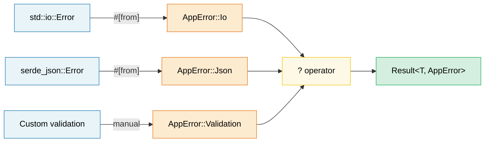

<a id="error-handling-patterns"></a>
# 10. 에러 처리 패턴 🟢

> **이 장에서 배울 내용:**
> - 라이브러리에는 `thiserror`, 애플리케이션에는 `anyhow`를 쓸 때
> - `#[from]`과 `.context()` 래퍼로 에러 변환 체인 만들기
> - `?` 연산자가 어떻게 역설되는지, `main()`에서 어떻게 동작하는지
> - 에러를 반환할지 패닉할지, FFI 경계의 `catch_unwind`

<a id="thiserror-vs-anyhow--library-vs-application"></a>
## thiserror vs anyhow — 라이브러리 vs 애플리케이션

Rust 에러 처리의 중심은 `Result<T, E>`입니다. 두 크레이트가 지배적입니다.

```rust,ignore
// --- thiserror: 라이브러리용 ---
// derive 매크로로 Display, Error, From 구현 생성
use thiserror::Error;

#[derive(Error, Debug)]
pub enum DatabaseError {
    #[error("connection failed: {0}")]
    ConnectionFailed(String),

    #[error("query error: {source}")]
    QueryError {
        #[source]
        source: sqlx::Error,
    },

    #[error("record not found: table={table} id={id}")]
    NotFound { table: String, id: u64 },

    #[error(transparent)] // 내부 에러에 Display 위임
    Io(#[from] std::io::Error), // From<io::Error> 자동 생성
}

// --- anyhow: 애플리케이션용 ---
// 동적 에러 타입 — 그냥 전파하고 싶은 최상위 코드에 적합
use anyhow::{Context, Result, bail, ensure};

fn read_config(path: &str) -> Result<Config> {
    let content = std::fs::read_to_string(path)
        .with_context(|| format!("failed to read config from {path}"))?;

    let config: Config = serde_json::from_str(&content)
        .context("failed to parse config JSON")?;

    ensure!(config.port > 0, "port must be positive, got {}", config.port);

    Ok(config)
}

fn main() -> Result<()> {
    let config = read_config("server.toml")?;

    if config.name.is_empty() {
        bail!("server name cannot be empty"); // 즉시 Err 반환
    }

    Ok(())
}
```

**무엇에 쓸지**:

| | `thiserror` | `anyhow` |
|---|---|---|
| **쓰는 곳** | 라이브러리, 공유 크레이트 | 애플리케이션, 바이너리 |
| **에러 타입** | 구체적 enum — 호출부가 매칭 가능 | `anyhow::Error` — 불투명 |
| **노력** | 에러 enum 정의 | `Result<T>`만 쓰면 됨 |
| **다운캐스트** | 필요 없음 — 패턴 매칭 | `error.downcast_ref::<MyError>()` |

<a id="error-conversion-chains-from"></a>
### 에러 변환 체인 (`#[from]`)

```rust,ignore
use thiserror::Error;

#[derive(Error, Debug)]
enum AppError {
    #[error("I/O error: {0}")]
    Io(#[from] std::io::Error),

    #[error("JSON error: {0}")]
    Json(#[from] serde_json::Error),

    #[error("HTTP error: {0}")]
    Http(#[from] reqwest::Error),
}

// 이제 ?가 자동 변환:
fn fetch_and_parse(url: &str) -> Result<Config, AppError> {
    let body = reqwest::blocking::get(url)?.text()?;  // reqwest::Error → AppError::Http
    let config: Config = serde_json::from_str(&body)?; // serde_json::Error → AppError::Json
    Ok(config)
}
```

<a id="context-and-error-wrapping"></a>
### context와 에러 감싸기

원본을 잃지 않고 사람이 읽을 맥락을 더합니다.

```rust,ignore
use anyhow::{Context, Result};

fn process_file(path: &str) -> Result<Data> {
    let content = std::fs::read_to_string(path)
        .with_context(|| format!("failed to read {path}"))?;

    let data = parse_content(&content)
        .with_context(|| format!("failed to parse {path}"))?;

    validate(&data)
        .context("validation failed")?;

    Ok(data)
}

// 에러 출력 예:
// Error: validation failed
//
// Caused by:
//    0: failed to parse config.json
//    1: expected ',' at line 5 column 12
```

<a id="the--operator-in-depth"></a>
### `?` 연산자 심화

`?`는 `match` + `From` 변환 + 조기 반환에 대한 문법 설탕입니다.

```rust
// 이것:
let value = operation()?;

// 역설은:
let value = match operation() {
    Ok(v) => v,
    Err(e) => return Err(From::from(e)),
    //                  ^^^^^^^^^^^^^^
    //                  From 트레잇으로 자동 변환
};
```

**`Option`에도 `?` 사용** (`Option`을 반환하는 함수 안에서):

```rust
fn find_user_email(users: &[User], name: &str) -> Option<String> {
    let user = users.iter().find(|u| u.name == name)?; // 없으면 None
    let email = user.email.as_ref()?; // None이면 None
    Some(email.to_uppercase())
}
```

<a id="panics-catch-unwind-and-when-to-abort"></a>
### 패닉, catch_unwind, 중단 시점

```rust
// 패닉: 예상된 에러가 아니라 버그
fn get_element(data: &[i32], index: usize) -> &i32 {
    // 여기서 패닉이면 프로그래밍 오류(버그).
    // "처리"하지 말고 호출부를 고치세요.
    &data[index]
}

// catch_unwind: 경계(FFI, 스레드 풀)
use std::panic;

let result = panic::catch_unwind(|| {
    // 패닉할 수 있는 코드를 안전하게 실행
    risky_operation()
});

match result {
    Ok(value) => println!("Success: {value:?}"),
    Err(_) => eprintln!("Operation panicked — continuing safely"),
}

// 선택 기준:
// - Result<T, E> → 예상된 실패(파일 없음, 네트워크 타임아웃)
// - panic!()     → 프로그래밍 버그(인덱스 범위 밖, 불변식 위반)
// - process::abort() → 복구 불가(보안 위반, 데이터 손상)
```

> **C++ 비교**: `Result<T, E>`가 예상 에러에 대한 예외를 대체합니다. `panic!()`은 `assert()`나 `std::terminate()`에 가깝고 버그용이지 제어 흐름이 아닙니다. Rust의 `?`는 예측 불가능한 제어 흐름 없이 예외만큼 편하게 전파합니다.

> **핵심 정리 — 에러 처리**
> - 라이브러리: 구조화된 에러 enum은 `thiserror`; 애플리케이션: 전파 편의는 `anyhow`
> - `#[from]`이 `From` 구현을 자동 생성; `.context()`가 사람이 읽을 래퍼 추가
> - `?`는 `From::from()` + 조기 반환으로 역설; `main()`이 `Result`를 반환하면 사용 가능

> **함께 보기:** "parse, don't validate" 패턴은 [14장 — API 설계](ch14-crate-architecture-and-api-design.md). serde 에러 처리는 [11장 — 직렬화](ch11-serialization-zero-copy-and-binary-data.md).



---

<a id="exercise-error-hierarchy-with-thiserror"></a>
### 연습: thiserror로 에러 계층 설계 ★★ (~30분)

I/O, 파싱(JSON·CSV), 검증 단계에서 실패할 수 있는 파일 처리 애플리케이션용 에러 타입 계층을 설계하세요. `thiserror`를 쓰고 `?` 전파를 보여 주세요.

<details>
<summary>🔑 해답</summary>

```rust,ignore
use thiserror::Error;

#[derive(Error, Debug)]
pub enum AppError {
    #[error("I/O error: {0}")]
    Io(#[from] std::io::Error),

    #[error("JSON parse error: {0}")]
    Json(#[from] serde_json::Error),

    #[error("CSV error at line {line}: {message}")]
    Csv { line: usize, message: String },

    #[error("validation error: {field} — {reason}")]
    Validation { field: String, reason: String },
}

fn read_file(path: &str) -> Result<String, AppError> {
    Ok(std::fs::read_to_string(path)?) // io::Error → AppError::Io via #[from]
}

fn parse_json(content: &str) -> Result<serde_json::Value, AppError> {
    Ok(serde_json::from_str(content)?) // serde_json::Error → AppError::Json
}

fn validate_name(value: &serde_json::Value) -> Result<String, AppError> {
    let name = value.get("name")
        .and_then(|v| v.as_str())
        .ok_or_else(|| AppError::Validation {
            field: "name".into(),
            reason: "must be a non-null string".into(),
        })?;

    if name.is_empty() {
        return Err(AppError::Validation {
            field: "name".into(),
            reason: "must not be empty".into(),
        });
    }

    Ok(name.to_string())
}

fn process_file(path: &str) -> Result<String, AppError> {
    let content = read_file(path)?;
    let json = parse_json(&content)?;
    let name = validate_name(&json)?;
    Ok(name)
}

fn main() {
    match process_file("config.json") {
        Ok(name) => println!("Name: {name}"),
        Err(e) => eprintln!("Error: {e}"),
    }
}
```

</details>

***

