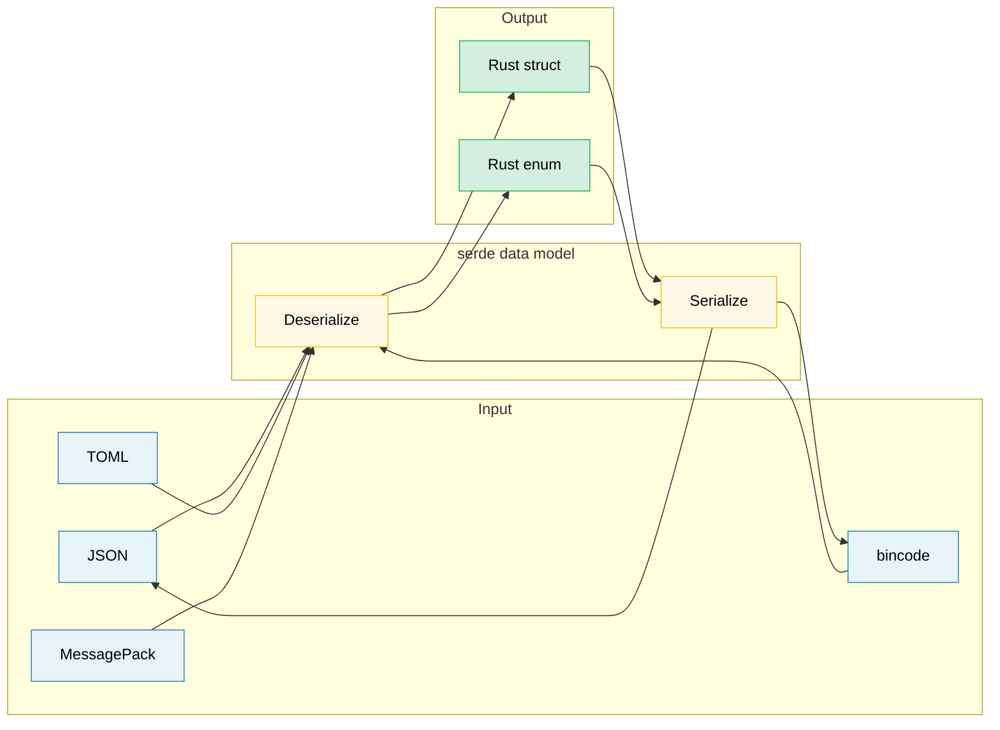

<a id="serialization-zero-copy-and-binary-data"></a>
# 11. 직렬화, 제로 카피, 그리고 바이너리 데이터 🟡

> **이 장에서 배울 내용:**
> - serde 기본: derive 매크로, 속성, enum 표현
> - 읽기 위주 고성능을 위한 제로 카피 역직렬화
> - serde 포맷 생태계(JSON, TOML, bincode, MessagePack)
> - `repr(C)`, zerocopy, `bytes::Bytes`로 바이너리 데이터 다루기

<a id="serde-fundamentals"></a>
## serde 기본

`serde`(SERialize/DEserialize)는 Rust의 범용 직렬화 프레임워크입니다.
**데이터 모델**(구조체)과 **포맷**(JSON, TOML, 바이너리)을 분리합니다.

```rust,ignore
use serde::{Serialize, Deserialize};

#[derive(Debug, Serialize, Deserialize)]
struct ServerConfig {
    name: String,
    port: u16,
    #[serde(default)]                    // 없으면 Default::default()
    max_connections: usize,
    #[serde(skip_serializing_if = "Option::is_none")]
    tls_cert_path: Option<String>,
}

fn main() -> Result<(), Box<dyn std::error::Error>> {
    // JSON에서 역직렬화:
    let json_input = r#"{
        "name": "hw-diag",
        "port": 8080
    }"#;
    let config: ServerConfig = serde_json::from_str(json_input)?;
    println!("{config:?}");
    // ServerConfig { name: "hw-diag", port: 8080, max_connections: 0, tls_cert_path: None }

    // JSON으로 직렬화:
    let output = serde_json::to_string_pretty(&config)?;
    println!("{output}");

    // 같은 구조체, 다른 포맷 — 코드 변경 없음:
    let toml_input = r#"
        name = "hw-diag"
        port = 8080
    "#;
    let config: ServerConfig = toml::from_str(toml_input)?;
    println!("{config:?}");

    Ok(())
}
```

> **핵심:** 구조체에 `Serialize`와 `Deserialize`를 한 번 derive하면 *모든* serde 호환 포맷 — JSON, TOML, YAML, bincode, MessagePack, CBOR, postcard 등 —과 함께 쓸 수 있습니다.

<a id="common-serde-attributes"></a>
### 자주 쓰는 serde 속성

필드·컨테이너 속성으로 직렬화를 세밀하게 제어합니다.

```rust,ignore
use serde::{Serialize, Deserialize};

// --- 컨테이너 속성(구조체/enum) ---
#[derive(Serialize, Deserialize)]
#[serde(rename_all = "camelCase")]       // JSON 관례: field_name → fieldName
#[serde(deny_unknown_fields)]            // 추가 키 거부 — 엄격 파싱
struct DiagResult {
    test_name: String,                   // 직렬화 이름 "testName"
    pass_count: u32,                     // "passCount"
    fail_count: u32,                     // "failCount"
}

// --- 필드 속성 ---
#[derive(Serialize, Deserialize)]
struct Sensor {
    #[serde(rename = "sensor_id")]       // 직렬화 시 필드 이름 덮어쓰기
    id: u64,

    #[serde(default)]                    // 입력에 없으면 Default
    enabled: bool,

    #[serde(default = "default_threshold")]
    threshold: f64,

    #[serde(skip)]                       // 직렬화·역직렬화 모두 제외
    cached_value: Option<f64>,

    #[serde(skip_serializing_if = "Vec::is_empty")]
    tags: Vec<String>,

    #[serde(flatten)]                    // 중첩 구조체 필드를 평평하게
    metadata: Metadata,

    #[serde(with = "hex_bytes")]         // 사용자 정의 ser/de 모듈
    raw_data: Vec<u8>,
}

fn default_threshold() -> f64 { 1.0 }

#[derive(Serialize, Deserialize)]
struct Metadata {
    vendor: String,
    model: String,
}
// #[serde(flatten)]이면 JSON은:
// { "sensor_id": 1, "vendor": "Intel", "model": "X200", ... }
// NOT: { "sensor_id": 1, "metadata": { "vendor": "Intel", ... } }
```

**자주 쓰는 속성 요약**:

| 속성 | 수준 | 효과 |
|-----------|-------|--------|
| `rename_all = "camelCase"` | 컨테이너 | 필드명을 camelCase/snake_case/SCREAMING_SNAKE_CASE로 |
| `deny_unknown_fields` | 컨테이너 | 예상 키 없으면 에러(엄격 모드) |
| `default` | 필드 | 필드 없으면 `Default::default()` |
| `rename = "..."` | 필드 | 직렬화 이름 지정 |
| `skip` | 필드 | ser/de 완전 제외 |
| `skip_serializing_if = "fn"` | 필드 | 조건부 제외(예: `Option::is_none`) |
| `flatten` | 필드 | 중첩 구조체 필드를 평평하게 |
| `with = "module"` | 필드 | 사용자 정의 serialize/deserialize 함수 |
| `alias = "..."` | 필드 | 역직렬화 시 대체 이름 허용 |
| `deserialize_with = "fn"` | 필드 | 역직렬화만 사용자 함수 |
| `untagged` | Enum | JSON 등에서 태그 없이 순서대로 시도 |

<a id="enum-representations"></a>
### Enum 표현

JSON 같은 포맷에서 enum은 네 가지 표현을 씁니다.

```rust,ignore
use serde::{Serialize, Deserialize};

// 1. 외부 태그(DEFAULT):
#[derive(Serialize, Deserialize)]
enum Command {
    Reboot,
    RunDiag { test_name: String, timeout_secs: u64 },
    SetFanSpeed(u8),
}
// "Reboot"                                          → Command::Reboot
// {"RunDiag": {"test_name": "gpu", "timeout_secs": 60}}  → Command::RunDiag { ... }

// 2. 내부 태그 — #[serde(tag = "type")]:
#[derive(Serialize, Deserialize)]
#[serde(tag = "type")]
enum Event {
    Start { timestamp: u64 },
    Error { code: i32, message: String },
    End   { timestamp: u64, success: bool },
}
// {"type": "Start", "timestamp": 1706000000}
// {"type": "Error", "code": 42, "message": "timeout"}

// 3. 인접 태그 — #[serde(tag = "t", content = "c")]:
#[derive(Serialize, Deserialize)]
#[serde(tag = "t", content = "c")]
enum Payload {
    Text(String),
    Binary(Vec<u8>),
}
// {"t": "Text", "c": "hello"}
// {"t": "Binary", "c": [0, 1, 2]}

// 4. Untagged — #[serde(untagged)]:
#[derive(Serialize, Deserialize)]
#[serde(untagged)]
enum StringOrNumber {
    Str(String),
    Num(f64),
}
// "hello" → StringOrNumber::Str("hello")
// 42.0    → StringOrNumber::Num(42.0)
// ⚠️ **순서대로** 시도 — 먼저 맞는 변형이 승리
```

> **무엇을 고를지**: 대부분의 JSON API에는 내부 태그(`tag = "type"`)가 읽기 좋고 Go, Python, TypeScript 관례와 맞습니다. untagged는 형태만으로 구분되는 유니온 타입에만 쓰세요.

<a id="zero-copy-deserialization"></a>
### 제로 카피 역직렬화

serde는 새 문자열을 할당하지 않고 입력 버퍼에서 직접 빌릴 수 있습니다. 고성능 파싱의 핵심입니다.

```rust,ignore
use serde::Deserialize;

// --- 소유(할당) ---
// 각 String 필드가 입력에서 바이트를 복사해 새 힙 할당.
#[derive(Deserialize)]
struct OwnedRecord {
    name: String,           // 새 String 할당
    value: String,          // 또 할당
}

// --- 제로 카피(빌림) ---
// &'de str 필드가 입력을 직접 가리킴 — 할당 ZERO.
#[derive(Deserialize)]
struct BorrowedRecord<'a> {
    name: &'a str,          // 입력 버퍼 안을 가리킴
    value: &'a str,         // 입력 버퍼 안을 가리킴
}

fn main() {
    let input = r#"{"name": "cpu_temp", "value": "72.5"}"#;

    // 소유: String 두 개 할당
    let owned: OwnedRecord = serde_json::from_str(input).unwrap();

    // 제로 카피: `name`과 `value`가 `input` 안을 가리킴 — 할당 없음
    let borrowed: BorrowedRecord = serde_json::from_str(input).unwrap();

    // 출력은 수명에 묶임: borrowed는 input보다 오래 살 수 없음
    println!("{}: {}", borrowed.name, borrowed.value);
}
```

**수명 이해하기**:

```rust,ignore
// Deserialize<'de> — 구조체가 'de 데이터에서 빌릴 수 있음:
//   struct BorrowedRecord<'a> where 'a == 'de
//   입력 버퍼가 충분히 길 때만 동작

// DeserializeOwned — 구조체가 모든 데이터를 소유, 빌림 없음:
//   trait DeserializeOwned: for<'de> Deserialize<'de> {}
//   입력 수명과 무관(구조체가 독립)

use serde::de::DeserializeOwned;

// 이 함수는 소유 타입만 요구 — 입력이 임시여도 됨
fn parse_owned<T: DeserializeOwned>(input: &str) -> T {
    serde_json::from_str(input).unwrap()
}

// 이 함수는 빌림 허용 — 더 효율적이며 수명 제약이 있음
fn parse_borrowed<'a, T: Deserialize<'a>>(input: &'a str) -> T {
    serde_json::from_str(input).unwrap()
}
```

**제로 카피를 쓸 때**:
- 필드 몇 개만 필요한 큰 파일 파싱
- 고처리량 파이프라인(네트워크 패킷, 로그 줄)
- 입력 버퍼이 이미 충분히 길 때(예: 메모리 맵 파일)

**쓰지 말 때**:
- 입력이 일시적(재사용되는 네트워크 읽기 버퍼)
- 입력보다 결과를 더 오래 보관해야 할 때
- 필드에 변환이 필요할 때(이스케이프 해제, 정규화)

> **실무 팁**: `Cow<'a, str>`이면 빌릴 수 있을 때 빌리고 필요할 때만 할당합니다(예: JSON 이스케이프 해제). serde가 `Cow`를 네이티브 지원합니다.

<a id="the-format-ecosystem"></a>
### 포맷 생태계

| 포맷 | 크레이트 | 사람이 읽기 | 크기 | 속도 | 용도 |
|--------|-------|:--------------:|:----:|:-----:|----------|
| JSON | `serde_json` | ✅ | 큼 | 좋음 | 설정, REST API, 로깅 |
| TOML | `toml` | ✅ | 중간 | 좋음 | 설정(Cargo.toml 스타일) |
| YAML | `serde_yaml` | ✅ | 중간 | 좋음 | 설정(복잡한 중첩) |
| bincode | `bincode` | ❌ | 작음 | 빠름 | IPC, 캐시, Rust 간 |
| postcard | `postcard` | ❌ | 매우 작음 | 매우 빠름 | 임베디드, `no_std` |
| MessagePack | `rmp-serde` | ❌ | 작음 | 빠름 | 언어 간 바이너리 프로토콜 |
| CBOR | `ciborium` | ❌ | 작음 | 빠름 | IoT, 제약 환경 |

```rust
// 같은 구조체, 여러 포맷 — serde의 힘:

#[derive(serde::Serialize, serde::Deserialize, Debug)]
struct DiagConfig {
    name: String,
    tests: Vec<String>,
    timeout_secs: u64,
}

let config = DiagConfig {
    name: "accel_diag".into(),
    tests: vec!["memory".into(), "compute".into()],
    timeout_secs: 300,
};

// JSON:   {"name":"accel_diag","tests":["memory","compute"],"timeout_secs":300}
let json = serde_json::to_string(&config).unwrap();       // 67 bytes

// bincode: 압축 바이너리 — 필드 이름 없음, ~40 bytes
let bin = bincode::serialize(&config).unwrap();            // 훨씬 작음

// postcard: 더 작음, varint — 임베디드에 좋음
// let post = postcard::to_allocvec(&config).unwrap();
```

> **포맷 선택**:
> - 사람이 편집하는 설정 → TOML 또는 JSON
> - Rust 간 IPC/캐시 → bincode(빠르고 작지만 크로스 언어 비권장)
> - 크로스 언어 바이너리 → MessagePack 또는 CBOR
> - 임베디드 / `no_std` → postcard

<a id="binary-data-and-reprc"></a>
### 바이너리 데이터와 `repr(C)`

하드웨어 진단에서는 바이너리 프로토콜 파싱이 흔합니다. Rust는 안전한 제로 카피 바이너리 처리 도구를 제공합니다.

```rust
// --- #[repr(C)]: 예측 가능한 메모리 배치 ---
// 선언 순서로 필드 배치, C 패딩 규칙.
// 하드웨어 레지스터·프로토콜 헤더와 맞출 때 필수.

#[repr(C)]
#[derive(Debug, Clone, Copy)]
struct IpmiHeader {
    rs_addr: u8,
    net_fn_lun: u8,
    checksum: u8,
    rq_addr: u8,
    rq_seq_lun: u8,
    cmd: u8,
}

// --- 수동 바이너리 파싱으로 안전한 역직렬화 ---
impl IpmiHeader {
    fn from_bytes(data: &[u8]) -> Option<Self> {
        if data.len() < std::mem::size_of::<Self>() {
            return None;
        }
        Some(IpmiHeader {
            rs_addr:     data[0],
            net_fn_lun:  data[1],
            checksum:    data[2],
            rq_addr:     data[3],
            rq_seq_lun:  data[4],
            cmd:         data[5],
        })
    }

    fn net_fn(&self) -> u8 { self.net_fn_lun >> 2 }
    fn lun(&self)    -> u8 { self.net_fn_lun & 0x03 }
}

// --- 엔디안 인식 파싱 ---
fn read_u16_le(data: &[u8], offset: usize) -> u16 {
    u16::from_le_bytes([data[offset], data[offset + 1]])
}

fn read_u32_be(data: &[u8], offset: usize) -> u32 {
    u32::from_be_bytes([
        data[offset], data[offset + 1],
        data[offset + 2], data[offset + 3],
    ])
}

// --- #[repr(C, packed)]: 패딩 제거(정렬 = 1) ---
#[repr(C, packed)]
#[derive(Debug, Clone, Copy)]
struct PcieCapabilityHeader {
    cap_id: u8,        // Capability ID
    next_cap: u8,      // 다음 capability 포인터
    cap_reg: u16,      // capability별 레지스터
}
// ⚠️ Packed 구조체: &field가 정렬되지 않은 참조 — UB.
// 항상 필드 복사: let id = header.cap_id;  // OK (Copy)
// 하지 말 것: let r = &header.cap_reg;               // 정렬 안 맞으면 UB
```

<a id="zerocopy-and-bytemuck--safe-transmutation"></a>
### zerocopy와 bytemuck — 안전한 트랜스뮤트

`unsafe` transmute 대신 컴파일 타임에 레이아웃 안전을 검증하는 크레이트를 쓰세요.

```rust
// --- zerocopy: 컴파일 타임 검사 제로 카피 변환 ---
// Cargo.toml: zerocopy = { version = "0.8", features = ["derive"] }

use zerocopy::{FromBytes, IntoBytes, KnownLayout, Immutable};

#[derive(FromBytes, IntoBytes, KnownLayout, Immutable, Debug)]
#[repr(C)]
struct SensorReading {
    sensor_id: u16,
    flags: u8,
    _reserved: u8,
    value: u32,     // 고정소수: 실제 = value / 1000.0
}

fn parse_sensor(raw: &[u8]) -> Option<&SensorReading> {
    // 안전 제로 카피: 컴파일 타임에 정렬·크기 검증
    SensorReading::ref_from_bytes(raw).ok()
    // raw 안을 가리키는 &SensorReading 반환 — 복사·할당 없음
}

// --- bytemuck: 단순하고 검증됨 ---
// Cargo.toml: bytemuck = { version = "1", features = ["derive"] }

use bytemuck::{Pod, Zeroable};

#[derive(Pod, Zeroable, Clone, Copy, Debug)]
#[repr(C)]
struct GpuRegister {
    address: u32,
    value: u32,
}

fn cast_registers(data: &[u8]) -> &[GpuRegister] {
    // 안전 캐스트: Pod는 모든 비트 패턴이 유효함을 보장
    bytemuck::cast_slice(data)
}
```

**무엇을 쓸지**:

| 접근 | 안전 | 오버헤드 | 쓸 때 |
|----------|:------:|:--------:|----------|
| 수동 필드별 파싱 | ✅ 안전 | 필드 복사 | 작은 구조체, 복잡한 레이아웃 |
| `zerocopy` | ✅ 안전 | 제로 카피 | 큰 버퍼, 많은 읽기, 컴파일 검사 |
| `bytemuck` | ✅ 안전 | 제로 카피 | 단순 `Pod` 타입, 슬라이스 캐스트 |
| `unsafe { transmute() }` | ❌ Unsafe | 제로 카피 | 최후 수단 — 앱 코드에서는 피할 것 |

<a id="bytesbytes--reference-counted-buffers"></a>
### `bytes::Bytes` — 참조 카운트 버퍼

`bytes` 크레이트(tokio, hyper, tonic에서 사용)는 참조 카운트를 가진 제로 카피 바이너리 버퍼를 제공합니다 — `Bytes`는 `Vec<u8>`에 대응하고 `Arc<[u8]>`과 비슷합니다.

```rust
use bytes::{Bytes, BytesMut, Buf, BufMut};

fn main() {
    // --- BytesMut: 데이터를 쌓는 가변 버퍼 ---
    let mut buf = BytesMut::with_capacity(1024);
    buf.put_u8(0x01);                    // 바이트 쓰기
    buf.put_u16(0x1234);                 // u16 쓰기(빅엔디안)
    buf.put_slice(b"hello");             // 원시 바이트
    buf.put(&b"world"[..]);              // 슬라이스에서

    // 불변 Bytes로 동결(제로 비용):
    let data: Bytes = buf.freeze();

    // --- Bytes: 불변, 참조 카운트, 클론 가능 ---
    let data2 = data.clone();            // 저렴: refcount 증가, 깊은 복사 아님
    let slice = data.slice(3..8);        // 제로 카피 부분 슬라이스(버퍼 공유)

    // Buf 트레잇으로 Bytes 읽기:
    let mut reader = &data[..];
    let byte = reader.get_u8();          // 0x01
    let short = reader.get_u16();        // 0x1234

    // 복사 없이 분할:
    let mut original = Bytes::from_static(b"HEADER\x00PAYLOAD");
    let header = original.split_to(6);   // header = "HEADER", original = "\x00PAYLOAD"

    println!("header: {:?}", &header[..]);
    println!("payload: {:?}", &original[1..]);
}
```

**`bytes` vs `Vec<u8>`**:

| 특징 | `Vec<u8>` | `Bytes` |
|---------|-----------|---------|
| Clone 비용 | O(n) 깊은 복사 | O(1) refcount 증가 |
| 부분 슬라이스 | 수명이 있는 빌림 | 소유, refcount 추적 |
| 스레드 안전 | 단독으로는 `Sync` 아님(`Arc` 필요) | `Send + Sync` 내장 |
| 가변성 | 직접 `&mut` | 먼저 `BytesMut`로 분리 |
| 생태계 | 표준 라이브러리 | tokio, hyper, tonic, axum |

> **bytes를 쓸 때**: 네트워크 프로토콜, 패킷 파싱, 버퍼를 받아 여러 구성요소나 스레드가 부분을 처리할 때. 제로 카피 분할이 핵심 기능입니다.

> **핵심 정리 — 직렬화·바이너리 데이터**
> - serde derive가 대부분; 나머지는 속성(`rename`, `skip`, `default`)
> - 제로 카피 역직렬화(`&'a str` 필드)는 읽기 위주 부하에서 할당 회피
> - 하드웨어 레지스터 레이아웃은 `repr(C)` + `zerocopy`/`bytemuck`; 참조 카운트 버퍼는 `bytes::Bytes`

> **함께 보기:** serde 에러와 `thiserror` 결합은 [10장 — 에러 처리](ch10-error-handling-patterns.md). `repr(C)`와 FFI 데이터 레이아웃은 [12장 — Unsafe](ch12-unsafe-rust-controlled-danger.md).



---

<a id="exercise-custom-serde-deserialization"></a>
### 연습: 사용자 정의 serde 역직렬화 ★★★ (~45분)

`"30s"`, `"5m"`, `"2h"` 같은 사람이 읽는 문자열에서 역직렬화되는 `HumanDuration` 래퍼를 설계하세요. 사용자 정의 deserializer를 쓰고, 같은 형식으로 다시 직렬화해야 합니다.

<details>
<summary>🔑 해답</summary>

```rust,ignore
use serde::{Deserialize, Deserializer, Serialize, Serializer};
use std::fmt;

#[derive(Debug, Clone, PartialEq)]
struct HumanDuration(std::time::Duration);

impl HumanDuration {
    fn from_str(s: &str) -> Result<Self, String> {
        let s = s.trim();
        if s.is_empty() { return Err("empty duration string".into()); }

        let (num_str, suffix) = s.split_at(
            s.find(|c: char| !c.is_ascii_digit()).unwrap_or(s.len())
        );
        let value: u64 = num_str.parse()
            .map_err(|_| format!("invalid number: {num_str}"))?;

        let duration = match suffix {
            "s" | "sec"  => std::time::Duration::from_secs(value),
            "m" | "min"  => std::time::Duration::from_secs(value * 60),
            "h" | "hr"   => std::time::Duration::from_secs(value * 3600),
            "ms"         => std::time::Duration::from_millis(value),
            other        => return Err(format!("unknown suffix: {other}")),
        };
        Ok(HumanDuration(duration))
    }
}

impl fmt::Display for HumanDuration {
    fn fmt(&self, f: &mut fmt::Formatter<'_>) -> fmt::Result {
        let secs = self.0.as_secs();
        if secs == 0 {
            write!(f, "{}ms", self.0.as_millis())
        } else if secs % 3600 == 0 {
            write!(f, "{}h", secs / 3600)
        } else if secs % 60 == 0 {
            write!(f, "{}m", secs / 60)
        } else {
            write!(f, "{}s", secs)
        }
    }
}

impl Serialize for HumanDuration {
    fn serialize<S: Serializer>(&self, serializer: S) -> Result<S::Ok, S::Error> {
        serializer.serialize_str(&self.to_string())
    }
}

impl<'de> Deserialize<'de> for HumanDuration {
    fn deserialize<D: Deserializer<'de>>(deserializer: D) -> Result<Self, D::Error> {
        let s = String::deserialize(deserializer)?;
        HumanDuration::from_str(&s).map_err(serde::de::Error::custom)
    }
}

#[derive(Debug, Deserialize, Serialize)]
struct Config {
    timeout: HumanDuration,
    retry_interval: HumanDuration,
}

fn main() {
    let json = r#"{ "timeout": "30s", "retry_interval": "5m" }"#;
    let config: Config = serde_json::from_str(json).unwrap();

    assert_eq!(config.timeout.0, std::time::Duration::from_secs(30));
    assert_eq!(config.retry_interval.0, std::time::Duration::from_secs(300));

    let serialized = serde_json::to_string(&config).unwrap();
    assert!(serialized.contains("30s"));
    println!("Config: {serialized}");
}
```

</details>

***

