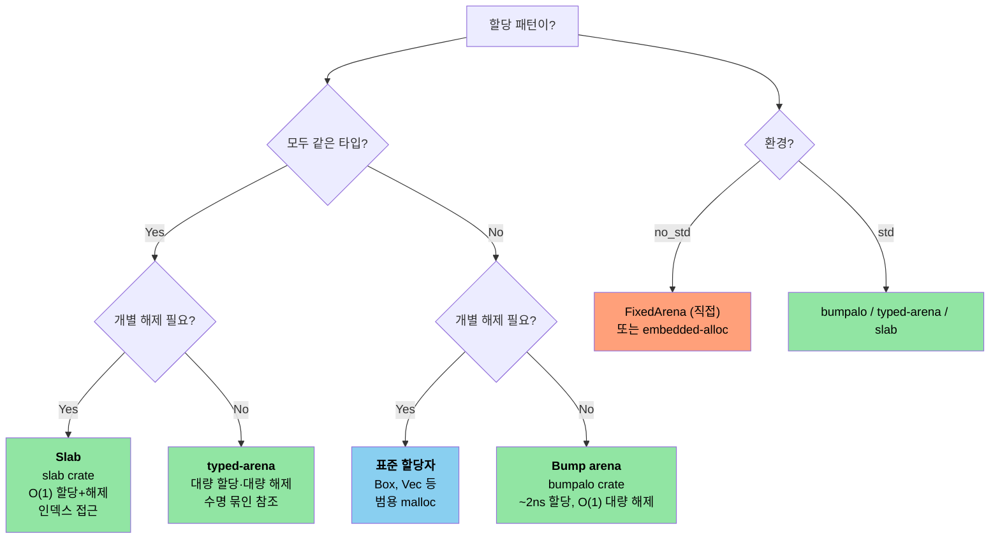

<a id="unsafe-rust-controlled-danger"></a>
# 12. Unsafe Rust — 통제된 위험 🔴

> **이 장에서 배울 내용:**
> - 다섯 가지 unsafe 권한과 각각이 필요한 때
> - 건전한 추상화: 안전한 API, unsafe 내부
> - Rust에서 C 호출(및 역) FFI 패턴
> - 흔한 UB 함정과 arena/slab 할당자 패턴

<a id="the-five-unsafe-superpowers"></a>
## 다섯 가지 unsafe 권한

`unsafe`는 컴파일러가 검증할 수 없는 다섯 가지 연산을 허용합니다.

```rust
unsafe {
    // 1. raw 포인터 역참조
    let ptr: *const i32 = &42;
    let value = *ptr; // 댕글링/널일 수 있음

    // 2. unsafe 함수 호출
    let layout = std::alloc::Layout::new::<u64>();
    let mem = std::alloc::alloc(layout);

    // 3. 가변 static 변수 접근
    static mut COUNTER: u32 = 0;
    COUNTER += 1; // 여러 스레드가 접근하면 데이터 레이스

    // 4. unsafe 트레잇 구현
    // unsafe impl Send for MyType {}

    // 5. union 필드 접근
    // union IntOrFloat { i: i32, f: f32 }
    // let u = IntOrFloat { i: 42 };
    // let f = u.f; // 비트 재해석 — 쓰레기일 수 있음
}
```

> **핵심 원칙**: `unsafe`가 borrow checker나 타입 시스템을 끄는 것은 아닙니다. 이 다섯 가지 능력만 열어 줍니다. 그 외 Rust 규칙은 그대로입니다.

<a id="writing-sound-abstractions"></a>
### 건전한 추상화 쓰기

`unsafe`의 목적은 unsafe 연산 주변에 **안전한 추상화**를 만드는 것입니다.

```rust
/// 고정 용량 스택 할당 버퍼.
/// 공개 메서드는 모두 안전 — unsafe는 캡슐화됨.
pub struct StackBuf<T, const N: usize> {
    data: [std::mem::MaybeUninit<T>; N],
    len: usize,
}

impl<T, const N: usize> StackBuf<T, N> {
    pub fn new() -> Self {
        StackBuf {
            // 원소마다 MaybeUninit — unsafe 불필요.
            // `const { ... }` 블록(Rust 1.79+)으로 Copy가 아닌
            // 식을 N번 반복할 수 있음.
            data: [const { std::mem::MaybeUninit::uninit() }; N],
            len: 0,
        }
    }

    pub fn push(&mut self, value: T) -> Result<(), T> {
        if self.len >= N {
            return Err(value); // 가득 참 — 값을 호출자에게 반환
        }
        // SAFETY: len < N이므로 data[len]는 범위 안.
        // 유효한 T를 MaybeUninit 슬롯에 씀.
        self.data[self.len] = std::mem::MaybeUninit::new(value);
        self.len += 1;
        Ok(())
    }

    pub fn get(&self, index: usize) -> Option<&T> {
        if index < self.len {
            // SAFETY: index < len이고 data[0..len]은 모두 초기화됨.
            Some(unsafe { self.data[index].assume_init_ref() })
        } else {
            None
        }
    }
}

impl<T, const N: usize> Drop for StackBuf<T, N> {
    fn drop(&mut self) {
        // SAFETY: data[0..len]은 초기화됨 — 제대로 드롭.
        for i in 0..self.len {
            unsafe { self.data[i].assume_init_drop(); }
        }
    }
}
```

**건전한 unsafe 코드 세 가지 규칙**:
1. **불변식 문서화** — 모든 `// SAFETY:` 주석이 연산이 왜 유효한지 설명
2. **캡슐화** — unsafe는 안전 API 안에; 사용자가 UB를 유발할 수 없게
3. **최소화** — `unsafe` 블록은 가능한 한 작게

<a id="ffi-patterns-calling-c-from-rust"></a>
### FFI 패턴: Rust에서 C 호출

```rust
// C 함수 시그니처 선언:
extern "C" {
    fn strlen(s: *const std::ffi::c_char) -> usize;
    fn printf(format: *const std::ffi::c_char, ...) -> std::ffi::c_int;
}

// 안전 래퍼:
fn safe_strlen(s: &str) -> usize {
    let c_string = std::ffi::CString::new(s).expect("string contains null byte");
    // SAFETY: c_string은 호출 동안 유효한 널 종료 문자열.
    unsafe { strlen(c_string.as_ptr()) }
}

// C에서 Rust 호출(함수 내보내기):
#[no_mangle]
pub extern "C" fn rust_add(a: i32, b: i32) -> i32 {
    a + b
}
```

**흔한 FFI 타입**:

| Rust | C | 비고 |
|------|---|-------|
| `i32` / `u32` | `int32_t` / `uint32_t` | 고정 폭, 안전 |
| `*const T` / `*mut T` | `const T*` / `T*` | Raw 포인터 |
| `std::ffi::CStr` | `const char*` (빌림) | 널 종료, 빌림 |
| `std::ffi::CString` | `char*` (소유) | 널 종료, 소유 |
| `std::ffi::c_void` | `void` | 불투명 포인터 대상 |
| `Option<fn(...)>` | 널 가능 함수 포인터 | `None` = NULL |

<a id="common-ub-pitfalls"></a>
### 흔한 UB 함정

| 함정 | 예 | 왜 UB인가 |
|---------|---------|------------|
| 널 역참조 | `*std::ptr::null::<i32>()` | 널 역참조는 항상 UB |
| 댕글링 포인터 | `drop()` 이후 역참조 | 메모리가 재사용될 수 있음 |
| 데이터 레이스 | 두 스레드가 `static mut`에 쓰기 | 동기화 없는 동시 쓰기 |
| 잘못된 `assume_init` | `MaybeUninit::<String>::uninit().assume_init()` | 초기화되지 않은 메모리 읽기. **참고**: `[const { MaybeUninit::uninit() }; N]`(Rust 1.79+)이 `MaybeUninit` 배열을 만드는 안전한 방법 — `unsafe`나 `assume_init` 불필요(위 `StackBuf::new()` 참고). |
| 별칭 위반 | 같은 데이터에 `&mut` 두 개 | Rust 별칭 모델 위반 |
| 잘못된 enum 값 | `std::mem::transmute::<u8, bool>(2)` | `bool`은 0 또는 1만 유효 |

> **프로덕션에서 `unsafe`를 쓸 때**:
> - FFI 경계(C/C++ 코드 호출)
> - 성능이 중요한 내부 루프(경계 검사 회피)
> - 원시 타입(`Vec`, `HashMap` — 내부에 unsafe 사용)
> - 피할 수 있으면 애플리케이션 로직에는 쓰지 않기

<a id="custom-allocators--arena-and-slab-patterns"></a>
### 사용자 정의 할당자 — Arena와 Slab 패턴

C에서는 특정 할당 패턴에 맞춘 `malloc()` 대체 — 한 번에 전부 해제하는 arena, 고정 크기 객체용 slab, 고처리량 풀 — Rust는 `GlobalAlloc` 트레잇과 할당자 크레이트로 같은 힘을 주며, **컴파일 타임에 수명이 묶인 arena**로 use-after-free를 막는 이점이 있습니다.

<a id="arena-allocators--bulk-allocation-bulk-free"></a>
#### Arena 할당자 — 대량 할당, 대량 해제

Arena는 포인터를 앞으로 밀며 할당합니다. 개별 항목은 해제할 수 없고 arena 전체가 한 번에 해제됩니다. 요청 단위 또는 프레임 단위 할당에 적합합니다.

```rust
use bumpalo::Bump;

fn process_sensor_frame(raw_data: &[u8]) {
    // 이 프레임용 arena
    let arena = Bump::new();

    // arena에 할당 — 각 ~2ns(포인터만 밀기)
    let header = arena.alloc(parse_header(raw_data));
    let readings: &mut [f32] = arena.alloc_slice_fill_default(header.sensor_count);

    for (i, chunk) in raw_data[header.payload_offset..].chunks(4).enumerate() {
        if i < readings.len() {
            readings[i] = f32::from_le_bytes(chunk.try_into().unwrap());
        }
    }

    // readings 사용...
    let avg = readings.iter().sum::<f32>() / readings.len() as f32;
    println!("Frame avg: {avg:.2}");

    // `arena`가 여기서 드롭 — 모든 할당이 O(1)로 한 번에 해제
    // 객체마다 소멸자 부담 없음, 단편화 없음
}
# fn parse_header(_: &[u8]) -> Header { Header { sensor_count: 4, payload_offset: 8 } }
# struct Header { sensor_count: usize, payload_offset: usize }
```

**Arena vs 표준 할당자**:

| 측면 | `Vec::new()` / `Box::new()` | `Bump` arena |
|--------|---------------------------|--------------|
| 할당 속도 | ~25ns(malloc) | ~2ns(포인터 밀기) |
| 해제 속도 | 객체마다 소멸자 | O(1) 대량 해제 |
| 단편화 | 있음(장기 프로세스) | arena 안에서는 없음 |
| 수명 안전 | 힙 — Drop 시 해제 | arena 참조 — 컴파일 타임 스코프 |
| 용도 | 범용 | 요청/프레임/배치 처리 |

<a id="typed-arena--type-safe-arena"></a>
#### `typed-arena` — 타입 안전 Arena

arena 객체가 모두 같은 타입이면 `typed-arena`가 arena 수명에 묶인 참조를 돌려주는 더 단순한 API를 제공합니다.

```rust
use typed_arena::Arena;

struct AstNode<'a> {
    value: i32,
    children: Vec<&'a AstNode<'a>>,
}

fn build_tree() {
    let arena: Arena<AstNode<'_>> = Arena::new();

    // 노드 할당 — arena 수명에 묶인 &AstNode 반환
    let root = arena.alloc(AstNode { value: 1, children: vec![] });
    let left = arena.alloc(AstNode { value: 2, children: vec![] });
    let right = arena.alloc(AstNode { value: 3, children: vec![] });

    // 트리 구성 — `arena`가 살아 있는 동안 모든 참조 유효
    // (진짜 가변 트리는 내부 가변성 필요)

    println!("Root: {}, Left: {}, Right: {}", root.value, left.value, right.value);

    // `arena` 드롭 — 모든 노드 한 번에 해제
}
```

<a id="slab-allocators--fixed-size-object-pools"></a>
#### Slab 할당자 — 고정 크기 객체 풀

Slab은 고정 크기 슬롯 풀을 미리 할당합니다. 객체는 개별 할당·반환되지만 슬롯 크기는 동일 — 단편화를 없애고 O(1) 할당/해제를 가능하게 합니다.

```rust
use slab::Slab;

struct Connection {
    id: u64,
    buffer: [u8; 1024],
    active: bool,
}

fn connection_pool_example() {
    // 연결용 slab 미리 할당
    let mut connections: Slab<Connection> = Slab::with_capacity(256);

    // insert는 키(usize 인덱스) 반환 — O(1)
    let key1 = connections.insert(Connection {
        id: 1001,
        buffer: [0; 1024],
        active: true,
    });

    let key2 = connections.insert(Connection {
        id: 1002,
        buffer: [0; 1024],
        active: true,
    });

    // 키로 접근 — O(1)
    if let Some(conn) = connections.get_mut(key1) {
        conn.buffer[0..5].copy_from_slice(b"hello");
    }

    // remove는 값 반환 — O(1), 슬롯은 다음 insert에 재사용
    let removed = connections.remove(key2);
    assert_eq!(removed.id, 1002);

    // 다음 insert가 해제된 슬롯 재사용 — 단편화 없음
    let key3 = connections.insert(Connection {
        id: 1003,
        buffer: [0; 1024],
        active: true,
    });
    assert_eq!(key3, key2); // 같은 슬롯 재사용!
}
```

<a id="implementing-a-minimal-arena-for-no_std"></a>
#### 최소 Arena 구현(`no_std`용)

`bumpalo`를 쓸 수 없는 베어메탈 환경용으로 `unsafe`로 만든 최소 arena입니다.

```rust
#![cfg_attr(not(test), no_std)]

use core::alloc::Layout;
use core::cell::{Cell, UnsafeCell};

/// 고정 크기 바이트 배열을 뒷받침하는 단순 bump 할당자.
/// 스레드 안전 아님 — 멀티스레드는 코어마다 또는 락과 함께.
///
/// **중요**: `bumpalo`처럼 이 arena는 드롭 시 할당된 항목의 **소멸자를 호출하지 않습니다**.
/// `Drop`이 있는 타입은 리소스(파일 핸들, 소켓 등)를 누수할 수 있습니다.
/// 의미 있는 `Drop`이 없는 타입만 할당하거나, arena 전에 수동으로 드롭하세요.
pub struct FixedArena<const N: usize> {
    // UnsafeCell 필수: `&self`로 `buf`를 변경함.
    // UnsafeCell 없이 &self.buf를 *mut u8로 캐스팅하면 UB
    // (공유 참조는 불변 — Rust 별칭 모델 위반).
    buf: UnsafeCell<[u8; N]>,
    offset: Cell<usize>, // &self 할당용 내부 가변성
}

impl<const N: usize> FixedArena<N> {
    pub const fn new() -> Self {
        FixedArena {
            buf: UnsafeCell::new([0; N]),
            offset: Cell::new(0),
        }
    }

    /// arena에 `T` 할당. 공간 없으면 `None`.
    pub fn alloc<T>(&self, value: T) -> Option<&mut T> {
        let layout = Layout::new::<T>();
        let current = self.offset.get();

        // 정렬 올림
        let aligned = (current + layout.align() - 1) & !(layout.align() - 1);
        let new_offset = aligned + layout.size();

        if new_offset > N {
            return None; // arena 가득
        }

        self.offset.set(new_offset);

        // SAFETY:
        // - `aligned`는 위에서 `buf` 범위 안
        // - 정렬은 T 요구사항에 맞음
        // - 별칭 없음: 각 alloc은 겹치지 않는 영역만 반환
        // - UnsafeCell이 `&self`로 변경 허용
        // - 반환 참조는 arena보다 오래 살아 있으면 안 됨(호출자 책임)
        let ptr = unsafe {
            let base = (self.buf.get() as *mut u8).add(aligned);
            let typed = base as *mut T;
            typed.write(value);
            &mut *typed
        };

        Some(ptr)
    }

    /// arena 리셋 — 이전 할당에 대한 참조는 모두 무효.
    /// arena 데이터에 대한 참조가 없을 때만 호출.
    pub unsafe fn reset(&self) {
        self.offset.set(0);
    }

    pub fn used(&self) -> usize {
        self.offset.get()
    }

    pub fn remaining(&self) -> usize {
        N - self.offset.get()
    }
}
```

<a id="choosing-an-allocator-strategy"></a>
#### 할당자 전략 선택

> **참고**: 아래 다이어그램은 Mermaid 문법입니다. GitHub와 Mermaid를 지원하는 도구에서 렌더됩니다.



| C 패턴 | Rust 대응 | 핵심 이점 |
|-----------|----------------|---------------|
| 사용자 `malloc()` 풀 | `#[global_allocator]` 구현 | 타입 안전, 디버깅 용이 |
| `obstack`(GNU) | `bumpalo::Bump` | 수명 스코프, use-after-free 방지 |
| 커널 slab(`kmem_cache`) | `slab::Slab<T>` | 타입 안전, 인덱스 기반 |
| 스택 임시 버퍼 | `FixedArena<N>` (위) | 힙 없음, `const` 생성 가능 |
| `alloca()` | `[T; N]` 또는 `SmallVec` | 컴파일 타임 크기, UB 없음

> **교차 참조**: 베어메탈 할당자 설정(`#[global_allocator]` + `embedded-alloc`)은 *C 프로그래머를 위한 Rust Training* 15.1장 "전역 할당자 설정"을 보세요.

> **핵심 정리 — Unsafe Rust**
> - 불변식 문서(`SAFETY:` 주석), 안전 API 뒤에 캡슐화, unsafe 범위 최소화
> - `[const { MaybeUninit::uninit() }; N]`(Rust 1.79+)이 옛 `assume_init` 안티패턴을 대체
> - FFI는 `extern "C"`, `#[repr(C)]`, 널·수명 처리에 주의
> - Arena와 slab은 범용 유연성과 바꿔 할당 속도를 취함

> **함께 보기:** unsafe와 분산·드롭 체크 상호작용은 [4장 — PhantomData](ch04-phantomdata-types-that-carry-no-data.md). Pin과 자기 참조 타입은 [9장 — 스마트 포인터](ch09-smart-pointers-and-interior-mutability.md).

---

<a id="exercise-safe-wrapper-around-unsafe"></a>
### 연습: unsafe 주변 안전 래퍼 ★★★ (~45분)

`FixedVec<T, const N: usize>` — 고정 용량·스택 할당 벡터를 작성하세요.
요구사항:
- `push(&mut self, value: T) -> Result<(), T>` — 가득하면 `Err(value)`
- `pop(&mut self) -> Option<T>` — 마지막 원소 제거·반환
- `as_slice(&self) -> &[T]` — 초기화된 원소만 빌림
- 공개 메서드는 모두 안전; unsafe는 `SAFETY:` 주석과 함께 캡슐화
- `Drop`이 초기화된 원소를 정리

<details>
<summary>🔑 해답</summary>

```rust
use std::mem::MaybeUninit;

pub struct FixedVec<T, const N: usize> {
    data: [MaybeUninit<T>; N],
    len: usize,
}

impl<T, const N: usize> FixedVec<T, N> {
    pub fn new() -> Self {
        FixedVec {
            data: [const { MaybeUninit::uninit() }; N],
            len: 0,
        }
    }

    pub fn push(&mut self, value: T) -> Result<(), T> {
        if self.len >= N { return Err(value); }
        // SAFETY: len < N이므로 data[len]는 범위 안.
        self.data[self.len] = MaybeUninit::new(value);
        self.len += 1;
        Ok(())
    }

    pub fn pop(&mut self) -> Option<T> {
        if self.len == 0 { return None; }
        self.len -= 1;
        // SAFETY: data[len]은 초기화됨(len을 줄이기 전에 > 0이었음).
        Some(unsafe { self.data[self.len].assume_init_read() })
    }

    pub fn as_slice(&self) -> &[T] {
        // SAFETY: data[0..len]은 모두 초기화, MaybeUninit<T> 레이아웃은 T와 동일.
        unsafe { std::slice::from_raw_parts(self.data.as_ptr() as *const T, self.len) }
    }

    pub fn len(&self) -> usize { self.len }
    pub fn is_empty(&self) -> bool { self.len == 0 }
}

impl<T, const N: usize> Drop for FixedVec<T, N> {
    fn drop(&mut self) {
        // SAFETY: data[0..len]은 초기화됨 — 각각 드롭.
        for i in 0..self.len {
            unsafe { self.data[i].assume_init_drop(); }
        }
    }
}

fn main() {
    let mut v = FixedVec::<String, 4>::new();
    v.push("hello".into()).unwrap();
    v.push("world".into()).unwrap();
    assert_eq!(v.as_slice(), &["hello", "world"]);
    assert_eq!(v.pop(), Some("world".into()));
    assert_eq!(v.len(), 1);
}
```

</details>

***

