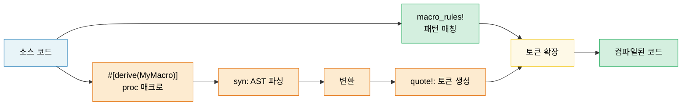

<a id="macros-code-that-writes-code"></a>
# 13. 매크로 — 코드를 작성하는 코드 🟡

> **이 장에서 배울 내용:**
> - 패턴 매칭과 반복이 있는 선언적 매크로(`macro_rules!`)
> - 매크로가 맞는 도구인 때 vs 제네릭/트레잇
> - 절차적 매크로: derive, attribute, 함수형
> - `syn`과 `quote`로 사용자 정의 derive 매크로 작성

<a id="declarative-macros-macro_rules"></a>
## 선언적 매크로(`macro_rules!`)

매크로는 구문 패턴에 맞춰 컴파일 타임에 코드로 펼칩니다.

```rust
// 쉼표로 구분된 key => value 쌍으로 HashMap을 만드는 단순 매크로
macro_rules! hashmap {
    // 매칭: 쉼표로 구분된 key => value
    ( $( $key:expr => $value:expr ),* $(,)? ) => {
        {
            let mut map = std::collections::HashMap::new();
            $( map.insert($key, $value); )*
            map
        }
    };
}

let scores = hashmap! {
    "Alice" => 95,
    "Bob" => 87,
    "Carol" => 92,
};
// 펼쳐지면:
// let mut map = HashMap::new();
// map.insert("Alice", 95);
// map.insert("Bob", 87);
// map.insert("Carol", 92);
// map
```

**매크로 조각 타입**:

| 조각 | 매칭 | 예 |
|----------|---------|---------|
| `$x:expr` | 임의 식 | `42`, `a + b`, `foo()` |
| `$x:ty` | 타입 | `i32`, `Vec<String>` |
| `$x:ident` | 식별자 | `my_var`, `Config` |
| `$x:pat` | 패턴 | `Some(x)`, `_` |
| `$x:stmt` | 문 | `let x = 5;` |
| `$x:tt` | 토큰 트리 하나 | 무엇이든(가장 유연) |
| `$x:literal` | 리터럴 | `42`, `"hello"`, `true` |

**반복**: `$( ... ),*` 는 "쉼표로 구분, 0개 이상"

```rust
// 테스트 함수를 자동 생성
macro_rules! test_cases {
    ( $( $name:ident: $input:expr => $expected:expr ),* $(,)? ) => {
        $(
            #[test]
            fn $name() {
                assert_eq!(process($input), $expected);
            }
        )*
    };
}

test_cases! {
    test_empty: "" => "",
    test_hello: "hello" => "HELLO",
    test_trim: "  spaces  " => "SPACES",
}
// 세 개의 별도 #[test] 함수 생성
```

<a id="when-not-to-use-macros"></a>
### 매크로를 (안) 쓸 때

**매크로를 쓸 때**:
- 트레잇/제네릭으로 안 되는 상용구 줄이기(가변 인자, 테스트 생성 DRY)
- DSL 만들기(`html!`, `sql!`, `vec!`)
- 조건부 코드 생성(`cfg!`, `compile_error!`)

**쓰지 말 때**:
- 함수나 제네릭으로 될 때(매크로는 디버깅이 어렵고 자동완성이 덜 도움)
- 매크로 안에서 타입 검사가 필요할 때(매크로는 토큰에서 동작, 타입이 아님)
- 한두 번만 쓰는 패턴(추상화 비용이 이득보다 큼)

```rust
// ❌ 불필요한 매크로 — 함수로 충분:
macro_rules! double {
    ($x:expr) => { $x * 2 };
}

// ✅ 함수만 쓰면 됨:
fn double(x: i32) -> i32 { x * 2 }

// ✅ 매크로가 맞음 — 가변 인자, 함수로는 불가:
macro_rules! println {
    ($($arg:tt)*) => { /* format string + args */ };
}
```

<a id="procedural-macros-overview"></a>
### 절차적 매크로 개요

절차적 매크로는 토큰 스트림을 변환하는 Rust 함수입니다. `proc-macro = true`인 별도 크레이트가 필요합니다.

```rust
// 절차적 매크로 세 종류:

// 1. Derive 매크로 — #[derive(MyTrait)]
// 구조체 정의에서 트레잇 구현 생성
#[derive(Debug, Clone, Serialize, Deserialize)]
struct Config {
    name: String,
    port: u16,
}

// 2. 속성 매크로 — #[my_attribute]
// 붙인 항목 변환
#[route(GET, "/api/users")]
async fn list_users() -> Json<Vec<User>> { /* ... */ }

// 3. 함수형 매크로 — my_macro!(...)
// 사용자 정의 구문
let query = sql!(SELECT * FROM users WHERE id = ?);
```

<a id="derive-macros-in-practice"></a>
### 실무에서 Derive 매크로

가장 흔한 proc 매크로 유형입니다. `#[derive(Debug)]`가 개념적으로 어떻게 동작하는지:

```rust
// 입력(당신의 구조체):
#[derive(Debug)]
struct Point {
    x: f64,
    y: f64,
}

// derive 매크로가 생성:
impl std::fmt::Debug for Point {
    fn fmt(&self, f: &mut std::fmt::Formatter<'_>) -> std::fmt::Result {
        f.debug_struct("Point")
            .field("x", &self.x)
            .field("y", &self.y)
            .finish()
    }
}
```

**자주 쓰는 derive 매크로**:

| Derive | 크레이트 | 생성 내용 |
|--------|-------|-------------------|
| `Debug` | std | `fmt::Debug` 구현(디버그 출력) |
| `Clone`, `Copy` | std | 값 복제 |
| `PartialEq`, `Eq` | std | 동등 비교 |
| `Hash` | std | HashMap 키용 해싱 |
| `Serialize`, `Deserialize` | serde | JSON/YAML 등 인코딩 |
| `Error` | thiserror | `std::error::Error` + `Display` |
| `Parser` | `clap` | CLI 인자 파싱 |
| `Builder` | derive_builder | 빌더 패턴 |

> **실무 조언**: derive 매크로는 적극적으로 쓰세요 — 실수하기 쉬운 상용구를 없앱니다. 직접 proc 매크로를 쓰는 건 고급 주제; 먼저 기존 것(`serde`, `thiserror`, `clap`)을 쓰세요.

<a id="macro-hygiene-and-crate"></a>
### 매크로 위생과 `$crate`

**위생(hygiene)**은 매크로 안에서 만든 식별자가 호출자 스코프와 충돌하지 않는다는 뜻입니다. Rust의 `macro_rules!`는 *부분적* 위생입니다.

```rust
macro_rules! make_var {
    () => {
        let x = 42; // 이 'x'는 매크로 **스코프**
    };
}

fn main() {
    let x = 10;
    make_var!();   // 다른 'x' 생성(위생)
    println!("{x}"); // 10 출력 — 매크로의 x는 새지 않음
}
```

**`$crate`**: 라이브러리 매크로를 쓸 때 자기 크레이트를 가리키려면 `$crate`를 쓰세요 — 사용자가 크레이트를 어떻게 import하든 올바르게 해석됩니다.

```rust
// my_diagnostics 크레이트 안:

pub fn log_result(msg: &str) {
    println!("[diag] {msg}");
}

#[macro_export]
macro_rules! diag_log {
    ($($arg:tt)*) => {
        // ✅ $crate는 항상 my_diagnostics로 해석 — 사용자가 Cargo.toml에서
        // 크레이트 이름을 바꿔도 동작
        $crate::log_result(&format!($($arg)*))
    };
}

// ❌ $crate 없이:
// my_diagnostics::log_result(...)  ← 사용자가
//   [dependencies]
//   diag = { package = "my_diagnostics", version = "1" }
// 라고 하면 깨짐
```

> **규칙**: `#[macro_export]` 매크로에서는 항상 `$crate::`를 쓰세요. 크레이트 이름을 직접 쓰지 마세요.

<a id="recursive-macros-and-tt-munching"></a>
### 재귀 매크로와 `tt` 먼칭

재귀 매크로는 입력을 토큰 하나씩 처리합니다 — **`tt` 먼칭**(token-tree 먼칭)이라 부릅니다.

```rust
// 매크로에 넘긴 식의 개수 세기
macro_rules! count {
    // 기저: 토큰 없음
    () => { 0usize };
    // 재귀: 식 하나 소비, 나머지 세기
    ($head:expr $(, $tail:expr)* $(,)?) => {
        1usize + count!($($tail),*)
    };
}

fn main() {
    let n = count!("a", "b", "c", "d");
    assert_eq!(n, 4);

    // 컴파일 타임에도 동작:
    const N: usize = count!(1, 2, 3);
    assert_eq!(N, 3);
}
```

```rust
// 식 목록으로 이종 튜플 만들기:
macro_rules! tuple_from {
    // 기저: 원소 하나
    ($single:expr $(,)?) => { ($single,) };
    // 재귀: 첫 원소 + 나머지
    ($head:expr, $($tail:expr),+ $(,)?) => {
        ($head, tuple_from!($($tail),+))
    };
}

let t = tuple_from!(1, "hello", 3.14, true);
// 펼쳐지면: (1, ("hello", (3.14, (true,))))
```

**조각 지정자 주의점**:

| 조각 | 함정 |
|----------|--------|
| `$x:expr` | 탐욕적으로 파싱 — `1 + 2`는 토큰 세 개가 아니라 **식 하나** |
| `$x:ty` | 탐욕적으로 파싱 — `Vec<String>`은 한 타입; 뒤에 `+`나 `<` 못 붙임 |
| `$x:tt` | 토큰 트리 **정확히 하나** — 가장 유연, 검사는 가장 약함 |
| `$x:ident` | 순수 식별자만 — `std::io` 같은 경로는 아님 |
| `$x:pat` | Rust 2021에서 `A \| B` 패턴; 단일 패턴은 `$x:pat_param` |

> **`tt`를 쓸 때**: 파서가 토큰을 제한하지 않게 다른 매크로로 넘길 때. `$($args:tt)*`가 "전부 받기" 패턴(`println!`, `format!`, `vec!`에서 사용).

<a id="writing-a-derive-macro-with-syn-and-quote"></a>
### `syn`과 `quote`로 Derive 매크로 작성

Derive 매크로는 별도 크레이트(`proc-macro = true`)에 두고 `syn`(Rust 파싱)과 `quote`(Rust 생성)로 토큰 스트림을 변환합니다.

```toml
# my_derive/Cargo.toml
[lib]
proc-macro = true

[dependencies]
syn = { version = "2", features = ["full"] }
quote = "1"
proc-macro2 = "1"
```

```rust
// my_derive/src/lib.rs
use proc_macro::TokenStream;
use quote::quote;
use syn::{parse_macro_input, DeriveInput};

/// 구조체 이름과 필드 이름을 돌려주는 `describe()` 메서드를 생성하는 derive
#[proc_macro_derive(Describe)]
pub fn derive_describe(input: TokenStream) -> TokenStream {
    let input = parse_macro_input!(input as DeriveInput);
    let name = &input.ident;
    let name_str = name.to_string();

    // 필드 이름만 추출(이름 있는 구조체만)
    let fields = match &input.data {
        syn::Data::Struct(data) => {
            data.fields.iter()
                .filter_map(|f| f.ident.as_ref())
                .map(|id| id.to_string())
                .collect::<Vec<_>>()
        }
        _ => vec![],
    };

    let field_list = fields.join(", ");

    let expanded = quote! {
        impl #name {
            pub fn describe() -> String {
                format!("{} {{ {} }}", #name_str, #field_list)
            }
        }
    };

    TokenStream::from(expanded)
}
```

```rust
// 애플리케이션 크레이트에서:
use my_derive::Describe;

#[derive(Describe)]
struct SensorReading {
    sensor_id: u16,
    value: f64,
    timestamp: u64,
}

fn main() {
    println!("{}", SensorReading::describe());
    // "SensorReading { sensor_id, value, timestamp }"
}
```

**작업 흐름**: `TokenStream`(원시 토큰) → `syn::parse`(AST) → 검사/변환 → `quote!`(토큰 생성) → `TokenStream`(컴파일러로 반환).

| 크레이트 | 역할 | 주요 타입 |
|-------|------|-----------|
| `proc-macro` | 컴파일러 인터페이스 | `TokenStream` |
| `syn` | Rust 소스를 AST로 | `DeriveInput`, `ItemFn`, `Type` |
| `quote` | 템플릿에서 Rust 토큰 생성 | `quote!{}`, `#variable` 보간 |
| `proc-macro2` | syn/quote와 proc-macro 사이 다리 | `TokenStream`, `Span` |

> **실무 팁**: 직접 쓰기 전에 `thiserror`나 `derive_more` 같은 단순 derive 소스를 읽어 보세요. `cargo expand`(cargo-expand)로 매크로가 무엇으로 펼쳐지는지 볼 수 있어 디버깅에 필수입니다.

> **핵심 정리 — 매크로**
> - 단순 코드 생성은 `macro_rules!`; 복잡한 derive는 proc 매크로(`syn` + `quote`)
> - 가능하면 제네릭/트레잇을 선호 — 매크로는 디버깅·유지보수가 어렵습니다
> - `$crate`로 위생 유지; `tt` 먼칭으로 재귀 패턴 매칭

> **함께 보기:** 트레잇/제네릭이 매크로보다 나은 경우는 [2장 — 트레잇](ch02-traits-in-depth.md). 매크로 생성 코드 테스트는 [14장 — 테스트](ch14-testing-and-benchmarking-patterns.md).



---

<a id="exercise-declarative-macro-map"></a>
### 연습: 선언적 매크로 — `map!` ★ (~15분)

키-값 쌍으로 `HashMap`을 만드는 `map!` 매크로를 작성하세요.

```rust,ignore
let m = map! {
    "host" => "localhost",
    "port" => "8080",
};
assert_eq!(m.get("host"), Some(&"localhost"));
```

요구: 후행 쉼표와 빈 호출 `map!{}` 지원.

<details>
<summary>🔑 해답</summary>

```rust
macro_rules! map {
    () => { std::collections::HashMap::new() };
    ( $( $key:expr => $val:expr ),+ $(,)? ) => {{
        let mut m = std::collections::HashMap::new();
        $( m.insert($key, $val); )+
        m
    }};
}

fn main() {
    let config = map! {
        "host" => "localhost",
        "port" => "8080",
        "timeout" => "30",
    };
    assert_eq!(config.len(), 3);
    assert_eq!(config["host"], "localhost");

    let empty: std::collections::HashMap<String, String> = map!();
    assert!(empty.is_empty());

    let scores = map! { 1 => 100, 2 => 200 };
    assert_eq!(scores[&1], 100);
}
```

</details>

***

