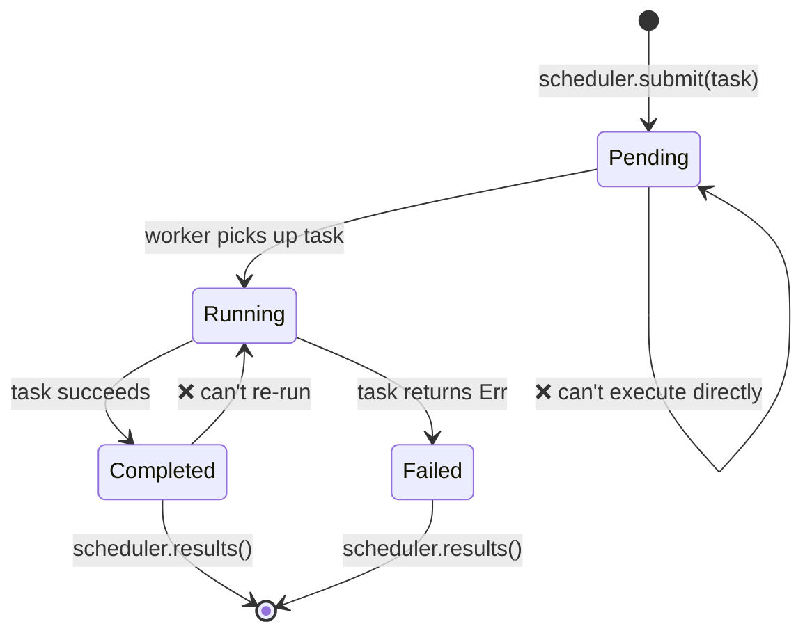

<a id="capstone-project-type-safe-task-scheduler"></a>

# 캡스톤 프로젝트: 타입 안전한 작업 스케줄러

이 프로젝트는 책 전반의 패턴을 하나의 프로덕션 스타일 시스템으로 묶습니다. **타입 안전하고 동시성 있는 작업 스케줄러**를 만들며, 제네릭, 트레잇, 타입 상태, 채널, 에러 처리, 테스트를 모두 사용합니다.

**예상 시간**: 4–6시간 | **난이도**: ★★★

> **연습할 내용:**
> - 제네릭과 트레잇 바운드 (1–2장)
> - 작업 생명주기를 위한 타입 상태 패턴 (3장)
> - PhantomData로 제로 비용 상태 마커 (4장)
> - 워커 통신용 채널 (5장)
> - 스코프 스레드로 동시성 (6장)
> - `thiserror`로 에러 처리 (9장)
> - 프로퍼티 기반 테스트 (14장 — 테스트와 벤치마킹)
> - `TryFrom`과 검증된 타입으로 API 설계 (15장 — 크레이트 아키텍처)

<a id="the-problem"></a>

## 문제

다음을 만족하는 작업 스케줄러를 만듭니다:

1. **작업**은 타입이 있는 생명주기: `대기 중 → 실행 중 → 완료`(또는 `실패`)
2. **워커**는 채널에서 작업을 꺼내 실행하고 결과를 보고
3. **스케줄러**는 제출, 워커 조정, 결과 수집을 담당
4. 잘못된 상태 전이는 **컴파일 에러**



<a id="step-1-define-the-task-types"></a>

## 1단계: 작업 타입 정의

타입 상태 마커와 제네릭 `Task`부터 시작합니다:

```rust
use std::marker::PhantomData;

struct Pending;
struct Running;
struct Completed;
struct Failed;

#[derive(Debug, Clone, Copy, PartialEq, Eq, Hash)]
struct TaskId(u64);

struct Task<State, R> {
    id: TaskId,
    name: String,
    _state: PhantomData<State>,
    _result: PhantomData<R>,
}
```

**할 일**: 다음 전이만 구현하세요:
- `Task<Pending, R>` → `Task<Running, R>` (`start()`)
- `Task<Running, R>` → `Task<Completed, R>` 또는 `Task<Failed, R>`
- 그 외 전이는 컴파일되지 않게

<details>
<summary>💡 힌트</summary>

각 전이 메서드는 `self`를 소비하고 새 상태를 반환합니다:

```rust
impl<R> Task<Pending, R> {
    fn start(self) -> Task<Running, R> {
        Task {
            id: self.id,
            name: self.name,
            _state: PhantomData,
            _result: PhantomData,
        }
    }
}
```

</details>

<a id="step-2-define-the-work-function"></a>

## 2단계: 작업 함수 정의

실행할 작업은 박스 클로저로 둡니다:

```rust
struct WorkItem<R: Send + 'static> {
    id: TaskId,
    name: String,
    work: Box<dyn FnOnce() -> Result<R, String> + Send>,
}
```

**할 일**: 작업 이름과 클로저를 받는 `WorkItem::new()`를 구현하고, `TaskId` 생성기(원자 카운터 또는 mutex 보호 카운터)를 추가합니다.

<a id="step-3-error-handling"></a>

## 3단계: 에러 처리

`thiserror`로 스케줄러 에러 타입을 정의합니다:

```rust,ignore
use thiserror::Error;

#[derive(Error, Debug)]
pub enum SchedulerError {
    #[error("scheduler is shut down")]
    ShutDown,

    #[error("task {0:?} failed: {1}")]
    TaskFailed(TaskId, String),

    #[error("channel send error")]
    ChannelError(#[from] std::sync::mpsc::SendError<()>),

    #[error("worker panicked")]
    WorkerPanic,
}
```

<a id="step-4-the-scheduler"></a>

## 4단계: 스케줄러

채널(5장)과 스코프 스레드(6장)로 스케줄러를 만듭니다:

```rust
use std::sync::mpsc;

struct Scheduler<R: Send + 'static> {
    sender: Option<mpsc::Sender<WorkItem<R>>>,
    results: mpsc::Receiver<TaskResult<R>>,
    num_workers: usize,
}

struct TaskResult<R> {
    id: TaskId,
    name: String,
    outcome: Result<R, String>,
}
```

**할 일**:
- `Scheduler::new(num_workers: usize) -> Self` — 채널 생성 및 워커 스폰
- `Scheduler::submit(&self, item: WorkItem<R>) -> Result<TaskId, SchedulerError>`
- `Scheduler::shutdown(self) -> Vec<TaskResult<R>>` — 송신자 드롭, 워커 조인, 결과 수집

<details>
<summary>💡 힌트 — 워커 루프</summary>

```rust
fn worker_loop<R: Send + 'static>(
    rx: std::sync::Arc<std::sync::Mutex<mpsc::Receiver<WorkItem<R>>>>,
    result_tx: mpsc::Sender<TaskResult<R>>,
    worker_id: usize,
) {
    loop {
        let item = {
            let rx = rx.lock().unwrap();
            rx.recv()
        };
        match item {
            Ok(work_item) => {
                let outcome = (work_item.work)();
                let _ = result_tx.send(TaskResult {
                    id: work_item.id,
                    name: work_item.name,
                    outcome,
                });
            }
            Err(_) => break,
        }
    }
}
```

</details>

<a id="step-5-integration-test"></a>

## 5단계: 통합 테스트

다음을 검증하는 테스트를 작성하세요:

1. **해피 패스**: 작업 10개 제출, 종료 후 10개 결과가 모두 `Ok`
2. **에러 처리**: 실패하는 작업 제출, `TaskResult.outcome`이 `Err`인지
3. **빈 스케줄러**: 즉시 생성·종료 — 패닉 없음
4. **프로퍼티 테스트**(보너스): `proptest`로 작업 수 N(1..100)일 때 항상 N개 결과가 나오는지

```rust
#[cfg(test)]
mod tests {
    use super::*;

    #[test]
    fn happy_path() {
        let scheduler = Scheduler::<String>::new(4);

        for i in 0..10 {
            let item = WorkItem::new(
                format!("task-{i}"),
                move || Ok(format!("result-{i}")),
            );
            scheduler.submit(item).unwrap();
        }

        let results = scheduler.shutdown();
        assert_eq!(results.len(), 10);
        for r in &results {
            assert!(r.outcome.is_ok());
        }
    }

    #[test]
    fn handles_failures() {
        let scheduler = Scheduler::<String>::new(2);

        scheduler.submit(WorkItem::new("good", || Ok("ok".into()))).unwrap();
        scheduler.submit(WorkItem::new("bad", || Err("boom".into()))).unwrap();

        let results = scheduler.shutdown();
        assert_eq!(results.len(), 2);

        let failures: Vec<_> = results.iter()
            .filter(|r| r.outcome.is_err())
            .collect();
        assert_eq!(failures.len(), 1);
    }
}
```

<a id="step-6-put-it-all-together"></a>

## 6단계: 전체 연결

전체 시스템을 보여 주는 `main()` 예:

```rust,ignore
fn main() {
    let scheduler = Scheduler::<String>::new(4);

    for i in 0..20 {
        let item = WorkItem::new(
            format!("compute-{i}"),
            move || {
                std::thread::sleep(std::time::Duration::from_millis(10));
                if i % 7 == 0 {
                    Err(format!("task {i} hit a simulated error"))
                } else {
                    Ok(format!("task {i} completed with value {}", i * i))
                }
            },
        );
        scheduler.submit(item).unwrap();
    }

    println!("All tasks submitted. Shutting down...");
    let results = scheduler.shutdown();

    let (ok, err): (Vec<_>, Vec<_>) = results.iter()
        .partition(|r| r.outcome.is_ok());

    println!("\n✅ Succeeded: {}", ok.len());
    for r in &ok {
        println!("  {} → {}", r.name, r.outcome.as_ref().unwrap());
    }

    println!("\n❌ Failed: {}", err.len());
    for r in &err {
        println!("  {} → {}", r.name, r.outcome.as_ref().unwrap_err());
    }
}
```

<a id="evaluation-criteria"></a>

## 평가 기준

| 기준 | 목표 |
|-----------|--------|
| 타입 안전성 | 잘못된 상태 전이는 컴파일되지 않음 |
| 동시성 | 워커가 병렬 실행, 데이터 레이스 없음 |
| 에러 처리 | 실패는 `TaskResult`에 담김, 패닉 없음 |
| 테스트 | 최소 3개; proptest는 보너스 |
| 코드 구조 | 모듈이 깔끔하고 공개 API는 검증된 타입 |
| 문서화 | 주요 타입에 불변식 설명 주석 |

<a id="extension-ideas"></a>

## 확장 아이디어

기본 스케줄러가 동작하면 다음을 시도해 보세요:

1. **우선순위 큐**: `Priority` 뉴타입(1–10)을 두고 높은 우선순위 작업을 먼저 처리
2. **재시도 정책**: 실패한 작업을 최대 N번 재시도 후 영구 실패로 표시
3. **취소**: `cancel(TaskId)`로 대기 중인 작업 제거
4. **async 버전**: `tokio::spawn`과 `tokio::sync::mpsc` 채널로 이식 (16장 Async/Await 핵심)
5. **메트릭**: 워커별 작업 수, 평균 실행 시간, 실패율 추적

***

