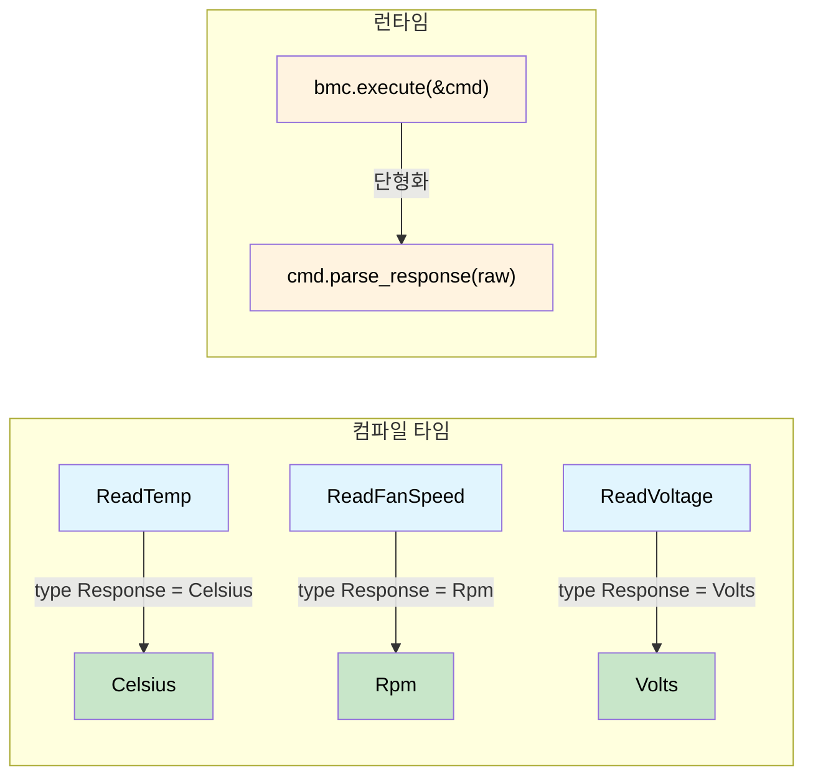

# 타입이 있는 명령 인터페이스 — 요청이 응답을 결정한다 🟡

> **이 장에서 배울 내용:** 명령 트레잇의 연관 타입이 요청과 응답을 컴파일 타임에 묶어, IPMI·Redfish·NVMe 프로토콜 전반에서 파싱 불일치, 단위 혼동, 조용한 타입 강제 변환을 없애는 방법입니다.
>
> **교차 참조:** [ch01](ch01-the-philosophy-why-types-beat-tests.md)(철학), [ch06](ch06-dimensional-analysis-making-the-compiler.md)(차원 타입), [ch07](ch07-validated-boundaries-parse-dont-validate.md)(검증된 경계), [ch10](ch10-putting-it-all-together-a-complete-diagn.md)(통합)

<a id="the-untyped-swamp"></a>
## 타입 없는 늪

대부분의 하드웨어 관리 스택 — IPMI, Redfish, NVMe Admin, PLDM —은 처음에
`바이트 들어가고 바이트 나온다`로 시작합니다. 테스트가 부분적으로만 찾을 수 있는 버그 클래스가 생깁니다.

```rust,ignore
use std::io;

struct BmcRaw { /* ipmitool handle */ }

impl BmcRaw {
    fn raw_command(&self, net_fn: u8, cmd: u8, data: &[u8]) -> io::Result<Vec<u8>> {
        // ... shells out to ipmitool ...
        Ok(vec![0x00, 0x19, 0x00]) // stub
    }
}

fn diagnose_thermal(bmc: &BmcRaw) -> io::Result<()> {
    let raw = bmc.raw_command(0x04, 0x2D, &[0x20])?;
    let cpu_temp = raw[0] as f64;        // 🤞 바이트 0이 읽기 값인가?

    let raw = bmc.raw_command(0x04, 0x2D, &[0x30])?;
    let fan_rpm = raw[0] as u32;         // 🐛 팬 속도는 2바이트 LE

    let raw = bmc.raw_command(0x04, 0x2D, &[0x40])?;
    let voltage = raw[0] as f64;         // 🐛 1000으로 나눠야 함

    if cpu_temp > fan_rpm as f64 {       // 🐛 °C와 RPM 비교
        println!("uh oh");
    }

    log_temp(voltage);                   // 🐛 볼트를 온도 로거에 전달
    Ok(())
}

fn log_temp(t: f64) { println!("Temp: {t}°C"); }
```

| # | 버그 | 발견 시점 |
|---|-----|------------|
| 1 | 팬 RPM을 1바이트로 파싱 | 프로덕션, 새벽 3시 |
| 2 | 전압 스케일 미적용 | 모든 PSU가 과전압으로 표시 |
| 3 | °C와 RPM 비교 | 아마 영원히 없음 |
| 4 | 볼트를 온도 로거에 전달 | 6개월 뒤, 과거 데이터 조회 중 |

**근본 원인:** 모두 `Vec<u8>` → `f64` → 기도입니다.

<a id="the-typed-command-pattern"></a>
## 타입이 있는 명령 패턴

<a id="step-1-domain-newtypes"></a>
### 1단계 — 도메인 뉴타입

```rust,ignore
#[derive(Debug, Clone, Copy, PartialEq, PartialOrd)]
pub struct Celsius(pub f64);

#[derive(Debug, Clone, Copy, PartialEq, PartialOrd)]
pub struct Rpm(pub u32);  // u32: 원시 IPMI 센서 값(정수 RPM)

#[derive(Debug, Clone, Copy, PartialEq, PartialOrd)]
pub struct Volts(pub f64);

#[derive(Debug, Clone, Copy, PartialEq, PartialOrd)]
pub struct Watts(pub f64);
```

> **`Rpm(u32)` vs `Rpm(f64)`에 대한 참고:** 이 장에서는 내부 타입이 `u32`인 이유는 IPMI 센서 읽기가 정수 값이기 때문입니다. ch06(차원 분석)에서는 `Rpm`이 `f64`를 씁니다(평균, 스케일링 등 산술). 둘 다 유효하며, 뉴타입이 내부 타입과 관계없이 단위 혼동을 막습니다.

<a id="step-2-the-command-trait"></a>
### 2단계 — 명령 트레잇(타입 인덱스 디스패치)

> **배경: GADT를 한 단락으로.**
> Haskell 등에서는 *일반화 대수 자료형*(GADT,
> [GADT](https://wiki.haskell.org/GADTs_for_dummies))이 자료형의 각 생성자마다
> 타입 매개변수를 특정 값으로 고정할 수 있습니다. 예를 들어
> `ReadTemp :: SensorId -> Cmd Celsius`는 "`ReadTemp` 값을 만들면
> 타입 매개변수가 항상 `Celsius`인 `Cmd`가 된다"는 뜻입니다.
> Rust는 **연관 타입**으로 같은 효과를 냅니다. 각 구현 구조체가 응답 타입을
> 컴파일 타임에 고정합니다. Haskell을 몰라도 이 패턴을 쓸 수 있으며,
> Rust 버전만으로도 충분합니다.

연관 타입 `Response`가 핵심입니다. 각 명령 구조체에 반환 타입을 묶어
`execute()`가 항상 정확한 타입만 돌려줍니다.

```rust,ignore
pub trait IpmiCmd {
    /// "타입 인덱스" — execute()가 무엇을 반환할지 결정합니다.
    type Response;

    fn net_fn(&self) -> u8;
    fn cmd_byte(&self) -> u8;
    fn payload(&self) -> Vec<u8>;

    /// 파싱은 여기에 캡슐화 — 각 명령이 자신의 바이트 레이아웃을 앎.
    fn parse_response(&self, raw: &[u8]) -> io::Result<Self::Response>;
}
```

<a id="step-3-one-struct-per-command"></a>
### 3단계 — 명령마다 구조체 하나

```rust,ignore
pub struct ReadTemp { pub sensor_id: u8 }
impl IpmiCmd for ReadTemp {
    type Response = Celsius;
    fn net_fn(&self) -> u8 { 0x04 }
    fn cmd_byte(&self) -> u8 { 0x2D }
    fn payload(&self) -> Vec<u8> { vec![self.sensor_id] }
    fn parse_response(&self, raw: &[u8]) -> io::Result<Celsius> {
        if raw.is_empty() {
            return Err(io::Error::new(io::ErrorKind::InvalidData, "empty response"));
        }
        // 참고: ch01의 타입 없는 예는 SDR 메타데이터 없이 일반 파싱을 보여주기 위해
        // `raw[0] as i8 as f64`(부호 있음)를 썼습니다. 여기서는 부호 없음(`as f64`)을 쓰는데,
        // IPMI 규격 §35.5의 SDR 선형화는 부호 없는 원시 읽기를 보정값으로 바꿉니다. 프로덕션에서는
        // 전체 SDR 공식을 적용하세요: result = (M × raw + B) × 10^(R_exp).
        Ok(Celsius(raw[0] as f64))  // 부호 없는 원시 바이트, SDR 공식에 따라 변환
    }
}

pub struct ReadFanSpeed { pub fan_id: u8 }
impl IpmiCmd for ReadFanSpeed {
    type Response = Rpm;
    fn net_fn(&self) -> u8 { 0x04 }
    fn cmd_byte(&self) -> u8 { 0x2D }
    fn payload(&self) -> Vec<u8> { vec![self.fan_id] }
    fn parse_response(&self, raw: &[u8]) -> io::Result<Rpm> {
        if raw.len() < 2 {
            return Err(io::Error::new(io::ErrorKind::InvalidData,
                format!("fan speed needs 2 bytes, got {}", raw.len())));
        }
        Ok(Rpm(u16::from_le_bytes([raw[0], raw[1]]) as u32))
    }
}

pub struct ReadVoltage { pub rail: u8 }
impl IpmiCmd for ReadVoltage {
    type Response = Volts;
    fn net_fn(&self) -> u8 { 0x04 }
    fn cmd_byte(&self) -> u8 { 0x2D }
    fn payload(&self) -> Vec<u8> { vec![self.rail] }
    fn parse_response(&self, raw: &[u8]) -> io::Result<Volts> {
        if raw.len() < 2 {
            return Err(io::Error::new(io::ErrorKind::InvalidData,
                format!("voltage needs 2 bytes, got {}", raw.len())));
        }
        Ok(Volts(u16::from_le_bytes([raw[0], raw[1]]) as f64 / 1000.0))
    }
}
```

<a id="step-4-the-executor"></a>
### 4단계 — 실행기(`dyn` 없음, 단형화)

```rust,ignore
pub struct BmcConnection { pub timeout_secs: u32 }

impl BmcConnection {
    pub fn execute<C: IpmiCmd>(&self, cmd: &C) -> io::Result<C::Response> {
        let raw = self.raw_send(cmd.net_fn(), cmd.cmd_byte(), &cmd.payload())?;
        cmd.parse_response(&raw)
    }

    fn raw_send(&self, _nf: u8, _cmd: u8, _data: &[u8]) -> io::Result<Vec<u8>> {
        Ok(vec![0x19, 0x00]) // stub
    }
}
```

<a id="step-5-all-four-bugs-become-compile-errors"></a>
### 5단계 — 네 가지 버그가 모두 컴파일 에러로

```rust,ignore
fn diagnose_thermal_typed(bmc: &BmcConnection) -> io::Result<()> {
    let cpu_temp: Celsius = bmc.execute(&ReadTemp { sensor_id: 0x20 })?;
    let fan_rpm:  Rpm     = bmc.execute(&ReadFanSpeed { fan_id: 0x30 })?;
    let voltage:  Volts   = bmc.execute(&ReadVoltage { rail: 0x40 })?;

    // 버그 #1 — 불가능: 파싱은 ReadFanSpeed::parse_response에 있음
    // 버그 #2 — 불가능: 단위 스케일은 ReadVoltage::parse_response에 있음

    // 버그 #3 — 컴파일 에러:
    // if cpu_temp > fan_rpm { }
    //    ^^^^^^^^   ^^^^^^^ Celsius vs Rpm → "mismatched types" ❌

    // 버그 #4 — 컴파일 에러:
    // log_temperature(voltage);
    //                 ^^^^^^^ Volts, expected Celsius ❌

    if cpu_temp > Celsius(85.0) { println!("CPU overheating: {:?}", cpu_temp); }
    if fan_rpm < Rpm(4000)      { println!("Fan too slow: {:?}", fan_rpm); }

    Ok(())
}

fn log_temperature(t: Celsius) { println!("Temp: {:?}", t); }
fn log_voltage(v: Volts)       { println!("Voltage: {:?}", v); }
```

<a id="ipmi-sensor-reads-that-cant-be-confused"></a>
## IPMI: 혼동할 수 없는 센서 읽기

새 센서는 구조체 하나 + impl 하나로 추가 — 파싱이 여기저기 흩어지지 않습니다.

```rust,ignore
pub struct ReadPowerDraw { pub domain: u8 }
impl IpmiCmd for ReadPowerDraw {
    type Response = Watts;
    fn net_fn(&self) -> u8 { 0x04 }
    fn cmd_byte(&self) -> u8 { 0x2D }
    fn payload(&self) -> Vec<u8> { vec![self.domain] }
    fn parse_response(&self, raw: &[u8]) -> io::Result<Watts> {
        if raw.len() < 2 {
            return Err(io::Error::new(io::ErrorKind::InvalidData,
                format!("power draw needs 2 bytes, got {}", raw.len())));
        }
        Ok(Watts(u16::from_le_bytes([raw[0], raw[1]]) as f64))
    }
}

// bmc.execute(&ReadPowerDraw { domain: 0 })를 쓰는 모든 호출자는
// 자동으로 Watts를 받음 — 다른 곳에 파싱 코드가 없음
```

<a id="testing-each-command-in-isolation"></a>
### 명령을 각각 격리해 테스트

```rust,ignore
#[cfg(test)]
mod tests {
    use super::*;

    struct StubBmc {
        responses: std::collections::HashMap<u8, Vec<u8>>,
    }

    impl StubBmc {
        fn execute<C: IpmiCmd>(&self, cmd: &C) -> io::Result<C::Response> {
            let key = cmd.payload()[0];
            let raw = self.responses.get(&key)
                .ok_or_else(|| io::Error::new(io::ErrorKind::NotFound, "no stub"))?;
            cmd.parse_response(raw)
        }
    }

    #[test]
    fn read_temp_parses_raw_byte() {
        let bmc = StubBmc {
            responses: [(0x20, vec![0x19])].into(), // 25 decimal = 0x19
        };
        let temp = bmc.execute(&ReadTemp { sensor_id: 0x20 }).unwrap();
        assert_eq!(temp, Celsius(25.0));
    }

    #[test]
    fn read_fan_parses_two_byte_le() {
        let bmc = StubBmc {
            responses: [(0x30, vec![0x00, 0x19])].into(), // 0x1900 = 6400
        };
        let rpm = bmc.execute(&ReadFanSpeed { fan_id: 0x30 }).unwrap();
        assert_eq!(rpm, Rpm(6400));
    }

    #[test]
    fn read_voltage_scales_millivolts() {
        let bmc = StubBmc {
            responses: [(0x40, vec![0xE8, 0x2E])].into(), // 0x2EE8 = 12008 mV
        };
        let v = bmc.execute(&ReadVoltage { rail: 0x40 }).unwrap();
        assert!((v.0 - 12.008).abs() < 0.001);
    }
}
```

<a id="redfish-schema-typed-rest-endpoints"></a>
## Redfish: 스키마로 타입이 정해진 REST 엔드포인트

Redfish는 더 잘 맞습니다 — 각 엔드포인트가 DMTF가 정의한 JSON 스키마를 반환합니다.

```rust,ignore
use serde::Deserialize;

#[derive(Debug, Deserialize)]
pub struct ThermalResponse {
    #[serde(rename = "Temperatures")]
    pub temperatures: Vec<RedfishTemp>,
    #[serde(rename = "Fans")]
    pub fans: Vec<RedfishFan>,
}

#[derive(Debug, Deserialize)]
pub struct RedfishTemp {
    #[serde(rename = "Name")]
    pub name: String,
    #[serde(rename = "ReadingCelsius")]
    pub reading: f64,
    #[serde(rename = "UpperThresholdCritical")]
    pub critical_hi: Option<f64>,
    #[serde(rename = "Status")]
    pub status: RedfishHealth,
}

#[derive(Debug, Deserialize)]
pub struct RedfishFan {
    #[serde(rename = "Name")]
    pub name: String,
    #[serde(rename = "Reading")]
    pub rpm: u32,
    #[serde(rename = "Status")]
    pub status: RedfishHealth,
}

#[derive(Debug, Deserialize)]
pub struct PowerResponse {
    #[serde(rename = "Voltages")]
    pub voltages: Vec<RedfishVoltage>,
    #[serde(rename = "PowerSupplies")]
    pub psus: Vec<RedfishPsu>,
}

#[derive(Debug, Deserialize)]
pub struct RedfishVoltage {
    #[serde(rename = "Name")]
    pub name: String,
    #[serde(rename = "ReadingVolts")]
    pub reading: f64,
    #[serde(rename = "Status")]
    pub status: RedfishHealth,
}

#[derive(Debug, Deserialize)]
pub struct RedfishPsu {
    #[serde(rename = "Name")]
    pub name: String,
    #[serde(rename = "PowerOutputWatts")]
    pub output_watts: Option<f64>,
    #[serde(rename = "Status")]
    pub status: RedfishHealth,
}

#[derive(Debug, Deserialize)]
pub struct ProcessorResponse {
    #[serde(rename = "Model")]
    pub model: String,
    #[serde(rename = "TotalCores")]
    pub cores: u32,
    #[serde(rename = "Status")]
    pub status: RedfishHealth,
}

#[derive(Debug, Deserialize)]
pub struct RedfishHealth {
    #[serde(rename = "State")]
    pub state: String,
    #[serde(rename = "Health")]
    pub health: Option<String>,
}

/// 타입이 정해진 Redfish 엔드포인트 — 각각 응답 타입을 앎.
pub trait RedfishEndpoint {
    type Response: serde::de::DeserializeOwned;
    fn method(&self) -> &'static str;
    fn path(&self) -> String;
}

pub struct GetThermal { pub chassis_id: String }
impl RedfishEndpoint for GetThermal {
    type Response = ThermalResponse;
    fn method(&self) -> &'static str { "GET" }
    fn path(&self) -> String {
        format!("/redfish/v1/Chassis/{}/Thermal", self.chassis_id)
    }
}

pub struct GetPower { pub chassis_id: String }
impl RedfishEndpoint for GetPower {
    type Response = PowerResponse;
    fn method(&self) -> &'static str { "GET" }
    fn path(&self) -> String {
        format!("/redfish/v1/Chassis/{}/Power", self.chassis_id)
    }
}

pub struct GetProcessor { pub system_id: String, pub proc_id: String }
impl RedfishEndpoint for GetProcessor {
    type Response = ProcessorResponse;
    fn method(&self) -> &'static str { "GET" }
    fn path(&self) -> String {
        format!("/redfish/v1/Systems/{}/Processors/{}", self.system_id, self.proc_id)
    }
}

pub struct RedfishClient {
    pub base_url: String,
    pub auth_token: String,
}

impl RedfishClient {
    pub fn execute<E: RedfishEndpoint>(&self, endpoint: &E) -> io::Result<E::Response> {
        let url = format!("{}{}", self.base_url, endpoint.path());
        let json_bytes = self.http_request(endpoint.method(), &url)?;
        serde_json::from_slice(&json_bytes)
            .map_err(|e| io::Error::new(io::ErrorKind::InvalidData, e))
    }

    fn http_request(&self, _method: &str, _url: &str) -> io::Result<Vec<u8>> {
        Ok(vec![]) // stub — 실제 구현은 reqwest/hyper 사용
    }
}

// 사용 — 완전히 타입이 정해져 있고 자기 설명적
fn redfish_pre_flight(client: &RedfishClient) -> io::Result<()> {
    let thermal: ThermalResponse = client.execute(&GetThermal {
        chassis_id: "1".into(),
    })?;
    let power: PowerResponse = client.execute(&GetPower {
        chassis_id: "1".into(),
    })?;

    // ❌ 컴파일 에러 — PowerResponse를 thermal 검사에 넘길 수 없음:
    // check_thermals(&power);  → "expected ThermalResponse, found PowerResponse"

    for temp in &thermal.temperatures {
        if let Some(crit) = temp.critical_hi {
            if temp.reading > crit {
                println!("CRITICAL: {} at {}°C (threshold: {}°C)",
                    temp.name, temp.reading, crit);
            }
        }
    }
    Ok(())
}
```

<a id="nvme-admin-identify-doesnt-return-log-pages"></a>
## NVMe Admin: Identify는 로그 페이지를 반환하지 않음

NVMe admin 명령도 같은 형태입니다. 컨트롤러가 명령 코드로 구분하지만, C에서는 호출자가 4KB 완료 버퍼에 어떤 구조체를 올릴지 알아야 합니다. 타입이 있는 명령 패턴은 이런 실수를 컴파일 단계에서 막습니다.

```rust,ignore
use std::io;

/// NVMe Admin 명령 트레잇 — IpmiCmd와 같은 형태.
pub trait NvmeAdminCmd {
    type Response;
    fn opcode(&self) -> u8;
    fn parse_completion(&self, data: &[u8]) -> io::Result<Self::Response>;
}

// ── Identify (opcode 0x06) ──

#[derive(Debug, Clone)]
pub struct IdentifyResponse {
    pub model_number: String,   // bytes 24–63
    pub serial_number: String,  // bytes 4–23
    pub firmware_rev: String,   // bytes 64–71
    pub total_capacity_gb: u64,
}

pub struct Identify {
    pub nsid: u32, // 0 = controller, >0 = namespace
}

impl NvmeAdminCmd for Identify {
    type Response = IdentifyResponse;
    fn opcode(&self) -> u8 { 0x06 }
    fn parse_completion(&self, data: &[u8]) -> io::Result<IdentifyResponse> {
        if data.len() < 4096 {
            return Err(io::Error::new(io::ErrorKind::InvalidData, "short identify"));
        }
        Ok(IdentifyResponse {
            serial_number: String::from_utf8_lossy(&data[4..24]).trim().to_string(),
            model_number: String::from_utf8_lossy(&data[24..64]).trim().to_string(),
            firmware_rev: String::from_utf8_lossy(&data[64..72]).trim().to_string(),
            total_capacity_gb: u64::from_le_bytes(
                data[280..288].try_into().unwrap()
            ) / (1024 * 1024 * 1024),
        })
    }
}

// ── Get Log Page (opcode 0x02) ──

#[derive(Debug, Clone)]
pub struct SmartLog {
    pub critical_warning: u8,
    pub temperature_kelvin: u16,
    pub available_spare_pct: u8,
    pub data_units_read: u128,
}

pub struct GetLogPage {
    pub log_id: u8, // 0x02 = SMART/Health
}

impl NvmeAdminCmd for GetLogPage {
    type Response = SmartLog;
    fn opcode(&self) -> u8 { 0x02 }
    fn parse_completion(&self, data: &[u8]) -> io::Result<SmartLog> {
        if data.len() < 512 {
            return Err(io::Error::new(io::ErrorKind::InvalidData, "short log page"));
        }
        Ok(SmartLog {
            critical_warning: data[0],
            temperature_kelvin: u16::from_le_bytes([data[1], data[2]]),
            available_spare_pct: data[3],
            data_units_read: u128::from_le_bytes(data[32..48].try_into().unwrap()),
        })
    }
}

// ── 실행기 ──

pub struct NvmeController { /* fd, BAR, etc. */ }

impl NvmeController {
    pub fn admin_cmd<C: NvmeAdminCmd>(&self, cmd: &C) -> io::Result<C::Response> {
        let raw = self.submit_and_wait(cmd.opcode())?;
        cmd.parse_completion(&raw)
    }

    fn submit_and_wait(&self, _opcode: u8) -> io::Result<Vec<u8>> {
        Ok(vec![0u8; 4096]) // stub — 실제 구현은 doorbell 발행 + CQ 엔트리 대기
    }
}

// ── 사용 ──

fn nvme_health_check(ctrl: &NvmeController) -> io::Result<()> {
    let id: IdentifyResponse = ctrl.admin_cmd(&Identify { nsid: 0 })?;
    let smart: SmartLog = ctrl.admin_cmd(&GetLogPage { log_id: 0x02 })?;

    // ❌ 컴파일 에러 — Identify는 IdentifyResponse를 반환하고 SmartLog가 아님:
    // let smart: SmartLog = ctrl.admin_cmd(&Identify { nsid: 0 })?;

    println!("{} (FW {}): {}°C, {}% spare",
        id.model_number, id.firmware_rev,
        smart.temperature_kelvin.saturating_sub(273),
        smart.available_spare_pct);

    Ok(())
}
```

세 프로토콜 진행은 **단계적으로 깊어지는 호**(ch07의 검증된 경계와 같은 기법)를 따릅니다.

| 단계 | 프로토콜 | 복잡도 | 추가되는 것 |
|:----:|----------|-----------|--------------|
| 1 | IPMI | 단순: 센서 ID → 읽기 | 핵심 패턴: `trait + 연관 타입` |
| 2 | Redfish | REST: 엔드포인트 → 타입이 정해진 JSON | Serde 연동, 스키마로 타입이 정해진 응답 |
| 3 | NVMe | 바이너리: opcode → 4KB 구조체 오버레이 | 원시 버퍼 파싱, 여러 구조체 완료 데이터 |

<a id="extension-macro-dsl-for-command-scripts"></a>
## 확장: 명령 스크립트용 매크로 DSL

```rust,ignore
/// 타입이 정해진 IPMI 명령 시퀀스를 실행하고 결과 튜플을 반환합니다.
macro_rules! diag_script {
    ($bmc:expr; $($cmd:expr),+ $(,)?) => {{
        ( $( $bmc.execute(&$cmd)?, )+ )
    }};
}

fn full_pre_flight(bmc: &BmcConnection) -> io::Result<()> {
    let (temp, rpm, volts) = diag_script!(bmc;
        ReadTemp     { sensor_id: 0x20 },
        ReadFanSpeed { fan_id:    0x30 },
        ReadVoltage  { rail:      0x40 },
    );
    // 타입: (Celsius, Rpm, Volts) — 완전히 추론됨, 순서 바꾸면 컴파일 에러
    assert!(temp  < Celsius(95.0), "CPU too hot");
    assert!(rpm   > Rpm(3000),     "Fan too slow");
    assert!(volts > Volts(11.4),   "12V rail sagging");
    Ok(())
}
```

<a id="extension-enum-dispatch-for-dynamic-scripts"></a>
## 확장: 동적 스크립트를 위한 열거형 디스패치

런타임에 JSON 설정에서 명령이 오는 경우:

```rust,ignore
pub enum AnyReading {
    Temp(Celsius),
    Rpm(Rpm),
    Volt(Volts),
    Watt(Watts),
}

pub enum AnyCmd {
    Temp(ReadTemp),
    Fan(ReadFanSpeed),
    Voltage(ReadVoltage),
    Power(ReadPowerDraw),
}

impl AnyCmd {
    pub fn execute(&self, bmc: &BmcConnection) -> io::Result<AnyReading> {
        match self {
            AnyCmd::Temp(c)    => Ok(AnyReading::Temp(bmc.execute(c)?)),
            AnyCmd::Fan(c)     => Ok(AnyReading::Rpm(bmc.execute(c)?)),
            AnyCmd::Voltage(c) => Ok(AnyReading::Volt(bmc.execute(c)?)),
            AnyCmd::Power(c)   => Ok(AnyReading::Watt(bmc.execute(c)?)),
        }
    }
}

fn run_dynamic_script(bmc: &BmcConnection, script: &[AnyCmd]) -> io::Result<Vec<AnyReading>> {
    script.iter().map(|cmd| cmd.execute(bmc)).collect()
}
```

<a id="the-pattern-family"></a>
## 패턴 패밀리

이 패턴은 **모든** 하드웨어 관리 프로토콜에 적용됩니다.

| 프로토콜 | 요청 타입 | 응답 타입 |
|----------|-------------|---------------|
| IPMI 센서 읽기 | `ReadTemp` | `Celsius` |
| Redfish REST | `GetThermal` | `ThermalResponse` |
| NVMe Admin | `Identify` | `IdentifyResponse` |
| PLDM | `GetFwParams` | `FwParamsResponse` |
| MCTP | `GetEid` | `EidResponse` |
| PCIe 설정 공간 | `ReadCapability` | `CapabilityHeader` |
| SMBIOS/DMI | `ReadType17` | `MemoryDeviceInfo` |

요청 타입이 응답 타입을 **결정**합니다 — 컴파일러가 어디서나 강제합니다.

<a id="aside-how-this-compares-to-haskell-gadts"></a>
### 곁다리: Haskell GADT와 비교

Haskell GADT를 본 적이 있다면 직접 대응 관계는 아래와 같습니다. 없다면 이 표는 건너뛰어도 됩니다 — 위의 Rust 버전만으로도 전체 그림입니다.

```text
Haskell GADT                         Rust 대응
────────────────                     ───────────────────────
data Cmd a where                     trait IpmiCmd {
  ReadTemp :: Id -> Cmd Celsius          type Response;
  ReadFan  :: Id -> Cmd Rpm              ...
                                     }

eval :: Cmd a -> IO a                fn execute<C: IpmiCmd>(&self, cmd: &C)
                                         -> io::Result<C::Response>
```

둘 다 **명령이 반환 타입을 결정**한다는 보장을 줍니다.

<a id="typed-command-flow"></a>
## 타입이 있는 명령 흐름



<a id="exercise-pldm-typed-commands"></a>
## 연습문제: PLDM 타입이 있는 명령

`IpmiCmd`와 같은 형태의 `PldmCmd` 트레잇을 두 PLDM 명령용으로 설계하세요.
- `GetFwParams` → `FwParamsResponse { active_version: String, pending_version: Option<String> }`
- `QueryDeviceIds` → `DeviceIdResponse { descriptors: Vec<Descriptor> }`

요구사항: 정적 디스패치, `parse_response`는 `io::Result<Self::Response>`를 반환.

<details>
<summary>해답</summary>

```rust,ignore
use std::io;

pub trait PldmCmd {
    type Response;
    fn pldm_type(&self) -> u8;
    fn command_code(&self) -> u8;
    fn parse_response(&self, raw: &[u8]) -> io::Result<Self::Response>;
}

#[derive(Debug, Clone)]
pub struct FwParamsResponse {
    pub active_version: String,
    pub pending_version: Option<String>,
}

pub struct GetFwParams;
impl PldmCmd for GetFwParams {
    type Response = FwParamsResponse;
    fn pldm_type(&self) -> u8 { 0x05 } // Firmware Update
    fn command_code(&self) -> u8 { 0x02 }
    fn parse_response(&self, raw: &[u8]) -> io::Result<FwParamsResponse> {
        // 단순화 — 실제 구현은 PLDM FW Update 규격 필드를 디코딩
        if raw.len() < 4 {
            return Err(io::Error::new(io::ErrorKind::InvalidData, "too short"));
        }
        Ok(FwParamsResponse {
            active_version: String::from_utf8_lossy(&raw[..4]).to_string(),
            pending_version: None,
        })
    }
}

#[derive(Debug, Clone)]
pub struct Descriptor { pub descriptor_type: u16, pub data: Vec<u8> }

#[derive(Debug, Clone)]
pub struct DeviceIdResponse { pub descriptors: Vec<Descriptor> }

pub struct QueryDeviceIds;
impl PldmCmd for QueryDeviceIds {
    type Response = DeviceIdResponse;
    fn pldm_type(&self) -> u8 { 0x05 }
    fn command_code(&self) -> u8 { 0x04 }
    fn parse_response(&self, raw: &[u8]) -> io::Result<DeviceIdResponse> {
        Ok(DeviceIdResponse { descriptors: vec![] }) // stub
    }
}
```

</details>

<a id="key-takeaways"></a>
## 핵심 정리

1. **연관 타입 = 컴파일 타임 계약** — 명령 트레잇의 `type Response`가 각 요청을 정확히 하나의 응답 타입에 고정합니다.
2. **파싱은 캡슐화** — 바이트 레이아웃 지식은 `parse_response`에만 있고 호출자 전역에 흩어지지 않습니다.
3. **제로 코스트 디스패치** — 제네릭 `execute<C: IpmiCmd>`는 vtable 없이 단형화되어 직접 호출로 갑니다.
4. **한 패턴, 여러 프로토콜** — IPMI, Redfish, NVMe, PLDM, MCTP 모두 `trait Cmd { type Response; }` 형태에 맞습니다.
5. **열거형 디스패치로 정적·동적 연결** — 타입이 있는 명령을 열거형으로 감싸 런타임 주도 스크립트에 쓰되, 각 팔 안에서는 타입 안전성을 유지합니다.
6. **복잡도를 단계적으로 쌓아 직관을 강화** — IPMI(센서 ID → 읽기), Redfish(엔드포인트 → JSON 스키마), NVMe(opcode → 4KB 구조체 오버레이)는 같은 트레잇 형태지만, 단계마다 파싱 복잡도가 한 겹씩 더해집니다.

---

