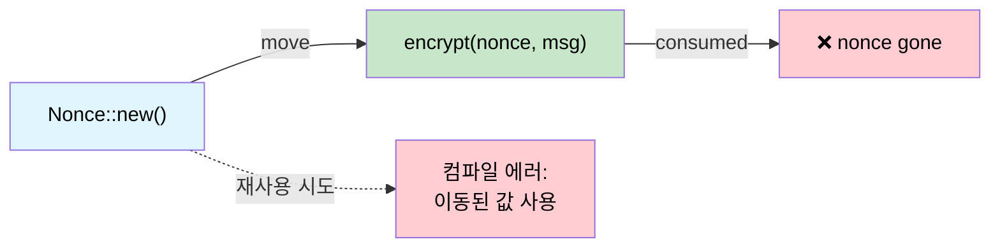

# 단일 사용 타입 — 소유권을 통한 암호학적 보장 🟡

> **이 장에서 배울 내용:** Rust의 move 의미가 선형 타입 시스템처럼 동작해 논스 재사용, 키 합의 이중 사용, 실수로 퓨즈를 두 번 프로그래밍하는 일을 컴파일 타임에 불가능하게 만드는 방법입니다.
>
> **교차 참조:** [ch01](ch01-the-philosophy-why-types-beat-tests.md)(철학), [ch04](ch04-capability-tokens-zero-cost-proof-of-aut.md)(capability token), [ch05](ch05-protocol-state-machines-type-state-for-r.md)(타입 상태), [ch14](ch14-testing-type-level-guarantees.md)(컴파일 실패 테스트)

<a id="the-nonce-reuse-catastrophe"></a>
## 논스 재사용의 재앙

인증된 암호화(AES-GCM, ChaCha20-Poly1305)에서 같은 키로 논스를 재사용하면 **치명적**입니다 — 두 평문의 XOR이 새고 인증 키 자체가 새는 경우가 많습니다. 이론만의 문제가 아닙니다.

- **2016**: TLS의 AES-GCM에 대한 Forbidden Attack — 논스 재사용으로 평문 복구 가능
- **2020**: 여러 IoT 펌웨어 업데이트가 열악한 RNG 때문에 논스를 재사용한 것으로 밝혀짐

C/C++에서는 논스가 그저 `uint8_t[12]`입니다. 두 번 쓰는 것을 막을 수 없습니다.

```c
// C — 논스 재사용을 막을 수 없음
uint8_t nonce[12];
generate_nonce(nonce);
encrypt(key, nonce, msg1, out1);   // ✅ 첫 사용
encrypt(key, nonce, msg2, out2);   // 🐛 재앙: 같은 논스
```

<a id="move-semantics-as-linear-types"></a>
## 선형 타입으로서의 move 의미

Rust의 소유권 시스템은 실질적으로 **선형 타입 시스템**입니다 — 값은 `Copy`가 아니면 정확히 한 번(이동으로) 쓰입니다. `ring` 크레이트가 이를 활용합니다.

```rust,ignore
// ring::aead::Nonce는:
// - Clone 아님
// - Copy 아님
// - 사용 시 값으로 소비됨
pub struct Nonce(/* private */);

impl Nonce {
    pub fn try_assume_unique_for_key(value: &[u8]) -> Result<Self, Unspecified> {
        // ...
    }
    // Clone, Copy 없음 — 한 번만 사용 가능
}
```

`Nonce`를 `seal_in_place()`에 넘기면 **이동**합니다.

```rust,ignore
// ring API 형태를 반영한 의사 코드
fn seal_in_place(
    key: &SealingKey,
    nonce: Nonce,       // ← 이동됨, 빌림 아님
    data: &mut Vec<u8>,
) -> Result<(), Error> {
    // ... encrypt data in place ...
    // nonce는 소비됨 — 다시 쓸 수 없음
    Ok(())
}
```

재사용을 시도하면:

```rust,ignore
fn bad_encrypt(key: &SealingKey, data1: &mut Vec<u8>, data2: &mut Vec<u8>) {
    let nonce = Nonce::try_assume_unique_for_key(&[0u8; 12]).unwrap();
    seal_in_place(key, nonce, data1).unwrap();  // ✅ 여기서 nonce 이동
    // seal_in_place(key, nonce, data2).unwrap();
    //                    ^^^^^ ERROR: use of moved value ❌
}
```

컴파일러가 각 논스가 **정확히 한 번**만 쓰인다는 것을 **증명**합니다. 테스트가 필요 없습니다.

<a id="case-study-rings-nonce"></a>
## 사례 연구: ring의 Nonce

`ring` 크레이트는 `NonceSequence`로 한 걸음 더 나아갑니다 — 논스를 **생성**하는 트레잇이며 역시 복제할 수 없습니다.

```rust,ignore
/// 유일한 논스의 시퀀스.
/// Clone 아님 — 키에 한 번 묶이면 복제 불가.
pub trait NonceSequence {
    fn advance(&mut self) -> Result<Nonce, Unspecified>;
}

/// SealingKey는 NonceSequence를 감쌈 — seal()마다 자동으로 증가.
pub struct SealingKey<N: NonceSequence> {
    key: UnboundKey,   // 생성 시 소비됨
    nonce_seq: N,
}

impl<N: NonceSequence> SealingKey<N> {
    pub fn new(key: UnboundKey, nonce_seq: N) -> Self {
        // UnboundKey는 이동됨 — 봉인과 개방 둘 다에 쓸 수 없음
        SealingKey { key, nonce_seq }
    }

    pub fn seal_in_place_append_tag(
        &mut self,       // &mut — 독점 접근
        aad: Aad<&[u8]>,
        in_out: &mut Vec<u8>,
    ) -> Result<(), Unspecified> {
        let nonce = self.nonce_seq.advance()?; // 유일한 논스 자동 생성
        // ... encrypt with nonce ...
        Ok(())
    }
}
# pub struct UnboundKey;
# pub struct Aad<T>(T);
# pub struct Unspecified;
```

소유권 체인이 다음을 막습니다.
1. **논스 재사용** — `Nonce`는 `Clone`이 아니며 호출마다 소비
2. **키 복제** — `UnboundKey`는 `SealingKey`로 이동되어 `OpeningKey`와 겸용 불가
3. **시퀀스 복제** — `NonceSequence`는 `Clone`이 아니므로 두 키가 카운터를 공유할 수 없음

**이 중 어느 것도 런타임 검사가 필요 없습니다.** 컴파일러가 셋 모두를 강제합니다.

<a id="case-study-ephemeral-key-agreement"></a>
## 사례 연구: 일시적 키 합의

일시적 Diffie–Hellman 키는 **정확히 한 번**만 쓰여야 합니다(“일시적”의 의미). `ring`이 이를 강제합니다.

```rust,ignore
/// 일시적 비밀키. Clone, Copy 아님.
/// agree_ephemeral()에 의해 소비됨.
pub struct EphemeralPrivateKey { /* ... */ }

/// 공유 비밀 계산 — 비밀키를 소비합니다.
pub fn agree_ephemeral(
    my_private_key: EphemeralPrivateKey,  // ← 이동
    peer_public_key: &UnparsedPublicKey,
    error_value: Unspecified,
    kdf: impl FnOnce(&[u8]) -> Result<SharedSecret, Unspecified>,
) -> Result<SharedSecret, Unspecified> {
    // ... DH 계산 ...
    // my_private_key는 소비됨 — 재사용 불가
    # kdf(&[])
}
# pub struct UnparsedPublicKey;
# pub struct SharedSecret;
# pub struct Unspecified;
```

`agree_ephemeral()` 호출 후 비밀키는 메모리에 **더 이상 존재하지 않습니다**(드롭됨). C++ 개발자는 `memset(key, 0, len)`을 기억하고 컴파일러가 최적화해 없애지 않기를 바랄 뿐입니다. Rust에서는 키가 그냥 사라집니다.

<a id="hardware-application-one-time-fuse-programming"></a>
## 하드웨어 적용: 일회성 퓨즈 프로그래밍

서버 플랫폼에는 보안 키, 보드 시리얼, 기능 비트용 **OTP(일회성 프로그래머블) 퓨즈**가 있습니다. 퓨즈 쓰기는 되돌릴 수 없고, 다른 데이터로 두 번 쓰면 보드가 망가집니다. move 의미와 잘 맞습니다.

```rust,ignore
use std::io;

/// 퓨즈 쓰기 페이로드. Clone, Copy 아님.
/// 퓨즈를 프로그래밍할 때 소비됨.
pub struct FusePayload {
    address: u32,
    data: Vec<u8>,
    // private 생성자 — 검증된 빌더로만 생성
}

/// 퓨즈 프로그래머가 올바른 상태임을 증명.
pub struct FuseController {
    /* hardware handle */
}

impl FuseController {
    /// 퓨즈 프로그래밍 — 페이로드를 소비해 이중 쓰기 방지.
    pub fn program(
        &mut self,
        payload: FusePayload,  // ← 이동 — 두 번 쓸 수 없음
    ) -> io::Result<()> {
        // ... OTP 하드웨어에 쓰기 ...
        // payload는 소비됨 — 같은 payload로 다시 program하려 하면 컴파일 에러
        Ok(())
    }
}

/// 검증이 있는 빌더 — FusePayload를 만드는 유일한 방법.
pub struct FusePayloadBuilder {
    address: Option<u32>,
    data: Option<Vec<u8>>,
}

impl FusePayloadBuilder {
    pub fn new() -> Self {
        FusePayloadBuilder { address: None, data: None }
    }

    pub fn address(mut self, addr: u32) -> Self {
        self.address = Some(addr);
        self
    }

    pub fn data(mut self, data: Vec<u8>) -> Self {
        self.data = Some(data);
        self
    }

    pub fn build(self) -> Result<FusePayload, &'static str> {
        let address = self.address.ok_or("address required")?;
        let data = self.data.ok_or("data required")?;
        if data.len() > 32 { return Err("fuse data too long"); }
        Ok(FusePayload { address, data })
    }
}

// 사용:
fn program_board_serial(ctrl: &mut FuseController) -> io::Result<()> {
    let payload = FusePayloadBuilder::new()
        .address(0x100)
        .data(b"SN12345678".to_vec())
        .build()
        .map_err(|e| io::Error::new(io::ErrorKind::InvalidInput, e))?;

    ctrl.program(payload)?;      // ✅ payload 소비

    // ctrl.program(payload);    // ❌ ERROR: use of moved value
    //              ^^^^^^^ value used after move

    Ok(())
}
```

<a id="hardware-application-single-use-calibration-token"></a>
## 하드웨어 적용: 단일 사용 보정 토큰

일부 센서는 전원 주기당 **정확히 한 번**만 해야 하는 보정 단계가 있습니다. 보정 토큰이 이를 강제합니다.

```rust,ignore
/// 전원 시 한 번만 발급. Clone, Copy 아님.
pub struct CalibrationToken {
    _private: (),
}

pub struct SensorController {
    calibrated: bool,
}

impl SensorController {
    /// 전원 시 한 번 호출 — 보정 토큰을 반환.
    pub fn power_on() -> (Self, CalibrationToken) {
        (
            SensorController { calibrated: false },
            CalibrationToken { _private: () },
        )
    }

    /// 센서 보정 — 토큰을 소비.
    pub fn calibrate(&mut self, _token: CalibrationToken) -> io::Result<()> {
        // ... 보정 시퀀스 실행 ...
        self.calibrated = true;
        Ok(())
    }

    /// 센서 읽기 — 보정 후에만 의미 있음.
    ///
    /// **한계:** move 의미 보장은 *부분적*입니다. 호출자가
    /// `calibrate()`를 부르지 않고 `drop(cal_token)`만 할 수 있습니다 — 토큰은
    /// 파괴되지만 보정은 실행되지 않습니다. `#[must_use]` 주석(아래 참고)은
    /// 경고를 내지만 하드 에러는 아닙니다.
    ///
    /// 여기서 런타임 `self.calibrated` 검사는 그 **안전망**입니다. 완전한
    /// 컴파일 타임 해법은 ch05의 타입 상태 패턴을 보세요 — `send_command()`는
    /// `IpmiSession<Active>`에만 존재합니다.
    pub fn read(&self) -> io::Result<f64> {
        if !self.calibrated {
            return Err(io::Error::new(io::ErrorKind::Other, "not calibrated"));
        }
        Ok(25.0) // stub
    }
}

fn sensor_workflow() -> io::Result<()> {
    let (mut ctrl, cal_token) = SensorController::power_on();

    // cal_token을 어딘가에 써야 함 — Copy가 아니므로 소비 없이 드롭하면
    // 경고(또는 #[must_use] 시 에러)가 남
    ctrl.calibrate(cal_token)?;

    // 이제 읽기 가능:
    let temp = ctrl.read()?;
    println!("Temperature: {temp}°C");

    // 다시 보정 불가 — 토큰은 이미 소비됨:
    // ctrl.calibrate(cal_token);  // ❌ use of moved value

    Ok(())
}
```

<a id="when-to-use-single-use-types"></a>
### 단일 사용 타입을 쓸 때

| 시나리오 | 단일 사용(move) 의미를 쓸까? |
|----------|:------:|
| 암호학적 논스 | ✅ 항상 — 논스 재사용은 치명적 |
| 일시적 키(DH, ECDH) | ✅ 항상 — 재사용은 순방향 비밀성을 약화 |
| OTP 퓨즈 쓰기 | ✅ 항상 — 이중 쓰기는 하드웨어를 망가뜨림 |
| 라이선스 활성화 코드 | ✅ 보통 — 이중 활성화 방지 |
| 보정 토큰 | ✅ 보통 — 세션당 한 번 강제 |
| 파일 쓰기 핸들 | ⚠️ 경우에 따라 — 프로토콜에 따름 |
| DB 트랜잭션 핸들 | ⚠️ 경우에 따라 — 커밋/롤백은 단일 사용 |
| 일반 데이터 버퍼 | ❌ 재사용이 필요 — `&mut [u8]` 사용 |

<a id="single-use-ownership-flow"></a>
## 단일 사용 소유권 흐름



<a id="exercise-single-use-firmware-signing-token"></a>
## 연습문제: 단일 사용 펌웨어 서명 토큰

펌웨어 이미지에 **정확히 한 번만** 서명하는 데 쓸 `SigningToken`을 설계하세요.
- `SigningToken::issue(key_id: &str) -> SigningToken` (Clone, Copy 아님)
- `sign(token: SigningToken, image: &[u8]) -> SignedImage` (토큰 소비)
- 두 번 서명하려 하면 컴파일 에러가 나야 함.

<details>
<summary>해답</summary>

```rust,ignore
pub struct SigningToken {
    key_id: String,
    // NOT Clone, NOT Copy
}

pub struct SignedImage {
    pub signature: Vec<u8>,
    pub key_id: String,
}

impl SigningToken {
    pub fn issue(key_id: &str) -> Self {
        SigningToken { key_id: key_id.to_string() }
    }
}

pub fn sign(token: SigningToken, _image: &[u8]) -> SignedImage {
    // 토큰은 이동으로 소비 — 재사용 불가
    SignedImage {
        signature: vec![0xDE, 0xAD],  // stub
        key_id: token.key_id,
    }
}

// ✅ 컴파일됨:
// let tok = SigningToken::issue("release-key");
// let signed = sign(tok, &firmware_bytes);
//
// ❌ 컴파일 에러:
// let signed2 = sign(tok, &other_bytes);  // ERROR: use of moved value
```

</details>

<a id="key-takeaways"></a>
## 핵심 정리

1. **Move = 선형 사용** — Clone·Copy가 아닌 타입은 정확히 한 번 소비할 수 있고, 컴파일러가 강제합니다.
2. **논스 재사용은 치명적** — Rust 소유권이 규율이 아니라 구조적으로 막습니다.
3. **패턴은 암호를 넘어 확장** — OTP 퓨즈, 보정 토큰, 감사 로 항목 등 **최대 한 번**이어야 하는 모든 것.
4. **일시적 키는 순방향 비밀성을 공짜에 가깝게** — 키 합의 값이 파생 비밀로 이동하고 사라집니다.
5. **의심스러우면 `Clone` 제거** — 나중에 추가는 쉽습니다; 공개 API에서 제거하는 건 호환성 깨짐입니다.

---

