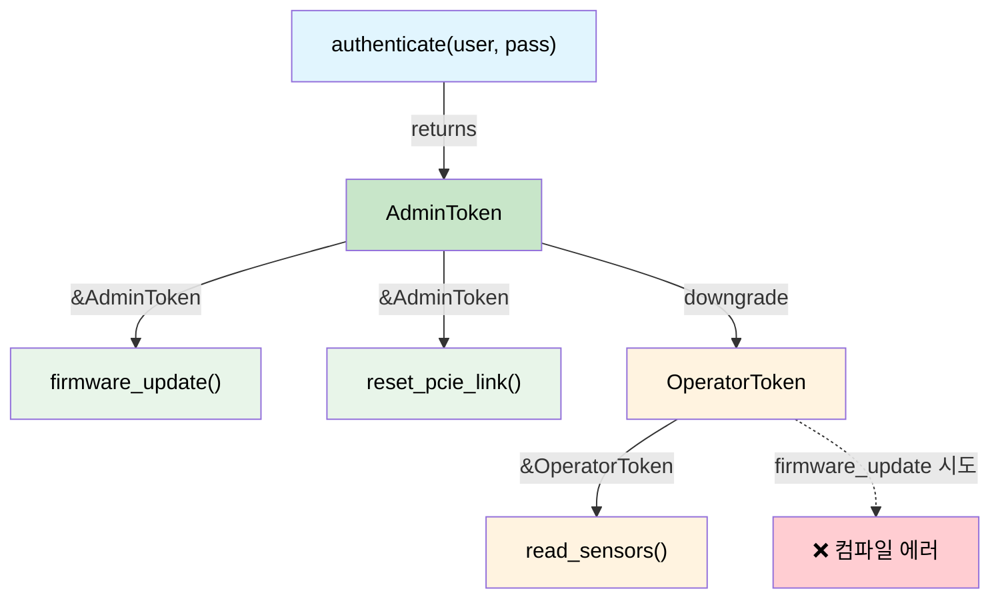

# Capability Token — 권한의 제로 코스트 증명 🟡

> **이 장에서 배울 내용:** 제로 크기 타입(ZST)이 컴파일 타임 증명 토큰으로 동작해 권한 계층, 전원 시퀀싱, 취소 가능한 권한을 모두 런타임 비용 없이 강제하는 방법입니다.
>
> **교차 참조:** [ch03](ch03-single-use-types-cryptographic-guarantee.md)(단일 사용 타입), [ch05](ch05-protocol-state-machines-type-state-for-r.md)(타입 상태), [ch08](ch08-capability-mixins-compile-time-hardware-.md)(믹스인), [ch10](ch10-putting-it-all-together-a-complete-diagn.md)(통합)

<a id="the-problem-who-is-allowed-to-do-what"></a>
## 문제: 누가 무엇을 할 수 있는가?

하드웨어 진단에서 일부 연산은 **위험**합니다.

- BMC 펌웨어 프로그래밍
- PCIe 링크 리셋
- OTP 퓨즈 쓰기
- 고전압 테스트 모드 활성화

C/C++에서는 런타임 검사로 막습니다.

```c
// C — 런타임 권한 검사
int reset_pcie_link(bmc_handle_t bmc, int slot) {
    if (!bmc->is_admin) {        // 런타임 검사
        return -EPERM;
    }
    if (!bmc->link_trained) {    // 또 다른 런타임 검사
        return -EINVAL;
    }
    // ... 위험한 작업 ...
    return 0;
}
```

위험한 일을 하는 모든 함수가 이 검사를 반복해야 합니다. 하나라도 빠지면 권한 상승 버그입니다.

<a id="zero-sized-types-as-proof-tokens"></a>
## 증명 토큰으로서의 제로 크기 타입

**capability token**은 행동 권한이 있다는 것을 증명하는 제로 크기 타입(ZST)입니다. 런타임에는 **0바이트** — 타입 시스템에만 존재합니다.

```rust,ignore
use std::marker::PhantomData;

/// 호출자가 관리자 권한이 있음을 증명.
/// 제로 크기 — 완전히 최적화로 사라짐.
/// Clone, Copy 아님 — 명시적으로 넘겨야 함.
pub struct AdminToken {
    _private: (),   // 이 모듈 밖에서 생성 방지
}

/// PCIe 링크가 학습되어 준비됨을 증명.
pub struct LinkTrainedToken {
    _private: (),
}

pub struct BmcController { /* ... */ }

impl BmcController {
    /// 관리자로 인증 — capability token을 반환.
    /// AdminToken을 만드는 유일한 방법.
    pub fn authenticate_admin(
        &mut self,
        credentials: &[u8],
    ) -> Result<AdminToken, &'static str> {
        // ... 자격 증명 검증 ...
        # let valid = true;
        if valid {
            Ok(AdminToken { _private: () })
        } else {
            Err("authentication failed")
        }
    }

    /// PCIe 링크 학습 — 학습 완료 증명을 반환.
    pub fn train_link(&mut self) -> Result<LinkTrainedToken, &'static str> {
        // ... 링크 학습 수행 ...
        Ok(LinkTrainedToken { _private: () })
    }

    /// PCIe 링크 리셋 — 관리자 + 링크 학습 증명 둘 다 필요.
    /// 런타임 검사 불필요 — 토큰이 곧 증명.
    pub fn reset_pcie_link(
        &mut self,
        _admin: &AdminToken,         // 권한의 제로 코스트 증명
        _trained: &LinkTrainedToken,  // 상태의 제로 코스트 증명
        slot: u32,
    ) -> Result<(), &'static str> {
        println!("Resetting PCIe link on slot {slot}");
        Ok(())
    }
}
```

사용 — 타입 시스템이 워크플로를 강제합니다.

```rust,ignore
fn maintenance_workflow(bmc: &mut BmcController) -> Result<(), &'static str> {
    // 1단계: 인증 — 관리자 증명 획득
    let admin = bmc.authenticate_admin(b"secret")?;

    // 2단계: 링크 학습 — 학습 완료 증명 획득
    let trained = bmc.train_link()?;

    // 3단계: 리셋 — 컴파일러가 두 토큰을 요구
    bmc.reset_pcie_link(&admin, &trained, 0)?;

    Ok(())
}

// 이 코드는 컴파일되지 않음:
fn unprivileged_attempt(bmc: &mut BmcController) -> Result<(), &'static str> {
    let trained = bmc.train_link()?;
    // bmc.reset_pcie_link(???, &trained, 0)?;
    //                     ^^^ AdminToken 없음 — 호출 불가
    Ok(())
}
```

`AdminToken`과 `LinkTrainedToken`은 컴파일된 바이너리에서 **0바이트**입니다.
타입 검사 중에만 존재합니다. `fn reset_pcie_link(&mut self, _admin: &AdminToken, ...)` 시그니처는 **증명 의무**입니다 — "`AdminToken`을 만들 수 있을 때만 호출 가능"이고, 유일한 생성 경로는 `authenticate_admin()`입니다.

<a id="power-sequencing-authority"></a>
## 전원 시퀀싱 권한

서버 전원 시퀀싱은 엄격한 순서가 있습니다: 대기 → 보조 → 메인 → CPU.
순서를 거꾸로 하면 하드웨어가 손상될 수 있습니다. Capability token이 순서를 강제합니다.

```rust,ignore
/// 상태 토큰 — 각각이 이전 단계가 끝났음을 증명.
pub struct StandbyOn { _p: () }
pub struct AuxiliaryOn { _p: () }
pub struct MainOn { _p: () }
pub struct CpuPowered { _p: () }

pub struct PowerController { /* ... */ }

impl PowerController {
    /// 1단계: 대기 전원 켜기. 전제 조건 없음.
    pub fn enable_standby(&mut self) -> Result<StandbyOn, &'static str> {
        println!("Standby power ON");
        Ok(StandbyOn { _p: () })
    }

    /// 2단계: 보조 전원 — 대기 증명 필요.
    pub fn enable_auxiliary(
        &mut self,
        _standby: &StandbyOn,
    ) -> Result<AuxiliaryOn, &'static str> {
        println!("Auxiliary power ON");
        Ok(AuxiliaryOn { _p: () })
    }

    /// 3단계: 메인 전원 — 보조 증명 필요.
    pub fn enable_main(
        &mut self,
        _aux: &AuxiliaryOn,
    ) -> Result<MainOn, &'static str> {
        println!("Main power ON");
        Ok(MainOn { _p: () })
    }

    /// 4단계: CPU 전원 — 메인 증명 필요.
    pub fn power_cpu(
        &mut self,
        _main: &MainOn,
    ) -> Result<CpuPowered, &'static str> {
        println!("CPU powered ON");
        Ok(CpuPowered { _p: () })
    }
}

fn power_on_sequence(ctrl: &mut PowerController) -> Result<CpuPowered, &'static str> {
    let standby = ctrl.enable_standby()?;
    let aux = ctrl.enable_auxiliary(&standby)?;
    let main = ctrl.enable_main(&aux)?;
    let cpu = ctrl.power_cpu(&main)?;
    Ok(cpu)
}

// 단계 건너뛰기 시도:
// fn wrong_order(ctrl: &mut PowerController) {
//     ctrl.power_cpu(???);  // ❌ enable_main() 없이 MainOn을 만들 수 없음
// }
```

<a id="hierarchical-capabilities"></a>
## 계층적 capability

실제 시스템에는 **계층**이 있습니다 — 관리자는 사용자가 할 수 있는 모든 일과 그 이상을 할 수 있습니다. 트레잇 계층으로 모델링합니다.

```rust,ignore
/// 기본 capability — 인증된 모든 사용자.
pub trait Authenticated {
    fn token_id(&self) -> u64;
}

/// 운영자는 센서 읽기와 비파괴 진단을 실행할 수 있음.
pub trait Operator: Authenticated {}

/// 관리자는 운영자가 할 수 있는 모든 일과 파괴적 연산을 할 수 있음.
pub trait Admin: Operator {}

// 구체 토큰:
pub struct UserToken { id: u64 }
pub struct OperatorToken { id: u64 }
pub struct AdminCapToken { id: u64 }

impl Authenticated for UserToken { fn token_id(&self) -> u64 { self.id } }
impl Authenticated for OperatorToken { fn token_id(&self) -> u64 { self.id } }
impl Operator for OperatorToken {}
impl Authenticated for AdminCapToken { fn token_id(&self) -> u64 { self.id } }
impl Operator for AdminCapToken {}
impl Admin for AdminCapToken {}

pub struct Bmc { /* ... */ }

impl Bmc {
    /// 인증된 사람은 누구나 센서를 읽을 수 있음.
    pub fn read_sensor(&self, _who: &impl Authenticated, id: u32) -> f64 {
        42.0 // stub
    }

    /// 운영자 이상만 진단 실행.
    pub fn run_diag(&mut self, _who: &impl Operator, test: &str) -> bool {
        true // stub
    }

    /// 관리자만 펌웨어 플래시.
    pub fn flash_firmware(&mut self, _who: &impl Admin, image: &[u8]) -> Result<(), &'static str> {
        Ok(()) // stub
    }
}
```

`AdminCapToken`은 어떤 함수에도 넘길 수 있습니다 — `Authenticated`, `Operator`, `Admin`을 모두 만족합니다. `UserToken`은 `read_sensor()`만 호출할 수 있습니다. 컴파일러가 **런타임 비용 없이** 전체 권한 모델을 강제합니다.

<a id="lifetime-bounded-capability-tokens"></a>
## 수명으로 한정된 capability token

어떤 capability는 **범위가 있어야** 합니다 — 특정 수명 안에서만 유효합니다.
Rust의 borrow checker가 자연스럽게 처리합니다.

```rust,ignore
/// 범위가 정해진 관리자 세션. 토큰이 세션을 빌리므로
/// 세션보다 오래 살 수 없음.
pub struct AdminSession {
    _active: bool,
}

pub struct ScopedAdminToken<'session> {
    _session: &'session AdminSession,
}

impl AdminSession {
    pub fn begin(credentials: &[u8]) -> Result<Self, &'static str> {
        // ... 인증 ...
        Ok(AdminSession { _active: true })
    }

    /// 범위가 정해진 토큰 생성 — 세션과 같은 동안만 유효.
    pub fn token(&self) -> ScopedAdminToken<'_> {
        ScopedAdminToken { _session: self }
    }
}

fn scoped_example() -> Result<(), &'static str> {
    let session = AdminSession::begin(b"credentials")?;
    let token = session.token();

    // 이 범위 안에서 토큰 사용...
    // session이 드롭되면 borrow checker가 토큰을 무효화.
    // 런타임 만료 검사가 필요 없음.

    // drop(session);
    // ❌ ERROR: cannot move out of `session` because it is borrowed
    //    (by `token`, which holds &session)
    //
    // drop()을 건너뛰고 세션이 스코프를 벗어난 뒤 `token`을 쓰려 해도
    // 같은 에러: 수명 불일치.

    Ok(())
}
```

<a id="when-to-use-capability-tokens"></a>
### Capability token을 쓸 때

| 시나리오 | 패턴 |
|----------|---------|
| 특권 하드웨어 연산 | ZST 증명 토큰(AdminToken) |
| 다단계 시퀀싱 | 상태 토큰 체인(StandbyOn → AuxiliaryOn → …) |
| 역할 기반 접근 제어 | 트레잇 계층(Authenticated → Operator → Admin) |
| 시간 제한 권한 | 수명으로 한정된 토큰(`ScopedAdminToken<'a>`) |
| 모듈 간 권한 | 공개 토큰 타입, 비공개 생성자 |

<a id="cost-summary"></a>
### 비용 요약

| 항목 | 런타임 비용 |
|------|:------:|
| 메모리의 ZST 토큰 | 0바이트 |
| 토큰 인자 전달 | LLVM이 최적화로 제거 |
| 트레잇 계층 디스패치 | 정적 디스패치(단형화) |
| 수명 강제 | 컴파일 타임만 |

**총 런타임 오버헤드: 0.** 권한 모델은 타입 시스템에만 존재합니다.

<a id="capability-token-hierarchy"></a>
## Capability token 계층



<a id="exercise-tiered-diagnostic-permissions"></a>
## 연습문제: 단계적 진단 권한

세 단계 capability를 설계하세요: `ViewerToken`, `TechToken`, `EngineerToken`.
- 뷰어는 `read_status()`만 호출
- 테크는 여기에 `run_quick_diag()` 추가
- 엔지니어는 여기에 `flash_firmware()` 추가
- 상위 단계는 하위의 모든 것을 할 수 있음(트레잇 바운드 또는 토큰 변환 사용).

<details>
<summary>해답</summary>

```rust,ignore
// 토큰 — 제로 크기, 비공개 생성자
pub struct ViewerToken { _private: () }
pub struct TechToken { _private: () }
pub struct EngineerToken { _private: () }

// capability 트레잇 — 계층
pub trait CanView {}
pub trait CanDiag: CanView {}
pub trait CanFlash: CanDiag {}

impl CanView for ViewerToken {}
impl CanView for TechToken {}
impl CanView for EngineerToken {}
impl CanDiag for TechToken {}
impl CanDiag for EngineerToken {}
impl CanFlash for EngineerToken {}

pub fn read_status(_tok: &impl CanView) -> String {
    "status: OK".into()
}

pub fn run_quick_diag(_tok: &impl CanDiag) -> String {
    "diag: PASS".into()
}

pub fn flash_firmware(_tok: &impl CanFlash, _image: &[u8]) {
    // 엔지니어만 여기 도달
}
```

</details>

<a id="key-takeaways"></a>
## 핵심 정리

1. **ZST 토큰은 0바이트** — 타입 시스템에만 존재하고 LLVM이 완전히 제거합니다.
2. **비공개 생성자 = 위조 불가** — 모듈의 `authenticate()`만 토큰을 발급할 수 있습니다.
3. **트레잇 계층이 권한 수준을 모델링** — `CanFlash: CanDiag: CanView`가 실제 RBAC을 반영합니다.
4. **수명으로 한정된 토큰은 자동으로 취소** — `ScopedAdminToken<'session>`은 세션보다 오래 살 수 없습니다.
5. **타입 상태(ch05)와 결합** — 인증과 순차 연산이 모두 필요한 프로토콜에 적합합니다.

---

