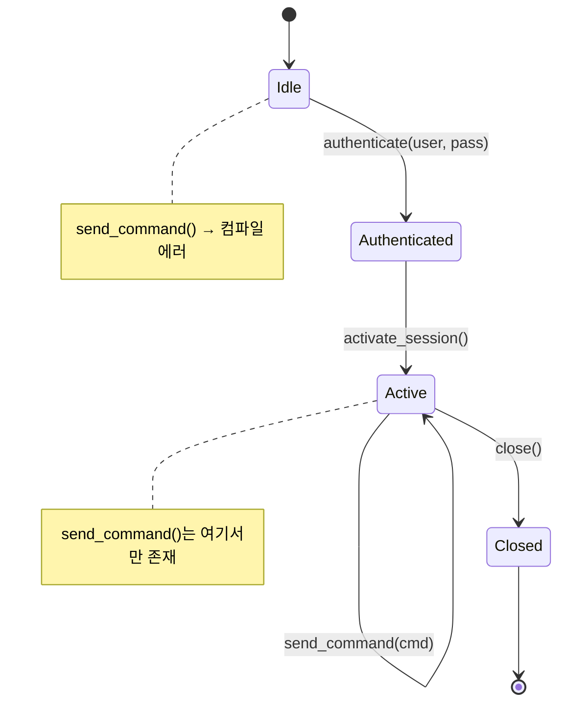
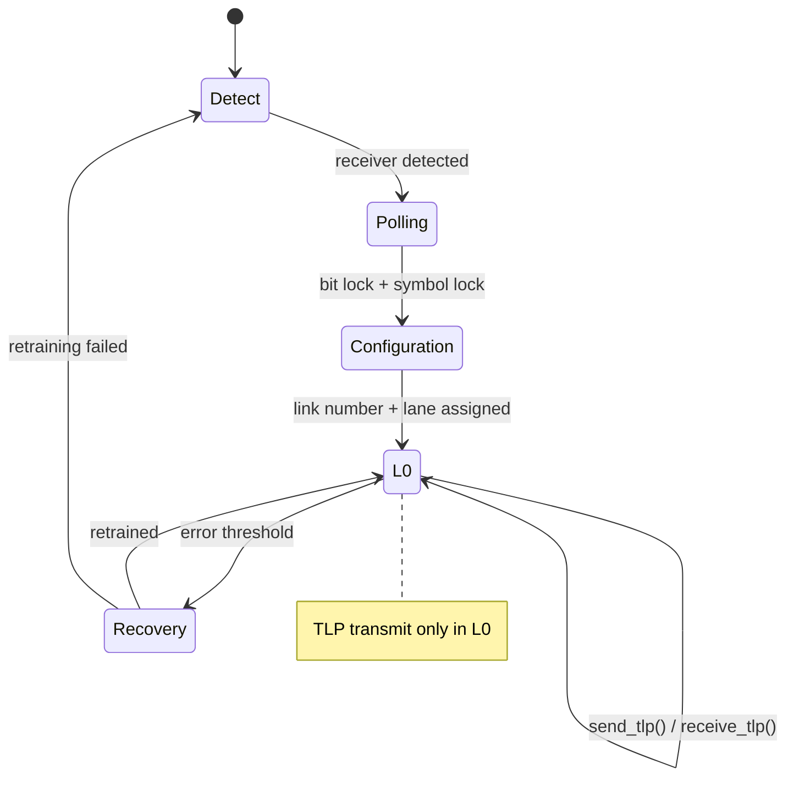
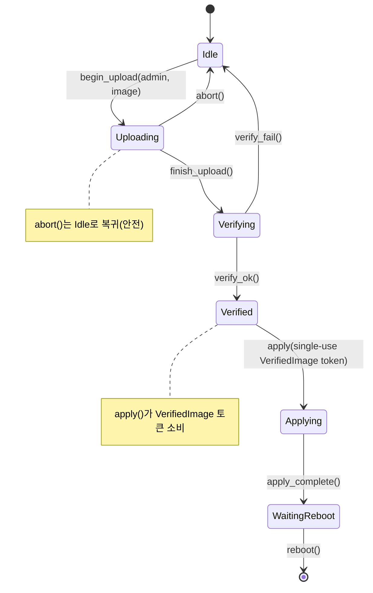

# 프로토콜 상태 머신 — 실제 하드웨어를 위한 타입 상태 🔴

> **이 장에서 배울 내용:** 타입 상태 인코딩이 프로토콜 위반(잘못된 순서의 명령, close 이후 사용)을 컴파일 에러로 만드는 방법, IPMI 세션 수명과 PCIe 링크 학습에 적용합니다.
>
> **교차 참조:** [ch01](ch01-the-philosophy-why-types-beat-tests.md)(수준 2 — 상태 정확성), [ch04](ch04-capability-tokens-zero-cost-proof-of-aut.md)(토큰), [ch09](ch09-phantom-types-for-resource-tracking.md)(팬텀 타입), [ch11](ch11-fourteen-tricks-from-the-trenches.md)(요령 4 — 타입 상태 빌더, 요령 8 — async 타입 상태)

<a id="the-problem-protocol-violations"></a>
## 문제: 프로토콜 위반

하드웨어 프로토콜에는 **엄격한 상태 머신**이 있습니다. IPMI 세션은
미인증 → 인증됨 → 활성 → 닫힘 상태를 가집니다. PCIe 링크 학습은
Detect → Polling → Configuration → L0를 거칩니다. 잘못된 상태에서 명령을 보내면
세션이 깨지거나 버스가 멈출 수 있습니다.

**IPMI 세션 상태 머신:**



**PCIe 링크 학습 상태 머신(LTSSM):**



C/C++에서는 상태를 enum과 런타임 검사로 추적합니다.

```c
typedef enum { IDLE, AUTHENTICATED, ACTIVE, CLOSED } session_state_t;

typedef struct {
    session_state_t state;
    uint32_t session_id;
    // ...
} ipmi_session_t;

int ipmi_send_command(ipmi_session_t *s, uint8_t cmd, uint8_t *data, int len) {
    if (s->state != ACTIVE) {        // 런타임 검사 — 빠뜨리기 쉬움
        return -EINVAL;
    }
    // ... send command ...
    return 0;
}
```

<a id="type-state-pattern"></a>
## 타입 상태 패턴

타입 상태에서는 각 프로토콜 상태가 **별도의 타입**입니다. 전이는 한 상태를 소비하고
다른 상태를 반환하는 메서드입니다. **그 타입에는 해당 메서드가 없기 때문에**
잘못된 상태에서 메서드를 호출할 수 없습니다.

<a id="case-study-ipmi-session-lifecycle"></a>
## 사례 연구: IPMI 세션 수명 주기

```rust,ignore
use std::marker::PhantomData;

// States — zero-sized marker types
pub struct Idle;
pub struct Authenticated;
pub struct Active;
pub struct Closed;

/// 현재 상태로 매개변수화된 IPMI 세션.
/// 상태는 타입 시스템에만 존재(PhantomData는 제로 크기).
pub struct IpmiSession<State> {
    transport: String,     // e.g., "192.168.1.100"
    session_id: Option<u32>,
    _state: PhantomData<State>,
}

// Transition: Idle → Authenticated
impl IpmiSession<Idle> {
    pub fn new(host: &str) -> Self {
        IpmiSession {
            transport: host.to_string(),
            session_id: None,
            _state: PhantomData,
        }
    }

    pub fn authenticate(
        self,              // ← Idle 세션 소비
        user: &str,
        pass: &str,
    ) -> Result<IpmiSession<Authenticated>, String> {
        println!("Authenticating {user} on {}", self.transport);
        Ok(IpmiSession {
            transport: self.transport,
            session_id: Some(42),
            _state: PhantomData,
        })
    }
}

// Transition: Authenticated → Active
impl IpmiSession<Authenticated> {
    pub fn activate(self) -> Result<IpmiSession<Active>, String> {
        println!("Activating session {}", self.session_id.unwrap());
        Ok(IpmiSession {
            transport: self.transport,
            session_id: self.session_id,
            _state: PhantomData,
        })
    }
}

// Operations available ONLY in Active state
impl IpmiSession<Active> {
    pub fn send_command(&mut self, netfn: u8, cmd: u8, data: &[u8]) -> Vec<u8> {
        println!("Sending cmd 0x{cmd:02X} on session {}", self.session_id.unwrap());
        vec![0x00] // stub: completion code OK
    }

    pub fn close(self) -> IpmiSession<Closed> {
        println!("Closing session {}", self.session_id.unwrap());
        IpmiSession {
            transport: self.transport,
            session_id: None,
            _state: PhantomData,
        }
    }
}

fn ipmi_workflow() -> Result<(), String> {
    let session = IpmiSession::new("192.168.1.100");

    // session.send_command(0x04, 0x2D, &[]);
    //  ^^^^^^ ERROR: no method `send_command` on IpmiSession<Idle> ❌

    let session = session.authenticate("admin", "password")?;

    // session.send_command(0x04, 0x2D, &[]);
    //  ^^^^^^ ERROR: no method `send_command` on IpmiSession<Authenticated> ❌

    let mut session = session.activate()?;

    // ✅ 이제 send_command 존재:
    let response = session.send_command(0x04, 0x2D, &[1]);

    let _closed = session.close();

    // _closed.send_command(0x04, 0x2D, &[]);
    //  ^^^^^^ ERROR: no method `send_command` on IpmiSession<Closed> ❌

    Ok(())
}
```

**런타임 상태 검사는 어디에도 없습니다.** 컴파일러가 다음을 강제합니다.
- 활성화 전 인증
- 명령 전송 전 활성화
- 닫은 뒤 명령 없음

<a id="pcie-link-training-state-machine"></a>
## PCIe 링크 학습 상태 머신

PCIe 링크 학습은 PCIe 규격에 정의된 다단계 프로토콜입니다.
타입 상태는 링크가 준비되기 전에 데이터를 보내는 일을 막습니다.

```rust,ignore
use std::marker::PhantomData;

// PCIe LTSSM states (simplified)
pub struct Detect;
pub struct Polling;
pub struct Configuration;
pub struct L0;         // fully operational
pub struct Recovery;

pub struct PcieLink<State> {
    slot: u32,
    width: u8,          // negotiated width (x1, x4, x8, x16)
    speed: u8,          // Gen1=1, Gen2=2, Gen3=3, Gen4=4, Gen5=5
    _state: PhantomData<State>,
}

impl PcieLink<Detect> {
    pub fn new(slot: u32) -> Self {
        PcieLink {
            slot, width: 0, speed: 0,
            _state: PhantomData,
        }
    }

    pub fn detect_receiver(self) -> Result<PcieLink<Polling>, String> {
        println!("Slot {}: receiver detected", self.slot);
        Ok(PcieLink {
            slot: self.slot, width: 0, speed: 0,
            _state: PhantomData,
        })
    }
}

impl PcieLink<Polling> {
    pub fn poll_compliance(self) -> Result<PcieLink<Configuration>, String> {
        println!("Slot {}: polling complete, entering configuration", self.slot);
        Ok(PcieLink {
            slot: self.slot, width: 0, speed: 0,
            _state: PhantomData,
        })
    }
}

impl PcieLink<Configuration> {
    pub fn negotiate(self, width: u8, speed: u8) -> Result<PcieLink<L0>, String> {
        println!("Slot {}: negotiated x{width} Gen{speed}", self.slot);
        Ok(PcieLink {
            slot: self.slot, width, speed,
            _state: PhantomData,
        })
    }
}

impl PcieLink<L0> {
    /// TLP 전송 — 링크가 완전히 학습된(L0) 경우에만 가능.
    pub fn send_tlp(&mut self, tlp: &[u8]) -> Vec<u8> {
        println!("Slot {}: sending {} byte TLP", self.slot, tlp.len());
        vec![0x00] // stub
    }

    /// Recovery 진입 — Recovery 상태로 돌아감.
    pub fn enter_recovery(self) -> PcieLink<Recovery> {
        PcieLink {
            slot: self.slot, width: self.width, speed: self.speed,
            _state: PhantomData,
        }
    }

    pub fn link_info(&self) -> String {
        format!("x{} Gen{}", self.width, self.speed)
    }
}

impl PcieLink<Recovery> {
    pub fn retrain(self, speed: u8) -> Result<PcieLink<L0>, String> {
        println!("Slot {}: retrained at Gen{speed}", self.slot);
        Ok(PcieLink {
            slot: self.slot, width: self.width, speed,
            _state: PhantomData,
        })
    }
}

fn pcie_workflow() -> Result<(), String> {
    let link = PcieLink::new(0);

    // link.send_tlp(&[0x01]);  // ❌ no method `send_tlp` on PcieLink<Detect>

    let link = link.detect_receiver()?;
    let link = link.poll_compliance()?;
    let mut link = link.negotiate(16, 5)?; // x16 Gen5

    // ✅ 이제 TLP 전송 가능:
    let _resp = link.send_tlp(&[0x00, 0x01, 0x02]);
    println!("Link: {}", link.link_info());

    // Recovery 및 재학습:
    let recovery = link.enter_recovery();
    let mut link = recovery.retrain(4)?;  // Gen4로 다운그레이드
    let _resp = link.send_tlp(&[0x03]);

    Ok(())
}
```

<a id="combining-type-state-with-capability-tokens"></a>
## 타입 상태와 capability token 결합

타입 상태와 capability token은 자연스럽게 조합됩니다. 활성 IPMI 세션과
관리자 권한이 모두 필요한 진단 예:

```rust,ignore
# use std::marker::PhantomData;
# pub struct Active;
# pub struct AdminToken { _p: () }
# pub struct IpmiSession<S> { _s: PhantomData<S> }
# impl IpmiSession<Active> {
#     pub fn send_command(&mut self, _nf: u8, _cmd: u8, _d: &[u8]) -> Vec<u8> { vec![] }
# }

/// 펌웨어 업데이트 실행 — 필요한 것:
/// 1. 활성 IPMI 세션(타입 상태)
/// 2. 관리자 권한(capability token)
pub fn firmware_update(
    session: &mut IpmiSession<Active>,   // 세션이 활성임을 증명
    _admin: &AdminToken,                 // 호출자가 관리자임을 증명
    image: &[u8],
) -> Result<(), String> {
    // 런타임 검사 불필요 — 시그니처 자체가 검사
    session.send_command(0x2C, 0x01, image);
    Ok(())
}
```

호출자는 다음을 해야 합니다.
1. 세션 생성(`Idle`)
2. 인증(`Authenticated`)
3. 활성화(`Active`)
4. `AdminToken` 획득
5. 그때만 `firmware_update()` 호출

모두 컴파일 타임에, 런타임 비용 없이 강제됩니다.

<a id="beat-3-firmware-update-multi-phase-fsm-with-composition"></a>
## 비트 3: 펌웨어 업데이트 — 합성이 있는 다단계 FSM

펌웨어 업데이트 수명은 세션보다 상태가 많고, capability token과
단일 사용 타입(ch03)까지 합성합니다. 이 책에서 가장 복잡한 타입 상태 예입니다 —
여기까지 이해하면 패턴을 마스터한 것입니다.



```rust,ignore
use std::marker::PhantomData;

// ── States ──
pub struct Idle;
pub struct Uploading;
pub struct Verifying;
pub struct Verified;
pub struct Applying;
pub struct WaitingReboot;

// ── Single-use proof that image passed verification (ch03) ──
pub struct VerifiedImage {
    _private: (),
    pub digest: [u8; 32],
}

// ── Capability token: only admins can initiate (ch04) ──
pub struct FirmwareAdminToken { _private: () }

pub struct FwUpdate<S> {
    version: String,
    _state: PhantomData<S>,
}

impl FwUpdate<Idle> {
    pub fn new() -> Self {
        FwUpdate { version: String::new(), _state: PhantomData }
    }

    /// 업로드 시작 — 관리자 권한 필요.
    pub fn begin_upload(
        self,
        _admin: &FirmwareAdminToken,
        version: &str,
    ) -> FwUpdate<Uploading> {
        println!("Uploading firmware v{version}...");
        FwUpdate { version: version.to_string(), _state: PhantomData }
    }
}

impl FwUpdate<Uploading> {
    pub fn finish_upload(self) -> FwUpdate<Verifying> {
        println!("Upload complete, verifying v{}...", self.version);
        FwUpdate { version: self.version, _state: PhantomData }
    }

    /// 업로드 중 언제든 중단 — Idle로 안전하게 복귀.
    pub fn abort(self) -> FwUpdate<Idle> {
        println!("Upload aborted.");
        FwUpdate { version: String::new(), _state: PhantomData }
    }
}

impl FwUpdate<Verifying> {
    /// 성공 시 단일 사용 VerifiedImage 토큰 생성.
    pub fn verify_ok(self, digest: [u8; 32]) -> (FwUpdate<Verified>, VerifiedImage) {
        println!("Verification passed for v{}", self.version);
        (
            FwUpdate { version: self.version, _state: PhantomData },
            VerifiedImage { _private: (), digest },
        )
    }

    pub fn verify_fail(self) -> FwUpdate<Idle> {
        println!("Verification failed — returning to idle.");
        FwUpdate { version: String::new(), _state: PhantomData }
    }
}

impl FwUpdate<Verified> {
    /// apply는 VerifiedImage 토큰을 소비 — 두 번 적용 불가.
    pub fn apply(self, proof: VerifiedImage) -> FwUpdate<Applying> {
        println!("Applying v{} (digest: {:02x?})", self.version, &proof.digest[..4]);
        // proof는 이동 — 재사용 불가
        FwUpdate { version: self.version, _state: PhantomData }
    }
}

impl FwUpdate<Applying> {
    pub fn apply_complete(self) -> FwUpdate<WaitingReboot> {
        println!("Apply complete — waiting for reboot.");
        FwUpdate { version: self.version, _state: PhantomData }
    }
}

impl FwUpdate<WaitingReboot> {
    pub fn reboot(self) {
        println!("Rebooting into v{}...", self.version);
    }
}

// ── Usage ──

fn firmware_workflow() {
    let fw = FwUpdate::new();

    // fw.finish_upload();  // ❌ no method `finish_upload` on FwUpdate<Idle>

    let admin = FirmwareAdminToken { _private: () }; // from auth system
    let fw = fw.begin_upload(&admin, "2.10.1");
    let fw = fw.finish_upload();

    let digest = [0xAB; 32]; // computed during verification
    let (fw, token) = fw.verify_ok(digest);

    let fw = fw.apply(token);
    // fw.apply(token);  // ❌ use of moved value: `token`

    let fw = fw.apply_complete();
    fw.reboot();
}
```

**세 비트가 함께 보여 주는 것:**

| 비트 | 프로토콜 | 상태 | 합성 |
|:----:|----------|:------:|-------------|
| 1 | IPMI 세션 | 4 | 순수 타입 상태 |
| 2 | PCIe LTSSM | 5 | 타입 상태 + recovery 분기 |
| 3 | 펌웨어 업데이트 | 6 | 타입 상태 + capability token(ch04) + 단일 사용 증명(ch03) |

비트마다 복잡도가 한 겹씌워집니다. 비트 3까지 오면 컴파일러가 상태 순서,
관리자 권한, **일회 적용**까지 한 FSM에서 세 가지 버그 클래스를 제거합니다.

<a id="when-to-use-type-state"></a>
### 타입 상태를 쓸 때

| 프로토콜 | 타입 상태 가치 있음? |
|----------|:------:|
| IPMI 세션 수명 | ✅ 예 — 인증 → 활성 → 명령 → 닫기 |
| PCIe 링크 학습 | ✅ 예 — detect → poll → configure → L0 |
| TLS 핸드셰이크 | ✅ 예 — ClientHello → ServerHello → Finished |
| USB 열거 | ✅ 예 — Attached → Powered → Default → Addressed → Configured |
| 단순 요청/응답 | ⚠️ 아마 아님 — 상태가 2개뿐 |
| 발사 후 잊기 메시지 | ❌ 아니오 — 추적할 상태 없음 |

<a id="exercise-usb-device-enumeration-type-state"></a>
## 연습문제: USB 장치 열거 타입 상태

`Attached` → `Powered` → `Default` → `Addressed` → `Configured`를 거쳐야 하는 USB 장치를 모델링하세요. 각 전이는 이전 상태를 소비하고 다음을 생산해야 합니다. `send_data()`는 `Configured`에서만 사용 가능해야 합니다.

<details>
<summary>해답</summary>

```rust,ignore
use std::marker::PhantomData;

pub struct Attached;
pub struct Powered;
pub struct Default;
pub struct Addressed;
pub struct Configured;

pub struct UsbDevice<State> {
    address: u8,
    _state: PhantomData<State>,
}

impl UsbDevice<Attached> {
    pub fn new() -> Self {
        UsbDevice { address: 0, _state: PhantomData }
    }
    pub fn power_on(self) -> UsbDevice<Powered> {
        UsbDevice { address: self.address, _state: PhantomData }
    }
}

impl UsbDevice<Powered> {
    pub fn reset(self) -> UsbDevice<Default> {
        UsbDevice { address: self.address, _state: PhantomData }
    }
}

impl UsbDevice<Default> {
    pub fn set_address(self, addr: u8) -> UsbDevice<Addressed> {
        UsbDevice { address: addr, _state: PhantomData }
    }
}

impl UsbDevice<Addressed> {
    pub fn configure(self) -> UsbDevice<Configured> {
        UsbDevice { address: self.address, _state: PhantomData }
    }
}

impl UsbDevice<Configured> {
    pub fn send_data(&self, _data: &[u8]) {
        // Only available in Configured state
    }
}
```

</details>

<a id="key-takeaways"></a>
## 핵심 정리

1. **타입 상태가 잘못된 순서 호출을 불가능하게** — 메서드는 유효한 상태에만 존재합니다.
2. **각 전이가 `self`를 소비** — 전이한 뒤 옛 상태를 붙잡고 있을 수 없습니다.
3. **capability token과 결합** — `firmware_update()`는 `Session<Active>`와 `AdminToken` **둘 다** 필요.
4. **세 비트, 증가하는 복잡도** — IPMI(순수 FSM), PCIe LTSSM(recovery 분기), 펌웨어 업데이트(FSM + 토큰 + 단일 사용 증명)가 단순에서 풍부한 합성까지 패턴이 확장됨을 보여 줍니다.
5. **과용하지 말 것** — 두 상태의 요청/응답 프로토콜은 타입 상태 없이도 더 단순합니다.
6. **패턴은 전체 Redfish 워크플로로 확장** — ch17은 Redfish 세션 수명에 타입 상태를, ch18은 응답 생성에 빌더 타입 상태를 씁니다.

---

