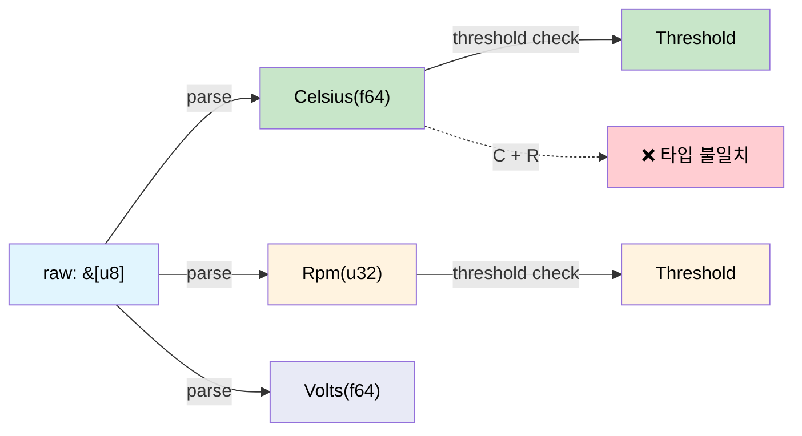

# 차원 분석 — 컴파일러가 단위를 검사하게 만들기 🟢

> **이 장에서 배울 내용:** 뉴타입 래퍼와 `uom` 크레이트로 컴파일러를 단위 검사 엔진으로 바꾸어, 3억 2천만 달러 우주선을 잃게 만든 버그 클래스를 막는 방법입니다.
>
> **교차 참조:** [ch02](ch02-typed-command-interfaces-request-determi.md)(타입이 있는 명령이 이 타입들을 사용), [ch07](ch07-validated-boundaries-parse-dont-validate.md)(검증된 경계), [ch10](ch10-putting-it-all-together-a-complete-diagn.md)(통합)

<a id="the-mars-climate-orbiter"></a>
## Mars Climate Orbiter 사고

1999년 NASA의 Mars Climate Orbiter는 한 팀이 추력 데이터를 **파운드-초**로 보냈고
항법 팀은 **뉴턴-초**를 기대했기 때문에 잃어버렸습니다. 우주선은 226km 대신
57km 고도로 대기에 들어가 파괴되었습니다. 비용: 3억 2천 760만 달러.

근본 원인: **둘 다 `double`이었습니다.** 컴파일러가 구분할 수 없었습니다.

이와 같은 버그 클래스는 물리량을 다루는 모든 하드웨어 진단에 도사리고 있습니다.

```c
// C — 모두 double, 단위 검사 없음
double read_temperature(int sensor_id);   // Celsius? Fahrenheit? Kelvin?
double read_voltage(int channel);          // Volts? Millivolts?
double read_fan_speed(int fan_id);         // RPM? Radians per second?

// 버그: Celsius와 Fahrenheit 비교
if (read_temperature(0) > read_temperature(1)) { ... }  // units might differ!
```

<a id="newtypes-for-physical-quantities"></a>
## 물리량을 위한 뉴타입

가장 단순한 correct-by-construction 접근: **단위마다 자체 타입으로 감싼다.**

```rust,ignore
use std::fmt;

/// 섭씨 온도.
#[derive(Debug, Clone, Copy, PartialEq, PartialOrd)]
pub struct Celsius(pub f64);

/// 화씨 온도.
#[derive(Debug, Clone, Copy, PartialEq, PartialOrd)]
pub struct Fahrenheit(pub f64);

/// 볼트 전압.
#[derive(Debug, Clone, Copy, PartialEq, PartialOrd)]
pub struct Volts(pub f64);

/// 밀리볼트 전압.
#[derive(Debug, Clone, Copy, PartialEq, PartialOrd)]
pub struct Millivolts(pub f64);

/// RPM 팬 속도.
#[derive(Debug, Clone, Copy, PartialEq, PartialOrd)]
pub struct Rpm(pub f64);

// 변환은 명시적:
impl From<Celsius> for Fahrenheit {
    fn from(c: Celsius) -> Self {
        Fahrenheit(c.0 * 9.0 / 5.0 + 32.0)
    }
}

impl From<Fahrenheit> for Celsius {
    fn from(f: Fahrenheit) -> Self {
        Celsius((f.0 - 32.0) * 5.0 / 9.0)
    }
}

impl From<Volts> for Millivolts {
    fn from(v: Volts) -> Self {
        Millivolts(v.0 * 1000.0)
    }
}

impl From<Millivolts> for Volts {
    fn from(mv: Millivolts) -> Self {
        Volts(mv.0 / 1000.0)
    }
}

impl fmt::Display for Celsius {
    fn fmt(&self, f: &mut fmt::Formatter<'_>) -> fmt::Result {
        write!(f, "{:.1}°C", self.0)
    }
}

impl fmt::Display for Rpm {
    fn fmt(&self, f: &mut fmt::Formatter<'_>) -> fmt::Result {
        write!(f, "{:.0} RPM", self.0)
    }
}
```

이제 컴파일러가 단위 불일치를 잡습니다.

```rust,ignore
# #[derive(Debug, Clone, Copy, PartialEq, PartialOrd)]
# pub struct Celsius(pub f64);
# #[derive(Debug, Clone, Copy, PartialEq, PartialOrd)]
# pub struct Volts(pub f64);

fn check_thermal_limit(temp: Celsius, limit: Celsius) -> bool {
    temp > limit  // ✅ 같은 단위 — 컴파일됨
}

// fn bad_comparison(temp: Celsius, voltage: Volts) -> bool {
//     temp > voltage  // ❌ ERROR: mismatched types — Celsius vs Volts
// }
```

**런타임 비용 제로** — 뉴타입은 내부적으로 원시 `f64`로 컴파일됩니다. 래퍼는
순전히 타입 수준 개념입니다.

<a id="newtype-macro-for-hardware-quantities"></a>
## 하드웨어 물량용 뉴타입 매크로

손으로 뉴타입을 쓰면 반복됩니다. 매크로가 보일러플레이트를 없앱니다.

```rust,ignore
/// 물리량용 뉴타입 생성.
macro_rules! quantity {
    ($Name:ident, $unit:expr) => {
        #[derive(Debug, Clone, Copy, PartialEq, PartialOrd)]
        pub struct $Name(pub f64);

        impl $Name {
            pub fn new(value: f64) -> Self { $Name(value) }
            pub fn value(self) -> f64 { self.0 }
        }

        impl std::fmt::Display for $Name {
            fn fmt(&self, f: &mut std::fmt::Formatter<'_>) -> std::fmt::Result {
                write!(f, "{:.2} {}", self.0, $unit)
            }
        }

        impl std::ops::Add for $Name {
            type Output = Self;
            fn add(self, rhs: Self) -> Self { $Name(self.0 + rhs.0) }
        }

        impl std::ops::Sub for $Name {
            type Output = Self;
            fn sub(self, rhs: Self) -> Self { $Name(self.0 - rhs.0) }
        }
    };
}

// Usage:
quantity!(Celsius, "°C");
quantity!(Fahrenheit, "°F");
quantity!(Volts, "V");
quantity!(Millivolts, "mV");
quantity!(Rpm, "RPM");
quantity!(Watts, "W");
quantity!(Amperes, "A");
quantity!(Pascals, "Pa");
quantity!(Hertz, "Hz");
quantity!(Bytes, "B");
```

각 줄이 Display, Add, Sub, 비교 연산자를 포함한 완전한 타입을 생성합니다.
**모두 런타임 비용 없이.**

> **물리 주의:** 매크로는 `Celsius`를 포함해 *모든* 물량에 `Add`를 생성합니다.
> 절대 온도끼리 더하기(`25°C + 30°C = 55°C`)는 물리적으로 의미가 없습니다 —
> 차이에는 별도의 `TemperatureDelta` 타입이 필요합니다. `uom` 크레이트(아래)는
> 이를 올바르게 처리합니다. 단순 센서 진단에서 비교·표시만 한다면 온도 타입에서
> `Add`/`Sub`를 빼고, 덧셈이 의미 있는 물량(Watts, Volts, Bytes)에만 둘 수 있습니다.
> 델타 산술이 필요하면 `CelsiusDelta(f64)` 뉴타입과 `impl Add<CelsiusDelta> for Celsius`를 정의하세요.

<a id="applied-example-sensor-pipeline"></a>
## 적용 예: 센서 파이프라인

전형적인 진단은 원시 ADC 값을 읽어 물리 단위로 바꾸고 임계값과 비교합니다.
차원 타입이 있으면 각 단계가 타입 검사됩니다.

```rust,ignore
# macro_rules! quantity {
#     ($Name:ident, $unit:expr) => {
#         #[derive(Debug, Clone, Copy, PartialEq, PartialOrd)]
#         pub struct $Name(pub f64);
#         impl $Name {
#             pub fn new(value: f64) -> Self { $Name(value) }
#             pub fn value(self) -> f64 { self.0 }
#         }
#         impl std::fmt::Display for $Name {
#             fn fmt(&self, f: &mut std::fmt::Formatter<'_>) -> std::fmt::Result {
#                 write!(f, "{:.2} {}", self.0, $unit)
#             }
#         }
#     };
# }
# quantity!(Celsius, "°C");
# quantity!(Volts, "V");
# quantity!(Rpm, "RPM");

/// 원시 ADC 읽기 — 아직 물리량이 아님.
#[derive(Debug, Clone, Copy)]
pub struct AdcReading {
    pub channel: u8,
    pub raw: u16,   // 12-bit ADC value (0–4095)
}

/// ADC → 물리 단위 변환 계수.
pub struct TemperatureCalibration {
    pub offset: f64,
    pub scale: f64,   // °C per ADC count
}

pub struct VoltageCalibration {
    pub reference_mv: f64,
    pub divider_ratio: f64,
}

impl TemperatureCalibration {
    /// 원시 ADC → Celsius. 반환 타입이 출력이 Celsius임을 보장.
    pub fn convert(&self, adc: AdcReading) -> Celsius {
        Celsius::new(adc.raw as f64 * self.scale + self.offset)
    }
}

impl VoltageCalibration {
    /// 원시 ADC → Volts. 반환 타입이 출력이 Volts임을 보장.
    pub fn convert(&self, adc: AdcReading) -> Volts {
        Volts::new(adc.raw as f64 * self.reference_mv / 4096.0 / self.divider_ratio / 1000.0)
    }
}

/// 임계값 검사 — 단위가 맞을 때만 컴파일.
pub struct Threshold<T: PartialOrd> {
    pub warning: T,
    pub critical: T,
}

#[derive(Debug, PartialEq)]
pub enum ThresholdResult {
    Normal,
    Warning,
    Critical,
}

impl<T: PartialOrd> Threshold<T> {
    pub fn check(&self, value: &T) -> ThresholdResult {
        if *value >= self.critical {
            ThresholdResult::Critical
        } else if *value >= self.warning {
            ThresholdResult::Warning
        } else {
            ThresholdResult::Normal
        }
    }
}

fn sensor_pipeline_example() {
    let temp_cal = TemperatureCalibration { offset: -50.0, scale: 0.0625 };
    let temp_threshold = Threshold {
        warning: Celsius::new(85.0),
        critical: Celsius::new(100.0),
    };

    let adc = AdcReading { channel: 0, raw: 2048 };
    let temp: Celsius = temp_cal.convert(adc);

    let result = temp_threshold.check(&temp);
    println!("Temperature: {temp}, Status: {result:?}");

    // 컴파일되지 않음 — Celsius 읽기를 Volts 임계값과 비교할 수 없음:
    // let volt_threshold = Threshold {
    //     warning: Volts::new(11.4),
    //     critical: Volts::new(10.8),
    // };
    // volt_threshold.check(&temp);  // ❌ ERROR: expected &Volts, found &Celsius
}
```

**전체 파이프라인**이 정적으로 타입 검사됩니다.
- ADC 읽기는 카운트(단위 아님)
- 보정이 타입이 있는 물량(Celsius, Volts)을 생산
- 임계값은 물량 타입에 대해 제네릭
- Celsius와 Volts 비교는 **컴파일 에러**

<a id="the-uom-crate"></a>
## uom 크레이트

프로덕션에서는 [`uom`](https://crates.io/crates/uom) 크레이트가 수백 단위,
자동 변환, 런타임 오버헤드 없이 포괄적인 차원 분석을 제공합니다.

```rust,ignore
// Cargo.toml: uom = { version = "0.36", features = ["f64"] }
//
// use uom::si::f64::*;
// use uom::si::thermodynamic_temperature::degree_celsius;
// use uom::si::electric_potential::volt;
// use uom::si::power::watt;
//
// let temp = ThermodynamicTemperature::new::<degree_celsius>(85.0);
// let voltage = ElectricPotential::new::<volt>(12.0);
// let power = Power::new::<watt>(250.0);
//
// // temp + voltage;  // ❌ compile error — can't add temperature to voltage
// // power > temp;    // ❌ compile error — can't compare power to temperature
```

파생 단위 지원이 필요할 때(예: Watts = Volts × Amperes) `uom`을 쓰세요.
단순 물량만 필요하고 파생 산술은 없으면 손으로 만든 뉴타입으로 충분합니다.

<a id="when-to-use-dimensional-types"></a>
### 차원 타입을 쓸 때

| 시나리오 | 권장 |
|----------|---------------|
| 센서 읽기(온도, 전압, 팬) | ✅ 항상 — 단위 혼동 방지 |
| 임계값 비교 | ✅ 항상 — 제네릭 `Threshold<T>` |
| 하위시스템 간 데이터 교환 | ✅ 항상 — API 경계에서 계약 강제 |
| 내부 계산(같은 단위만) | ⚠️ 선택 — 버그 가능성 낮음 |
| 문자열/표시 포맷 | ❌ 물량 타입에 Display impl 사용 |

<a id="sensor-pipeline-type-flow"></a>
## 센서 파이프라인 타입 흐름



<a id="exercise-power-budget-calculator"></a>
## 연습문제: 전력 예산 계산기

`Watts(f64)`와 `Amperes(f64)` 뉴타입을 만드세요. 구현:
- `Watts::from_vi(volts: Volts, amps: Amperes) -> Watts` (P = V × I)
- 설정한 한도를 넘는 덧셈을 거절하는 `PowerBudget`
- `Watts + Celsius`는 컴파일 에러가 나야 함.

<details>
<summary>해답</summary>

```rust,ignore
#[derive(Debug, Clone, Copy, PartialEq, PartialOrd)]
pub struct Watts(pub f64);

#[derive(Debug, Clone, Copy, PartialEq, PartialOrd)]
pub struct Amperes(pub f64);

#[derive(Debug, Clone, Copy, PartialEq, PartialOrd)]
pub struct Volts(pub f64);

#[derive(Debug, Clone, Copy, PartialEq, PartialOrd)]
pub struct Celsius(pub f64);

impl Watts {
    pub fn from_vi(volts: Volts, amps: Amperes) -> Self {
        Watts(volts.0 * amps.0)
    }
}

impl std::ops::Add for Watts {
    type Output = Watts;
    fn add(self, rhs: Watts) -> Watts {
        Watts(self.0 + rhs.0)
    }
}

pub struct PowerBudget {
    total: Watts,
    limit: Watts,
}

impl PowerBudget {
    pub fn new(limit: Watts) -> Self {
        PowerBudget { total: Watts(0.0), limit }
    }
    pub fn add(&mut self, w: Watts) -> Result<(), String> {
        let new_total = Watts(self.total.0 + w.0);
        if new_total > self.limit {
            return Err(format!("budget exceeded: {:?} > {:?}", new_total, self.limit));
        }
        self.total = new_total;
        Ok(())
    }
}

// ❌ Compile error: Watts + Celsius → "mismatched types"
// let bad = Watts(100.0) + Celsius(50.0);
```

</details>

<a id="key-takeaways"></a>
## 핵심 정리

1. **뉴타입이 제로 비용으로 단위 혼동 방지** — `Celsius`와 `Rpm` 내부는 둘 다 `f64`지만 컴파일러는 다른 타입으로 취급합니다.
2. **Mars Climate Orbiter 버그는 불가능** — `Pounds`를 기대하는 곳에 `Newtons`를 넘기면 컴파일 에러입니다.
3. **`quantity!` 매크로가 보일러플레이트 감소** — 단위마다 Display, 산술, 임계값 로직을 찍어냅니다.
4. **`uom` 크레이트가 파생 단위 처리** — `Watts = Volts × Amperes`를 자동으로 필요할 때 쓰세요.
5. **`Threshold`는 물량에 제네릭** — `Threshold<Celsius>`가 실수로 `Threshold<Rpm>`과 비교되는 일을 막습니다.

---

