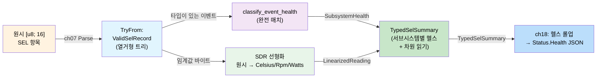
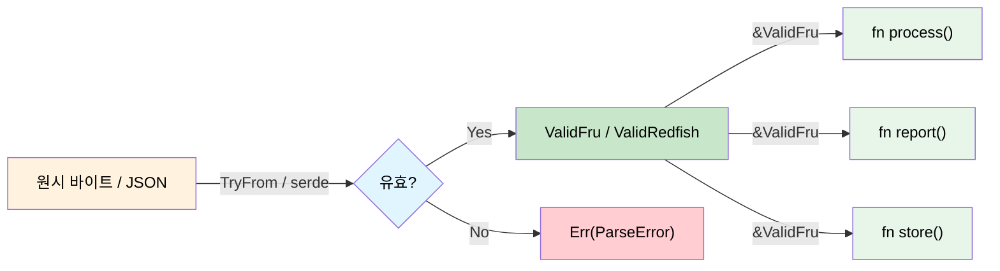

<a id="validated-boundaries-parse-dont-validate"></a>
# 검증된 경계 — Validate하지 말고 Parse하라 🟡

> **이 장에서 배울 내용:** 시스템 경계에서 데이터를 정확히 한 번만 검증하고, 유효성 증명을 전용 타입에 실어 나른 뒤 다시는 검사하지 않는 방법 — 평평한 바이트인 IPMI FRU, 구조화된 문서인 Redfish JSON, 중첩 디스패치가 있는 다형 이진인 IPMI SEL에 적용하고, 끝에서 끝까지 전체 워크스루를 제공합니다.
>
> **상호 참조:** [ch02](ch02-typed-command-interfaces-request-determi.md)(typed commands), [ch06](ch06-dimensional-analysis-making-the-compiler.md)(차원 타입), [ch11](ch11-fourteen-tricks-from-the-trenches.md)(요령 2 sealed trait, 요령 3 `#[non_exhaustive]`, 요령 5 FromStr), [ch14](ch14-testing-type-level-guarantees.md)(proptest)

<a id="the-problem-shotgun-validation"></a>
## 문제: 산탄총 검증

전형적인 코드에서는 검증이 사방에 흩어져 있습니다. 데이터를 받는 함수마다 "혹시 몰라" 다시 검사합니다.

```c
// C — 검증이 코드베이스 전체에 산재
int process_fru_data(uint8_t *data, int len) {
    if (data == NULL) return -1;          // check: non-null
    if (len < 8) return -1;              // check: minimum length
    if (data[0] != 0x01) return -1;      // check: format version
    if (checksum(data, len) != 0) return -1; // check: checksum

    // ... 10 more functions that repeat the same checks ...
}
```

이 패턴("산탄총 검증")에는 두 가지 문제가 있습니다.
1. **중복** — 같은 검사가 수십 곳에 반복됨
2. **불완전** — 함수 하나에서 검사 하나만 빠져도 버그

<a id="parse-dont-validate"></a>
## Parse하지 Validate 말 것

correct-by-construction 접근: **경계에서 한 번만 검증하고, 유효성 증명을 타입에 실어 나른다**.

```rust,ignore
/// 와이어에서 온 원시 바이트 — 아직 검증되지 않음.
#[derive(Debug)]
pub struct RawFruData(Vec<u8>);
```

<a id="case-study-ipmi-fru-data"></a>
### 사례 연구: IPMI FRU 데이터

```rust,ignore
# #[derive(Debug)]
# pub struct RawFruData(Vec<u8>);

/// 검증된 IPMI FRU 데이터. TryFrom으로만 생성 가능하며
/// 모든 불변식을 강제. ValidFru를 얻으면
/// 모든 데이터가 올바름이 보장됨.
#[derive(Debug)]
pub struct ValidFru {
    format_version: u8,
    internal_area_offset: u8,
    chassis_area_offset: u8,
    board_area_offset: u8,
    product_area_offset: u8,
    data: Vec<u8>,
}

#[derive(Debug)]
pub enum FruError {
    TooShort { actual: usize, minimum: usize },
    BadFormatVersion(u8),
    ChecksumMismatch { expected: u8, actual: u8 },
    InvalidAreaOffset { area: &'static str, offset: u8 },
}

impl std::fmt::Display for FruError {
    fn fmt(&self, f: &mut std::fmt::Formatter<'_>) -> std::fmt::Result {
        match self {
            Self::TooShort { actual, minimum } =>
                write!(f, "FRU data too short: {actual} bytes (minimum {minimum})"),
            Self::BadFormatVersion(v) =>
                write!(f, "unsupported FRU format version: {v}"),
            Self::ChecksumMismatch { expected, actual } =>
                write!(f, "checksum mismatch: expected 0x{expected:02X}, got 0x{actual:02X}"),
            Self::InvalidAreaOffset { area, offset } =>
                write!(f, "invalid {area} area offset: {offset}"),
        }
    }
}

impl TryFrom<RawFruData> for ValidFru {
    type Error = FruError;

    fn try_from(raw: RawFruData) -> Result<Self, FruError> {
        let data = raw.0;

        // 1. Length check
        if data.len() < 8 {
            return Err(FruError::TooShort {
                actual: data.len(),
                minimum: 8,
            });
        }

        // 2. Format version
        if data[0] != 0x01 {
            return Err(FruError::BadFormatVersion(data[0]));
        }

        // 3. Checksum (header is first 8 bytes, checksum at byte 7)
        let checksum: u8 = data[..8].iter().fold(0u8, |acc, &b| acc.wrapping_add(b));
        if checksum != 0 {
            return Err(FruError::ChecksumMismatch {
                expected: 0,
                actual: checksum,
            });
        }

        // 4. Area offsets must be within bounds
        for (name, idx) in [
            ("internal", 1), ("chassis", 2),
            ("board", 3), ("product", 4),
        ] {
            let offset = data[idx];
            if offset != 0 && (offset as usize * 8) >= data.len() {
                return Err(FruError::InvalidAreaOffset {
                    area: name,
                    offset,
                });
            }
        }

        // 모든 검사 통과 — 검증된 타입 구성
        Ok(ValidFru {
            format_version: data[0],
            internal_area_offset: data[1],
            chassis_area_offset: data[2],
            board_area_offset: data[3],
            product_area_offset: data[4],
            data,
        })
    }
}

impl ValidFru {
    /// 재검증 불필요 — 타입이 정확성을 보장.
    pub fn board_area(&self) -> Option<&[u8]> {
        if self.board_area_offset == 0 {
            return None;
        }
        let start = self.board_area_offset as usize * 8;
        Some(&self.data[start..])  // 안전 — 파싱 시 범위 검사됨
    }

    pub fn product_area(&self) -> Option<&[u8]> {
        if self.product_area_offset == 0 {
            return None;
        }
        let start = self.product_area_offset as usize * 8;
        Some(&self.data[start..])
    }

    pub fn format_version(&self) -> u8 {
        self.format_version
    }
}
```

`&ValidFru`를 받는 함수는 데이터가 잘 형성되었음을 **압니다**. 재검사 불필요:

```rust,ignore
# pub struct ValidFru { board_area_offset: u8, data: Vec<u8> }
# impl ValidFru {
#     pub fn board_area(&self) -> Option<&[u8]> { None }
# }

/// FRU 데이터를 다시 검증할 필요 없음.
/// 타입 시그니처가 이미 유효함을 보장.
fn extract_board_serial(fru: &ValidFru) -> Option<String> {
    let board = fru.board_area()?;
    // ... 보드 영역에서 시리얼 파싱 ...
    // 범위 검사 불필요 — ValidFru가 오프셋 범위를 보장
    Some("ABC123".to_string()) // stub
}

fn extract_board_manufacturer(fru: &ValidFru) -> Option<String> {
    let board = fru.board_area()?;
    // 여전히 검증 불필요 — 동일 보장
    Some("Acme Corp".to_string()) // stub
}
```

<a id="validated-redfish-json"></a>
## 검증된 Redfish JSON

같은 패턴이 Redfish API 응답에 적용됩니다. 한 번 파싱하고, 유효성을 타입에 담습니다.

```rust,ignore
use std::collections::HashMap;

/// Redfish 엔드포인트에서 온 원시 JSON 문자열.
pub struct RawRedfishResponse(pub String);

/// 검증된 Redfish Thermal 응답.
/// 필수 필드가 모두 있고 범위 내임이 보장됨.
#[derive(Debug)]
pub struct ValidThermalResponse {
    pub temperatures: Vec<ValidTemperatureReading>,
    pub fans: Vec<ValidFanReading>,
}

#[derive(Debug)]
pub struct ValidTemperatureReading {
    pub name: String,
    pub reading_celsius: f64,     // NaN 아님, 센서 범위 내 보장
    pub upper_critical: f64,
    pub status: HealthStatus,
}

#[derive(Debug)]
pub struct ValidFanReading {
    pub name: String,
    pub reading_rpm: u32,        // 장착 팬이면 > 0 보장
    pub status: HealthStatus,
}

#[derive(Debug, Clone, Copy, PartialEq)]
pub enum HealthStatus {
    Ok,
    Warning,
    Critical,
}

#[derive(Debug)]
pub enum RedfishValidationError {
    MissingField(&'static str),
    OutOfRange { field: &'static str, value: f64 },
    InvalidStatus(String),
}

impl std::fmt::Display for RedfishValidationError {
    fn fmt(&self, f: &mut std::fmt::Formatter<'_>) -> std::fmt::Result {
        match self {
            Self::MissingField(name) => write!(f, "missing required field: {name}"),
            Self::OutOfRange { field, value } =>
                write!(f, "field {field} out of range: {value}"),
            Self::InvalidStatus(s) => write!(f, "invalid health status: {s}"),
        }
    }
}

// 검증 후 하류 코드는 다시 검사하지 않음:
fn check_thermal_health(thermal: &ValidThermalResponse) -> bool {
    // 누락 필드나 NaN 검사 불필요.
    // ValidThermalResponse가 모든 읽기값이 타당함을 보장.
    thermal.temperatures.iter().all(|t| {
        t.reading_celsius < t.upper_critical && t.status != HealthStatus::Critical
    }) && thermal.fans.iter().all(|f| {
        f.reading_rpm > 0 && f.status != HealthStatus::Critical
    })
}
```

<a id="polymorphic-validation-ipmi-sel-records"></a>
## 다형 검증: IPMI SEL 레코드

앞의 두 사례는 **평평한** 구조를 검증했습니다 — 고정 바이트 레이아웃(FRU)과 알려진 JSON 스키마(Redfish). 실제 데이터는 종종 **다형적**입니다: 뒤쪽 바이트의 해석이 앞쪽 바이트에 달립니다. IPMI System Event Log(SEL) 레코드가 전형적인 예입니다.

<a id="the-shape-of-the-problem"></a>
### 문제의 형태

SEL 레코드는 정확히 16바이트입니다. 하지만 그 바이트가 *의미하는 것*은 디스패치 체인에 달립니다.

```
Byte 2: Record Type
  ├─ 0x02 → System Event
  │    Byte 10[6:4]: Event Type
  │      ├─ 0x01       → Threshold event (reading + threshold in data bytes 2-3)
  │      ├─ 0x02-0x0C  → Discrete event (bit in offset field)
  │      └─ 0x6F       → Sensor-specific (meaning depends on Sensor Type in byte 7)
  │           Byte 7: Sensor Type
  │             ├─ 0x01 → Temperature events
  │             ├─ 0x02 → Voltage events
  │             ├─ 0x04 → Fan events
  │             ├─ 0x07 → Processor events
  │             ├─ 0x0C → Memory events
  │             ├─ 0x08 → Power Supply events
  │             └─ ...  → (42 sensor types in IPMI 2.0 Table 42-3)
  ├─ 0xC0-0xDF → OEM Timestamped
  └─ 0xE0-0xFF → OEM Non-Timestamped
```

C에서는 `switch` 안의 `switch` 안의 `switch`이고, 각 단계가 같은 `uint8_t *data` 포인터를 공유합니다. 단계 하나를 잊거나 스펙 표를 잘못 읽거나 잘못된 바이트를 인덱스하면 — 버그는 조용합니다.

```c
// C — 다형 파싱 문제
void process_sel_entry(uint8_t *data, int len) {
    if (data[2] == 0x02) {  // system event
        uint8_t event_type = (data[10] >> 4) & 0x07;
        if (event_type == 0x01) {  // threshold
            uint8_t reading = data[11];   // 🐛 or is it data[13]?
            uint8_t threshold = data[12]; // 🐛 spec says byte 12 is trigger, not threshold
            printf("Temp: %d crossed %d\n", reading, threshold);
        } else if (event_type == 0x6F) {  // sensor-specific
            uint8_t sensor_type = data[7];
            if (sensor_type == 0x0C) {  // memory
                // 🐛 forgot to check event data 1 offset bits
                printf("Memory ECC error\n");
            }
            // 🐛 no else — silently drops 30+ other sensor types
        }
    }
    // 🐛 OEM record types silently ignored
}
```

<a id="step-1-parse-the-outer-frame"></a>
### 1단계 — 바깥 프레임 파싱

첫 `TryFrom`이 레코드 타입으로 디스패치합니다 — 유니온의 가장 바깥 층입니다.

```rust,ignore
/// `Get SEL Entry`(IPMI cmd 0x43)에서 온 그대로의 16바이트 SEL 레코드.
pub struct RawSelRecord(pub [u8; 16]);

/// 검증된 SEL 레코드 — 레코드 타입 디스패치됨, 필드 검사됨.
pub enum ValidSelRecord {
    SystemEvent(SystemEventRecord),
    OemTimestamped(OemTimestampedRecord),
    OemNonTimestamped(OemNonTimestampedRecord),
}

#[derive(Debug)]
pub struct OemTimestampedRecord {
    pub record_id: u16,
    pub timestamp: u32,
    pub manufacturer_id: [u8; 3],
    pub oem_data: [u8; 6],
}

#[derive(Debug)]
pub struct OemNonTimestampedRecord {
    pub record_id: u16,
    pub oem_data: [u8; 13],
}

#[derive(Debug)]
pub enum SelParseError {
    UnknownRecordType(u8),
    UnknownSensorType(u8),
    UnknownEventType(u8),
    InvalidEventData { reason: &'static str },
}

impl std::fmt::Display for SelParseError {
    fn fmt(&self, f: &mut std::fmt::Formatter<'_>) -> std::fmt::Result {
        match self {
            Self::UnknownRecordType(t) => write!(f, "unknown record type: 0x{t:02X}"),
            Self::UnknownSensorType(t) => write!(f, "unknown sensor type: 0x{t:02X}"),
            Self::UnknownEventType(t) => write!(f, "unknown event type: 0x{t:02X}"),
            Self::InvalidEventData { reason } => write!(f, "invalid event data: {reason}"),
        }
    }
}

impl TryFrom<RawSelRecord> for ValidSelRecord {
    type Error = SelParseError;

    fn try_from(raw: RawSelRecord) -> Result<Self, SelParseError> {
        let d = &raw.0;
        let record_id = u16::from_le_bytes([d[0], d[1]]);

        match d[2] {
            0x02 => {
                let system = parse_system_event(record_id, d)?;
                Ok(ValidSelRecord::SystemEvent(system))
            }
            0xC0..=0xDF => {
                Ok(ValidSelRecord::OemTimestamped(OemTimestampedRecord {
                    record_id,
                    timestamp: u32::from_le_bytes([d[3], d[4], d[5], d[6]]),
                    manufacturer_id: [d[7], d[8], d[9]],
                    oem_data: [d[10], d[11], d[12], d[13], d[14], d[15]],
                }))
            }
            0xE0..=0xFF => {
                Ok(ValidSelRecord::OemNonTimestamped(OemNonTimestampedRecord {
                    record_id,
                    oem_data: [d[3], d[4], d[5], d[6], d[7], d[8], d[9],
                               d[10], d[11], d[12], d[13], d[14], d[15]],
                }))
            }
            other => Err(SelParseError::UnknownRecordType(other)),
        }
    }
}
```

이 경계 이후 모든 소비자는 열거형에 매칭합니다. 컴파일러가 세 레코드 타입을 모두 처리하도록 강제합니다 — OEM 레코드를 "잊을" 수 없습니다.

<a id="step-2-parse-the-system-event-sensor-type--typed-event"></a>
### 2단계 — 시스템 이벤트 파싱: 센서 타입 → 타입이 있는 이벤트

내부 디스패치가 이벤트 데이터 바이트를 센서 타입으로 인덱싱된 합 타입으로 바꿉니다. C의 `switch` 안의 `switch`가 중첩 열거형이 되는 지점입니다.

```rust,ignore
#[derive(Debug)]
pub struct SystemEventRecord {
    pub record_id: u16,
    pub timestamp: u32,
    pub generator: GeneratorId,
    pub sensor_type: SensorType,
    pub sensor_number: u8,
    pub event_direction: EventDirection,
    pub event: TypedEvent,      // ← the key: event data is TYPED
}

#[derive(Debug)]
pub enum GeneratorId {
    Software(u8),
    Ipmb { slave_addr: u8, channel: u8, lun: u8 },
}

#[derive(Debug, Clone, Copy, PartialEq)]
pub enum EventDirection { Assertion, Deassertion }

// ──── The Sensor/Event Type Hierarchy ────

/// IPMI 표 42-3의 센서 타입. 향후 IPMI 개정과 OEM 범위가
/// 변형을 추가하므로 non_exhaustive(ch11 요령 3).
#[non_exhaustive]
#[derive(Debug, Clone, Copy, PartialEq)]
pub enum SensorType {
    Temperature,    // 0x01
    Voltage,        // 0x02
    Current,        // 0x03
    Fan,            // 0x04
    PhysicalSecurity, // 0x05
    Processor,      // 0x07
    PowerSupply,    // 0x08
    Memory,         // 0x0C
    SystemEvent,    // 0x12
    Watchdog2,      // 0x23
}

/// 다형 페이로드 — 각 변형이 자체 타입 데이터를 실음.
#[derive(Debug)]
pub enum TypedEvent {
    Threshold(ThresholdEvent),
    SensorSpecific(SensorSpecificEvent),
    Discrete { offset: u8, event_data: [u8; 3] },
}

/// 임계값 이벤트는 트리거 읽기와 임계값을 실음.
/// 둘 다 원시 센서 값(선형화 전), u8로 유지.
/// SDR 선형화 후 차원 타입이 됨(ch06).
#[derive(Debug)]
pub struct ThresholdEvent {
    pub crossing: ThresholdCrossing,
    pub trigger_reading: u8,
    pub threshold_value: u8,
}

#[derive(Debug, Clone, Copy, PartialEq)]
pub enum ThresholdCrossing {
    LowerNonCriticalLow,
    LowerNonCriticalHigh,
    LowerCriticalLow,
    LowerCriticalHigh,
    LowerNonRecoverableLow,
    LowerNonRecoverableHigh,
    UpperNonCriticalLow,
    UpperNonCriticalHigh,
    UpperCriticalLow,
    UpperCriticalHigh,
    UpperNonRecoverableLow,
    UpperNonRecoverableHigh,
}

/// 센서별 이벤트 — 센서 타입마다 변형이 있고
/// 해당 센서에 정의된 이벤트의 완전 열거형을 둠.
#[derive(Debug)]
pub enum SensorSpecificEvent {
    Temperature(TempEvent),
    Voltage(VoltageEvent),
    Fan(FanEvent),
    Processor(ProcessorEvent),
    PowerSupply(PowerSupplyEvent),
    Memory(MemoryEvent),
    PhysicalSecurity(PhysicalSecurityEvent),
    Watchdog(WatchdogEvent),
}

// ──── Per-sensor-type event enums (from IPMI Table 42-3) ────

#[derive(Debug, Clone, Copy, PartialEq)]
pub enum MemoryEvent {
    CorrectableEcc,
    UncorrectableEcc,
    Parity,
    MemoryBoardScrubFailed,
    MemoryDeviceDisabled,
    CorrectableEccLogLimit,
    PresenceDetected,
    ConfigurationError,
    Spare,
    Throttled,
    CriticalOvertemperature,
}

#[derive(Debug, Clone, Copy, PartialEq)]
pub enum PowerSupplyEvent {
    PresenceDetected,
    Failure,
    PredictiveFailure,
    InputLost,
    InputOutOfRange,
    InputLostOrOutOfRange,
    ConfigurationError,
    InactiveStandby,
}

#[derive(Debug, Clone, Copy, PartialEq)]
pub enum TempEvent {
    UpperNonCritical,
    UpperCritical,
    UpperNonRecoverable,
    LowerNonCritical,
    LowerCritical,
    LowerNonRecoverable,
}

#[derive(Debug, Clone, Copy, PartialEq)]
pub enum VoltageEvent {
    UpperNonCritical,
    UpperCritical,
    UpperNonRecoverable,
    LowerNonCritical,
    LowerCritical,
    LowerNonRecoverable,
}

#[derive(Debug, Clone, Copy, PartialEq)]
pub enum FanEvent {
    UpperNonCritical,
    UpperCritical,
    UpperNonRecoverable,
    LowerNonCritical,
    LowerCritical,
    LowerNonRecoverable,
}

#[derive(Debug, Clone, Copy, PartialEq)]
pub enum ProcessorEvent {
    Ierr,
    ThermalTrip,
    Frb1BistFailure,
    Frb2HangInPost,
    Frb3ProcessorStartupFailure,
    ConfigurationError,
    UncorrectableMachineCheck,
    PresenceDetected,
    Disabled,
    TerminatorPresenceDetected,
    Throttled,
}

#[derive(Debug, Clone, Copy, PartialEq)]
pub enum PhysicalSecurityEvent {
    ChassisIntrusion,
    DriveIntrusion,
    IOCardAreaIntrusion,
    ProcessorAreaIntrusion,
    LanLeashedLost,
    UnauthorizedDocking,
    FanAreaIntrusion,
}

#[derive(Debug, Clone, Copy, PartialEq)]
pub enum WatchdogEvent {
    BiosReset,
    OsReset,
    OsShutdown,
    OsPowerDown,
    OsPowerCycle,
    BiosNmi,
    Timer,
}
```

<a id="step-3-the-parser-wiring"></a>
### 3단계 — 파서 배선

```rust,ignore
fn parse_system_event(record_id: u16, d: &[u8]) -> Result<SystemEventRecord, SelParseError> {
    let timestamp = u32::from_le_bytes([d[3], d[4], d[5], d[6]]);

    let generator = if d[7] & 0x01 == 0 {
        GeneratorId::Ipmb {
            slave_addr: d[7] & 0xFE,
            channel: (d[8] >> 4) & 0x0F,
            lun: d[8] & 0x03,
        }
    } else {
        GeneratorId::Software(d[7])
    };

    let sensor_type = parse_sensor_type(d[10])?;
    let sensor_number = d[11];
    let event_direction = if d[12] & 0x80 != 0 {
        EventDirection::Deassertion
    } else {
        EventDirection::Assertion
    };

    let event_type_code = d[12] & 0x7F;
    let event_data = [d[13], d[14], d[15]];

    let event = match event_type_code {
        0x01 => {
            // 임계값 — 이벤트 데이터 바이트 2는 트리거 읽기, 3은 임계값
            let offset = event_data[0] & 0x0F;
            TypedEvent::Threshold(ThresholdEvent {
                crossing: parse_threshold_crossing(offset)?,
                trigger_reading: event_data[1],
                threshold_value: event_data[2],
            })
        }
        0x6F => {
            // 센서별 — 센서 타입으로 디스패치
            let offset = event_data[0] & 0x0F;
            let specific = parse_sensor_specific(&sensor_type, offset)?;
            TypedEvent::SensorSpecific(specific)
        }
        0x02..=0x0C => {
            // 일반 이산
            TypedEvent::Discrete { offset: event_data[0] & 0x0F, event_data }
        }
        other => return Err(SelParseError::UnknownEventType(other)),
    };

    Ok(SystemEventRecord {
        record_id,
        timestamp,
        generator,
        sensor_type,
        sensor_number,
        event_direction,
        event,
    })
}

fn parse_sensor_type(code: u8) -> Result<SensorType, SelParseError> {
    match code {
        0x01 => Ok(SensorType::Temperature),
        0x02 => Ok(SensorType::Voltage),
        0x03 => Ok(SensorType::Current),
        0x04 => Ok(SensorType::Fan),
        0x05 => Ok(SensorType::PhysicalSecurity),
        0x07 => Ok(SensorType::Processor),
        0x08 => Ok(SensorType::PowerSupply),
        0x0C => Ok(SensorType::Memory),
        0x12 => Ok(SensorType::SystemEvent),
        0x23 => Ok(SensorType::Watchdog2),
        other => Err(SelParseError::UnknownSensorType(other)),
    }
}

fn parse_threshold_crossing(offset: u8) -> Result<ThresholdCrossing, SelParseError> {
    match offset {
        0x00 => Ok(ThresholdCrossing::LowerNonCriticalLow),
        0x01 => Ok(ThresholdCrossing::LowerNonCriticalHigh),
        0x02 => Ok(ThresholdCrossing::LowerCriticalLow),
        0x03 => Ok(ThresholdCrossing::LowerCriticalHigh),
        0x04 => Ok(ThresholdCrossing::LowerNonRecoverableLow),
        0x05 => Ok(ThresholdCrossing::LowerNonRecoverableHigh),
        0x06 => Ok(ThresholdCrossing::UpperNonCriticalLow),
        0x07 => Ok(ThresholdCrossing::UpperNonCriticalHigh),
        0x08 => Ok(ThresholdCrossing::UpperCriticalLow),
        0x09 => Ok(ThresholdCrossing::UpperCriticalHigh),
        0x0A => Ok(ThresholdCrossing::UpperNonRecoverableLow),
        0x0B => Ok(ThresholdCrossing::UpperNonRecoverableHigh),
        _ => Err(SelParseError::InvalidEventData {
            reason: "threshold offset out of range",
        }),
    }
}

fn parse_sensor_specific(
    sensor_type: &SensorType,
    offset: u8,
) -> Result<SensorSpecificEvent, SelParseError> {
    match sensor_type {
        SensorType::Memory => {
            let ev = match offset {
                0x00 => MemoryEvent::CorrectableEcc,
                0x01 => MemoryEvent::UncorrectableEcc,
                0x02 => MemoryEvent::Parity,
                0x03 => MemoryEvent::MemoryBoardScrubFailed,
                0x04 => MemoryEvent::MemoryDeviceDisabled,
                0x05 => MemoryEvent::CorrectableEccLogLimit,
                0x06 => MemoryEvent::PresenceDetected,
                0x07 => MemoryEvent::ConfigurationError,
                0x08 => MemoryEvent::Spare,
                0x09 => MemoryEvent::Throttled,
                0x0A => MemoryEvent::CriticalOvertemperature,
                _ => return Err(SelParseError::InvalidEventData {
                    reason: "unknown memory event offset",
                }),
            };
            Ok(SensorSpecificEvent::Memory(ev))
        }
        SensorType::PowerSupply => {
            let ev = match offset {
                0x00 => PowerSupplyEvent::PresenceDetected,
                0x01 => PowerSupplyEvent::Failure,
                0x02 => PowerSupplyEvent::PredictiveFailure,
                0x03 => PowerSupplyEvent::InputLost,
                0x04 => PowerSupplyEvent::InputOutOfRange,
                0x05 => PowerSupplyEvent::InputLostOrOutOfRange,
                0x06 => PowerSupplyEvent::ConfigurationError,
                0x07 => PowerSupplyEvent::InactiveStandby,
                _ => return Err(SelParseError::InvalidEventData {
                    reason: "unknown power supply event offset",
                }),
            };
            Ok(SensorSpecificEvent::PowerSupply(ev))
        }
        SensorType::Processor => {
            let ev = match offset {
                0x00 => ProcessorEvent::Ierr,
                0x01 => ProcessorEvent::ThermalTrip,
                0x02 => ProcessorEvent::Frb1BistFailure,
                0x03 => ProcessorEvent::Frb2HangInPost,
                0x04 => ProcessorEvent::Frb3ProcessorStartupFailure,
                0x05 => ProcessorEvent::ConfigurationError,
                0x06 => ProcessorEvent::UncorrectableMachineCheck,
                0x07 => ProcessorEvent::PresenceDetected,
                0x08 => ProcessorEvent::Disabled,
                0x09 => ProcessorEvent::TerminatorPresenceDetected,
                0x0A => ProcessorEvent::Throttled,
                _ => return Err(SelParseError::InvalidEventData {
                    reason: "unknown processor event offset",
                }),
            };
            Ok(SensorSpecificEvent::Processor(ev))
        }
        // Temperature, Voltage, Fan 등에 대해 패턴 반복.
        // 센서 타입마다 오프셋을 전용 열거형에 매핑.
        _ => Err(SelParseError::InvalidEventData {
            reason: "sensor-specific dispatch not implemented for this sensor type",
        }),
    }
}
```

<a id="step-4-consuming-typed-sel-records"></a>
### 4단계 — 타입이 있는 SEL 레코드 소비

파싱되면 하류 코드는 중첩 열거형에 패턴 매칭합니다. 컴파일러가 완전한 처리를 강제합니다 — 조용한 fallthrough 없음, 센서 타입 누락 없음.

```rust,ignore
/// SEL 이벤트가 하드웨어 알림을 일으켜야 하는지 판단.
/// 컴파일러가 모든 변형 처리를 보장.
fn should_alert(record: &ValidSelRecord) -> bool {
    match record {
        ValidSelRecord::SystemEvent(sys) => match &sys.event {
            TypedEvent::Threshold(t) => {
                // 치명·복구 불가 임계 교차 → 알림
                matches!(t.crossing,
                    ThresholdCrossing::UpperCriticalLow
                    | ThresholdCrossing::UpperCriticalHigh
                    | ThresholdCrossing::LowerCriticalLow
                    | ThresholdCrossing::LowerCriticalHigh
                    | ThresholdCrossing::UpperNonRecoverableLow
                    | ThresholdCrossing::UpperNonRecoverableHigh
                    | ThresholdCrossing::LowerNonRecoverableLow
                    | ThresholdCrossing::LowerNonRecoverableHigh
                )
            }
            TypedEvent::SensorSpecific(ss) => match ss {
                SensorSpecificEvent::Memory(m) => matches!(m,
                    MemoryEvent::UncorrectableEcc
                    | MemoryEvent::Parity
                    | MemoryEvent::CriticalOvertemperature
                ),
                SensorSpecificEvent::PowerSupply(p) => matches!(p,
                    PowerSupplyEvent::Failure
                    | PowerSupplyEvent::InputLost
                ),
                SensorSpecificEvent::Processor(p) => matches!(p,
                    ProcessorEvent::Ierr
                    | ProcessorEvent::ThermalTrip
                    | ProcessorEvent::UncorrectableMachineCheck
                ),
                // 이후 버전에 새 센서 타입 변형이 추가되면?
                // ❌ 컴파일 오류: non-exhaustive patterns
                _ => false,
            },
            TypedEvent::Discrete { .. } => false,
        },
        // 이 정책에서는 OEM 레코드는 알림 대상 아님
        ValidSelRecord::OemTimestamped(_) => false,
        ValidSelRecord::OemNonTimestamped(_) => false,
    }
}

/// 사람이 읽을 수 있는 설명 생성.
/// 모든 분기가 구체적 메시지 — "unknown event" fallback 없음.
fn describe(record: &ValidSelRecord) -> String {
    match record {
        ValidSelRecord::SystemEvent(sys) => {
            let sensor = format!("{:?} sensor #{}", sys.sensor_type, sys.sensor_number);
            let dir = match sys.event_direction {
                EventDirection::Assertion => "asserted",
                EventDirection::Deassertion => "deasserted",
            };
            match &sys.event {
                TypedEvent::Threshold(t) => {
                    format!("{sensor}: {:?} {dir} (reading: 0x{:02X}, threshold: 0x{:02X})",
                        t.crossing, t.trigger_reading, t.threshold_value)
                }
                TypedEvent::SensorSpecific(ss) => {
                    format!("{sensor}: {ss:?} {dir}")
                }
                TypedEvent::Discrete { offset, .. } => {
                    format!("{sensor}: discrete offset {offset:#x} {dir}")
                }
            }
        }
        ValidSelRecord::OemTimestamped(oem) =>
            format!("OEM record 0x{:04X} (mfr {:02X}{:02X}{:02X})",
                oem.record_id,
                oem.manufacturer_id[0], oem.manufacturer_id[1], oem.manufacturer_id[2]),
        ValidSelRecord::OemNonTimestamped(oem) =>
            format!("OEM non-ts record 0x{:04X}", oem.record_id),
    }
}
```

<a id="walkthrough-end-to-end-sel-processing"></a>
### 워크스루: 끝에서 끝까지 SEL 처리

와이어의 원시 바이트부터 알림 결정까지 — 모든 타입이 있는 핸드오프를 보여 주는 전체 흐름입니다.

```rust,ignore
/// BMC의 모든 SEL 항목을 처리해 타입이 있는 알림을 생성.
fn process_sel_log(raw_entries: &[[u8; 16]]) -> Vec<String> {
    let mut alerts = Vec::new();

    for (i, raw_bytes) in raw_entries.iter().enumerate() {
        // ─── 경계: 원시 바이트 → 검증된 레코드 ───
        let raw = RawSelRecord(*raw_bytes);
        let record = match ValidSelRecord::try_from(raw) {
            Ok(r) => r,
            Err(e) => {
                eprintln!("SEL entry {i}: parse error: {e}");
                continue;
            }
        };

        // ─── 여기부터 모두 타입이 있음 ───

        // 1. 이벤트 설명(완전 매치 — 모든 변형 처리)
        let description = describe(&record);
        println!("SEL[{i}]: {description}");

        // 2. 알림 정책 검사(완전 매치 — 컴파일러가 완전성 증명)
        if should_alert(&record) {
            alerts.push(description);
        }

        // 3. 임계값 이벤트에서 차원이 있는 읽기값 추출
        if let ValidSelRecord::SystemEvent(sys) = &record {
            if let TypedEvent::Threshold(t) = &sys.event {
                // 컴파일러는 t.trigger_reading이 임계값 이벤트 읽기이지
                // 임의 바이트가 아님을 앎. SDR 선형화(ch06) 후에는:
                //   let temp: Celsius = linearize(t.trigger_reading, &sdr);
                // 그러면 Celsius는 Rpm과 비교할 수 없음.
                println!(
                    "  → raw reading: 0x{:02X}, raw threshold: 0x{:02X}",
                    t.trigger_reading, t.threshold_value
                );
            }
        }
    }

    alerts
}

fn main() {
    // 예: SEL 항목 두 개(설명용으로 구성)
    let sel_data: Vec<[u8; 16]> = vec![
        // Entry 1: System event, Memory sensor #3, sensor-specific,
        //          offset 0x00 = CorrectableEcc, assertion
        [
            0x01, 0x00,       // record ID: 1
            0x02,             // record type: system event
            0x00, 0x00, 0x00, 0x00, // timestamp (stub)
            0x20,             // generator: IPMB slave addr 0x20
            0x00,             // channel/lun
            0x04,             // event message rev
            0x0C,             // sensor type: Memory (0x0C)
            0x03,             // sensor number: 3
            0x6F,             // event dir: assertion, event type: sensor-specific
            0x00,             // event data 1: offset 0x00 = CorrectableEcc
            0x00, 0x00,       // event data 2-3
        ],
        // Entry 2: System event, Temperature sensor #1, threshold,
        //          offset 0x09 = UpperCriticalHigh, reading=95, threshold=90
        [
            0x02, 0x00,       // record ID: 2
            0x02,             // record type: system event
            0x00, 0x00, 0x00, 0x00, // timestamp (stub)
            0x20,             // generator
            0x00,             // channel/lun
            0x04,             // event message rev
            0x01,             // sensor type: Temperature (0x01)
            0x01,             // sensor number: 1
            0x01,             // event dir: assertion, event type: threshold (0x01)
            0x09,             // event data 1: offset 0x09 = UpperCriticalHigh
            0x5F,             // event data 2: trigger reading (95 raw)
            0x5A,             // event data 3: threshold value (90 raw)
        ],
    ];

    let alerts = process_sel_log(&sel_data);
    println!("\n=== ALERTS ({}) ===", alerts.len());
    for alert in &alerts {
        println!("  🚨 {alert}");
    }
}
```

**예상 출력:**

```text
SEL[0]: Memory sensor #3: Memory(CorrectableEcc) asserted
SEL[1]: Temperature sensor #1: UpperCriticalHigh asserted (reading: 0x5F, threshold: 0x5A)
  → raw reading: 0x5F, raw threshold: 0x5A

=== ALERTS (1) ===
  🚨 Temperature sensor #1: UpperCriticalHigh asserted (reading: 0x5F, threshold: 0x5A)
```

항목 0(정정 가능 ECC)은 기록만 되고 알림은 없습니다. 항목 1(상한 임계 치명 온도)은 알림을 켭니다. 두 결정 모두 완전 패턴 매칭으로 강제됩니다 — 컴파일러가 모든 센서 타입과 임계 교차가 처리됨을 증명합니다.

<a id="from-parsed-events-to-redfish-health-the-consumer-pipeline"></a>
### 파싱된 이벤트에서 Redfish 헬스로: 소비자 파이프라인

위 워크스루는 알림으로 끝나지만, 실제 BMC에서는 파싱된 SEL 레코드가 Redfish 헬스 롤업으로 흐릅니다([ch18](ch18-redfish-server-walkthrough.md)).
현재 핸드오프는 정보가 손실되는 `bool`입니다.

```rust,ignore
// ❌ 손실 있음 — 서브시스템별 세부 정보를 버림
pub struct SelSummary {
    pub has_critical_events: bool,
    pub total_entries: u32,
}
```

타입 시스템이 방금 준 정보를 모두 잃습니다: 어떤 서브시스템이 영향을 받는지, 심각도는 무엇인지, 읽기값에 차원 데이터가 실리는지. 전체 파이프라인을 만듭니다.

#### 1단계 — SDR 선형화: 원시 바이트 → 차원 타입(ch06)

임계값 SEL 이벤트는 이벤트 데이터 바이트 2–3에 원시 센서 읽기를 담습니다. IPMI SDR(Sensor Data Record)이 선형화 식을 제공합니다. 선형화 후 원시 바이트는 차원 타입이 됩니다.

```rust,ignore
/// SDR linearization coefficients for a single sensor.
/// See IPMI spec section 36.3 for the full formula.
pub struct SdrLinearization {
    pub sensor_type: SensorType,
    pub m: i16,        // multiplier
    pub b: i16,        // offset
    pub r_exp: i8,     // result exponent (power-of-10)
    pub b_exp: i8,     // B exponent
}

/// A linearized sensor reading with its unit attached.
/// The return type depends on the sensor type — the compiler
/// enforces that temperature sensors produce Celsius, not Rpm.
#[derive(Debug, Clone)]
pub enum LinearizedReading {
    Temperature(Celsius),
    Voltage(Volts),
    Fan(Rpm),
    Current(Amps),
    Power(Watts),
}

#[derive(Debug, Clone, Copy, PartialEq, PartialOrd)]
pub struct Amps(pub f64);

impl SdrLinearization {
    /// Apply the IPMI linearization formula:
    ///   y = (M × raw + B × 10^B_exp) × 10^R_exp
    /// Returns a dimensional type based on the sensor type.
    pub fn linearize(&self, raw: u8) -> LinearizedReading {
        let y = (self.m as f64 * raw as f64
                + self.b as f64 * 10_f64.powi(self.b_exp as i32))
                * 10_f64.powi(self.r_exp as i32);

        match self.sensor_type {
            SensorType::Temperature => LinearizedReading::Temperature(Celsius(y)),
            SensorType::Voltage     => LinearizedReading::Voltage(Volts(y)),
            SensorType::Fan         => LinearizedReading::Fan(Rpm(y as u32)),
            SensorType::Current     => LinearizedReading::Current(Amps(y)),
            SensorType::PowerSupply => LinearizedReading::Power(Watts(y)),
            // Other sensor types — extend as needed
            _ => LinearizedReading::Temperature(Celsius(y)),
        }
    }
}
```

이로써 SEL 워크스루의 원시 바이트 `0x5F`(십진 95)가 `Celsius(95.0)`이 되고 — 컴파일러가 `Rpm`이나 `Watts`와 비교하는 것을 막습니다.

#### 2단계 — 서브시스템별 헬스 분류

모든 것을 `has_critical_events: bool`로 뭉개지 말고, 파싱된 각 SEL 이벤트를 서브시스템별 헬스 버킷으로 분류합니다.

```rust,ignore
/// 단일 SEL 이벤트의 헬스 기여 — 서브시스템별로 분류.
#[derive(Debug, Clone)]
pub enum SubsystemHealth {
    Processor(HealthValue),
    Memory(HealthValue),
    PowerSupply(HealthValue),
    Thermal(HealthValue),
    Fan(HealthValue),
    Storage(HealthValue),
    Security(HealthValue),
}

/// 타입이 있는 SEL 이벤트를 서브시스템별 헬스로 분류.
/// 완전 매칭으로 모든 센서 타입이 기여하도록 보장.
fn classify_event_health(record: &SystemEventRecord) -> SubsystemHealth {
    match &record.event {
        TypedEvent::Threshold(t) => {
            // 임계값 심각도는 crossing 단계에 달림
            let health = match t.crossing {
                // 비치명 → Warning
                ThresholdCrossing::UpperNonCriticalLow
                | ThresholdCrossing::UpperNonCriticalHigh
                | ThresholdCrossing::LowerNonCriticalLow
                | ThresholdCrossing::LowerNonCriticalHigh => HealthValue::Warning,

                // 치명 또는 복구 불가 → Critical
                ThresholdCrossing::UpperCriticalLow
                | ThresholdCrossing::UpperCriticalHigh
                | ThresholdCrossing::LowerCriticalLow
                | ThresholdCrossing::LowerCriticalHigh
                | ThresholdCrossing::UpperNonRecoverableLow
                | ThresholdCrossing::UpperNonRecoverableHigh
                | ThresholdCrossing::LowerNonRecoverableLow
                | ThresholdCrossing::LowerNonRecoverableHigh => HealthValue::Critical,
            };

            // 센서 타입에 따라 올바른 서브시스템으로 라우팅
            match record.sensor_type {
                SensorType::Temperature => SubsystemHealth::Thermal(health),
                SensorType::Voltage     => SubsystemHealth::PowerSupply(health),
                SensorType::Current     => SubsystemHealth::PowerSupply(health),
                SensorType::Fan         => SubsystemHealth::Fan(health),
                SensorType::Processor   => SubsystemHealth::Processor(health),
                SensorType::PowerSupply => SubsystemHealth::PowerSupply(health),
                SensorType::Memory      => SubsystemHealth::Memory(health),
                _                       => SubsystemHealth::Thermal(health),
            }
        }

        TypedEvent::SensorSpecific(ss) => match ss {
            SensorSpecificEvent::Memory(m) => {
                let health = match m {
                    MemoryEvent::UncorrectableEcc
                    | MemoryEvent::Parity
                    | MemoryEvent::CriticalOvertemperature => HealthValue::Critical,

                    MemoryEvent::CorrectableEccLogLimit
                    | MemoryEvent::MemoryBoardScrubFailed
                    | MemoryEvent::Throttled => HealthValue::Warning,

                    MemoryEvent::CorrectableEcc
                    | MemoryEvent::PresenceDetected
                    | MemoryEvent::MemoryDeviceDisabled
                    | MemoryEvent::ConfigurationError
                    | MemoryEvent::Spare => HealthValue::OK,
                };
                SubsystemHealth::Memory(health)
            }

            SensorSpecificEvent::PowerSupply(p) => {
                let health = match p {
                    PowerSupplyEvent::Failure
                    | PowerSupplyEvent::InputLost => HealthValue::Critical,

                    PowerSupplyEvent::PredictiveFailure
                    | PowerSupplyEvent::InputOutOfRange
                    | PowerSupplyEvent::InputLostOrOutOfRange
                    | PowerSupplyEvent::ConfigurationError => HealthValue::Warning,

                    PowerSupplyEvent::PresenceDetected
                    | PowerSupplyEvent::InactiveStandby => HealthValue::OK,
                };
                SubsystemHealth::PowerSupply(health)
            }

            SensorSpecificEvent::Processor(p) => {
                let health = match p {
                    ProcessorEvent::Ierr
                    | ProcessorEvent::ThermalTrip
                    | ProcessorEvent::UncorrectableMachineCheck => HealthValue::Critical,

                    ProcessorEvent::Frb1BistFailure
                    | ProcessorEvent::Frb2HangInPost
                    | ProcessorEvent::Frb3ProcessorStartupFailure
                    | ProcessorEvent::ConfigurationError
                    | ProcessorEvent::Disabled => HealthValue::Warning,

                    ProcessorEvent::PresenceDetected
                    | ProcessorEvent::TerminatorPresenceDetected
                    | ProcessorEvent::Throttled => HealthValue::OK,
                };
                SubsystemHealth::Processor(health)
            }

            SensorSpecificEvent::PhysicalSecurity(_) =>
                SubsystemHealth::Security(HealthValue::Warning),

            SensorSpecificEvent::Watchdog(_) =>
                SubsystemHealth::Processor(HealthValue::Warning),

            // Temperature, Voltage, Fan sensor-specific events
            SensorSpecificEvent::Temperature(_) =>
                SubsystemHealth::Thermal(HealthValue::Warning),
            SensorSpecificEvent::Voltage(_) =>
                SubsystemHealth::PowerSupply(HealthValue::Warning),
            SensorSpecificEvent::Fan(_) =>
                SubsystemHealth::Fan(HealthValue::Warning),
        },

        TypedEvent::Discrete { .. } => {
            // 일반 이산 — 센서 타입으로 Warning 분류
            match record.sensor_type {
                SensorType::Processor => SubsystemHealth::Processor(HealthValue::Warning),
                SensorType::Memory    => SubsystemHealth::Memory(HealthValue::Warning),
                _                     => SubsystemHealth::Thermal(HealthValue::OK),
            }
        }
    }
}
```

모든 `match` 팔이 완전합니다 — `MemoryEvent` 변형을 추가하면 컴파일러가 심각도를 정하도록 강제합니다. `SensorSpecificEvent` 변형을 추가하면 모든 소비자가 분류해야 합니다. 파싱 절의 열거형 트리에 대한 보상입니다.

#### 3단계 — 타입이 있는 SEL 요약으로 집계

손실 있는 `bool` 대신 서브시스템별 헬스를 보존하는 구조화된 요약으로 바꿉니다.

```rust,ignore
use std::collections::HashMap;

/// 풍부한 SEL 요약 — 타입이 있는 이벤트에서 도출한 서브시스템별 헬스.
/// Redfish 서버(ch18) 헬스 롤업에 넘기는 것.
#[derive(Debug, Clone)]
pub struct TypedSelSummary {
    pub total_entries: u32,
    pub processor_health: HealthValue,
    pub memory_health: HealthValue,
    pub power_health: HealthValue,
    pub thermal_health: HealthValue,
    pub fan_health: HealthValue,
    pub storage_health: HealthValue,
    pub security_health: HealthValue,
    /// 임계값 이벤트의 차원 읽기값(선형화 후).
    pub threshold_readings: Vec<LinearizedThresholdEvent>,
}

/// 선형화된 읽기값이 붙은 임계값 이벤트.
#[derive(Debug, Clone)]
pub struct LinearizedThresholdEvent {
    pub sensor_type: SensorType,
    pub sensor_number: u8,
    pub crossing: ThresholdCrossing,
    pub trigger_reading: LinearizedReading,
    pub threshold_value: LinearizedReading,
}

/// 파싱된 SEL 레코드로 TypedSelSummary 빌드.
/// 소비자 파이프라인: 파싱(위 0단계) → 분류 → 집계.
pub fn summarize_sel(
    records: &[ValidSelRecord],
    sdr_table: &HashMap<u8, SdrLinearization>,
) -> TypedSelSummary {
    let mut processor = HealthValue::OK;
    let mut memory = HealthValue::OK;
    let mut power = HealthValue::OK;
    let mut thermal = HealthValue::OK;
    let mut fan = HealthValue::OK;
    let mut storage = HealthValue::OK;
    let mut security = HealthValue::OK;
    let mut threshold_readings = Vec::new();
    let mut count = 0u32;

    for record in records {
        count += 1;

        let ValidSelRecord::SystemEvent(sys) = record else {
            continue; // OEM 레코드는 헬스에 기여하지 않음
        };

        // ── 이벤트 분류 → 서브시스템별 헬스 ──
        let health = classify_event_health(sys);
        match &health {
            SubsystemHealth::Processor(h) => processor = processor.max(*h),
            SubsystemHealth::Memory(h)    => memory = memory.max(*h),
            SubsystemHealth::PowerSupply(h) => power = power.max(*h),
            SubsystemHealth::Thermal(h)   => thermal = thermal.max(*h),
            SubsystemHealth::Fan(h)       => fan = fan.max(*h),
            SubsystemHealth::Storage(h)   => storage = storage.max(*h),
            SubsystemHealth::Security(h)  => security = security.max(*h),
        }

        // ── SDR가 있으면 임계값 읽기 선형화 ──
        if let TypedEvent::Threshold(t) = &sys.event {
            if let Some(sdr) = sdr_table.get(&sys.sensor_number) {
                threshold_readings.push(LinearizedThresholdEvent {
                    sensor_type: sys.sensor_type,
                    sensor_number: sys.sensor_number,
                    crossing: t.crossing,
                    trigger_reading: sdr.linearize(t.trigger_reading),
                    threshold_value: sdr.linearize(t.threshold_value),
                });
            }
        }
    }

    TypedSelSummary {
        total_entries: count,
        processor_health: processor,
        memory_health: memory,
        power_health: power,
        thermal_health: thermal,
        fan_health: fan,
        storage_health: storage,
        security_health: security,
        threshold_readings,
    }
}
```

#### 4단계 — 전체 파이프라인: 원시 바이트 → Redfish 헬스

원시 SEL 바이트부터 Redfish 준비 헬스 값까지 모든 타입이 있는 핸드오프를 보여 주는 완전한 소비자 파이프라인입니다.



```rust,ignore
use std::collections::HashMap;

fn full_sel_pipeline() {
    // ── BMC에서 온 원시 SEL 데이터 ──
    let raw_entries: Vec<[u8; 16]> = vec![
        // Memory correctable ECC on sensor #3
        [0x01,0x00, 0x02, 0x00,0x00,0x00,0x00,
         0x20,0x00, 0x04, 0x0C, 0x03, 0x6F, 0x00, 0x00,0x00],
        // Temperature upper critical on sensor #1, reading=95, threshold=90
        [0x02,0x00, 0x02, 0x00,0x00,0x00,0x00,
         0x20,0x00, 0x04, 0x01, 0x01, 0x01, 0x09, 0x5F,0x5A],
        // PSU failure on sensor #5
        [0x03,0x00, 0x02, 0x00,0x00,0x00,0x00,
         0x20,0x00, 0x04, 0x08, 0x05, 0x6F, 0x01, 0x00,0x00],
    ];

    // ── 0단계: 경계에서 파싱(ch07 TryFrom) ──
    let records: Vec<ValidSelRecord> = raw_entries.iter()
        .filter_map(|raw| ValidSelRecord::try_from(RawSelRecord(*raw)).ok())
        .collect();

    // ── 1–3단계: 분류 + 선형화 + 집계 ──
    let mut sdr_table = HashMap::new();
    sdr_table.insert(1u8, SdrLinearization {
        sensor_type: SensorType::Temperature,
        m: 1, b: 0, r_exp: 0, b_exp: 0,  // 이 예시는 1:1 매핑
    });

    let summary = summarize_sel(&records, &sdr_table);

    // ── 결과: 구조화·타입 있음·Redfish 준비 ──
    println!("SEL Summary:");
    println!("  Total entries: {}", summary.total_entries);
    println!("  Processor:  {:?}", summary.processor_health);  // OK
    println!("  Memory:     {:?}", summary.memory_health);      // OK (정정 가능 → OK)
    println!("  Power:      {:?}", summary.power_health);       // Critical (PSU 실패)
    println!("  Thermal:    {:?}", summary.thermal_health);     // Critical (상한 치명)
    println!("  Fan:        {:?}", summary.fan_health);         // OK
    println!("  Security:   {:?}", summary.security_health);    // OK

    // 임계값 이벤트에서 보존된 차원 읽기:
    for r in &summary.threshold_readings {
        println!("  Threshold: sensor {:?} #{} — {:?} crossed {:?}",
            r.sensor_type, r.sensor_number,
            r.trigger_reading, r.crossing);
        // trigger_reading은 LinearizedReading::Temperature(Celsius(95.0))
        // — 원시 바이트도 아니고 타입 없는 f64도 아님
    }

    // ── 이 요약이 ch18 헬스 롤업으로 바로 들어감 ──
    // compute_system_health()가 단일 `has_critical_events: bool` 대신
    // 서브시스템별 값을 쓸 수 있음
}
```

**예상 출력:**

```text
SEL Summary:
  Total entries: 3
  Processor:  OK
  Memory:     OK
  Power:      Critical
  Thermal:    Critical
  Fan:        OK
  Security:   OK
  Threshold: sensor Temperature #1 — Temperature(Celsius(95.0)) crossed UpperCriticalHigh
```

#### 소비자 파이프라인이 증명하는 것

| 단계 | 패턴 | 강제되는 것 |
|-------|---------|-----------------|
| Parse | 검증된 경계(ch07) | 모든 소비자가 타입이 있는 열거형으로만 동작, 원시 바이트 아님 |
| Classify | 완전 매칭 | 모든 센서 타입·이벤트 변형이 헬스 값으로 매핑 — 하나를 잊을 수 없음 |
| Linearize | 차원 분석(ch06) | 원시 바이트 0x5F가 `f64`가 아니라 `Celsius(95.0)` — RPM과 혼동 불가 |
| Aggregate | 타입이 있는 fold | 서브시스템별 헬스가 `HealthValue::max()` 사용 — `Ord`가 정확성 보장 |
| Handoff | 구조화된 요약 | ch18이 `bool`이 아니라 7개 서브시스템 헬스 값이 담긴 `TypedSelSummary` 수신 |

타입 없는 C 파이프라인과 비교:

| 단계 | C | Rust |
|------|---|------|
| 레코드 타입 파싱 | fallthrough 가능한 `switch` | 열거형 `match` — 완전 |
| 심각도 분류 | 수동 `if` 체인, PSU 누락 가능 | 완전 `match` — 변형 누락 시 컴파일 오류 |
| 읽기 선형화 | 단위 없는 `double` | 서로 다른 타입인 `Celsius` / `Rpm` / `Watts` |
| 헬스 집계 | `bool has_critical` | 타입이 있는 서브시스템 필드 7개 |
| Redfish로 넘김 | 타입 없는 `json_object_set("Health", "OK")` | `TypedSelSummary` → 타입이 있는 헬스 롤업(ch18) |

Rust 파이프라인은 버그를 더 막을 뿐 아니라 **더 풍부한 출력**을 만듭니다.
C 파이프라인은 단계마다 정보를 잃습니다(다형 → 평평, 차원 → 타입 없음, 서브시스템별 → 단일 bool). Rust 파이프라인은 모두 보존합니다. 타입 시스템이 **구조를 버리는 것보다 유지하는 쪽이 더 쉽게** 만듭니다.

<a id="what-the-compiler-proves"></a>
### 컴파일러가 증명하는 것

| C의 버그 | Rust가 막는 방법 |
|----------|---------------------|
| 레코드 타입 검사를 잊음 | `ValidSelRecord`에 `match` — 세 변형 모두 처리 |
| 트리거 읽기의 잘못된 바이트 인덱스 | `ThresholdEvent.trigger_reading`에 한 번만 파싱 — 소비자는 원시 바이트를 건드리지 않음 |
| 센서 타입에 대한 `case` 누락 | `SensorSpecificEvent` 매치가 완전 — 변형 누락 시 컴파일 오류 |
| OEM 레코드를 조용히 드롭 | 열거형 변형 존재 — 처리하거나 명시적으로 `_ =>`로 무시 |
| 임계값 읽기(°C)와 팬 오프셋 비교 | SDR 선형화 후 `Celsius` ≠ `Rpm`(ch06) |
| 새 센서 타입 추가, 알림 로직 잊음 | `#[non_exhaustive]` + 완전 매치 → 하류 크레이트에서 컴파일 오류 |
| 두 코드 경로에서 이벤트 데이터를 다르게 파싱 | 단일 `parse_system_event()` 경계 — 단일 진실 공급원 |

<a id="the-three-beat-pattern"></a>
### 세 박자 패턴

이 장의 세 사례를 돌아보면 **점진적인 호**가 보입니다.

| 사례 연구 | 입력 형태 | 파싱 복잡도 | 핵심 기법 |
|---|---|---|---|
| **FRU**(바이트) | 평평, 고정 레이아웃 | `TryFrom` 하나, 필드 검사 | 검증된 경계 타입 |
| **Redfish**(JSON) | 구조화, 알려진 스키마 | `TryFrom` 하나, 필드+중첩 검사 | 같은 기법, 전송만 다름 |
| **SEL**(다형 바이트) | 중첩 판별 유니온 | 디스패치 체인: 레코드 타입 → 이벤트 타입 → 센서 타입 | 열거형 트리 + 완전 매칭 |

셋 모두 원리는 같습니다: **경계에서 한 번만 검증하고, 타입에 증명을 실어 나르고, 다시 검사하지 않는다.** SEL 사례는 이 원리가 임의로 복잡한 다형 데이터까지 확장됨을 보여 줍니다 — 타입 시스템이 중첩 디스패치를 평평한 필드 검증만큼 자연스럽게 다룹니다.

<a id="composing-validated-types"></a>
## 검증된 타입 조합

검증된 타입은 조합됩니다 — 검증된 필드들의 구조체 그 자체도 검증됩니다.

```rust,ignore
# #[derive(Debug)]
# pub struct ValidFru { format_version: u8 }
# #[derive(Debug)]
# pub struct ValidThermalResponse { }

/// 완전히 검증된 시스템 스냅샷.
/// 각 필드는 독립적으로 검증되었고, 합성체도 유효.
#[derive(Debug)]
pub struct ValidSystemSnapshot {
    pub fru: ValidFru,
    pub thermal: ValidThermalResponse,
    // 각 필드가 자체 유효성 보장.
    // "validate_snapshot()" 함수 불필요.
}

/// ValidSystemSnapshot이 검증된 부분으로 구성되므로
/// 이를 받는 함수는 모든 데이터를 신뢰할 수 있음.
fn generate_health_report(snapshot: &ValidSystemSnapshot) {
    println!("FRU version: {}", snapshot.fru.format_version);
    // 검증 불필요 — 타입이 전부 보장
}
```

<a id="the-key-insight"></a>
### 핵심 통찰

> **경계에서 검증하라. 타입에 증명을 실어 나르라. 다시 검사하지 마라.**

"이 함수 하나만 검증을 빼먹었다"류 버그 한 클래스가 사라집니다. 함수가 `&ValidFru`를 받으면 데이터는 유효합니다. 그게 전부입니다.

<a id="when-to-use-validated-boundary-types"></a>
### 언제 검증된 경계 타입을 쓸까

| 데이터 소스 | 검증된 경계 타입? |
|------------|:------:|
| BMC의 IPMI FRU 데이터 | 예 — 복잡한 이진 형식 |
| Redfish JSON 응답 | 예 — 필수 필드가 많음 |
| PCIe 설정 공간 | 예 — 레지스터 레이아웃이 엄격 |
| SMBIOS 테이블 | 예 — 체크섬이 있는 버전 형식 |
| 사용자 제공 테스트 매개변수 | 예 — 주입 방지 |
| 내부 함수 호출 | 보통 아니요 — 타입이 이미 제약 |
| 로그 메시지 | 아니요 — 최선 노력, 안전 핵심 아님 |

<a id="validation-boundary-flow"></a>
## 검증 경계 흐름



<a id="exercise-validated-smbios-table"></a>
## 연습: 검증된 SMBIOS 테이블

SMBIOS Type 17(Memory Device) 레코드용 `ValidSmbiosType17` 타입을 설계하세요.

- 원시 입력은 `&[u8]`; 최소 길이 21바이트, 바이트 0은 0x11이어야 함.
- 필드: `handle: u16`, `size_mb: u16`, `speed_mhz: u16`.
- `TryFrom<&[u8]>`를 써서 모든 하류 함수가 `&ValidSmbiosType17`만 받게 하세요.

<details>
<summary>해답</summary>

```rust,ignore
#[derive(Debug)]
pub struct ValidSmbiosType17 {
    pub handle: u16,
    pub size_mb: u16,
    pub speed_mhz: u16,
}

impl TryFrom<&[u8]> for ValidSmbiosType17 {
    type Error = String;
    fn try_from(raw: &[u8]) -> Result<Self, Self::Error> {
        if raw.len() < 21 {
            return Err(format!("too short: {} < 21", raw.len()));
        }
        if raw[0] != 0x11 {
            return Err(format!("wrong type: 0x{:02X} != 0x11", raw[0]));
        }
        Ok(ValidSmbiosType17 {
            handle: u16::from_le_bytes([raw[1], raw[2]]),
            size_mb: u16::from_le_bytes([raw[12], raw[13]]),
            speed_mhz: u16::from_le_bytes([raw[19], raw[20]]),
        })
    }
}

// 하류 함수는 검증된 타입만 받음 — 재검사 없음
pub fn report_dimm(dimm: &ValidSmbiosType17) -> String {
    format!("DIMM handle 0x{:04X}: {}MB @ {}MHz",
        dimm.handle, dimm.size_mb, dimm.speed_mhz)
}
```

</details>

<a id="key-takeaways"></a>
## 핵심 정리

1. **경계에서 한 번만 파싱** — `TryFrom`이 원시 데이터를 정확히 한 번만 검증하고, 하류는 타입을 신뢰합니다.
2. **산탄총 검증 제거** — 함수가 `&ValidFru`를 받으면 데이터는 유효합니다. 그게 전부입니다.
3. **패턴이 평평한 것에서 다형까지 확장** — FRU(평평한 바이트), Redfish(구조화 JSON), SEL(중첩 판별 유니온)이 복잡도만 올라가며 같은 기법을 씁니다.
4. **완전 매칭이 곧 검증** — SEL 같은 다형 데이터에서 컴파일러의 열거형 완전성 검사가 "센서 타입을 잊음" 버그 클래스를 런타임 비용 없이 막습니다.
5. **소비자 파이프라인이 구조를 보존** — 파싱 → 분류 → 선형화 → 집계가 서브시스템별 헬스와 차원 읽기를 유지하는데, C는 단일 `bool`로 손실 압축합니다. 타입 시스템이 정보를 버리기보다 유지하는 쪽이 더 쉽습니다.
6. **`serde`는 자연스러운 경계** — `#[derive(Deserialize)]`와 `#[serde(try_from)]`로 파싱 시점에 JSON을 검증합니다.
7. **검증된 타입 조합** — `ValidServerHealth`가 `ValidFru` + `ValidThermal` + `ValidPower`를 요구할 수 있습니다.
8. **proptest(ch14)와 짝** — `TryFrom` 경계를 퍼징해 유효 입력이 거절되지 않고 무효 입력이 스며들지 않게 합니다.
9. **이 패턴이 전체 Redfish 워크플로로 조합됨** — ch17은 클라이언트 측에서 검증된 경계(JSON 응답을 타입이 있는 구조체로 파싱)를 적용하고, ch18은 서버 측에서 패턴을 뒤집습니다(빌더 type-state로 직렬화 전 필수 필드가 모두 채워졌음을 보장). 여기서 만든 SEL 소비자 파이프라인은 ch18의 `TypedSelSummary` 헬스 롤업으로 바로 이어집니다.

---

