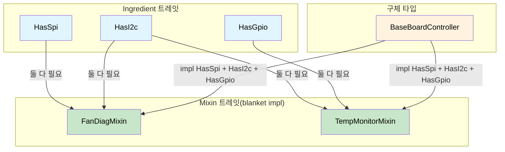

<a id="capability-mixins-compile-time-hardware-contracts"></a>
# Capability Mixin — 컴파일 타임 하드웨어 계약 🟡

> **이 장에서 배울 내용:** 버스 역량(ingredient trait)과 mixin 트레잇, blanket impl을 결합해 진단 코드 중복을 없애면서, 모든 하드웨어 의존성이 **컴파일 타임에** 충족됨을 보장하는 방법입니다.
>
> **상호 참조:** [ch04](ch04-capability-tokens-zero-cost-proof-of-aut.md)(capability token), [ch09](ch09-phantom-types-for-resource-tracking.md)(phantom type), [ch10](ch10-putting-it-all-together-a-complete-diagn.md)(통합)

<a id="the-problem-diagnostic-code-duplication"></a>
## 문제: 진단 코드 중복

서버 플랫폼은 서브시스템마다 진단 패턴을 공유합니다. 팬 진단, 온도 모니터링, 전원 시퀀싱은 비슷한 워크플로를 따르지만 서로 다른 하드웨어 버스에서 동작합니다. 추상화가 없으면 복붙이 생깁니다.

```c
// C — 서브시스템마다 중복된 로직
int run_fan_diag(spi_bus_t *spi, i2c_bus_t *i2c) {
    // ... SPI 센서 읽기 50줄 ...
    // ... I2C 레지스터 확인 30줄 ...
    // ... 임계값 비교 20줄(CPU 진단과 동일) ...
}

int run_cpu_temp_diag(i2c_bus_t *i2c, gpio_t *gpio) {
    // ... I2C 레지스터 확인 30줄(팬 진단과 동일) ...
    // ... GPIO 알림 확인 15줄 ...
    // ... 임계값 비교 20줄(팬 진단과 동일) ...
}
```

임계값 비교 로직은 동일하지만, 버스 타입이 달라 추출하기 어렵습니다. capability mixin을 쓰면 각 하드웨어 버스가 **ingredient 트레잇**이 되고, 올바른 재료가 있으면 진단 동작이 **자동으로** 제공됩니다.

<a id="ingredient-traits-hardware-capabilities"></a>
## Ingredient 트레잇(하드웨어 역량)

각 버스나 주변 장치는 트레잇의 연관 타입입니다. 진단 컨트롤러는 어떤 버스를 갖는지 선언합니다.

```rust,ignore
/// SPI 버스 역량.
pub trait HasSpi {
    type Spi: SpiBus;
    fn spi(&self) -> &Self::Spi;
}

/// I2C 버스 역량.
pub trait HasI2c {
    type I2c: I2cBus;
    fn i2c(&self) -> &Self::I2c;
}

/// GPIO 핀 접근 역량.
pub trait HasGpio {
    type Gpio: GpioController;
    fn gpio(&self) -> &Self::Gpio;
}

/// IPMI 접근 역량.
pub trait HasIpmi {
    type Ipmi: IpmiClient;
    fn ipmi(&self) -> &Self::Ipmi;
}

// 버스 트레잇 정의:
pub trait SpiBus {
    fn transfer(&self, data: &[u8]) -> Vec<u8>;
}

pub trait I2cBus {
    fn read_register(&self, addr: u8, reg: u8) -> u8;
    fn write_register(&self, addr: u8, reg: u8, value: u8);
}

pub trait GpioController {
    fn read_pin(&self, pin: u32) -> bool;
    fn set_pin(&self, pin: u32, value: bool);
}

pub trait IpmiClient {
    fn send_raw(&self, netfn: u8, cmd: u8, data: &[u8]) -> Vec<u8>;
}
```

<a id="mixin-traits-diagnostic-behaviors"></a>
## Mixin 트레잇(진단 동작)

Mixin은 필요한 역량을 갖춘 **모든 타입**에 동작을 **자동으로** 제공합니다.

```rust,ignore
# pub trait SpiBus { fn transfer(&self, data: &[u8]) -> Vec<u8>; }
# pub trait I2cBus {
#     fn read_register(&self, addr: u8, reg: u8) -> u8;
#     fn write_register(&self, addr: u8, reg: u8, value: u8);
# }
# pub trait GpioController { fn read_pin(&self, pin: u32) -> bool; }
# pub trait IpmiClient { fn send_raw(&self, netfn: u8, cmd: u8, data: &[u8]) -> Vec<u8>; }
# pub trait HasSpi { type Spi: SpiBus; fn spi(&self) -> &Self::Spi; }
# pub trait HasI2c { type I2c: I2cBus; fn i2c(&self) -> &Self::I2c; }
# pub trait HasGpio { type Gpio: GpioController; fn gpio(&self) -> &Self::Gpio; }
# pub trait HasIpmi { type Ipmi: IpmiClient; fn ipmi(&self) -> &Self::Ipmi; }

/// 팬 진단 mixin — SPI + I2C가 있으면 자동 구현.
pub trait FanDiagMixin: HasSpi + HasI2c {
    fn read_fan_speed(&self, fan_id: u8) -> u32 {
        // SPI로 타코미터 읽기
        let cmd = [0x80 | fan_id, 0x00];
        let response = self.spi().transfer(&cmd);
        u32::from_be_bytes([0, 0, response[0], response[1]])
    }

    fn set_fan_pwm(&self, fan_id: u8, duty_percent: u8) {
        // I2C 컨트롤러로 PWM 설정
        self.i2c().write_register(0x2E, fan_id, duty_percent);
    }

    fn run_fan_diagnostic(&self) -> bool {
        // 전체 진단: 모든 팬 읽기, 임계값 확인
        for fan_id in 0..6 {
            let speed = self.read_fan_speed(fan_id);
            if speed < 1000 || speed > 20000 {
                println!("Fan {fan_id}: FAIL ({speed} RPM)");
                return false;
            }
        }
        true
    }
}

// Blanket 구현 — SPI + I2C를 가진 **어떤 타입**이든 FanDiagMixin을 무료로 얻음
impl<T: HasSpi + HasI2c> FanDiagMixin for T {}

/// 온도 모니터링 mixin — I2C + GPIO 필요.
pub trait TempMonitorMixin: HasI2c + HasGpio {
    fn read_temperature(&self, sensor_addr: u8) -> f64 {
        let raw = self.i2c().read_register(sensor_addr, 0x00);
        raw as f64 * 0.5  // LSB당 0.5°C
    }

    fn check_thermal_alert(&self, alert_pin: u32) -> bool {
        self.gpio().read_pin(alert_pin)
    }

    fn run_thermal_diagnostic(&self) -> bool {
        for addr in [0x48, 0x49, 0x4A] {
            let temp = self.read_temperature(addr);
            if temp > 95.0 {
                println!("Sensor 0x{addr:02X}: CRITICAL ({temp}°C)");
                return false;
            }
            if self.check_thermal_alert(addr as u32) {
                println!("Sensor 0x{addr:02X}: ALERT pin asserted");
                return false;
            }
        }
        true
    }
}

impl<T: HasI2c + HasGpio> TempMonitorMixin for T {}

/// 전원 시퀀싱 mixin — I2C + IPMI 필요.
pub trait PowerSeqMixin: HasI2c + HasIpmi {
    fn read_voltage_rail(&self, rail: u8) -> f64 {
        let raw = self.i2c().read_register(0x40, rail);
        raw as f64 * 0.01  // LSB당 10mV
    }

    fn check_power_good(&self) -> bool {
        let resp = self.ipmi().send_raw(0x04, 0x2D, &[0x01]);
        !resp.is_empty() && resp[0] == 0x00
    }
}

impl<T: HasI2c + HasIpmi> PowerSeqMixin for T {}
```

<a id="concrete-controller-mix-and-match"></a>
## 구체적 컨트롤러 — 조합

구체적인 진단 컨트롤러는 역량을 선언하면 **자동으로** 맞는 mixin을 **상속**합니다.

```rust,ignore
# pub trait SpiBus { fn transfer(&self, data: &[u8]) -> Vec<u8>; }
# pub trait I2cBus {
#     fn read_register(&self, addr: u8, reg: u8) -> u8;
#     fn write_register(&self, addr: u8, reg: u8, value: u8);
# }
# pub trait GpioController {
#     fn read_pin(&self, pin: u32) -> bool;
#     fn set_pin(&self, pin: u32, value: bool);
# }
# pub trait IpmiClient { fn send_raw(&self, netfn: u8, cmd: u8, data: &[u8]) -> Vec<u8>; }
# pub trait HasSpi { type Spi: SpiBus; fn spi(&self) -> &Self::Spi; }
# pub trait HasI2c { type I2c: I2cBus; fn i2c(&self) -> &Self::I2c; }
# pub trait HasGpio { type Gpio: GpioController; fn gpio(&self) -> &Self::Gpio; }
# pub trait HasIpmi { type Ipmi: IpmiClient; fn ipmi(&self) -> &Self::Ipmi; }
# pub trait FanDiagMixin: HasSpi + HasI2c {}
# impl<T: HasSpi + HasI2c> FanDiagMixin for T {}
# pub trait TempMonitorMixin: HasI2c + HasGpio {}
# impl<T: HasI2c + HasGpio> TempMonitorMixin for T {}
# pub trait PowerSeqMixin: HasI2c + HasIpmi {}
# impl<T: HasI2c + HasIpmi> PowerSeqMixin for T {}

// 구체 버스 구현(예시용 스텁)
pub struct LinuxSpi { bus: u8 }
impl SpiBus for LinuxSpi {
    fn transfer(&self, data: &[u8]) -> Vec<u8> { vec![0; data.len()] }
}

pub struct LinuxI2c { bus: u8 }
impl I2cBus for LinuxI2c {
    fn read_register(&self, _addr: u8, _reg: u8) -> u8 { 42 }
    fn write_register(&self, _addr: u8, _reg: u8, _value: u8) {}
}

pub struct LinuxGpio;
impl GpioController for LinuxGpio {
    fn read_pin(&self, _pin: u32) -> bool { false }
    fn set_pin(&self, _pin: u32, _value: bool) {}
}

pub struct IpmiToolClient;
impl IpmiClient for IpmiToolClient {
    fn send_raw(&self, _netfn: u8, _cmd: u8, _data: &[u8]) -> Vec<u8> { vec![0x00] }
}

/// BaseBoardController는 모든 버스 보유 → 모든 mixin 획득.
pub struct BaseBoardController {
    spi: LinuxSpi,
    i2c: LinuxI2c,
    gpio: LinuxGpio,
    ipmi: IpmiToolClient,
}

impl HasSpi for BaseBoardController {
    type Spi = LinuxSpi;
    fn spi(&self) -> &LinuxSpi { &self.spi }
}

impl HasI2c for BaseBoardController {
    type I2c = LinuxI2c;
    fn i2c(&self) -> &LinuxI2c { &self.i2c }
}

impl HasGpio for BaseBoardController {
    type Gpio = LinuxGpio;
    fn gpio(&self) -> &LinuxGpio { &self.gpio }
}

impl HasIpmi for BaseBoardController {
    type Ipmi = IpmiToolClient;
    fn ipmi(&self) -> &IpmiToolClient { &self.ipmi }
}

// BaseBoardController는 이제 자동으로:
// - FanDiagMixin    (HasSpi + HasI2c 때문에)
// - TempMonitorMixin (HasI2c + HasGpio 때문에)
// - PowerSeqMixin   (HasI2c + HasIpmi 때문에)
// 수동 구현 불필요 — blanket impl이 모두 처리.
```

<a id="correct-by-construction-aspect"></a>
## 올바른 구성(correct-by-construction) 측면

Mixin 패턴이 correct-by-construction인 이유:

1. **`read_fan_speed()`를 SPI 없이 호출할 수 없음** — 메서드는 `HasSpi + HasI2c`를 구현한 타입에만 존재
2. **버스를 빠뜨릴 수 없음** — `BaseBoardController`에서 `HasSpi`를 제거하면 `FanDiagMixin` 메서드가 컴파일 타임에 사라짐
3. **모의(mock) 테스트가 자동** — `LinuxSpi`를 `MockSpi`로 바꿔도 mixin 로직은 그대로 동작
4. **새 플랫폼은 역량만 선언** — I2C만 있는 GPU 딸카드는(GPIO도 있으면) `TempMonitorMixin`은 얻지만 `FanDiagMixin`은 얻지 못함(SPI 없음)

<a id="when-to-use-capability-mixins"></a>
### 언제 capability mixin을 쓸까

| 시나리오 | mixin 사용? |
|----------|:-----------:|
| 횡단 관심사 진단 동작 | 예 — 복붙 방지 |
| 멀티 버스 하드웨어 컨트롤러 | 예 — 역량 선언, 동작 획득 |
| 플랫폼별 테스트 하네스 | 예 — 역량 모의 |
| 단일 버스 단순 주변 장치 | 경고 — 오버헤드가 값어치 없을 수 있음 |
| 순수 비즈니스 로직(하드웨어 없음) | 아니요 — 더 단순한 패턴으로 충분 |

<a id="mixin-trait-architecture"></a>
## Mixin 트레잇 아키텍처



<a id="exercise-network-diagnostic-mixins"></a>
## 연습: 네트워크 진단 Mixin

네트워크 진단용 mixin 시스템을 설계하세요.

- Ingredient 트레잇: `HasEthernet`, `HasIpmi`
- Mixin: `HasEthernet`이 필요한 `LinkHealthMixin` — `check_link_status(&self)`
- Mixin: `HasEthernet + HasIpmi`가 필요한 `RemoteDiagMixin` — `remote_health_check(&self)`
- 구체 타입: 두 ingredient를 모두 구현하는 `NicController`

<details>
<summary>해답</summary>

```rust,ignore
pub trait HasEthernet {
    fn eth_link_up(&self) -> bool;
}

pub trait HasIpmi {
    fn ipmi_ping(&self) -> bool;
}

pub trait LinkHealthMixin: HasEthernet {
    fn check_link_status(&self) -> &'static str {
        if self.eth_link_up() { "link: UP" } else { "link: DOWN" }
    }
}
impl<T: HasEthernet> LinkHealthMixin for T {}

pub trait RemoteDiagMixin: HasEthernet + HasIpmi {
    fn remote_health_check(&self) -> &'static str {
        if self.eth_link_up() && self.ipmi_ping() {
            "remote: HEALTHY"
        } else {
            "remote: DEGRADED"
        }
    }
}
impl<T: HasEthernet + HasIpmi> RemoteDiagMixin for T {}

pub struct NicController;
impl HasEthernet for NicController {
    fn eth_link_up(&self) -> bool { true }
}
impl HasIpmi for NicController {
    fn ipmi_ping(&self) -> bool { true }
}
// NicController는 두 mixin 메서드를 자동으로 얻음
```

</details>

<a id="key-takeaways"></a>
## 핵심 정리

1. **Ingredient 트레잇이 하드웨어 역량을 선언합니다** — `HasSpi`, `HasI2c`, `HasGpio`는 연관 타입 트레잇입니다.
2. **Mixin 트레잇이 blanket impl로 동작을 제공합니다** — `impl<T: HasSpi + HasI2c> FanDiagMixin for T {}`.
3. **새 플랫폼 = 역량 나열** — 컴파일러가 맞는 mixin 메서드를 모두 제공합니다.
4. **버스 제거 = 사용처 전부 컴파일 오류** — 하류 코드 업데이트를 잊을 수 없습니다.
5. **모의 테스트가 공짜** — `LinuxSpi`를 `MockSpi`로 바꿔도 mixin 로직은 동일합니다.

---

