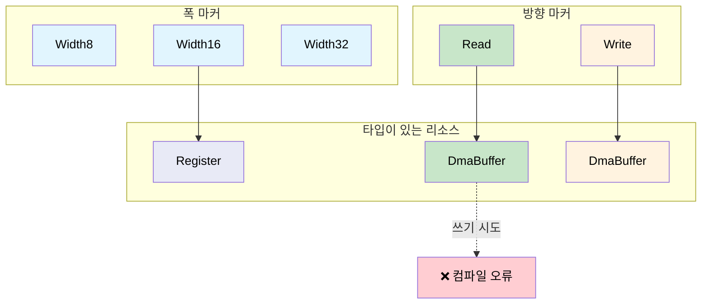

<a id="phantom-types-for-resource-tracking"></a>
# 리소스 추적을 위한 팬텀 타입 🟡

> **이 장에서 배울 내용:** `PhantomData` 마커로 레지스터 폭, DMA 방향, 파일 디스크립터 상태를 **타입 수준**에서 인코딩해, 런타임 비용 없이 리소스 불일치 버그 한 클래스를 막는 방법입니다.
>
> **상호 참조:** [ch05](ch05-protocol-state-machines-type-state-for-r.md)(type-state), [ch06](ch06-dimensional-analysis-making-the-compiler.md)(차원 타입), [ch08](ch08-capability-mixins-compile-time-hardware-.md)(mixin), [ch10](ch10-putting-it-all-together-a-complete-diagn.md)(통합)

<a id="the-problem-mixing-up-resources"></a>
## 문제: 리소스 혼동

하드웨어 리소스는 코드에서 비슷해 보이지만 서로 바꿔 쓸 수 없습니다.

- 32비트 레지스터와 16비트 레지스터는 둘 다 "레지스터"
- 읽기용 DMA 버퍼와 쓰기용 DMA 버퍼는 둘 다 `*mut u8`처럼 보임
- 열린 fd와 닫힌 fd는 둘 다 `i32`

C에서는:

```c
// C — 모든 레지스터가 같아 보임
uint32_t read_reg32(volatile void *base, uint32_t offset);
uint16_t read_reg16(volatile void *base, uint32_t offset);

// 버그: 16비트 레지스터를 32비트 함수로 읽음
uint32_t status = read_reg32(pcie_bar, LINK_STATUS_REG);  // reg16이어야 함!
```

<a id="phantom-type-parameters"></a>
## 팬텀 타입 매개변수

**팬텀 타입(phantom type)**은 구조체 정의에는 나오지만 어떤 필드에도 쓰이지 않는 타입 매개변수입니다. 순전히 타입 수준 정보를 실어 나릅니다.

```rust,ignore
use std::marker::PhantomData;

// 레지스터 폭 마커 — 크기 0
pub struct Width8;
pub struct Width16;
pub struct Width32;
pub struct Width64;

/// 폭으로 매개변수화된 레지스터 핸들.
/// PhantomData<W>는 0바이트 — 컴파일 타임 전용 마커.
pub struct Register<W> {
    base: usize,
    offset: usize,
    _width: PhantomData<W>,
}

impl Register<Width8> {
    pub fn read(&self) -> u8 {
        // ... base + offset에서 1바이트 읽기 ...
        0 // 스텁
    }
    pub fn write(&self, _value: u8) {
        // ... 1바이트 쓰기 ...
    }
}

impl Register<Width16> {
    pub fn read(&self) -> u16 {
        // ... base + offset에서 2바이트 읽기 ...
        0 // 스텁
    }
    pub fn write(&self, _value: u16) {
        // ... 2바이트 쓰기 ...
    }
}

impl Register<Width32> {
    pub fn read(&self) -> u32 {
        // ... base + offset에서 4바이트 읽기 ...
        0 // 스텁
    }
    pub fn write(&self, _value: u32) {
        // ... 4바이트 쓰기 ...
    }
}

/// PCIe 설정 공간 레지스터 정의.
pub struct PcieConfig {
    base: usize,
}

impl PcieConfig {
    pub fn vendor_id(&self) -> Register<Width16> {
        Register { base: self.base, offset: 0x00, _width: PhantomData }
    }

    pub fn device_id(&self) -> Register<Width16> {
        Register { base: self.base, offset: 0x02, _width: PhantomData }
    }

    pub fn command(&self) -> Register<Width16> {
        Register { base: self.base, offset: 0x04, _width: PhantomData }
    }

    pub fn status(&self) -> Register<Width16> {
        Register { base: self.base, offset: 0x06, _width: PhantomData }
    }

    pub fn bar0(&self) -> Register<Width32> {
        Register { base: self.base, offset: 0x10, _width: PhantomData }
    }
}

fn pcie_example() {
    let cfg = PcieConfig { base: 0xFE00_0000 };

    let vid: u16 = cfg.vendor_id().read();    // u16 반환
    let bar: u32 = cfg.bar0().read();         // u32 반환

    // 섞어 쓸 수 없음:
    // let bad: u32 = cfg.vendor_id().read(); // ❌ ERROR: expected u16
    // cfg.bar0().write(0u16);                // ❌ ERROR: expected u32
}
```

<a id="dma-buffer-access-control"></a>
## DMA 버퍼 접근 제어

DMA 버퍼에는 방향이 있습니다. **디바이스→호스트(읽기)** 용과 **호스트→디바이스(쓰기)** 용이 있는데, 잘못된 방향을 쓰면 데이터가 깨지거나 버스 오류가 납니다.

```rust,ignore
use std::marker::PhantomData;

// 방향 마커
pub struct ToDevice;     // 호스트가 쓰고 디바이스가 읽음
pub struct FromDevice;   // 디바이스가 쓰고 호스트가 읽음

/// 방향이 강제되는 DMA 버퍼.
pub struct DmaBuffer<Dir> {
    ptr: *mut u8,
    len: usize,
    dma_addr: u64,  // 디바이스용 물리 주소
    _dir: PhantomData<Dir>,
}

impl DmaBuffer<ToDevice> {
    /// 디바이스로 보낼 데이터로 버퍼를 채웁니다.
    pub fn write_data(&mut self, data: &[u8]) {
        assert!(data.len() <= self.len);
        unsafe { std::ptr::copy_nonoverlapping(data.as_ptr(), self.ptr, data.len()) }
    }

    /// 디바이스가 읽을 DMA 주소.
    pub fn device_addr(&self) -> u64 {
        self.dma_addr
    }
}

impl DmaBuffer<FromDevice> {
    /// 디바이스가 버퍼에 쓴 데이터를 읽습니다.
    pub fn read_data(&self) -> &[u8] {
        unsafe { std::slice::from_raw_parts(self.ptr, self.len) }
    }

    /// 디바이스가 쓸 DMA 주소.
    pub fn device_addr(&self) -> u64 {
        self.dma_addr
    }
}

// FromDevice 버퍼에 쓸 수 없음:
// fn oops(buf: &mut DmaBuffer<FromDevice>) {
//     buf.write_data(&[1, 2, 3]);  // ❌ DmaBuffer<FromDevice>에 `write_data` 없음
// }

// ToDevice 버퍼에서 읽을 수 없음:
// fn oops2(buf: &DmaBuffer<ToDevice>) {
//     let data = buf.read_data();  // ❌ DmaBuffer<ToDevice>에 `read_data` 없음
// }
```

<a id="file-descriptor-ownership"></a>
## 파일 디스크립터 소유권

흔한 버그: 닫은 뒤에도 fd를 씁니다. 팬텀 타입으로 열림/닫힘 상태를 추적할 수 있습니다.

```rust,ignore
use std::marker::PhantomData;

pub struct Open;
pub struct Closed;

/// 상태가 추적되는 파일 디스크립터.
pub struct Fd<State> {
    raw: i32,
    _state: PhantomData<State>,
}

impl Fd<Open> {
    pub fn open(path: &str) -> Result<Self, String> {
        // ... 파일 열기 ...
        Ok(Fd { raw: 3, _state: PhantomData }) // 스텁
    }

    pub fn read(&self, buf: &mut [u8]) -> Result<usize, String> {
        // ... fd에서 읽기 ...
        Ok(0) // 스텁
    }

    pub fn write(&self, data: &[u8]) -> Result<usize, String> {
        // ... fd에 쓰기 ...
        Ok(data.len()) // 스텁
    }

    /// fd 닫기 — Closed 핸들을 반환.
    /// Open 핸들은 소비되어 닫은 뒤 사용 방지.
    pub fn close(self) -> Fd<Closed> {
        // ... fd 닫기 ...
        Fd { raw: self.raw, _state: PhantomData }
    }
}

impl Fd<Closed> {
    // read()/write() 없음 — Fd<Closed>에는 존재하지 않음.
    // 닫은 뒤 사용은 컴파일 오류가 됨.

    pub fn raw_fd(&self) -> i32 {
        self.raw
    }
}

fn fd_example() -> Result<(), String> {
    let fd = Fd::open("/dev/ipmi0")?;
    let mut buf = [0u8; 256];
    fd.read(&mut buf)?;

    let closed = fd.close();

    // closed.read(&mut buf)?;  // ❌ Fd<Closed>에 `read` 없음
    // closed.write(&[1])?;     // ❌ Fd<Closed>에 `write` 없음

    Ok(())
}
```

<a id="combining-phantom-types-with-earlier-patterns"></a>
## 앞선 패턴과 팬텀 타입 결합

팬텀 타입은 지금까지 본 모든 것과 조합됩니다.

```rust,ignore
# use std::marker::PhantomData;
# pub struct Width32;
# pub struct Width16;
# pub struct Register<W> { _w: PhantomData<W> }
# impl Register<Width16> { pub fn read(&self) -> u16 { 0 } }
# impl Register<Width32> { pub fn read(&self) -> u32 { 0 } }
# #[derive(Debug, Clone, Copy, PartialEq, PartialOrd)]
# pub struct Celsius(pub f64);

/// 팬텀 타입(레지스터 폭)과 차원 타입(Celsius)을 결합.
fn read_temp_sensor(reg: &Register<Width16>) -> Celsius {
    let raw = reg.read();  // 팬텀 타입으로 u16 보장
    Celsius(raw as f64 * 0.0625)  // 반환 타입으로 Celsius 보장
}

// 컴파일러가 강제:
// 1. 레지스터는 16비트(팬텀 타입)
// 2. 결과는 Celsius(뉴타입)
// 둘 다 런타임 비용 0.
```

<a id="when-to-use-phantom-types"></a>
### 언제 팬텀 매개변수를 쓸까

| 시나리오 | 팬텀 매개변수? |
|----------|:-------------:|
| 레지스터 폭 인코딩 | 예 — 폭 불일치 방지 |
| DMA 버퍼 방향 | 예 — 데이터 손상 방지 |
| 파일 디스크립터 상태 | 예 — 닫은 뒤 사용 방지 |
| 메모리 영역 권한(R/W/X) | 예 — 접근 제어 강제 |
| 제네릭 컨테이너(Vec, HashMap) | 아니요 — 구체 타입 매개변수 사용 |
| 런타임에 바뀌는 속성 | 아니요 — 팬텀은 컴파일 타임 전용 |

<a id="phantom-type-resource-matrix"></a>
## 팬텀 타입 리소스 매트릭스



<a id="exercise-memory-region-permissions"></a>
## 연습: 메모리 영역 권한

읽기, 쓰기, 실행 권한이 있는 메모리 영역용 팬텀 타입을 설계하세요.

- `MemRegion<ReadOnly>` — `fn read(&self, offset: usize) -> u8`
- `MemRegion<ReadWrite>` — `read`와 `write` 모두
- `MemRegion<Executable>` — `read`와 `fn execute(&self)`
- `ReadOnly`에 쓰거나 `ReadWrite`를 실행하면 컴파일되지 않아야 합니다.

<details>
<summary>해답</summary>

```rust,ignore
use std::marker::PhantomData;

pub struct ReadOnly;
pub struct ReadWrite;
pub struct Executable;

pub struct MemRegion<Perm> {
    base: *mut u8,
    len: usize,
    _perm: PhantomData<Perm>,
}

// 모든 권한 타입에서 읽기 가능
impl<P> MemRegion<P> {
    pub fn read(&self, offset: usize) -> u8 {
        assert!(offset < self.len);
        unsafe { *self.base.add(offset) }
    }
}

impl MemRegion<ReadWrite> {
    pub fn write(&mut self, offset: usize, val: u8) {
        assert!(offset < self.len);
        unsafe { *self.base.add(offset) = val; }
    }
}

impl MemRegion<Executable> {
    pub fn execute(&self) {
        // 기준 주소로 점프(개념상)
    }
}

// ❌ region_ro.write(0, 0xFF);  // 컴파일 오류: `write` 메서드 없음
// ❌ region_rw.execute();       // 컴파일 오류: `execute` 메서드 없음
```

</details>

<a id="key-takeaways"></a>
## 핵심 정리

1. **PhantomData는 크기 0으로 타입 수준 정보를 실어 나릅니다** — 마커는 컴파일러용입니다.
2. **레지스터 폭 불일치가 컴파일 오류가 됩니다** — `Register<Width16>`은 `u16`을 반환하고 `u32`가 아닙니다.
3. **DMA 방향이 구조적으로 강제됩니다** — `DmaBuffer<Read>`에는 `write()`가 없습니다.
4. **차원 타입(ch06)과 결합** — `Register<Width16>`이 파싱 단계에서 `Celsius`를 반환할 수 있습니다.
5. **팬텀 타입은 컴파일 타임 전용** — 런타임에 바뀌는 속성에는 쓸 수 없습니다. 그런 경우에는 enum을 쓰세요.

---

