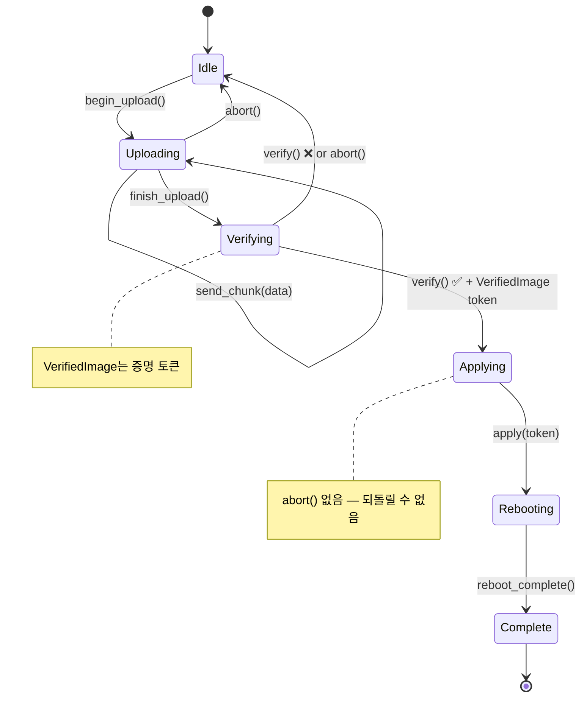

<a id="exercises"></a>
# 연습문제 🟡

> **이 장에서 배울 내용:** correct-by-construction 패턴을 실제 하드웨어 시나리오에 적용하는 실습 — NVMe 관리 명령, 펌웨어 업데이트 상태 머신, 센서 파이프라인, PCIe 팬텀 타입, 멀티 프로토콜 헬스 체크, 세션 타입 진단 프로토콜.
>
> **상호 참조:** [ch02](ch02-typed-command-interfaces-request-determi.md)(연습 1), [ch05](ch05-protocol-state-machines-type-state-for-r.md)(연습 2), [ch06](ch06-dimensional-analysis-making-the-compiler.md)(연습 3), [ch09](ch09-phantom-types-for-resource-tracking.md)(연습 4), [ch10](ch10-putting-it-all-together-a-complete-diagn.md)(연습 5)

<a id="practice-problems"></a>
## 실습 문제

<a id="exercise-1-nvme-admin-command-typed-commands"></a>
### 연습 1: NVMe 관리 명령(타입이 있는 명령)

NVMe 관리 명령용 타입이 있는 명령 인터페이스를 설계하세요.

- `Identify` → `IdentifyResponse`(모델명, 시리얼, 펌웨어 리비전)
- `GetLogPage` → `SmartLog`(온도, 가용 여유, 읽은 데이터 단위)
- `GetFeature` → 기능별 응답

요구사항:
1. 명령 타입이 응답 타입을 결정한다
2. 런타임 디스패치 없음 — 정적 디스패치만
3. 다른 `u32`와 네임스페이스 ID가 섞이지 않도록 `NamespaceId` 뉴타입 추가

**힌트:** ch02의 `IpmiCmd` 트레잇 패턴을 따르되, NVMe 전용 상수를 사용하세요.

<details>
<summary>예시 해답(연습 1)</summary>

```rust,ignore
use std::io;

#[derive(Debug, Clone, Copy, PartialEq, Eq, PartialOrd, Ord, Hash)]
pub struct NamespaceId(pub u32);

#[derive(Debug, Clone, PartialEq)]
pub struct IdentifyResponse {
    pub model: String,
    pub serial: String,
    pub firmware_rev: String,
}

#[derive(Debug, Clone, PartialEq)]
pub struct SmartLog {
    pub temperature_kelvin: u16,
    pub available_spare_pct: u8,
    pub data_units_read: u64,
}

#[derive(Debug, Clone, PartialEq)]
pub struct ArbitrationFeature {
    pub high_priority_weight: u8,
    pub medium_priority_weight: u8,
    pub low_priority_weight: u8,
}

/// 핵심 패턴: 연관 타입이 각 명령의 응답을 고정한다.
pub trait NvmeAdminCmd {
    type Response;
    fn opcode(&self) -> u8;
    fn nsid(&self) -> Option<NamespaceId>;
    fn parse_response(&self, raw: &[u8]) -> io::Result<Self::Response>;
}

pub struct Identify { pub nsid: NamespaceId }

impl NvmeAdminCmd for Identify {
    type Response = IdentifyResponse;
    fn opcode(&self) -> u8 { 0x06 }
    fn nsid(&self) -> Option<NamespaceId> { Some(self.nsid) }
    fn parse_response(&self, raw: &[u8]) -> io::Result<IdentifyResponse> {
        if raw.len() < 12 {
            return Err(io::Error::new(io::ErrorKind::InvalidData, "too short"));
        }
        Ok(IdentifyResponse {
            model: String::from_utf8_lossy(&raw[0..4]).trim().to_string(),
            serial: String::from_utf8_lossy(&raw[4..8]).trim().to_string(),
            firmware_rev: String::from_utf8_lossy(&raw[8..12]).trim().to_string(),
        })
    }
}

pub struct GetLogPage { pub log_id: u8 }

impl NvmeAdminCmd for GetLogPage {
    type Response = SmartLog;
    fn opcode(&self) -> u8 { 0x02 }
    fn nsid(&self) -> Option<NamespaceId> { None }
    fn parse_response(&self, raw: &[u8]) -> io::Result<SmartLog> {
        if raw.len() < 11 {
            return Err(io::Error::new(io::ErrorKind::InvalidData, "too short"));
        }
        Ok(SmartLog {
            temperature_kelvin: u16::from_le_bytes([raw[0], raw[1]]),
            available_spare_pct: raw[2],
            data_units_read: u64::from_le_bytes(raw[3..11].try_into().unwrap()),
        })
    }
}

pub struct GetFeature { pub feature_id: u8 }

impl NvmeAdminCmd for GetFeature {
    type Response = ArbitrationFeature;
    fn opcode(&self) -> u8 { 0x0A }
    fn nsid(&self) -> Option<NamespaceId> { None }
    fn parse_response(&self, raw: &[u8]) -> io::Result<ArbitrationFeature> {
        if raw.len() < 3 {
            return Err(io::Error::new(io::ErrorKind::InvalidData, "too short"));
        }
        Ok(ArbitrationFeature {
            high_priority_weight: raw[0],
            medium_priority_weight: raw[1],
            low_priority_weight: raw[2],
        })
    }
}

/// 정적 디스패치 — 컴파일러가 명령 타입마다 단일화(monomorphise)한다.
pub struct NvmeController;

impl NvmeController {
    pub fn execute<C: NvmeAdminCmd>(&self, cmd: &C) -> io::Result<C::Response> {
        // cmd.opcode()/cmd.nsid()로 SQE 구성,
        // SQ에 제출, CQ 대기 후:
        let raw = self.submit_and_read(cmd.opcode())?;
        cmd.parse_response(&raw)
    }

    fn submit_and_read(&self, _opcode: u8) -> io::Result<Vec<u8>> {
        // 실제 구현은 /dev/nvme0과 통신
        Ok(vec![0; 512])
    }
}
```

**핵심 요점:**
- `NamespaceId(u32)`가 임의의 `u32`와 네임스페이스 ID를 섞지 않게 한다.
- `NvmeAdminCmd::Response`가 "타입 인덱스" — `execute()`가 정확히 `C::Response`를 반환한다.
- 완전한 정적 디스패치: `Box<dyn …>` 없음, 런타임 다운캐스트 없음.

</details>

<a id="exercise-2-firmware-update-state-machine-type-state"></a>
### 연습 2: 펌웨어 업데이트 상태 머신(type-state)

BMC 펌웨어 업데이트 수명 주기를 모델링하세요.



요구사항:
1. 각 상태는 서로 다른 타입이다
2. 업로드는 Idle에서만 시작할 수 있다
3. 검증은 업로드가 끝난 뒤에만 가능하다
4. 적용(apply)은 검증 성공 후에만 — `VerifiedImage` 증명 토큰을 받는다
5. 적용 후에는 재부팅만 가능하다
6. `Uploading`과 `Verifying`에는 `abort()`가 있으나 `Applying`에는 없다(이미 늦음)

**힌트:** type-state(ch05)와 capability token(ch04)을 결합하세요.

<details>
<summary>예시 해답(연습 2)</summary>

```rust,ignore
// --- 상태 타입 ---
// 설계 선택: 여기서는 PhantomData<S> 대신 상태를 인라인으로 저장(`_state: S`).
// 상태에 의미 있는 런타임 데이터를 실을 수 있음 — 예: `Uploading { bytes_sent: usize }`가 진행률 추적.
// 상태가 순수 마커(ZST)일 때는 PhantomData, 런타임 데이터가 있으면 인라인 저장을 쓴다.
pub struct Idle;
pub struct Uploading { bytes_sent: usize }  // ZST 아님 — 진행 데이터 보유
pub struct Verifying;
pub struct Applying;
pub struct Rebooting;
pub struct Complete;

/// 증명 토큰: verify() 안에서만 생성.
pub struct VerifiedImage { _private: () }

pub struct FwUpdate<S> {
    bmc_addr: String,
    _state: S,
}

impl FwUpdate<Idle> {
    pub fn new(bmc_addr: &str) -> Self {
        FwUpdate { bmc_addr: bmc_addr.to_string(), _state: Idle }
    }
    pub fn begin_upload(self) -> FwUpdate<Uploading> {
        FwUpdate { bmc_addr: self.bmc_addr, _state: Uploading { bytes_sent: 0 } }
    }
}

impl FwUpdate<Uploading> {
    pub fn send_chunk(mut self, chunk: &[u8]) -> Self {
        self._state.bytes_sent += chunk.len();
        self
    }
    pub fn finish_upload(self) -> FwUpdate<Verifying> {
        FwUpdate { bmc_addr: self.bmc_addr, _state: Verifying }
    }
    /// 업로드 중 중단 — Idle로 복귀.
    pub fn abort(self) -> FwUpdate<Idle> {
        FwUpdate { bmc_addr: self.bmc_addr, _state: Idle }
    }
}

impl FwUpdate<Verifying> {
    /// 성공 시 다음 상태와 VerifiedImage 증명 토큰을 반환.
    pub fn verify(self) -> Result<(FwUpdate<Applying>, VerifiedImage), FwUpdate<Idle>> {
        // 실제: CRC, 서명, 호환성 확인
        let token = VerifiedImage { _private: () };
        Ok((
            FwUpdate { bmc_addr: self.bmc_addr, _state: Applying },
            token,
        ))
    }
    /// 검증 중 중단.
    pub fn abort(self) -> FwUpdate<Idle> {
        FwUpdate { bmc_addr: self.bmc_addr, _state: Idle }
    }
}

impl FwUpdate<Applying> {
    /// VerifiedImage 증명을 소비 — 검증 없이는 apply 불가.
    /// 참고: abort() 메서드 없음 — 플래시 시작 후에는 너무 위험.
    pub fn apply(self, _proof: VerifiedImage) -> FwUpdate<Rebooting> {
        FwUpdate { bmc_addr: self.bmc_addr, _state: Rebooting }
    }
}

impl FwUpdate<Rebooting> {
    pub fn wait_for_reboot(self) -> FwUpdate<Complete> {
        FwUpdate { bmc_addr: self.bmc_addr, _state: Complete }
    }
}

impl FwUpdate<Complete> {
    pub fn version(&self) -> &str { "2.1.0" }
}

// 사용 예:
// let fw = FwUpdate::new("192.168.1.100")
//     .begin_upload()
//     .send_chunk(b"image_data")
//     .finish_upload();
// let (fw, proof) = fw.verify().map_err(|_| "verify failed")?;
// let fw = fw.apply(proof).wait_for_reboot();
// println!("New version: {}", fw.version());
```

**핵심 요점:**
- `abort()`는 `FwUpdate<Uploading>`과 `FwUpdate<Verifying>`에만 있음 — `FwUpdate<Applying>`에서 호출하면 **컴파일 오류**, 런타임 검사가 아님.
- `VerifiedImage`는 비공개 필드라 `verify()`만 생성 가능.
- `apply()`가 증명 토큰을 소비 — 검증 생략 불가.

</details>

<a id="exercise-3-sensor-reading-pipeline-dimensional-analysis"></a>
### 연습 3: 센서 읽기 파이프라인(차원 분석)

완전한 센서 파이프라인을 만드세요.

1. 뉴타입 정의: `RawAdc`, `Celsius`, `Fahrenheit`, `Volts`, `Millivolts`, `Watts`
2. `From<Celsius> for Fahrenheit` 및 역방향 구현
3. `impl Mul<Volts, Output=Watts> for Amperes` 생성(P = V × I)
4. 제네릭 `Threshold<T>` 검사기 작성
5. 파이프라인 작성: ADC → 보정 → 임계값 검사 → 결과

컴파일러는 `Celsius`와 `Volts` 비교, `Watts`에 `Rpm` 더하기, `Volts`가 필요한 곳에 `Millivolts` 전달을 거부해야 합니다.

<details>
<summary>예시 해답(연습 3)</summary>

```rust,ignore
use std::ops::{Add, Sub, Mul};

#[derive(Debug, Clone, Copy, PartialEq, PartialOrd)]
pub struct RawAdc(pub u16);

#[derive(Debug, Clone, Copy, PartialEq, PartialOrd)]
pub struct Celsius(pub f64);

#[derive(Debug, Clone, Copy, PartialEq, PartialOrd)]
pub struct Fahrenheit(pub f64);

#[derive(Debug, Clone, Copy, PartialEq, PartialOrd)]
pub struct Volts(pub f64);

#[derive(Debug, Clone, Copy, PartialEq, PartialOrd)]
pub struct Millivolts(pub f64);

#[derive(Debug, Clone, Copy, PartialEq, PartialOrd)]
pub struct Amperes(pub f64);

#[derive(Debug, Clone, Copy, PartialEq, PartialOrd)]
pub struct Watts(pub f64);

// --- 안전한 변환 ---
impl From<Celsius> for Fahrenheit {
    fn from(c: Celsius) -> Self { Fahrenheit(c.0 * 9.0 / 5.0 + 32.0) }
}
impl From<Fahrenheit> for Celsius {
    fn from(f: Fahrenheit) -> Self { Celsius((f.0 - 32.0) * 5.0 / 9.0) }
}
impl From<Millivolts> for Volts {
    fn from(mv: Millivolts) -> Self { Volts(mv.0 / 1000.0) }
}
impl From<Volts> for Millivolts {
    fn from(v: Volts) -> Self { Millivolts(v.0 * 1000.0) }
}

// --- 동일 단위 산술 ---
// 참고: 절대 온도 덧셈(25°C + 30°C)은 물리적으로 애매함 —
// ch06의 ΔT 뉴타입 논의를 보면 더 엄밀한 접근이 있다. 여기서는 연습용으로 단순화.
impl Add for Celsius {
    type Output = Celsius;
    fn add(self, rhs: Self) -> Celsius { Celsius(self.0 + rhs.0) }
}
impl Sub for Celsius {
    type Output = Celsius;
    fn sub(self, rhs: Self) -> Celsius { Celsius(self.0 - rhs.0) }
}

// P = V × I  (단위가 다른 곱셈)
impl Mul<Amperes> for Volts {
    type Output = Watts;
    fn mul(self, rhs: Amperes) -> Watts { Watts(self.0 * rhs.0) }
}

// --- 제네릭 임계값 검사기 ---
// 연습 3은 ch06의 Threshold를 확장해 트리거 읽기값을 담는 제네릭 ThresholdResult<T>를 둔다 —
// ch06의 더 단순한 ThresholdResult { Normal, Warning, Critical } 열거형의 진화.
pub enum ThresholdResult<T> {
    Normal(T),
    Warning(T),
    Critical(T),
}

pub struct Threshold<T> {
    pub warning: T,
    pub critical: T,
}

// 제네릭 impl — PartialOrd를 만족하는 모든 단위 타입에 동작.
impl<T: PartialOrd + Copy> Threshold<T> {
    pub fn check(&self, reading: T) -> ThresholdResult<T> {
        if reading >= self.critical {
            ThresholdResult::Critical(reading)
        } else if reading >= self.warning {
            ThresholdResult::Warning(reading)
        } else {
            ThresholdResult::Normal(reading)
        }
    }
}
// 이제 `Threshold<Rpm>`, `Threshold<Volts>` 등이 자동으로 동작.

// --- 파이프라인: ADC → 보정 → 임계값 → 결과 ---
pub struct CalibrationParams {
    pub scale: f64,  // ADC 카운트당 °C
    pub offset: f64, // ADC 0일 때 °C
}

pub fn calibrate(raw: RawAdc, params: &CalibrationParams) -> Celsius {
    Celsius(raw.0 as f64 / params.scale + params.offset)
}

pub fn sensor_pipeline(
    raw: RawAdc,
    params: &CalibrationParams,
    threshold: &Threshold<Celsius>,
) -> ThresholdResult<Celsius> {
    let temp = calibrate(raw, params);
    threshold.check(temp)
}

// 컴파일 타임 안전 — 아래는 컴파일되지 않음:
// let _ = Celsius(25.0) + Volts(12.0);   // ERROR: 타입 불일치
// let _: Millivolts = Volts(1.0);         // ERROR: 암시적 강제 변환 없음
// let _ = Watts(100.0) + Rpm(3000);       // ERROR: 타입 불일치
```

**핵심 요점:**
- 물리 단위마다 별도 타입 — 실수로 섞지 않음.
- `Mul<Amperes> for Volts`가 `Watts`를 내어 P = V × I를 타입 시스템에 인코딩.
- 관련 단위(mV ↔ V, °C ↔ °F)는 명시적 `From` 변환.
- `Threshold<Celsius>`는 `Celsius`만 받음 — RPM 임계값 검사를 실수로 할 수 없음.

</details>

<a id="exercise-4-pcie-capability-walk-phantom-types-validated-boundary"></a>
### 연습 4: PCIe capability 연결 목록 순회(팬텀 타입 + 검증된 경계)

PCIe capability 연결 리스트를 모델링하세요.

1. `RawCapability` — 설정 공간의 미검증 바이트
2. `ValidCapability` — 파싱·검증됨(TryFrom 통해)
3. 각 capability 타입(MSI, MSI-X, PCIe Express, 전원 관리)은 자체 팬텀 타입 레지스터 레이아웃
4. 리스트 순회는 `ValidCapability` 값들의 이터레이터를 반환

**힌트:** 검증된 경계(ch07)와 팬텀 타입(ch09)을 결합하세요.

<details>
<summary>예시 해답(연습 4)</summary>

```rust,ignore
use std::marker::PhantomData;

// --- capability 타입용 팬텀 마커 ---
pub struct Msi;
pub struct MsiX;
pub struct PciExpress;
pub struct PowerMgmt;

// 스펙의 PCI capability ID
const CAP_ID_PM:   u8 = 0x01;
const CAP_ID_MSI:  u8 = 0x05;
const CAP_ID_PCIE: u8 = 0x10;
const CAP_ID_MSIX: u8 = 0x11;

/// 미검증 바이트 — 쓰레기일 수 있음.
#[derive(Debug)]
pub struct RawCapability {
    pub id: u8,
    pub next_ptr: u8,
    pub data: Vec<u8>,
}

/// 검증되고 타입이 태그된 capability.
#[derive(Debug)]
pub struct ValidCapability<Kind> {
    id: u8,
    next_ptr: u8,
    data: Vec<u8>,
    _kind: PhantomData<Kind>,
}

// --- TryFrom: parse-don't-validate 경계 ---
impl TryFrom<RawCapability> for ValidCapability<PowerMgmt> {
    type Error = &'static str;
    fn try_from(raw: RawCapability) -> Result<Self, Self::Error> {
        if raw.id != CAP_ID_PM { return Err("not a PM capability"); }
        if raw.data.len() < 2 { return Err("PM data too short"); }
        Ok(ValidCapability {
            id: raw.id, next_ptr: raw.next_ptr,
            data: raw.data, _kind: PhantomData,
        })
    }
}

impl TryFrom<RawCapability> for ValidCapability<Msi> {
    type Error = &'static str;
    fn try_from(raw: RawCapability) -> Result<Self, Self::Error> {
        if raw.id != CAP_ID_MSI { return Err("not an MSI capability"); }
        if raw.data.len() < 6 { return Err("MSI data too short"); }
        Ok(ValidCapability {
            id: raw.id, next_ptr: raw.next_ptr,
            data: raw.data, _kind: PhantomData,
        })
    }
}

// (MsiX, PciExpress에 대한 유사 TryFrom impl — 생략)

// --- 타입 안전 접근자: 올바른 capability에서만 사용 가능 ---
impl ValidCapability<PowerMgmt> {
    pub fn pm_control(&self) -> u16 {
        u16::from_le_bytes([self.data[0], self.data[1]])
    }
}

impl ValidCapability<Msi> {
    pub fn message_control(&self) -> u16 {
        u16::from_le_bytes([self.data[0], self.data[1]])
    }
    pub fn vectors_requested(&self) -> u32 {
        1 << ((self.message_control() >> 1) & 0x07)
    }
}

impl ValidCapability<MsiX> {
    pub fn table_size(&self) -> u16 {
        (u16::from_le_bytes([self.data[0], self.data[1]]) & 0x07FF) + 1
    }
}

// --- Capability 순회: 연결 리스트 이터레이션 ---
pub struct CapabilityWalker<'a> {
    config_space: &'a [u8],
    next_ptr: u8,
}

impl<'a> CapabilityWalker<'a> {
    pub fn new(config_space: &'a [u8]) -> Self {
        // capability 포인터는 PCI 설정 공간 오프셋 0x34
        let first_ptr = if config_space.len() > 0x34 {
            config_space[0x34]
        } else { 0 };
        CapabilityWalker { config_space, next_ptr: first_ptr }
    }
}

impl<'a> Iterator for CapabilityWalker<'a> {
    type Item = RawCapability;
    fn next(&mut self) -> Option<RawCapability> {
        if self.next_ptr == 0 { return None; }
        let off = self.next_ptr as usize;
        if off + 2 > self.config_space.len() { return None; }
        let id = self.config_space[off];
        let next = self.config_space[off + 1];
        let end = if next > 0 { next as usize } else {
            (off + 16).min(self.config_space.len())
        };
        let data = self.config_space[off + 2..end].to_vec();
        self.next_ptr = next;
        Some(RawCapability { id, next_ptr: next, data })
    }
}

// 사용 예:
// for raw_cap in CapabilityWalker::new(&config_space) {
//     if let Ok(pm) = ValidCapability::<PowerMgmt>::try_from(raw_cap) {
//         println!("PM control: 0x{:04X}", pm.pm_control());
//     }
// }
```

**핵심 요점:**
- `RawCapability` → `ValidCapability<Kind>`가 parse-don't-validate 경계.
- `pm_control()`은 `ValidCapability<PowerMgmt>`에만 존재 — MSI에서 호출하면 컴파일 오류.
- `CapabilityWalker` 이터레이터는 raw capability를 내고, 호출자가 `TryFrom`으로 관심 있는 것만 검증.

</details>

<a id="exercise-5-multi-protocol-health-check-capability-mixins"></a>
### 연습 5: 멀티 프로토콜 헬스 체크(capability mixin)

헬스 체크 프레임워크를 만드세요.

1. ingredient 트레잇: `HasIpmi`, `HasRedfish`, `HasNvmeCli`, `HasGpio`
2. mixin 트레잇:
   - `ThermalHealthMixin`(HasIpmi + HasGpio 필요) — 온도 읽기, 알림 확인
   - `StorageHealthMixin`(HasNvmeCli 필요) — SMART 검사
   - `BmcHealthMixin`(HasIpmi + HasRedfish 필요) — BMC 데이터 교차 검증
3. 모든 ingredient를 구현하는 `FullPlatformController` 구축
4. `HasNvmeCli`만 구현하는 `StorageOnlyController` 구축
5. `StorageOnlyController`는 `StorageHealthMixin`만 얻고 나머지는 얻지 않음을 확인

<details>
<summary>예시 해답(연습 5)</summary>

```rust,ignore
// --- Ingredient 트레잇 ---
pub trait HasIpmi {
    fn ipmi_read_sensor(&self, id: u8) -> f64;
}
pub trait HasRedfish {
    fn redfish_get(&self, path: &str) -> String;
}
pub trait HasNvmeCli {
    fn nvme_smart_log(&self, dev: &str) -> SmartData;
}
pub trait HasGpio {
    fn gpio_read_alert(&self, pin: u8) -> bool;
}

pub struct SmartData {
    pub temperature_kelvin: u16,
    pub spare_pct: u8,
}

// --- Blanket impl이 있는 Mixin 트레잇 ---
pub trait ThermalHealthMixin: HasIpmi + HasGpio {
    fn thermal_check(&self) -> ThermalStatus {
        let temp = self.ipmi_read_sensor(0x01);
        let alert = self.gpio_read_alert(12);
        ThermalStatus { temperature: temp, alert_active: alert }
    }
}
impl<T: HasIpmi + HasGpio> ThermalHealthMixin for T {}

pub trait StorageHealthMixin: HasNvmeCli {
    fn storage_check(&self) -> StorageStatus {
        let smart = self.nvme_smart_log("/dev/nvme0");
        StorageStatus {
            temperature_ok: smart.temperature_kelvin < 343, // 70 °C
            spare_ok: smart.spare_pct > 10,
        }
    }
}
impl<T: HasNvmeCli> StorageHealthMixin for T {}

pub trait BmcHealthMixin: HasIpmi + HasRedfish {
    fn bmc_health(&self) -> BmcStatus {
        let ipmi_temp = self.ipmi_read_sensor(0x01);
        let rf_temp = self.redfish_get("/Thermal/Temperatures/0");
        BmcStatus { ipmi_temp, redfish_temp: rf_temp, consistent: true }
    }
}
impl<T: HasIpmi + HasRedfish> BmcHealthMixin for T {}

pub struct ThermalStatus { pub temperature: f64, pub alert_active: bool }
pub struct StorageStatus { pub temperature_ok: bool, pub spare_ok: bool }
pub struct BmcStatus { pub ipmi_temp: f64, pub redfish_temp: String, pub consistent: bool }

// --- 전체 플랫폼: 모든 ingredient → 세 mixin 모두 무료 ---
pub struct FullPlatformController;

impl HasIpmi for FullPlatformController {
    fn ipmi_read_sensor(&self, _id: u8) -> f64 { 42.0 }
}
impl HasRedfish for FullPlatformController {
    fn redfish_get(&self, _path: &str) -> String { "42.0".into() }
}
impl HasNvmeCli for FullPlatformController {
    fn nvme_smart_log(&self, _dev: &str) -> SmartData {
        SmartData { temperature_kelvin: 310, spare_pct: 95 }
    }
}
impl HasGpio for FullPlatformController {
    fn gpio_read_alert(&self, _pin: u8) -> bool { false }
}

// --- 스토리지 전용: HasNvmeCli만 → StorageHealthMixin만 ---
pub struct StorageOnlyController;

impl HasNvmeCli for StorageOnlyController {
    fn nvme_smart_log(&self, _dev: &str) -> SmartData {
        SmartData { temperature_kelvin: 315, spare_pct: 80 }
    }
}

// StorageOnlyController는 storage_check()를 자동으로 얻음.
// thermal_check()나 bmc_health() 호출은 컴파일 오류.
```

**핵심 요점:**
- Blanket `impl<T: HasIpmi + HasGpio> ThermalHealthMixin for T {}` — 두 ingredient를 모두 구현한 타입이 mixin을 자동 획득.
- `StorageOnlyController`는 `HasNvmeCli`만 구현하므로 컴파일러가 `StorageHealthMixin`만 부여하고 `thermal_check()`·`bmc_health()`는 거부 — 런타임 검사 불필요.
- 새 mixin(예: `NetworkHealthMixin: HasRedfish + HasGpio`) 추가는 트레잇 하나 + blanket impl 하나 — 자격이 되면 기존 컨트롤러가 자동으로 얻음.

</details>

<a id="exercise-6-session-typed-diagnostic-protocol-single-use-type-state"></a>
### 연습 6: 세션 타입 진단 프로토콜(단일 사용 + type-state)

단일 사용 테스트 실행 토큰이 있는 진단 세션을 설계하세요.

1. `DiagSession`은 `Setup` 상태로 시작
2. `Running`으로 전환 — 테스트 케이스마다 `N`개의 실행 토큰 발급
3. 각 `TestToken`은 테스트 실행 시 소비 — 같은 테스트를 두 번 돌릴 수 없음
4. 모든 토큰 소비 후 `Complete`로 전환
5. 보고서 생성(`Complete` 상태에서만)

**고급:** 남은 테스트 개수를 타입 수준에서 추적하는 const 제네릭 `N`을 사용하세요.

<details>
<summary>예시 해답(연습 6)</summary>

```rust,ignore
// --- 상태 타입 ---
pub struct Setup;
pub struct Running;
pub struct Complete;

/// 단일 사용 테스트 토큰. Clone, Copy 아님 — 사용 시 소비.
pub struct TestToken {
    test_name: String,
}

#[derive(Debug)]
pub struct TestResult {
    pub test_name: String,
    pub passed: bool,
}

pub struct DiagSession<S> {
    name: String,
    results: Vec<TestResult>,
    _state: S,
}

impl DiagSession<Setup> {
    pub fn new(name: &str) -> Self {
        DiagSession {
            name: name.to_string(),
            results: Vec::new(),
            _state: Setup,
        }
    }

    /// Running으로 전환 — 테스트 케이스마다 토큰 하나.
    pub fn start(self, test_names: &[&str]) -> (DiagSession<Running>, Vec<TestToken>) {
        let tokens = test_names.iter()
            .map(|n| TestToken { test_name: n.to_string() })
            .collect();
        (
            DiagSession {
                name: self.name,
                results: Vec::new(),
                _state: Running,
            },
            tokens,
        )
    }
}

impl DiagSession<Running> {
    /// 토큰을 소비해 테스트 하나 실행. 이동으로 이중 실행 방지.
    pub fn run_test(mut self, token: TestToken) -> Self {
        let passed = true; // 실제 코드는 여기서 진단 실행
        self.results.push(TestResult {
            test_name: token.test_name,
            passed,
        });
        self
    }

    /// Complete로 전환.
    ///
    /// **참고:** 이 해답은 모든 토큰이 소비되었는지 **강제하지 않음** —
    /// `finish()`는 토큰이 남아 있어도 호출 가능. 토큰은 그냥 drop됨(`#[must_use]` 아님).
    /// 완전한 컴파일 타임 강제는 아래 "고급"에 있는 const 제네릭 변형에서
    /// `finish()`를 `DiagSession<Running, 0>`에만 두는 방식을 보라.
    pub fn finish(self) -> DiagSession<Complete> {
        DiagSession {
            name: self.name,
            results: self.results,
            _state: Complete,
        }
    }
}

impl DiagSession<Complete> {
    /// 보고서는 Complete에서만.
    pub fn report(&self) -> String {
        let total = self.results.len();
        let passed = self.results.iter().filter(|r| r.passed).count();
        format!("{}: {}/{} passed", self.name, passed, total)
    }
}

// 사용 예:
// let session = DiagSession::new("GPU stress");
// let (mut session, tokens) = session.start(&["vram", "compute", "thermal"]);
// for token in tokens {
//     session = session.run_test(token);
// }
// let session = session.finish();
// println!("{}", session.report());  // "GPU stress: 3/3 passed"
//
// 아래는 컴파일되지 않음:
// // session.run_test(used_token);  →  ERROR: use of moved value
// // running_session.report();      →  ERROR: DiagSession<Running>에 `report` 없음
```

**핵심 요점:**
- `TestToken`은 Clone/Copy 아님 — `run_test(token)`으로 소비 이동해 같은 테스트 재실행은 컴파일 오류.
- `report()`는 `DiagSession<Complete>`에만 존재 — 실행 중에는 호출 불가.
- **고급** 변형은 `DiagSession<Running, N>` const 제네릭으로 `run_test`가 `DiagSession<Running, {N-1}>`을 반환하고 `finish`는 `DiagSession<Running, 0>`에만 둬서 **모든** 토큰 소비 후에만 끝낼 수 있게 함.

</details>

<a id="key-takeaways"></a>
## 핵심 정리

1. **실제 프로토콜로 연습** — NVMe, 펌웨어 업데이트, 센서 파이프라인, PCIe는 이 패턴들의 실전 표적입니다.
2. **각 연습은 핵심 장과 대응** — 시도하기 전에 상호 참조로 패턴을 복습하세요.
3. **해답은 펼칠 수 있는 details에 있음** — 해답을 보기 전에 직접 풀어보세요.
4. **연습 5에서 패턴 조합** — 멀티 프로토콜 헬스 체크는 typed commands, 차원 타입, 검증된 경계를 함께 씁니다.
5. **연습 6의 세션 타입은 한 단계 더** — 채널 간 메시지 순서를 강제해 type-state를 분산 시스템까지 확장합니다.

---

