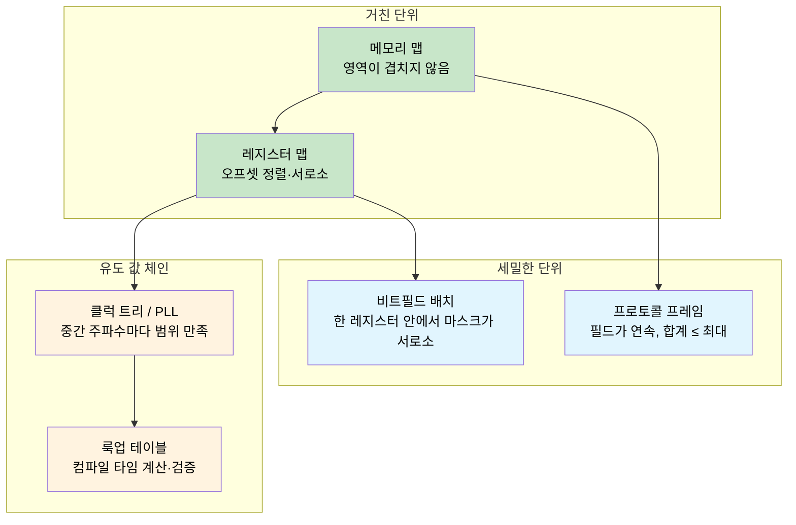
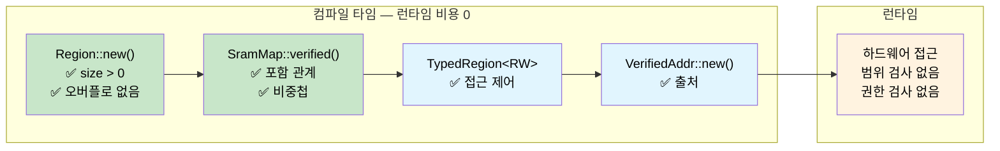

<a id="const-fn-compile-time-correctness-proofs"></a>
# Const Fn — 컴파일 타임 정확성 증명 🟠

> **배울 내용:** `const fn`과 `assert!`로 컴파일러를 증명 엔진으로 만드는 방법 — SRAM 메모리 맵, 레지스터 배치, 프로토콜 프레임, 비트필드 마스크, 클럭 트리, 룩업 테이블을 런타임 비용 없이 컴파일 타임에 검증합니다.
>
> **교차 참조:** [ch04](ch04-capability-tokens-zero-cost-proof-of-aut.md) (capability tokens), [ch06](ch06-dimensional-analysis-making-the-compiler.md) (dimensional analysis), [ch09](ch09-phantom-types-for-resource-tracking.md) (phantom types)

<a id="the-problem-memory-maps-that-lie"></a>
## 문제: 거짓말하는 메모리 맵

임베디드와 시스템 프로그래밍에서 메모리 맵은 모든 것의 기반입니다 — 부트로더, 펌웨어, 데이터 섹션, 스택이 어디에 있는지 정합니다. 경계를 한 번만 틀려도 두 하위 시스템이 조용히 서로를 망가뜨립니다. C에서는 이런 맵이 보통 구조적 관계가 없는 `#define` 상수입니다:

```c
/* STM32F4 SRAM 배치 — 0x20000000에 256 KB */
#define SRAM_BASE       0x20000000
#define SRAM_SIZE       (256 * 1024)

#define BOOT_BASE       0x20000000
#define BOOT_SIZE       (16 * 1024)

#define FW_BASE         0x20004000
#define FW_SIZE         (128 * 1024)

#define DATA_BASE       0x20024000
#define DATA_SIZE       (80 * 1024)     /* Someone bumped this from 64K to 80K */

#define STACK_BASE      0x20038000
#define STACK_SIZE      (48 * 1024)     /* 0x20038000 + 48K = 0x20044000 — SRAM 끝을 넘김! */
```

버그: `16 + 128 + 80 + 48 = 272 KB`인데 SRAM은 256 KB뿐입니다. 스택이 물리 메모리 끝을 16 KB 넘어 확장합니다. 컴파일러 경고도, 링커 에러도, 런타임 검사도 없습니다 — 스택이 매핑되지 않은 공간으로 자라면 조용히 손상만 일어납니다.

**모든 실패 모드는 배포 후에야 발견됩니다** — 데이터 섹션 크기를 바꾼 지 몇 주 뒤, 스택 사용이 무거울 때만 나타나는 수수께끼 같은 크래시일 수 있습니다.

<a id="const-fn-turning-the-compiler-into-a-proof-engine"></a>
## Const Fn: 컴파일러를 증명 엔진으로

Rust의 `const fn`은 컴파일 타임에 실행될 수 있습니다. `const fn`이 컴파일 타임 평가 중 패닉하면 그 패닉은 **컴파일 에러**가 됩니다. `assert!`와 결합하면 컴파일러가 불변식에 대한 정리 증명기처럼 동작합니다:

```rust
pub const fn checked_add(a: u32, b: u32) -> u32 {
    let sum = a as u64 + b as u64;
    assert!(sum <= u32::MAX as u64, "overflow");
    sum as u32
}

// ✅ Compiles — 100 + 200 fits in u32
const X: u32 = checked_add(100, 200);

// ❌ 컴파일 에러: "overflow"
// const Y: u32 = checked_add(u32::MAX, 1);

fn main() {
    println!("{X}");
}
```

> **핵심:** `const fn` + `assert!` = 증명 의무입니다. 각 단언은 컴파일러가 검증해야 하는 정리입니다. 증명이 실패하면 프로그램은 컴파일되지 않습니다. 테스트 스위트도, 코드 리뷰도 필요 없습니다 — 컴파일러 자체가 감사자입니다.

<a id="building-a-verified-sram-memory-map"></a>
## 검증된 SRAM 메모리 맵 만들기

<a id="the-region-type"></a>
### Region 타입

`Region`은 연속된 메모리 블록을 나타냅니다. 생성자는 기본적인 유효성을 강제하는 `const fn`입니다:

```rust
#[derive(Debug, Clone, Copy)]
pub struct Region {
    pub base: u32,
    pub size: u32,
}

impl Region {
    /// 영역 생성. 불변식이 깨지면 컴파일 타임에 패닉.
    pub const fn new(base: u32, size: u32) -> Self {
        assert!(size > 0, "region size must be non-zero");
        assert!(
            base as u64 + size as u64 <= u32::MAX as u64,
            "region overflows 32-bit address space"
        );
        Self { base, size }
    }

    pub const fn end(&self) -> u32 {
        self.base + self.size
    }

    /// `inner`가 `self` 안에 완전히 들어가면 참.
    pub const fn contains(&self, inner: &Region) -> bool {
        inner.base >= self.base && inner.end() <= self.end()
    }

    /// 두 영역이 주소를 공유하면 참.
    pub const fn overlaps(&self, other: &Region) -> bool {
        self.base < other.end() && other.base < self.end()
    }

    /// `addr`가 이 영역 안에 있으면 참.
    pub const fn contains_addr(&self, addr: u32) -> bool {
        addr >= self.base && addr < self.end()
    }
}

// 모든 Region은 태어날 때부터 유효 — 잘못된 Region은 만들 수 없음
const R: Region = Region::new(0x2000_0000, 1024);

fn main() {
    println!("Region: {:#010X}..{:#010X}", R.base, R.end());
}
```

<a id="the-verified-memory-map"></a>
### 검증된 메모리 맵

이제 영역들을 모아 전체 SRAM 맵을 구성합니다. 생성자는 겹침 없음 불변식 6개와 포함 관계 불변식 4개를 모두 컴파일 타임에 증명합니다:

```rust
# #[derive(Debug, Clone, Copy)]
# pub struct Region { pub base: u32, pub size: u32 }
# impl Region {
#     pub const fn new(base: u32, size: u32) -> Self {
#         assert!(size > 0, "region size must be non-zero");
#         assert!(base as u64 + size as u64 <= u32::MAX as u64, "overflow");
#         Self { base, size }
#     }
#     pub const fn end(&self) -> u32 { self.base + self.size }
#     pub const fn contains(&self, inner: &Region) -> bool {
#         inner.base >= self.base && inner.end() <= self.end()
#     }
#     pub const fn overlaps(&self, other: &Region) -> bool {
#         self.base < other.end() && other.base < self.end()
#     }
# }
pub struct SramMap {
    pub total:      Region,
    pub bootloader: Region,
    pub firmware:   Region,
    pub data:       Region,
    pub stack:      Region,
}

impl SramMap {
    pub const fn verified(
        total: Region,
        bootloader: Region,
        firmware: Region,
        data: Region,
        stack: Region,
    ) -> Self {
        // ── 포함: 모든 하위 영역이 전체 SRAM 안에 들어감 ──
        assert!(total.contains(&bootloader), "bootloader exceeds SRAM");
        assert!(total.contains(&firmware),   "firmware exceeds SRAM");
        assert!(total.contains(&data),       "data section exceeds SRAM");
        assert!(total.contains(&stack),      "stack exceeds SRAM");

        // ── 겹침 없음: 하위 영역 쌍이 주소를 공유하지 않음 ──
        assert!(!bootloader.overlaps(&firmware), "bootloader/firmware overlap");
        assert!(!bootloader.overlaps(&data),     "bootloader/data overlap");
        assert!(!bootloader.overlaps(&stack),    "bootloader/stack overlap");
        assert!(!firmware.overlaps(&data),       "firmware/data overlap");
        assert!(!firmware.overlaps(&stack),      "firmware/stack overlap");
        assert!(!data.overlaps(&stack),          "data/stack overlap");

        Self { total, bootloader, firmware, data, stack }
    }
}

// ✅ 10개 불변식 모두 컴파일 타임 검증 — 런타임 비용 0
const SRAM: SramMap = SramMap::verified(
    Region::new(0x2000_0000, 256 * 1024),   // 256 KB total SRAM
    Region::new(0x2000_0000,  16 * 1024),   // bootloader: 16 KB
    Region::new(0x2000_4000, 128 * 1024),   // firmware:  128 KB
    Region::new(0x2002_4000,  64 * 1024),   // data:       64 KB
    Region::new(0x2003_4000,  48 * 1024),   // stack:      48 KB
);

fn main() {
    println!("SRAM:  {:#010X} — {} KB", SRAM.total.base, SRAM.total.size / 1024);
    println!("Boot:  {:#010X} — {} KB", SRAM.bootloader.base, SRAM.bootloader.size / 1024);
    println!("FW:    {:#010X} — {} KB", SRAM.firmware.base, SRAM.firmware.size / 1024);
    println!("Data:  {:#010X} — {} KB", SRAM.data.base, SRAM.data.size / 1024);
    println!("Stack: {:#010X} — {} KB", SRAM.stack.base, SRAM.stack.size / 1024);
}
```

컴파일 타임 검사 10번, 런타임 명령 0개. 바이너리에는 검증된 상수만 들어갑니다.

<a id="breaking-the-map"></a>
### 맵을 깨뜨리기

누군가 데이터 섹션을 64 KB에서 80 KB로 늘리고 다른 것은 손대지 않았다고 해봅시다:

```rust,ignore
// ❌ Does not compile
const BAD_SRAM: SramMap = SramMap::verified(
    Region::new(0x2000_0000, 256 * 1024),
    Region::new(0x2000_0000,  16 * 1024),
    Region::new(0x2000_4000, 128 * 1024),
    Region::new(0x2002_4000,  80 * 1024),   // 80 KB — 16 KB too large
    Region::new(0x2003_8000,  48 * 1024),   // stack pushed past SRAM end
);
```

컴파일러가 보고합니다:

```text
error[E0080]: evaluation of constant value failed
  --> src/main.rs:38:9
   |
38 |         assert!(total.contains(&stack), "stack exceeds SRAM");
   |         ^^^^^^^^^^^^^^^^^^^^^^^^^^^^^^^^^^^^^^^^^^^^^^^^^^^^^
   |         the evaluated program panicked at 'stack exceeds SRAM'
```

> **현장에서 수수께끼 같은 고장이 나던 버그가 이제 컴파일 에러입니다.** 단위 테스트도, 코드 리뷰도 필요 없습니다 — 컴파일러가 불가능함을 증명합니다. C에서는 같은 버그가 조용히 배포되고 수 개월 뒤 스택 손상으로 드러납니다.

<a id="layering-access-control-with-phantom-types"></a>
## Phantom Type으로 접근 제어 얹기

`const fn` 검증과 팬텀 타입 접근 권한([ch09](ch09-phantom-types-for-resource-tracking.md))을 결합해 읽기/쓰기 제약을 타입 수준에서 강제합니다:

```rust
use std::marker::PhantomData;

pub struct ReadOnly;
pub struct ReadWrite;

pub struct TypedRegion<Access> {
    base: u32,
    size: u32,
    _access: PhantomData<Access>,
}

impl<A> TypedRegion<A> {
    pub const fn new(base: u32, size: u32) -> Self {
        assert!(size > 0, "region size must be non-zero");
        Self { base, size, _access: PhantomData }
    }
}

// 읽기는 모든 접근 수준에서 가능
fn read_word<A>(region: &TypedRegion<A>, offset: u32) -> u32 {
    assert!(offset + 4 <= region.size, "read out of bounds");
        // 실제 펌웨어: unsafe { core::ptr::read_volatile((region.base + offset) as *const u32) }
    0 // stub
}

// 쓰기는 ReadWrite 필요 — 함수 시그니처가 강제
fn write_word(region: &TypedRegion<ReadWrite>, offset: u32, value: u32) {
    assert!(offset + 4 <= region.size, "write out of bounds");
    // 실제 펌웨어: unsafe { core::ptr::write_volatile(...) }
    let _ = value; // stub
}

const BOOTLOADER: TypedRegion<ReadOnly>  = TypedRegion::new(0x2000_0000, 16 * 1024);
const DATA:       TypedRegion<ReadWrite> = TypedRegion::new(0x2002_4000, 64 * 1024);

fn main() {
    read_word(&BOOTLOADER, 0);      // ✅ 읽기 전용 영역에서 읽기
    read_word(&DATA, 0);            // ✅ 읽기·쓰기 영역에서 읽기
    write_word(&DATA, 0, 42);       // ✅ 읽기·쓰기 영역에 쓰기
    // write_word(&BOOTLOADER, 0, 42); // ❌ 컴파일 에러: ReadWrite 기대, ReadOnly 발견
}
```

부트로더 영역은 물리적으로는 쓸 수 있지만(SRAM) 타입 시스템이 실수로 쓰는 것을 막습니다. **하드웨어 능력**과 **소프트웨어 권한**의 구분이 바로 correct-by-construction의 의미입니다.

<a id="pointer-provenance-proving-addresses-belong-to-regions"></a>
## 포인터 출처: 주소가 영역에 속함을 증명하기

한 걸음 더 나아가, 특정 영역 안에 정적으로 증명된 주소 — 검증된 주소 값을 만들 수 있습니다:

```rust
# #[derive(Debug, Clone, Copy)]
# pub struct Region { pub base: u32, pub size: u32 }
# impl Region {
#     pub const fn new(base: u32, size: u32) -> Self {
#         assert!(size > 0);
#         assert!(base as u64 + size as u64 <= u32::MAX as u64);
#         Self { base, size }
#     }
#     pub const fn end(&self) -> u32 { self.base + self.size }
#     pub const fn contains_addr(&self, addr: u32) -> bool {
#         addr >= self.base && addr < self.end()
#     }
# }
/// 컴파일 타임에 Region 안에 있음이 증명된 주소.
pub struct VerifiedAddr {
    addr: u32, // 비공개 — 검사된 생성자로만 생성 가능
}

impl VerifiedAddr {
    /// `addr`가 `region` 밖이면 컴파일 타임에 패닉.
    pub const fn new(region: &Region, addr: u32) -> Self {
        assert!(region.contains_addr(addr), "address outside region");
        Self { addr }
    }

    pub const fn raw(&self) -> u32 {
        self.addr
    }
}

const DATA: Region = Region::new(0x2002_4000, 64 * 1024);

// ✅ 컴파일 타임에 데이터 영역 안에 있음이 증명됨
const STATUS_WORD: VerifiedAddr = VerifiedAddr::new(&DATA, 0x2002_4000);
const CONFIG_WORD: VerifiedAddr = VerifiedAddr::new(&DATA, 0x2002_5000);

// ❌ 컴파일 안 됨: 주소는 부트로더 영역에 있고 데이터가 아님
// const BAD_ADDR: VerifiedAddr = VerifiedAddr::new(&DATA, 0x2000_0000);

fn main() {
    println!("Status register at {:#010X}", STATUS_WORD.raw());
    println!("Config register at {:#010X}", CONFIG_WORD.raw());
}
```

**출처는 컴파일 타임에 확정** — 이 주소에 접근할 때 런타임 범위 검사가 필요 없습니다. 생성자는 비공개이므로 `VerifiedAddr`는 컴파일러가 유효함을 증명했을 때만 존재할 수 있습니다.

<a id="beyond-memory-maps"></a>
## 메모리 맵 너머

`const fn` 증명 패턴은 **구조적 불변식을 가진 컴파일 타임에 알려진 값**이 있는 곳이면 모두 적용됩니다. 위 SRAM 맵은 *영역 간* 성질(포함, 비중첩)을 증명했습니다. 같은 기법은 더 세밀한 영역으로 확장됩니다:



아래 각 소절은 같은 패턴을 따릅니다: 불변식을 인코딩하는 `const fn` 생성자가 있는 타입을 정의하고, `const _: () = { ... }` 또는 `const` 바인딩으로 검증을 트리거합니다.

<a id="register-maps"></a>
### 레지스터 맵

하드웨어 레지스터 블록은 고정된 오프셋과 폭을 가집니다. 정렬이 깨지거나 겹치는 레지스터 정의는 항상 버그입니다:

```rust
#[derive(Debug, Clone, Copy)]
pub struct Register {
    pub offset: u32,
    pub width: u32,
}

impl Register {
    pub const fn new(offset: u32, width: u32) -> Self {
        assert!(
            width == 1 || width == 2 || width == 4,
            "register width must be 1, 2, or 4 bytes"
        );
        assert!(offset % width == 0, "register must be naturally aligned");
        Self { offset, width }
    }

    pub const fn end(&self) -> u32 {
        self.offset + self.width
    }
}

const fn disjoint(a: &Register, b: &Register) -> bool {
    a.end() <= b.offset || b.end() <= a.offset
}

// UART 주변 레지스터
const DATA:   Register = Register::new(0x00, 4);
const STATUS: Register = Register::new(0x04, 4);
const CTRL:   Register = Register::new(0x08, 4);
const BAUD:   Register = Register::new(0x0C, 4);

// 컴파일 타임 증명: 레지스터끼리 겹치지 않음
const _: () = {
    assert!(disjoint(&DATA,   &STATUS));
    assert!(disjoint(&DATA,   &CTRL));
    assert!(disjoint(&DATA,   &BAUD));
    assert!(disjoint(&STATUS, &CTRL));
    assert!(disjoint(&STATUS, &BAUD));
    assert!(disjoint(&CTRL,   &BAUD));
};

fn main() {
    println!("UART DATA:   offset={:#04X}, width={}", DATA.offset, DATA.width);
    println!("UART STATUS: offset={:#04X}, width={}", STATUS.offset, STATUS.width);
}
```

`const _: () = { ... };` 관용구를 참고하세요 — 이름 없는 상수로, 컴파일 타임 단언만 실행하는 것이 목적입니다. 단언이 하나라도 실패하면 상수를 평가할 수 없고 컴파일이 멈춥니다.

<a id="mini-exercise-spi-register-bank"></a>
#### 미니 연습: SPI 레지스터 뱅크

다음 SPI 컨트롤러 레지스터가 주어졌을 때, const fn 단언으로 다음을 증명하세요:
1. 모든 레지스터가 자연 정렬(offset % width == 0)
2. 두 레지스터가 겹치지 않음
3. 모든 레지스터가 64바이트 레지스터 블록 안에 들어감

<details>
<summary>힌트</summary>

위 UART 예제의 `Register`와 `disjoint` 함수를 재사용하세요. `const Register` 값을 세 개 또는 네 개 정의합니다(예: `CTRL` 오프셋 0x00 폭 4, `STATUS` 0x04 폭 4, `TX_DATA` 0x08 폭 1, `RX_DATA` 0x0C 폭 1) 세 가지 성질을 단언합니다.

</details>

<a id="protocol-frame-layouts"></a>
### 프로토콜 프레임 배치

네트워크나 버스 프로토콜 프레임은 특정 오프셋에 필드를 둡니다. `then()` 메서드가 연속성을 구조적으로 만듭니다 — 간격이나 겹침은 생성 규칙상 불가능합니다:

```rust
#[derive(Debug, Clone, Copy)]
pub struct Field {
    pub offset: usize,
    pub size: usize,
}

impl Field {
    pub const fn new(offset: usize, size: usize) -> Self {
        assert!(size > 0, "field size must be non-zero");
        Self { offset, size }
    }

    pub const fn end(&self) -> usize {
        self.offset + self.size
    }

    /// 바로 다음에 오는 필드 생성.
    pub const fn then(&self, size: usize) -> Field {
        Field::new(self.end(), size)
    }
}

const MAX_FRAME: usize = 256;

const HEADER:  Field = Field::new(0, 4);
const SEQ_NUM: Field = HEADER.then(2);
const PAYLOAD: Field = SEQ_NUM.then(246);
const CRC:     Field = PAYLOAD.then(4);

// 컴파일 타임 증명: 프레임이 최대 크기 이내
const _: () = assert!(CRC.end() <= MAX_FRAME, "frame exceeds maximum size");

fn main() {
    println!("Header:  [{}..{})", HEADER.offset, HEADER.end());
    println!("SeqNum:  [{}..{})", SEQ_NUM.offset, SEQ_NUM.end());
    println!("Payload: [{}..{})", PAYLOAD.offset, PAYLOAD.end());
    println!("CRC:     [{}..{})", CRC.offset, CRC.end());
    println!("Total:   {}/{} bytes", CRC.end(), MAX_FRAME);
}
```

필드는 생성 규칙상 연속입니다 — 각각은 이전 필드가 끝나는 곳에서 정확히 시작합니다. 마지막 단언은 프레임이 프로토콜 최대 크기 안에 들어감을 증명합니다.

<a id="inline-const-blocks-for-generic-validation"></a>
### 제네릭 검증을 위한 인라인 const 블록

Rust 1.79부터 `const { ... }` 블록으로 사용 지점에서 const 제네릭 매개변수를 검증할 수 있습니다 — DMA 버퍼 크기 제약이나 정렬 요구에 적합합니다:

```rust,ignore
fn dma_transfer<const N: usize>(buf: &[u8; N]) {
    const { assert!(N % 4 == 0, "DMA buffer must be 4-byte aligned in size") };
    const { assert!(N <= 65536, "DMA transfer exceeds maximum size") };
    // ... 전송 시작 ...
}

dma_transfer(&[0u8; 1024]);   // ✅ 1024 is divisible by 4 and ≤ 65536
// dma_transfer(&[0u8; 1023]); // ❌ Compile error: not 4-byte aligned
```

단언은 함수가 단일화(monomorphize)될 때 평가됩니다 — `N`이 다른 호출 지점마다 별도의 컴파일 타임 검사가 붙습니다.

<a id="bitfield-layouts-within-a-register"></a>
### 한 레지스터 안의 비트필드 배치

레지스터 맵은 레지스터끼리 *서로 겹치지 않음*을 증명합니다 — 그런데 **한 레지스터 안의 비트**는 어떨까요? 제어 레지스터는 한 워드에 여러 필드를 넣습니다. 두 필드가 비트 위치를 공유하면 읽기와 쓰기가 조용히 서로를 망칩니다. C에서는 보통 마스크 상수를 수동 검토로(또는 못 잡고) 넘깁니다.

`const fn`은 같은 레지스터 안에서 모든 필드의 마스크/시프트 쌍이 서로소임을 증명할 수 있습니다:

```rust
#[derive(Debug, Clone, Copy)]
pub struct BitField {
    pub mask: u32,
    pub shift: u8,
}

impl BitField {
    pub const fn new(shift: u8, width: u8) -> Self {
        assert!(width > 0, "bit field width must be non-zero");
        assert!(shift as u32 + width as u32 <= 32, "bit field exceeds 32-bit register");
        // 마스크 생성: 비트 `shift`부터 `width`개의 1
        let mask = ((1u64 << width as u64) - 1) as u32;
        Self { mask: mask << shift as u32, shift }
    }

    pub const fn positioned_mask(&self) -> u32 {
        self.mask
    }

    pub const fn encode(&self, value: u32) -> u32 {
        assert!(value & !( self.mask >> self.shift as u32 ) == 0, "value exceeds field width");
        value << self.shift as u32
    }
}

const fn fields_disjoint(a: &BitField, b: &BitField) -> bool {
    a.positioned_mask() & b.positioned_mask() == 0
}

// SPI 제어 레지스터 필드: enable[0], mode[1:2], clock_div[4:7], irq_en[8]
const SPI_EN:     BitField = BitField::new(0, 1);   // bit 0
const SPI_MODE:   BitField = BitField::new(1, 2);   // bits 1–2
const SPI_CLKDIV: BitField = BitField::new(4, 4);   // bits 4–7
const SPI_IRQ:    BitField = BitField::new(8, 1);   // bit 8

// 컴파일 타임 증명: 필드가 비트 위치를 공유하지 않음
const _: () = {
    assert!(fields_disjoint(&SPI_EN,   &SPI_MODE));
    assert!(fields_disjoint(&SPI_EN,   &SPI_CLKDIV));
    assert!(fields_disjoint(&SPI_EN,   &SPI_IRQ));
    assert!(fields_disjoint(&SPI_MODE, &SPI_CLKDIV));
    assert!(fields_disjoint(&SPI_MODE, &SPI_IRQ));
    assert!(fields_disjoint(&SPI_CLKDIV, &SPI_IRQ));
};

fn main() {
    let ctrl = SPI_EN.encode(1)
             | SPI_MODE.encode(0b10)
             | SPI_CLKDIV.encode(0b0110)
             | SPI_IRQ.encode(1);
    println!("SPI_CTRL = {:#010b} ({:#06X})", ctrl, ctrl);
}
```

위 레지스터 맵 패턴을 보완합니다 — 레지스터 맵은 *레지스터 간* 서로소를, 비트필드 배치는 *레지스터 내부* 서로소를 증명합니다. 함께 쓰면 레지스터 블록부터 개별 비트까지 전체를 덮습니다.

<a id="clock-tree-pll-configuration"></a>
### 클럭 트리 / PLL 설정

마이크로컨트롤러는 승수/분주 체인으로 주변 클럭을 냅니다. PLL은 `f_vco = f_in × N / M`을 만들고, VCO 주파수는 하드웨어가 정한 범위 안에 있어야 합니다. 보드에 맞는 매개변수를 하나 틀리면 칩이 엉망인 클럭을 내거나 잠금에 실패합니다. 이런 제약은 `const fn`에 잘 맞습니다:

```rust
#[derive(Debug, Clone, Copy)]
pub struct PllConfig {
    pub input_khz: u32,     // external oscillator
    pub m: u32,             // input divider
    pub n: u32,             // VCO multiplier
    pub p: u32,             // system clock divider
}

impl PllConfig {
    pub const fn verified(input_khz: u32, m: u32, n: u32, p: u32) -> Self {
        // 입력 분주기가 PLL 입력 주파수를 만듦
        let pll_input = input_khz / m;
        assert!(pll_input >= 1_000 && pll_input <= 2_000,
            "PLL input must be 1–2 MHz");

        // VCO 주파수는 하드웨어 한계 안에 있어야 함
        let vco = pll_input as u64 * n as u64;
        assert!(vco >= 192_000 && vco <= 432_000,
            "VCO must be 192–432 MHz");

        // 시스템 클럭 분주는 짝수여야 함(하드웨어 제약)
        assert!(p == 2 || p == 4 || p == 6 || p == 8,
            "P must be 2, 4, 6, or 8");

        // 최종 시스템 클럭
        let sysclk = vco / p as u64;
        assert!(sysclk <= 168_000,
            "system clock exceeds 168 MHz maximum");

        Self { input_khz, m, n, p }
    }

    pub const fn vco_khz(&self) -> u32 {
        (self.input_khz / self.m) * self.n
    }

    pub const fn sysclk_khz(&self) -> u32 {
        self.vco_khz() / self.p
    }
}

// STM32F4, 8 MHz HSE 크리스탈 → 168 MHz 시스템 클럭
const PLL: PllConfig = PllConfig::verified(8_000, 8, 336, 2);

// ❌ 컴파일 안 됨: VCO = 480 MHz가 432 MHz 한도 초과
// const BAD: PllConfig = PllConfig::verified(8_000, 8, 480, 2);

fn main() {
    println!("VCO:    {} MHz", PLL.vco_khz() / 1_000);
    println!("SYSCLK: {} MHz", PLL.sysclk_khz() / 1_000);
}
```

`BAD` 상수의 주석을 풀면 위반된 제약을 집어주는 컴파일 타임 에러가 납니다:

```text
error[E0080]: evaluation of constant value failed
  --> src/main.rs:18:9
   |
18 |         assert!(vco >= 192_000 && vco <= 432_000,
   |         ^^^^^^^^^^^^^^^^^^^^^^^^^^^^^^^^^^^^^^^^^
   |         the evaluated program panicked at 'VCO must be 192–432 MHz'
```

컴파일러는 유도 체인 *중간*에서 제약 위반을 잡아냅니다 — 끝에서만이 아닙니다. 대신 시스템 클럭 한도(`sysclk > 168 MHz`)를 위반했다면 에러 메시지가 그 단언을 가리킵니다.

> **유도 값 제약 체인이 하나의 `const fn`을 다단계 증명으로 만듭니다.** 중간값마다 하드웨어가 요구하는 범위가 있습니다. 매개변수 하나를 바꾸면(예: 25 MHz 크리스탈로 교체) 하류 위반이 바로 드러납니다.

**유도 값 제약 체인** — VCO 주파수는 `input / m × n`에, 시스템 클럭은 `vco / p`에 의존합니다. 중간값마다 하드웨어가 정한 범위가 있습니다. 하나의 `const fn`이 전체 체인을 검증하므로 매개변수를 바꾸면(예: 25 MHz 크리스탈) 하류 위반이 즉시 드러납니다.

<a id="compile-time-lookup-tables"></a>
### 컴파일 타임 룩업 테이블

`const fn`은 전체 룩업 테이블을 컴파일 타임에 계산해 `.rodata`에 넣을 수 있으며 시작 비용이 0입니다. CRC 테이블, 삼각함수, 인코딩 맵, 오류 정정 코드 — 보통 빌드 스크립트나 코드 생성을 쓰는 곳에 특히 유용합니다:

```rust
const fn crc32_table() -> [u32; 256] {
    let mut table = [0u32; 256];
    let mut i: usize = 0;
    while i < 256 {
        let mut crc = i as u32;
        let mut j = 0;
        while j < 8 {
            if crc & 1 != 0 {
                crc = (crc >> 1) ^ 0xEDB8_8320; // 표준 CRC-32 다항식
            } else {
                crc >>= 1;
            }
            j += 1;
        }
        table[i] = crc;
        i += 1;
    }
    table
}

/// 전체 CRC-32 테이블 — 컴파일 타임 계산, .rodata에 배치
const CRC32_TABLE: [u32; 256] = crc32_table();

/// 미리 계산된 테이블로 런타임에 바이트 슬라이스에 대한 CRC-32 계산.
fn crc32(data: &[u8]) -> u32 {
    let mut crc: u32 = !0;
    for &byte in data {
        let index = ((crc ^ byte as u32) & 0xFF) as usize;
        crc = (crc >> 8) ^ CRC32_TABLE[index];
    }
    !crc
}

// 스모크 테스트: "123456789"의 잘 알려진 CRC-32
const _: () = {
    // 컴파일 타임에 테이블 항목 하나 검증
    assert!(CRC32_TABLE[0] == 0x0000_0000);
    assert!(CRC32_TABLE[1] == 0x7707_3096);
};

fn main() {
    let check = crc32(b"123456789");
    // "123456789"의 알려진 CRC-32는 0xCBF43926
    assert_eq!(check, 0xCBF4_3926);
    println!("CRC-32 of '123456789' = {:#010X} ✓", check);
    println!("Table size: {} entries × 4 bytes = {} bytes in .rodata",
        CRC32_TABLE.len(), CRC32_TABLE.len() * 4);
}
```

`crc32_table()` 함수는 컴파일 중에만 전부 실행됩니다. 결과 1 KB 테이블은 바이너리의 읽기 전용 데이터에 박힙니다 — 할당자도, 초기화 코드도, 시작 비용도 없습니다. 코드 생성기를 쓰거나 시작 시 테이블을 계산하는 C 방식과 비교해 보세요. Rust 버전은 (`const _` 단언으로 알려진 값을 검증해) 증명 가능하게 맞고, (함수가 유효한 테이블을 못 만들면 컴파일러가 프로그램을 거부하므로) 증명 가능하게 완전합니다.

<a id="when-to-use-const-fn-proofs"></a>
## Const Fn 증명을 언제 쓸까

| 시나리오 | 권장 |
|----------|:---:|
| 메모리 맵, 레지스터 오프셋, 파티션 테이블 | ✅ 항상 |
| 고정 필드가 있는 프로토콜 프레임 배치 | ✅ 항상 |
| 한 레지스터 안의 비트필드 마스크 | ✅ 항상 |
| 클럭 트리 / PLL 매개변수 체인 | ✅ 항상 |
| 룩업 테이블(CRC, 삼각함수, 인코딩) | ✅ 항상 — 시작 비용 0 |
| 교차 값 불변식이 있는 상수(비중첩, 합 ≤ 상한) | ✅ 항상 |
| 도메인 제약이 있는 설정 값 | ✅ 값이 컴파일 타임에 알려질 때 |
| 사용자 입력이나 파일에서 계산된 값 | ❌ 런타임 검증 사용 |
| 동적 구조가 큰 경우(트리, 그래프) | ❌ 프로퍼티 기반 테스트 사용 |
| 단일 값 범위 검사 | ⚠️  대신 newtype + `From` 고려 ([ch07](ch07-validated-boundaries-parse-dont-validate.md)) |

<a id="cost-summary"></a>
### 비용 요약

| 항목 | 런타임 비용 |
|------|:------:|
| `const fn` 단언(`assert!`, `panic!`) | 컴파일 타임만 — 명령 0개 |
| `const _: () = { ... }` 검증 블록 | 컴파일 타임만 — 바이너리에 없음 |
| `Region`, `Register`, `Field` 구조체 | 순수 데이터 — 원시 정수와 같은 레이아웃 |
| 인라인 `const { }` 제네릭 검증 | 컴파일 타임에 단일화 — 비용 0 |
| 룩업 테이블(`crc32_table()`) | 컴파일 타임 계산 — `.rodata`에 배치 |
| 팬텀 타입 접근 마커(`TypedRegion<RW>`) | 0 크기 — 최적화로 제거 |

모든 행이 **런타임 비용 0** — 증명은 컴파일 중에만 존재합니다. 결과 바이너리에는 검증된 상수와 룩업 테이블만 들어가며 단언 검사 코드는 없습니다.

<a id="exercise-flash-partition-map"></a>
## 연습: 플래시 파티션 맵

`0x0800_0000`부터 시작하는 1 MB NOR 플래시에 대한 검증된 플래시 파티션 맵을 설계하세요. 요구사항:

1. 네 파티션: **bootloader** (64 KB), **application** (640 KB), **config** (64 KB), **OTA staging** (256 KB)
2. 모든 파티션은 **4 KB 정렬**(플래시 지우기 단위): base와 size 모두 4096의 배수
3. 파티션끼리 겹치면 안 됨
4. 모든 파티션이 플래시 안에 들어가야 함
5. 모든 파티션 크기의 합을 반환하는 `const fn total_used()`를 추가하고 합이 1 MB와 같음을 단언

<details>
<summary>해답</summary>

```rust
#[derive(Debug, Clone, Copy)]
pub struct FlashRegion {
    pub base: u32,
    pub size: u32,
}

impl FlashRegion {
    pub const fn new(base: u32, size: u32) -> Self {
        assert!(size > 0, "partition size must be non-zero");
        assert!(base % 4096 == 0, "partition base must be 4 KB aligned");
        assert!(size % 4096 == 0, "partition size must be 4 KB aligned");
        assert!(
            base as u64 + size as u64 <= u32::MAX as u64,
            "partition overflows address space"
        );
        Self { base, size }
    }

    pub const fn end(&self) -> u32 { self.base + self.size }

    pub const fn contains(&self, inner: &FlashRegion) -> bool {
        inner.base >= self.base && inner.end() <= self.end()
    }

    pub const fn overlaps(&self, other: &FlashRegion) -> bool {
        self.base < other.end() && other.base < self.end()
    }
}

pub struct FlashMap {
    pub total:  FlashRegion,
    pub boot:   FlashRegion,
    pub app:    FlashRegion,
    pub config: FlashRegion,
    pub ota:    FlashRegion,
}

impl FlashMap {
    pub const fn verified(
        total: FlashRegion,
        boot: FlashRegion,
        app: FlashRegion,
        config: FlashRegion,
        ota: FlashRegion,
    ) -> Self {
        assert!(total.contains(&boot),   "bootloader exceeds flash");
        assert!(total.contains(&app),    "application exceeds flash");
        assert!(total.contains(&config), "config exceeds flash");
        assert!(total.contains(&ota),    "OTA staging exceeds flash");

        assert!(!boot.overlaps(&app),    "boot/app overlap");
        assert!(!boot.overlaps(&config), "boot/config overlap");
        assert!(!boot.overlaps(&ota),    "boot/ota overlap");
        assert!(!app.overlaps(&config),  "app/config overlap");
        assert!(!app.overlaps(&ota),     "app/ota overlap");
        assert!(!config.overlaps(&ota),  "config/ota overlap");

        Self { total, boot, app, config, ota }
    }

    pub const fn total_used(&self) -> u32 {
        self.boot.size + self.app.size + self.config.size + self.ota.size
    }
}

const FLASH: FlashMap = FlashMap::verified(
    FlashRegion::new(0x0800_0000, 1024 * 1024),  // 1 MB total
    FlashRegion::new(0x0800_0000,   64 * 1024),   // bootloader: 64 KB
    FlashRegion::new(0x0801_0000,  640 * 1024),   // application: 640 KB
    FlashRegion::new(0x080B_0000,   64 * 1024),   // config: 64 KB
    FlashRegion::new(0x080C_0000,  256 * 1024),   // OTA staging: 256 KB
);

// 플래시의 모든 바이트가 집계됨
const _: () = assert!(
    FLASH.total_used() == 1024 * 1024,
    "partitions must exactly fill flash"
);

fn main() {
    println!("Flash map: {} KB used / {} KB total",
        FLASH.total_used() / 1024,
        FLASH.total.size / 1024);
}
```

</details>



<a id="key-takeaways-ch15"></a>
## 핵심 정리

1. **`const fn` + `assert!` = 컴파일 타임 증명 의무** — const 평가 중 단언이 실패하면 프로그램은 컴파일되지 않습니다. 테스트도, 코드 리뷰도 필요 없습니다 — 컴파일러가 증명합니다.

2. **메모리 맵은 이상적인 후보** — 하위 영역 포함, 겹침 없음, 전체 크기 상한, 정렬 제약은 모두 const fn 단언으로 표현할 수 있습니다. C의 `#define` 방식은 이런 보장을 주지 않습니다.

3. **Phantom type은 위에 얹습니다** — const fn(값 검증)과 팬텀 타입 접근 마커(권한 검증)를 결합해 런타임 비용 없이 심층 방어를 합니다.

4. **출처는 컴파일 타임에 확정할 수 있음** — `VerifiedAddr`는 주소가 특정 영역에 속함을 컴파일 타임에 증명합니다. 매 접근마다 런타임 범위 검사가 필요 없습니다.

5. **패턴은 메모리를 넘어 일반화됩니다** — 레지스터 맵, 비트필드 마스크, 프로토콜 프레임, 클럭 트리, DMA 매개변수 — 구조적 불변식을 가진 컴파일 타임에 알려진 값이 있는 곳이면 어디에나.

6. **비트필드와 클럭 트리는 이상적인 후보** — 레지스터 내부 비트 서로소와 유도 값 제약 체인(VCO 범위, 분주기 한도)은 `const fn`이 수월하게 증명하는 불변식입니다.

7. **룩업 테이블에는 `const fn`이 코드 생성기·빌드 스크립트를 대체** — CRC 테이블, 삼각함수, 인코딩 맵 — 컴파일 타임에 계산해 `.rodata`에 넣고, 시작 비용 0, 외부 도구 없음.

8. **인라인 `const { }` 블록이 제네릭 매개변수를 검증** — Rust 1.79부터 호출 지점에서 const 제네릭에 제약을 걸어, 코드가 돌기 전에 오용을 잡을 수 있습니다.
