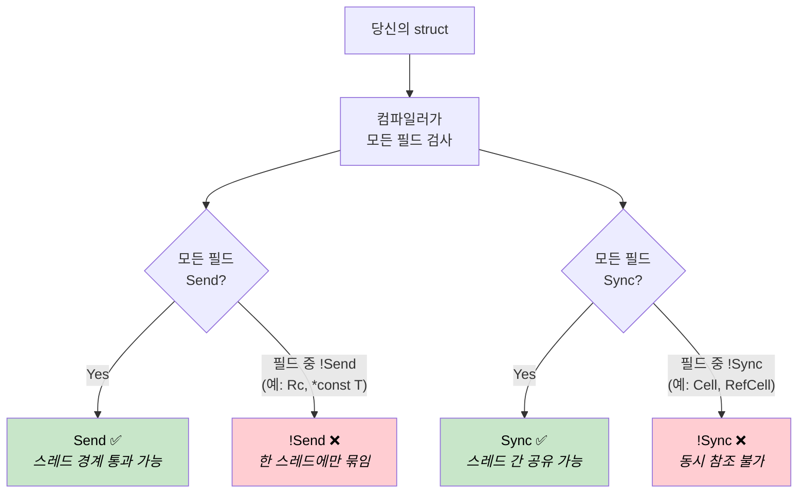
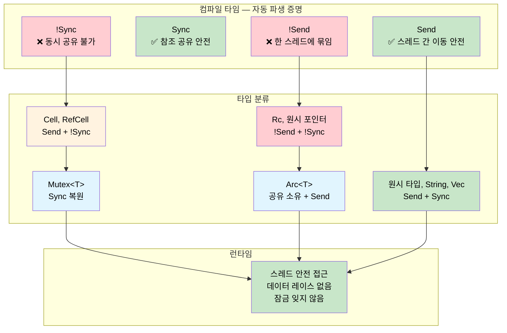

<a id="send-sync-compile-time-concurrency-proofs"></a>
# Send & Sync — 컴파일 타임 동시성 증명 🟠

> **배울 내용:** Rust의 `Send`와 `Sync` 자동 트레잇이 컴파일러를 동시성 감사자로 만드는 방법 — 어떤 타입이 스레드 경계를 넘을 수 있고 어떤 타입이 공유될 수 있는지 컴파일 타임에 증명하며 런타임 비용은 0입니다.
>
> **교차 참조:** [ch04](ch04-capability-tokens-zero-cost-proof-of-aut.md) (capability tokens), [ch09](ch09-phantom-types-for-resource-tracking.md) (phantom types), [ch15](ch15-const-fn-compile-time-correctness-proofs.md) (const fn proofs)

<a id="the-problem-concurrent-access-without-a-safety-net"></a>
## 문제: 안전망 없는 동시 접근

시스템 프로그래밍에서 주변 장치, 공유 버퍼, 전역 상태는 메인 루프, 인터럽트 핸들러, DMA 콜백, 워커 스레드 등 여러 맥락에서 접근됩니다. C에서는 컴파일러가 아무 강제도 하지 않습니다:

```c
/* 공유 센서 버퍼 — 메인 루프와 ISR에서 접근 */
volatile uint32_t sensor_buf[64];
volatile uint32_t buf_index = 0;

void SENSOR_IRQHandler(void) {
    sensor_buf[buf_index++] = read_sensor();  /* 레이스: buf_index 읽기+쓰기 */
}

void process_sensors(void) {
    for (uint32_t i = 0; i < buf_index; i++) {  /* 루프 도중 buf_index 변경 */
        process(sensor_buf[i]);                   /* 읽는 도중 데이터 덮어씀 */
    }
    buf_index = 0;                                /* 이 사이에 ISR 발생 */
}
```

`volatile`은 컴파일러가 읽기를 최적화로 없애지 못하게 할 뿐, 데이터 레이스에는 **아무것도** 하지 않습니다. 두 맥락이 동시에 `buf_index`를 읽고 쓰면 찢어진 값, 유실된 갱신, 버퍼 오버런이 납니다. `pthread_mutex_t`에서도 같은 문제가 납니다 — 컴파일러는 잠그는 것을 잊어도 그대로 둡니다:

```c
pthread_mutex_t lock;
int shared_counter;

void increment(void) {
    shared_counter++;  /* 이런 — pthread_mutex_lock(&lock) 잊음 */
}
```

**동시성 버그는 모두 런타임에서 발견됩니다** — 보통 부하가 걸린 프로덕션에서, 간헐적으로.

<a id="what-send-and-sync-prove"></a>
## Send와 Sync가 증명하는 것

Rust는 컴파일러가 자동으로 파생하는 마커 트레잇 두 개를 정의합니다:

| 트레잇 | 증명 | 비공식 의미 |
|-------|-------|-------------------|
| `Send` | 타입 `T` 값을 다른 스레드로 **이동**해도 안전함 | "스레드 경계를 넘을 수 있음" |
| `Sync` | **공유 참조** `&T`를 여러 스레드가 안전하게 사용할 수 있음 | "여러 스레드에서 읽을 수 있음" |

이들은 **자동 트레잇** — 컴파일러가 모든 필드를 살펴 파생합니다. 구조체는 모든 필드가 `Send`이면 `Send`이고, 모든 필드가 `Sync`이면 `Sync`입니다. 필드 하나라도 빠지면 전체가 빠집니다. 어노테이션 불필요, 런타임 오버헤드 없음 — 증명은 구조적입니다.



> **컴파일러가 감사자입니다.** C에서는 스레드 안전 주석이 주석과 헤더 문서에만 있고 — 권고일 뿐 강제되지 않습니다. Rust에서는 `Send`와 `Sync`가 타입 자체의 구조에서 파생됩니다. `Cell<f32>` 필드 하나만 추가해도 담는 구조체는 자동으로 `!Sync`가 됩니다. 프로그래머가 할 일이 없고, 잊을 방법도 없습니다.

두 트레잇은 핵심 동치식으로 연결됩니다:

> **`T`가 `Sync`인 것은 `&T`가 `Send`인 것과 필요충분조건이다.**

직관적으로도 맞습니다: 공유 참조를 다른 스레드로 안전하게 보낼 수 있으면, 기저 타입은 동시 읽기에 안전합니다.

<a id="types-that-opt-out"></a>
### 빠지는 타입

일부 타입은 의도적으로 `!Send`이거나 `!Sync`입니다:

| 타입 | Send | Sync | 이유 |
|------|:----:|:----:|-----|
| `u32`, `String`, `Vec<T>` | ✅ | ✅ | 내부 가변성 없음, 원시 포인터 없음 |
| `Cell<T>`, `RefCell<T>` | ✅ | ❌ | 동기화 없는 내부 가변성 |
| `Rc<T>` | ❌ | ❌ | 참조 카운트가 원자적이 아님 |
| `*const T`, `*mut T` | ❌ | ❌ | 원시 포인터는 안전 보장 없음 |
| `Arc<T>` (`T: Send + Sync`일 때) | ✅ | ✅ | 원자적 참조 카운트 |
| `Mutex<T>` (`T: Send`일 때) | ✅ | ✅ | 락이 모든 접근을 직렬화 |

표의 모든 ❌는 **컴파일 타임 불변식**입니다. 실수로 `Rc`를 다른 스레드로 보낼 수 없습니다 — 컴파일러가 거부합니다.

<a id="send-peripheral-handles"></a>
## !Send 주변 장치 핸들

임베디드 시스템에서 주변 레지스터 블록은 고정 메모리 주소에 있으며 단일 실행 맥락에서만 접근해야 합니다. 원시 포인터는 본질적으로 `!Send`이고 `!Sync`이므로, 하나를 감싸면 담는 타입이 두 트레잇 모두에서 자동으로 빠집니다:

```rust
/// A handle to a memory-mapped UART peripheral.
/// The raw pointer makes this automatically !Send and !Sync.
pub struct Uart {
    regs: *const u32,
}

impl Uart {
    pub fn new(base: usize) -> Self {
        Self { regs: base as *const u32 }
    }

    pub fn write_byte(&self, byte: u8) {
        // 실제 펌웨어: unsafe { write_volatile(self.regs.add(DATA_OFFSET), byte as u32) }
        println!("UART TX: {:#04X}", byte);
    }
}

fn main() {
    let uart = Uart::new(0x4000_1000);
    uart.write_byte(b'A');  // ✅ 생성한 스레드에서 사용

    // ❌ 컴파일 안 됨: Uart는 !Send
    // std::thread::spawn(move || {
    //     uart.write_byte(b'B');
    // });
}
```

주석 처리된 `thread::spawn`은 다음을 낳습니다:

```text
error[E0277]: `*const u32` cannot be sent between threads safely
   |
   |     std::thread::spawn(move || {
   |     ^^^^^^^^^^^^^^^^^^ within `Uart`, the trait `Send` is not
   |                        implemented for `*const u32`
```

**원시 포인터가 없나요? `PhantomData`를 쓰세요.** 타입에 원시 포인터가 없어도 한 스레드에만 묶여야 할 때가 있습니다 — 예: 파일 디스크립터 인덱스나 C 라이브러리에서 받은 핸들:

```rust
use std::marker::PhantomData;

/// C 라이브러리의 불투명 핸들. PhantomData<*const ()>로
/// 내부 fd가 그냥 정수여도 !Send + !Sync가 됨.
pub struct LibHandle {
    fd: i32,
    _not_send: PhantomData<*const ()>,
}

impl LibHandle {
    pub fn open(path: &str) -> Self {
        let _ = path;
        Self { fd: 42, _not_send: PhantomData }
    }

    pub fn fd(&self) -> i32 { self.fd }
}

fn main() {
    let handle = LibHandle::open("/dev/sensor0");
    println!("fd = {}", handle.fd());

    // ❌ 컴파일 안 됨: LibHandle은 !Send
    // std::thread::spawn(move || { let _ = handle.fd(); });
}
```

이것이 C의 "이 핸들은 스레드 안전하지 않다는 문서를 읽으세요"의 컴파일 타임 대응입니다. Rust에서는 컴파일러가 강제합니다.

<a id="mutex-transforms-notsync-into-sync"></a>
## Mutex가 !Sync를 Sync로

`Cell<T>`와 `RefCell<T>`는 동기화 없이 내부 가변성을 제공하므로 `!Sync`입니다. 그러나 가끔은 스레드 간 가변 상태를 정말로 공유해야 합니다. `Mutex<T>`가 빠진 동기화를 더하고, 컴파일러는 이를 인식합니다:

> **`T: Send`이면 `Mutex<T>: Send + Sync`이다.**

락이 모든 접근을 직렬화하므로 내부의 `!Sync` 타입도 공유해도 안전해집니다. 컴파일러가 구조적으로 증명합니다 — "프로그래머가 잠그는 것을 기억했는지" 런타임 검사는 없습니다:

```rust
use std::sync::{Arc, Mutex};
use std::cell::Cell;

/// Cell로 내부 가변성을 쓰는 센서 캐시.
/// Cell<u32>는 !Sync — 스레드 간에 직접 공유 불가.
struct SensorCache {
    last_reading: Cell<u32>,
    reading_count: Cell<u32>,
}

fn main() {
    // Mutex가 SensorCache 공유를 안전하게 — 컴파일러가 증명
    let cache = Arc::new(Mutex::new(SensorCache {
        last_reading: Cell::new(0),
        reading_count: Cell::new(0),
    }));

    let handles: Vec<_> = (0..4).map(|i| {
        let c = Arc::clone(&cache);
        std::thread::spawn(move || {
            let guard = c.lock().unwrap();  // 접근 전에 잠금
            guard.last_reading.set(i * 10);
            guard.reading_count.set(guard.reading_count.get() + 1);
        })
    }).collect();

    for h in handles { h.join().unwrap(); }

    let guard = cache.lock().unwrap();
    println!("Last reading: {}", guard.last_reading.get());
    println!("Total reads:  {}", guard.reading_count.get());
}
```

C 버전과 비교: `pthread_mutex_lock`은 프로그래머가 잊을 수 있는 런타임 호출입니다. 여기서는 타입 시스템이 `Mutex` 없이 `SensorCache`에 접근하는 것을 불가능하게 합니다. 증명은 구조적입니다 — 런타임 비용은 락 자체뿐입니다.

> **`Mutex`는 동기화만 하는 것이 아니라 동기화를 증명합니다.** `Mutex::lock()`은 `MutexGuard`를 반환하고 `Deref`로 `&T`가 됩니다. 락을 거치지 않고 내부 데이터에 대한 참조를 얻을 방법이 없습니다. API가 "잠금을 잊음"을 구조적으로 표현할 수 없게 만듭니다.

<a id="function-bounds-as-theorems"></a>
## 함수 바운드는 정리다

`std::thread::spawn`의 시그니처는 다음과 같습니다:

```rust,ignore
pub fn spawn<F, T>(f: F) -> JoinHandle<T>
where
    F: FnOnce() -> T + Send + 'static,
    T: Send + 'static,
```

`Send + 'static` 바운드는 구현 세부가 아니라 **정리**입니다:

> "`spawn`에 넘긴 클로저와 반환값은 컴파일 타임에 다른 스레드에서 안전하게 실행되고 댕글링 참조가 없음이 증명된다."

같은 패턴을 자신의 API에도 적용할 수 있습니다:

```rust
use std::sync::mpsc;

/// 백그라운드 스레드에서 작업을 실행하고 결과를 반환.
/// 바운드가 증명: 클로저와 결과가 스레드 안전.
fn run_on_background<F, T>(task: F) -> T
where
    F: FnOnce() -> T + Send + 'static,
    T: Send + 'static,
{
    let (tx, rx) = mpsc::channel();
    std::thread::spawn(move || {
        let _ = tx.send(task());
    });
    rx.recv().expect("background task panicked")
}

fn main() {
    // ✅ u32는 Send, 클로저가 non-Send를 캡처하지 않음
    let result = run_on_background(|| 6 * 7);
    println!("Result: {result}");

    // ✅ String은 Send
    let greeting = run_on_background(|| String::from("hello from background"));
    println!("{greeting}");

    // ❌ 컴파일 안 됨: Rc는 !Send
    // use std::rc::Rc;
    // let data = Rc::new(42);
    // run_on_background(move || *data);
}
```

`Rc` 예제의 주석을 풀면 정확한 진단이 나옵니다:

```text
error[E0277]: `Rc<i32>` cannot be sent between threads safely
   --> src/main.rs
    |
    |     run_on_background(move || *data);
    |     ^^^^^^^^^^^^^^^^^^ `Rc<i32>` cannot be sent between threads safely
    |
note: required by a bound in `run_on_background`
    |
    |     F: FnOnce() -> T + Send + 'static,
    |                        ^^^^ required by this bound
```

컴파일러는 위반을 정확한 바운드로 추적하고 프로그래머에게 *이유*를 알려줍니다. C의 `pthread_create`와 비교하세요:

```c
int pthread_create(pthread_t *thread, const pthread_attr_t *attr,
                   void *(*start_routine)(void *), void *arg);
```

`void *arg`는 무엇이든 받습니다 — 스레드 안전 여부와 관계없이. C 컴파일러는 비원자 참조 카운트와 일반 정수를 구분하지 못합니다. Rust의 트레잇 바운드가 타입 수준에서 구분합니다.

<a id="when-to-use-send-sync-proofs"></a>
## Send/Sync 증명을 언제 쓸까

| 시나리오 | 접근 |
|----------|----------|
| 원시 포인터를 감싼 주변 장치 핸들 | 자동 `!Send + !Sync` — 할 일 없음 |
| C 라이브러리 핸들(정수 fd/핸들) | `!Send + !Sync`를 위해 `PhantomData<*const ()>` 추가 |
| 락 뒤의 공유 설정 | `Arc<Mutex<T>>` — 컴파일러가 접근 안전 증명 |
| 스레드 간 메시지 전달 | `mpsc::channel` — `Send` 바운드 자동 강제 |
| 작업 스포너 또는 스레드 풀 API | 시그니처에 `F: Send + 'static` 요구 |
| 단일 스레드 리소스(예: GPU 컨텍스트) | 공유 방지를 위해 `PhantomData<*const ()>` |
| `Send`여야 하는데 원시 포인터를 포함 | 문서화된 안전 근거와 함께 `unsafe impl Send` |

<a id="cost-summary-ch16"></a>
### 비용 요약

| 항목 | 런타임 비용 |
|------|:------:|
| `Send` / `Sync` 자동 파생 | 컴파일 타임만 — 0바이트 |
| `PhantomData<*const ()>` 필드 | 0 크기 — 최적화로 제거 |
| `!Send` / `!Sync` 강제 | 컴파일 타임만 — 런타임 검사 없음 |
| `F: Send + 'static` 함수 바운드 | 단일화 — 정적 디스패치, 박싱 없음 |
| `Mutex<T>` 락 | 런타임 락(공유 가변에 불가피) |
| `Arc<T>` 참조 카운트 | 원자적 증가/감소(공유 소유에 불가피) |

처음 네 행은 **제로 코스트** — 타입 시스템에만 존재하고 컴파일 후 사라집니다. `Mutex`와 `Arc`는 불가피한 런타임 비용이 있지만, 올바른 동시 프로그램이 **최소한** 지불해야 하는 비용입니다 — Rust는 그 비용을 반드시 치르도록 합니다.

<a id="exercise-dma-transfer-guard"></a>
## 연습: DMA 전송 가드

DMA 전송이 진행 중일 때 버퍼을 들고 있는 `DmaTransfer<T>`를 설계하세요. 요구사항:

1. `DmaTransfer`는 `!Send`이어야 함 — DMA 컨트롤러가 이 코어의 메모리 버스에 묶인 물리 주소를 사용
2. `DmaTransfer`는 `!Sync`이어야 함 — DMA가 쓰는 동안 동시 읽기는 찢어진 데이터를 봄
3. 가드를 **소비**하고 버퍼를 반환하는 `wait()` 메서드 제공 — 소유권이 전송 완료를 증명
4. 버퍼 타입 `T`는 `DmaSafe` 마커 트레잇을 구현해야 함

<details>
<summary>해답</summary>

```rust
use std::marker::PhantomData;

/// DMA 버퍼로 쓸 수 있는 타입을 나타내는 마커 트레잇.
/// 실제 펌웨어: repr(C)이고 패딩 없어야 함.
trait DmaSafe {}

impl DmaSafe for [u8; 64] {}
impl DmaSafe for [u8; 256] {}

/// 진행 중인 DMA 전송을 나타내는 가드.
/// !Send + !Sync: 다른 스레드로 보내거나 공유할 수 없음.
pub struct DmaTransfer<T: DmaSafe> {
    buffer: T,
    channel: u8,
    _no_send_sync: PhantomData<*const ()>,
}

impl<T: DmaSafe> DmaTransfer<T> {
    /// DMA 전송 시작. 버퍼는 소비됨 — 다른 곳에서 건드릴 수 없음.
    pub fn start(buffer: T, channel: u8) -> Self {
        // 실제 펌웨어: DMA 채널 설정, 소스/목적지, 전송 시작
        println!("DMA channel {} started", channel);
        Self {
            buffer,
            channel,
            _no_send_sync: PhantomData,
        }
    }

    /// 전송 완료까지 대기 후 버퍼 반환.
    /// self를 소비 — 이후 가드는 존재하지 않음.
    pub fn wait(self) -> T {
        // 실제 펌웨어: 완료될 때까지 DMA 상태 레지스터 폴링
        println!("DMA channel {} complete", self.channel);
        self.buffer
    }
}

fn main() {
    let buf = [0u8; 64];

    // 전송 시작 — buf가 가드로 이동
    let transfer = DmaTransfer::start(buf, 2);

    // ❌ buf에 더 이상 접근 불가 — 소유권이 DMA 중 사용 방지
    // println!("{:?}", buf);

    // ❌ 컴파일 안 됨: DmaTransfer는 !Send
    // std::thread::spawn(move || { transfer.wait(); });

    // ✅ 원래 스레드에서 대기 후 버퍼 회수
    let buf = transfer.wait();
    println!("Buffer recovered: {} bytes", buf.len());
}
```

</details>



<a id="key-takeaways-ch16"></a>
## 핵심 정리

1. **`Send`와 `Sync`는 동시성 안전에 대한 컴파일 타임 증명** — 컴파일러가 모든 필드를 살펴 구조적으로 파생합니다. 어노테이션 없음, 런타임 비용 없음, 옵트인 불필요.

2. **원시 포인터는 자동으로 빠짐** — `*const T`나 `*mut T`를 포함하면 `!Send + !Sync`가 됩니다. 주변 장치 핸들이 자연스럽게 스레드에 묶입니다.

3. **`PhantomData<*const ()>`가 명시적 opt-out** — 원시 포인터는 없지만 스레드에 묶여야 할 때(C 라이브러리 핸들, GPU 컨텍스트) 팬텀 필드가 역할을 합니다.

4. **`Mutex<T>`가 증명과 함께 `Sync`를 복원** — 컴파일러가 모든 접근이 락을 통해 간다는 것을 구조적으로 증명합니다. C의 `pthread_mutex_t`와 달리 잠그는 것을 잊을 수 없습니다.

5. **함수 바운드는 정리** — 스포너 시그니처의 `F: Send + 'static`은 컴파일 타임 증명 의무입니다: 모든 호출 지점이 클로저가 스레드 안전함을 증명해야 합니다. 무엇이든 받는 C의 `void *arg`와 비교하세요.

6. **이 패턴은 다른 정확성 기법과 보완** — typestate는 프로토콜 순서, 팬텀 타입은 권한, `const fn`은 값 불변식, `Send`/`Sync`는 동시성 안전을 증명합니다. 함께 쓰면 정확성 전체를 덮습니다.
