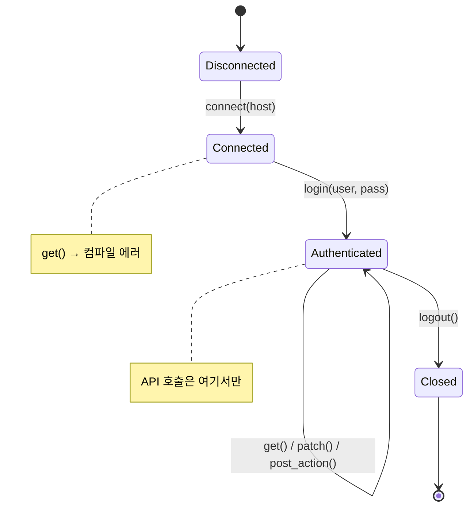
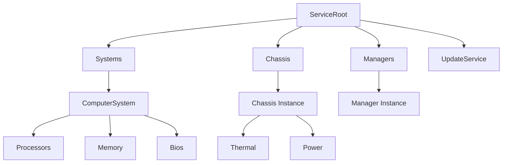
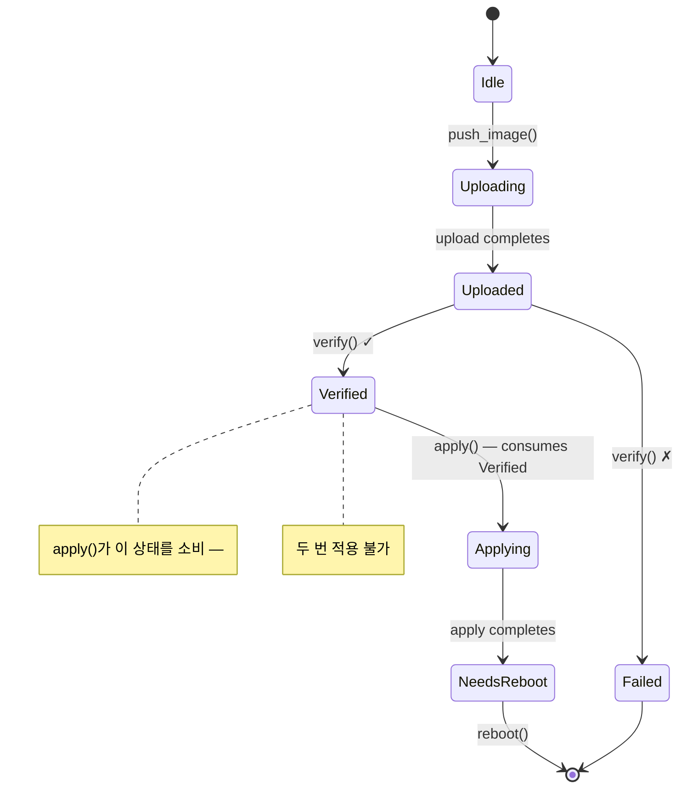

<a id="redfish-applied-walkthrough"></a>
# 적용형 워크스루 — 타입 안전한 Redfish 클라이언트 🟡

> **배울 내용:** 타입 상태 세션, capability token, 팬텀 타입 리소스 탐색, 차원 분석, 검증된 경계, 빌더 타입 상태, 단일 사용 타입을 조합해 오버헤드 없는 완전한 Redfish 클라이언트를 만드는 방법 — 모든 프로토콜 위반은 컴파일 에러입니다.
>
> **교차 참조:** [ch02](ch02-typed-command-interfaces-request-determi.md) (typed commands), [ch03](ch03-single-use-types-cryptographic-guarantee.md) (single-use types), [ch04](ch04-capability-tokens-zero-cost-proof-of-aut.md) (capability tokens), [ch05](ch05-protocol-state-machines-type-state-for-r.md) (type-state), [ch06](ch06-dimensional-analysis-making-the-compiler.md) (dimensional types), [ch07](ch07-validated-boundaries-parse-dont-validate.md) (validated boundaries), [ch09](ch09-phantom-types-for-resource-tracking.md) (phantom types), [ch10](ch10-putting-it-all-together-a-complete-diagn.md) (IPMI integration), [ch11](ch11-fourteen-tricks-from-the-trenches.md) (trick 4 — builder type-state)

<a id="why-redfish-deserves-its-own-chapter"></a>
## Redfish에 왜 독립 장이 필요한가

10장은 IPMI — 바이트 수준 프로토콜 — 를 중심으로 핵심 패턴을 조합합니다. 하지만
대부분의 BMC 플랫폼은 이제 IPMI와 함께(또는 대신) **Redfish** REST API를 노출하고,
Redfish는 그만의 정확성 위험 범주를 만듭니다:

| 위험 | 예 | 결과 |
|--------|---------|-------------|
| 잘못된 URI | `GET /redfish/v1/Chassis/1/Processors` (부모 잘못됨) | 404 또는 잘못된 데이터가 조용히 반환 |
| 잘못된 전원 상태에서 동작 | 이미 꺼진 시스템에 `Reset(ForceOff)` | BMC가 에러 반환 또는 더 나쁘게 다른 연산과 경합 |
| 권한 부족 | 운영자 수준 코드가 `Manager.ResetToDefaults` 호출 | 프로덕션 403, 보안 감사 이슈 |
| 불완전한 PATCH | PATCH 본문에서 필수 BIOS 속성 누락 | 조용한 무동작 또는 부분 설정 손상 |
| 검증 없는 펌웨어 적용 | 이미지 무결성 검사 전 `SimpleUpdate` 호출 | BMC 벽돌 |
| 스키마 버전 불일치 | v1.5 BMC에서 `LastResetTime` 접근(v1.13에 추가) | `null` 필드 → 런타임 패닉 |
| 텔레메트리 단위 혼동 | 입구 온도(°C)와 전력(W) 비교 | 무의미한 임계 결정 |

C, Python, 타입 없는 Rust에서는 이 모두가 규율과 테스트로만 막습니다. 이 장에서는 **컴파일 에러**로 만듭니다.

<a id="the-untyped-redfish-client"></a>
## 타입 없는 Redfish 클라이언트

전형적인 Redfish 클라이언트는 이렇게 생깁니다:

```rust,ignore
use std::collections::HashMap;

struct RedfishClient {
    base_url: String,
    token: Option<String>,
}

impl RedfishClient {
    fn get(&self, path: &str) -> Result<serde_json::Value, String> {
        // ... HTTP GET ...
        Ok(serde_json::json!({})) // stub
    }

    fn patch(&self, path: &str, body: &serde_json::Value) -> Result<(), String> {
        // ... HTTP PATCH ...
        Ok(()) // stub
    }

    fn post_action(&self, path: &str, body: &serde_json::Value) -> Result<(), String> {
        // ... HTTP POST ...
        Ok(()) // stub
    }
}

fn check_thermal(client: &RedfishClient) -> Result<(), String> {
    let resp = client.get("/redfish/v1/Chassis/1/Thermal")?;

    // 🐛 이 필드가 항상 있나? BMC가 null을 반환하면?
    let cpu_temp = resp["Temperatures"][0]["ReadingCelsius"]
        .as_f64().unwrap();

    let fan_rpm = resp["Fans"][0]["Reading"]
        .as_f64().unwrap();

    // 🐛 °C와 RPM 비교 — 둘 다 f64
    if cpu_temp > fan_rpm {
        println!("thermal issue");
    }

    // 🐛 경로가 맞나? 컴파일 타임 검사 없음.
    client.post_action(
        "/redfish/v1/Systems/1/Actions/ComputerSystem.Reset",
        &serde_json::json!({"ResetType": "ForceOff"})
    )?;

    Ok(())
}
```

이 코드는 "동작"합니다 — 언젠가는 깨질 때까지. 모든 `unwrap()`은 잠재적 패닉이고,
문자열 경로는 모두 검증되지 않은 가정이며, 단위 혼동은 눈에 보이지 않습니다.

---

<a id="section-1-session-lifecycle"></a>
## 1절 — 세션 수명 주기 (Type-State, ch05)

Redfish 세션은 엄격한 수명이 있습니다: 연결 → 인증 → 사용 → 종료.
각 상태를 서로 다른 타입으로 인코딩합니다.



```rust,ignore
use std::marker::PhantomData;

// ──── 세션 상태 ────

pub struct Disconnected;
pub struct Connected;
pub struct Authenticated;

pub struct RedfishSession<S> {
    base_url: String,
    auth_token: Option<String>,
    _state: PhantomData<S>,
}

impl RedfishSession<Disconnected> {
    pub fn new(host: &str) -> Self {
        RedfishSession {
            base_url: format!("https://{}", host),
            auth_token: None,
            _state: PhantomData,
        }
    }

    /// 전이: Disconnected → Connected.
    /// 서비스 루트에 도달 가능한지 검증.
    pub fn connect(self) -> Result<RedfishSession<Connected>, RedfishError> {
        // GET /redfish/v1 — verify service root
        println!("Connecting to {}/redfish/v1", self.base_url);
        Ok(RedfishSession {
            base_url: self.base_url,
            auth_token: None,
            _state: PhantomData,
        })
    }
}

impl RedfishSession<Connected> {
    /// 전이: Connected → Authenticated.
    /// POST /redfish/v1/SessionService/Sessions로 세션 생성.
    pub fn login(
        self,
        user: &str,
        _pass: &str,
    ) -> Result<(RedfishSession<Authenticated>, LoginToken), RedfishError> {
        // POST /redfish/v1/SessionService/Sessions
        println!("Authenticated as {}", user);
        let token = "X-Auth-Token-abc123".to_string();
        Ok((
            RedfishSession {
                base_url: self.base_url,
                auth_token: Some(token),
                _state: PhantomData,
            },
            LoginToken { _private: () },
        ))
    }
}

impl RedfishSession<Authenticated> {
    /// Authenticated 세션에서만 사용 가능.
    fn http_get(&self, path: &str) -> Result<serde_json::Value, RedfishError> {
        let _url = format!("{}{}", self.base_url, path);
        // ... HTTP GET with auth_token header ...
        Ok(serde_json::json!({})) // stub
    }

    fn http_patch(
        &self,
        path: &str,
        body: &serde_json::Value,
    ) -> Result<serde_json::Value, RedfishError> {
        let _url = format!("{}{}", self.base_url, path);
        let _ = body;
        Ok(serde_json::json!({})) // stub
    }

    fn http_post(
        &self,
        path: &str,
        body: &serde_json::Value,
    ) -> Result<serde_json::Value, RedfishError> {
        let _url = format!("{}{}", self.base_url, path);
        let _ = body;
        Ok(serde_json::json!({})) // stub
    }

    /// 전이: Authenticated → Closed (세션 소비).
    pub fn logout(self) {
        // DELETE /redfish/v1/SessionService/Sessions/{id}
        println!("Session closed");
        // self 소비 — 로그아웃 후 세션 사용 불가
    }
}

// Authenticated가 아닌 세션에서 http_get 호출 시도:
//
//   let session = RedfishSession::new("bmc01").connect()?;
//   session.http_get("/redfish/v1/Systems");
//   ❌ ERROR: method `http_get` not found for `RedfishSession<Connected>`

#[derive(Debug)]
pub enum RedfishError {
    ConnectionFailed(String),
    AuthenticationFailed(String),
    HttpError { status: u16, message: String },
    ValidationError(String),
}

impl std::fmt::Display for RedfishError {
    fn fmt(&self, f: &mut std::fmt::Formatter<'_>) -> std::fmt::Result {
        match self {
            Self::ConnectionFailed(msg) => write!(f, "connection failed: {msg}"),
            Self::AuthenticationFailed(msg) => write!(f, "auth failed: {msg}"),
            Self::HttpError { status, message } =>
                write!(f, "HTTP {status}: {message}"),
            Self::ValidationError(msg) => write!(f, "validation: {msg}"),
        }
    }
}
```

**제거된 버그 클래스:** 연결 끊김 또는 미인증 세션으로 요청을 보내는 경우. 메서드 자체가 존재하지 않습니다 — 잊을 런타임 검사도 없습니다.

---

<a id="section-2-privilege-tokens"></a>
## 2절 — 권한 토큰 (Capability Tokens, ch04)

Redfish는 네 가지 권한 수준을 정의합니다: `Login`, `ConfigureComponents`,
`ConfigureManager`, `ConfigureSelf`. 런타임에 권한을 검사하기보다
제로 크기 증명 토큰으로 인코딩합니다.

```rust,ignore
// ──── 권한 토큰 (제로 크기) ────

/// 호출자가 Login 권한을 가짐을 증명.
/// 성공한 로그인에서만 반환 — 얻을 수 있는 유일한 방법.
pub struct LoginToken { _private: () }

/// 호출자가 ConfigureComponents 권한을 가짐을 증명.
/// 관리자 수준 인증으로만 획득 가능.
pub struct ConfigureComponentsToken { _private: () }

/// 호출자가 ConfigureManager 권한을 가짐을 증명(펌웨어 업데이트 등).
pub struct ConfigureManagerToken { _private: () }

// 역할에 따라 로그인이 권한 토큰을 반환하도록 확장:

impl RedfishSession<Connected> {
    /// 관리자 로그인 — 모든 권한 토큰 반환.
    pub fn login_admin(
        self,
        user: &str,
        pass: &str,
    ) -> Result<(
        RedfishSession<Authenticated>,
        LoginToken,
        ConfigureComponentsToken,
        ConfigureManagerToken,
    ), RedfishError> {
        let (session, login_tok) = self.login(user, pass)?;
        Ok((
            session,
            login_tok,
            ConfigureComponentsToken { _private: () },
            ConfigureManagerToken { _private: () },
        ))
    }

    /// 운영자 로그인 — Login + ConfigureComponents만 반환.
    pub fn login_operator(
        self,
        user: &str,
        pass: &str,
    ) -> Result<(
        RedfishSession<Authenticated>,
        LoginToken,
        ConfigureComponentsToken,
    ), RedfishError> {
        let (session, login_tok) = self.login(user, pass)?;
        Ok((
            session,
            login_tok,
            ConfigureComponentsToken { _private: () },
        ))
    }

    /// 읽기 전용 로그인 — Login 토큰만 반환.
    pub fn login_readonly(
        self,
        user: &str,
        pass: &str,
    ) -> Result<(RedfishSession<Authenticated>, LoginToken), RedfishError> {
        self.login(user, pass)
    }
}
```

이제 권한 요구가 함수 시그니처의 일부입니다:

```rust,ignore
# use std::marker::PhantomData;
# pub struct Authenticated;
# pub struct RedfishSession<S> { base_url: String, auth_token: Option<String>, _state: PhantomData<S> }
# pub struct LoginToken { _private: () }
# pub struct ConfigureComponentsToken { _private: () }
# pub struct ConfigureManagerToken { _private: () }
# #[derive(Debug)] pub enum RedfishError { HttpError { status: u16, message: String } }

/// Login이 있으면 누구나 온열 데이터 읽기 가능.
fn get_thermal(
    session: &RedfishSession<Authenticated>,
    _proof: &LoginToken,
) -> Result<serde_json::Value, RedfishError> {
    // GET /redfish/v1/Chassis/1/Thermal
    Ok(serde_json::json!({})) // stub
}

/// 부팅 순서 변경에는 ConfigureComponents 필요.
fn set_boot_order(
    session: &RedfishSession<Authenticated>,
    _proof: &ConfigureComponentsToken,
    order: &[&str],
) -> Result<(), RedfishError> {
    let _ = order;
    // PATCH /redfish/v1/Systems/1
    Ok(())
}

/// 공장 초기화에는 ConfigureManager 필요.
fn reset_to_defaults(
    session: &RedfishSession<Authenticated>,
    _proof: &ConfigureManagerToken,
) -> Result<(), RedfishError> {
    // POST .../Actions/Manager.ResetToDefaults
    Ok(())
}

// 운영자 코드가 reset_to_defaults를 호출할 때:
//
//   let (session, login, configure) = session.login_operator("op", "pass")?;
//   reset_to_defaults(&session, &???);
//   ❌ ERROR: no ConfigureManagerToken available — operator can't do this
```

**제거된 버그 클래스:** 권한 상승. 운영자 수준 로그인은 물리적으로
`ConfigureManagerToken`을 만들 수 없습니다 — 컴파일러가 코드가 그 토큰을 참조하지 못하게 합니다.
런타임 비용 0: 컴파일된 바이너리에는 이 토큰이 존재하지 않습니다.

---

<a id="section-3-typed-resource-navigation"></a>
## 3절 — 타입이 있는 리소스 탐색 (Phantom Types, ch09)

Redfish 리소스는 트리를 이룹니다. 계층을 타입으로 인코딩하면
잘못된 URI를 만들 수 없습니다:



```rust,ignore
use std::marker::PhantomData;

// ──── 리소스 타입 마커 ────

pub struct ServiceRoot;
pub struct SystemsCollection;
pub struct ComputerSystem;
pub struct ChassisCollection;
pub struct ChassisInstance;
pub struct ThermalResource;
pub struct PowerResource;
pub struct BiosResource;
pub struct ManagersCollection;
pub struct ManagerInstance;
pub struct UpdateServiceResource;

// ──── 타입이 있는 리소스 경로 ────

pub struct RedfishPath<R> {
    uri: String,
    _resource: PhantomData<R>,
}

impl RedfishPath<ServiceRoot> {
    pub fn root() -> Self {
        RedfishPath {
            uri: "/redfish/v1".to_string(),
            _resource: PhantomData,
        }
    }

    pub fn systems(&self) -> RedfishPath<SystemsCollection> {
        RedfishPath {
            uri: format!("{}/Systems", self.uri),
            _resource: PhantomData,
        }
    }

    pub fn chassis(&self) -> RedfishPath<ChassisCollection> {
        RedfishPath {
            uri: format!("{}/Chassis", self.uri),
            _resource: PhantomData,
        }
    }

    pub fn managers(&self) -> RedfishPath<ManagersCollection> {
        RedfishPath {
            uri: format!("{}/Managers", self.uri),
            _resource: PhantomData,
        }
    }

    pub fn update_service(&self) -> RedfishPath<UpdateServiceResource> {
        RedfishPath {
            uri: format!("{}/UpdateService", self.uri),
            _resource: PhantomData,
        }
    }
}

impl RedfishPath<SystemsCollection> {
    pub fn system(&self, id: &str) -> RedfishPath<ComputerSystem> {
        RedfishPath {
            uri: format!("{}/{}", self.uri, id),
            _resource: PhantomData,
        }
    }
}

impl RedfishPath<ComputerSystem> {
    pub fn bios(&self) -> RedfishPath<BiosResource> {
        RedfishPath {
            uri: format!("{}/Bios", self.uri),
            _resource: PhantomData,
        }
    }
}

impl RedfishPath<ChassisCollection> {
    pub fn instance(&self, id: &str) -> RedfishPath<ChassisInstance> {
        RedfishPath {
            uri: format!("{}/{}", self.uri, id),
            _resource: PhantomData,
        }
    }
}

impl RedfishPath<ChassisInstance> {
    pub fn thermal(&self) -> RedfishPath<ThermalResource> {
        RedfishPath {
            uri: format!("{}/Thermal", self.uri),
            _resource: PhantomData,
        }
    }

    pub fn power(&self) -> RedfishPath<PowerResource> {
        RedfishPath {
            uri: format!("{}/Power", self.uri),
            _resource: PhantomData,
        }
    }
}

impl RedfishPath<ManagersCollection> {
    pub fn manager(&self, id: &str) -> RedfishPath<ManagerInstance> {
        RedfishPath {
            uri: format!("{}/{}", self.uri, id),
            _resource: PhantomData,
        }
    }
}

impl<R> RedfishPath<R> {
    pub fn uri(&self) -> &str {
        &self.uri
    }
}

// ── 사용 ──

fn build_paths() {
    let root = RedfishPath::root();

    // ✅ 유효한 탐색
    let thermal = root.chassis().instance("1").thermal();
    assert_eq!(thermal.uri(), "/redfish/v1/Chassis/1/Thermal");

    let bios = root.systems().system("1").bios();
    assert_eq!(bios.uri(), "/redfish/v1/Systems/1/Bios");

    // ❌ 컴파일 에러: ServiceRoot에 .thermal() 없음
    // root.thermal();

    // ❌ 컴파일 에러: SystemsCollection에 .bios() 없음
    // root.systems().bios();

    // ❌ 컴파일 에러: ChassisInstance에 .bios() 없음
    // root.chassis().instance("1").bios();
}
```

**제거된 버그 클래스:** 잘못된 URI, 주어진 부모 아래에 없는 자식 리소스로의 탐색. 계층이 구조적으로 강제됩니다 —
`Thermal`에는 `Chassis → Instance → Thermal`로만 도달할 수 있습니다.

---

<a id="section-4-typed-telemetry-reads"></a>
## 4절 — 타입이 있는 텔레메트리 읽기 (Typed Commands + Dimensional Analysis, ch02 + ch06)

타입이 있는 리소스 경로와 차원이 붙은 반환 타입을 결합해 컴파일러가
각 측정값의 단위를 알게 합니다:

```rust,ignore
use std::marker::PhantomData;

// ──── 차원 타입 (ch06) ────

#[derive(Debug, Clone, Copy, PartialEq, PartialOrd)]
pub struct Celsius(pub f64);

#[derive(Debug, Clone, Copy, PartialEq, PartialOrd)]
pub struct Rpm(pub u32);

#[derive(Debug, Clone, Copy, PartialEq, PartialOrd)]
pub struct Watts(pub f64);

#[derive(Debug, Clone, Copy, PartialEq, PartialOrd)]
pub struct Volts(pub f64);

// ──── 타입이 있는 Redfish GET (ch02 패턴을 REST에 적용) ────

/// Redfish 리소스 타입이 파싱된 응답을 결정.
pub trait RedfishResource {
    type Response;
    fn parse(json: &serde_json::Value) -> Result<Self::Response, RedfishError>;
}

// ──── 검증된 Thermal 응답 (ch07) ────

#[derive(Debug)]
pub struct ValidThermalResponse {
    pub temperatures: Vec<TemperatureReading>,
    pub fans: Vec<FanReading>,
}

#[derive(Debug)]
pub struct TemperatureReading {
    pub name: String,
    pub reading: Celsius,           // ← 차원 타입, f64 아님
    pub upper_critical: Celsius,
    pub status: HealthStatus,
}

#[derive(Debug)]
pub struct FanReading {
    pub name: String,
    pub reading: Rpm,               // ← 차원 타입, u32 아님
    pub status: HealthStatus,
}

#[derive(Debug, Clone, Copy, PartialEq)]
pub enum HealthStatus { Ok, Warning, Critical }

impl RedfishResource for ThermalResource {
    type Response = ValidThermalResponse;

    fn parse(json: &serde_json::Value) -> Result<ValidThermalResponse, RedfishError> {
        // 한 번에 파싱·검증 — 경계 검증 (ch07)
        let temps = json["Temperatures"]
            .as_array()
            .ok_or_else(|| RedfishError::ValidationError(
                "missing Temperatures array".into(),
            ))?
            .iter()
            .map(|t| {
                Ok(TemperatureReading {
                    name: t["Name"]
                        .as_str()
                        .ok_or_else(|| RedfishError::ValidationError(
                            "missing Name".into(),
                        ))?
                        .to_string(),
                    reading: Celsius(
                        t["ReadingCelsius"]
                            .as_f64()
                            .ok_or_else(|| RedfishError::ValidationError(
                                "missing ReadingCelsius".into(),
                            ))?,
                    ),
                    upper_critical: Celsius(
                        t["UpperThresholdCritical"]
                            .as_f64()
                            .unwrap_or(105.0), // 임계값 없을 때 안전한 기본값
                    ),
                    status: parse_health(
                        t["Status"]["Health"]
                            .as_str()
                            .unwrap_or("OK"),
                    ),
                })
            })
            .collect::<Result<Vec<_>, _>>()?;

        let fans = json["Fans"]
            .as_array()
            .ok_or_else(|| RedfishError::ValidationError(
                "missing Fans array".into(),
            ))?
            .iter()
            .map(|f| {
                Ok(FanReading {
                    name: f["Name"]
                        .as_str()
                        .ok_or_else(|| RedfishError::ValidationError(
                            "missing Name".into(),
                        ))?
                        .to_string(),
                    reading: Rpm(
                        f["Reading"]
                            .as_u64()
                            .ok_or_else(|| RedfishError::ValidationError(
                                "missing Reading".into(),
                            ))? as u32,
                    ),
                    status: parse_health(
                        f["Status"]["Health"]
                            .as_str()
                            .unwrap_or("OK"),
                    ),
                })
            })
            .collect::<Result<Vec<_>, _>>()?;

        Ok(ValidThermalResponse { temperatures: temps, fans })
    }
}

fn parse_health(s: &str) -> HealthStatus {
    match s {
        "OK" => HealthStatus::Ok,
        "Warning" => HealthStatus::Warning,
        _ => HealthStatus::Critical,
    }
}

// ──── Authenticated 세션에서 타입이 있는 GET ────

impl RedfishSession<Authenticated> {
    pub fn get_resource<R: RedfishResource>(
        &self,
        path: &RedfishPath<R>,
    ) -> Result<R::Response, RedfishError> {
        let json = self.http_get(path.uri())?;
        R::parse(&json)
    }
}

// ── 사용 ──

fn read_thermal(
    session: &RedfishSession<Authenticated>,
    _proof: &LoginToken,
) -> Result<(), RedfishError> {
    let path = RedfishPath::root().chassis().instance("1").thermal();

    // 응답 타입 추론: ValidThermalResponse
    let thermal = session.get_resource(&path)?;

    for t in &thermal.temperatures {
        // t.reading은 Celsius — Celsius와만 비교 가능
        if t.reading > t.upper_critical {
            println!("CRITICAL: {} at {:?}", t.name, t.reading);
        }

        // ❌ 컴파일 에러: Celsius와 Rpm 비교 불가
        // if t.reading > thermal.fans[0].reading { }

        // ❌ 컴파일 에러: Celsius와 Watts 비교 불가
        // if t.reading > Watts(350.0) { }
    }

    Ok(())
}
```

**제거된 버그 클래스:**
- **단위 혼동:** `Celsius` ≠ `Rpm` ≠ `Watts` — 컴파일러가 비교를 거부합니다.
- **필드 누락 패닉:** `parse()`가 경계에서 검증하고; `ValidThermalResponse`가
  모든 필드 존재를 보장합니다.
- **잘못된 응답 타입:** `get_resource(&thermal_path)`는 원시 JSON이 아니라 `ValidThermalResponse`를 반환합니다. 리소스 타입이 컴파일 타임에 응답 타입을 결정합니다.

---

<a id="section-5-patch-with-builder-type-state"></a>
## 5절 — 빌더 타입 상태로 PATCH (ch11, Trick 4)

Redfish PATCH 페이로드에는 특정 필드가 있어야 합니다. 필수 필드가 설정된 경우에만
`.apply()`를 허용하는 빌더는 불완전하거나 빈 PATCH를 막습니다:

```rust,ignore
use std::marker::PhantomData;

// ──── 필수 필드용 타입 수준 불리언 ────

pub struct FieldUnset;
pub struct FieldSet;

// ──── BIOS 설정 PATCH 빌더 ────

pub struct BiosPatchBuilder<BootOrder, TpmState> {
    boot_order: Option<Vec<String>>,
    tpm_enabled: Option<bool>,
    _markers: PhantomData<(BootOrder, TpmState)>,
}

impl BiosPatchBuilder<FieldUnset, FieldUnset> {
    pub fn new() -> Self {
        BiosPatchBuilder {
            boot_order: None,
            tpm_enabled: None,
            _markers: PhantomData,
        }
    }
}

impl<T> BiosPatchBuilder<FieldUnset, T> {
    /// 부팅 순서 설정 — BootOrder 마커를 FieldSet으로 전이.
    pub fn boot_order(self, order: Vec<String>) -> BiosPatchBuilder<FieldSet, T> {
        BiosPatchBuilder {
            boot_order: Some(order),
            tpm_enabled: self.tpm_enabled,
            _markers: PhantomData,
        }
    }
}

impl<B> BiosPatchBuilder<B, FieldUnset> {
    /// TPM 상태 설정 — TpmState 마커를 FieldSet으로 전이.
    pub fn tpm_enabled(self, enabled: bool) -> BiosPatchBuilder<B, FieldSet> {
        BiosPatchBuilder {
            boot_order: self.boot_order,
            tpm_enabled: Some(enabled),
            _markers: PhantomData,
        }
    }
}

impl BiosPatchBuilder<FieldSet, FieldSet> {
    /// 필수 필드가 모두 설정되었을 때만 .apply() 존재.
    pub fn apply(
        self,
        session: &RedfishSession<Authenticated>,
        _proof: &ConfigureComponentsToken,
        system: &RedfishPath<ComputerSystem>,
    ) -> Result<(), RedfishError> {
        let body = serde_json::json!({
            "Boot": {
                "BootOrder": self.boot_order.unwrap(),
            },
            "Oem": {
                "TpmEnabled": self.tpm_enabled.unwrap(),
            }
        });
        session.http_patch(
            &format!("{}/Bios/Settings", system.uri()),
            &body,
        )?;
        Ok(())
    }
}

// ── 사용 ──

fn configure_bios(
    session: &RedfishSession<Authenticated>,
    configure: &ConfigureComponentsToken,
) -> Result<(), RedfishError> {
    let system = RedfishPath::root().systems().system("1");

    // ✅ 필수 필드 둘 다 설정 — .apply() 사용 가능
    BiosPatchBuilder::new()
        .boot_order(vec!["Pxe".into(), "Hdd".into()])
        .tpm_enabled(true)
        .apply(session, configure, &system)?;

    // ❌ 컴파일 에러: BiosPatchBuilder<FieldSet, FieldUnset>에 .apply() 없음
    // BiosPatchBuilder::new()
    //     .boot_order(vec!["Pxe".into()])
    //     .apply(session, configure, &system)?;

    // ❌ 컴파일 에러: BiosPatchBuilder<FieldUnset, FieldUnset>에 .apply() 없음
    // BiosPatchBuilder::new()
    //     .apply(session, configure, &system)?;

    Ok(())
}
```

**제거된 버그 클래스:**
- **빈 PATCH:** 필수 필드를 모두 설정하지 않으면 `.apply()` 호출 불가.
- **권한 누락:** `.apply()`는 `&ConfigureComponentsToken` 필요.
- **잘못된 리소스:** 원시 문자열이 아니라 `&RedfishPath<ComputerSystem>`을 받음.

---

<a id="section-6-firmware-update-lifecycle"></a>
## 6절 — 펌웨어 업데이트 수명 (Single-Use + Type-State, ch03 + ch05)

Redfish `UpdateService`는 엄격한 순서를 가집니다: 이미지 푸시 → 검증 →
적용 → 재부팅. 각 단계는 순서대로 정확히 한 번씩 일어나야 합니다.



```rust,ignore
use std::marker::PhantomData;

// ──── 펌웨어 업데이트 상태 ────

pub struct FwIdle;
pub struct FwUploaded;
pub struct FwVerified;
pub struct FwApplying;
pub struct FwNeedsReboot;

pub struct FirmwareUpdate<S> {
    task_uri: String,
    image_hash: String,
    _phase: PhantomData<S>,
}

impl FirmwareUpdate<FwIdle> {
    pub fn push_image(
        session: &RedfishSession<Authenticated>,
        _proof: &ConfigureManagerToken,
        image: &[u8],
    ) -> Result<FirmwareUpdate<FwUploaded>, RedfishError> {
        // POST /redfish/v1/UpdateService/Actions/UpdateService.SimpleUpdate
        // 또는 /redfish/v1/UpdateService/upload로 multipart 푸시
        let _ = image;
        println!("Image uploaded ({} bytes)", image.len());
        Ok(FirmwareUpdate {
            task_uri: "/redfish/v1/TaskService/Tasks/1".to_string(),
            image_hash: "sha256:abc123".to_string(),
            _phase: PhantomData,
        })
    }
}

impl FirmwareUpdate<FwUploaded> {
    /// 이미지 무결성 검증. 성공 시 FwVerified 반환.
    pub fn verify(self) -> Result<FirmwareUpdate<FwVerified>, RedfishError> {
        // Poll task until verification complete
        println!("Image verified: {}", self.image_hash);
        Ok(FirmwareUpdate {
            task_uri: self.task_uri,
            image_hash: self.image_hash,
            _phase: PhantomData,
        })
    }
}

impl FirmwareUpdate<FwVerified> {
    /// 업데이트 적용. self 소비 — 두 번 적용 불가.
    /// ch03의 단일 사용 패턴.
    pub fn apply(self) -> Result<FirmwareUpdate<FwNeedsReboot>, RedfishError> {
        // PATCH /redfish/v1/UpdateService — ApplyTime 설정
        println!("Firmware applied from {}", self.task_uri);
        // self 이동 — apply() 재호출은 컴파일 에러
        Ok(FirmwareUpdate {
            task_uri: self.task_uri,
            image_hash: self.image_hash,
            _phase: PhantomData,
        })
    }
}

impl FirmwareUpdate<FwNeedsReboot> {
    /// 새 펌웨어를 활성화하려면 재부팅.
    pub fn reboot(
        self,
        session: &RedfishSession<Authenticated>,
        _proof: &ConfigureManagerToken,
    ) -> Result<(), RedfishError> {
        // POST .../Actions/Manager.Reset {"ResetType": "GracefulRestart"}
        let _ = session;
        println!("BMC rebooting to activate firmware");
        Ok(())
    }
}

// ── 사용 ──

fn update_bmc_firmware(
    session: &RedfishSession<Authenticated>,
    manager_proof: &ConfigureManagerToken,
    image: &[u8],
) -> Result<(), RedfishError> {
    // 각 단계가 다음 상태를 반환 — 이전 상태는 소비됨
    let uploaded = FirmwareUpdate::push_image(session, manager_proof, image)?;
    let verified = uploaded.verify()?;
    let needs_reboot = verified.apply()?;
    needs_reboot.reboot(session, manager_proof)?;

    // ❌ 컴파일 에러: 이동된 `verified` 사용
    // verified.apply()?;

    // ❌ 컴파일 에러: FirmwareUpdate<FwUploaded>에 .apply() 없음
    // uploaded.apply()?;      // 먼저 검증해야 함!

    // ❌ 컴파일 에러: push_image는 &ConfigureManagerToken 필요
    // FirmwareUpdate::push_image(session, &login_token, image)?;

    Ok(())
}
```

**제거된 버그 클래스:**
- **검증 없는 펌웨어 적용:** `.apply()`는 `FwVerified`에서만 존재.
- **이중 적용:** `apply()`가 `self`를 소비 — 이동된 값 재사용 불가.
- **재부팅 생략:** `FwNeedsReboot`는 별도 타입; 펌웨어가 스테이징된 채로
  실수로 정상 동작을 계속할 수 없음.
- **무단 업데이트:** `push_image()`는 `&ConfigureManagerToken` 필요.

---

<a id="section-7-putting-it-all-together-ch17"></a>
## 7절 — 모두 합치기

여섉 절을 모두 조합한 전체 진단 워크플로입니다:

```rust,ignore
fn full_redfish_diagnostic() -> Result<(), RedfishError> {
    // ── 1. 세션 수명 (1절) ──
    let session = RedfishSession::new("bmc01.lab.local");
    let session = session.connect()?;

    // ── 2. 권한 토큰 (2절) ──
    // 관리자 로그인 — 모든 capability 토큰 수신
    let (session, _login, configure, manager) =
        session.login_admin("admin", "p@ssw0rd")?;

    // ── 3. 타입이 있는 탐색 (3절) ──
    let thermal_path = RedfishPath::root()
        .chassis()
        .instance("1")
        .thermal();

    // ── 4. 타입이 있는 텔레메트리 읽기 (4절) ──
    let thermal: ValidThermalResponse = session.get_resource(&thermal_path)?;

    for t in &thermal.temperatures {
        // Celsius는 Celsius와만 비교 — 차원 안전
        if t.reading > t.upper_critical {
            println!("🔥 {} is critical: {:?}", t.name, t.reading);
        }
    }

    for f in &thermal.fans {
        if f.reading < Rpm(1000) {
            println!("⚠ {} below threshold: {:?}", f.name, f.reading);
        }
    }

    // ── 5. 타입 안전 PATCH (5절) ──
    let system_path = RedfishPath::root().systems().system("1");

    BiosPatchBuilder::new()
        .boot_order(vec!["Pxe".into(), "Hdd".into()])
        .tpm_enabled(true)
        .apply(&session, &configure, &system_path)?;

    // ── 6. 펌웨어 업데이트 수명 (6절) ──
    let firmware_image = include_bytes!("bmc_firmware.bin");
    let uploaded = FirmwareUpdate::push_image(&session, &manager, firmware_image)?;
    let verified = uploaded.verify()?;
    let needs_reboot = verified.apply()?;

    // ── 7. 깔끔한 종료 ──
    needs_reboot.reboot(&session, &manager)?;
    session.logout();

    Ok(())
}
```

<a id="what-the-compiler-proves-ch17"></a>
### 컴파일러가 증명하는 것

| # | 버그 클래스 | 막는 방법 | 패턴 (절) |
|---|-----------|-------------------|-------------------|
| 1 | 미인증 세션으로 요청 | `http_get()`은 `Session<Authenticated>`에만 존재 | Type-state (1절) |
| 2 | 권한 상승 | 운영자 로그인은 `ConfigureManagerToken`을 반환하지 않음 | Capability tokens (2절) |
| 3 | 잘못된 Redfish URI | 탐색 메서드가 부모→자식 계층 강제 | Phantom types (3절) |
| 4 | 단위 혼동(°C vs RPM vs W) | `Celsius`, `Rpm`, `Watts`는 서로 다른 타입 | Dimensional analysis (4절) |
| 5 | JSON 필드 누락 → 패닉 | `ValidThermalResponse`가 파싱 경계에서 검증 | Validated boundaries (4절) |
| 6 | 잘못된 응답 타입 | 리소스마다 `RedfishResource::Response`가 고정 | Typed commands (4절) |
| 7 | 불완전한 PATCH 페이로드 | 필드가 모두 `FieldSet`일 때만 `.apply()` 존재 | Builder type-state (5절) |
| 8 | PATCH에 권한 누락 | `.apply()`는 `&ConfigureComponentsToken` 필요 | Capability tokens (5절) |
| 9 | 검증 없는 펌웨어 적용 | `.apply()`는 `FwVerified`에만 존재 | Type-state (6절) |
| 10 | 펌웨어 이중 적용 | `apply()`가 `self` 소비 — 값 이동 | Single-use types (6절) |
| 11 | 권한 없는 펌웨어 업데이트 | `push_image()`는 `&ConfigureManagerToken` 필요 | Capability tokens (6절) |
| 12 | 로그아웃 후 사용 | `logout()`이 세션 소비 | Ownership (1절) |

**열두 가지 보장 모두의 총 런타임 오버헤드: 0.**

생성된 바이너리는 타입 없는 버전과 같은 HTTP 호출을 하지만 — 타입 없는 버전은
12가지 버그 클래스가 날 수 있고, 이 버전은 날 수 없습니다.

---

<a id="comparison-ipmi-vs-redfish"></a>
## 비교: IPMI 통합(ch10) vs. Redfish 통합

| 차원 | ch10 (IPMI) | 이 장 (Redfish) |
|-----------|-------------|----------------------|
| 전송 | KCS/LAN 위 원시 바이트 | HTTPS 위 JSON |
| 탐색 | 평면 명령 코드(NetFn/Cmd) | 계층 URI 트리 |
| 응답 결합 | `IpmiCmd::Response` | `RedfishResource::Response` |
| 권한 모델 | 단일 `AdminToken` | 역할 기반 다중 토큰 |
| 페이로드 구성 | 바이트 배열 | JSON용 빌더 타입 상태 |
| 업데이트 수명 | 다루지 않음 | 전체 type-state 체인 |
| 연습한 패턴 수 | 7 | 8 (빌더 타입 상태 추가) |

두 장은 상호 보완입니다: ch10은 바이트 수준에서 패턴이 통함을 보이고,
이 장은 REST/JSON 수준에서 동일함을 보입니다. 타입 시스템은 전송에 관심 없습니다 —
어느 쪽이든 정확성을 증명합니다.

<a id="key-takeaways-ch17"></a>
## 핵심 정리

1. **여덟 패턴이 하나의 Redfish 클라이언트로** — 세션 type-state, capability
   tokens, 팬텀 타입 URI, typed commands, dimensional analysis, validated
   boundaries, 빌더 type-state, 단일 사용 펌웨어 적용.
2. **열두 가지 버그 클래스가 컴파일 에러로** — 위 표 참고.
3. **런타임 오버헤드 0** — 모든 증명 토큰, 팬텀 타입, type-state
   마커는 컴파일되면 사라집니다. 바이너리는 손으로 짠 타입 없는 코드와 동일합니다.
4. **바이트 프로토콜만큼 REST API도 이득** — ch02–ch09 패턴은
   JSON-over-HTTPS(Redfish)와 bytes-over-KCS(IPMI)에 동일하게 적용됩니다.
5. **권한 강제는 절차가 아니라 구조** — 함수 시그니처가
   필요한 것을 선언하고 컴파일러가 강제합니다.
6. **이것은 설계 템플릿** — 리소스 타입 마커, capability
   tokens, 빌더를 조직의 Redfish 스키마와 역할 계층에 맞게 조정하세요.

---
