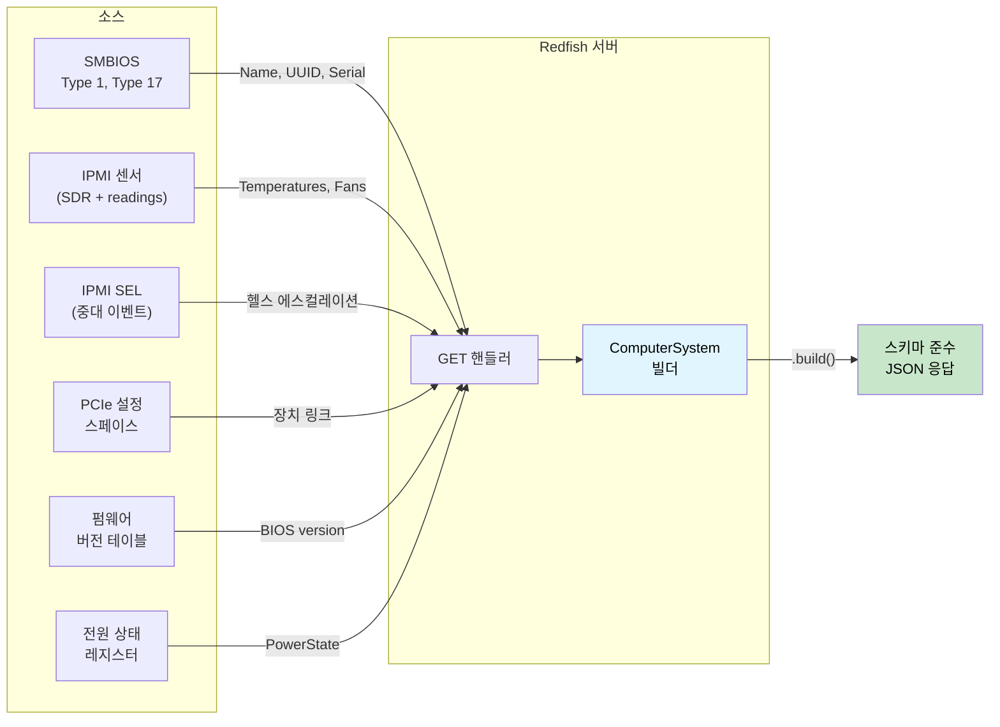

<a id="redfish-server-walkthrough"></a>
# 적용형 워크스루 — 타입 안전한 Redfish 서버 🟡

> **배울 내용:** 응답 빌더 타입 상태, 소스 가용성 토큰, 차원이 있는 직렬화, 헬스 롤업, 스키마 버전 관리, 타입이 있는 액션 디스패치를 조합해 **스키마에 맞지 않는 응답을 만들 수 없는** Redfish 서버를 만드는 방법 — [ch17](ch17-redfish-applied-walkthrough.md) 클라이언트 워크스루의 거울입니다.
>
> **교차 참조:** [ch02](ch02-typed-command-interfaces-request-determi.md) (typed commands — 액션 디스패치에 역으로 적용), [ch04](ch04-capability-tokens-zero-cost-proof-of-aut.md) (capability tokens — 소스 가용성), [ch06](ch06-dimensional-analysis-making-the-compiler.md) (dimensional types — 직렬화 쪽), [ch07](ch07-validated-boundaries-parse-dont-validate.md) (validated boundaries — 역: "직렬화하지 말고 구성하라"), [ch09](ch09-phantom-types-for-resource-tracking.md) (phantom types — 스키마 버전), [ch11](ch11-fourteen-tricks-from-the-trenches.md) (trick 3 — `#[non_exhaustive]`, trick 4 — builder type-state), [ch17](ch17-redfish-applied-walkthrough.md) (클라이언트 대응)

<a id="the-mirror-problem"></a>
## 거울 문제

17장은 *"Redfish를 올바르게 소비하려면?"*을 묻습니다. 이 장은 거울 질문을 던집니다:
*"Redfish를 올바르게 생산하려면?"*

클라이언트 쪽 위험은 나쁜 데이터를 **믿는** 것입니다. 서버 쪽 위험은 나쁜 데이터를 **내보내는** 것이고 — 함대의 모든 클라이언트가 보내는 내용을 신뢰합니다.

단일 `GET /redfish/v1/Systems/1` 응답은 여러 소스의 데이터를 합쳐야 합니다:



C에서는 여섯 하위 시스템을 호출하는 500줄 핸들러가 `json_object_set()`으로 JSON 트리를
수동 조립하고 필수 필드가 다 채워졌기를 빕니다.
하나를 잊으면? 응답이 Redfish 스키마를 위반합니다. 단위를 틀리면? 모든
클라이언트가 손상된 텔레메트리를 봅니다.

```c
// C — 조립 문제
json_t *get_computer_system(const char *id) {
    json_t *obj = json_object();
    json_object_set_new(obj, "@odata.type",
        json_string("#ComputerSystem.v1_13_0.ComputerSystem"));

    // 🐛 "Name" 설정 안 함 — 스키마 필수
    // 🐛 "UUID" 설정 안 함 — 스키마 필수

    smbios_type1_t *t1 = smbios_get_type1();
    if (t1) {
        json_object_set_new(obj, "Manufacturer",
            json_string(t1->manufacturer));
    }

        json_object_set_new(obj, "PowerState",
        json_string(get_power_state()));  // 이건 최소한 항상 있음

    // 🐛 읽기값이 원시 ADC 카운트, 섭씨 아님 — 잡아줄 타입 없음
    double cpu_temp = read_sensor(SENSOR_CPU_TEMP);
    // 이 값이 다른 곳 Thermal 응답으로...
    // 타입 수준에서 "Celsius"와 묶이지 않음

    // 🐛 Health는 수동 계산 — PSU 상태 포함 안 함
    json_object_set_new(obj, "Status",
        build_status("Enabled", "OK")); // "Critical"이어야 함 — PSU 고장

    return obj; // 필수 필드 2개 누락, 잘못된 health, 원시 단위
}
```

핸들러 하나에 네 가지 버그. 클라이언트 쪽에서는 각 버그가 **한** 클라이언트에만 영향을 줍니다.
서버 쪽에서는 각 버그가 이 BMC를 조회하는 **모든** 클라이언트에 영향을 줍니다.

---

<a id="section-1-response-builder-type-state"></a>
## 1절 — 응답 빌더 타입 상태: "직렬화하지 말고 구성하라" (ch07 역)

7장은 "검증하지 말고 파싱하라" — 들어오는 데이터를 한 번 검증하고 타입에 증명을 실습니다. 서버 쪽 거울은 **"직렬화하지 말고 구성하라"** — 나가는 응답을
필수 필드가 모두 채워졌을 때만 `.build()`를 허용하는 빌더로 만듭니다.

```rust,ignore
use std::marker::PhantomData;

// ──── 타입 수준 필드 추적 ────

pub struct HasField;
pub struct MissingField;

// ──── 응답 빌더 ────

/// ComputerSystem Redfish 리소스용 빌더.
/// 타입 매개변수가 어떤 필수 필드가 채워졌는지 추적.
/// 선택 필드는 타입 수준 추적 불필요.
pub struct ComputerSystemBuilder<Name, Uuid, PowerState, Status> {
    // 필수 필드 — 타입 수준에서 추적
    name: Option<String>,
    uuid: Option<String>,
    power_state: Option<PowerStateValue>,
    status: Option<ResourceStatus>,
    // 선택 필드 — 추적 안 함(항상 설정 가능)
    manufacturer: Option<String>,
    model: Option<String>,
    serial_number: Option<String>,
    bios_version: Option<String>,
    processor_summary: Option<ProcessorSummary>,
    memory_summary: Option<MemorySummary>,
    _markers: PhantomData<(Name, Uuid, PowerState, Status)>,
}

#[derive(Debug, Clone, serde::Serialize)]
pub enum PowerStateValue { On, Off, PoweringOn, PoweringOff }

#[derive(Debug, Clone, serde::Serialize)]
pub struct ResourceStatus {
    #[serde(rename = "State")]
    pub state: StatusState,
    #[serde(rename = "Health")]
    pub health: HealthValue,
    #[serde(rename = "HealthRollup", skip_serializing_if = "Option::is_none")]
    pub health_rollup: Option<HealthValue>,
}

#[derive(Debug, Clone, Copy, serde::Serialize)]
pub enum StatusState { Enabled, Disabled, Absent, StandbyOffline, Starting }

#[derive(Debug, Clone, Copy, PartialEq, Eq, PartialOrd, Ord, serde::Serialize)]
pub enum HealthValue { OK, Warning, Critical }

#[derive(Debug, Clone, serde::Serialize)]
pub struct ProcessorSummary {
    #[serde(rename = "Count")]
    pub count: u32,
    #[serde(rename = "Status")]
    pub status: ResourceStatus,
}

#[derive(Debug, Clone, serde::Serialize)]
pub struct MemorySummary {
    #[serde(rename = "TotalSystemMemoryGiB")]
    pub total_gib: f64,
    #[serde(rename = "Status")]
    pub status: ResourceStatus,
}

// ──── 생성자: 모든 필드는 MissingField로 시작 ────

impl ComputerSystemBuilder<MissingField, MissingField, MissingField, MissingField> {
    pub fn new() -> Self {
        ComputerSystemBuilder {
            name: None, uuid: None, power_state: None, status: None,
            manufacturer: None, model: None, serial_number: None,
            bios_version: None, processor_summary: None, memory_summary: None,
            _markers: PhantomData,
        }
    }
}

// ──── 필수 필드 세터 — 각각이 타입 매개변수 하나를 전이 ────

impl<U, P, S> ComputerSystemBuilder<MissingField, U, P, S> {
    pub fn name(self, name: String) -> ComputerSystemBuilder<HasField, U, P, S> {
        ComputerSystemBuilder {
            name: Some(name), uuid: self.uuid,
            power_state: self.power_state, status: self.status,
            manufacturer: self.manufacturer, model: self.model,
            serial_number: self.serial_number, bios_version: self.bios_version,
            processor_summary: self.processor_summary,
            memory_summary: self.memory_summary, _markers: PhantomData,
        }
    }
}

impl<N, P, S> ComputerSystemBuilder<N, MissingField, P, S> {
    pub fn uuid(self, uuid: String) -> ComputerSystemBuilder<N, HasField, P, S> {
        ComputerSystemBuilder {
            name: self.name, uuid: Some(uuid),
            power_state: self.power_state, status: self.status,
            manufacturer: self.manufacturer, model: self.model,
            serial_number: self.serial_number, bios_version: self.bios_version,
            processor_summary: self.processor_summary,
            memory_summary: self.memory_summary, _markers: PhantomData,
        }
    }
}

impl<N, U, S> ComputerSystemBuilder<N, U, MissingField, S> {
    pub fn power_state(self, ps: PowerStateValue)
        -> ComputerSystemBuilder<N, U, HasField, S>
    {
        ComputerSystemBuilder {
            name: self.name, uuid: self.uuid,
            power_state: Some(ps), status: self.status,
            manufacturer: self.manufacturer, model: self.model,
            serial_number: self.serial_number, bios_version: self.bios_version,
            processor_summary: self.processor_summary,
            memory_summary: self.memory_summary, _markers: PhantomData,
        }
    }
}

impl<N, U, P> ComputerSystemBuilder<N, U, P, MissingField> {
    pub fn status(self, status: ResourceStatus)
        -> ComputerSystemBuilder<N, U, P, HasField>
    {
        ComputerSystemBuilder {
            name: self.name, uuid: self.uuid,
            power_state: self.power_state, status: Some(status),
            manufacturer: self.manufacturer, model: self.model,
            serial_number: self.serial_number, bios_version: self.bios_version,
            processor_summary: self.processor_summary,
            memory_summary: self.memory_summary, _markers: PhantomData,
        }
    }
}

// ──── 선택 필드 세터 — 어떤 상태에서든 사용 가능 ────

impl<N, U, P, S> ComputerSystemBuilder<N, U, P, S> {
    pub fn manufacturer(mut self, m: String) -> Self {
        self.manufacturer = Some(m); self
    }
    pub fn model(mut self, m: String) -> Self {
        self.model = Some(m); self
    }
    pub fn serial_number(mut self, s: String) -> Self {
        self.serial_number = Some(s); self
    }
    pub fn bios_version(mut self, v: String) -> Self {
        self.bios_version = Some(v); self
    }
    pub fn processor_summary(mut self, ps: ProcessorSummary) -> Self {
        self.processor_summary = Some(ps); self
    }
    pub fn memory_summary(mut self, ms: MemorySummary) -> Self {
        self.memory_summary = Some(ms); self
    }
}

// ──── 필수 필드가 모두 HasField일 때만 .build() 존재 ────

impl ComputerSystemBuilder<HasField, HasField, HasField, HasField> {
    pub fn build(self, id: &str) -> serde_json::Value {
        let mut obj = serde_json::json!({
            "@odata.id": format!("/redfish/v1/Systems/{id}"),
            "@odata.type": "#ComputerSystem.v1_13_0.ComputerSystem",
            "Id": id,
            "Name": self.name.unwrap(),
            "UUID": self.uuid.unwrap(),
            "PowerState": self.power_state.unwrap(),
            "Status": self.status.unwrap(),
        });

        // 선택 필드 — 있을 때만 포함
        if let Some(m) = self.manufacturer {
            obj["Manufacturer"] = serde_json::json!(m);
        }
        if let Some(m) = self.model {
            obj["Model"] = serde_json::json!(m);
        }
        if let Some(s) = self.serial_number {
            obj["SerialNumber"] = serde_json::json!(s);
        }
        if let Some(v) = self.bios_version {
            obj["BiosVersion"] = serde_json::json!(v);
        }
        if let Some(ps) = self.processor_summary {
            obj["ProcessorSummary"] = serde_json::to_value(ps).unwrap();
        }
        if let Some(ms) = self.memory_summary {
            obj["MemorySummary"] = serde_json::to_value(ms).unwrap();
        }

        obj
    }
}

//
// ── 컴파일러가 완전성 강제 ──
//
// ✅ 필수 필드 모두 설정 — .build() 사용 가능:
// ComputerSystemBuilder::new()
//     .name("PowerEdge R750".into())
//     .uuid("4c4c4544-...".into())
//     .power_state(PowerStateValue::On)
//     .status(ResourceStatus { ... })
//     .manufacturer("Dell".into())        // 선택 — 넣어도 됨
//     .build("1")
//
// ❌ "Name" 누락 — 컴파일 에러:
// ComputerSystemBuilder::new()
//     .uuid("4c4c4544-...".into())
//     .power_state(PowerStateValue::On)
//     .status(ResourceStatus { ... })
//     .build("1")
//   ERROR: method `build` not found for
//   `ComputerSystemBuilder<MissingField, HasField, HasField, HasField>`
```

**제거된 버그 클래스:** 스키마에 맞지 않는 응답. 핸들러는 필수 필드를 모두
채우지 않고는 물리적으로 `ComputerSystem`을 직렬화할 수 없습니다.
컴파일러 에러 메시지가 *어느* 필드가 빠졌는지까지 알려 줍니다 — 타입 매개변수에 바로 나옵니다: `Name` 자리에 `MissingField`.

---

<a id="section-2-source-availability-tokens"></a>
## 2절 — 소스 가용성 토큰 (Capability Tokens, ch04 — 새 비틀기)

ch04와 ch17에서 capability token은 **권한**을 증명합니다 — "호출자가 이것을 할 수 있다."
서버 쪽에서는 같은 패턴이 **가용성**을 증명합니다 —
"이 데이터 소스가 성공적으로 초기화되었다."

BMC가 조회하는 하위 시스템은 각각 독립적으로 실패할 수 있습니다. SMBIOS 테이블이
손상되었을 수 있습니다. 센서 하위 시스템이 아직 초기화 중일 수 있습니다. PCIe 버스 스캔이
타임아웃했을 수 있습니다. 각각을 증명 토큰으로 인코딩합니다:

```rust,ignore
/// SMBIOS 테이블이 성공적으로 파싱됨을 증명.
/// SMBIOS 초기화 함수에서만 생성.
pub struct SmbiosReady {
    _private: (),
}

/// IPMI 센서 하위 시스템이 응답함을 증명.
pub struct SensorsReady {
    _private: (),
}

/// PCIe 버스 스캔이 완료됨을 증명.
pub struct PcieReady {
    _private: (),
}

/// SEL을 성공적으로 읽었음을 증명.
pub struct SelReady {
    _private: (),
}

// ──── 데이터 소스 초기화 ────

pub struct SmbiosTables {
    pub product_name: String,
    pub manufacturer: String,
    pub serial_number: String,
    pub uuid: String,
}

pub struct SensorCache {
    pub cpu_temp: Celsius,
    pub inlet_temp: Celsius,
    pub fan_readings: Vec<(String, Rpm)>,
    pub psu_power: Vec<(String, Watts)>,
}

/// 풍부한 SEL 요약 — 타입이 있는 이벤트에서 유도한 하위 시스템별 헬스.
/// ch07 SEL 절의 소비 파이프라인으로 구축.
/// 손실이 있는 `has_critical_events: bool`을 타입 단위 세분화로 대체.
pub struct TypedSelSummary {
    pub total_entries: u32,
    pub processor_health: HealthValue,
    pub memory_health: HealthValue,
    pub power_health: HealthValue,
    pub thermal_health: HealthValue,
    pub fan_health: HealthValue,
    pub storage_health: HealthValue,
    pub security_health: HealthValue,
}

pub fn init_smbios() -> Option<(SmbiosReady, SmbiosTables)> {
    // SMBIOS 엔트리 포인트 읽기, 테이블 파싱...
    // 테이블이 없거나 손상되면 None
    Some((
        SmbiosReady { _private: () },
        SmbiosTables {
            product_name: "PowerEdge R750".into(),
            manufacturer: "Dell Inc.".into(),
            serial_number: "SVC1234567".into(),
            uuid: "4c4c4544-004d-5610-804c-b2c04f435031".into(),
        },
    ))
}

pub fn init_sensors() -> Option<(SensorsReady, SensorCache)> {
    // SDR 저장소 초기화, 모든 센서 읽기...
    // IPMI 하위 시스템이 응답하지 않으면 None
    Some((
        SensorsReady { _private: () },
        SensorCache {
            cpu_temp: Celsius(68.0),
            inlet_temp: Celsius(24.0),
            fan_readings: vec![
                ("Fan1".into(), Rpm(8400)),
                ("Fan2".into(), Rpm(8200)),
            ],
            psu_power: vec![
                ("PSU1".into(), Watts(285.0)),
                ("PSU2".into(), Watts(290.0)),
            ],
        },
    ))
}

pub fn init_sel() -> Option<(SelReady, TypedSelSummary)> {
    // 프로덕션: SEL 항목 읽기, ch07의 TryFrom으로 파싱,
    // classify_event_health()로 분류, summarize_sel()로 집계.
    Some((
        SelReady { _private: () },
        TypedSelSummary {
            total_entries: 42,
            processor_health: HealthValue::OK,
            memory_health: HealthValue::OK,
            power_health: HealthValue::OK,
            thermal_health: HealthValue::OK,
            fan_health: HealthValue::OK,
            storage_health: HealthValue::OK,
            security_health: HealthValue::OK,
        },
    ))
}
```

이제 데이터 소스에서 빌더 필드를 채우는 함수는 **대응하는 증명 토큰**을 요구합니다:

```rust,ignore
/// SMBIOS 출처 필드 채우기. SMBIOS 사용 가능 증명 필요.
fn populate_from_smbios<P, S>(
    builder: ComputerSystemBuilder<MissingField, MissingField, P, S>,
    _proof: &SmbiosReady,
    tables: &SmbiosTables,
) -> ComputerSystemBuilder<HasField, HasField, P, S> {
    builder
        .name(tables.product_name.clone())
        .uuid(tables.uuid.clone())
        .manufacturer(tables.manufacturer.clone())
        .serial_number(tables.serial_number.clone())
}

/// SMBIOS를 쓸 수 없을 때 폴백 — 안전한 기본값으로 필수 필드 제공.
fn populate_smbios_fallback<P, S>(
    builder: ComputerSystemBuilder<MissingField, MissingField, P, S>,
) -> ComputerSystemBuilder<HasField, HasField, P, S> {
    builder
        .name("Unknown System".into())
        .uuid("00000000-0000-0000-0000-000000000000".into())
}
```

핸들러는 어떤 토큰이 있는지에 따라 경로를 고릅니다:

```rust,ignore
fn build_computer_system(
    smbios: &Option<(SmbiosReady, SmbiosTables)>,
    power_state: PowerStateValue,
    health: ResourceStatus,
) -> serde_json::Value {
    let builder = ComputerSystemBuilder::new()
        .power_state(power_state)
        .status(health);

    let builder = match smbios {
        Some((proof, tables)) => populate_from_smbios(builder, proof, tables),
        None => populate_smbios_fallback(builder),
    };

    // 두 경로 모두 Name과 UUID에 HasField 생성.
    // 어느 쪽이든 .build() 가능.
    builder.build("1")
}
```

**제거된 버그 클래스:** 초기화에 실패한 하위 시스템을 호출하는 경우.
SMBIOS가 파싱되지 않았다면 `SmbiosReady` 토큰이 없습니다 — 컴파일러가 폴백 경로를 강제합니다. 런타임 `if (smbios != NULL)`를 잊을 일이 없습니다.

<a id="combining-source-tokens-with-capability-mixins"></a>
### 소스 토큰과 Capability Mixin 결합 (ch08)

서빙할 Redfish 리소스 타입이 여럿이면(ComputerSystem, Chassis, Manager,
Thermal, Power) 소스 채우기 로직이 핸들러마다 반복됩니다. ch08의 **mixin**
패턴이 이 중복을 없앱니다. 핸들러가 어떤 소스를 가졌는지 선언하면
blanket impl이 채우기 메서드를 자동으로 제공합니다:

```rust,ignore
/// ── 데이터 소스용 재료 트레잇 (ch08) ──

pub trait HasSmbios {
    fn smbios(&self) -> &(SmbiosReady, SmbiosTables);
}

pub trait HasSensors {
    fn sensors(&self) -> &(SensorsReady, SensorCache);
}

pub trait HasSel {
    fn sel(&self) -> &(SelReady, TypedSelSummary);
}

/// ── Mixin: SMBIOS + Sensors가 있으면 identity 채우기 ──

pub trait IdentityMixin: HasSmbios {
    fn populate_identity<P, S>(
        &self,
        builder: ComputerSystemBuilder<MissingField, MissingField, P, S>,
    ) -> ComputerSystemBuilder<HasField, HasField, P, S> {
        let (_, tables) = self.smbios();
        builder
            .name(tables.product_name.clone())
            .uuid(tables.uuid.clone())
            .manufacturer(tables.manufacturer.clone())
            .serial_number(tables.serial_number.clone())
    }
}

/// SMBIOS 능력이 있는 모든 타입에 자동 구현.
impl<T: HasSmbios> IdentityMixin for T {}

/// ── Mixin: Sensors + SEL이 있으면 헬스 롤업 ──

pub trait HealthMixin: HasSensors + HasSel {
    fn compute_health(&self) -> ResourceStatus {
        let (_, cache) = self.sensors();
        let (_, sel_summary) = self.sel();
        compute_system_health(
            Some(&(SensorsReady { _private: () }, cache.clone())).as_ref(),
            Some(&(SelReady { _private: () }, sel_summary.clone())).as_ref(),
        )
    }
}

impl<T: HasSensors + HasSel> HealthMixin for T {}

/// ── Concrete handler owns available sources ──

struct FullPlatformHandler {
    smbios: (SmbiosReady, SmbiosTables),
    sensors: (SensorsReady, SensorCache),
    sel: (SelReady, TypedSelSummary),
}

impl HasSmbios  for FullPlatformHandler {
    fn smbios(&self) -> &(SmbiosReady, SmbiosTables) { &self.smbios }
}
impl HasSensors for FullPlatformHandler {
    fn sensors(&self) -> &(SensorsReady, SensorCache) { &self.sensors }
}
impl HasSel     for FullPlatformHandler {
    fn sel(&self) -> &(SelReady, TypedSelSummary) { &self.sel }
}

// FullPlatformHandler는 자동으로:
//   IdentityMixin::populate_identity()   (HasSmbios)
//   HealthMixin::compute_health()        (HasSensors + HasSel)
//
// HasSensors만 있고 HasSel은 없는 SensorsOnlyHandler는
// (SMBIOS가 있으면) IdentityMixin은 있지만 HealthMixin은 없음.
// 여기서 .compute_health() 호출 → 컴파일 에러.
```

이것이 ch08의 `BaseBoardController` 패턴을 그대로 반영합니다: 재료 트레잇이
가진 것을 선언하고, mixin 트레잇이 blanket impl로 동작을 제공하며,
컴파일러가 전제 조건에 따라 각 mixin을 막습니다. 새 데이터 소스(예: `HasNvme`)와
mixin(예: `StorageMixin: HasNvme + HasSel`)을 추가하면
둘 다 있는 모든 핸들러에 스토리지 헬스 롤업이 자동으로 생깁니다.

---

<a id="section-3-dimensional-types-at-serialization-boundary"></a>
## 3절 — 직렬화 경계에서의 차원 타입 (ch06)

클라이언트(ch17 4절)에서는 차원 타입이 °C를 RPM으로 **읽는** 실수를 막습니다.
서버에서는 섭씨 JSON 필드에 RPM을 **쓰는** 실수를 막습니다.
서버 값이 틀리면 모든 클라이언트로 퍼지므로 더 위험할 수 있습니다.

```rust,ignore
use serde::Serialize;

// ──── ch06의 차원 타입 + Serialize ────

#[derive(Debug, Clone, Copy, PartialEq, PartialOrd, Serialize)]
pub struct Celsius(pub f64);

#[derive(Debug, Clone, Copy, PartialEq, PartialOrd, Serialize)]
pub struct Rpm(pub u32);

#[derive(Debug, Clone, Copy, PartialEq, PartialOrd, Serialize)]
pub struct Watts(pub f64);

// ──── Redfish Thermal 응답 멤버 ────
// 필드 타입이 어떤 단위가 어떤 JSON 속성에 속하는지 강제.

#[derive(Serialize)]
#[serde(rename_all = "PascalCase")]
pub struct TemperatureMember {
    pub member_id: String,
    pub name: String,
    pub reading_celsius: Celsius,           // ← 반드시 Celsius
    #[serde(skip_serializing_if = "Option::is_none")]
    pub upper_threshold_critical: Option<Celsius>,
    #[serde(skip_serializing_if = "Option::is_none")]
    pub upper_threshold_fatal: Option<Celsius>,
    pub status: ResourceStatus,
}

#[derive(Serialize)]
#[serde(rename_all = "PascalCase")]
pub struct FanMember {
    pub member_id: String,
    pub name: String,
    pub reading: Rpm,                       // ← 반드시 Rpm
    pub reading_units: &'static str,        // 항상 "RPM"
    pub status: ResourceStatus,
}

#[derive(Serialize)]
#[serde(rename_all = "PascalCase")]
pub struct PowerControlMember {
    pub member_id: String,
    pub name: String,
    pub power_consumed_watts: Watts,        // ← 반드시 Watts
    #[serde(skip_serializing_if = "Option::is_none")]
    pub power_capacity_watts: Option<Watts>,
    pub status: ResourceStatus,
}

// ──── 센서 캐시로 Thermal 응답 구축 ────

fn build_thermal_response(
    _proof: &SensorsReady,
    cache: &SensorCache,
) -> serde_json::Value {
    let temps = vec![
        TemperatureMember {
            member_id: "0".into(),
            name: "CPU Temp".into(),
            reading_celsius: cache.cpu_temp,     // Celsius → Celsius ✅
            upper_threshold_critical: Some(Celsius(95.0)),
            upper_threshold_fatal: Some(Celsius(105.0)),
            status: ResourceStatus {
                state: StatusState::Enabled,
                health: if cache.cpu_temp < Celsius(95.0) {
                    HealthValue::OK
                } else {
                    HealthValue::Critical
                },
                health_rollup: None,
            },
        },
        TemperatureMember {
            member_id: "1".into(),
            name: "Inlet Temp".into(),
            reading_celsius: cache.inlet_temp,   // Celsius → Celsius ✅
            upper_threshold_critical: Some(Celsius(42.0)),
            upper_threshold_fatal: None,
            status: ResourceStatus {
                state: StatusState::Enabled,
                health: HealthValue::OK,
                health_rollup: None,
            },
        },

        // ❌ 컴파일 에러 — Celsius 필드에 Rpm을 넣을 수 없음:
        // TemperatureMember {
        //     reading_celsius: cache.fan_readings[0].1,  // Rpm ≠ Celsius
        //     ...
        // }
    ];

    let fans: Vec<FanMember> = cache.fan_readings.iter().enumerate().map(|(i, (name, rpm))| {
        FanMember {
            member_id: i.to_string(),
            name: name.clone(),
            reading: *rpm,                       // Rpm → Rpm ✅
            reading_units: "RPM",
            status: ResourceStatus {
                state: StatusState::Enabled,
                health: if *rpm > Rpm(1000) { HealthValue::OK } else { HealthValue::Critical },
                health_rollup: None,
            },
        }
    }).collect();

    serde_json::json!({
        "@odata.type": "#Thermal.v1_7_0.Thermal",
        "Temperatures": temps,
        "Fans": fans,
    })
}
```

**제거된 버그 클래스:** 직렬화에서의 단위 혼동. Redfish 스키마는
`ReadingCelsius`가 °C라고 합니다. Rust 타입 시스템은 `reading_celsius`가
`Celsius`여야 한다고 합니다. 개발자가 실수로 `Rpm(8400)`이나 `Watts(285.0)`을 넘기면
값이 JSON에 닿기 전에 컴파일러가 잡습니다.

---

<a id="section-4-health-rollup-as-a-typed-fold"></a>
## 4절 — 타입이 있는 폴드로 헬스 롤업

Redfish `Status.Health`는 *롤업* — 모든 하위 구성 요소 중 가장 나쁜 헬스입니다.
C에서는 보통 `if` 연쇄로 하다가 소스를 빠뜨리기 쉽습니다.
타입이 있는 enum과 `Ord`로 롤업은 한 줄 폴드가 되고 — 컴파일러가
모든 소스가 기여함을 보장합니다:

```rust,ignore
/// 여러 소스에서 헬스를 롤업.
/// HealthValue의 Ord: OK < Warning < Critical.
/// 최악(최댓값) 반환.
fn rollup(sources: &[HealthValue]) -> HealthValue {
    sources.iter().copied().max().unwrap_or(HealthValue::OK)
}

/// 모든 하위 구성 요소에서 시스템 수준 헬스 계산.
/// 모든 소스에 대한 명시적 참조 — 호출자가 전부 제공해야 함.
fn compute_system_health(
    sensors: Option<&(SensorsReady, SensorCache)>,
    sel: Option<&(SelReady, TypedSelSummary)>,
) -> ResourceStatus {
    let mut inputs = Vec::new();

    // ── 라이브 센서 읽기 ──
    if let Some((_proof, cache)) = sensors {
        // 온도 헬스 (차원: Celsius 비교)
        if cache.cpu_temp > Celsius(95.0) {
            inputs.push(HealthValue::Critical);
        } else if cache.cpu_temp > Celsius(85.0) {
            inputs.push(HealthValue::Warning);
        } else {
            inputs.push(HealthValue::OK);
        }

        // 팬 헬스 (차원: Rpm 비교)
        for (_name, rpm) in &cache.fan_readings {
            if *rpm < Rpm(500) {
                inputs.push(HealthValue::Critical);
            } else if *rpm < Rpm(1000) {
                inputs.push(HealthValue::Warning);
            } else {
                inputs.push(HealthValue::OK);
            }
        }

        // PSU 헬스 (차원: Watts 비교)
        for (_name, watts) in &cache.psu_power {
            if *watts > Watts(800.0) {
                inputs.push(HealthValue::Critical);
            } else {
                inputs.push(HealthValue::OK);
            }
        }
    }

    // ── SEL 하위 시스템별 헬스 (ch07의 TypedSelSummary) ──
    // 각 하위 시스템 헬스는 모든 센서 타입·이벤트 variant에 대한
    // 완전한 매칭으로 유도됨. 정보 손실 없음.
    if let Some((_proof, sel_summary)) = sel {
        inputs.push(sel_summary.processor_health);
        inputs.push(sel_summary.memory_health);
        inputs.push(sel_summary.power_health);
        inputs.push(sel_summary.thermal_health);
        inputs.push(sel_summary.fan_health);
        inputs.push(sel_summary.storage_health);
        inputs.push(sel_summary.security_health);
    }

    let health = rollup(&inputs);

    ResourceStatus {
        state: StatusState::Enabled,
        health,
        health_rollup: Some(health),
    }
}
```

**제거된 버그 클래스:** 불완전한 헬스 롤업. C에서는 헬스 계산에 PSU 상태를
빼먹는 것이 조용한 버그 — PSU가 고장인데 시스템이 "OK"를 냅니다. 여기서는 `compute_system_health`가
모든 데이터 소스에 대한 명시적 참조를 받습니다. SEL 기여는 더 이상 손실이 있는 `bool`이 아니라 — ch07 소비 파이프라인에서
완전 매칭으로 유도한 일곱 개의 하위 시스템 `HealthValue` 필드입니다. 새 SEL 센서 타입을 추가하면 분류기가 처리하도록 강제되고; 새로운
하위 시스템 필드를 추가하면 롤업에 포함하도록 강제됩니다.

---

<a id="section-5-schema-versioning-with-phantom-types"></a>
## 5절 — 팬텀 타입으로 스키마 버전 관리 (ch09)

BMC가 `ComputerSystem.v1_13_0`을 광고하면 응답은 그 스키마 버전에서 도입된 속성
(`LastResetTime`, `BootProgress`)을 **반드시** 포함해야 합니다.
그 필드 없이 v1.13을 광고하면 Redfish Interop Validator 실패입니다.
팬텀 버전 마커가 이를 컴파일 타임 계약으로 만듭니다:

```rust,ignore
use std::marker::PhantomData;

// ──── 스키마 버전 마커 ────

pub struct V1_5;
pub struct V1_13;

// ──── 버전 인식 응답 ────

pub struct ComputerSystemResponse<V> {
    pub base: ComputerSystemBase,
    _version: PhantomData<V>,
}

pub struct ComputerSystemBase {
    pub id: String,
    pub name: String,
    pub uuid: String,
    pub power_state: PowerStateValue,
    pub status: ResourceStatus,
    pub manufacturer: Option<String>,
    pub serial_number: Option<String>,
    pub bios_version: Option<String>,
}

// 모든 버전에서 사용 가능한 메서드:
impl<V> ComputerSystemResponse<V> {
    pub fn base_json(&self) -> serde_json::Value {
        serde_json::json!({
            "Id": self.base.id,
            "Name": self.base.name,
            "UUID": self.base.uuid,
            "PowerState": self.base.power_state,
            "Status": self.base.status,
        })
    }
}

// ──── v1.13 전용 필드 ────

/// 마지막 시스템 리셋의 날짜·시간.
pub struct LastResetTime(pub String);

/// 부팅 진행 정보.
pub struct BootProgress {
    pub last_state: String,
    pub last_state_time: String,
}

impl ComputerSystemResponse<V1_13> {
    /// LastResetTime — v1.13+ 필수.
    /// 이 메서드는 V1_13에만 존재. BMC가 v1.13을 광고하는데
    /// 핸들러가 호출하지 않으면 필드가 빠짐.
    pub fn last_reset_time(&self) -> LastResetTime {
        // RTC 또는 부팅 타임스탬프 레지스터에서 읽기
        LastResetTime("2026-03-16T08:30:00Z".to_string())
    }

    /// BootProgress — v1.13+ 필수.
    pub fn boot_progress(&self) -> BootProgress {
        BootProgress {
            last_state: "OSRunning".to_string(),
            last_state_time: "2026-03-16T08:32:00Z".to_string(),
        }
    }

    /// 버전 전용 필드를 포함한 전체 v1.13 JSON 응답 생성.
    pub fn to_json(&self) -> serde_json::Value {
        let mut obj = self.base_json();
        obj["@odata.type"] =
            serde_json::json!("#ComputerSystem.v1_13_0.ComputerSystem");

        let reset_time = self.last_reset_time();
        obj["LastResetTime"] = serde_json::json!(reset_time.0);

        let boot = self.boot_progress();
        obj["BootProgress"] = serde_json::json!({
            "LastState": boot.last_state,
            "LastStateTime": boot.last_state_time,
        });

        obj
    }
}

impl ComputerSystemResponse<V1_5> {
    /// v1.5 JSON — LastResetTime, BootProgress 없음.
    pub fn to_json(&self) -> serde_json::Value {
        let mut obj = self.base_json();
        obj["@odata.type"] =
            serde_json::json!("#ComputerSystem.v1_5_0.ComputerSystem");
        obj
    }

    // 여기에는 last_reset_time() 없음.
    // 호출 시 → 컴파일 에러:
    //   let resp: ComputerSystemResponse<V1_5> = ...;
    //   resp.last_reset_time();
    //   ❌ ERROR: method `last_reset_time` not found for
    //            `ComputerSystemResponse<V1_5>`
}
```

**제거된 버그 클래스:** 스키마 버전 불일치. BMC가 v1.13을 광고하도록 설정되어 있으면
`ComputerSystemResponse<V1_13>`을 쓰고 컴파일러가 v1.13 필수 필드가 모두
생성되도록 합니다. v1.5로 내리나요? 타입 매개변수만 바꾸면 — v1.13 메서드는 사라지고
죽은 필드가 응답에 새지 않습니다.

---

<a id="section-6-typed-action-dispatch"></a>
## 6절 — 타입이 있는 액션 디스패치 (ch02 역)

ch02에서 typed command 패턴은 **클라이언트** 쪽에서 `Request → Response`를 묶습니다.
**서버** 쪽에서는 같은 패턴이 들어오는 액션 페이로드를 검증하고
타입 안전하게 디스패치합니다 — 역방향입니다.

```rust,ignore
use serde::Deserialize;

// ──── 액션 트레잇 (ch02의 IpmiCmd 트레잇 거울) ────

/// Redfish 액션: 프레임워크가 POST 본문에서 Params를 역직렬화한 뒤
/// execute()를 호출. JSON이 Params와 맞지 않으면 역직렬화 실패 —
/// 잘못된 입력으로 execute()는 절대 호출되지 않음.
pub trait RedfishAction {
    /// 기대하는 JSON 본문 구조.
    type Params: serde::de::DeserializeOwned;
    /// 액션 실행 결과.
    type Result: serde::Serialize;

    fn execute(&self, params: Self::Params) -> Result<Self::Result, RedfishError>;
}

#[derive(Debug)]
pub enum RedfishError {
    InvalidPayload(String),
    ActionFailed(String),
}

// ──── ComputerSystem.Reset ────

pub struct ComputerSystemReset;

#[derive(Debug, Deserialize)]
pub enum ResetType {
    On,
    ForceOff,
    GracefulShutdown,
    GracefulRestart,
    ForceRestart,
    ForceOn,
    PushPowerButton,
}

#[derive(Debug, Deserialize)]
#[serde(rename_all = "PascalCase")]
pub struct ResetParams {
    pub reset_type: ResetType,
}

impl RedfishAction for ComputerSystemReset {
    type Params = ResetParams;
    type Result = ();

    fn execute(&self, params: ResetParams) -> Result<(), RedfishError> {
        match params.reset_type {
            ResetType::GracefulShutdown => {
                // 호스트에 ACPI 종료 전송
                println!("Initiating ACPI shutdown");
                Ok(())
            }
            ResetType::ForceOff => {
                // 호스트에 전원 차단 단언
                println!("Forcing power off");
                Ok(())
            }
            ResetType::On | ResetType::ForceOn => {
                println!("Powering on");
                Ok(())
            }
            ResetType::GracefulRestart => {
                println!("ACPI restart");
                Ok(())
            }
            ResetType::ForceRestart => {
                println!("Forced restart");
                Ok(())
            }
            ResetType::PushPowerButton => {
                println!("Simulating power button press");
                Ok(())
            }
            // 완전 매칭 — 컴파일러가 빠진 variant 잡음
        }
    }
}

// ──── Manager.ResetToDefaults ────

pub struct ManagerResetToDefaults;

#[derive(Debug, Deserialize)]
pub enum ResetToDefaultsType {
    ResetAll,
    PreserveNetworkAndUsers,
    PreserveNetwork,
}

#[derive(Debug, Deserialize)]
#[serde(rename_all = "PascalCase")]
pub struct ResetToDefaultsParams {
    pub reset_to_defaults_type: ResetToDefaultsType,
}

impl RedfishAction for ManagerResetToDefaults {
    type Params = ResetToDefaultsParams;
    type Result = ();

    fn execute(&self, params: ResetToDefaultsParams) -> Result<(), RedfishError> {
        match params.reset_to_defaults_type {
            ResetToDefaultsType::ResetAll => {
                println!("Full factory reset");
                Ok(())
            }
            ResetToDefaultsType::PreserveNetworkAndUsers => {
                println!("Reset preserving network + users");
                Ok(())
            }
            ResetToDefaultsType::PreserveNetwork => {
                println!("Reset preserving network config");
                Ok(())
            }
        }
    }
}

// ──── 제네릭 액션 디스패처 ────

fn dispatch_action<A: RedfishAction>(
    action: &A,
    raw_body: &str,
) -> Result<A::Result, RedfishError> {
    // 역직렬화가 페이로드 구조를 검증.
    // JSON이 A::Params와 맞지 않으면 실패하고
    // execute()는 호출되지 않음.
    let params: A::Params = serde_json::from_str(raw_body)
        .map_err(|e| RedfishError::InvalidPayload(e.to_string()))?;

    action.execute(params)
}

// ── 사용 ──

fn handle_reset_action(body: &str) -> Result<(), RedfishError> {
    // 타입 안전: execute() 전에 serde가 ResetParams 검증
    dispatch_action(&ComputerSystemReset, body)?;
    Ok(())

    // 잘못된 JSON: {"ResetType": "Explode"}
    // → serde 에러: "unknown variant `Explode`"
    // → execute() 미호출

    // 필드 누락: {}
    // → serde 에러: "missing field `ResetType`"
    // → execute() 미호출
}
```

**제거된 버그 클래스:**
- **잘못된 액션 페이로드:** serde가 `execute()` 호출 전에 알 수 없는 enum variant와 누락 필드를 거부. 수동 `if (body["ResetType"] == ...)` 체인 불필요.
- **variant 처리 누락:** `match params.reset_type`이 완전 — 새
  `ResetType` variant를 추가하면 모든 액션 핸들러를 갱신해야 함.
- **타입 혼동:** `ComputerSystemReset`은 `ResetParams`를 기대;
  `ManagerResetToDefaults`는 `ResetToDefaultsParams`를 기대. 트레잇 시스템이
  한 액션의 params를 다른 액션 핸들러에 넘기는 것을 막음.

---

<a id="section-7-putting-it-all-together-ch18"></a>
## 7절 — 모두 합치기: GET 핸들러

여섉 절을 하나의 스키마 준수 응답으로 조합한 완전한 핸들러입니다:

```rust,ignore
/// 전체 GET /redfish/v1/Systems/1 핸들러.
///
/// 필수 필드는 빌더 type-state가 강제.
/// 데이터 소스는 가용성 토큰으로 게이트.
/// 단위는 차원 타입에 고정.
/// 헬스 입력은 모두 타입 롤업으로 들어감.
fn handle_get_computer_system(
    smbios: &Option<(SmbiosReady, SmbiosTables)>,
    sensors: &Option<(SensorsReady, SensorCache)>,
    sel: &Option<(SelReady, TypedSelSummary)>,
    power_state: PowerStateValue,
    bios_version: Option<String>,
) -> serde_json::Value {
    // ── 1. 헬스 롤업 (4절) ──
    // 센서 + SEL 헬스를 하나의 타입화된 상태로 폴드
    let health = compute_system_health(
        sensors.as_ref(),
        sel.as_ref(),
    );

    // ── 2. 빌더 type-state (1절) ──
    let builder = ComputerSystemBuilder::new()
        .power_state(power_state)
        .status(health);

    // ── 3. 소스 가용성 토큰 (2절) ──
    let builder = match smbios {
        Some((proof, tables)) => {
            // SMBIOS 사용 가능 — 하드웨어에서 채움
            populate_from_smbios(builder, proof, tables)
        }
        None => {
            // SMBIOS 사용 불가 — 안전한 기본값
            populate_smbios_fallback(builder)
        }
    };

    // ── 4. 센서에서 선택적 보강 (3절) ──
    let builder = if let Some((_proof, cache)) = sensors {
        builder
            .processor_summary(ProcessorSummary {
                count: 2,
                status: ResourceStatus {
                    state: StatusState::Enabled,
                    health: if cache.cpu_temp < Celsius(95.0) {
                        HealthValue::OK
                    } else {
                        HealthValue::Critical
                    },
                    health_rollup: None,
                },
            })
    } else {
        builder
    };

    let builder = match bios_version {
        Some(v) => builder.bios_version(v),
        None => builder,
    };

    // ── 5. 빌드 (1절) ──
    // SMBIOS 있음/없음 두 경로 모두 Name과 UUID에 HasField를 만들므로
    // .build() 가능. 컴파일러가 검증함.
    builder.build("1")
}

// ──── 서버 기동 ────

fn main() {
    // 모든 데이터 소스 초기화 — 각각 가용성 토큰 반환
    let smbios = init_smbios();
    let sensors = init_sensors();
    let sel = init_sel();

    // 핸들러 호출 시뮬레이션
    let response = handle_get_computer_system(
        &smbios,
        &sensors,
        &sel,
        PowerStateValue::On,
        Some("2.10.1".into()),
    );

    println!("{}", serde_json::to_string_pretty(&response).unwrap());
}
```

**예상 출력:**

```json
{
  "@odata.id": "/redfish/v1/Systems/1",
  "@odata.type": "#ComputerSystem.v1_13_0.ComputerSystem",
  "Id": "1",
  "Name": "PowerEdge R750",
  "UUID": "4c4c4544-004d-5610-804c-b2c04f435031",
  "PowerState": "On",
  "Status": {
    "State": "Enabled",
    "Health": "OK",
    "HealthRollup": "OK"
  },
  "Manufacturer": "Dell Inc.",
  "SerialNumber": "SVC1234567",
  "BiosVersion": "2.10.1",
  "ProcessorSummary": {
    "Count": 2,
    "Status": {
      "State": "Enabled",
      "Health": "OK"
    }
  }
}
```

<a id="what-the-compiler-proves-server-side"></a>
### 컴파일러가 증명하는 것 (서버 측)

| # | 버그 클래스 | 막는 방법 | 패턴 (절) |
|---|-----------|-------------------|-------------------|
| 1 | 응답에 필수 필드 누락 | `.build()`가 모든 type-state 마커를 `HasField`로 요구 | Builder type-state (1절) |
| 2 | 실패한 하위 시스템 호출 | 소스 가용성 토큰이 데이터 접근을 게이트 | Capability tokens (2절) |
| 3 | 사용 불가 소스에 대한 폴백 없음 | `match` 두 팔(있음/없음) 모두 `HasField` 생성 | Type-state + 완전한 match (2절) |
| 4 | JSON 필드에 잘못된 단위 | `reading_celsius: Celsius` ≠ `Rpm` ≠ `Watts` | Dimensional types (3절) |
| 5 | 불완전한 헬스 롤업 | `compute_system_health`가 명시적 소스 참조; SEL은 ch07 `TypedSelSummary`로 하위 시스템별 `HealthValue` | 타입화된 함수 시그니처 + 완전 매칭 (4절) |
| 6 | 스키마 버전 불일치 | `ComputerSystemResponse<V1_13>`에만 `last_reset_time()`; `V1_5`에는 없음 | Phantom types (5절) |
| 7 | 잘못된 액션 페이로드 수용 | serde가 `execute()` 전에 알 수 없음/누락 필드 거부 | Typed action dispatch (6절) |
| 8 | 액션 variant 처리 누락 | `match params.reset_type`이 완전 | Enum exhaustiveness (6절) |
| 9 | 잘못된 액션 params를 잘못된 핸들러에 | `RedfishAction::Params`가 연관 타입 | Typed commands 역 (6절) |

**총 런타임 오버헤드: 0.** 빌더 마커, 가용성 토큰, 팬텀
버전 타입, 차원 뉴타입은 모두 컴파일되면 사라집니다. 나오는 JSON은
손으로 짠 C 버전과 동일 — 아홉 가지 버그 클래스는 빼고.

---

<a id="the-mirror-client-vs-server-pattern-map"></a>
## 거울: 클라이언트 vs. 서버 패턴 맵

| 관심사 | 클라이언트 (ch17) | 서버 (이 장) |
|---------|---------------|----------------------|
| **경계 방향** | 인바운드: JSON → 타입 값 | 아웃바운드: 타입 값 → JSON |
| **핵심 원칙** | "검증하지 말고 파싱하라" | "직렬화하지 말고 구성하라" |
| **필드 완전성** | `TryFrom`이 필수 필드 존재 검증 | 빌더 type-state가 필수 필드에 `.build()` 게이트 |
| **단위 안전** | 읽을 때 `Celsius` ≠ `Rpm` | 쓸 때 `Celsius` ≠ `Rpm` |
| **권한 / 가용성** | Capability token이 요청을 게이트 | 가용성 토큰이 데이터 소스 접근을 게이트 |
| **데이터 소스** | 단일 소스(BMC) | 다중 소스(SMBIOS, sensors, SEL, PCIe, ...) |
| **스키마 버전** | 팬텀 타입이 지원 안 되는 필드 접근 방지 | 팬텀 타입이 버전 필수 필드 제공 강제 |
| **액션** | 클라이언트가 타입 액션 POST | 서버가 검증 + `RedfishAction` 트레잇으로 디스패치 |
| **헬스** | `Status.Health` 읽고 신뢰 | 타입 롤업으로 `Status.Health` 계산 |
| **실패 전파** | 잘못된 파싱 하나 → 클라이언트 에러 하나 | 잘못된 직렬화 하나 → 모든 클라이언트가 잘못된 데이터 |

두 장이 완전한 이야기를 만듭니다. Ch17: *"내가 소비하는 모든 응답이 타입 검사된다."*
이 장: *"내가 생산하는 모든 응답이 타입 검사된다."*
같은 패턴이 양방향으로 흐릅니다 — 타입 시스템은 전선의 어느
끝인지 알지도 관심 없지도 않습니다.

<a id="key-takeaways-ch18"></a>
## 핵심 정리

1. **"직렬화하지 말고 구성하라"**는 "검증하지 말고 파싱하라"의 서버 쪽 거울 —
   빌더 type-state로 필수 필드가 모두 있을 때만 `.build()`가 존재하게 합니다.
2. **소스 가용성 토큰이 초기화를 증명** — ch04의 같은 capability token
   패턴을 데이터 소스가 준비되었음을 증명하도록 재용도.
3. **차원 타입이 생산자와 소비자를 모두 보호** — `ReadingCelsius` 필드에
   `Rpm`을 넣는 것은 컴파일 에러이지 고객 제보 버그가 아님.
4. **헬스 롤업은 타입 폴드** — `HealthValue`의 `Ord`와 명시적 소스
   참조로 컴파일러가 "PSU 상태 포함 잊음"을 잡음.
5. **타입 수준 스키마 버전** — 팬텀 타입 매개변수로
   버전별 필드가 컴파일 타임에 나타나고 사라짐.
6. **액션 디스패치가 ch02를 역으로** — `serde`가 페이로드를
   타입화된 `Params`로 역직렬화하고, enum variant에 대한 완전 매칭으로 새
   `ResetType`을 추가하면 모든 핸들러를 갱신해야 함.
7. **서버 쪽 버그는 모든 클라이언트로 퍼짐** — 그래서 생산자 쪽 컴파일 타임
   정확성이 소비자 쪽보다 더 중요할 수 있음.

---
